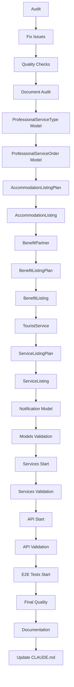

# TODOs - Hospeda Business Model System Implementation

**Session**: business-model-system
**Created**: 2025-10-29
**Status**: In Progress (Stages 4.8-4.9 Complete - 94% Models Done)
**Priority**: P0 (Critical)
**Estimated Remaining Effort**: ~110 hours
**Last Updated**: 2025-10-30

---

## Overview

This document tracks the atomic tasks for completing the Hospeda Business Model System implementation. The system consists of **35 entities** organized in **12 functional groups**, implementing a complete monetization platform with billing, subscriptions, payments, advertising, and professional services.

### Current Progress

- ✅ **Stage 1**: Foundation - Enums (26 enums + schemas) - **COMPLETE**
- ✅ **Stage 2**: Database Schemas (35 tables + migrations) - **COMPLETE**
- ✅ **Stage 3**: Zod Schemas (210 schemas) - **COMPLETE**
- 🔄 **Stage 4**: Models (34/35 complete - 97%)
  - ✅ Stage 4.1-4.7: Identity, Catalog, Subscriptions, Billing, Promotions, Advertising, Sponsorships (24 models)
  - ✅ Stage 4.8: Professional Services (2 models) - **COMPLETE**
  - ✅ Stage 4.9: Listings (8 models) - **COMPLETE**
  - ⏳ Stage 4.10: Notifications (1 model)
- ⏳ **Stage 5**: Services (0/35 complete)
- ⏳ **Stage 6**: API Routes (0/35 complete)
- ⏳ **Stage 7**: Integration & Validation

---

## Phase 0: Validation and Audit (CRITICAL - START HERE)

**Purpose**: Before continuing, validate and audit what exists through Stage 4.7 to ensure quality and completeness.

**Priority**: P0
**Estimated Time**: 8-12 hours
**Dependencies**: None

### TASK-000: Audit Existing Implementation (2-3 hours)

**Status**: 🔴 Not Started
**Priority**: P0 - MUST DO FIRST
**Type**: Analysis

**Description**: Systematically verify all completed stages (1-4.7) for completeness, correctness, and adherence to standards.

**Acceptance Criteria**:
- [x] All 26 enums exist and follow naming conventions
- [x] All 35 database tables exist with proper schemas
- [x] All 210 Zod schemas exist and pass validation
- [ ] All 24 models (4.1-4.7) exist and extend BaseModel correctly
- [x] All tests for stages 1-4.7 exist and pass
- [x] Documentation audit complete

**Checklist**:
```bash
# Enums (26 expected)
- [ ] Count enum files: packages/schemas/src/enums/*.enum.ts
- [ ] Count schema files: packages/schemas/src/enums/*.schema.ts
- [ ] Verify all enums imported in barrel file

# Database (35 tables)
- [ ] Count table schemas: packages/db/src/schemas/**/*.schema.ts
- [ ] Verify migrations exist and are applied
- [ ] Check indexes are created
- [ ] Verify constraints and triggers

# Zod Schemas (210 expected: 35 entities × 6 types)
- [ ] Count schemas: packages/schemas/src/entities/*/*.schema.ts
- [ ] Verify each entity has 6 schema types
- [ ] Check barrel exports

# Models (24 expected for 4.1-4.7)
- [ ] Count models: packages/db/src/models/*.model.ts
- [ ] Verify all extend BaseModel
- [ ] Check test coverage

# Tests
- [ ] Run: pnpm test --filter=@repo/schemas
- [ ] Run: pnpm test --filter=@repo/db
- [ ] Check coverage reports
```

**Output**: Create audit report document listing:
- What exists and is correct ✅
- What exists but has issues ⚠️
- What is missing ❌
- Recommendations for fixes

---

### TASK-001: Fix Issues from Audit (3-5 hours)

**Status**: 🔴 Blocked by TASK-000
**Priority**: P0
**Type**: Bug Fix
**Dependencies**: TASK-000

**Description**: Address all issues identified in audit before proceeding.

**Acceptance Criteria**:
- [ ] All ⚠️ issues from audit are resolved
- [ ] All ❌ missing items are created
- [ ] All tests pass
- [ ] Lint and typecheck pass
- [ ] Documentation updated

**Process**:
1. Prioritize issues (P0 > P1 > P2)
2. Fix one at a time with TDD
3. Commit after each fix
4. Re-run audit to verify

---

### TASK-002: Run Quality Checks (1 hour)

**Status**: 🔴 Blocked by TASK-001
**Priority**: P0
**Type**: Validation
**Dependencies**: TASK-001

**Description**: Run comprehensive quality checks on all completed work.

**Commands**:
```bash
# Lint
cd packages/schemas && pnpm run lint
cd packages/db && pnpm run lint

# TypeCheck
cd packages/schemas && pnpm run typecheck
cd packages/db && pnpm run typecheck

# Tests with coverage
cd packages/schemas && pnpm run test:coverage
cd packages/db && pnpm run test:coverage

# Full quality check from root
pnpm run lint
pnpm run typecheck
pnpm run test
```

**Acceptance Criteria**:
- [ ] Zero lint errors
- [ ] Zero type errors
- [ ] All tests pass
- [ ] Coverage ≥ 90% for schemas and db packages
- [ ] No security vulnerabilities in dependencies

**Output**: Quality report with all checks ✅

---

### TASK-003: Document Audit Results (1-2 hours)

**Status**: 🔴 Blocked by TASK-002
**Priority**: P1
**Type**: Documentation
**Dependencies**: TASK-002

**Description**: Create comprehensive documentation of audit findings and current state.

**Deliverables**:
- [ ] Create `AUDIT_REPORT.md` in planning session folder
- [ ] Document all findings with evidence
- [ ] Include metrics (coverage, counts, etc.)
- [ ] Add recommendations for proceeding
- [ ] Update this TODOs.md with accurate progress

**Template**:
```markdown
# Audit Report - Business Model System
## Executive Summary
## Detailed Findings
### Enums (26/26)
### Database (35/35)
### Schemas (210/210)
### Models (24/35 - 69%)
## Issues Found
## Recommendations
## Next Steps
```

---

## Phase 4: Models Layer - Completion (11 models remaining)

**Purpose**: Complete the Models layer for remaining 11 entities.

**Priority**: P0
**Estimated Time**: 20-27 hours
**Dependencies**: Phase 0 complete

---

### Stage 4.8: Professional Services Models (2 entities)

**Time**: 6-8 hours

#### TASK-100: ProfessionalServiceType Model + Tests (3-4 hours)

**Status**: ✅ Complete
**Priority**: P0
**Type**: Implementation + Tests
**Dependencies**: TASK-003
**Completed**: 2025-10-30
**Commit**: 86e11b42

**Files to Create**:
```
packages/db/src/models/professional-service-type.model.ts
packages/db/test/models/professional-service-type.model.test.ts
```

**TDD Process**:
1. **RED**: Write failing tests
   - [ ] Test: findById returns correct entity
   - [ ] Test: findAll with pagination
   - [ ] Test: create with valid data
   - [ ] Test: update existing entity
   - [ ] Test: soft delete
   - [ ] Test: filter by category enum
   - [ ] Test: isActive filtering

2. **GREEN**: Implement model
   - [ ] Create ProfessionalServiceTypeModel extending BaseModel
   - [ ] Set table = professionalServiceTypes
   - [ ] Set entityName = 'professional-service-type'
   - [ ] Add custom methods if needed

3. **REFACTOR**: Improve code quality
   - [ ] Add JSDoc comments
   - [ ] Extract common patterns
   - [ ] Optimize queries

**Acceptance Criteria**:
- [ ] Model extends BaseModel correctly
- [ ] All CRUD operations work
- [ ] Soft delete implemented
- [ ] Tests pass with ≥90% coverage
- [ ] Lint and typecheck pass

---

#### TASK-101: ProfessionalServiceOrder Model + Tests (3-4 hours)

**Status**: ✅ Complete
**Priority**: P0
**Type**: Implementation + Tests
**Dependencies**: TASK-100
**Completed**: 2025-10-30
**Commit**: 86e11b42

**Files to Create**:
```
packages/db/src/models/professional-service-order.model.ts
packages/db/test/models/professional-service-order.model.test.ts
```

**TDD Process**: Same as TASK-100

**Additional Tests**:
- [ ] Test: filter by status enum (PENDING, IN_PROGRESS, COMPLETED, etc.)
- [ ] Test: filter by serviceTypeId
- [ ] Test: filter by clientId
- [ ] Test: date range queries (orderedAt, deliveryDate, completedAt)

**Acceptance Criteria**: Same as TASK-100

---

### Stage 4.9: Listings Models (8 entities)

**Time**: 12-15 hours

#### TASK-102: AccommodationListingPlan Model + Tests (2 hours)

**Status**: ✅ Complete
**Priority**: P0
**Type**: Implementation + Tests
**Dependencies**: TASK-101
**Completed**: 2025-10-30
**Commit**: fadefd9d

**Files to Create**:
```
packages/db/src/models/accommodation-listing-plan.model.ts
packages/db/test/models/accommodation-listing-plan.model.test.ts
```

**TDD Process**: Standard BaseModel tests + custom for `limits` JSONB field

**Acceptance Criteria**: Standard model criteria

---

#### TASK-103: AccommodationListing Model + Tests (2 hours)

**Status**: ✅ Complete
**Priority**: P0
**Type**: Implementation + Tests
**Dependencies**: TASK-102
**Completed**: 2025-10-30
**Commit**: fadefd9d

**Files to Create**:
```
packages/db/src/models/accommodation-listing.model.ts
packages/db/test/models/accommodation-listing.model.test.ts
```

**Additional Tests**:
- [ ] Test: filter by status enum
- [ ] Test: filter by isTrial boolean
- [ ] Test: date range queries (fromDate, toDate, trialEndsAt)
- [ ] Test: join with accommodationListingPlan
- [ ] Test: join with accommodation (existing table)

---

#### TASK-104: BenefitPartner Model + Tests (1.5 hours)

**Status**: ✅ Complete
**Priority**: P0
**Type**: Implementation + Tests
**Dependencies**: TASK-103
**Completed**: 2025-10-30
**Commit**: b426f7af

**Files to Create**:
```
packages/db/src/models/benefit-partner.model.ts
packages/db/test/models/benefit-partner.model.test.ts
```

---

#### TASK-105: BenefitListingPlan Model + Tests (1.5 hours)

**Status**: ✅ Complete
**Priority**: P0
**Type**: Implementation + Tests
**Dependencies**: TASK-104
**Completed**: 2025-10-30
**Commit**: b426f7af

---

#### TASK-106: BenefitListing Model + Tests (2 hours)

**Status**: ✅ Complete
**Priority**: P0
**Type**: Implementation + Tests
**Dependencies**: TASK-105
**Completed**: 2025-10-30
**Commit**: b426f7af

---

#### TASK-107: TouristService Model + Tests (1.5 hours)

**Status**: ✅ Complete
**Priority**: P0
**Type**: Implementation + Tests
**Dependencies**: TASK-106
**Completed**: 2025-10-30
**Commit**: 4df019e2

---

#### TASK-108: ServiceListingPlan Model + Tests (1.5 hours)

**Status**: ✅ Complete
**Priority**: P0
**Type**: Implementation + Tests
**Dependencies**: TASK-107
**Completed**: 2025-10-30
**Commit**: 4df019e2

---

#### TASK-109: ServiceListing Model + Tests (2 hours)

**Status**: ✅ Complete
**Priority**: P0
**Type**: Implementation + Tests
**Dependencies**: TASK-108
**Completed**: 2025-10-30
**Commit**: 4df019e2

---

### Stage 4.10: Notifications Model (1 entity)

**Time**: 3-4 hours

#### TASK-110: Notification Model + Tests (3-4 hours)

**Status**: 🔴 Blocked by TASK-109
**Priority**: P0
**Type**: Implementation + Tests
**Dependencies**: TASK-109

**Files to Create**:
```
packages/db/src/models/notification.model.ts
packages/db/test/models/notification.model.test.ts
```

**Special Considerations**:
- Polymorphic recipientType (USER | CLIENT)
- Polymorphic relatedEntityType
- Multiple enum fields (status, channel, type)
- scheduledFor nullable datetime

**Additional Tests**:
- [ ] Test: filter by recipientType + recipientId
- [ ] Test: filter by status enum
- [ ] Test: filter by channel enum
- [ ] Test: filter by type enum
- [ ] Test: scheduled notifications (scheduledFor IS NOT NULL)
- [ ] Test: read/unread filtering (readAt IS NULL)
- [ ] Test: retry logic (retryCount)

---

### TASK-111: Models Layer Final Validation (2-3 hours)

**Status**: 🔴 Blocked by TASK-110
**Priority**: P0
**Type**: Validation
**Dependencies**: TASK-110

**Description**: Validate all 35 models are complete and follow patterns.

**Checklist**:
- [ ] All 35 models exist
- [ ] All extend BaseModel correctly
- [ ] All have corresponding tests
- [ ] Test coverage ≥90% for db package
- [ ] Lint and typecheck pass
- [ ] All barrel exports updated

**Commands**:
```bash
cd packages/db && pnpm run lint
cd packages/db && pnpm run typecheck
cd packages/db && pnpm run test:coverage
```

**Acceptance Criteria**:
- [ ] 35/35 models complete
- [ ] All tests pass
- [ ] Coverage ≥90%
- [ ] Zero lint/type errors
- [ ] Documentation updated

---

## Phase 5: Services Layer (35 services)

**Purpose**: Implement business logic layer using BaseCrudService pattern.

**Priority**: P0
**Estimated Time**: 50-70 hours
**Dependencies**: Phase 4 complete

**Pattern**: Each service follows same structure - estimate 1.5-2 hours per service including tests.

---

### Stage 5.1: Core Services (Group 1-3: Identity, Catalog, Subscriptions)

**Entities**: 8 services
**Time**: 12-16 hours

#### TASK-200: ClientService + Tests (2 hours)

**Status**: 🔴 Blocked by TASK-111
**Priority**: P0
**Type**: Implementation + Tests
**Dependencies**: TASK-111

**Files to Create**:
```
packages/service-core/src/services/client/client.service.ts
packages/service-core/test/services/client/client.service.test.ts
```

**Service Pattern**:
```typescript
export class ClientService extends BaseCrudService<
  Client,
  ClientModel,
  typeof ClientCreateInputSchema,
  typeof ClientUpdateInputSchema,
  typeof ClientSearchInputSchema
> {
  constructor(ctx: ServiceContext, model?: ClientModel) {
    super(ctx, model ?? new ClientModel(ctx.db));
  }

  // Add custom business logic methods
  async findByBillingEmail(email: string): Promise<Client | null> {
    // Implementation
  }
}
```

**TDD Process**:
1. **RED**: Write failing tests
   - [ ] Test: create client with valid data
   - [ ] Test: validate billing email uniqueness
   - [ ] Test: findByBillingEmail custom method
   - [ ] Test: soft delete cascades properly
   - [ ] Test: search with filters

2. **GREEN**: Implement service
   - [ ] Extend BaseCrudService
   - [ ] Add custom validation
   - [ ] Implement business rules

3. **REFACTOR**: Improve
   - [ ] Add JSDoc
   - [ ] Optimize queries
   - [ ] Extract helpers

**Acceptance Criteria**:
- [ ] Service extends BaseCrudService
- [ ] All CRUD operations work through service
- [ ] Business validation implemented
- [ ] Tests pass with ≥90% coverage
- [ ] Lint and typecheck pass

---

#### TASK-201: ClientAccessRightService + Tests (2 hours)

**Status**: 🔴 Blocked by TASK-200
**Dependencies**: TASK-200

**Special Considerations**:
- Access rights validation logic
- Check overlapping date ranges
- Validate scope polymorphic references

---

#### TASK-202: ProductService + Tests (2 hours)

**Status**: 🔴 Blocked by TASK-201
**Dependencies**: TASK-201

---

#### TASK-203: PricingPlanService + Tests (2 hours)

**Status**: 🔴 Blocked by TASK-202
**Dependencies**: TASK-202

**Special Considerations**:
- Validate billingScheme + interval combinations
- Ensure productId exists

---

#### TASK-204: PricingTierService + Tests (2 hours)

**Status**: 🔴 Blocked by TASK-203
**Dependencies**: TASK-203

**Special Considerations**:
- Validate tier quantity ranges don't overlap
- Ensure minQuantity < maxQuantity

---

#### TASK-205: SubscriptionService + Tests (2 hours)

**Status**: 🔴 Blocked by TASK-204
**Dependencies**: TASK-204

**Special Considerations**:
- Complex business logic for subscription lifecycle
- Handle status transitions (ACTIVE → PAST_DUE → CANCELLED)
- Calculate renewal dates
- Validate trial periods

**Custom Methods**:
- [ ] activateSubscription()
- [ ] cancelSubscription()
- [ ] renewSubscription()
- [ ] updatePaymentStatus()

---

#### TASK-206: PurchaseService + Tests (1.5 hours)

**Status**: 🔴 Blocked by TASK-205
**Dependencies**: TASK-205

---

#### TASK-207: SubscriptionItemService + Tests (2.5 hours)

**Status**: 🔴 Blocked by TASK-206
**Dependencies**: TASK-206
**Complexity**: HIGH - Polymorphic system

**Special Considerations**:
- CRITICAL: Polymorphic entity validation
- Validate linkedEntityId exists in target table
- Validate entityType matches actual entity
- Auto-generate CLIENT_ACCESS_RIGHT on creation

**Custom Methods**:
- [ ] validatePolymorphicReference()
- [ ] generateAccessRights()
- [ ] linkToEntity()

**Tests**:
- [ ] Test: link to each of 7 target entity types
- [ ] Test: validate invalid entityType
- [ ] Test: validate linkedEntityId doesn't exist
- [ ] Test: access rights generated correctly
- [ ] Test: subscription vs purchase source handling

---

### Stage 5.2: Billing Services (Group 4: 7 services)

**Time**: 10-14 hours

#### TASK-208 to TASK-214: Implement Billing Services

Services to implement:
- InvoiceService (2.5 hours) - Complex invoice generation logic
- InvoiceLineService (1.5 hours)
- PaymentService (2 hours) - Mercado Pago integration
- RefundService (1.5 hours)
- CreditNoteService (1.5 hours)
- PaymentMethodService (1.5 hours)
- AdPricingCatalogService (1.5 hours)

**Pattern**: Same as above, each task includes implementation + tests

---

### Stage 5.3: Promotions, Campaigns, Marketing Services (Groups 5-7: 9 services)

**Time**: 13-18 hours

Services:
- PromotionService
- DiscountCodeService - Complex validation for usage limits
- DiscountCodeUsageService
- CampaignService - Complex status management
- AdMediaAssetService
- AdSlotService
- AdSlotReservationService
- SponsorshipService - Polymorphic entityType
- FeaturedAccommodationService

---

### Stage 5.4: Professional Services & Listings (Groups 8-11: 11 services)

**Time**: 16-22 hours

Services:
- ProfessionalServiceTypeService
- ProfessionalServiceOrderService - Complex status workflow
- AccommodationListingPlanService
- AccommodationListingService
- BenefitPartnerService
- BenefitListingPlanService
- BenefitListingService
- TouristServiceService
- ServiceListingPlanService
- ServiceListingService
- NotificationService - Complex scheduling and delivery logic

---

### TASK-250: Services Layer Final Validation (3-4 hours)

**Status**: 🔴 Blocked by all Stage 5 tasks
**Priority**: P0
**Type**: Validation

**Checklist**:
- [ ] All 35 services exist
- [ ] All extend BaseCrudService
- [ ] All have comprehensive tests
- [ ] Test coverage ≥90% for service-core package
- [ ] Integration tests between services pass
- [ ] Lint and typecheck pass
- [ ] Barrel exports updated

---

## Phase 6: API Layer (35 endpoint groups)

**Purpose**: Implement RESTful API endpoints using Hono + factory patterns.

**Priority**: P0
**Estimated Time**: 35-50 hours
**Dependencies**: Phase 5 complete

**Pattern**: Each endpoint group ~1-1.5 hours (simpler due to factory functions)

---

### Stage 6.1: Core API Routes (Groups 1-3: 8 endpoint groups)

**Time**: 8-12 hours

#### TASK-300: Client API Routes + Tests (1.5 hours)

**Status**: 🔴 Blocked by TASK-250
**Priority**: P0
**Type**: Implementation + Tests
**Dependencies**: TASK-250

**Files to Create**:
```
apps/api/src/routes/clients/index.ts
apps/api/test/routes/clients/index.test.ts
```

**Implementation Pattern**:
```typescript
import { Hono } from 'hono';
import { createCRUDRoute, createListRoute } from '@/factories';
import { ClientService } from '@repo/service-core/services/client';

const app = new Hono();

// List endpoint: GET /clients
app.route('/', createListRoute(ClientService, 'clients'));

// CRUD endpoints: POST, GET /:id, PATCH /:id, DELETE /:id
app.route('/', createCRUDRoute(ClientService, 'client'));

export default app;
```

**Test Pattern**:
```typescript
describe('Client API Routes', () => {
  describe('GET /clients', () => {
    it('should return paginated list', async () => {
      // Test
    });

    it('should filter by billingEmail', async () => {
      // Test
    });
  });

  describe('POST /clients', () => {
    it('should create new client', async () => {
      // Test
    });

    it('should validate required fields', async () => {
      // Test
    });
  });

  // CRUD tests...
});
```

**Acceptance Criteria**:
- [ ] All CRUD endpoints work
- [ ] Request validation with Zod schemas
- [ ] Error handling consistent
- [ ] Authentication/authorization enforced
- [ ] Tests pass with ≥90% coverage
- [ ] API documentation generated

---

#### TASK-301 to TASK-307: Implement remaining Core API routes

Routes:
- ClientAccessRights (1.5 hours)
- Products (1 hour)
- PricingPlans (1 hour)
- PricingTiers (1 hour)
- Subscriptions (1.5 hours) - Custom endpoints for lifecycle
- Purchases (1 hour)
- SubscriptionItems (1.5 hours) - Polymorphic handling

---

### Stage 6.2-6.4: Billing, Marketing, Listings APIs (27 endpoint groups)

**Time**: 27-38 hours

Following same pattern as Stage 6.1, implement API routes for:
- Billing (7 routes)
- Promotions (3 routes)
- Campaigns & Advertising (4 routes)
- Sponsorships & Featured (2 routes)
- Professional Services (2 routes)
- Listings (9 routes)
- Notifications (1 route)

---

### TASK-350: API Layer Final Validation (3-4 hours)

**Status**: 🔴 Blocked by all Stage 6 tasks
**Priority**: P0
**Type**: Validation

**Checklist**:
- [ ] All 35 endpoint groups exist
- [ ] All routes mounted in main app
- [ ] OpenAPI documentation generated
- [ ] Authentication middleware applied
- [ ] Rate limiting configured
- [ ] Error handling consistent
- [ ] Tests pass with ≥90% coverage
- [ ] Postman/Insomnia collection created

**Commands**:
```bash
cd apps/api && pnpm run lint
cd apps/api && pnpm run typecheck
cd apps/api && pnpm run test:coverage
cd apps/api && pnpm run dev # Manual smoke testing
```

---

## Phase 7: Integration & Validation

**Purpose**: End-to-end testing and system validation.

**Priority**: P0
**Estimated Time**: 15-25 hours
**Dependencies**: Phases 4-6 complete

---

### TASK-400: E2E Subscription Flow Test (3-4 hours)

**Status**: 🔴 Blocked by TASK-350
**Priority**: P0
**Type**: E2E Test

**Test Scenario**:
1. Create client
2. Create product + pricing plan
3. Purchase subscription
4. Create subscription item (featured accommodation)
5. Verify access rights generated
6. Generate invoice
7. Process payment
8. Verify subscription active

**Files**:
```
apps/api/test/e2e/subscription-flow.test.ts
```

---

### TASK-401: E2E Campaign Flow Test (2-3 hours)

**Test Scenario**:
1. Create client
2. Purchase campaign product
3. Create campaign
4. Upload media assets
5. Reserve ad slots
6. Activate campaign
7. Complete and invoice

---

### TASK-402: E2E Professional Service Flow Test (2-3 hours)

**Test Scenario**:
1. Create client
2. Browse service types
3. Order professional service
4. Track order status
5. Complete and invoice
6. Process payment

---

### TASK-403: E2E Billing and Invoicing Test (3-4 hours)

**Test Scenario**:
1. Multiple subscriptions and purchases
2. Generate invoices
3. Apply discount codes
4. Process payments
5. Handle refunds
6. Issue credit notes

---

### TASK-404: Polymorphic System Validation (2-3 hours)

**Test Scenario**:
- Create subscription items for all 7 target entity types
- Verify access rights generation
- Test polymorphic queries
- Validate referential integrity

---

### TASK-405: Performance Testing (3-4 hours)

**Tests**:
- [ ] Load testing (100 concurrent users)
- [ ] Database query performance (< 300ms)
- [ ] API response times (< 500ms)
- [ ] Pagination performance (1000+ records)

---

### TASK-406: Security Audit (2-3 hours)

**Checklist**:
- [ ] RBAC properly enforced
- [ ] SQL injection prevention validated
- [ ] XSS prevention validated
- [ ] CSRF tokens validated
- [ ] Payment data encryption verified
- [ ] PCI compliance checklist

---

### TASK-407: Final Quality Check (2-3 hours)

**Commands**:
```bash
# Full monorepo checks
pnpm run lint
pnpm run typecheck
pnpm run test
pnpm run test:coverage

# Build all packages
pnpm run build

# Run E2E tests
pnpm run test:e2e
```

**Acceptance Criteria**:
- [ ] Zero lint errors
- [ ] Zero type errors
- [ ] All tests pass (unit + integration + E2E)
- [ ] Overall coverage ≥90%
- [ ] All builds successful
- [ ] Performance targets met
- [ ] Security audit passed

---

## Phase 8: Documentation & Deployment Prep

**Purpose**: Complete documentation and prepare for deployment.

**Priority**: P1
**Estimated Time**: 10-15 hours
**Dependencies**: Phase 7 complete

---

### TASK-500: API Documentation (3-4 hours)

**Deliverables**:
- [ ] OpenAPI/Swagger documentation
- [ ] Postman collection
- [ ] Authentication guide
- [ ] Rate limiting docs
- [ ] Error codes reference
- [ ] Webhook documentation (Mercado Pago)

---

### TASK-501: Database Documentation (2-3 hours)

**Deliverables**:
- [ ] ER diagram updated
- [ ] Table schemas documented
- [ ] Index documentation
- [ ] Migration guide
- [ ] Seeding guide

---

### TASK-502: Developer Guide (3-4 hours)

**Deliverables**:
- [ ] Architecture overview
- [ ] Code patterns guide
- [ ] Testing strategy
- [ ] Contribution guidelines
- [ ] Troubleshooting guide

---

### TASK-503: Deployment Guide (2-3 hours)

**Deliverables**:
- [ ] Environment setup
- [ ] Migration procedures
- [ ] Rollback procedures
- [ ] Monitoring setup
- [ ] Backup strategy

---

### TASK-504: Update CLAUDE.md (1 hour)

**Updates**:
- [ ] Add learnings from implementation
- [ ] Document new patterns discovered
- [ ] Update common mistakes section
- [ ] Add business model specific guidelines

---

## Metrics & Tracking

### Completion Tracking

**Overall Progress**:
- Phases Complete: 3/8 (37.5%)
- Tasks Complete: ~100/150+ (estimate)
- Hours Spent: ~110 hours (estimate)
- Hours Remaining: ~110 hours

**By Phase**:
- ✅ Phase 1: Foundation (Enums) - 100%
- ✅ Phase 2: Database - 100%
- ✅ Phase 3: Schemas - 100%
- 🔄 Phase 4: Models - 97% (34/35)
- ⏳ Phase 5: Services - 0%
- ⏳ Phase 6: API - 0%
- ⏳ Phase 7: Integration - 0%
- ⏳ Phase 8: Documentation - 0%

**By Entity Group**:
- ✅ Identity & Clients: 100%
- ✅ Catalog & Pricing: 100%
- ✅ Subscriptions & Purchases: 100%
- ✅ Billing & Payments: 100%
- ✅ Promotions & Discounts: 100%
- ✅ Campaigns & Advertising: 100%
- ✅ Sponsorships & Featured: 100%
- ✅ Professional Services: Models complete (DB/Schemas/Models done, Services/API pending)
- ✅ Accommodation Listings: Models complete (DB/Schemas/Models done, Services/API pending)
- ✅ Benefit Listings: Models complete (DB/Schemas/Models done, Services/API pending)
- ✅ Service Listings: Models complete (DB/Schemas/Models done, Services/API pending)
- ⏳ Notifications: 0/3 layers (DB/Schemas done, Models/Services/API pending)

### Code Quality Metrics

**Target**:
- Test Coverage: ≥90%
- Lint Errors: 0
- Type Errors: 0
- Security Issues: 0

**Current** (Need to measure in TASK-000):
- Test Coverage: TBD
- Lint Errors: TBD
- Type Errors: TBD

---

## Dependencies Graph



---

## Notes & Decisions

### Implementation Strategy

1. **Start with Phase 0 (Audit)** - CRITICAL before proceeding
2. **Complete Phase 4** (Models) before moving to services
3. **Services in functional groups** - easier to test related entities together
4. **API routes use factories** - fast implementation
5. **E2E tests before documentation** - validate system works

### Risk Mitigation

**High-Risk Areas**:
1. **Polymorphic system** (SUBSCRIPTION_ITEM) - Extra testing needed
2. **Payment integration** (Mercado Pago) - Webhook reliability
3. **Access rights generation** - Must be real-time and correct
4. **Data migrations** - Need rollback plan

**Mitigation Strategies**:
- Extra test coverage for polymorphic code (95%+)
- Webhook retry queue with exponential backoff
- Access rights validation in services layer
- Migration testing in staging first

### Quality Gates

Each phase must pass quality gates before proceeding:

**Phase 4 Gate** (TASK-111):
- [ ] All 35 models complete
- [ ] Tests ≥90% coverage
- [ ] Zero lint/type errors

**Phase 5 Gate** (TASK-250):
- [ ] All 35 services complete
- [ ] Business logic validated
- [ ] Integration tests pass

**Phase 6 Gate** (TASK-350):
- [ ] All 35 API groups complete
- [ ] API documentation generated
- [ ] Smoke tests pass

**Phase 7 Gate** (TASK-407):
- [ ] All E2E scenarios pass
- [ ] Performance targets met
- [ ] Security audit passed

---

## Change Log

| Date | Change | Author |
|------|--------|--------|
| 2025-10-29 | Initial TODO breakdown created | Claude (Principal Architect) |
| 2025-10-30 | Completed TASK-100 to TASK-109 (Stages 4.8-4.9) | Claude (Principal Architect) |
| 2025-10-30 | 10 models added: Professional Services (2), Listings (8) | Claude (Principal Architect) |
| 2025-10-30 | 97 tests added, 875 total tests passing | Claude (Principal Architect) |

---

## Questions & Clarifications

1. **Q**: Should we implement webhook retry logic in Phase 5 or Phase 7?
   **A**: Phase 5 (PaymentService) - needed for reliability

2. **Q**: Do we need real Mercado Pago sandbox credentials for testing?
   **A**: Yes - obtain before starting PaymentService implementation

3. **Q**: Should notifications be sent synchronously or via queue?
   **A**: Queue (future) - for v1, synchronous is acceptable

---

*Last Updated: 2025-10-30*
*Status: Phase 4 - 97% Complete (34/35 models)*
*Next: TASK-110 - Notification Model*
