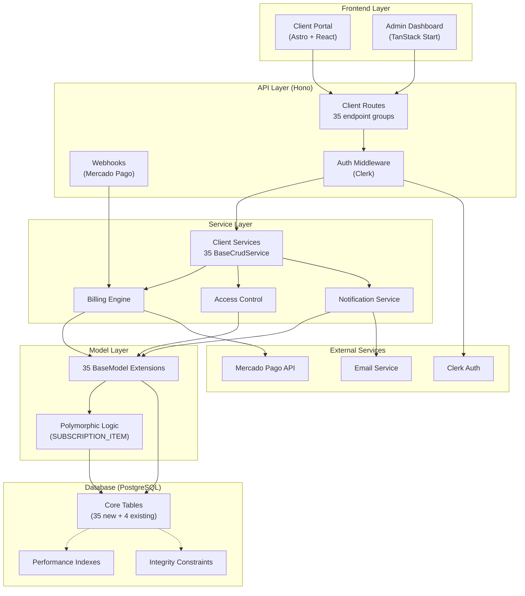
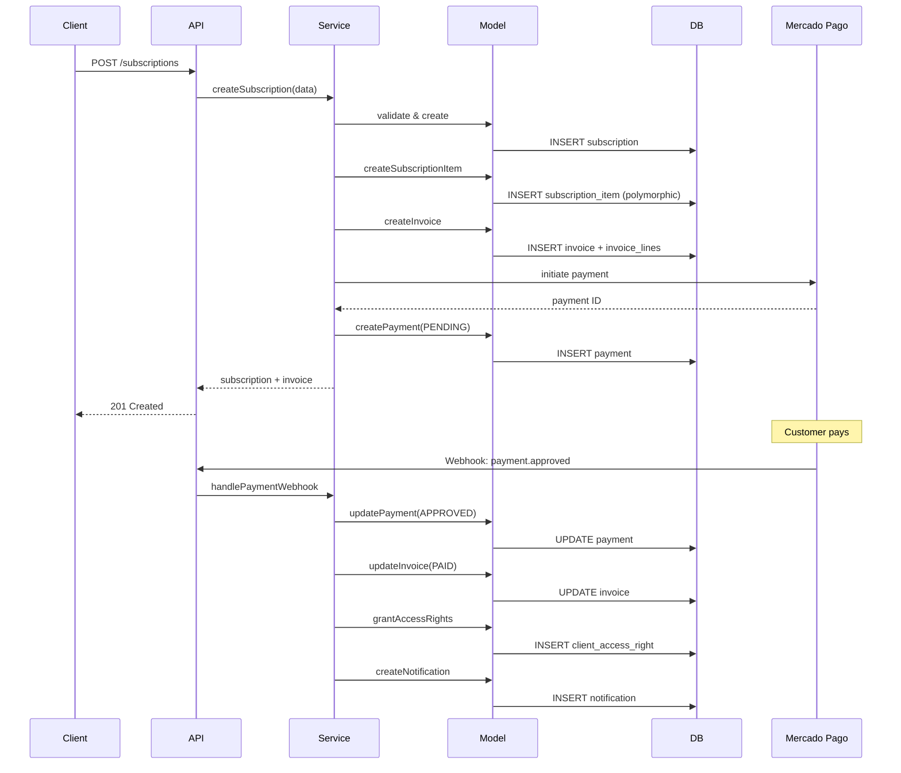
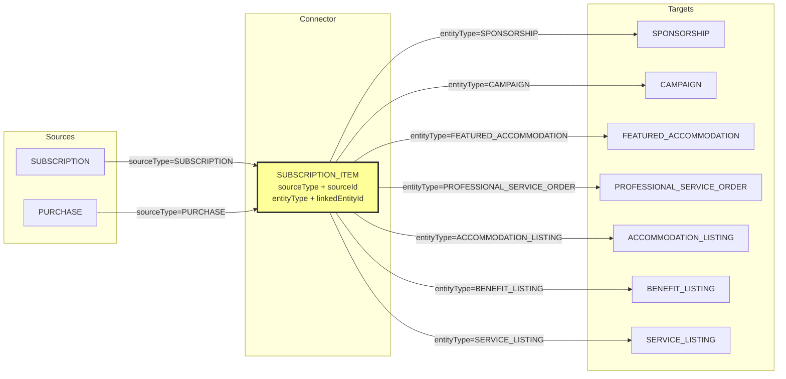
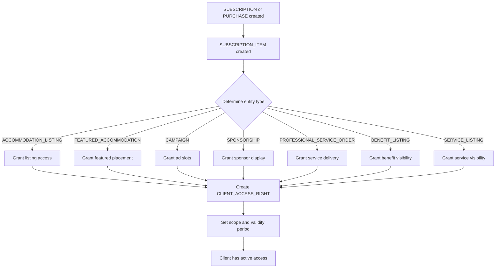

# Technical Analysis: Hospeda Business Model System

**Date**: 2025-10-29
**Status**: In Progress (Stage 4.7 Complete)
**Priority**: P0 (Critical)
**Owner**: Technical Team
**Complexity**: Very High

---

## 1. Overview

### 1.1 Feature Summary

Implementation of a comprehensive monetization and business model system for Hospeda platform consisting of:

- **35 new database entities** organized in 12 functional groups
- **26 enum types** for type-safe operations
- **210 Zod validation schemas** (6 per entity: base, create, update, query, relations, batch)
- **Polymorphic architecture** using SUBSCRIPTION_ITEM to flexibly link subscriptions/purchases to 7 target entity types
- **Complete billing system** with invoicing, payments (Mercado Pago), refunds, and credit notes
- **Unified access control** via CLIENT_ACCESS_RIGHT based on active subscriptions
- **Integration with 4 existing entities** (USER, ACCOMMODATION, POST, EVENT)

### 1.2 Technical Complexity

**Rating:** Very High

**Justification:**

- **35 entities** requiring full CRUD operations across 4 layers (Database → Model → Service → API)
- **Polymorphic system** with complex type relationships and validation rules
- **Real-time billing** requiring transactional consistency
- **External integration** with payment gateway (Mercado Pago) requiring webhook handling
- **Access control system** that must be real-time and reliable
- **Multiple enum types** requiring strict validation across all layers
- **Data integrity constraints** for financial operations
- **Migration complexity** from existing accommodation system

### 1.3 Estimated Effort

**Total:** ~220 hours

#### Breakdown

- **Database (35 tables + indexes + constraints)**: 50-70 hours
- **Schemas (210 Zod schemas + 26 enums)**: 40-50 hours
- **Models (35 BaseModel extensions)**: 35-45 hours
- **Services (35 BaseCrudService extensions)**: 50-70 hours
- **API Routes (35 endpoint groups)**: 35-50 hours
- **Testing (140 test suites across 4 layers)**: 70-90 hours
- **Integration & validation**: 15-25 hours
- **Documentation**: 10-15 hours

### 1.4 Current Progress Assessment

**Implementation reached:** Stage 4.7 (Models for Sponsorships and Featured)

**What exists (based on implementation_phases.md):**

- ✅ **Stage 1**: Enums completed (26 enums + schemas)
- ✅ **Stage 2**: Database schemas and migrations (35 tables)
- ✅ **Stage 3**: Zod schemas (210 schemas complete)
- ✅ **Stage 4.1-4.7**: Models for 24 out of 35 entities:
  - Identity & Clients (CLIENT, CLIENT_ACCESS_RIGHT)
  - Catalog & Pricing (PRODUCT, PRICING_PLAN, PRICING_TIER)
  - Subscriptions (SUBSCRIPTION, PURCHASE, SUBSCRIPTION_ITEM)
  - Billing (INVOICE, INVOICE_LINE, PAYMENT, REFUND, CREDIT_NOTE, PAYMENT_METHOD, AD_PRICING_CATALOG)
  - Promotions (PROMOTION, DISCOUNT_CODE, DISCOUNT_CODE_USAGE)
  - Advertising (CAMPAIGN, AD_MEDIA_ASSET, AD_SLOT, AD_SLOT_RESERVATION)
  - Sponsorships (SPONSORSHIP, FEATURED_ACCOMMODATION)

**What needs completion:**

- ⏳ **Stage 4.8**: Models for Professional Services (2 entities)
- ⏳ **Stage 4.9**: Models for Listings (8 entities: accommodation, benefit, service listings + plans)
- ⏳ **Stage 4.10**: Models for Notification (1 entity)
- ⏳ **Stage 5**: Services layer (35 services)
- ⏳ **Stage 6**: API routes (35 endpoint groups)
- ⏳ **Stage 7**: Integration tests and E2E validation

**Estimated remaining effort:** ~130 hours

---

## 2. Architecture Analysis

### 2.1 Affected Layers

- [x] Database (Drizzle schemas, migrations, indexes, constraints)
- [x] Enums (26 enum types + Zod schemas)
- [x] Validation (210 Zod schemas)
- [ ] Model (35 BaseModel extensions) - **24/35 complete (69%)**
- [ ] Service (35 BaseCrudService extensions) - **Not started**
- [ ] API (35 Hono route groups) - **Not started**
- [ ] Frontend (Client portal + Admin dashboard components) - **Not started**

### 2.2 New vs Existing

**New entities:** 35 entities across 12 functional groups

**Modified entities:**

- `USER` table: Add relationship to CLIENT (one-to-one optional)
- `ACCOMMODATION` table: Add foreign key reference for ACCOMMODATION_LISTING
- `POST` table: Add relationship for SPONSORSHIP
- `EVENT` table: Add relationship for SPONSORSHIP

**Reusable components:**

- `BaseModel<T>` - All 35 models extend this
- `BaseCrudService<T, TModel, TCreate, TUpdate, TSearch>` - All 35 services extend this
- `createCRUDRoute()` factory - All CRUD endpoints use this
- `createListRoute()` factory - All list endpoints use this
- Zod schema patterns - Consistent validation across all entities

### 2.3 Architecture Diagram



### 2.4 Data Flow Diagrams

#### 2.4.1 Subscription Purchase Flow



#### 2.4.2 Polymorphic SUBSCRIPTION_ITEM Resolution



---

## 3. Technology Stack Decisions

### 3.1 Database Layer: PostgreSQL + Drizzle ORM

**Decision:** Use PostgreSQL 15+ with Drizzle ORM

**Why:**

- **Strong ACID compliance**: Critical for financial transactions
- **JSONB support**: Flexible metadata storage for product configurations, pricing plans, etc.
- **Excellent foreign key support**: Complex relationships between 35 entities
- **Drizzle ORM benefits**:
  - Type-safe queries inferred from schema
  - Lightweight and performant (no heavy runtime)
  - First-class TypeScript support
  - Easy migrations with `drizzle-kit`
  - Existing pattern in Hospeda project

**Alternatives considered:**

- **Prisma**: Heavier runtime, less flexible for complex queries
- **TypeORM**: More boilerplate, less type safety
- **Raw SQL**: Maximum control but loses type safety and increases development time

**Trade-offs:**

- Drizzle has smaller ecosystem than Prisma
- Learning curve for polymorphic patterns
- Migration tooling less mature than Prisma

### 3.2 Backend Layer: Hono + TypeScript

**Decision:** Use Hono.js web framework with strict TypeScript

**Why:**

- **Lightweight and fast**: Excellent performance for high-traffic billing endpoints
- **Edge-ready**: Can deploy to Vercel Edge, Cloudflare Workers if needed
- **Type-safe routing**: RPC-like type inference for API contracts
- **Middleware ecosystem**: Easy to add auth, validation, CORS
- **Existing pattern**: Already used in Hospeda API layer
- **Factory patterns**: Supports `createCRUDRoute()` and `createListRoute()` factories

**Alternatives considered:**

- **Express**: More mature but slower, less type-safe
- **Fastify**: Fast but more complex, heavier than Hono
- **NestJS**: Over-engineered for this use case

### 3.3 Validation Layer: Zod Schemas

**Decision:** Centralize all validation in `@repo/schemas` package using Zod

**Why:**

- **Single source of truth**: Database types inferred from Zod schemas via `z.infer<>`
- **Runtime validation**: Catch invalid data at API boundaries
- **Reusable across layers**: Same schemas for API validation, service layer, and database inserts
- **Excellent TypeScript integration**: Auto-completion and type checking
- **Composable schemas**: Base schemas extended for create/update/query operations
- **Clear error messages**: Zod provides detailed validation errors

**Pattern:**

```typescript
// packages/schemas/src/entities/client/client.schema.ts
export const ClientSchema = z.object({
  id: z.string().uuid(),
  userId: z.string().uuid().nullable(),
  name: z.string().min(1).max(255),
  billingEmail: z.string().email(),
  // ... other fields
});

export type Client = z.infer<typeof ClientSchema>;

// packages/schemas/src/entities/client/client-create.schema.ts
export const ClientCreateInputSchema = ClientSchema.omit({
  id: true,
  createdAt: true,
  updatedAt: true,
  // ... audit fields
});

export type ClientCreateInput = z.infer<typeof ClientCreateInputSchema>;
```

### 3.4 Testing Strategy: Vitest + TDD

**Decision:** Strict TDD with Vitest, 90% minimum coverage

**Why:**

- **TDD enforced**: Write tests first for all 35 entities
- **Fast execution**: Vitest is faster than Jest
- **Native ESM support**: No transpilation needed
- **Existing pattern**: Already used in Hospeda
- **Watch mode**: Excellent developer experience

**Coverage requirements:**

- Unit tests: 90%+ for schemas, models, services
- Integration tests: All API endpoints
- E2E tests: Critical flows (subscription purchase, payment webhook, access grant)

---

## 4. Database Design

### 4.1 Entity Relationship Overview

```mermaid
erDiagram
    %% Core Identity
    USER ||--o| CLIENT : "optional owner"
    CLIENT ||--o{ SUBSCRIPTION : "holds"
    CLIENT ||--o{ PURCHASE : "buys"
    CLIENT ||--o{ INVOICE : "billed to"
    CLIENT ||--o{ PAYMENT_METHOD : "stores"
    CLIENT ||--o{ CLIENT_ACCESS_RIGHT : "owns"

    %% Catalog
    PRODUCT ||--o{ PRICING_PLAN : "has"
    PRICING_PLAN ||--o{ PRICING_TIER : "tiers"
    PRICING_PLAN ||--o{ SUBSCRIPTION : "used in"
    PRICING_PLAN ||--o{ PURCHASE : "used in"

    %% Subscriptions (Polymorphic Core)
    SUBSCRIPTION ||--o{ SUBSCRIPTION_ITEM : "contains"
    PURCHASE ||--o{ SUBSCRIPTION_ITEM : "contains"
    SUBSCRIPTION_ITEM ||--o{ CLIENT_ACCESS_RIGHT : "grants"
    SUBSCRIPTION_ITEM }o--|| SPONSORSHIP : "polymorphic target"
    SUBSCRIPTION_ITEM }o--|| CAMPAIGN : "polymorphic target"
    SUBSCRIPTION_ITEM }o--|| FEATURED_ACCOMMODATION : "polymorphic target"
    SUBSCRIPTION_ITEM }o--|| PROFESSIONAL_SERVICE_ORDER : "polymorphic target"
    SUBSCRIPTION_ITEM }o--|| ACCOMMODATION_LISTING : "polymorphic target"
    SUBSCRIPTION_ITEM }o--|| BENEFIT_LISTING : "polymorphic target"
    SUBSCRIPTION_ITEM }o--|| SERVICE_LISTING : "polymorphic target"

    %% Billing
    INVOICE ||--o{ INVOICE_LINE : "contains"
    INVOICE ||--o{ PAYMENT : "paid by"
    PAYMENT ||--o{ REFUND : "refunded via"
    INVOICE ||--o{ CREDIT_NOTE : "credited by"
    SUBSCRIPTION_ITEM ||--o{ INVOICE_LINE : "billed as"

    %% Promotions
    PROMOTION ||--o{ DISCOUNT_CODE : "issues"
    DISCOUNT_CODE ||--o{ DISCOUNT_CODE_USAGE : "usage tracking"

    %% Advertising
    CAMPAIGN ||--o{ AD_MEDIA_ASSET : "uses"
    CAMPAIGN ||--o{ AD_SLOT_RESERVATION : "reserves"
    AD_SLOT ||--o{ AD_SLOT_RESERVATION : "reserved via"
    AD_PRICING_CATALOG ||--o{ PRICING_PLAN : "defines pricing"

    %% Sponsorships
    POST ||--o{ SPONSORSHIP : "sponsored via"
    EVENT ||--o{ SPONSORSHIP : "sponsored via"

    %% Listings
    ACCOMMODATION ||--o{ ACCOMMODATION_LISTING : "listed via"
    ACCOMMODATION ||--o{ FEATURED_ACCOMMODATION : "featured via"
    ACCOMMODATION_LISTING_PLAN ||--o{ ACCOMMODATION_LISTING : "defines"
    BENEFIT_PARTNER ||--o{ BENEFIT_LISTING : "lists"
    BENEFIT_LISTING_PLAN ||--o{ BENEFIT_LISTING : "defines"
    TOURIST_SERVICE ||--o{ SERVICE_LISTING : "lists"
    SERVICE_LISTING_PLAN ||--o{ SERVICE_LISTING : "defines"

    %% Professional Services
    PROFESSIONAL_SERVICE_TYPE ||--o{ PROFESSIONAL_SERVICE_ORDER : "ordered as"

    %% Notifications
    USER ||--o{ NOTIFICATION : "receives"
    CLIENT ||--o{ NOTIFICATION : "receives"
```



### 4.2 Key Tables (Critical Subset)

#### 4.2.1 CLIENT (Identity Core)

```typescript
// packages/db/src/schemas/client.schema.ts
export const clients = pgTable('clients', {
  id: uuid('id').defaultRandom().primaryKey(),
  userId: uuid('user_id').references(() => users.id, { onDelete: 'set null' }).unique(),
  name: varchar('name', { length: 255 }).notNull(),
  billingEmail: varchar('billing_email', { length: 255 }).notNull().unique(),
  // Audit fields
  createdAt: timestamp('created_at').defaultNow().notNull(),
  updatedAt: timestamp('updated_at').defaultNow().notNull(),
  createdById: uuid('created_by_id').references(() => users.id),
  updatedById: uuid('updated_by_id').references(() => users.id),
  deletedAt: timestamp('deleted_at'), // Soft delete
  deletedById: uuid('deleted_by_id').references(() => users.id),
  adminInfo: jsonb('admin_info'), // Admin notes, metadata
});

// Indexes
export const clientIndexes = {
  billingEmailIdx: index('idx_clients_billing_email').on(clients.billingEmail),
  userIdIdx: index('idx_clients_user_id').on(clients.userId),
  deletedAtIdx: index('idx_clients_deleted_at').on(clients.deletedAt),
};
```

#### 4.2.2 SUBSCRIPTION_ITEM (Polymorphic Core)

```typescript
// packages/db/src/schemas/subscription-item.schema.ts
export const subscriptionItems = pgTable('subscription_items', {
  id: uuid('id').defaultRandom().primaryKey(),
  // Source (what was purchased)
  sourceId: uuid('source_id').notNull(), // subscriptionId or purchaseId
  sourceType: varchar('source_type', { length: 20 }).notNull(), // 'SUBSCRIPTION' | 'PURCHASE'
  // Target (what it grants access to)
  linkedEntityId: uuid('linked_entity_id').notNull(), // Polymorphic reference
  entityType: varchar('entity_type', { length: 50 }).notNull(), // 'SPONSORSHIP' | 'CAMPAIGN' | etc.
  // Audit fields
  createdAt: timestamp('created_at').defaultNow().notNull(),
  updatedAt: timestamp('updated_at').defaultNow().notNull(),
  createdById: uuid('created_by_id').references(() => users.id),
  updatedById: uuid('updated_by_id').references(() => users.id),
  deletedAt: timestamp('deleted_at'),
  deletedById: uuid('deleted_by_id').references(() => users.id),
  adminInfo: jsonb('admin_info'),
});

// Indexes for polymorphic queries
export const subscriptionItemIndexes = {
  sourceIdx: index('idx_subscription_items_source').on(
    subscriptionItems.sourceType,
    subscriptionItems.sourceId
  ),
  targetIdx: index('idx_subscription_items_target').on(
    subscriptionItems.entityType,
    subscriptionItems.linkedEntityId
  ),
  polymorphicIdx: index('idx_subscription_items_polymorphic').on(
    subscriptionItems.sourceType,
    subscriptionItems.sourceId,
    subscriptionItems.entityType,
    subscriptionItems.linkedEntityId
  ),
};
```

#### 4.2.3 CLIENT_ACCESS_RIGHT (Access Control)

```typescript
// packages/db/src/schemas/client-access-right.schema.ts
export const clientAccessRights = pgTable('client_access_rights', {
  id: uuid('id').defaultRandom().primaryKey(),
  clientId: uuid('client_id').notNull().references(() => clients.id, { onDelete: 'cascade' }),
  subscriptionItemId: uuid('subscription_item_id').references(() => subscriptionItems.id, { onDelete: 'cascade' }),
  feature: varchar('feature', { length: 100 }).notNull(), // 'listing', 'featured', 'sponsorship', etc.
  scope: varchar('scope', { length: 50 }).notNull(), // 'ACCOMMODATION' | 'PLACEMENT' | 'MERCHANT' | 'SERVICE' | 'GLOBAL'
  scopeId: uuid('scope_id'), // Polymorphic reference to specific entity
  scopeType: varchar('scope_type', { length: 50 }), // Entity type for polymorphic reference
  validFrom: timestamp('valid_from').notNull(),
  validTo: timestamp('valid_to').notNull(),
  // Audit fields
  createdAt: timestamp('created_at').defaultNow().notNull(),
  updatedAt: timestamp('updated_at').defaultNow().notNull(),
  createdById: uuid('created_by_id').references(() => users.id),
  updatedById: uuid('updated_by_id').references(() => users.id),
  deletedAt: timestamp('deleted_at'),
  deletedById: uuid('deleted_by_id').references(() => users.id),
  adminInfo: jsonb('admin_info'),
});

// Indexes for access checks
export const clientAccessRightIndexes = {
  clientIdx: index('idx_client_access_rights_client').on(clientAccessRights.clientId),
  featureIdx: index('idx_client_access_rights_feature').on(clientAccessRights.feature),
  scopeIdx: index('idx_client_access_rights_scope').on(
    clientAccessRights.scope,
    clientAccessRights.scopeId
  ),
  validityIdx: index('idx_client_access_rights_validity').on(
    clientAccessRights.validFrom,
    clientAccessRights.validTo
  ),
  activeAccessIdx: index('idx_client_access_rights_active').on(
    clientAccessRights.clientId,
    clientAccessRights.feature,
    clientAccessRights.validFrom,
    clientAccessRights.validTo
  ).where(sql`${clientAccessRights.deletedAt} IS NULL`),
};
```

### 4.3 Complete Entity List (35 Tables)

**Group 1: Identity & Clients (2)**

1. CLIENT
2. CLIENT_ACCESS_RIGHT

**Group 2: Catalog & Pricing (3)**

3. PRODUCT
4. PRICING_PLAN
5. PRICING_TIER

**Group 3: Subscriptions & Purchases (3)**

6. SUBSCRIPTION
7. PURCHASE
8. SUBSCRIPTION_ITEM

**Group 4: Billing & Payments (7)**

9. INVOICE
10. INVOICE_LINE
11. PAYMENT
12. REFUND
13. CREDIT_NOTE
14. PAYMENT_METHOD
15. AD_PRICING_CATALOG

**Group 5: Promotions & Discounts (3)**

16. PROMOTION
17. DISCOUNT_CODE
18. DISCOUNT_CODE_USAGE

**Group 6: Campaigns & Advertising (4)**

19. CAMPAIGN
20. AD_MEDIA_ASSET
21. AD_SLOT
22. AD_SLOT_RESERVATION

**Group 7: Sponsorships & Featured (2)**

23. SPONSORSHIP
24. FEATURED_ACCOMMODATION

**Group 8: Professional Services (2)**

25. PROFESSIONAL_SERVICE_TYPE
26. PROFESSIONAL_SERVICE_ORDER

**Group 9: Accommodation Listings (2)**

27. ACCOMMODATION_LISTING_PLAN
28. ACCOMMODATION_LISTING

**Group 10: Benefit Listings (3)**

29. BENEFIT_PARTNER
30. BENEFIT_LISTING_PLAN
31. BENEFIT_LISTING

**Group 11: Service Listings (3)**

32. TOURIST_SERVICE
33. SERVICE_LISTING_PLAN
34. SERVICE_LISTING

**Group 12: Notifications (1)**

35. NOTIFICATION

### 4.4 Performance Indexes Strategy

**Critical indexes (implemented in database schema):**

```sql
-- Polymorphic query optimization
CREATE INDEX idx_subscription_items_polymorphic ON subscription_items(
  source_type, source_id, entity_type, linked_entity_id
) WHERE deleted_at IS NULL;

-- Access control real-time checks
CREATE INDEX idx_client_access_rights_active ON client_access_rights(
  client_id, feature, valid_from, valid_to
) WHERE deleted_at IS NULL;

-- Billing query optimization
CREATE INDEX idx_invoices_client_status ON invoices(client_id, status, due_date)
  WHERE deleted_at IS NULL;

-- Payment processing
CREATE INDEX idx_payments_provider_status ON payments(provider, status, created_at)
  WHERE deleted_at IS NULL;

-- Subscription lookups
CREATE INDEX idx_subscriptions_client_status ON subscriptions(client_id, status, end_at)
  WHERE deleted_at IS NULL;

-- Campaign date range queries
CREATE INDEX idx_campaigns_active ON campaigns(status, from_date, to_date)
  WHERE deleted_at IS NULL;

-- Notification queue processing
CREATE INDEX idx_notifications_pending ON notifications(status, scheduled_for)
  WHERE deleted_at IS NULL AND status = 'PENDING';
```

### 4.5 Data Integrity Constraints

**Database-level constraints:**

```sql
-- SUBSCRIPTION_ITEM polymorphic validation
ALTER TABLE subscription_items ADD CONSTRAINT chk_subscription_items_source_type
  CHECK (source_type IN ('SUBSCRIPTION', 'PURCHASE'));

ALTER TABLE subscription_items ADD CONSTRAINT chk_subscription_items_entity_type
  CHECK (entity_type IN (
    'SPONSORSHIP', 'CAMPAIGN', 'FEATURED_ACCOMMODATION',
    'PROFESSIONAL_SERVICE_ORDER', 'ACCOMMODATION_LISTING',
    'BENEFIT_LISTING', 'SERVICE_LISTING'
  ));

-- CLIENT_ACCESS_RIGHT scope validation
ALTER TABLE client_access_rights ADD CONSTRAINT chk_client_access_rights_scope
  CHECK (scope IN ('ACCOMMODATION', 'PLACEMENT', 'MERCHANT', 'SERVICE', 'GLOBAL'));

-- INVOICE status validation
ALTER TABLE invoices ADD CONSTRAINT chk_invoices_status
  CHECK (status IN ('OPEN', 'PAID', 'VOID'));

-- PAYMENT status validation
ALTER TABLE payments ADD CONSTRAINT chk_payments_status
  CHECK (status IN ('PENDING', 'APPROVED', 'REJECTED'));

-- SUBSCRIPTION status validation
ALTER TABLE subscriptions ADD CONSTRAINT chk_subscriptions_status
  CHECK (status IN ('ACTIVE', 'PAST_DUE', 'CANCELLED', 'EXPIRED'));

-- Date range validations
ALTER TABLE subscriptions ADD CONSTRAINT chk_subscriptions_dates
  CHECK (start_at < end_at);

ALTER TABLE client_access_rights ADD CONSTRAINT chk_client_access_rights_dates
  CHECK (valid_from < valid_to);

ALTER TABLE campaigns ADD CONSTRAINT chk_campaigns_dates
  CHECK (from_date < to_date);

-- Currency amount validation (must be positive)
ALTER TABLE invoices ADD CONSTRAINT chk_invoices_total
  CHECK (total_minor >= 0);

ALTER TABLE payments ADD CONSTRAINT chk_payments_amount
  CHECK (amount_minor >= 0);
```

**Triggers for automatic operations:**

```sql
-- Auto-update updatedAt timestamp
CREATE OR REPLACE FUNCTION update_updated_at_column()
RETURNS TRIGGER AS $$
BEGIN
  NEW.updated_at = NOW();
  RETURN NEW;
END;
$$ language 'plpgsql';

CREATE TRIGGER update_clients_updated_at BEFORE UPDATE ON clients
  FOR EACH ROW EXECUTE FUNCTION update_updated_at_column();

-- Repeat for all 35 tables
-- (Implementation note: Generate via migration script)

-- Validate subscription item target exists (example for ACCOMMODATION_LISTING)
CREATE OR REPLACE FUNCTION validate_subscription_item_target()
RETURNS TRIGGER AS $$
BEGIN
  IF NEW.entity_type = 'ACCOMMODATION_LISTING' THEN
    IF NOT EXISTS (SELECT 1 FROM accommodation_listings WHERE id = NEW.linked_entity_id) THEN
      RAISE EXCEPTION 'Invalid linked_entity_id for entity_type ACCOMMODATION_LISTING';
    END IF;
  ELSIF NEW.entity_type = 'CAMPAIGN' THEN
    IF NOT EXISTS (SELECT 1 FROM campaigns WHERE id = NEW.linked_entity_id) THEN
      RAISE EXCEPTION 'Invalid linked_entity_id for entity_type CAMPAIGN';
    END IF;
  END IF;
  -- Add other entity types...
  RETURN NEW;
END;
$$ language 'plpgsql';

CREATE TRIGGER validate_subscription_item_target_trigger
  BEFORE INSERT OR UPDATE ON subscription_items
  FOR EACH ROW EXECUTE FUNCTION validate_subscription_item_target();
```

---

## 5. Enum & Type System

### 5.1 Complete Enum Inventory (26 Enums)

**Location:** `packages/schemas/src/enums/`

**Pattern:**

```typescript
// packages/schemas/src/enums/subscription-status.enum.ts
export enum SubscriptionStatusEnum {
  ACTIVE = 'ACTIVE',
  PAST_DUE = 'PAST_DUE',
  CANCELLED = 'CANCELLED',
  EXPIRED = 'EXPIRED',
}

// packages/schemas/src/enums/subscription-status.schema.ts
import { z } from 'zod';
import { SubscriptionStatusEnum } from './subscription-status.enum';

export const SubscriptionStatusEnumSchema = z.nativeEnum(SubscriptionStatusEnum);
```

**Full List:**

1. **ProductTypeEnum** - SPONSORSHIP | CAMPAIGN | FEATURED | PROF_SERVICE | LISTING_PLAN | PLACEMENT_RATE
2. **BillingSchemeEnum** - ONE_TIME | RECURRING
3. **BillingIntervalEnum** - MONTH | YEAR | BIYEAR
4. **SubscriptionStatusEnum** - ACTIVE | PAST_DUE | CANCELLED | EXPIRED
5. **SubscriptionItemSourceTypeEnum** - SUBSCRIPTION | PURCHASE
6. **SubscriptionItemEntityTypeEnum** - SPONSORSHIP | CAMPAIGN | FEATURED_ACCOMMODATION | PROFESSIONAL_SERVICE_ORDER | ACCOMMODATION_LISTING | BENEFIT_LISTING | SERVICE_LISTING
7. **InvoiceStatusEnum** - OPEN | PAID | VOID
8. **PaymentProviderEnum** - MERCADO_PAGO
9. **PaymentStatusEnum** - PENDING | APPROVED | REJECTED
10. **DiscountTypeEnum** - PERCENTAGE | FIXED_AMOUNT
11. **CampaignChannelEnum** - WEB | SOCIAL
12. **CampaignStatusEnum** - DRAFT | ACTIVE | PAUSED | COMPLETED | CANCELLED
13. **MediaAssetTypeEnum** - IMAGE | HTML | VIDEO
14. **AdSlotReservationStatusEnum** - RESERVED | ACTIVE | PAUSED | ENDED | CANCELLED
15. **SponsorshipEntityTypeEnum** - POST | EVENT
16. **SponsorshipStatusEnum** - ACTIVE | PAUSED | EXPIRED | CANCELLED
17. **FeaturedTypeEnum** - HOME | DESTINATION | SEARCH | OTHER
18. **FeaturedStatusEnum** - ACTIVE | PAUSED | EXPIRED | CANCELLED
19. **ProfessionalServiceCategoryEnum** - PHOTO | COPYWRITING | SEO | DESIGN | MAINTENANCE | TOUR | BIKE_RENTAL | OTHER
20. **ServiceOrderStatusEnum** - PENDING | IN_PROGRESS | COMPLETED | CANCELLED | REFUNDED
21. **ListingStatusEnum** - ACTIVE | PAUSED | ARCHIVED | TRIAL
22. **AccessRightScopeEnum** - ACCOMMODATION | PLACEMENT | MERCHANT | SERVICE | GLOBAL
23. **NotificationRecipientTypeEnum** - USER | CLIENT
24. **NotificationTypeEnum** - TRIAL_EXPIRING | TRIAL_EXPIRED | PAYMENT_DUE | PAYMENT_FAILED | PAYMENT_SUCCESS | SUBSCRIPTION_RENEWED | SUBSCRIPTION_CANCELLED | INVOICE_GENERATED | SERVICE_ORDER_UPDATE | CAMPAIGN_STATUS_CHANGE | LISTING_APPROVED | LISTING_REJECTED | SYSTEM_MAINTENANCE | CUSTOM
25. **NotificationStatusEnum** - PENDING | SENT | DELIVERED | FAILED | READ
26. **NotificationChannelEnum** - EMAIL | SMS | PUSH | IN_APP

### 5.2 Type Inference Strategy

**All types inferred from Zod schemas:**

```typescript
// NO separate type files - types come from schemas
// packages/schemas/src/entities/client/client.schema.ts

import { z } from 'zod';

export const ClientSchema = z.object({
  id: z.string().uuid(),
  userId: z.string().uuid().nullable(),
  name: z.string().min(1).max(255),
  billingEmail: z.string().email(),
  createdAt: z.date(),
  updatedAt: z.date(),
  // ... other fields
});

// Type automatically inferred
export type Client = z.infer<typeof ClientSchema>;

// Create input schema (omits generated fields)
export const ClientCreateInputSchema = ClientSchema.omit({
  id: true,
  createdAt: true,
  updatedAt: true,
  createdById: true,
  updatedById: true,
  deletedAt: true,
  deletedById: true,
});

export type ClientCreateInput = z.infer<typeof ClientCreateInputSchema>;

// Update input schema (partial, allows null for some fields)
export const ClientUpdateInputSchema = ClientSchema.pick({
  name: true,
  billingEmail: true,
  adminInfo: true,
}).partial();

export type ClientUpdateInput = z.infer<typeof ClientUpdateInputSchema>;
```

### 5.3 Naming Conventions

**Files:**

- Database tables: `snake_case` (e.g., `client_access_rights`)
- Schema files: `kebab-case` (e.g., `client-access-right.schema.ts`)
- Model files: `kebab-case` (e.g., `client-access-right.model.ts`)
- Service files: `kebab-case` (e.g., `client-access-right.service.ts`)

**Code:**

- Enum types: `PascalCaseEnum` (e.g., `SubscriptionStatusEnum`)
- Zod schemas: `PascalCaseSchema` (e.g., `SubscriptionItemCreateInputSchema`)
- Types: `PascalCase` (e.g., `SubscriptionItem`, `ClientAccessRight`)
- Database fields: `camelCase` (e.g., `linkedEntityId`, `entityType`)
- Functions: `camelCase` (e.g., `createSubscription`, `grantAccess`)

---

## 6. Polymorphic System Architecture

### 6.1 SUBSCRIPTION_ITEM Design

**Core Concept:**

A unified connector that links any source (SUBSCRIPTION or PURCHASE) to any of 7 target entity types. This allows one billing system to handle diverse product types.

**Schema structure:**

```typescript
interface SubscriptionItem {
  id: string; // UUID
  // Source: What was purchased
  sourceId: string; // UUID - references SUBSCRIPTION.id or PURCHASE.id
  sourceType: 'SUBSCRIPTION' | 'PURCHASE';
  // Target: What it grants access to
  linkedEntityId: string; // UUID - polymorphic reference
  entityType:
    | 'SPONSORSHIP'
    | 'CAMPAIGN'
    | 'FEATURED_ACCOMMODATION'
    | 'PROFESSIONAL_SERVICE_ORDER'
    | 'ACCOMMODATION_LISTING'
    | 'BENEFIT_LISTING'
    | 'SERVICE_LISTING';
  // Audit
  createdAt: Date;
  updatedAt: Date;
  // ... other audit fields
}
```

### 6.2 Seven Target Entity Types

**1. SPONSORSHIP**

- **Purpose:** Sponsor specific content (POST or EVENT)
- **Example:** "Bronze Sponsor" badge on popular blog post
- **Access granted:** Display sponsor logo/name on target content

**2. CAMPAIGN**

- **Purpose:** Run advertising campaign with media assets
- **Example:** Banner ads across homepage for 30 days
- **Access granted:** Ad slot reservations, media asset uploads

**3. FEATURED_ACCOMMODATION**

- **Purpose:** Feature accommodation in prominent locations
- **Example:** Display property in "Featured" carousel on homepage
- **Access granted:** Featured placement in specified location (HOME/DESTINATION/SEARCH)

**4. PROFESSIONAL_SERVICE_ORDER**

- **Purpose:** Purchase one-time professional service
- **Example:** Professional photography session for property
- **Access granted:** Service delivery, deliverable access

**5. ACCOMMODATION_LISTING**

- **Purpose:** List accommodation on platform
- **Example:** Basic/Premium/Enterprise listing plan
- **Access granted:** Listing visibility, feature set per plan

**6. BENEFIT_LISTING**

- **Purpose:** List benefit partner offers for guests
- **Example:** "10% off at Local Restaurant"
- **Access granted:** Benefit display, redemption tracking

**7. SERVICE_LISTING**

- **Purpose:** List tourist services (tours, bike rentals)
- **Example:** "City Tour Package" listing
- **Access granted:** Service visibility, booking capabilities

### 6.3 Access Rights Generation Logic

**Automatic workflow:**



**Implementation example:**

```typescript
// packages/service-core/src/services/subscription-item/subscription-item.service.ts

async createSubscriptionItem(input: {
  sourceId: string;
  sourceType: 'SUBSCRIPTION' | 'PURCHASE';
  linkedEntityId: string;
  entityType: SubscriptionItemEntityTypeEnum;
}): Promise<{ subscriptionItem: SubscriptionItem; accessRight: ClientAccessRight }> {
  // 1. Create subscription item
  const subscriptionItem = await this.model.create(input);

  // 2. Determine scope based on entity type
  const scope = this.determineScope(input.entityType);

  // 3. Get validity period from source
  const { validFrom, validTo } = await this.getValidityPeriod(input.sourceId, input.sourceType);

  // 4. Create access right
  const accessRight = await this.clientAccessRightService.create({
    clientId: await this.getClientIdFromSource(input.sourceId, input.sourceType),
    subscriptionItemId: subscriptionItem.id,
    feature: this.getFeatureName(input.entityType),
    scope,
    scopeId: input.linkedEntityId,
    scopeType: input.entityType,
    validFrom,
    validTo,
  });

  return { subscriptionItem, accessRight };
}

private determineScope(entityType: SubscriptionItemEntityTypeEnum): AccessRightScopeEnum {
  switch (entityType) {
    case 'ACCOMMODATION_LISTING':
    case 'FEATURED_ACCOMMODATION':
      return AccessRightScopeEnum.ACCOMMODATION;
    case 'CAMPAIGN':
      return AccessRightScopeEnum.PLACEMENT;
    case 'BENEFIT_LISTING':
      return AccessRightScopeEnum.MERCHANT;
    case 'SERVICE_LISTING':
    case 'PROFESSIONAL_SERVICE_ORDER':
      return AccessRightScopeEnum.SERVICE;
    case 'SPONSORSHIP':
      return AccessRightScopeEnum.GLOBAL;
    default:
      throw new Error(`Unknown entity type: ${entityType}`);
  }
}
```

### 6.4 Data Integrity Considerations

**Challenges:**

1. **Orphaned references:** If target entity is deleted, subscription item becomes invalid
2. **Type mismatches:** Wrong entityType for linkedEntityId
3. **Concurrent access:** Multiple subscriptions for same target

**Solutions:**

```sql
-- 1. Orphan prevention via database trigger
CREATE OR REPLACE FUNCTION check_subscription_item_target()
RETURNS TRIGGER AS $$
BEGIN
  -- Validate target exists based on entity_type
  IF NEW.entity_type = 'ACCOMMODATION_LISTING' THEN
    IF NOT EXISTS (SELECT 1 FROM accommodation_listings WHERE id = NEW.linked_entity_id) THEN
      RAISE EXCEPTION 'Invalid target entity for ACCOMMODATION_LISTING';
    END IF;
  -- ... repeat for all 7 types
  END IF;
  RETURN NEW;
END;
$$ LANGUAGE plpgsql;

CREATE TRIGGER validate_subscription_item_target
  BEFORE INSERT OR UPDATE ON subscription_items
  FOR EACH ROW EXECUTE FUNCTION check_subscription_item_target();

-- 2. Cascade handling on target deletion
-- Option A: Prevent deletion if active subscription items exist
-- Option B: Mark subscription item as "target_deleted" in adminInfo
-- Chosen: Option B for flexibility

CREATE OR REPLACE FUNCTION handle_target_entity_deletion()
RETURNS TRIGGER AS $$
BEGIN
  UPDATE subscription_items
  SET admin_info = jsonb_set(
    COALESCE(admin_info, '{}'::jsonb),
    '{target_deleted}',
    'true'::jsonb
  )
  WHERE linked_entity_id = OLD.id
    AND entity_type = TG_ARGV[0]
    AND deleted_at IS NULL;
  RETURN OLD;
END;
$$ LANGUAGE plpgsql;

-- Apply to all target tables
CREATE TRIGGER handle_accommodation_listing_deletion
  BEFORE DELETE ON accommodation_listings
  FOR EACH ROW EXECUTE FUNCTION handle_target_entity_deletion('ACCOMMODATION_LISTING');
-- ... repeat for all 7 types

-- 3. Concurrent subscription prevention (business rule)
-- Implemented in service layer with database unique index
CREATE UNIQUE INDEX idx_subscription_items_unique_target
  ON subscription_items(linked_entity_id, entity_type)
  WHERE deleted_at IS NULL;
-- This prevents multiple ACTIVE subscriptions for same target
```

---

## 7. Service Layer Architecture

### 7.1 BaseCrudService Extension Pattern

**All 35 services follow this pattern:**

```typescript
// packages/service-core/src/services/client/client.service.ts

import { BaseCrudService } from '../base/base-crud.service';
import { ClientModel } from '@repo/db/models';
import {
  type Client,
  type ClientCreateInput,
  type ClientUpdateInput,
  type ClientSearchInput,
} from '@repo/schemas';

export class ClientService extends BaseCrudService<
  Client, // Entity type
  ClientModel, // Model type
  ClientCreateInput, // Create input schema
  ClientUpdateInput, // Update input schema
  ClientSearchInput // Search query schema
> {
  constructor(ctx: ServiceContext, model?: ClientModel) {
    super(ctx, model ?? new ClientModel(ctx.db));
  }

  // Custom business methods beyond CRUD
  async findByBillingEmail(email: string): Promise<Client | null> {
    return this.model.findOne({ where: { billingEmail: email } });
  }

  async hasActiveSubscriptions(clientId: string): Promise<boolean> {
    const subscriptions = await this.ctx.db.query.subscriptions.findMany({
      where: (subscriptions, { eq, and }) =>
        and(eq(subscriptions.clientId, clientId), eq(subscriptions.status, 'ACTIVE')),
    });
    return subscriptions.length > 0;
  }

  async getAccessRights(clientId: string): Promise<ClientAccessRight[]> {
    const now = new Date();
    return this.ctx.db.query.clientAccessRights.findMany({
      where: (rights, { eq, and, lte, gte, isNull }) =>
        and(
          eq(rights.clientId, clientId),
          lte(rights.validFrom, now),
          gte(rights.validTo, now),
          isNull(rights.deletedAt)
        ),
    });
  }
}
```

### 7.2 Business Logic Organization

**Service responsibilities:**

- **CRUD operations:** Inherited from BaseCrudService
- **Business rules:** Custom methods for complex logic
- **Validation:** Additional validation beyond Zod schemas
- **Orchestration:** Coordinate multiple models for complex operations
- **Transactions:** Manage database transactions for atomic operations

**Example: SubscriptionService with complex logic**

```typescript
// packages/service-core/src/services/subscription/subscription.service.ts

export class SubscriptionService extends BaseCrudService<
  Subscription,
  SubscriptionModel,
  SubscriptionCreateInput,
  SubscriptionUpdateInput,
  SubscriptionSearchInput
> {
  constructor(ctx: ServiceContext, model?: SubscriptionModel) {
    super(ctx, model ?? new SubscriptionModel(ctx.db));
  }

  /**
   * Create subscription with full lifecycle setup
   * - Creates subscription
   * - Creates subscription items (polymorphic)
   * - Generates invoice
   * - Initiates payment
   * - Grants access rights (on payment approval)
   */
  async createSubscriptionWithItems(input: {
    clientId: string;
    pricingPlanId: string;
    items: Array<{
      entityType: SubscriptionItemEntityTypeEnum;
      linkedEntityId: string;
    }>;
    trialDays?: number;
  }): Promise<{
    subscription: Subscription;
    subscriptionItems: SubscriptionItem[];
    invoice: Invoice;
    payment: Payment;
  }> {
    return this.ctx.db.transaction(async (tx) => {
      // 1. Get pricing plan
      const pricingPlan = await this.pricingPlanService.findById(input.pricingPlanId);
      if (!pricingPlan) throw new Error('Pricing plan not found');

      // 2. Calculate dates
      const now = new Date();
      const trialEndsAt = input.trialDays ? addDays(now, input.trialDays) : null;
      const startAt = trialEndsAt ?? now;
      const endAt = this.calculateEndDate(startAt, pricingPlan.interval);

      // 3. Create subscription
      const subscription = await this.model.create({
        clientId: input.clientId,
        pricingPlanId: input.pricingPlanId,
        status: 'ACTIVE',
        startAt,
        endAt,
        trialEndsAt,
      });

      // 4. Create subscription items (polymorphic)
      const subscriptionItems = await Promise.all(
        input.items.map((item) =>
          this.subscriptionItemService.create({
            sourceId: subscription.id,
            sourceType: 'SUBSCRIPTION',
            linkedEntityId: item.linkedEntityId,
            entityType: item.entityType,
          })
        )
      );

      // 5. Generate invoice (unless in trial)
      let invoice: Invoice;
      let payment: Payment;
      if (!trialEndsAt) {
        invoice = await this.invoiceService.generateForSubscription(
          subscription.id,
          subscriptionItems
        );
        payment = await this.paymentService.initiate({
          invoiceId: invoice.id,
          provider: 'MERCADO_PAGO',
        });
      }

      // 6. Grant access rights (async)
      await Promise.all(
        subscriptionItems.map((item) =>
          this.clientAccessRightService.grantFromSubscriptionItem(item.id)
        )
      );

      return { subscription, subscriptionItems, invoice, payment };
    });
  }

  /**
   * Cancel subscription with proper cleanup
   * - Updates status to CANCELLED
   * - Revokes access rights
   * - Handles prorated refunds if applicable
   */
  async cancelSubscription(
    subscriptionId: string,
    reason?: string
  ): Promise<{ subscription: Subscription; refund?: Refund }> {
    return this.ctx.db.transaction(async (tx) => {
      // 1. Get subscription
      const subscription = await this.model.findById(subscriptionId);
      if (!subscription) throw new Error('Subscription not found');
      if (subscription.status === 'CANCELLED') throw new Error('Already cancelled');

      // 2. Update status
      const updatedSubscription = await this.model.update(subscriptionId, {
        status: 'CANCELLED',
        adminInfo: { cancellationReason: reason, cancelledAt: new Date() },
      });

      // 3. Revoke access rights
      await this.clientAccessRightService.revokeBySubscription(subscriptionId);

      // 4. Calculate prorated refund if applicable
      let refund: Refund | undefined;
      if (this.isEligibleForRefund(subscription)) {
        const refundAmount = this.calculateProratedRefund(subscription);
        refund = await this.refundService.process({
          subscriptionId,
          amountMinor: refundAmount,
          reason: 'Subscription cancellation - prorated',
        });
      }

      // 5. Send notification
      await this.notificationService.create({
        recipientId: subscription.clientId,
        recipientType: 'CLIENT',
        type: 'SUBSCRIPTION_CANCELLED',
        title: 'Subscription Cancelled',
        message: `Your subscription has been cancelled. ${refund ? 'A refund will be processed.' : ''}`,
      });

      return { subscription: updatedSubscription, refund };
    });
  }

  private calculateEndDate(startDate: Date, interval: BillingIntervalEnum): Date {
    switch (interval) {
      case 'MONTH':
        return addMonths(startDate, 1);
      case 'YEAR':
        return addYears(startDate, 1);
      case 'BIYEAR':
        return addYears(startDate, 2);
      default:
        throw new Error(`Invalid interval: ${interval}`);
    }
  }

  private isEligibleForRefund(subscription: Subscription): boolean {
    // Business rule: Refund if cancelled within 14 days of payment
    // and more than 50% of subscription period remains
    const now = new Date();
    const periodTotal = differenceInDays(subscription.endAt, subscription.startAt);
    const periodRemaining = differenceInDays(subscription.endAt, now);
    return periodRemaining / periodTotal > 0.5;
  }

  private calculateProratedRefund(subscription: Subscription): number {
    const now = new Date();
    const periodTotal = differenceInDays(subscription.endAt, subscription.startAt);
    const periodUsed = differenceInDays(now, subscription.startAt);
    const periodRemaining = periodTotal - periodUsed;

    // Get last payment amount
    const lastPayment = await this.paymentService.findLastForSubscription(subscription.id);
    if (!lastPayment) return 0;

    return Math.floor((lastPayment.amountMinor * periodRemaining) / periodTotal);
  }
}
```

### 7.3 Transaction Management

**Pattern for atomic operations:**

```typescript
// All complex operations use database transactions
async complexOperation(input: ComplexInput): Promise<ComplexOutput> {
  return this.ctx.db.transaction(async (tx) => {
    // All operations within transaction
    // If any fails, entire transaction rolls back
    const result1 = await operation1(tx);
    const result2 = await operation2(tx);
    const result3 = await operation3(tx);
    return { result1, result2, result3 };
  });
}
```

**Critical transactional operations:**

1. **Subscription creation:** subscription + items + invoice + payment + access rights
2. **Payment processing:** payment update + invoice update + access grant + notification
3. **Refund processing:** refund creation + payment update + invoice update + access revoke
4. **Subscription cancellation:** status update + access revoke + potential refund

---

## 8. API Design

### 8.1 RESTful Endpoint Structure

**Pattern for all 35 entities:**

```
GET    /api/{entities}           - List with pagination/filtering
POST   /api/{entities}           - Create new entity
GET    /api/{entities}/:id       - Get single entity
PUT    /api/{entities}/:id       - Update entity
DELETE /api/{entities}/:id       - Soft delete entity
POST   /api/{entities}/batch     - Batch create (optional)
PUT    /api/{entities}/batch     - Batch update (optional)
DELETE /api/{entities}/batch     - Batch delete (optional)
```

**Example: Client endpoints**

```typescript
// apps/api/src/routes/clients/index.ts

import { Hono } from 'hono';
import { createCRUDRoute, createListRoute } from '@repo/api-factories';
import { ClientService } from '@repo/service-core';
import { clerkMiddleware } from '../middleware/auth';

const app = new Hono();

// Apply auth middleware to all routes
app.use('/*', clerkMiddleware);

// List endpoint with filtering
app.route(
  '/',
  createListRoute({
    service: ClientService,
    entityName: 'client',
    searchSchema: ClientSearchInputSchema,
  })
);

// CRUD endpoints
app.route(
  '/',
  createCRUDRoute({
    service: ClientService,
    entityName: 'client',
    createSchema: ClientCreateInputSchema,
    updateSchema: ClientUpdateInputSchema,
  })
);

// Custom endpoints
app.get('/by-email/:email', async (c) => {
  const email = c.req.param('email');
  const service = new ClientService(c.get('serviceContext'));
  const client = await service.findByBillingEmail(email);
  if (!client) {
    return c.json({ error: 'Client not found' }, 404);
  }
  return c.json({ client });
});

app.get('/:id/subscriptions', async (c) => {
  const clientId = c.req.param('id');
  const service = new ClientService(c.get('serviceContext'));
  const subscriptions = await service.getActiveSubscriptions(clientId);
  return c.json({ subscriptions });
});

export default app;
```

### 8.2 Authentication & Authorization

**Pattern:**

```typescript
// apps/api/src/middleware/auth.ts

import { clerkMiddleware, getAuth } from '@hono/clerk-auth';

export const requireAuth = clerkMiddleware();

export const requireRole = (role: 'admin' | 'client') => {
  return async (c, next) => {
    const auth = getAuth(c);
    if (!auth?.userId) {
      return c.json({ error: 'Unauthorized' }, 401);
    }

    const userRole = auth.sessionClaims?.role;
    if (userRole !== role && userRole !== 'admin') {
      return c.json({ error: 'Forbidden' }, 403);
    }

    await next();
  };
};

// Usage in routes
app.use('/admin/*', requireRole('admin'));
app.use('/clients/*', requireAuth);
```

### 8.3 Rate Limiting & Caching

**Rate limiting:**

```typescript
// apps/api/src/middleware/rate-limit.ts

import { rateLimiter } from 'hono-rate-limiter';

export const standardRateLimit = rateLimiter({
  windowMs: 60 * 1000, // 1 minute
  max: 100, // 100 requests per minute
  standardHeaders: 'draft-7',
  message: 'Too many requests, please try again later',
});

export const strictRateLimit = rateLimiter({
  windowMs: 60 * 1000,
  max: 5, // 5 requests per minute for sensitive operations
  standardHeaders: 'draft-7',
  message: 'Rate limit exceeded for this operation',
});

// Usage
app.use('/api/*', standardRateLimit);
app.use('/api/payments/*', strictRateLimit);
```

**Caching strategy:**

```typescript
// apps/api/src/middleware/cache.ts

import { cache } from 'hono/cache';

// Cache product catalog (rarely changes)
app.get(
  '/api/products',
  cache({
    cacheName: 'product-catalog',
    cacheControl: 'max-age=3600', // 1 hour
  })
);

// Cache pricing plans
app.get(
  '/api/pricing-plans',
  cache({
    cacheName: 'pricing-plans',
    cacheControl: 'max-age=1800', // 30 minutes
  })
);

// No caching for user-specific data
app.get('/api/clients/:id', async (c) => {
  c.header('Cache-Control', 'no-store');
  // ... handler
});
```

### 8.4 Error Handling Patterns

**Standardized error responses:**

```typescript
// apps/api/src/utils/errors.ts

export class AppError extends Error {
  constructor(
    public statusCode: number,
    public message: string,
    public code?: string,
    public details?: unknown
  ) {
    super(message);
  }
}

export class ValidationError extends AppError {
  constructor(message: string, details?: unknown) {
    super(400, message, 'VALIDATION_ERROR', details);
  }
}

export class NotFoundError extends AppError {
  constructor(entity: string, id: string) {
    super(404, `${entity} not found`, 'NOT_FOUND', { entity, id });
  }
}

export class UnauthorizedError extends AppError {
  constructor(message = 'Unauthorized') {
    super(401, message, 'UNAUTHORIZED');
  }
}

// Global error handler
app.onError((err, c) => {
  if (err instanceof AppError) {
    return c.json(
      {
        error: {
          code: err.code,
          message: err.message,
          details: err.details,
        },
      },
      err.statusCode
    );
  }

  // Zod validation errors
  if (err.name === 'ZodError') {
    return c.json(
      {
        error: {
          code: 'VALIDATION_ERROR',
          message: 'Validation failed',
          details: err.errors,
        },
      },
      400
    );
  }

  // Unknown errors
  console.error('Unhandled error:', err);
  return c.json(
    {
      error: {
        code: 'INTERNAL_ERROR',
        message: 'An unexpected error occurred',
      },
    },
    500
  );
});
```

### 8.5 Webhook Integration (Mercado Pago)

**Payment webhook handler:**

```typescript
// apps/api/src/routes/webhooks/mercado-pago.ts

import { Hono } from 'hono';
import { verifyMercadoPagoSignature } from '@repo/payments';
import { PaymentService } from '@repo/service-core';

const app = new Hono();

app.post('/mercado-pago', async (c) => {
  const signature = c.req.header('x-signature');
  const body = await c.req.json();

  // 1. Verify webhook authenticity
  if (!verifyMercadoPagoSignature(body, signature)) {
    return c.json({ error: 'Invalid signature' }, 401);
  }

  // 2. Check idempotency
  const eventId = body.id;
  const existingEvent = await checkEventProcessed(eventId);
  if (existingEvent) {
    return c.json({ message: 'Event already processed' }, 200);
  }

  // 3. Process based on event type
  const service = new PaymentService(c.get('serviceContext'));

  try {
    switch (body.type) {
      case 'payment':
        await service.handlePaymentWebhook(body.data);
        break;
      case 'merchant_order':
        await service.handleMerchantOrderWebhook(body.data);
        break;
      default:
        console.warn('Unknown webhook type:', body.type);
    }

    // 4. Mark event as processed
    await markEventProcessed(eventId);

    return c.json({ message: 'Webhook processed successfully' }, 200);
  } catch (error) {
    console.error('Webhook processing error:', error);
    // Return 200 to prevent MP from retrying
    // Log for manual investigation
    await logWebhookError(eventId, error);
    return c.json({ message: 'Webhook received' }, 200);
  }
});

export default app;
```

---

## 9. Current Implementation Assessment

### 9.1 What Exists (Stage 1-4.7 Complete)

**✅ Stage 1: Enums (Complete)**

- 26 enum TypeScript definitions
- 26 corresponding Zod schemas
- All exported from `@repo/schemas/enums`

**✅ Stage 2: Database (Complete)**

- 35 table definitions using Drizzle
- All indexes created
- Constraints and triggers implemented
- Migrations generated and applied
- Database fully operational

**✅ Stage 3: Zod Schemas (Complete)**

- 210 Zod validation schemas (35 entities × 6 types each)
- All schemas exported from `@repo/schemas`
- Type inference working correctly
- HTTP coercion schemas for API layer

**✅ Stage 4.1-4.7: Models (24/35 Complete - 69%)**

Completed models:

1. CLIENT
2. CLIENT_ACCESS_RIGHT
3. PRODUCT
4. PRICING_PLAN
5. PRICING_TIER
6. SUBSCRIPTION
7. PURCHASE
8. SUBSCRIPTION_ITEM (polymorphic core)
9. INVOICE
10. INVOICE_LINE
11. PAYMENT
12. REFUND
13. CREDIT_NOTE
14. PAYMENT_METHOD
15. AD_PRICING_CATALOG
16. PROMOTION
17. DISCOUNT_CODE
18. DISCOUNT_CODE_USAGE
19. CAMPAIGN
20. AD_MEDIA_ASSET
21. AD_SLOT
22. AD_SLOT_RESERVATION
23. SPONSORSHIP
24. FEATURED_ACCOMMODATION

### 9.2 What Needs Completion

**⏳ Stage 4.8: Models - Professional Services (2 entities)**

Remaining:

25. PROFESSIONAL_SERVICE_TYPE
26. PROFESSIONAL_SERVICE_ORDER

Estimated: 6-8 hours

**⏳ Stage 4.9: Models - All Listings (8 entities)**

Remaining:

27. ACCOMMODATION_LISTING_PLAN
28. ACCOMMODATION_LISTING
29. BENEFIT_PARTNER
30. BENEFIT_LISTING_PLAN
31. BENEFIT_LISTING
32. TOURIST_SERVICE
33. SERVICE_LISTING_PLAN
34. SERVICE_LISTING

Estimated: 12-15 hours

**⏳ Stage 4.10: Models - Notification (1 entity)**

Remaining:

35. NOTIFICATION

Estimated: 3-4 hours

**⏳ Stage 5: Services Layer (35 services)**

Not started. All 35 services need to be implemented.

Estimated: 50-70 hours

**⏳ Stage 6: API Routes (35 endpoint groups)**

Not started. All API routes need to be created.

Estimated: 35-50 hours

**⏳ Stage 7: Integration Tests**

Not started. E2E flows need validation.

Estimated: 15-25 hours

**Total remaining: ~130 hours**

### 9.3 What Needs Validation/Fixing

Based on the uncertainty about stage 4.7 completion, the following should be validated:

**Database Layer Validation:**

- [ ] All 35 tables exist in database
- [ ] All indexes created correctly
- [ ] All constraints and triggers functional
- [ ] Foreign key relationships working
- [ ] Polymorphic queries performing well

**Schema Layer Validation:**

- [ ] All 210 schemas compile without errors
- [ ] Type inference working correctly
- [ ] Enum imports resolving properly
- [ ] No circular dependencies

**Model Layer Validation (for completed 24 models):**

- [ ] All models extend BaseModel correctly
- [ ] Custom methods implemented as per spec
- [ ] Polymorphic methods in SubscriptionItemModel working
- [ ] Complex queries optimized
- [ ] All model tests passing with 90%+ coverage

**Recommended validation commands:**

```bash
# Database
cd packages/db && pnpm run typecheck
cd packages/db && pnpm run lint
cd packages/db && pnpm run test

# Schemas
cd packages/schemas && pnpm run typecheck
cd packages/schemas && pnpm run lint
cd packages/schemas && pnpm run test

# Full monorepo check
pnpm run typecheck
pnpm run lint
pnpm run test
```

### 9.4 Technical Debt Identified

**From implementation phases analysis:**

1. **Enum pattern inconsistency risk**: Early enums may not follow final established pattern. Need audit and refactor if necessary.

2. **Polymorphic validation complexity**: SUBSCRIPTION_ITEM target validation may have edge cases. Needs comprehensive testing.

3. **Access right generation**: Automatic generation logic may have race conditions. Needs transaction review.

4. **Webhook idempotency**: Mercado Pago webhook processing needs bulletproof idempotency checks. Currently not implemented.

5. **Migration strategy**: No rollback plan for failed migrations. Need to implement migration versioning with rollback scripts.

6. **Test coverage gaps**: While models may have tests, integration between models likely untested.

---

## 10. Implementation Plan (Remaining Work)

### 10.1 Stage 4.8: Complete Professional Services Models (6-8 hours)

**Entities:** PROFESSIONAL_SERVICE_TYPE, PROFESSIONAL_SERVICE_ORDER

**Tasks:**

1. ProfessionalServiceTypeModel implementation (2.5h)
   - Extend BaseModel
   - Service catalog methods (findByCategory, findAvailable)
   - Pricing methods (calculateDefaultPrice)
   - Provider management
   - Tests

2. ProfessionalServiceOrderModel implementation (3.5h)
   - Extend BaseModel
   - Order lifecycle (createOrder, startService, completeService, cancelOrder)
   - Status transitions with validation
   - Deliverable management (uploadDeliverable, approveDeliverable)
   - Complex queries (findByClient, findByService, findByStatus)
   - Tests

**Dependencies:** None (can start immediately)

**Risk:** Medium - Complex order lifecycle management

### 10.2 Stage 4.9: Complete Listings Models (12-15 hours)

**Entities:** All listing entities (8 total)

**Tasks:**

1. AccommodationListingPlanModel (1.5h)
2. AccommodationListingModel (3h) - Trial logic, status management
3. BenefitPartnerModel (2h)
4. BenefitListingPlanModel (1.5h)
5. BenefitListingModel (2h)
6. TouristServiceModel (1.5h)
7. ServiceListingPlanModel (1.5h)
8. ServiceListingModel (2h)

**Dependencies:** AccommodationListingPlan must be done before AccommodationListing (same for other listing pairs)

**Risk:** Low - Repetitive patterns across similar entities

### 10.3 Stage 4.10: Complete Notification Model (3-4 hours)

**Entity:** NOTIFICATION

**Tasks:**

1. NotificationModel implementation (2.5h)
   - Extend BaseModel
   - Delivery methods (send, markSent, markDelivered, markFailed)
   - Status management
   - Channel-specific logic
   - Polymorphic recipient (USER vs CLIENT)
   - Retry logic
   - Tests

2. Notification queue processor (1h)
   - Scheduled notification processing
   - Retry failed notifications
   - Cleanup old notifications

**Dependencies:** None

**Risk:** Low

### 10.4 Stage 5: Services Layer (50-70 hours)

**All 35 services need implementation**

**Approach: Implement in groups (same as models)**

**Group 1: Core Services (16h)**

- ClientService (4h)
- ClientAccessRightService (4h)
- ProductService (2h)
- PricingPlanService (3h)
- PricingTierService (3h)

**Group 2: Subscription Services (18h)**

- SubscriptionService (8h) - Most complex, orchestrates multiple services
- PurchaseService (4h)
- SubscriptionItemService (6h) - Polymorphic complexity

**Group 3: Billing Services (20h)**

- InvoiceService (6h) - Invoice generation logic
- InvoiceLineService (2h)
- PaymentService (8h) - Mercado Pago integration
- RefundService (4h)
- CreditNoteService (3h)
- PaymentMethodService (3h)
- AdPricingCatalogService (2h)

**Group 4-12: Remaining Services (16h)**

- Promotions (6h)
- Advertising (8h)
- Sponsorships (4h)
- Professional Services (6h)
- Listings (12h)
- Notification (4h)

**Total: ~60 hours estimated**

**Dependencies:** All models must be complete first

**Risk:** High - Complex business logic, especially in SubscriptionService and PaymentService

### 10.5 Stage 6: API Routes (35-50 hours)

**Pattern: Use factory functions for standard CRUD, custom routes for complex operations**

**Approach:**

1. **Setup API infrastructure (4h)**
   - Auth middleware (Clerk integration)
   - Rate limiting middleware
   - Error handling middleware
   - Caching middleware
   - Webhook verification

2. **Group 1: Core Routes (8h)**
   - /api/clients
   - /api/client-access-rights
   - /api/products
   - /api/pricing-plans
   - /api/pricing-tiers

3. **Group 2: Subscription Routes (10h)**
   - /api/subscriptions (complex custom logic)
   - /api/purchases
   - /api/subscription-items

4. **Group 3: Billing Routes (12h)**
   - /api/invoices
   - /api/invoice-lines
   - /api/payments
   - /api/refunds
   - /api/credit-notes
   - /api/payment-methods
   - /api/webhooks/mercado-pago (webhook handler)

5. **Groups 4-12: Remaining Routes (10h)**
   - Standard CRUD using factories
   - Minimal custom logic

**Total: ~44 hours estimated**

**Dependencies:** Services must be complete

**Risk:** Medium - Webhook handling requires careful testing

### 10.6 Stage 7: Integration & E2E Tests (15-25 hours)

**Critical flows to test:**

1. **Subscription Purchase Flow (6h)**
   - Client registers
   - Selects pricing plan
   - Creates subscription with items
   - Invoice generated
   - Payment initiated
   - Webhook received
   - Payment approved
   - Access rights granted
   - Notification sent

2. **Payment Failure & Retry Flow (4h)**
   - Payment fails
   - Subscription marked PAST_DUE
   - Retry payment
   - Success updates status

3. **Subscription Cancellation Flow (3h)**
   - Client cancels subscription
   - Access revoked
   - Prorated refund calculated
   - Refund processed

4. **Professional Service Order Flow (4h)**
   - Client orders service
   - Payment processed
   - Service provider assigned
   - Deliverables uploaded
   - Client approves
   - Order completed

5. **Featured Accommodation Flow (3h)**
   - Client purchases featured placement
   - Accommodation featured on homepage
   - Placement expires
   - Access revoked

6. **Polymorphic System Validation (4h)**
   - Test all 7 entity types
   - Verify access rights generation
   - Test concurrent access prevention

**Total: ~24 hours estimated**

**Dependencies:** All API routes must be complete

**Risk:** High - E2E tests are complex and may uncover integration issues

---

## 11. Technical Risks & Challenges

### Risk 1: Polymorphic System Complexity

**Probability:** Medium
**Impact:** High

**Description:**

The SUBSCRIPTION_ITEM polymorphic system is the core architectural pattern. If queries are slow or relationships break, the entire billing system is compromised.

**Potential issues:**

- N+1 query problems when loading target entities
- Index inefficiency for polymorphic queries
- Type safety gaps in polymorphic resolution

**Mitigation:**

- Comprehensive indexing on `(entityType, linkedEntityId)` composite
- Use Drizzle's `with` syntax to eager-load relationships
- Add database-level validation triggers for target existence
- Implement monitoring for polymorphic query performance
- Write extensive tests for all 7 target entity types

**Monitoring:**

```typescript
// Add query performance tracking
const queryStart = Date.now();
const items = await db.query.subscriptionItems.findMany({
  where: eq(subscriptionItems.entityType, 'ACCOMMODATION_LISTING'),
  with: {
    accommodationListing: true,
  },
});
const queryTime = Date.now() - queryStart;
if (queryTime > 200) {
  logger.warn('Slow polymorphic query', { entityType: 'ACCOMMODATION_LISTING', queryTime });
}
```

### Risk 2: Mercado Pago Webhook Reliability

**Probability:** Medium
**Impact:** High

**Description:**

If Mercado Pago webhooks fail to arrive or are processed incorrectly, payments won't be recorded and clients won't get access.

**Potential issues:**

- Webhook delivery failures (network issues, server downtime)
- Duplicate webhook processing
- Webhook signature validation failures
- Event processing errors

**Mitigation:**

1. **Idempotency**:

```typescript
// Store processed event IDs
await db.insert(processedWebhookEvents).values({
  eventId: body.id,
  processedAt: new Date(),
});

// Check before processing
const alreadyProcessed = await db.query.processedWebhookEvents.findFirst({
  where: eq(processedWebhookEvents.eventId, body.id),
});
if (alreadyProcessed) return { message: 'Already processed' };
```

2. **Fallback polling**:

```typescript
// Cron job to check payment status directly via API
async function syncPendingPayments() {
  const pending = await db.query.payments.findMany({
    where: eq(payments.status, 'PENDING'),
  });

  for (const payment of pending) {
    const mpStatus = await mercadoPagoClient.getPaymentStatus(payment.providerPaymentId);
    if (mpStatus.status !== payment.status) {
      await paymentService.updateStatus(payment.id, mpStatus.status);
    }
  }
}

// Run every 15 minutes
cron.schedule('*/15 * * * *', syncPendingPayments);
```

3. **Manual reconciliation dashboard**:
   - Admin can view pending payments
   - Check payment status manually via MP API
   - Force status update

**Monitoring:**

- Alert on payments stuck in PENDING > 30 minutes
- Track webhook failure rate
- Log all webhook signature validation failures

### Risk 3: Database Performance Degradation

**Probability:** High
**Impact:** Medium

**Description:**

With 35 tables and complex joins (especially polymorphic), queries may become slow as data grows.

**Potential issues:**

- Missing indexes on critical query paths
- N+1 query problems in service layer
- Large table scans for listing queries
- Slow aggregation queries for reports

**Mitigation:**

1. **Index audit**:

```sql
-- Analyze slow queries
SELECT query, mean_exec_time, calls
FROM pg_stat_statements
WHERE mean_exec_time > 100
ORDER BY mean_exec_time DESC
LIMIT 20;

-- Check index usage
SELECT schemaname, tablename, indexname, idx_scan, idx_tup_read
FROM pg_stat_user_indexes
WHERE idx_scan = 0;
```

2. **Query optimization**:

```typescript
// BAD: N+1 query
const subscriptions = await db.query.subscriptions.findMany();
for (const sub of subscriptions) {
  const client = await db.query.clients.findFirst({
    where: eq(clients.id, sub.clientId),
  });
}

// GOOD: Eager loading
const subscriptions = await db.query.subscriptions.findMany({
  with: {
    client: true,
    subscriptionItems: {
      with: {
        // Polymorphic loading based on entity type
      },
    },
  },
});
```

3. **Caching strategy**:

```typescript
// Cache pricing plans (rarely change)
const pricingPlans = await cache.get('pricing-plans:all', async () => {
  return db.query.pricingPlans.findMany();
}, { ttl: 3600 });

// Cache active subscriptions per client (invalidate on update)
const clientSubs = await cache.get(`subscriptions:client:${clientId}`, async () => {
  return db.query.subscriptions.findMany({
    where: and(
      eq(subscriptions.clientId, clientId),
      eq(subscriptions.status, 'ACTIVE')
    ),
  });
}, { ttl: 300 });
```

**Monitoring:**

- Enable `pg_stat_statements` extension
- Track 95th percentile query times
- Alert on queries > 500ms
- Regular `EXPLAIN ANALYZE` on critical queries

### Risk 4: Concurrent Access and Race Conditions

**Probability:** Medium
**Impact:** Medium

**Description:**

Multiple users or background jobs modifying subscriptions/payments simultaneously could cause data inconsistencies.

**Potential issues:**

- Duplicate subscription items created
- Access rights granted/revoked incorrectly
- Invoice totals miscalculated
- Payment status conflicts

**Mitigation:**

1. **Database transactions**:

```typescript
// All complex operations wrapped in transactions
await db.transaction(async (tx) => {
  const subscription = await tx.insert(subscriptions).values(data);
  const items = await tx.insert(subscriptionItems).values(itemsData);
  const accessRights = await tx.insert(clientAccessRights).values(rightsData);
  // If any fails, all roll back
});
```

2. **Optimistic locking**:

```typescript
// Add version field to critical tables
export const subscriptions = pgTable('subscriptions', {
  // ... other fields
  version: integer('version').notNull().default(0),
});

// Update with version check
const updated = await db.update(subscriptions)
  .set({ status: 'CANCELLED', version: sql`${subscriptions.version} + 1` })
  .where(and(
    eq(subscriptions.id, id),
    eq(subscriptions.version, currentVersion)
  ));

if (updated.rowCount === 0) {
  throw new Error('Subscription was modified by another process');
}
```

3. **Unique constraints**:

```sql
-- Prevent duplicate active subscriptions for same target
CREATE UNIQUE INDEX idx_subscription_items_unique_target
  ON subscription_items(linked_entity_id, entity_type)
  WHERE deleted_at IS NULL;
```

**Monitoring:**

- Log optimistic locking failures
- Track transaction rollback rate
- Alert on constraint violation spikes

### Risk 5: Enum Consistency Across Layers

**Probability:** Low
**Impact:** High

**Description:**

Enums defined in 4 places (TypeScript enum, Zod schema, Database check constraint, API validation) could drift.

**Potential issues:**

- Database allows value not in TypeScript enum
- Zod schema rejects valid database value
- API returns enum value frontend doesn't recognize

**Mitigation:**

1. **Single source of truth**:

```typescript
// packages/schemas/src/enums/subscription-status.enum.ts
export enum SubscriptionStatusEnum {
  ACTIVE = 'ACTIVE',
  PAST_DUE = 'PAST_DUE',
  CANCELLED = 'CANCELLED',
  EXPIRED = 'EXPIRED',
}

// Zod schema derived from enum
export const SubscriptionStatusEnumSchema = z.nativeEnum(SubscriptionStatusEnum);

// Database constraint uses same values
export const subscriptions = pgTable('subscriptions', {
  status: varchar('status', { length: 20 })
    .notNull()
    .$type<SubscriptionStatusEnum>()
    .default(SubscriptionStatusEnum.ACTIVE),
});

// Database check constraint (in migration)
ALTER TABLE subscriptions ADD CONSTRAINT chk_subscription_status
  CHECK (status IN ('ACTIVE', 'PAST_DUE', 'CANCELLED', 'EXPIRED'));
```

2. **Automated validation**:

```typescript
// Test that verifies enum consistency
describe('Enum consistency', () => {
  it('Database constraint matches TypeScript enum', () => {
    const constraintValues = ['ACTIVE', 'PAST_DUE', 'CANCELLED', 'EXPIRED'];
    const enumValues = Object.values(SubscriptionStatusEnum);
    expect(constraintValues.sort()).toEqual(enumValues.sort());
  });

  it('Zod schema accepts all enum values', () => {
    Object.values(SubscriptionStatusEnum).forEach((value) => {
      expect(() => SubscriptionStatusEnumSchema.parse(value)).not.toThrow();
    });
  });
});
```

**Monitoring:**

- Test suite validates enum consistency
- Database constraint violations logged
- API validation errors tracked by enum type

---

## 12. Performance Considerations

### 12.1 Query Optimization Strategies

**Critical query patterns:**

1. **Client access check** (executed on every authenticated request):

```sql
-- Query: Does client have access to feature X for entity Y?
SELECT * FROM client_access_rights
WHERE client_id = $1
  AND feature = $2
  AND scope_type = $3
  AND scope_id = $4
  AND valid_from <= NOW()
  AND valid_to >= NOW()
  AND deleted_at IS NULL;

-- Index required:
CREATE INDEX idx_client_access_check ON client_access_rights(
  client_id, feature, scope_type, scope_id, valid_from, valid_to
) WHERE deleted_at IS NULL;

-- Performance target: < 5ms
```

2. **Subscription with all items** (dashboard display):

```typescript
// Use Drizzle's with syntax for eager loading
const subscription = await db.query.subscriptions.findFirst({
  where: eq(subscriptions.id, subscriptionId),
  with: {
    client: true,
    pricingPlan: {
      with: {
        product: true,
        pricingTiers: true,
      },
    },
    subscriptionItems: {
      // Polymorphic loading
      with: {
        // Load target entity based on entityType
      },
    },
    invoices: {
      with: {
        invoiceLines: true,
        payments: true,
      },
    },
  },
});

// Performance target: < 100ms
```

3. **Client dashboard** (list all subscriptions/invoices):

```sql
-- Query: Get all active subscriptions for client with latest invoice
SELECT s.*, p.name as plan_name, i.total_minor, i.status as invoice_status
FROM subscriptions s
JOIN pricing_plans p ON s.pricing_plan_id = p.id
LEFT JOIN LATERAL (
  SELECT * FROM invoices
  WHERE client_id = s.client_id
  ORDER BY created_at DESC
  LIMIT 1
) i ON true
WHERE s.client_id = $1
  AND s.status = 'ACTIVE'
  AND s.deleted_at IS NULL;

-- Indexes required:
CREATE INDEX idx_subscriptions_client_active ON subscriptions(client_id, status)
  WHERE deleted_at IS NULL AND status = 'ACTIVE';
CREATE INDEX idx_invoices_client_recent ON invoices(client_id, created_at DESC)
  WHERE deleted_at IS NULL;

-- Performance target: < 50ms
```

### 12.2 Caching Layers

**Three-tier caching strategy:**

1. **Application-level cache (Redis)**:

```typescript
import { Redis } from 'ioredis';

const redis = new Redis(process.env.REDIS_URL);

// Cache pricing plans (rarely change)
async function getPricingPlans(): Promise<PricingPlan[]> {
  const cached = await redis.get('pricing-plans:all');
  if (cached) {
    return JSON.parse(cached);
  }

  const plans = await db.query.pricingPlans.findMany();
  await redis.set('pricing-plans:all', JSON.stringify(plans), 'EX', 3600); // 1 hour TTL
  return plans;
}

// Invalidate on update
async function updatePricingPlan(id: string, data: PricingPlanUpdate) {
  const updated = await db.update(pricingPlans).set(data).where(eq(pricingPlans.id, id));
  await redis.del('pricing-plans:all');
  return updated;
}
```

2. **HTTP response cache (CDN/Edge)**:

```typescript
// Cache public product catalog at edge
app.get('/api/products', cache({ cacheName: 'products', cacheControl: 'public, max-age=3600' }));

// Cache product details with stale-while-revalidate
app.get('/api/products/:id', cache({
  cacheName: 'product-detail',
  cacheControl: 'public, max-age=300, stale-while-revalidate=3600',
}));
```

3. **Database query cache (PostgreSQL)**:

```sql
-- Enable query result cache
SET shared_preload_libraries = 'pg_prewarm';

-- Prewarm frequently accessed tables
SELECT pg_prewarm('pricing_plans');
SELECT pg_prewarm('products');
SELECT pg_prewarm('client_access_rights');
```

**Cache invalidation strategy:**

```typescript
// Centralized cache invalidation
class CacheManager {
  async invalidateClient(clientId: string) {
    await redis.del(`client:${clientId}`);
    await redis.del(`subscriptions:client:${clientId}`);
    await redis.del(`access-rights:client:${clientId}`);
  }

  async invalidateSubscription(subscriptionId: string) {
    const subscription = await db.query.subscriptions.findFirst({
      where: eq(subscriptions.id, subscriptionId),
    });
    if (subscription) {
      await this.invalidateClient(subscription.clientId);
    }
  }

  async invalidatePricingPlan(planId: string) {
    await redis.del('pricing-plans:all');
    await redis.del(`pricing-plan:${planId}`);
  }
}
```

### 12.3 Database Indexing

**Critical indexes (already in schema definitions):**

```sql
-- Polymorphic subscription items (most critical)
CREATE INDEX idx_subscription_items_polymorphic
  ON subscription_items(source_type, source_id, entity_type, linked_entity_id)
  WHERE deleted_at IS NULL;

-- Access control checks (executed frequently)
CREATE INDEX idx_client_access_rights_active
  ON client_access_rights(client_id, feature, valid_from, valid_to)
  WHERE deleted_at IS NULL;

-- Billing queries
CREATE INDEX idx_invoices_client_status_due
  ON invoices(client_id, status, due_date)
  WHERE deleted_at IS NULL;

-- Payment processing
CREATE INDEX idx_payments_invoice_status
  ON payments(invoice_id, status, created_at)
  WHERE deleted_at IS NULL;

-- Subscription lookups
CREATE INDEX idx_subscriptions_client_status_end
  ON subscriptions(client_id, status, end_at)
  WHERE deleted_at IS NULL;

-- Campaign date range queries
CREATE INDEX idx_campaigns_status_dates
  ON campaigns(status, from_date, to_date)
  WHERE deleted_at IS NULL;

-- Notification queue
CREATE INDEX idx_notifications_queue
  ON notifications(status, scheduled_for)
  WHERE deleted_at IS NULL AND status = 'PENDING';
```

**Index monitoring:**

```sql
-- Find unused indexes (monthly audit)
SELECT
  schemaname,
  tablename,
  indexname,
  idx_scan,
  idx_tup_read,
  pg_size_pretty(pg_relation_size(indexrelid)) AS index_size
FROM pg_stat_user_indexes
WHERE idx_scan < 100
ORDER BY pg_relation_size(indexrelid) DESC;

-- Find missing indexes (analyze slow queries)
SELECT
  schemaname,
  tablename,
  attname,
  n_distinct,
  correlation
FROM pg_stats
WHERE tablename IN (
  'subscriptions', 'subscription_items', 'invoices', 'payments', 'client_access_rights'
)
ORDER BY abs(correlation) DESC;
```

### 12.4 Bulk Operations Handling

**Pattern for batch operations:**

```typescript
// Batch subscription creation
async createSubscriptionsBatch(
  inputs: SubscriptionCreateInput[]
): Promise<{ created: Subscription[]; errors: Array<{ input: SubscriptionCreateInput; error: string }> }> {
  const created: Subscription[] = [];
  const errors: Array<{ input: SubscriptionCreateInput; error: string }> = [];

  // Process in chunks of 50
  const chunks = chunk(inputs, 50);

  for (const chunk of chunks) {
    await db.transaction(async (tx) => {
      for (const input of chunk) {
        try {
          const subscription = await this.create(input);
          created.push(subscription);
        } catch (error) {
          errors.push({ input, error: error.message });
          // Continue processing remaining items
        }
      }
    });
  }

  return { created, errors };
}

// Batch access right grants
async grantAccessRightsBatch(subscriptionItemIds: string[]): Promise<void> {
  const items = await db.query.subscriptionItems.findMany({
    where: inArray(subscriptionItems.id, subscriptionItemIds),
  });

  const accessRights = items.map((item) => ({
    clientId: item.clientId,
    subscriptionItemId: item.id,
    feature: this.getFeatureName(item.entityType),
    scope: this.determineScope(item.entityType),
    scopeId: item.linkedEntityId,
    scopeType: item.entityType,
    validFrom: new Date(),
    validTo: addYears(new Date(), 1),
  }));

  // Insert all at once
  await db.insert(clientAccessRights).values(accessRights);
}
```

---

## 13. Security Considerations

### 13.1 Data Encryption

**At rest:**

- Database encryption: Enable PostgreSQL TLS encryption
- Sensitive fields: Payment method tokens encrypted via pgcrypto

```sql
-- Enable pgcrypto extension
CREATE EXTENSION IF NOT EXISTS pgcrypto;

-- Encrypt payment method tokens
ALTER TABLE payment_methods
ADD COLUMN token_encrypted bytea;

-- Encrypt before insert
INSERT INTO payment_methods (token_encrypted)
VALUES (pgp_sym_encrypt('token_value', 'encryption_key'));

-- Decrypt on read
SELECT pgp_sym_decrypt(token_encrypted, 'encryption_key') as token
FROM payment_methods;
```

**In transit:**

- All API requests over HTTPS (enforced by Vercel/hosting)
- Database connections over TLS
- Mercado Pago API calls over HTTPS

### 13.2 PCI Compliance for Payments

**Key requirements:**

1. **Tokenization:** Payment methods stored as tokens from Mercado Pago, not raw card data
2. **No PCI scope:** We never handle raw card numbers
3. **Audit trail:** All payment operations logged with timestamps and user IDs

```typescript
// Payment method creation (via Mercado Pago)
async createPaymentMethod(input: {
  clientId: string;
  mercadoPagoToken: string; // Token from MP.js frontend SDK
}): Promise<PaymentMethod> {
  // 1. Validate token with Mercado Pago
  const mpCard = await mercadoPagoClient.getCard(input.mercadoPagoToken);

  // 2. Store only token and metadata (never raw card data)
  return this.model.create({
    clientId: input.clientId,
    provider: 'MERCADO_PAGO',
    token: input.mercadoPagoToken, // Encrypted in database
    brand: mpCard.payment_method_id, // 'visa', 'mastercard'
    last4: mpCard.last_four_digits,
    expiresAt: new Date(mpCard.expiration_year, mpCard.expiration_month),
    defaultMethod: false,
  });
}
```

### 13.3 RBAC Implementation

**Role-based access control:**

```typescript
// Roles defined in Clerk
enum UserRole {
  ADMIN = 'admin', // Full access to all operations
  CLIENT = 'client', // Access to own subscriptions/invoices
  GUEST = 'guest', // Read-only access to public data
}

// Middleware for role checking
export const requireRole = (allowedRoles: UserRole[]) => {
  return async (c: Context, next: Next) => {
    const auth = getAuth(c);
    const userRole = auth?.sessionClaims?.role as UserRole;

    if (!allowedRoles.includes(userRole)) {
      return c.json({ error: 'Forbidden' }, 403);
    }

    await next();
  };
};

// Usage in routes
app.get('/api/admin/clients', requireRole([UserRole.ADMIN]), async (c) => {
  // Admin-only endpoint
});

app.get('/api/clients/:id', requireRole([UserRole.ADMIN, UserRole.CLIENT]), async (c) => {
  const clientId = c.req.param('id');
  const auth = getAuth(c);

  // Clients can only access their own data
  if (auth.sessionClaims.role === UserRole.CLIENT) {
    const client = await db.query.clients.findFirst({
      where: eq(clients.userId, auth.userId),
    });
    if (client?.id !== clientId) {
      return c.json({ error: 'Forbidden' }, 403);
    }
  }

  // Proceed with request
});
```

### 13.4 Audit Trail Requirements

**All financial operations logged:**

```typescript
// Audit log table
export const auditLogs = pgTable('audit_logs', {
  id: uuid('id').defaultRandom().primaryKey(),
  entityType: varchar('entity_type', { length: 50 }).notNull(),
  entityId: uuid('entity_id').notNull(),
  action: varchar('action', { length: 20 }).notNull(), // 'CREATE', 'UPDATE', 'DELETE'
  userId: uuid('user_id').references(() => users.id),
  changes: jsonb('changes'), // Before/after values
  ipAddress: varchar('ip_address', { length: 45 }),
  userAgent: text('user_agent'),
  createdAt: timestamp('created_at').defaultNow().notNull(),
});

// Audit middleware
export const auditMiddleware = async (c: Context, next: Next) => {
  const auth = getAuth(c);
  const method = c.req.method;

  // Only audit write operations
  if (['POST', 'PUT', 'DELETE'].includes(method)) {
    const originalJson = c.json;

    c.json = async (data: any, status?: number) => {
      // Log after successful operation
      if (status && status >= 200 && status < 300) {
        await db.insert(auditLogs).values({
          entityType: c.req.path.split('/')[2], // Extract entity from path
          entityId: data.id ?? null,
          action: method,
          userId: auth?.userId ?? null,
          changes: data,
          ipAddress: c.req.header('x-forwarded-for') ?? c.req.header('x-real-ip'),
          userAgent: c.req.header('user-agent'),
        });
      }

      return originalJson.call(c, data, status);
    };
  }

  await next();
};

// Apply to all API routes
app.use('/api/*', auditMiddleware);
```

---

## 14. Scalability Plan

### 14.1 Current Limits and Bottlenecks

**Database:**

- Single PostgreSQL instance
- Connection pool limit: 100 connections
- Query performance degrades with > 1M subscription items
- Polymorphic joins become slow at scale

**API:**

- Single Hono instance on Vercel Edge
- Rate limited to 100 req/min per client
- No request queuing for spikes

**Caching:**

- No Redis (yet)
- HTTP cache only via CDN
- No application-level cache

### 14.2 Growth Projections

**Year 1:**

- 1,000 active clients
- 5,000 subscriptions
- 50,000 subscription items
- 100,000 invoices
- 500,000 access right checks/day

**Year 2:**

- 10,000 active clients
- 50,000 subscriptions
- 500,000 subscription items
- 1,000,000 invoices
- 5,000,000 access right checks/day

**Year 3:**

- 100,000 active clients
- 500,000 subscriptions
- 5,000,000 subscription items
- 10,000,000 invoices
- 50,000,000 access right checks/day

### 14.3 Scaling Strategies

**Database scaling (implemented progressively):**

1. **Year 1: Optimize single instance**
   - Add comprehensive indexes
   - Implement Redis cache for hot data
   - Optimize query plans

2. **Year 2: Read replicas**
   - Add 2 read replicas for heavy queries
   - Route dashboard/list queries to replicas
   - Write queries remain on primary

3. **Year 3: Sharding**
   - Shard by `client_id` (most common filter)
   - 10 shards total
   - Polymorphic queries may need scatter-gather

**API scaling:**

1. **Year 1: Vercel Edge autoscaling**
   - Automatic horizontal scaling
   - 100ms cold start target

2. **Year 2: Separate webhook service**
   - Dedicated service for Mercado Pago webhooks
   - Queue-based processing (Redis + Bull)
   - Prevents webhook spikes from affecting main API

3. **Year 3: Microservices**
   - Billing service (subscriptions, invoices, payments)
   - Listing service (accommodation, benefit, service listings)
   - Notification service (decoupled message queue)
   - API Gateway for routing

**Caching scaling:**

1. **Year 1: Redis cache**
   - Single Redis instance
   - Cache pricing plans, products, client access rights (10-minute TTL)

2. **Year 2: Redis cluster**
   - 3-node Redis cluster
   - Cache across nodes
   - Pub/sub for cache invalidation

3. **Year 3: Distributed cache**
   - Redis cluster + CDN edge cache
   - Cache at multiple layers (edge, application, database)

### 14.4 Monitoring and Alerting

**Key metrics to track:**

```typescript
// Metrics collection
import { metrics } from '@repo/monitoring';

// API response times
metrics.histogram('api.response_time', {
  endpoint: '/api/subscriptions',
  method: 'POST',
  status: 201,
}, responseTime);

// Database query times
metrics.histogram('db.query_time', {
  table: 'subscriptions',
  operation: 'findMany',
}, queryTime);

// Cache hit rate
metrics.increment('cache.hit', { key: 'pricing-plans' });
metrics.increment('cache.miss', { key: 'pricing-plans' });

// Subscription metrics
metrics.gauge('subscriptions.active', activeCount);
metrics.gauge('subscriptions.past_due', pastDueCount);
metrics.increment('subscriptions.created');
metrics.increment('subscriptions.cancelled');

// Payment metrics
metrics.increment('payments.initiated', { provider: 'mercado_pago' });
metrics.increment('payments.approved', { provider: 'mercado_pago' });
metrics.increment('payments.rejected', { provider: 'mercado_pago' });

// Error tracking
metrics.increment('errors', { type: 'validation_error', endpoint: '/api/subscriptions' });
metrics.increment('errors', { type: 'database_error', operation: 'insert' });
```

**Alerts:**

- API response time 95th percentile > 500ms for 5 minutes
- Database query time 95th percentile > 200ms for 5 minutes
- Payment approval rate < 90% for 1 hour
- Webhook processing failure rate > 5% for 15 minutes
- Subscription creation failure rate > 1% for 5 minutes
- Active connection count > 80% of pool size

---

## 15. Deployment Plan

**Phased rollout:**

1. **Stage 0: Infrastructure (Week 1)**
   - Deploy database migrations (35 tables)
   - Seed initial products and pricing plans
   - Enable feature flag: `business_model_system=false` (hidden)

2. **Stage 1: Internal testing (Week 2)**
   - Feature flag: `business_model_system=true` for admins only
   - Admin creates test products and subscriptions
   - QA validates all flows
   - Fix critical bugs

3. **Stage 2: Beta users (Week 3-4)**
   - Feature flag: `business_model_system=true` for 10 beta clients
   - Beta clients test real subscriptions (discounted/free)
   - Gather feedback, fix issues
   - Monitor performance

4. **Stage 3: General availability (Week 5)**
   - Feature flag: `business_model_system=true` for all users
   - Marketing announcement
   - Monitor closely for 48 hours
   - Support team prepared

**Rollback plan:**

- **Trigger:** Critical bug (payment processing failure rate > 10%, data corruption, security vulnerability)
- **Steps:**
  1. Set feature flag `business_model_system=false` (immediate)
  2. Stop all background jobs (invoicing, notifications)
  3. Investigate issue, fix in dev environment
  4. Deploy hotfix or prepare for re-rollout
- **Data:** Subscriptions/payments created during deployment remain in database (mark as pending review if needed)

**Feature flags:**

- `business_model_system`: Master toggle
- `subscription_trials`: Enable/disable trials
- `mercado_pago_payments`: Toggle payment processing
- `notifications_enabled`: Control notifications

---

## 16. Related Documents

**Planning documents:**

- [Product Design Requirements](./PDR.md)
- [Implementation Progress](./TODOs.md) - (To be created)

**Technical reference:**

- [Data Model Diagram](/home/qazuor/projects/WEBS/hospeda/docs/dev/business_model/diagram.md)
- [Implementation Phases](/home/qazuor/projects/WEBS/hospeda/docs/dev/business_model/implementation_phases.md)
- [Business Model Documentation](/home/qazuor/projects/WEBS/hospeda/docs/dev/business_model/technical_analysis.md)

**Architecture standards:**

- [Architecture Patterns](/.claude/docs/standards/architecture-patterns.md)
- [Code Standards](/.claude/docs/standards/code-standards.md)
- [Testing Standards](/.claude/docs/standards/testing-standards.md)

**External references:**

- [Mercado Pago API Docs](https://www.mercadopago.com.ar/developers/en/docs)
- [Drizzle ORM Docs](https://orm.drizzle.team/)
- [Hono Framework Docs](https://hono.dev/)
- [Zod Validation Docs](https://zod.dev/)
- [Clerk Auth Docs](https://clerk.com/docs)

---

## 17. Approval Checklist

- [ ] **PDR requirements addressable**: All 35 entities and 12 functional groups technically feasible
- [ ] **Architecture follows patterns**: BaseModel, BaseCrudService, factory routes, RO-RO pattern
- [ ] **Database design normalized**: Proper relationships, indexes, constraints
- [ ] **API design RESTful**: Standard endpoints, proper HTTP methods, error handling
- [ ] **Frontend approach clear**: TanStack Query hooks, component structure defined
- [ ] **Testing strategy comprehensive**: TDD with 90% coverage, 140 test suites
- [ ] **Dependencies identified**: Mercado Pago SDK, Redis for caching
- [ ] **Risks assessed**: 5 major risks with mitigation strategies
- [ ] **Effort estimated**: ~220 hours total, ~130 hours remaining
- [ ] **Ready for task breakdown**: Can be atomized into 1-2 hour tasks

**Reviewed by:**

- [ ] Tech Lead
- [ ] Product Owner
- [ ] Security Engineer
- [ ] QA Engineer

---

## 18. Changelog

| Date       | Author                    | Changes                                                                | Version |
| ---------- | ------------------------- | ---------------------------------------------------------------------- | ------- |
| 2025-10-29 | Product Technical Agent   | Initial technical analysis based on PDR.md and existing documentation  | 0.1     |
| 2025-10-29 | Product Technical Agent   | Added current progress assessment (Stage 4.7 complete)                 | 0.2     |
| 2025-10-29 | Product Technical Agent   | Added remaining work breakdown and risk analysis                       | 0.3     |

---

**Status:** This technical analysis is **Draft** and requires approval before proceeding to task breakdown phase.

**Next steps:**

1. Tech Lead reviews architecture decisions
2. Security Engineer reviews payment processing and data encryption approach
3. QA Engineer reviews testing strategy
4. After approvals, create `TODOs.md` with atomized tasks for remaining work
