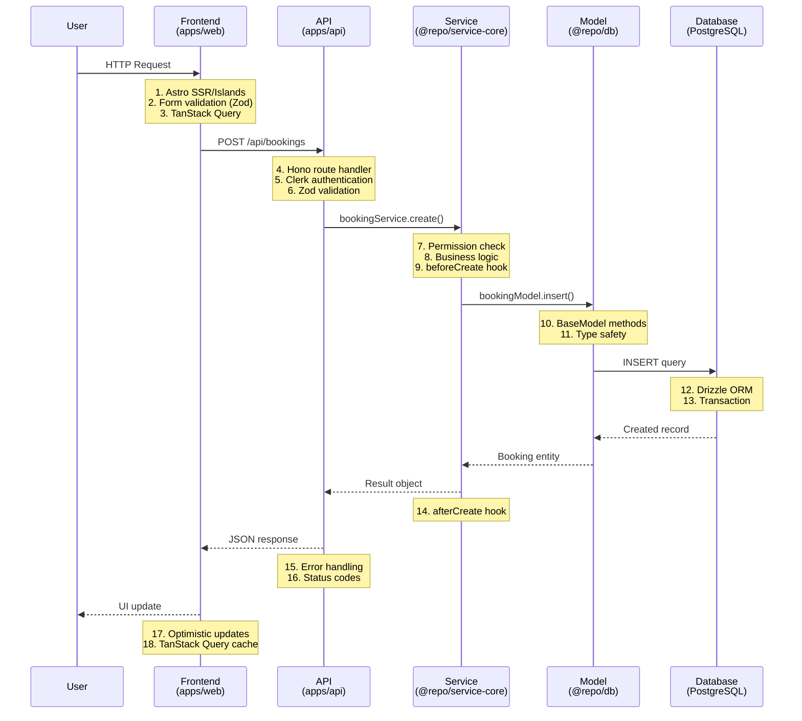

# Product Design Requirements (PDR)

## Monorepo Documentation Rewrite

**Date**: 2025-11-04
**Status**: Draft
**Priority**: P1 (High)
**Owner**: Tech Writer + Tech Lead
**Feature Type**: Enhancement

---

## 1. Overview

### 1.1 Problem Statement

The current Hospeda monorepo documentation is incomplete, outdated, and not aligned with the actual codebase. This creates significant friction for:

- **New developers** who struggle to understand the architecture and patterns
- **Existing developers** who need to constantly explore code to remember implementation details
- **The project owner** who frequently needs to refresh their memory on how different parts work
- **Tech writers** who lack clear guidelines on where to document what

**Context:**

- **Business context**: Documentation quality directly impacts development velocity, onboarding time, and code maintainability. Poor documentation leads to repeated questions, incorrect implementations, and knowledge silos.
- **Technical context**: The project uses a sophisticated monorepo architecture with 3 apps and 18+ packages, layered architecture patterns (BaseModel, BaseCrudService), route factories, and type inference from Zod schemas. This complexity requires comprehensive documentation.
- **User context**: The team is small (primarily owner + occasional contributors), which means knowledge transfer through documentation is critical. The owner frequently context-switches and needs quick memory refreshers.

### 1.2 Goals & Success Metrics

**Primary Goal:**
Create comprehensive, maintainable, discoverable documentation that serves as the single source of truth for the Hospeda monorepo, following a hybrid documentation strategy (central + distributed).

**Success Metrics:**

- **Onboarding Time**: New developer can make first meaningful contribution within 2-4 hours
  - How measured: Time from "git clone" to completing "Add a new field to existing model" task
- **Documentation Coverage**: 100% of core patterns, architecture, and development workflows documented
  - How measured: Checklist of required documentation sections (85+ items) all marked complete
- **Findability**: Developers can find information within 2 minutes
  - How measured: Timed searches for common questions (e.g., "How do I add a new entity?", "How does authentication work?")
- **Accuracy**: Documentation reflects actual codebase with 95%+ accuracy
  - How measured: Spot checks of code examples against actual implementation
- **Maintainability**: Documentation updates take <30 minutes per code change
  - How measured: Average time to update docs when making code changes
- **Owner Memory Refresh**: Owner can resume work after 1-week break in <30 minutes
  - How measured: Time to understand "what was I working on" and "how does this work"

### 1.3 Non-Goals

What we explicitly won't do in this iteration:

- **Auto-generated API documentation**: We won't use tools like TypeDoc or JSDoc auto-generation (may be added later)
- **Video tutorials**: Documentation will be text-based with diagrams, no video content
- **Multi-language documentation**: All docs will be in English only (user-facing content is Spanish)
- **Documentation versioning**: We won't maintain docs for multiple versions (single main branch)
- **Interactive playgrounds**: No embedded code editors or live examples (may be added later)
- **Migration guides from old docs**: Old docs will be deleted, not migrated

---

## 2. User Stories

### US-001: New Developer Onboarding

**As a** new developer joining the Hospeda project
**I want to** quickly understand the architecture, setup my environment, and make my first contribution
**So that** I can become productive within a few hours instead of days

**Priority**: P0

**Acceptance Criteria**:

- [ ] **AC-001**: Complete environment setup in <30 minutes
  - Given: A new developer with Node.js installed
  - When: Following the "Getting Started" guide
  - Then: They can run `pnpm dev` and see all apps running locally, with database seeded

- [ ] **AC-002**: Understand high-level architecture in <20 minutes
  - Given: A new developer has completed setup
  - When: Reading the "Architecture Overview" with diagrams
  - Then: They can explain the request flow from frontend → API → database and back

- [ ] **AC-003**: Complete first contribution in <2 hours
  - Given: A new developer understands the architecture
  - When: Following the "Adding a New Entity" tutorial
  - Then: They successfully add a new field to an existing model with tests, following TDD

- [ ] **AC-004**: Find answers independently
  - Given: A new developer encounters a common question
  - When: Searching documentation (Ctrl+F, file navigation)
  - Then: They find the answer within 2 minutes without asking for help

**Edge Cases:**

- Developer has Windows (not Mac/Linux): Guide includes Windows-specific instructions and common issues
- Developer has limited PostgreSQL experience: Guide includes database basics and Drizzle Studio introduction
- Developer is unfamiliar with monorepos: Guide explains workspace structure and command patterns

---

### US-002: Owner Memory Refresh

**As a** the project owner returning after a break
**I want to** quickly refresh my memory on how specific parts of the system work
**So that** I can resume development without wasting time re-exploring code

**Priority**: P0

**Acceptance Criteria**:

- [ ] **AC-001**: Understand what a package does in <5 minutes
  - Given: Owner hasn't touched a package in 2 weeks
  - When: Opening the package's `docs/README.md`
  - Then: They understand its purpose, main components, and how to modify it

- [ ] **AC-002**: Recall architectural patterns quickly
  - Given: Owner needs to implement a new feature using existing patterns
  - When: Checking the "Architecture Patterns" documentation
  - Then: They find clear examples of BaseModel, BaseCrudService, and route factories with code snippets

- [ ] **AC-003**: Remember deployment procedures
  - Given: Owner needs to deploy a change to production
  - When: Following the "Deployment" guide for the relevant app
  - Then: They execute the deployment without errors or missing steps

- [ ] **AC-004**: Understand cross-package dependencies
  - Given: Owner needs to modify a shared package
  - When: Viewing the "Package Dependency Diagram"
  - Then: They identify all apps/packages affected before making changes

**Edge Cases:**

- Owner returns after 1+ month: Documentation includes "Project Context" section to recall business goals
- Owner needs to fix production bug urgently: Runbooks provide step-by-step debugging procedures
- Owner forgets command syntax: Quick reference cards available in relevant sections

---

### US-003: Adding a New Feature

**As a** developer implementing a new feature
**I want to** follow clear step-by-step guides for end-to-end implementation
**So that** I consistently follow project patterns and don't miss critical steps

**Priority**: P1

**Acceptance Criteria**:

- [ ] **AC-001**: Create complete entity from scratch
  - Given: Developer needs to add a new entity (e.g., "Review")
  - When: Following the "Adding a New Entity" tutorial
  - Then: They create schema → model → service → API route → frontend integration with proper tests

- [ ] **AC-002**: Follow TDD workflow correctly
  - Given: Developer is implementing business logic
  - When: Following the "TDD Workflow" guide
  - Then: They write tests first (Red), implement code (Green), refactor (Refactor)

- [ ] **AC-003**: Implement proper error handling
  - Given: Developer needs to handle errors in API
  - When: Following the "Error Handling" guide
  - Then: They use proper error classes, return correct status codes, and provide user-friendly messages

- [ ] **AC-004**: Add proper authentication/authorization
  - Given: Developer needs to protect an endpoint
  - When: Following the "Authentication" guide
  - Then: They correctly use Clerk middleware and permission checks from service layer

**Edge Cases:**

- Feature spans multiple packages: Guide shows how to coordinate changes across packages
- Feature requires database migration: Guide includes migration creation and testing steps
- Feature requires new external dependency: Guide shows approval process and integration patterns

---

### US-004: Maintaining Existing Code

**As a** developer maintaining existing code
**I want to** understand how specific components work without reading all the code
**So that** I can fix bugs or enhance features efficiently

**Priority**: P1

**Acceptance Criteria**:

- [ ] **AC-001**: Understand package API quickly
  - Given: Developer needs to use functionality from `@repo/db`
  - When: Reading the package's API reference
  - Then: They understand available models, methods, and usage examples without reading source code

- [ ] **AC-002**: Debug common issues
  - Given: Developer encounters a common problem (e.g., "Tests fail in CI but pass locally")
  - When: Checking the "Troubleshooting" section
  - Then: They find the issue and solution documented with fix steps

- [ ] **AC-003**: Understand request lifecycle
  - Given: Developer needs to optimize performance
  - When: Viewing the "Request Flow Diagram"
  - Then: They understand every step from HTTP request to database query and back

- [ ] **AC-004**: Find code examples
  - Given: Developer needs to implement a pattern they haven't used before
  - When: Searching the "Code Examples Repository"
  - Then: They find real-world examples of the pattern in use

**Edge Cases:**

- Documentation doesn't cover specific case: Guide includes contact information and process for asking questions
- Code has diverged from docs: Process for reporting documentation issues is clear
- Multiple ways to do the same thing: Docs explain preferred approach and when to use alternatives

---

### US-005: Writing Documentation

**As a** tech writer maintaining documentation
**I want to** clear rules on what to document where and how
**So that** documentation stays organized, consistent, and maintainable

**Priority**: P1

**Acceptance Criteria**:

- [ ] **AC-001**: Know where to place new documentation
  - Given: Tech writer needs to document a new feature
  - When: Checking the "Documentation Guidelines"
  - Then: They know whether it belongs in central `/docs` or distributed `package/docs` based on clear rules

- [ ] **AC-002**: Follow consistent formatting
  - Given: Tech writer is creating new documentation
  - When: Following the documentation templates
  - Then: All docs have consistent structure, tone, and formatting

- [ ] **AC-003**: Create effective diagrams
  - Given: Tech writer needs to visualize a complex flow
  - When: Using Mermaid diagram guidelines
  - Then: They create clear, maintainable diagrams with proper syntax

- [ ] **AC-004**: Link documentation effectively
  - Given: Tech writer needs to reference other documentation
  - When: Following linking conventions
  - Then: All links work, are relative (not absolute), and follow naming patterns

**Edge Cases:**

- Feature affects both central and distributed docs: Guidelines show how to coordinate and cross-link
- Documentation becomes outdated: Process for keeping docs in sync with code is documented
- Diagram becomes too complex: Guidelines suggest when to split into multiple diagrams

---

### US-006: Production Operations

**As a** developer or owner managing production
**I want to** step-by-step runbooks for common operational tasks
**So that** I can handle incidents and deployments confidently

**Priority**: P2

**Acceptance Criteria**:

- [ ] **AC-001**: Investigate production bugs efficiently
  - Given: A bug is reported in production
  - When: Following the "Investigating Production Bugs" runbook
  - Then: They systematically check logs, metrics, database state, and identify root cause

- [ ] **AC-002**: Roll back deployments safely
  - Given: A deployment causes issues
  - When: Following the "Rolling Back Deployments" runbook
  - Then: They revert to previous version without data loss or downtime

- [ ] **AC-003**: Monitor system health
  - Given: Developer needs to check system status
  - When: Following the "Monitoring & Observability" guide
  - Then: They know which metrics to check, what thresholds matter, and how to access logs

- [ ] **AC-004**: Scale API under load
  - Given: API is experiencing high traffic
  - When: Following the "Scaling API" runbook
  - Then: They increase resources, verify performance, and monitor impact

**Edge Cases:**

- Multiple issues occurring simultaneously: Runbook provides triage priority guidelines
- Rollback isn't possible: Runbook provides forward-fix procedures
- Monitoring tools are unavailable: Runbook lists alternative investigation methods

---

### US-007: Security & Performance

**As a** developer implementing features
**I want to** follow security and performance best practices
**So that** the application remains secure and performant at scale

**Priority**: P2

**Acceptance Criteria**:

- [ ] **AC-001**: Prevent common security vulnerabilities
  - Given: Developer is implementing user input handling
  - When: Following the "Security Guidelines" (OWASP Top 10)
  - Then: They implement proper validation, sanitization, and escaping

- [ ] **AC-002**: Optimize database queries
  - Given: Developer is writing database queries
  - When: Following the "Database Query Optimization" guide
  - Then: They use proper indexes, avoid N+1 queries, and implement pagination

- [ ] **AC-003**: Optimize frontend performance
  - Given: Developer is building UI components
  - When: Following the "Bundle Size Optimization" guide
  - Then: They lazy-load components, optimize images, and meet Lighthouse score targets

- [ ] **AC-004**: Implement proper caching
  - Given: Developer needs to improve response times
  - When: Following the "Caching Strategies" guide
  - Then: They implement appropriate caching at database, API, and CDN levels

**Edge Cases:**

- Security and performance conflict: Guidelines explain tradeoffs and when to prioritize what
- Third-party dependencies have vulnerabilities: Process for handling security updates documented
- Performance targets can't be met: Guidelines for escalation and alternative approaches

---

## 3. Design & Mockups

### 3.1 Documentation Structure Diagram

```mermaid
graph TD
    ROOT["/docs (Central Documentation)"]
    APPS["apps/*/docs (App-Specific)"]
    PKGS["packages/*/docs (Package-Specific)"]

    ROOT --> GS["Getting Started"]
    ROOT --> ARCH["Architecture"]
    ROOT --> GUIDES["Cross-cutting Guides"]
    ROOT --> DEPLOY["Deployment"]
    ROOT --> CONTRIB["Contributing"]
    ROOT --> RES["Resources"]

    GS --> |References| APPS
    GS --> |References| PKGS

    ARCH --> OVERVIEW["Overview + Diagrams"]
    ARCH --> STRUCTURE["Monorepo Structure"]
    ARCH --> DATAFLOW["Data Flow"]
    ARCH --> PATTERNS["Architectural Patterns"]
    ARCH --> STACK["Tech Stack"]

    GUIDES --> ENTITY["Adding New Entity"]
    GUIDES --> TDD["TDD Workflow"]
    GUIDES --> TESTING["Testing Strategy"]
    GUIDES --> ERRORS["Error Handling"]
    GUIDES --> AUTH["Authentication"]
    GUIDES --> DEBUG["Debugging"]

    ENTITY --> |Step 1| PKGS
    ENTITY --> |Step 2| PKGS
    ENTITY --> |Step 3| APPS

    DEPLOY --> DEP_OVER["Overview"]
    DEPLOY --> DEP_ENV["Environment Setup"]
    DEPLOY --> DEP_API["API (Fly.io)"]
    DEPLOY --> DEP_WEB["Web (Vercel)"]
    DEPLOY --> DEP_ADMIN["Admin (Vercel)"]
    DEPLOY --> DEP_DB["Database (Neon)"]
    DEPLOY --> DEP_CI["CI/CD"]

    CONTRIB --> STANDARDS["Code Standards"]
    CONTRIB --> GIT["Git Workflow"]
    CONTRIB --> PR["PR Process"]
    CONTRIB --> COMMITS["Atomic Commits"]

    RES --> GLOSSARY["Glossary"]
    RES --> FAQ["FAQ"]
    RES --> TROUBLE["Troubleshooting"]

    APPS --> API_DOCS["apps/api/docs"]
    APPS --> WEB_DOCS["apps/web/docs"]
    APPS --> ADMIN_DOCS["apps/admin/docs"]

    API_DOCS --> API_SETUP["Setup"]
    API_DOCS --> API_ARCH["Architecture"]
    API_DOCS --> API_ENDPOINTS["Endpoints"]
    API_DOCS --> API_DEV["Development"]

    WEB_DOCS --> WEB_SETUP["Setup"]
    WEB_DOCS --> WEB_ARCH["Architecture"]
    WEB_DOCS --> WEB_PAGES["Pages"]
    WEB_DOCS --> WEB_DEV["Development"]

    PKGS --> DB_DOCS["packages/db/docs"]
    PKGS --> SVC_DOCS["packages/service-core/docs"]
    PKGS --> SCHEMA_DOCS["packages/schemas/docs"]
    PKGS --> OTHER_DOCS["other packages..."]

    DB_DOCS --> DB_API["API Reference"]
    DB_DOCS --> DB_MODELS["Models Guide"]
    DB_DOCS --> DB_EXAMPLES["Examples"]
    DB_DOCS --> DB_TEST["Testing"]

    SVC_DOCS --> SVC_API["API Reference"]
    SVC_DOCS --> SVC_SERVICES["Services Guide"]
    SVC_DOCS --> SVC_EXAMPLES["Examples"]
    SVC_DOCS --> SVC_TEST["Testing"]

    classDef central fill:#e1f5ff,stroke:#0066cc,stroke-width:2px
    classDef distributed fill:#fff4e1,stroke:#cc6600,stroke-width:2px
    classDef content fill:#f0f0f0,stroke:#666,stroke-width:1px

    class ROOT,GS,ARCH,GUIDES,DEPLOY,CONTRIB,RES central
    class APPS,PKGS,API_DOCS,WEB_DOCS,ADMIN_DOCS,DB_DOCS,SVC_DOCS,SCHEMA_DOCS,OTHER_DOCS distributed
    class OVERVIEW,STRUCTURE,DATAFLOW,PATTERNS,STACK,ENTITY,TDD,TESTING,ERRORS,AUTH,DEBUG content
```



**Description:**

This diagram shows the hybrid documentation architecture with clear separation between:

- **Central Documentation** (`/docs`) - Blue boxes: High-level, cross-cutting documentation that applies to the entire monorepo
- **Distributed Documentation** (app/package-specific) - Orange boxes: Technical details specific to individual apps or packages
- **Content Pages** - Gray boxes: Actual documentation pages

**Key Navigation Patterns:**

- Central docs reference distributed docs when providing step-by-step guides
- Distributed docs link back to central docs for architectural context
- All documentation cross-links using relative paths

### 3.2 Request Flow Diagram (Example of Required Diagram)



**Description:**

This diagram illustrates the complete request lifecycle from user action to database and back. Each step includes code references (file locations) in the actual documentation. This serves as a visual map for understanding data flow and helps developers:

- Debug issues by tracing request flow
- Understand where to add logic (hooks, validation, etc.)
- See how layers interact

### 3.3 Documentation Navigation Flow

```mermaid
flowchart TD
    START[Developer Starts] --> QUESTION{What do I need?}

    QUESTION -->|Setup project| GS[Getting Started<br/>/docs/getting-started.md]
    QUESTION -->|Understand architecture| ARCH[Architecture Overview<br/>/docs/architecture/overview.md]
    QUESTION -->|Implement feature| GUIDES[Cross-cutting Guides<br/>/docs/guides/]
    QUESTION -->|Use specific package| PKG[Package Docs<br/>packages/*/docs/]
    QUESTION -->|Deploy changes| DEPLOY[Deployment Guide<br/>/docs/deployment/]
    QUESTION -->|Fix production issue| RUNBOOK[Runbooks<br/>/docs/runbooks/]

    GS --> NEXT1{Next step?}
    NEXT1 -->|Understand system| ARCH
    NEXT1 -->|Start coding| GUIDES

    ARCH --> DIAGRAMS[View Diagrams]
    DIAGRAMS --> PATTERNS[Learn Patterns<br/>/docs/architecture/patterns.md]
    PATTERNS --> GUIDES

    GUIDES --> ENTITY{Which guide?}
    ENTITY -->|Add entity| ENTITY_GUIDE[Adding New Entity<br/>/docs/guides/adding-entity.md]
    ENTITY -->|Test code| TDD_GUIDE[TDD Workflow<br/>/docs/guides/tdd.md]
    ENTITY -->|Handle errors| ERROR_GUIDE[Error Handling<br/>/docs/guides/errors.md]

    ENTITY_GUIDE --> SCHEMA[1. Create Schema<br/>packages/schemas/docs/]
    SCHEMA --> MODEL[2. Create Model<br/>packages/db/docs/models.md]
    MODEL --> SERVICE[3. Create Service<br/>packages/service-core/docs/services.md]
    SERVICE --> ROUTE[4. Create Route<br/>apps/api/docs/endpoints.md]
    ROUTE --> FRONTEND[5. Frontend Integration<br/>apps/web/docs/]

    PKG --> PKG_TYPE{Package type?}
    PKG_TYPE -->|@repo/db| DB_DOCS[packages/db/docs/]
    PKG_TYPE -->|@repo/service-core| SVC_DOCS[packages/service-core/docs/]
    PKG_TYPE -->|Other| OTHER_DOCS[packages/*/docs/]

    DB_DOCS --> DB_API[API Reference]
    DB_DOCS --> DB_EXAMPLES[Examples]

    DEPLOY --> ENV_SETUP[Environment Setup]
    ENV_SETUP --> APP_DEPLOY{Which app?}
    APP_DEPLOY -->|API| API_DEPLOY[API Deployment<br/>/docs/deployment/api.md]
    APP_DEPLOY -->|Web| WEB_DEPLOY[Web Deployment<br/>/docs/deployment/web.md]
    APP_DEPLOY -->|Admin| ADMIN_DEPLOY[Admin Deployment<br/>/docs/deployment/admin.md]

    RUNBOOK --> RUN_TYPE{Issue type?}
    RUN_TYPE -->|Bug| BUG_RUN[Investigating Bugs<br/>/docs/runbooks/bugs.md]
    RUN_TYPE -->|Performance| PERF_RUN[Performance Issues<br/>/docs/runbooks/performance.md]
    RUN_TYPE -->|Rollback| ROLLBACK_RUN[Rolling Back<br/>/docs/runbooks/rollback.md]

    classDef central fill:#e1f5ff,stroke:#0066cc,stroke-width:2px
    classDef distributed fill:#fff4e1,stroke:#cc6600,stroke-width:2px
    classDef decision fill:#ffe1e1,stroke:#cc0000,stroke-width:2px

    class GS,ARCH,GUIDES,DEPLOY,RUNBOOK,DIAGRAMS,PATTERNS,ENTITY_GUIDE,TDD_GUIDE,ERROR_GUIDE central
    class PKG,DB_DOCS,SVC_DOCS,OTHER_DOCS,SCHEMA,MODEL,SERVICE,ROUTE,FRONTEND,DB_API,DB_EXAMPLES distributed
    class QUESTION,NEXT1,ENTITY,PKG_TYPE,APP_DEPLOY,RUN_TYPE decision
```

**Description:**

This flowchart shows how developers navigate documentation based on their goals. It illustrates:

- Entry points for different tasks
- Logical progression through documentation
- Cross-references between central and distributed docs
- Decision points that guide users to the right documentation

### 3.4 Component Specifications (Documentation Structure)

#### Central Documentation (`/docs`)

**Location**: Repository root `/docs` folder

**Purpose**: High-level documentation that applies across the entire monorepo

**Structure**:

```
/docs/
├── README.md                          # Documentation home with navigation
├── getting-started.md                 # Complete onboarding guide
├── architecture/
│   ├── README.md                      # Architecture section home
│   ├── overview.md                    # High-level system design
│   ├── monorepo-structure.md          # Folder structure and organization
│   ├── data-flow.md                   # Request lifecycle with diagrams
│   ├── patterns.md                    # Architectural patterns (BaseModel, etc.)
│   └── tech-stack.md                  # Technology decisions and rationale
├── guides/
│   ├── README.md                      # Guides section home
│   ├── adding-entity.md               # End-to-end entity creation
│   ├── tdd-workflow.md                # TDD process and examples
│   ├── testing-strategy.md            # Testing approach and patterns
│   ├── error-handling.md              # Error handling patterns
│   ├── authentication.md              # Auth implementation guide
│   ├── debugging.md                   # Debugging techniques and tools
│   ├── database-migrations.md         # Migration creation and management
│   └── internationalization.md        # i18n implementation
├── deployment/
│   ├── README.md                      # Deployment overview
│   ├── environment-setup.md           # Environment configuration
│   ├── api.md                         # API deployment to Fly.io
│   ├── web.md                         # Web deployment to Vercel
│   ├── admin.md                       # Admin deployment to Vercel
│   ├── database.md                    # Database deployment to Neon
│   └── ci-cd.md                       # GitHub Actions workflows
├── contributing/
│   ├── README.md                      # Contributing overview
│   ├── code-standards.md              # Coding standards and conventions
│   ├── git-workflow.md                # Branching and PR process
│   ├── pr-process.md                  # Pull request guidelines
│   └── atomic-commits.md              # Commit policy and examples
├── runbooks/
│   ├── README.md                      # Runbooks overview
│   ├── investigating-bugs.md          # Bug investigation procedures
│   ├── rollback.md                    # Deployment rollback steps
│   ├── database-recovery.md           # Backup and recovery
│   ├── scaling.md                     # Scaling procedures
│   └── monitoring.md                  # Monitoring and alerting
├── security/
│   ├── README.md                      # Security overview
│   ├── owasp-top-10.md                # OWASP Top 10 prevention
│   ├── authentication.md              # Auth security best practices
│   ├── api-security.md                # API rate limiting and protection
│   └── input-validation.md            # Input sanitization
├── performance/
│   ├── README.md                      # Performance overview
│   ├── database-optimization.md       # Query optimization
│   ├── caching.md                     # Caching strategies
│   ├── frontend-optimization.md       # Bundle size and Lighthouse
│   └── monitoring.md                  # Performance monitoring
└── resources/
    ├── glossary.md                    # Term definitions
    ├── faq.md                         # Frequently asked questions
    ├── troubleshooting.md             # Common issues and solutions
    └── code-examples.md               # Code snippets repository
```

**Content Guidelines**:

- **Audience**: All developers (new and experienced)
- **Scope**: Cross-cutting concerns, high-level concepts
- **Detail Level**: Conceptual with links to distributed docs for implementation
- **Examples**: Generic examples, not package-specific
- **Maintenance**: Tech writer maintains, developers review

#### Distributed Documentation (Apps)

**Location**: `apps/*/docs` folder in each app

**Purpose**: App-specific technical documentation

**Structure** (per app):

```
apps/api/docs/
├── README.md                          # API documentation home
├── setup.md                           # API-specific setup
├── architecture.md                    # API internal architecture
├── endpoints.md                       # Endpoint reference
├── creating-endpoints.md              # How to add new endpoints
├── middleware.md                      # Middleware usage
├── debugging.md                       # API-specific debugging
├── deployment.md                      # API deployment specifics
└── examples/
    ├── crud-endpoint.md               # Example CRUD endpoint
    ├── list-endpoint.md               # Example list endpoint
    └── custom-endpoint.md             # Example custom endpoint

apps/web/docs/
├── README.md                          # Web documentation home
├── setup.md                           # Web-specific setup
├── architecture.md                    # Astro + React architecture
├── pages.md                           # Page structure
├── creating-pages.md                  # How to add new pages
├── components.md                      # Component structure
├── styling.md                         # Tailwind + Shadcn usage
├── seo.md                             # SEO implementation
├── debugging.md                       # Web-specific debugging
└── deployment.md                      # Web deployment specifics

apps/admin/docs/
├── README.md                          # Admin documentation home
├── setup.md                           # Admin-specific setup
├── architecture.md                    # TanStack Start architecture
├── pages.md                           # Admin page structure
├── creating-pages.md                  # How to add admin pages
├── authentication.md                  # Admin auth specifics
├── permissions.md                     # Permission handling
├── debugging.md                       # Admin-specific debugging
└── deployment.md                      # Admin deployment specifics
```

**Content Guidelines**:

- **Audience**: Developers working on that specific app
- **Scope**: App-specific implementation details
- **Detail Level**: Technical with code examples
- **Examples**: Real code from the app
- **Maintenance**: App maintainer updates when changing app code

#### Distributed Documentation (Packages)

**Location**: `packages/*/docs` folder in each package

**Purpose**: Package-specific API reference and development guides

**Structure** (per package):

```
packages/db/docs/
├── README.md                          # Package overview
├── api-reference.md                   # API documentation
├── models.md                          # Creating and using models
├── migrations.md                      # Migration guide
├── testing.md                         # Testing patterns
└── examples/
    ├── basic-model.md                 # Basic model example
    ├── relations.md                   # Model relations example
    └── advanced.md                    # Advanced patterns

packages/service-core/docs/
├── README.md                          # Package overview
├── api-reference.md                   # API documentation
├── services.md                        # Creating and using services
├── permissions.md                     # Permission system
├── hooks.md                           # Service hooks
├── testing.md                         # Testing patterns
└── examples/
    ├── basic-service.md               # Basic service example
    ├── with-hooks.md                  # Service with hooks
    └── complex-logic.md               # Complex business logic

packages/schemas/docs/
├── README.md                          # Package overview
├── api-reference.md                   # All schemas documented
├── creating-schemas.md                # How to create schemas
├── validation.md                      # Validation patterns
├── type-inference.md                  # Using z.infer<typeof>
└── examples/
    ├── entity-schema.md               # Entity schema example
    ├── api-schema.md                  # API schema example
    └── form-schema.md                 # Form schema example

packages/utils/docs/
├── README.md                          # Package overview
├── api-reference.md                   # Utility functions
└── usage.md                           # Usage guide

packages/logger/docs/
├── README.md                          # Package overview
├── api-reference.md                   # Logger API
├── usage.md                           # How to use logger
└── examples.md                        # Logging examples

packages/config/docs/
├── README.md                          # Package overview
├── api-reference.md                   # Config functions
├── environment-variables.md           # Environment setup
└── usage.md                           # Config usage

[... similar structure for other packages ...]
```

**Content Guidelines**:

- **Audience**: Developers using the package
- **Scope**: Package API and usage
- **Detail Level**: Very technical with code examples
- **Examples**: Real code from the package or consuming apps
- **Maintenance**: Package maintainer updates when changing package code

---

## 4. Technical Constraints

### 4.1 Performance Requirements

**Documentation Load Time:**

- All documentation pages load in <2 seconds
- Diagrams render in <1 second

**Search Performance:**

- Browser search (Ctrl+F) is instant
- Manual navigation to any doc in <30 seconds

**Build Time:**

- Documentation doesn't significantly impact build time
- Markdown processing adds <5 seconds to build

**Bundle Size:**

- Documentation files are not bundled with apps
- Each markdown file <100KB (readable file size)

### 4.2 Security Requirements

**Authentication:**

- Required: No (documentation is public within repository)
- Level: Public (anyone with repo access can read)

**Authorization:**

- Who can read: All repo contributors
- Who can modify: Tech writer, developers via PR
- Who can approve: Tech lead

**Data Privacy:**

- No PII in documentation
- No production credentials or secrets
- All code examples use dummy data

**Access Control:**

- Documentation follows repository access control (GitHub permissions)
- No separate authentication/authorization system

### 4.3 Accessibility Requirements

**WCAG Level**: AA

**Required Support:**

- [x] Semantic HTML in generated docs (if using doc generator)
- [x] Proper heading hierarchy (H1 → H2 → H3)
- [x] Alt text for all diagrams (Mermaid generates accessible SVG)
- [x] Code examples have language specified
- [x] Links have descriptive text (not "click here")
- [x] Color contrast ≥ 4.5:1 for any styled docs
- [x] Table of contents for long documents
- [x] Consistent navigation structure

**Exceptions:**

- Documentation is text-based, so most accessibility concerns don't apply
- Generated diagrams (Mermaid) are accessible by default

### 4.4 Browser/Device Support

**Documentation Access:**

- Any browser that supports markdown rendering (GitHub, VS Code, etc.)
- Text editors: VS Code, Sublime, Vim, etc.

**Diagram Rendering:**

- Mermaid diagrams render in GitHub, VS Code, and most modern doc tools
- Fallback: Diagrams have text descriptions if rendering fails

---

## 5. Dependencies & Integrations

### 5.1 Internal Dependencies

| Package/Tool | Version | Why Needed | Impact if Unavailable |
|-------------|---------|------------|----------------------|
| Codebase (all packages) | Current | Source of truth for documentation | Cannot write accurate documentation |
| Mermaid | Latest | Diagram generation | No visual diagrams (text descriptions only) |
| Markdown linter | Current | Consistent formatting | Inconsistent docs formatting |
| prettier | Current | Auto-formatting | Manual formatting required |

### 5.2 External Dependencies

| Service/API | Version | Why Needed | Rate Limits | Fallback |
|-------------|---------|------------|-------------|----------|
| GitHub | N/A | Documentation hosting and rendering | None | View locally in VS Code |
| Mermaid Live Editor | N/A | Diagram preview/editing | None | Use VS Code extension |

### 5.3 New Dependencies

**Packages to Add:**

None - documentation uses existing markdown and Mermaid (already supported by GitHub/VS Code)

**Documentation Tools Considered:**

- **VitePress / Docusaurus**: Not needed - adds complexity, build time, and maintenance burden
- **TypeDoc**: Not needed for v1 - may add later for auto-generated API docs
- **Storybook**: Not needed - component documentation is minimal

**Rationale:**

Keeping documentation as simple markdown files in the repository:

- Zero build time
- Works offline
- No additional dependencies
- Easy to maintain
- GitHub renders markdown beautifully
- VS Code provides excellent markdown editing experience

---

## 6. Risks & Mitigations

| Risk | Impact | Probability | Mitigation Strategy | Owner |
|------|--------|-------------|-------------------|-------|
| Documentation becomes outdated quickly | High | High | Create clear "update docs" step in development workflow; add CI check for missing docs | Tech Lead |
| Documentation is incomplete after initial write | High | Medium | Use comprehensive checklist (85+ items); phased approach with priorities | Tech Writer |
| Developers don't read/follow documentation | Medium | Medium | Make docs easy to find; integrate into onboarding; reference in PRs | Tech Lead |
| Documentation structure is confusing | Medium | Medium | User testing with new developer; iterate based on feedback | Tech Writer |
| Distributed docs get out of sync | Medium | High | Clear ownership model; package maintainer responsible for package docs | Tech Lead |
| Documentation is too long/overwhelming | Medium | Low | Use clear navigation; create "quick start" paths; progressive disclosure | Tech Writer |
| Diagrams are hard to maintain | Low | Medium | Use Mermaid (text-based, version-controlled); keep diagrams simple | Tech Writer |
| Code examples become outdated | High | High | Use real code from codebase when possible; CI lint checks for broken examples | Developers |

**Risk Details:**

### Risk 1: Documentation Becomes Outdated

- **Description**: As code evolves, documentation doesn't get updated, leading to incorrect information
- **Impact if occurs**: Developers follow wrong patterns, lose trust in documentation, revert to reading code
- **Mitigation**:
  - Add "Update docs" checkbox to PR template
  - Create pre-commit hook reminding to update docs
  - Periodic documentation audits (monthly)
  - Link from code comments to relevant docs (makes devs aware of docs)
- **Monitoring**: Monthly spot checks comparing code to docs; track documentation-related questions in discussions

### Risk 2: Documentation Too Long

- **Description**: Comprehensive documentation becomes overwhelming for developers
- **Impact if occurs**: Developers avoid reading docs, miss important information
- **Mitigation**:
  - Create "Quick Start" guides (5-10 minutes)
  - Use progressive disclosure (basic → intermediate → advanced)
  - Add clear table of contents with time estimates
  - Separate "reference" (comprehensive) from "guides" (task-focused)
- **Monitoring**: Track time to complete onboarding; gather feedback on doc length

### Risk 3: Distributed Docs Out of Sync

- **Description**: Package/app docs diverge from central docs or become contradictory
- **Impact if occurs**: Confusion about correct approach, conflicting information
- **Mitigation**:
  - Clear rules for what goes where (documented in "Writing Documentation" guide)
  - Cross-link between central and distributed docs
  - Package maintainer owns their package docs
  - Central tech writer does quarterly sync reviews
- **Monitoring**: Quarterly documentation sync audit; track contradiction reports

### Risk 4: Code Examples Break

- **Description**: Code examples in documentation become outdated as code changes
- **Impact if occurs**: Examples don't work, developers lose trust in docs
- **Mitigation**:
  - Extract examples from actual test code when possible
  - Link to specific files/lines in GitHub (with permalink)
  - Use CI to lint code blocks (TypeScript validation)
  - Mark example date ("Example as of 2025-11-04")
- **Monitoring**: CI checks for TypeScript errors in code blocks; quarterly example validation

---

## 7. Out of Scope / Future Work

**Explicitly Out of Scope:**

- **Auto-generated API documentation**: TypeDoc/JSDoc generation not included in v1 - may add in v2 if manual docs prove insufficient
- **Video tutorials**: Text and diagrams only - videos are harder to maintain and search
- **Interactive documentation**: No embedded code editors or live examples - too much complexity for v1
- **Multi-language documentation**: English only for documentation (user-facing content in Spanish stays Spanish)
- **Documentation versioning**: No support for multiple versions - single source of truth on main branch
- **Documentation search engine**: Rely on browser search and file navigation - dedicated search adds complexity
- **Documentation analytics**: No tracking of which docs are most read - may add later if needed
- **AI-powered documentation assistant**: No chatbot or AI search - too early for this
- **External developer portal**: Documentation stays in GitHub repository - no separate website

**Future Enhancements:**

- **Auto-generated API reference** (Q2 2025): Use TypeDoc for comprehensive API documentation if manual docs prove insufficient
- **Documentation testing** (Q3 2025): Automated tests that verify code examples actually work
- **Documentation metrics** (Q3 2025): Track which docs are most viewed, time on page, etc. to prioritize improvements
- **Interactive examples** (Q4 2025): Embedded code editors for trying examples without leaving docs
- **Video walkthroughs** (2026): Screen recordings for complex workflows once docs stabilize

**Technical Debt Created:**

- **Manual API documentation**: Maintaining by hand is more work than auto-generation - acceptable for v1, revisit in v2
- **No link checking**: Links may break as files move - can add CI check later if becomes problem
- **No documentation versioning**: Can't reference docs for older versions - acceptable while in active development
- **Diagrams in code not synced**: Code comments don't automatically update diagrams - manual sync required

---

## 8. Testing Strategy

### 8.1 Test Coverage Requirements

**Documentation Completeness:**

- 100% of required sections completed (85+ checklist items)
- All packages have distributed documentation
- All apps have distributed documentation

**Documentation Accuracy:**

- 95%+ accuracy verified via spot checks
- All code examples tested (manually or via CI)
- All file paths verified to exist

**Documentation Usability:**

- 100% of user stories have passing acceptance criteria
- New developer onboarding test passes (<2 hours)
- Documentation findability test passes (<2 minutes per query)

### 8.2 Test Scenarios

**Completeness Testing:**

- **Central docs checklist**: Verify all 85+ items completed
- **Distributed docs checklist**: Verify all packages/apps have required docs
- **Navigation test**: Verify all internal links work
- **Cross-reference test**: Verify links between central and distributed docs

**Accuracy Testing:**

- **Code example validation**: Copy code examples into project and verify they work
- **Path verification**: Verify all file/folder references exist
- **Command testing**: Run all documented commands and verify they work
- **Diagram validation**: Verify diagrams match actual architecture

**Usability Testing:**

- **New developer test**: Have new developer follow "Getting Started" and track time/issues
- **Memory refresh test**: Owner takes 1-week break, then tries to resume work using docs
- **Task completion test**: Developer uses docs to add new entity end-to-end
- **Search test**: Time how long it takes to find answers to 20 common questions

### 8.3 Review Process

**Phase 1: Initial Draft (Tech Writer)**

- Tech writer reads all code and creates initial documentation
- Self-review using completeness checklist
- Self-test all code examples

**Phase 2: Technical Review (Developers)**

- Developers review documentation for accuracy
- Verify technical details match actual implementation
- Test code examples in real environment
- Provide feedback on clarity

**Phase 3: Usability Testing (New Developer)**

- New developer (or owner after break) attempts onboarding
- Track time, confusion points, missing information
- Document feedback and iterate

**Phase 4: Final Approval (Tech Lead)**

- Tech lead reviews complete documentation set
- Verifies alignment with project goals
- Approves for deployment
- Documents any remaining TODOs

---

## 9. Documentation Requirements

**Documentation to Create:**

- [ ] **85+ documentation files** (central + distributed)
- [ ] **15+ Mermaid diagrams** (architecture, flows, navigation)
- [ ] **50+ code examples** (extracted from real code)
- [ ] **Documentation guidelines** (how to write/maintain docs)
- [ ] **README files** (each section has navigation)

**Meta-documentation (Documentation about Documentation):**

- [ ] `/docs/README.md` - Documentation home with navigation
- [ ] `/docs/contributing/writing-documentation.md` - How to write docs
- [ ] `/docs/contributing/documentation-structure.md` - What goes where
- [ ] Template files for new documentation

**Documentation Maintenance:**

- [ ] Add "Update docs" to PR template
- [ ] Create documentation review schedule (quarterly)
- [ ] Document process for reporting documentation issues

---

## 10. Deployment Plan

**Deployment Type**: Phased Rollout

**Rollout Plan:**

1. **Phase 1: Core Documentation** (Week 1)
   - Central `/docs` folder structure created
   - Getting Started guide complete
   - Architecture overview complete
   - Initial deployment to main branch

2. **Phase 2: App Documentation** (Week 2)
   - `apps/api/docs` complete
   - `apps/web/docs` complete
   - `apps/admin/docs` complete
   - Merge to main branch

3. **Phase 3: Core Package Documentation** (Week 3)
   - `packages/db/docs` complete
   - `packages/service-core/docs` complete
   - `packages/schemas/docs` complete
   - Merge to main branch

4. **Phase 4: Remaining Packages** (Week 4)
   - All remaining package docs complete
   - Cross-cutting guides complete
   - Runbooks complete
   - Merge to main branch

5. **Phase 5: Polish & Review** (Week 5)
   - User testing with new developer
   - Iteration based on feedback
   - Final review and approval
   - Documentation v1.0 complete

**Rollback Plan:**

- Trigger: Documentation is significantly worse than no documentation (causes more confusion)
- Steps:
  1. Revert to previous commit (before documentation rewrite)
  2. Keep new docs in feature branch
  3. Identify specific problems
  4. Fix problems before re-deploying
- Data: No data impact (documentation only)

**Feature Flags:**

Not applicable - documentation doesn't require feature flags

---

## 11. Related Documents

**Planning Documents:**

- Technical Analysis: TBD (to be created by product-technical agent)
- TODOs & Progress: TBD (to be created after tech analysis)

**Design Documents:**

- Documentation structure diagrams (in this PDR)
- Navigation flow diagrams (in this PDR)

**Reference Materials:**

- Existing codebase (source of truth)
- `.claude/docs/` (existing Claude documentation)
- Current `/docs` folder (to be replaced)

**External References:**

- [The Documentation System (Divio)](https://documentation.divio.com/) - Inspiration for structure
- [Google Developer Documentation Style Guide](https://developers.google.com/style) - Writing guidelines
- [Write the Docs](https://www.writethedocs.org/guide/) - Best practices

---

## 12. Stakeholder Sign-Off

| Role | Name | Status | Date | Comments |
|------|------|--------|------|----------|
| Product Owner | [Owner Name] | Pending | TBD | Awaiting review |
| Tech Lead | [Tech Lead Name] | Pending | TBD | Awaiting review |
| Tech Writer | [Writer Name] | Pending | TBD | Awaiting review |

---

## 13. Changelog

| Date | Author | Changes | Version |
|------|--------|---------|---------|
| 2025-11-04 | Product Functional Agent | Initial PDR draft | 0.1 |

---

## 14. Questions & Answers

**Q1**: Should we delete existing documentation completely or keep it for reference?
**A1**: ✅ **DECISION**: Delete existing documentation completely and start fresh. The new docs will be based 100% on actual codebase analysis, not existing documentation.

**Q2**: What level of detail is expected for code examples? Full working examples or snippets?
**A2**: ✅ **DECISION**: Mix approach (Option C) - Use short snippets (10-20 lines) for inline examples + provide links to complete working examples in an `examples/` directory or test files.

**Q3**: Should distributed docs be in `/docs` subfolder or at package root?
**A3**: ✅ **DECISION**: Using `/docs` subfolder for consistency - all packages have `packages/*/docs/` and apps have `apps/*/docs/`

**Q4**: How do we handle documentation for packages that are infrastructure-only (no public API)?
**A4**: ✅ **DECISION**: Basic documentation only (simple README with purpose, installation, and basic usage). Infrastructure packages include: `@repo/biome-config`, `@repo/typescript-config`, `@repo/tailwind-config`, etc.

**Q5**: Should we include cost information in deployment docs (Fly.io, Vercel, Neon pricing)?
**A5**: ✅ **DECISION**: NO - Do not include cost information. Only mention providers and configuration, without pricing details.

**Q6**: Do we need separate mobile-specific documentation given responsive design?
**A6**: ✅ **DECISION**: YES - Include dedicated section on mobile/responsive design in both web and admin app documentation.

**Q7**: What documentation depth is expected for different components?
**A7**: ✅ **DECISION**:

- **SUPER DETAILED & EXHAUSTIVE (Usage + Development)**:
  - All 3 Apps: `api`, `web`, `admin`
  - Core Packages: `@repo/service-core`, `@repo/db`, `@repo/config`, `@repo/logger`, `@repo/icons`, `@repo/schemas`, `@repo/seed`
- **BASIC DOCUMENTATION**:
  - All other packages (utils, auth-ui, i18n, payments, etc.)

**Q8**: Should we include guidance on working with AI (Claude Code)?
**A8**: ✅ **DECISION**: YES - Add dedicated section on:

- How to work with Claude Code in this project
- Links to Claude Code documentation
- Best practices for AI-assisted development
- Project-specific Claude Code patterns

---

## 15. Content Inventory (Required Documentation)

### Central Documentation (60+ Pages)

#### Getting Started (1)

- [ ] Complete onboarding guide (prerequisites, installation, first contribution)

#### Architecture (5)

- [ ] Overview with high-level diagrams
- [ ] Monorepo structure and organization
- [ ] Data flow (request lifecycle with code references)
- [ ] Architectural patterns (BaseModel, BaseCrudService, factories)
- [ ] Tech stack decisions and rationale

#### Cross-cutting Guides (8)

- [ ] Adding a new entity (end-to-end tutorial)
- [ ] TDD workflow with examples
- [ ] Testing strategy (unit, integration, E2E)
- [ ] Error handling patterns
- [ ] Authentication implementation
- [ ] Debugging techniques
- [ ] Database migrations
- [ ] Internationalization

#### Deployment (7)

- [ ] Deployment overview
- [ ] Environment setup and configuration
- [ ] API deployment to Fly.io
- [ ] Web deployment to Vercel
- [ ] Admin deployment to Vercel
- [ ] Database deployment to Neon
- [ ] CI/CD with GitHub Actions

#### Contributing (4)

- [ ] Code standards and conventions
- [ ] Git workflow (branching, commits)
- [ ] Pull request process
- [ ] Atomic commits policy with examples

#### Working with AI - Claude Code (5)

- [ ] Introduction to Claude Code in Hospeda
- [ ] Setting up Claude Code for this project
- [ ] Best practices for AI-assisted development
- [ ] Project-specific Claude Code patterns and workflows
- [ ] Links to official Claude Code documentation

#### Runbooks (5)

- [ ] Investigating production bugs
- [ ] Rolling back deployments
- [ ] Database backup and recovery
- [ ] Scaling API under load
- [ ] Monitoring and alerting

#### Security (4)

- [ ] Security overview
- [ ] OWASP Top 10 prevention
- [ ] Authentication best practices
- [ ] API rate limiting and protection
- [ ] Input sanitization

#### Performance (4)

- [ ] Performance overview
- [ ] Database query optimization
- [ ] Caching strategies (database, API, CDN)
- [ ] Frontend optimization (bundle size, Lighthouse)
- [ ] Performance monitoring

#### Resources (3)

- [ ] Glossary of terms
- [ ] FAQ
- [ ] Troubleshooting common issues
- [ ] Code examples repository

#### Meta-documentation (2)

- [ ] Documentation home (README.md)
- [ ] Writing documentation guide

**Total Central Docs: ~45 pages**

### Distributed Documentation - Apps (50+ Pages)

**⭐ SUPER DETAILED & EXHAUSTIVE DOCUMENTATION** - All apps require comprehensive coverage of both usage and development.

#### apps/api/docs (18+ pages)

**Usage Documentation:**

- [ ] API documentation home
- [ ] Complete endpoints reference (all CRUD operations)
- [ ] Authentication guide for API consumers
- [ ] API request/response examples
- [ ] Error handling and status codes
- [ ] Rate limiting and quotas
- [ ] OpenAPI/Swagger documentation guide

**Development Documentation:**

- [ ] API-specific setup guide
- [ ] Internal architecture deep dive
- [ ] Creating new endpoints tutorial (step-by-step)
- [ ] Route factories guide (createCRUDRoute, createListRoute, createSimpleRoute)
- [ ] Middleware system (usage and creation)
- [ ] Actor system and authentication middleware
- [ ] Request validation patterns
- [ ] Response factory usage
- [ ] API debugging techniques
- [ ] Performance optimization for API
- [ ] API deployment specifics
- [ ] Example endpoints (CRUD, list, custom, complex)

#### apps/web/docs (16+ pages)

**Usage Documentation:**

- [ ] Web documentation home
- [ ] User-facing features overview
- [ ] Navigation structure
- [ ] Mobile/responsive design

**Development Documentation:**

- [ ] Web-specific setup guide
- [ ] Astro + React architecture deep dive
- [ ] Islands Architecture patterns
- [ ] Pages structure and file-based routing
- [ ] Creating new pages tutorial
- [ ] Component organization and reusability
- [ ] Styling with Tailwind + Shadcn UI
- [ ] State management (Nanostores)
- [ ] Data fetching patterns (build-time, SSR, client-side)
- [ ] Internationalization (i18n) implementation
- [ ] SEO implementation and best practices
- [ ] Web-specific debugging
- [ ] Performance optimization (Lighthouse scores)
- [ ] Web deployment specifics
- [ ] Example pages and components

#### apps/admin/docs (16+ pages)

**Usage Documentation:**

- [ ] Admin documentation home
- [ ] Admin dashboard overview
- [ ] User management features
- [ ] Content management workflows

**Development Documentation:**

- [ ] Admin-specific setup guide
- [ ] TanStack Start architecture deep dive
- [ ] File-based routing with TanStack Router
- [ ] Creating admin pages tutorial
- [ ] TanStack Form implementation patterns
- [ ] TanStack Table implementation patterns
- [ ] TanStack Query for data fetching
- [ ] Admin authentication and authorization
- [ ] Permission handling and RBAC
- [ ] Protected routes implementation
- [ ] Admin components library
- [ ] Admin-specific debugging
- [ ] Admin deployment specifics
- [ ] Example admin pages (CRUD, dashboard, forms, tables)

**Total App Docs: ~50 pages**

### Distributed Documentation - Packages (90+ Pages)

#### ⭐ SUPER DETAILED & EXHAUSTIVE - Core Packages (65+ pages)

**Documentation Level**: Comprehensive coverage of both usage and development with extensive examples.

**packages/service-core/docs (12+ pages)**

**Usage Documentation:**

- [ ] Package overview and purpose
- [ ] Quick start guide
- [ ] Complete API reference (BaseCrudService)
- [ ] Service output types and error handling

**Development Documentation:**

- [ ] Creating new services (step-by-step tutorial)
- [ ] Permission system deep dive
- [ ] Lifecycle hooks (beforeCreate, afterCreate, beforeUpdate, etc.)
- [ ] Custom business logic implementation
- [ ] Service testing patterns and strategies
- [ ] Advanced service patterns
- [ ] Performance optimization for services
- [ ] Examples (basic service, with hooks, complex business logic, custom methods)

**packages/db/docs (12+ pages)**

**Usage Documentation:**

- [ ] Package overview and purpose
- [ ] Quick start guide
- [ ] Complete API reference (BaseModel)
- [ ] Query methods and options

**Development Documentation:**

- [ ] Creating new models (step-by-step tutorial)
- [ ] Drizzle schema definitions
- [ ] Database migrations workflow
- [ ] Relations and joins
- [ ] Soft delete implementation
- [ ] Model testing patterns
- [ ] Query optimization techniques
- [ ] Transaction handling
- [ ] Examples (basic model, with relations, complex queries, advanced patterns)

**packages/schemas/docs (10+ pages)**

**Usage Documentation:**

- [ ] Package overview and purpose
- [ ] Quick start guide
- [ ] Complete schema reference
- [ ] Type inference with `z.infer<typeof>`

**Development Documentation:**

- [ ] Creating validation schemas (step-by-step)
- [ ] Schema composition and reusability
- [ ] Custom validators
- [ ] Validation patterns (CRUD schemas, search schemas)
- [ ] Enum definitions and usage
- [ ] Schema testing patterns
- [ ] Examples (entity schemas, API schemas, form schemas, complex validations)

**packages/config/docs (8+ pages)**

**Usage Documentation:**

- [ ] Package overview and purpose
- [ ] Quick start guide
- [ ] Complete configuration reference
- [ ] Environment variables list

**Development Documentation:**

- [ ] Adding new configuration values
- [ ] Environment variable validation
- [ ] Configuration in different environments
- [ ] Configuration testing patterns
- [ ] Security best practices for config
- [ ] Examples (adding new env vars, typed config, environment-specific config)

**packages/logger/docs (8+ pages)**

**Usage Documentation:**

- [ ] Package overview and purpose
- [ ] Quick start guide
- [ ] Complete logger API reference
- [ ] Log levels and when to use them

**Development Documentation:**

- [ ] Creating scoped loggers
- [ ] Log formatting and output
- [ ] Structured logging patterns
- [ ] Performance considerations
- [ ] Testing with logger
- [ ] Integration with monitoring systems
- [ ] Examples (basic logging, scoped logging, structured logging, error logging)

**packages/icons/docs (8+ pages)**

**Usage Documentation:**

- [ ] Package overview and purpose
- [ ] Quick start guide
- [ ] Complete icons catalog
- [ ] Icon usage in React components

**Development Documentation:**

- [ ] Adding new icons
- [ ] Icon naming conventions
- [ ] Icon optimization
- [ ] Icon accessibility
- [ ] Testing icon components
- [ ] Examples (basic usage, custom sizing, colors, accessibility)

**packages/seed/docs (7+ pages)**

**Usage Documentation:**

- [ ] Package overview and purpose
- [ ] Quick start guide
- [ ] Seed data structure
- [ ] Running seed commands

**Development Documentation:**

- [ ] Creating new seed data
- [ ] Seed data dependencies
- [ ] Testing with seed data
- [ ] Production vs development seeds
- [ ] Examples (basic seeds, related entities, complex data structures)

#### 📋 BASIC DOCUMENTATION - Other Packages (25+ pages)

**Documentation Level**: Simple README with purpose, installation, basic usage, and minimal examples.

**UI & Component Packages:**

**packages/auth-ui/docs (3 pages)**

- [ ] README: Overview, installation, component list
- [ ] Usage examples (basic)
- [ ] Props reference

**packages/i18n/docs (3 pages)**

- [ ] README: Overview, installation, basic usage
- [ ] Adding translations
- [ ] Usage examples

**Feature Packages:**

**packages/payments/docs (3 pages)**

- [ ] README: Overview, installation, basic usage
- [ ] Mercado Pago integration guide
- [ ] Payment testing

**packages/utils/docs (2 pages)**

- [ ] README: Overview, installation, utility functions list
- [ ] Usage examples

**Infrastructure Packages (Basic README only):**

**packages/typescript-config/docs (1 page)**

- [ ] README: Purpose, usage, available configs

**packages/biome-config/docs (1 page)**

- [ ] README: Purpose, usage, configuration

**packages/tailwind-config/docs (1 page)**

- [ ] README: Purpose, usage, customization

**packages/github-workflow/docs (2 pages)**

- [ ] README: Purpose, available scripts
- [ ] Usage guide

**Other packages (estimated ~10 more packages, ~1-2 pages each)**

- [ ] Basic README for each additional package

**Total Package Docs: ~90 pages**

### Diagrams (15)

- [ ] Documentation structure diagram (Mermaid)
- [ ] Request flow diagram with code references (Mermaid)
- [ ] Entity relationship diagram (ERD) (Mermaid)
- [ ] Package dependency graph (Mermaid)
- [ ] Authentication flow (Mermaid)
- [ ] Deployment architecture (Mermaid)
- [ ] Documentation navigation flow (Mermaid)
- [ ] TDD workflow diagram (Mermaid)
- [ ] Error handling flow (Mermaid)
- [ ] Database migration flow (Mermaid)
- [ ] CI/CD pipeline (Mermaid)
- [ ] Monorepo structure tree (Mermaid)
- [ ] Service layer architecture (Mermaid)
- [ ] Frontend component hierarchy (Mermaid)
- [ ] Booking flow example (Mermaid)

**Total Diagrams: ~15**

### Grand Total Documentation Deliverables

- **Central Documentation**: ~45 pages
- **App Documentation**: ~27 pages
- **Package Documentation**: ~55 pages
- **Diagrams**: ~15 diagrams
- **Code Examples**: ~50+ embedded in docs
- **TOTAL**: **127+ documentation pages + 15 diagrams + 50+ code examples**

---

## 16. Documentation Structure Rules

### What Goes in Central `/docs`

**Rule**: Central documentation covers **cross-cutting concerns** that apply to multiple apps/packages or high-level conceptual knowledge.

**Include in Central:**

- ✅ Getting started / onboarding (applies to everyone)
- ✅ Architecture overview (system-wide)
- ✅ End-to-end tutorials that span multiple packages (e.g., "Adding a new entity")
- ✅ Development workflows (TDD, Git, testing strategy)
- ✅ Deployment guides (infrastructure)
- ✅ Contributing guidelines (standards, conventions)
- ✅ Operational runbooks (production issues)
- ✅ Security guidelines (system-wide)
- ✅ Performance guidelines (system-wide)
- ✅ Glossary, FAQ, troubleshooting (general)

**Exclude from Central:**

- ❌ Package-specific API reference (goes in package docs)
- ❌ App-specific implementation details (goes in app docs)
- ❌ Code examples specific to one package (goes in package docs)
- ❌ Internal package architecture (goes in package docs)

### What Goes in Distributed `apps/*/docs`

**Rule**: App documentation covers **app-specific implementation details** that only apply to that app.

**Include in App Docs:**

- ✅ App-specific setup instructions
- ✅ Internal app architecture
- ✅ Endpoints/pages reference (comprehensive list)
- ✅ Creating new endpoints/pages tutorial (app-specific)
- ✅ App-specific middleware/components
- ✅ App-specific debugging techniques
- ✅ App-specific deployment details
- ✅ Code examples from that app

**Exclude from App Docs:**

- ❌ General architectural concepts (goes in central)
- ❌ Package API reference (goes in package docs)
- ❌ Cross-cutting tutorials (goes in central)
- ❌ Deployment overview (goes in central, app-specific details stay here)

### What Goes in Distributed `packages/*/docs`

**Rule**: Package documentation covers **package-specific API and usage** for consumers of that package.

**Include in Package Docs:**

- ✅ Package overview (what it does, why it exists)
- ✅ Complete API reference (all public functions, classes, types)
- ✅ Development guide (how to add/modify package code)
- ✅ Testing patterns (how to test package code)
- ✅ Code examples (how to use the package)
- ✅ Internal package architecture (if complex)

**Exclude from Package Docs:**

- ❌ How the package fits into overall architecture (goes in central)
- ❌ End-to-end tutorials using multiple packages (goes in central)
- ❌ General development workflows (goes in central)
- ❌ Deployment information (goes in central or app docs)

### Cross-Linking Rules

**From Central to Distributed:**

- Central docs SHOULD link to specific distributed docs for implementation details
- Example: "Adding a New Entity" tutorial links to:
  - `packages/schemas/docs/creating-schemas.md` (step 1)
  - `packages/db/docs/models.md` (step 2)
  - `packages/service-core/docs/services.md` (step 3)
  - `apps/api/docs/creating-endpoints.md` (step 4)

**From Distributed to Central:**

- Distributed docs SHOULD link to central docs for context and cross-cutting concepts
- Example: `packages/db/docs/README.md` links to:
  - `/docs/architecture/patterns.md` (to explain BaseModel pattern)
  - `/docs/guides/tdd-workflow.md` (for testing approach)

**Linking Format:**

- Use **relative paths** (not absolute)
- Link to specific sections with anchors when helpful
- Example: `../../docs/guides/tdd-workflow.md#red-green-refactor`

### Documentation Ownership

**Central Documentation:**

- **Owner**: Tech Writer (primary), Tech Lead (approver)
- **Updates**: Any significant cross-cutting changes require doc updates
- **Review**: Quarterly review to ensure accuracy

**App Documentation:**

- **Owner**: App maintainer (whoever primarily works on that app)
- **Updates**: Any app-specific changes require doc updates
- **Review**: When app changes significantly

**Package Documentation:**

- **Owner**: Package maintainer (whoever primarily works on that package)
- **Updates**: Any public API changes require doc updates (breaking changes MUST update docs)
- **Review**: When package changes significantly

### Documentation Update Workflow

1. **Code Change Made**: Developer modifies code
2. **Identify Docs**: Determine which docs are affected (central vs distributed)
3. **Update Docs**: Update relevant documentation
4. **Update Examples**: Update code examples if affected
5. **Update Diagrams**: Update diagrams if architecture changes
6. **PR Review**: Docs reviewed alongside code
7. **Merge Together**: Code and docs merged in same PR

**PR Template Checklist:**

```markdown
## Documentation Updates

- [ ] Central docs updated (if cross-cutting changes)
- [ ] App docs updated (if app-specific changes)
- [ ] Package docs updated (if package API changes)
- [ ] Code examples verified
- [ ] Diagrams updated (if architecture changes)
- [ ] No changes needed (explain why)
```

---

## Notes

**General Notes:**

This is a comprehensive documentation rewrite project that will replace all existing documentation. The hybrid strategy (central + distributed) balances discoverability with maintainability:

- **Central docs** provide high-level understanding and cross-cutting tutorials
- **Distributed docs** provide technical reference and package-specific guides
- **Clear rules** prevent confusion about where to document what
- **Ownership model** ensures docs stay up-to-date

**Key Success Factors:**

1. **Completeness**: All 85+ required documentation sections must be created
2. **Accuracy**: Documentation must reflect actual codebase (not aspirational)
3. **Usability**: New developer can onboard in <2 hours using only docs
4. **Maintainability**: Clear ownership and update workflow keeps docs current
5. **Findability**: Developers can find information within 2 minutes

**Phased Approach:**

Rather than attempting to write all documentation at once, we'll use a phased rollout:

- Week 1: Core central docs (getting started, architecture)
- Week 2: App docs (where most developers will work)
- Week 3: Core package docs (db, service-core, schemas - the most used)
- Week 4: Remaining package docs
- Week 5: Polish, review, user testing

This ensures we have usable documentation quickly while building out comprehensive coverage.

**Maintenance Strategy:**

Documentation maintenance is built into the development workflow:

- PR template includes documentation checklist
- Package maintainers own their package docs
- Tech writer reviews quarterly
- Documentation issues tracked like bugs

---

**Status**: This PDR is **Draft** - awaiting user review and approval

**Next Actions**:

1. User reviews PDR for completeness and accuracy
2. User provides answers to open questions (Q&A section)
3. User approves PDR or requests changes
4. Once approved, hand off to product-technical agent for technical analysis

**Owner**: Tech Lead + Product Functional Agent
