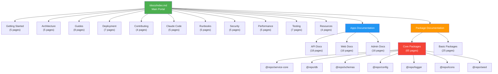
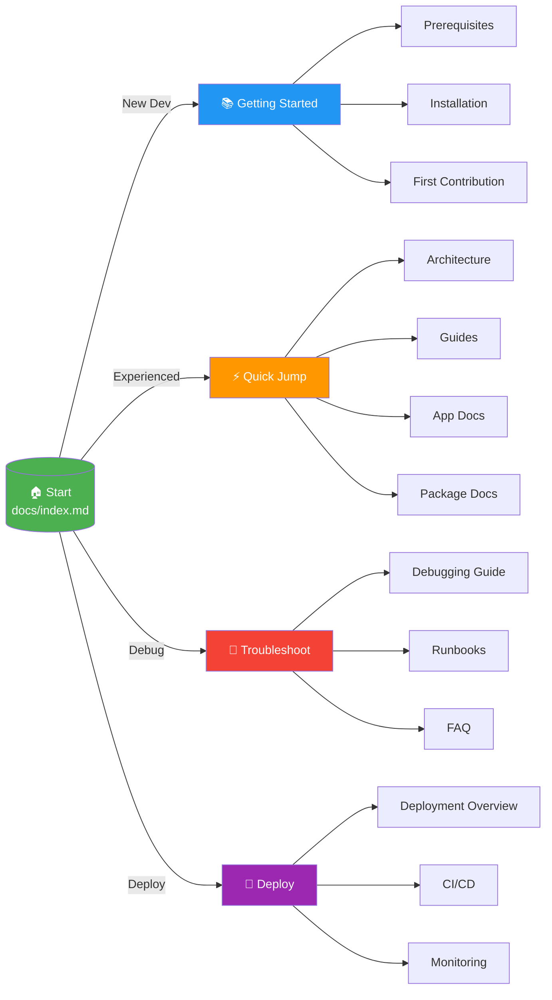
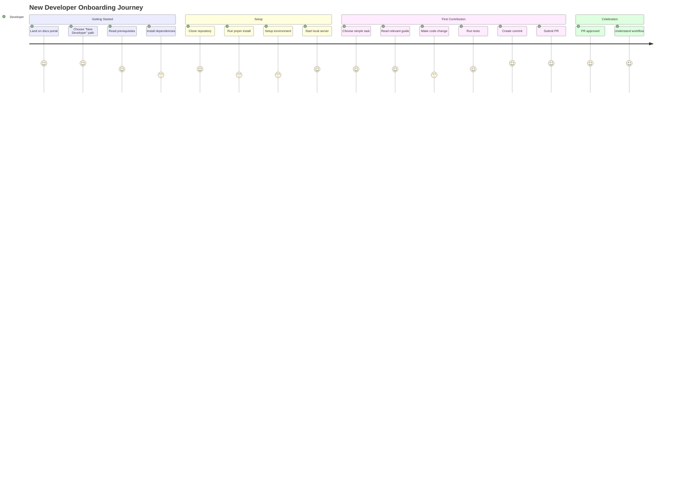

# UX & Navigation Structure

**Project:** P-002 - Documentation System Rewrite
**Date:** 2025-11-04
**Status:** Draft
**Owner:** UX/UI Designer + Tech Writer

---

## 1. Information Architecture

### 1.1 Complete Documentation Hierarchy

```
docs/                                    # CENTRAL DOCUMENTATION (45 pages)
├── index.md                             # 🏠 Main portal & navigation hub
├── getting-started/
│   ├── README.md                        # Getting started index
│   ├── prerequisites.md                 # Required tools & knowledge
│   ├── installation.md                  # Clone, install, setup
│   ├── development-environment.md       # VSCode, extensions, tools
│   ├── first-contribution.md            # Your first code change
│   └── common-tasks.md                  # Frequent commands reference
├── architecture/
│   ├── README.md                        # Architecture index
│   ├── overview.md                      # High-level system design + diagrams
│   ├── monorepo-structure.md            # Apps, packages, organization
│   ├── data-flow.md                     # Request lifecycle with code refs
│   ├── patterns.md                      # BaseModel, BaseCrudService, factories
│   └── tech-stack.md                    # Technology decisions & rationale
├── guides/                              # Cross-cutting tutorials
│   ├── README.md                        # Guides index
│   ├── adding-new-entity.md             # 📝 END-TO-END tutorial
│   ├── tdd-workflow.md                  # Red-Green-Refactor
│   ├── testing-strategy.md              # Unit, Integration, E2E
│   ├── error-handling.md                # Error patterns & best practices
│   ├── authentication.md                # Clerk integration deep dive
│   ├── debugging.md                     # Debugging techniques
│   ├── database-migrations.md           # Migration workflow
│   └── internationalization.md          # Adding languages
├── deployment/
│   ├── README.md                        # Deployment index
│   ├── overview.md                      # Architecture diagram
│   ├── environments.md                  # Dev, staging, production
│   ├── api-deployment.md                # Fly.io setup & config
│   ├── web-deployment.md                # Vercel web app
│   ├── admin-deployment.md              # Vercel admin app
│   ├── database-deployment.md           # Neon PostgreSQL
│   └── ci-cd.md                         # GitHub Actions workflows
├── contributing/
│   ├── README.md                        # Contributing index
│   ├── code-standards.md                # TypeScript, naming, conventions
│   ├── git-workflow.md                  # Branching, commits, atomic policy
│   ├── pull-request-process.md          # PR guidelines
│   └── code-review-guidelines.md        # Review checklist
├── claude-code/                         # 🤖 AI-assisted development
│   ├── README.md                        # Claude Code index
│   ├── introduction.md                  # What is Claude Code?
│   ├── setup.md                         # Setup for Hospeda
│   ├── best-practices.md                # AI-assisted dev patterns
│   ├── workflows.md                     # Project-specific workflows
│   └── resources.md                     # Links to official docs
├── runbooks/                            # Operational procedures
│   ├── README.md                        # Runbooks index
│   ├── production-bugs.md               # Investigating issues
│   ├── rollback.md                      # Rolling back deployments
│   ├── backup-recovery.md               # Database backup & restore
│   ├── scaling.md                       # Scaling API under load
│   └── monitoring.md                    # Monitoring & alerting
├── security/
│   ├── README.md                        # Security index
│   ├── overview.md                      # Security posture
│   ├── owasp-top-10.md                  # OWASP prevention
│   ├── authentication.md                # Auth best practices
│   ├── api-protection.md                # Rate limiting, CORS
│   └── input-sanitization.md            # Validation & sanitization
├── performance/
│   ├── README.md                        # Performance index
│   ├── overview.md                      # Performance philosophy
│   ├── database-optimization.md         # Query optimization
│   ├── caching.md                       # Cache strategies
│   ├── frontend-optimization.md         # Bundle size, Lighthouse
│   └── monitoring.md                    # Performance metrics
├── testing/
│   ├── README.md                        # Testing index
│   ├── strategy.md                      # Testing philosophy
│   ├── unit-testing.md                  # Unit test patterns
│   ├── integration-testing.md           # Integration test patterns
│   ├── e2e-testing.md                   # E2E test patterns
│   ├── test-factories.md                # Factory patterns
│   ├── mocking.md                       # Mocking strategies
│   └── coverage.md                      # Coverage requirements
├── resources/
│   ├── README.md                        # Resources index
│   ├── glossary.md                      # Technical terms
│   ├── faq.md                           # Frequently asked questions
│   ├── troubleshooting.md               # Common issues & solutions
│   └── external-links.md                # External resources
├── diagrams/
│   ├── documentation-map.mmd            # Overview of all docs
│   ├── request-flow.mmd                 # Complete request lifecycle
│   ├── entity-relationships.mmd         # ERD
│   ├── package-dependencies.mmd         # Package dependency graph
│   ├── authentication-flow.mmd          # Auth sequence
│   ├── deployment-architecture.mmd      # Infrastructure diagram
│   └── navigation-flow.mmd              # User navigation paths
└── examples/
    ├── README.md                        # Examples index
    ├── basic-crud/                      # Simple CRUD example
    ├── advanced-service/                # Complex service example
    ├── custom-validation/               # Custom validators
    └── testing-patterns/                # Test examples

apps/
├── api/
│   ├── README.md                        # 🎯 Quick overview + links to docs/
│   └── docs/                            # API DOCUMENTATION (18 pages)
│       ├── README.md                    # API docs portal
│       ├── setup.md                     # Local API setup
│       ├── architecture.md              # Internal architecture
│       ├── usage/                       # For API consumers
│       │   ├── README.md
│       │   ├── endpoints-reference.md   # Complete endpoints list
│       │   ├── authentication.md        # How to authenticate
│       │   ├── request-response.md      # Request/response format
│       │   ├── errors.md                # Error codes & handling
│       │   ├── rate-limiting.md         # Quotas & limits
│       │   └── openapi.md               # Swagger/OpenAPI usage
│       ├── development/                 # For API developers
│       │   ├── README.md
│       │   ├── creating-endpoints.md    # Step-by-step tutorial
│       │   ├── route-factories.md       # Factory patterns
│       │   ├── middleware.md            # Middleware system
│       │   ├── actor-system.md          # Authentication middleware
│       │   ├── validation.md            # Request validation
│       │   ├── response-factory.md      # Response patterns
│       │   ├── debugging.md             # Debugging techniques
│       │   ├── performance.md           # Performance optimization
│       │   └── deployment.md            # Deployment specifics
│       └── examples/
│           ├── crud-endpoint.ts
│           ├── list-endpoint.ts
│           ├── custom-endpoint.ts
│           └── complex-logic.ts
├── web/
│   ├── README.md                        # 🎯 Quick overview + links
│   └── docs/                            # WEB DOCUMENTATION (16 pages)
│       ├── README.md                    # Web docs portal
│       ├── setup.md                     # Local web setup
│       ├── architecture.md              # Astro + React architecture
│       ├── usage/                       # User-facing features
│       │   ├── README.md
│       │   ├── features.md              # Features overview
│       │   ├── navigation.md            # Site navigation
│       │   └── mobile.md                # Mobile/responsive design
│       ├── development/                 # For web developers
│       │   ├── README.md
│       │   ├── islands.md               # Islands Architecture
│       │   ├── pages.md                 # Pages & routing
│       │   ├── creating-pages.md        # Tutorial: new page
│       │   ├── components.md            # Component organization
│       │   ├── styling.md               # Tailwind + Shadcn
│       │   ├── state-management.md      # Nanostores
│       │   ├── data-fetching.md         # Build-time, SSR, client
│       │   ├── i18n.md                  # Internationalization
│       │   ├── seo.md                   # SEO best practices
│       │   ├── debugging.md             # Debugging techniques
│       │   ├── performance.md           # Lighthouse optimization
│       │   └── deployment.md            # Vercel deployment
│       └── examples/
│           ├── basic-page.astro
│           ├── dynamic-page.astro
│           ├── island-component.tsx
│           └── ssr-page.astro
└── admin/
    ├── README.md                        # 🎯 Quick overview + links
    └── docs/                            # ADMIN DOCUMENTATION (16 pages)
        ├── README.md                    # Admin docs portal
        ├── setup.md                     # Local admin setup
        ├── architecture.md              # TanStack Start architecture
        ├── usage/                       # For admin users
        │   ├── README.md
        │   ├── dashboard.md             # Dashboard overview
        │   ├── user-management.md       # User management features
        │   └── content-management.md    # Content workflows
        ├── development/                 # For admin developers
        │   ├── README.md
        │   ├── routing.md               # TanStack Router
        │   ├── creating-pages.md        # Tutorial: new admin page
        │   ├── forms.md                 # TanStack Form patterns
        │   ├── tables.md                # TanStack Table patterns
        │   ├── queries.md               # TanStack Query
        │   ├── authentication.md        # Auth & authorization
        │   ├── permissions.md           # RBAC implementation
        │   ├── protected-routes.md      # Route protection
        │   ├── components.md            # Admin component library
        │   ├── debugging.md             # Debugging techniques
        │   └── deployment.md            # Vercel deployment
        └── examples/
            ├── crud-page.tsx
            ├── dashboard-page.tsx
            ├── form-example.tsx
            └── table-example.tsx

packages/
├── service-core/
│   ├── README.md                        # 🎯 Quick start + API surface
│   └── docs/                            # ⭐ SUPER DETAILED (12 pages)
│       ├── README.md                    # Package portal
│       ├── quick-start.md               # Get started fast
│       ├── api/
│       │   ├── BaseCrudService.md       # Complete API reference
│       │   ├── ServiceOutput.md         # Output types
│       │   └── errors.md                # Error handling
│       ├── guides/
│       │   ├── creating-services.md     # Step-by-step tutorial
│       │   ├── permissions.md           # Permission system deep dive
│       │   ├── lifecycle-hooks.md       # All hooks explained
│       │   ├── custom-logic.md          # Business logic patterns
│       │   ├── testing.md               # Testing strategies
│       │   ├── advanced-patterns.md     # Advanced techniques
│       │   └── performance.md           # Optimization tips
│       └── examples/
│           ├── basic-service.ts
│           ├── with-hooks.ts
│           ├── complex-logic.ts
│           └── custom-methods.ts
├── db/
│   ├── README.md                        # 🎯 Quick start + API surface
│   └── docs/                            # ⭐ SUPER DETAILED (12 pages)
│       ├── README.md                    # Package portal
│       ├── quick-start.md               # Get started fast
│       ├── api/
│       │   ├── BaseModel.md             # Complete API reference
│       │   ├── query-methods.md         # All query methods
│       │   └── relations.md             # Relations API
│       ├── guides/
│       │   ├── creating-models.md       # Step-by-step tutorial
│       │   ├── drizzle-schemas.md       # Schema definitions
│       │   ├── migrations.md            # Migration workflow
│       │   ├── relations.md             # Defining relations
│       │   ├── soft-delete.md           # Soft delete patterns
│       │   ├── testing.md               # Testing models
│       │   ├── optimization.md          # Query optimization
│       │   └── transactions.md          # Transaction handling
│       └── examples/
│           ├── basic-model.ts
│           ├── with-relations.ts
│           ├── complex-queries.ts
│           └── advanced-patterns.ts
├── schemas/
│   ├── README.md                        # 🎯 Quick start + API surface
│   └── docs/                            # ⭐ SUPER DETAILED (10 pages)
│       ├── README.md                    # Package portal
│       ├── quick-start.md               # Get started fast
│       ├── api/
│       │   ├── schema-reference.md      # All schemas
│       │   ├── type-inference.md        # z.infer usage
│       │   └── validators.md            # Custom validators
│       ├── guides/
│       │   ├── creating-schemas.md      # Step-by-step tutorial
│       │   ├── composition.md           # Schema reusability
│       │   ├── validation-patterns.md   # CRUD, search patterns
│       │   ├── enums.md                 # Enum definitions
│       │   └── testing.md               # Schema testing
│       └── examples/
│           ├── entity-schema.ts
│           ├── api-schema.ts
│           ├── form-schema.ts
│           └── complex-validation.ts
├── config/
│   ├── README.md                        # 🎯 Quick start + API surface
│   └── docs/                            # ⭐ SUPER DETAILED (8 pages)
│       ├── README.md                    # Package portal
│       ├── quick-start.md               # Get started fast
│       ├── api/
│       │   ├── config-reference.md      # All config values
│       │   └── env-vars.md              # Environment variables
│       ├── guides/
│       │   ├── adding-config.md         # Add new config
│       │   ├── validation.md            # Env var validation
│       │   ├── environments.md          # Dev, staging, prod
│       │   ├── testing.md               # Config testing
│       │   └── security.md              # Security best practices
│       └── examples/
│           ├── new-env-var.ts
│           ├── typed-config.ts
│           └── environment-specific.ts
├── logger/
│   ├── README.md                        # 🎯 Quick start + API surface
│   └── docs/                            # ⭐ SUPER DETAILED (8 pages)
│       ├── README.md                    # Package portal
│       ├── quick-start.md               # Get started fast
│       ├── api/
│       │   ├── logger-reference.md      # Complete API
│       │   └── log-levels.md            # When to use each level
│       ├── guides/
│       │   ├── scoped-loggers.md        # Creating scoped loggers
│       │   ├── formatting.md            # Log formatting
│       │   ├── structured-logging.md    # Structured logs
│       │   ├── performance.md           # Performance tips
│       │   ├── testing.md               # Testing with logger
│       │   └── monitoring.md            # Integration with systems
│       └── examples/
│           ├── basic-logging.ts
│           ├── scoped-logging.ts
│           ├── structured-logging.ts
│           └── error-logging.ts
├── icons/
│   ├── README.md                        # 🎯 Quick start + catalog
│   └── docs/                            # ⭐ SUPER DETAILED (8 pages)
│       ├── README.md                    # Package portal
│       ├── quick-start.md               # Get started fast
│       ├── api/
│       │   ├── icons-catalog.md         # All available icons
│       │   └── usage-reference.md       # Icon component API
│       ├── guides/
│       │   ├── adding-icons.md          # Add new icons
│       │   ├── naming.md                # Naming conventions
│       │   ├── optimization.md          # Icon optimization
│       │   ├── accessibility.md         # A11y best practices
│       │   └── testing.md               # Testing icons
│       └── examples/
│           ├── basic-usage.tsx
│           ├── custom-sizing.tsx
│           ├── colors.tsx
│           └── accessibility.tsx
├── seed/
│   ├── README.md                        # 🎯 Quick start + commands
│   └── docs/                            # ⭐ SUPER DETAILED (7 pages)
│       ├── README.md                    # Package portal
│       ├── quick-start.md               # Get started fast
│       ├── api/
│       │   └── seed-structure.md        # Data structure
│       ├── guides/
│       │   ├── creating-seeds.md        # Create new seed data
│       │   ├── dependencies.md          # Seed dependencies
│       │   ├── testing.md               # Testing with seeds
│       │   └── environments.md          # Prod vs dev seeds
│       └── examples/
│           ├── basic-seed.ts
│           ├── related-entities.ts
│           └── complex-data.ts
└── [other-packages]/                    # 📋 BASIC DOCUMENTATION
    ├── README.md                        # Purpose, install, basic usage
    └── docs/ (optional)
        └── usage-guide.md (if needed)
```

### 1.2 Navigation Depth & Organization Principles

**Maximum Nesting Levels:**

- **Central docs**: 2 levels max (`docs/category/page.md`)
- **App docs**: 3 levels max (`apps/api/docs/category/subcategory/page.md`)
- **Package docs**: 3 levels max (`packages/db/docs/api/page.md`)

**File Naming Conventions:**

- Use `kebab-case` for all files: `creating-new-entity.md`
- Index files always named `README.md`
- Number prefixes for ordered content: `01-setup.md`, `02-development.md`
- Avoid generic names: ❌ `guide.md` ✅ `creating-services-guide.md`

**Content Splitting Rules:**

- **Split when**: Page exceeds 500 lines OR covers multiple distinct topics
- **Don't split**: If content is a cohesive tutorial or reference
- **Example**: Split `authentication.md` into `authentication-setup.md` + `authentication-advanced.md`

---

## 2. Navigation Patterns

### 2.1 Entry Points

**Primary Entry: `/docs/index.md`**

- Hero section with project overview
- Quick links by user type (New Dev, Experienced Dev, Operator)
- Quick links by task (Add Feature, Debug, Learn, Deploy)
- Recently updated docs
- Search box (browser Ctrl+F for MVP)

**Secondary Entries:**

- `apps/api/README.md` - Quick jump to API docs
- `apps/web/README.md` - Quick jump to Web docs
- `apps/admin/README.md` - Quick jump to Admin docs
- `packages/*/README.md` - Quick jump to package docs

### 2.2 Primary Navigation (Central Docs)

**Top-level categories** (shown in sidebar):

1. 🚀 Getting Started
2. 🏗️ Architecture
3. 📖 Guides
4. 🚀 Deployment
5. 🤝 Contributing
6. 🤖 Claude Code
7. 📋 Runbooks
8. 🔒 Security
9. ⚡ Performance
10. 🧪 Testing
11. 📚 Resources
12. 📊 Diagrams
13. 💡 Examples

**Each category has:**

- `README.md` as index
- List of pages with descriptions
- Estimated reading time
- Skill level indicator (Beginner/Intermediate/Advanced)

### 2.3 Secondary Navigation

**Within-page TOC:**

```markdown
## Table of Contents
- [Overview](#overview)
- [Prerequisites](#prerequisites)
- [Step 1: Setup](#step-1-setup)
  - [Install dependencies](#install-dependencies)
  - [Configure environment](#configure-environment)
- [Step 2: Implementation](#step-2-implementation)
...
```

**Breadcrumbs:**

```
Home > Guides > Adding a New Entity
```

**Previous/Next Links** (at bottom of page):

```markdown
---
⬅️ Previous: [Database Migrations](database-migrations.md) | Next: [TDD Workflow](tdd-workflow.md) ➡️
```

### 2.4 Cross-linking Strategy

**Central → Distributed:**

```markdown
For API-specific setup, see [API Setup Guide](../../apps/api/docs/setup.md)

For service implementation details, see [@repo/service-core docs](../../packages/service-core/docs/README.md)
```

**Distributed → Central:**

```markdown
For general architecture overview, see [Architecture Docs](/docs/architecture/overview.md)

This guide assumes you've completed [Getting Started](/docs/getting-started/README.md)
```

**Between Distributed Docs:**

```markdown
Services use models from [@repo/db](../../db/docs/README.md)

Schemas are validated using [@repo/schemas](../../schemas/docs/README.md)
```

### 2.5 Role-based Navigation

**New Developer:**

```
Entry: /docs/index.md → "New Developer" button
↓
/docs/getting-started/README.md
↓
/docs/getting-started/prerequisites.md
↓
/docs/getting-started/installation.md
↓
/docs/getting-started/first-contribution.md
Exit: First PR submitted ✅
```

**Experienced Developer (Memory Refresh):**

```
Entry: /docs/index.md → Search or category browse
↓
Find specific guide or package docs
↓
Quick scan of relevant section
Exit: Memory refreshed ✅
```

**Feature Implementation:**

```
Entry: /docs/guides/adding-new-entity.md
↓
Follow step-by-step tutorial
→ Link to /packages/schemas/docs/guides/creating-schemas.md
→ Link to /packages/db/docs/guides/creating-models.md
→ Link to /packages/service-core/docs/guides/creating-services.md
→ Link to /apps/api/docs/development/creating-endpoints.md
Exit: Feature implemented ✅
```

**API Consumer:**

```
Entry: /apps/api/docs/usage/README.md
↓
/apps/api/docs/usage/authentication.md
↓
/apps/api/docs/usage/endpoints-reference.md
Exit: API integrated ✅
```

**Operations/Runbooks:**

```
Entry: /docs/runbooks/README.md
↓
Select specific runbook (e.g., production-bugs.md)
↓
Follow procedure
Exit: Issue resolved ✅
```

---

## 3. User Flows

### 3.1 New Developer Onboarding (<2 hours)

**Goal:** From git clone to first contribution

**Flow:**

1. **Start**: Land on `/docs/index.md`
   - Click "New Developer" quick start
2. **Prerequisites** (`prerequisites.md`) - 10 min
   - Check Node.js, PNPM, PostgreSQL
   - VSCode + extensions
3. **Installation** (`installation.md`) - 15 min
   - Clone repo
   - `pnpm install`
   - Setup `.env.local`
   - `pnpm db:fresh`
4. **Dev Environment** (`development-environment.md`) - 10 min
   - VSCode settings
   - Recommended extensions
   - Debugging setup
5. **First Contribution** (`first-contribution.md`) - 60 min
   - Simple task: "Add validation to existing field"
   - Run tests
   - Create commit
   - Submit PR
6. **Exit**: PR submitted ✅

**Key pages visited:** 5
**Estimated time:** 95 minutes
**Success metric:** First PR within 2 hours

### 3.2 Owner Memory Refresh (after 1 week)

**Goal:** Remember how system works after break

**Flow:**

1. **Start**: Land on `/docs/index.md`
   - Scan recent changes
   - Remember what was working on
2. **Quick Architecture Review** (`architecture/overview.md`) - 5 min
   - Re-familiarize with layers
   - Check data flow diagram
3. **Specific Component Deep Dive** - 15 min
   - Jump to relevant package docs
   - Example: `/packages/service-core/docs/api/BaseCrudService.md`
   - Scan API reference
4. **Review Code** - 10 min
   - Open actual code with docs as reference
5. **Exit**: Ready to code ✅

**Key pages visited:** 3-5
**Estimated time:** 30 minutes
**Success metric:** Can resume work in <30 min

### 3.3 Feature Implementation (Add New Entity)

**Goal:** Implement complete new entity end-to-end

**Flow:**

1. **Start**: `/docs/guides/adding-new-entity.md`
2. **Step 1: Create Schema** - 20 min
   - Link to `/packages/schemas/docs/guides/creating-schemas.md`
   - Follow tutorial
   - Create entity, create, update, search schemas
3. **Step 2: Create Model** - 30 min
   - Link to `/packages/db/docs/guides/creating-models.md`
   - Define Drizzle schema
   - Create model class
   - Write tests
4. **Step 3: Create Service** - 40 min
   - Link to `/packages/service-core/docs/guides/creating-services.md`
   - Implement service
   - Add permission hooks
   - Write tests
5. **Step 4: Create API Endpoint** - 30 min
   - Link to `/apps/api/docs/development/creating-endpoints.md`
   - Use route factory
   - Test endpoint
6. **Step 5: Integration Test** - 20 min
   - Run full test suite
   - Fix any issues
7. **Exit**: Feature complete with tests ✅

**Key pages visited:** 5
**Estimated time:** 140 minutes
**Success metric:** Working feature with 90%+ coverage

### 3.4 Debugging Flow

**Goal:** Fix a production bug

**Flow:**

1. **Start**: `/docs/guides/debugging.md`
2. **Identify Layer** - 5 min
   - Is it API? Web? Admin? Database? Service?
3. **Layer-specific Debugging** - Variable
   - API: `/apps/api/docs/development/debugging.md`
   - Web: `/apps/web/docs/development/debugging.md`
   - Service: `/packages/service-core/docs/guides/testing.md`
   - DB: `/packages/db/docs/guides/optimization.md`
4. **Check Logs** - 10 min
   - `/packages/logger/docs/guides/structured-logging.md`
5. **Check Monitoring** - 10 min
   - `/docs/runbooks/monitoring.md`
6. **Fix & Test** - Variable
7. **Exit**: Bug fixed ✅

**Key pages visited:** 3-4
**Estimated time:** Variable
**Success metric:** Issue resolved

---

## 4. Content Organization Principles

### 4.1 Progressive Disclosure

**3-tier approach:**

**Tier 1: Quick Start** (5-10 min read)

- What is this?
- When to use it?
- Minimal example
- Links to deeper docs

**Tier 2: Guides** (20-40 min read)

- Step-by-step tutorials
- Common use cases
- Best practices
- Links to API reference

**Tier 3: Reference** (Look-up, not read through)

- Complete API documentation
- All options and parameters
- Edge cases
- Advanced patterns

**Example: @repo/service-core**

```
README.md                           # Tier 1: Quick overview
docs/quick-start.md                 # Tier 1: Get started in 5 min
docs/guides/creating-services.md   # Tier 2: Step-by-step tutorial
docs/api/BaseCrudService.md         # Tier 3: Complete API reference
```

### 4.2 Code Example Strategy

**Inline Snippets** (10-20 lines):

```typescript
// Quick example in docs
const service = new AccommodationService(ctx)
const result = await service.create(actor, data)
if (!result.success) {
  throw new ServiceError(result.error.code, result.error.message)
}
```

**Linked Complete Examples** (50-100 lines):

```markdown
For a complete working example, see [examples/basic-service.ts](../examples/basic-service.ts)

Or see real implementation: [AccommodationService](../../../packages/service-core/src/services/accommodation/accommodation.service.ts)
```

**Example Files Organization:**

```
docs/examples/
├── README.md              # Index of all examples
├── basic-service.ts       # Simple service
├── with-hooks.ts          # Service with lifecycle hooks
└── complex-logic.ts       # Advanced patterns
```

### 4.3 Cross-referencing Rules

**When to Link:**

- ✅ Related concepts in different sections
- ✅ Prerequisites or dependencies
- ✅ Deeper dive into topic
- ✅ Real code implementation

**When NOT to Link:**

- ❌ Within same page (use anchor links instead)
- ❌ To external docs for common concepts (explain inline)
- ❌ Excessively (max 3-4 links per paragraph)

**Link Format:**

```markdown
<!-- Relative links within docs -->
See [Architecture Overview](../../architecture/overview.md)

<!-- Relative links to code -->
See implementation: [BaseModel](../../packages/db/src/base/base.model.ts:15)

<!-- External links -->
Learn more about [Drizzle ORM](https://orm.drizzle.team/)
```

---

## 5. Documentation Templates

### 5.1 Central Guide Template

```markdown
# [Topic Name]

**Level:** Beginner | Intermediate | Advanced
**Reading Time:** ~XX minutes
**Prerequisites:** [Link to prerequisite docs]

---

## Overview

[2-3 sentence overview of what this guide covers]

**In this guide you will learn:**
- Bullet point 1
- Bullet point 2
- Bullet point 3

---

## Table of Contents

- [Prerequisites](#prerequisites)
- [Step 1: Setup](#step-1-setup)
- [Step 2: Implementation](#step-2-implementation)
- [Step 3: Testing](#step-3-testing)
- [Common Issues](#common-issues)
- [Next Steps](#next-steps)

---

## Prerequisites

Before starting, make sure you have:
- [ ] Prerequisite 1
- [ ] Prerequisite 2

---

## Step 1: Setup

[Content]

```typescript
// Code example
```

---

## Step 2: Implementation

[Content]

---

## Step 3: Testing

[Content]

---

## Common Issues

### Issue 1: Problem description

**Solution:** How to fix

### Issue 2: Problem description

**Solution:** How to fix

---

## Next Steps

Now that you've completed [topic], you might want to:

- [Related topic 1](link)
- [Related topic 2](link)

---

**Related Documentation:**

- [Related doc 1](link)
- [Related doc 2](link)

---

⬅️ Previous: [Previous Topic](link) | Next: [Next Topic](link) ➡️

```

### 5.2 App Documentation Template (SUPER DETAILED)

```markdown
# [App Name] Documentation

**App:** api | web | admin
**Version:** [version]
**Last Updated:** [date]

---

## Overview

[2-3 paragraphs describing the app's purpose, architecture, and key features]

**Key Technologies:**
- Technology 1
- Technology 2

**Documentation Structure:**
- [Usage Documentation](#usage-documentation) - For users/consumers
- [Development Documentation](#development-documentation) - For developers

---

## Quick Start

```bash
# Clone and install
git clone [repo]
pnpm install

# Start [app]
pnpm dev --filter=[app]
```

**Next Steps:**

- [Setup Guide](setup.md) - Complete local setup
- [Architecture](architecture.md) - Understand the internals

---

## Usage Documentation

### For [App] Users

- [Getting Started](usage/README.md)
- [Feature 1](usage/feature-1.md)
- [Feature 2](usage/feature-2.md)

---

## Development Documentation

### For [App] Developers

- [Setup Guide](development/README.md)
- [Architecture Deep Dive](architecture.md)
- [Creating New Features](development/creating-features.md)
- [Testing](development/testing.md)
- [Debugging](development/debugging.md)
- [Deployment](development/deployment.md)

---

## Examples

Browse complete working examples:

- [Example 1](examples/example-1.md)
- [Example 2](examples/example-2.md)

---

## Contributing

See [Contributing Guidelines](/docs/contributing/README.md) for general guidelines.

App-specific considerations:

- [Consideration 1]
- [Consideration 2]

---

## Support

- 📖 [General Documentation](/docs/index.md)
- 🐛 [Report Issues](link)
- 💬 [Discussions](link)

```

### 5.3 Package Documentation Template (SUPER DETAILED)

```markdown
# @repo/[package-name]

**Package:** @repo/[name]
**Version:** [version]
**Last Updated:** [date]

---

## Overview

[2-3 paragraphs describing the package's purpose and main exports]

**Main Exports:**
- `ExportClass1` - Description
- `ExportClass2` - Description
- `ExportFunction` - Description

---

## Installation

```bash
# This package is internal to the monorepo
# Import in your code:
import { Export } from '@repo/[package-name]'
```

---

## Quick Start

```typescript
// 5-minute quick start example
import { MainExport } from '@repo/[package-name]'

const instance = new MainExport()
const result = instance.method()
```

**Next Steps:**

- [Full Guide](docs/guides/getting-started.md)
- [API Reference](docs/api/README.md)

---

## Usage Documentation

**For Package Users:**

- [Quick Start](docs/quick-start.md) - Get started in 5 minutes
- [API Reference](docs/api/README.md) - Complete API docs
- [Common Use Cases](docs/guides/use-cases.md)

---

## Development Documentation

**For Package Contributors:**

- [Creating New Features](docs/guides/creating-features.md)
- [Testing Strategies](docs/guides/testing.md)
- [Performance Optimization](docs/guides/performance.md)
- [Advanced Patterns](docs/guides/advanced-patterns.md)

---

## Examples

Browse complete working examples:

- [Basic Usage](docs/examples/basic.ts)
- [Advanced Usage](docs/examples/advanced.ts)

---

## API Reference

See [Complete API Reference](docs/api/README.md)

**Quick Links:**

- [MainClass](docs/api/MainClass.md)
- [HelperFunctions](docs/api/helpers.md)

---

## Contributing

See [Contributing Guidelines](/docs/contributing/README.md)

---

## License

MIT

```

### 5.4 Package README Template (BASIC)

```markdown
# @repo/[package-name]

[One paragraph describing purpose]

## Installation

```bash
# Internal package
import { Export } from '@repo/[package-name]'
```

## Usage

```typescript
// Quick example
const result = function()
```

## API

### `functionName(params)`

Brief description

**Parameters:**

- `param1` - Description
- `param2` - Description

**Returns:** Description

### `ClassName`

Brief description

**Methods:**

- `.method1()` - Description
- `.method2()` - Description

## Examples

```typescript
// Example 1
```

```typescript
// Example 2
```

## Documentation

For more details, see [docs/README.md](docs/README.md) (if applicable)

## Contributing

See [Contributing Guidelines](/docs/contributing/README.md)

```

### 5.5 Runbook Template

```markdown
# Runbook: [Operational Procedure Name]

**Purpose:** [One sentence describing when to use this runbook]
**Severity:** Low | Medium | High | Critical
**Estimated Time:** XX minutes
**Last Updated:** [date]

---

## Overview

[2-3 paragraphs describing the scenario and procedure]

---

## Prerequisites

Before starting:
- [ ] Access to [system/tool]
- [ ] Permission level: [level]
- [ ] Required tools: [list]

---

## Symptoms

You might need this runbook if:
- Symptom 1
- Symptom 2
- Symptom 3

---

## Procedure

### Step 1: [Action]

**What to do:**
[Detailed instructions]

**Commands:**
```bash
command here
```

**Expected outcome:**
[What should happen]

**If this fails:**
[Troubleshooting steps]

---

### Step 2: [Action]

[Repeat structure]

---

### Step 3: [Action]

[Repeat structure]

---

## Verification

Verify the fix:

- [ ] Check 1
- [ ] Check 2
- [ ] Check 3

---

## Rollback

If the procedure fails or makes things worse:

1. Step 1 to rollback
2. Step 2 to rollback

---

## Post-Incident

After resolving:

- [ ] Document what happened
- [ ] Update runbook if needed
- [ ] Notify team
- [ ] Create post-mortem (if critical)

---

## Related Runbooks

- [Related runbook 1](link)
- [Related runbook 2](link)

---

## Support

- Escalation: [contact]
- Team channel: [link]

```

---

## 6. Portal & Landing Pages

### 6.1 Main Documentation Portal (`/docs/index.md`)

```markdown
# Hospeda Documentation

**Welcome to the Hospeda monorepo documentation!**

Hospeda is a tourism accommodation platform for Concepción del Uruguay and the Litoral region of Argentina, built with a modern monorepo architecture.

---

## 🚀 Quick Start by Role

### 👋 New Developer
**First time here? Start here!**
- [Prerequisites](getting-started/prerequisites.md) - What you need
- [Installation](getting-started/installation.md) - Get set up
- [First Contribution](getting-started/first-contribution.md) - Make your first change

⏱️ **Time to first contribution:** ~2 hours

### 💻 Experienced Developer
**Know the codebase? Find what you need:**
- [Architecture Overview](architecture/overview.md)
- [Adding a New Entity](guides/adding-new-entity.md)
- [Testing Strategy](testing/strategy.md)

### 🔧 Need to Debug Something?
- [Debugging Guide](guides/debugging.md)
- [Common Issues](resources/troubleshooting.md)
- [Runbooks](runbooks/README.md)

### 🚀 Ready to Deploy?
- [Deployment Overview](deployment/overview.md)
- [CI/CD Pipeline](deployment/ci-cd.md)

---

## 📖 Documentation by Component

### Apps
- 🌐 [API Documentation](../apps/api/docs/README.md) - Hono backend API
- 🎨 [Web Documentation](../apps/web/docs/README.md) - Astro + React frontend
- ⚡ [Admin Documentation](../apps/admin/docs/README.md) - TanStack Start dashboard

### Core Packages (Detailed Docs)
- 🔄 [@repo/service-core](../packages/service-core/docs/README.md) - Business logic layer
- 🗄️ [@repo/db](../packages/db/docs/README.md) - Database models & ORM
- ✅ [@repo/schemas](../packages/schemas/docs/README.md) - Validation schemas
- ⚙️ [@repo/config](../packages/config/docs/README.md) - Configuration
- 📝 [@repo/logger](../packages/logger/docs/README.md) - Logging system
- 🎨 [@repo/icons](../packages/icons/docs/README.md) - Icon library
- 🌱 [@repo/seed](../packages/seed/docs/README.md) - Database seeding

[View all packages](../packages/README.md)

---

## 📚 Browse by Topic

### Architecture & Patterns
- [System Overview](architecture/overview.md)
- [Monorepo Structure](architecture/monorepo-structure.md)
- [Data Flow](architecture/data-flow.md)
- [Architectural Patterns](architecture/patterns.md)

### Guides & Tutorials
- [Adding a New Entity (End-to-End)](guides/adding-new-entity.md) 📝
- [TDD Workflow](guides/tdd-workflow.md)
- [Error Handling](guides/error-handling.md)
- [Authentication](guides/authentication.md)

### Development
- [Code Standards](contributing/code-standards.md)
- [Git Workflow](contributing/git-workflow.md)
- [Testing Strategy](testing/strategy.md)

### Operations
- [Runbooks](runbooks/README.md)
- [Monitoring](runbooks/monitoring.md)
- [Security](security/README.md)
- [Performance](performance/README.md)

### Working with AI
- [Claude Code Guide](claude-code/README.md) 🤖
- [Best Practices](claude-code/best-practices.md)
- [Project Workflows](claude-code/workflows.md)

---

## 🔍 Search Documentation

**Using Browser Search:**
- Press `Ctrl+F` (Windows/Linux) or `Cmd+F` (Mac)
- Type your search term
- Navigate through results

**GitHub Search:**
- Visit the repository on GitHub
- Use the search bar to find content across all docs

---

## 📊 Diagrams & Visual Guides

- [Documentation Map](diagrams/documentation-map.mmd) - Overview of all docs
- [Request Flow](diagrams/request-flow.mmd) - Complete request lifecycle
- [Package Dependencies](diagrams/package-dependencies.mmd)
- [Authentication Flow](diagrams/authentication-flow.mmd)

---

## 💡 Recently Updated

- [Date] - [Document Name](link) - Brief description
- [Date] - [Document Name](link) - Brief description
- [Date] - [Document Name](link) - Brief description

---

## 🤝 Contributing

We welcome contributions! Before contributing:
1. Read [Contributing Guidelines](contributing/README.md)
2. Check [Code Standards](contributing/code-standards.md)
3. Follow [Git Workflow](contributing/git-workflow.md)

---

## 📞 Need Help?

- 💬 [Discussions](link) - Ask questions
- 🐛 [Report Bug](link) - Found an issue?
- 📖 [FAQ](resources/faq.md) - Common questions
- 🔧 [Troubleshooting](resources/troubleshooting.md) - Common problems

---

**Built with ❤️ by the Hospeda team**
```

### 6.2 App Portal Template (`apps/api/docs/README.md`)

```markdown
# API Documentation

**Hono Backend API for Hospeda**

---

## 🚀 Quick Start

```bash
# Start API locally
pnpm dev --filter=api
```

**Access:**

- API: <http://localhost:3001>
- OpenAPI Docs: <http://localhost:3001/docs>
- Swagger UI: <http://localhost:3001/ui>

---

## 📖 Documentation Structure

### For API Consumers

**Using the API from external apps:**

- [Endpoints Reference](usage/endpoints-reference.md) - All available endpoints
- [Authentication](usage/authentication.md) - How to authenticate
- [Request/Response Format](usage/request-response.md)
- [Error Handling](usage/errors.md)
- [Rate Limiting](usage/rate-limiting.md)

### For API Developers

**Building and extending the API:**

- [Setup Guide](development/README.md) - Local development setup
- [Architecture](architecture.md) - Internal architecture
- [Creating Endpoints](development/creating-endpoints.md) - Step-by-step
- [Route Factories](development/route-factories.md) - Factory patterns
- [Middleware](development/middleware.md) - Middleware system
- [Debugging](development/debugging.md) - Troubleshooting
- [Performance](development/performance.md) - Optimization tips
- [Deployment](development/deployment.md) - Deploy to Fly.io

---

## 💡 Popular Topics

- [How to create a CRUD endpoint](development/creating-endpoints.md#crud-endpoint)
- [How to add authentication to endpoint](development/middleware.md#authentication)
- [How to handle validation errors](development/validation.md)

---

## 📊 API Architecture

[Include diagram here]

---

## 🔗 Related Documentation

- [Service Core Package](../../packages/service-core/docs/README.md) - Business logic
- [DB Package](../../packages/db/docs/README.md) - Database layer
- [Schemas Package](../../packages/schemas/docs/README.md) - Validation

---

⬅️ Back to [Main Documentation](/docs/index.md)

```

### 6.3 Package Portal Template (`packages/db/docs/README.md`)

```markdown
# @repo/db

**Database layer with Drizzle ORM**

---

## 🚀 Quick Start

```typescript
import { AccommodationModel } from '@repo/db'

const model = new AccommodationModel()
const results = await model.findAll({ isActive: true })
```

---

## 📖 Documentation

### Usage Documentation

**For developers using this package:**

- [Quick Start](quick-start.md) - Get started in 5 minutes
- [API Reference](api/BaseModel.md) - Complete API docs
- [Query Methods](api/query-methods.md) - All query methods

### Development Documentation

**For developers contributing to this package:**

- [Creating Models](guides/creating-models.md) - Step-by-step tutorial
- [Drizzle Schemas](guides/drizzle-schemas.md) - Schema definitions
- [Migrations](guides/migrations.md) - Migration workflow
- [Relations](guides/relations.md) - Defining relations
- [Testing](guides/testing.md) - Testing strategies
- [Performance](guides/optimization.md) - Query optimization

---

## 💡 Examples

Browse complete working examples:

- [Basic Model](examples/basic-model.ts)
- [Model with Relations](examples/with-relations.ts)
- [Complex Queries](examples/complex-queries.ts)
- [Advanced Patterns](examples/advanced-patterns.ts)

---

## 🏗️ Architecture

This package provides:

- **BaseModel** - Abstract base class for all models
- **CRUD operations** - findAll, findById, create, update, delete
- **Soft delete** - Built-in soft delete support
- **Relations** - Automatic relation loading
- **Transactions** - Transaction support

---

## 🔗 Related Packages

- [@repo/schemas](../schemas/docs/README.md) - Validation schemas
- [@repo/service-core](../service-core/docs/README.md) - Business logic

---

⬅️ Back to [Main Documentation](/docs/index.md)

```

---

## 7. Visual Hierarchy & Formatting Standards

### 7.1 Heading Levels

**H1 (`#`)** - Page title only
- One per page
- At the very top
- Example: `# Adding a New Entity`

**H2 (`##`)** - Major sections
- Top-level sections of the page
- Example: `## Prerequisites`, `## Step 1: Setup`

**H3 (`###`)** - Sub-sections
- Nested within H2
- Example: `### Install Dependencies`

**H4 (`####`)** - Minor sub-sections
- Nested within H3
- Use sparingly
- Example: `#### Validation Rules`

**Maximum depth:** H4 (####)
- Don't use H5 or H6
- If you need more depth, consider splitting the page

### 7.2 Callouts & Admonitions

**Use callouts to highlight important information:**

**✅ TIP** - Helpful suggestions:
```markdown
> 💡 **TIP:** For faster development, use the `--watch` flag.
```

**⚠️ WARNING** - Important cautions:

```markdown
> ⚠️ **WARNING:** This operation is irreversible. Make a backup first.
```

**ℹ️ NOTE** - Additional information:

```markdown
> ℹ️ **NOTE:** This feature requires PostgreSQL 13+.
```

**🚨 DANGER** - Critical warnings:

```markdown
> 🚨 **DANGER:** Never commit secrets to version control.
```

**📝 EXAMPLE** - Code examples:

```markdown
> 📝 **EXAMPLE:**
> ```typescript
> const result = await model.create({ name: 'Test' })
> ```
```

### 7.3 Code Block Formatting

**Always specify language:**

```markdown
❌ Bad:
\`\`\`
const x = 1
\`\`\`

✅ Good:
\`\`\`typescript
const x = 1
\`\`\`
```

**Supported languages:**

- `typescript` / `ts`
- `javascript` / `js`
- `bash` / `shell`
- `json`
- `yaml`
- `sql`
- `html`
- `css`

**Add comments for clarity:**

```typescript
// Good: Create a new service instance
const service = new AccommodationService(ctx)

// Bad: Perform action
const result = await service.create(actor, data)
```

**Highlight important lines:**

```typescript
const service = new AccommodationService(ctx)
const result = await service.create(actor, data)
if (!result.success) {  // ← Check this!
  throw new ServiceError(result.error.code, result.error.message)
}
```

### 7.4 Table Usage

**When to use tables:**

- Comparing options (pros/cons)
- Listing parameters and types
- API reference (params, returns, types)
- Configuration options

**Table format:**

```markdown
| Parameter | Type | Required | Description |
|-----------|------|----------|-------------|
| `name` | `string` | Yes | Entity name |
| `slug` | `string` | No | URL-friendly identifier |
```

**Don't use tables for:**

- Long paragraphs of text
- Code examples (use code blocks)
- Lists (use bullet points)

### 7.5 Diagram Placement

**When to include diagrams:**

- Complex flows (authentication, deployment)
- Architecture overviews
- User journeys
- Data flows

**Diagram format:**

```markdown
## Architecture Overview

```mermaid
graph TD
    A[Frontend] --> B[API]
    B --> C[Service]
    C --> D[Database]
\`\`\`

[Caption: Request flow through the system layers]
```

**Diagram placement:**

- After introducing the concept
- Before detailed explanation
- At the end as reference

### 7.6 Link Styling

**Internal links** (within docs):

```markdown
See [Architecture Overview](../architecture/overview.md)
```

**External links** (to websites):

```markdown
Learn more about [Drizzle ORM](https://orm.drizzle.team/)
```

**Code links** (to actual code):

```markdown
See implementation: [BaseModel.ts](../../../packages/db/src/base/base.model.ts:15)
```

**Anchor links** (same page):

```markdown
Jump to [Prerequisites](#prerequisites)
```

---

## 8. Mobile & Responsive Considerations

### 8.1 Mobile Reading Experience

**Optimize for mobile:**

- Use shorter paragraphs (3-4 sentences max)
- Break long code blocks into chunks
- Use collapsible sections for long content
- Avoid wide tables (prefer lists on mobile)

**Touch-friendly navigation:**

- Larger click targets (buttons, links)
- Adequate spacing between links
- Swipe-friendly TOC
- Back-to-top button

### 8.2 Responsive Tables

**Convert tables to lists on mobile:**

**Desktop view:**

| Param | Type | Description |
|-------|------|-------------|
| name | string | Entity name |

**Mobile-friendly alternative:**

```markdown
**Parameters:**
- **name** (`string`) - Entity name
- **slug** (`string`) - URL identifier
```

### 8.3 Code Block Handling

**Mobile code blocks:**

- Enable horizontal scrolling
- Syntax highlighting works
- Copy button accessible
- Line numbers optional (can be toggled)

---

## 9. Accessibility Standards

### 9.1 Screen Reader Compatibility

**Alt text for diagrams:**

```markdown

```

**Descriptive link text:**

```markdown
❌ Click [here](link) for more information
✅ Read the [complete API reference](link)
```

**Heading hierarchy:**

- Don't skip levels (H2 → H4)
- Use logical progression (H1 → H2 → H3)

### 9.2 Keyboard Navigation

**Ensure all interactive elements are keyboard-accessible:**

- Links: Tab to navigate, Enter to activate
- Code blocks: Tab to focus, Copy button accessible
- TOC: Keyboard navigable

### 9.3 Color Contrast

**Code block themes:**

- High contrast for readability
- Meets WCAG AA standards
- Color is not the only indicator

**Link colors:**

- Distinct from body text
- Underlined or clearly marked
- Visited links have different color

---

## 10. Mermaid Diagrams

### 10.1 Documentation Map



### 10.2 Navigation Flow



### 10.3 User Journey: New Developer Onboarding



### 10.4 Content Hierarchy

```mermaid
graph TD
    Central["/docs<br/>Central Documentation<br/>45 pages"]
    Apps["Apps Documentation<br/>50 pages"]
    Packages["Package Documentation<br/>90 pages"]

    Central --> Overview["Overview & Getting Started"]
    Central --> CrossCutting["Cross-cutting Guides"]
    Central --> Operations["Operations & Deployment"]
    Central --> Standards["Standards & Contributing"]

    Apps --> API["apps/api/docs<br/>18 pages<br/>SUPER DETAILED"]
    Apps --> Web["apps/web/docs<br/>16 pages<br/>SUPER DETAILED"]
    Apps --> Admin["apps/admin/docs<br/>16 pages<br/>SUPER DETAILED"]

    API --> APIUsage["Usage Docs<br/>(API Consumers)"]
    API --> APIDev["Development Docs<br/>(API Developers)"]

    Web --> WebUsage["Usage Docs<br/>(Features)"]
    Web --> WebDev["Development Docs<br/>(Web Developers)"]

    Admin --> AdminUsage["Usage Docs<br/>(Admin Features)"]
    Admin --> AdminDev["Development Docs<br/>(Admin Developers)"]

    Packages --> CorePkg["Core Packages<br/>65 pages<br/>SUPER DETAILED"]
    Packages --> BasicPkg["Other Packages<br/>25 pages<br/>BASIC"]

    CorePkg --> ServiceCore["@repo/service-core<br/>12 pages"]
    CorePkg --> DB["@repo/db<br/>12 pages"]
    CorePkg --> Schemas["@repo/schemas<br/>10 pages"]

    ServiceCore --> SCUsage["Usage Docs"]
    ServiceCore --> SCDev["Development Docs"]
    ServiceCore --> SCExamples["Examples"]

    BasicPkg --> OtherPkgs["utils, auth-ui,<br/>i18n, payments, etc."]

    style Central fill:#4CAF50,color:#fff
    style Apps fill:#2196F3,color:#fff
    style Packages fill:#FF9800,color:#fff
    style CorePkg fill:#F44336,color:#fff
    style BasicPkg fill:#9E9E9E,color:#fff
```



---

## 11. Design Decisions & Rationale

### 11.1 Why Hybrid Documentation?

**Decision:** Central + Distributed docs

**Rationale:**

- **Central docs** provide single source of truth for cross-cutting concerns
- **Distributed docs** keep technical details close to code (easier to maintain)
- **Balance** between discoverability and maintainability

**Alternative considered:** Fully centralized docs

- **Rejected because:** Hard to maintain as codebase grows, devs less likely to update

### 11.2 Why Markdown-only?

**Decision:** Plain Markdown, no doc generator initially

**Rationale:**

- **Simple:** No build step, works offline
- **Fast:** Zero build time, instant updates
- **Portable:** Works in GitHub, VS Code, any Markdown viewer
- **Version controlled:** Docs live with code

**Future consideration:** Add doc generator (Docusaurus, VitePress) if navigation becomes complex

### 11.3 Why Progressive Disclosure?

**Decision:** 3-tier approach (Quick Start → Guides → Reference)

**Rationale:**

- **Quick Start:** New users get value fast (5-10 min)
- **Guides:** Step-by-step for common tasks
- **Reference:** Complete API for lookup

**Benefits:**

- Reduces cognitive overload
- Serves both newcomers and experts
- Findable based on user's knowledge level

### 11.4 Why Mermaid for Diagrams?

**Decision:** Use Mermaid.js for diagrams

**Rationale:**

- **Text-based:** Version controllable, diff-able
- **Rendered in GitHub:** No need to export images
- **Easy to update:** Change text, not recreate in tool
- **Accessible:** Can be read as text by screen readers

**Alternative considered:** Image-based diagrams (draw.io, Figma)

- **Rejected because:** Hard to update, not version-controlled as text

### 11.5 Why Super Detailed for Apps & Core Packages?

**Decision:** SUPER DETAILED for apps + 7 core packages, BASIC for others

**Rationale:**

- **Apps are complex:** Need comprehensive docs for both usage and development
- **Core packages are fundamental:** Used by everything, need deep docs
- **Other packages are simple:** Utils, configs don't need extensive docs
- **Resource allocation:** Focus tech writer time where it matters most

---

## 12. Implementation Guidelines

### 12.1 Writing Order (Priority)

**Phase 1: Essentials (Week 1)**

1. `/docs/index.md` - Main portal
2. `/docs/getting-started/` - Complete onboarding
3. `/docs/architecture/overview.md` - High-level architecture
4. `/docs/guides/adding-new-entity.md` - End-to-end tutorial
5. App READMEs - Quick entry points

**Phase 2: App Docs (Week 2)**
6. `apps/api/docs/` - Complete API documentation
7. `apps/web/docs/` - Complete Web documentation
8. `apps/admin/docs/` - Complete Admin documentation

**Phase 3: Core Packages (Week 3)**
9. `packages/service-core/docs/` - Service layer docs
10. `packages/db/docs/` - Database layer docs
11. `packages/schemas/docs/` - Validation docs
12. `packages/config/docs/` - Configuration docs
13. `packages/logger/docs/` - Logging docs
14. `packages/icons/docs/` - Icons docs
15. `packages/seed/docs/` - Seeding docs

**Phase 4: Supporting Docs (Week 4)**
16. Deployment docs
17. Security docs
18. Performance docs
19. Testing docs
20. Claude Code docs

**Phase 5: Polish (Week 5)**
21. Other packages (basic docs)
22. Diagrams
23. Examples
24. FAQ & Troubleshooting
25. Final review and testing

### 12.2 Quality Checklist

For each documentation page, verify:

**Content Quality:**

- [ ] Clear purpose stated in first paragraph
- [ ] Target audience identified
- [ ] Prerequisites listed
- [ ] Code examples work (tested)
- [ ] Links work (no 404s)
- [ ] Spelling and grammar checked
- [ ] Technical accuracy verified

**Structure:**

- [ ] Proper heading hierarchy (H1 → H2 → H3)
- [ ] Table of contents (for pages >500 lines)
- [ ] Previous/Next links (if part of series)
- [ ] Cross-links to related docs

**Formatting:**

- [ ] Code blocks have language specified
- [ ] Tables formatted correctly
- [ ] Callouts used appropriately
- [ ] Diagrams include captions

**Accessibility:**

- [ ] Images have alt text
- [ ] Links have descriptive text
- [ ] Color not only indicator
- [ ] Keyboard navigable

**Mobile:**

- [ ] Readable on mobile
- [ ] Tables responsive
- [ ] Code blocks scrollable

### 12.3 Maintenance Process

**When code changes:**

1. Identify affected documentation
2. Update docs in same PR
3. Add "Docs updated" to PR description
4. Tech writer reviews docs changes

**Quarterly reviews:**

- Spot-check random sample of docs vs code
- Fix outdated content
- Update examples
- Refresh screenshots/diagrams

**Continuous improvement:**

- Track common questions → add to FAQ
- Monitor page views → improve popular pages
- Gather feedback → iterate on structure

---

## 13. Success Metrics

### 13.1 Measurable Outcomes

**Onboarding Time:**

- Target: <2 hours from clone to first PR
- Measure: Track new devs, ask for feedback

**Findability:**

- Target: <2 minutes to find information
- Measure: User testing with common queries

**Accuracy:**

- Target: 95%+ docs match code
- Measure: Monthly spot-checks

**Completeness:**

- Target: 100% of checklist items documented
- Measure: Track completion percentage

**Usage:**

- Target: Increase in docs views over time
- Measure: GitHub Insights (if available)

### 13.2 User Feedback

**Collect feedback via:**

- "Was this helpful?" at bottom of pages
- GitHub Discussions
- Post-onboarding survey
- Quarterly user interviews

**Iterate based on:**

- Most viewed pages → keep improving
- Most confusion → add clarity
- Common questions → add to FAQ

---

**End of UX & Navigation Structure Document**

**Status:** Ready for technical analysis and task breakdown
**Next Steps:** Create tech-analysis.md with implementation details
