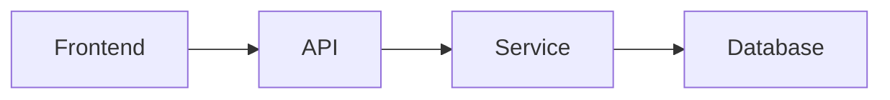

# Technical Analysis

**Project:** P-002 - Documentation System Rewrite
**Date:** 2025-11-04
**Status:** Draft
**Owner:** Product Technical + Tech Lead

---

## 1. Executive Summary

### 1.1 Overview

Complete rewrite of Hospeda monorepo documentation (185+ pages) using **Hybrid Documentation Strategy**:

- **Central docs** (`/docs`) - 45 pages of cross-cutting documentation
- **Distributed docs** (`apps/*/docs`, `packages/*/docs`) - 140 pages of component-specific documentation

**Documentation Levels:**

- ⭐ **SUPER DETAILED** - Apps (50 pages) + Core Packages (65 pages)
- 📋 **BASIC** - Other Packages (25 pages)

### 1.2 Technical Approach

**Technology Stack:**

- **Format**: Markdown (.md files)
- **Diagrams**: Mermaid.js (text-based, version-controlled)
- **Code Examples**: TypeScript snippets + links to actual code
- **Validation**: Markdownlint + Custom scripts
- **Hosting**: GitHub (rendered in browser, VS Code)

**No build tools initially** - Plain Markdown for simplicity, speed, and portability.

### 1.3 Success Criteria

- ✅ 185+ pages documented
- ✅ Onboarding time: <2 hours
- ✅ Find information: <2 minutes
- ✅ Documentation accuracy: 95%+
- ✅ Code examples work and tested
- ✅ All links functional
- ✅ Mobile-friendly
- ✅ Accessible (WCAG AA)

---

## 2. Architecture & Design

### 2.1 Documentation Architecture

```
┌─────────────────────────────────────────────────────────────┐
│                    CENTRAL DOCUMENTATION                     │
│                      /docs/ (45 pages)                       │
│                                                               │
│  Cross-cutting concerns, onboarding, architecture,           │
│  deployment, contributing, runbooks, security                │
│                                                               │
│  Target: New devs, experienced devs, operators               │
└──────────────┬────────────────────────────────┬─────────────┘
               │                                │
               ▼                                ▼
    ┌──────────────────────┐       ┌──────────────────────┐
    │  APP DOCUMENTATION   │       │  PACKAGE DOCS        │
    │  (50 pages)          │       │  (90 pages)          │
    │                      │       │                      │
    │  - api/docs/         │       │  SUPER DETAILED:     │
    │  - web/docs/         │       │  - service-core/     │
    │  - admin/docs/       │       │  - db/               │
    │                      │       │  - schemas/          │
    │  Usage + Development │       │  - config/           │
    │                      │       │  - logger/           │
    │                      │       │  - icons/            │
    │                      │       │  - seed/             │
    │                      │       │                      │
    │                      │       │  BASIC:              │
    │                      │       │  - utils/            │
    │                      │       │  - auth-ui/          │
    │                      │       │  - i18n/             │
    │                      │       │  - payments/         │
    │                      │       │  - configs/          │
    └──────────────────────┘       └──────────────────────┘
```

### 2.2 Navigation Strategy

**Entry Points:**

1. **Main Portal** - `/docs/index.md` → Role-based navigation
2. **App Portals** - `apps/*/docs/README.md` → Component-specific entry
3. **Package Portals** - `packages/*/docs/README.md` → API surface + guides

**Navigation Mechanisms:**

- **Hierarchical** - Folder-based browsing
- **Role-based** - Quick links by user type (New Dev, Experienced, Operator)
- **Task-based** - Quick links by task (Add Feature, Debug, Deploy)
- **Search** - Browser Ctrl+F (no dedicated search engine in v1)
- **Cross-linking** - Extensive links between central and distributed docs

### 2.3 Content Organization

**Progressive Disclosure (3-tier):**

**Tier 1: Quick Start** (5-10 min)

- What is this?
- Minimal working example
- Links to deeper docs

**Tier 2: Guides** (20-40 min)

- Step-by-step tutorials
- Common use cases
- Best practices

**Tier 3: Reference** (Look-up)

- Complete API documentation
- All options/parameters
- Edge cases

**Example:**

```
@repo/service-core/
├── README.md                    # Tier 1: Overview + quick example
├── docs/
│   ├── quick-start.md           # Tier 1: Get started in 5 min
│   ├── guides/
│   │   └── creating-services.md # Tier 2: Step-by-step tutorial
│   └── api/
│       └── BaseCrudService.md   # Tier 3: Complete API reference
```

---

## 3. Technical Requirements

### 3.1 File Structure Requirements

**Folder Naming:**

- Use `kebab-case` for all folders
- Descriptive names: `getting-started`, `claude-code`, `performance`

**File Naming:**

- Use `kebab-case` for all files
- Descriptive names: `creating-new-entity.md`, `tdd-workflow.md`
- Index files: `README.md`
- Numbered files (if ordered): `01-setup.md`, `02-development.md`

**Maximum Nesting:**

- Central docs: 2 levels max (`docs/category/page.md`)
- App docs: 3 levels max (`apps/api/docs/category/subcategory/page.md`)
- Package docs: 3 levels max (`packages/db/docs/api/page.md`)

### 3.2 Markdown Standards

**Heading Hierarchy:**

```markdown
# Page Title (H1) - ONE per page, at top
## Major Section (H2)
### Sub-section (H3)
#### Minor sub-section (H4)
```

**Maximum depth:** H4 - Don't use H5 or H6

**Code Blocks:**

```markdown
✅ ALWAYS specify language:
```typescript
const example = 'code'
```

❌ NEVER leave code blocks without language:

```
const example = 'code'
```

```

**Tables:**
```markdown
| Parameter | Type | Required | Description |
|-----------|------|----------|-------------|
| `name` | `string` | Yes | Entity name |
```

**Callouts:**

```markdown
> 💡 **TIP:** Helpful suggestion
> ⚠️ **WARNING:** Important caution
> ℹ️ **NOTE:** Additional information
> 🚨 **DANGER:** Critical warning
```

**Links:**

```markdown
<!-- Internal (relative) -->
[Architecture Overview](../architecture/overview.md)

<!-- To code -->
[BaseModel](../../../packages/db/src/base/base.model.ts:15)

<!-- External -->
[Drizzle ORM](https://orm.drizzle.team/)

<!-- Anchor -->
[Prerequisites](#prerequisites)
```

### 3.3 Diagram Standards

**Format:** Mermaid.js (text-based)

**Benefits:**

- Version controlled (text files)
- Diff-able in PRs
- Rendered in GitHub
- Editable without tools
- Accessible (can be read as text)

**Types:**

- `graph` - Flow diagrams
- `journey` - User journey maps
- `sequence` - Sequence diagrams (for auth flows, etc.)
- `erDiagram` - Entity relationship diagrams

**Example:**



**Placement:**

- After introducing concept
- Before detailed explanation
- At end as reference

**Captions:**

```markdown
[Caption: Request flow through system layers]
```

### 3.4 Code Example Standards

**Inline Snippets** (10-20 lines):

```typescript
// Quick example
const service = new AccommodationService(ctx)
const result = await service.create(actor, data)
```

**Complete Examples** (50-100 lines):

- Store in `examples/` folder
- Link from docs
- Extract from actual tests when possible

**Example File Structure:**

```
packages/service-core/docs/
├── README.md
├── guides/
│   └── creating-services.md  # Links to examples
└── examples/
    ├── basic-service.ts
    ├── with-hooks.ts
    └── complex-logic.ts
```

**Code Example Requirements:**

- ✅ Must be syntactically valid TypeScript
- ✅ Must include imports
- ✅ Must include types
- ✅ Must have comments explaining key parts
- ✅ Ideally extracted from actual working code/tests

### 3.5 Accessibility Requirements

**Screen Readers:**

- All images have descriptive alt text
- Descriptive link text (no "click here")
- Logical heading hierarchy

**Keyboard Navigation:**

- All links Tab-navigable
- No keyboard traps

**Color Contrast:**

- Code blocks meet WCAG AA standards
- Links distinguishable from body text
- Color not only indicator

**Mobile:**

- Readable on mobile devices
- Touch-friendly navigation
- Horizontal scroll for code blocks
- Responsive tables (convert to lists if needed)

### 3.6 Quality Standards

**Content Quality:**

- Clear purpose in first paragraph
- Target audience identified
- Prerequisites listed
- Tested code examples
- Functional links
- Spell-checked
- Technically accurate

**Structure:**

- Proper heading hierarchy
- TOC for pages >500 lines
- Cross-links to related docs
- Previous/Next links (if series)

**Formatting:**

- Code blocks have language
- Tables formatted correctly
- Callouts used appropriately
- Diagrams have captions

---

## 4. Implementation Plan

### 4.1 Five-Phase Approach (5 weeks)

**Phase 1: Core Central Docs (Week 1)**

- Main portal (`/docs/index.md`)
- Getting Started (5 pages)
- Architecture Overview
- End-to-end tutorial (Adding New Entity)
- App READMEs (3 quick entry points)

**Target:** New dev can complete onboarding

**Phase 2: App Documentation (Week 2)**

- `apps/api/docs/` - 18 pages (Usage + Development)
- `apps/web/docs/` - 16 pages (Usage + Development)
- `apps/admin/docs/` - 16 pages (Usage + Development)

**Target:** Developers can work on each app

**Phase 3: Core Package Docs (Week 3)**

- `packages/service-core/docs/` - 12 pages
- `packages/db/docs/` - 12 pages
- `packages/schemas/docs/` - 10 pages
- `packages/config/docs/` - 8 pages
- `packages/logger/docs/` - 8 pages
- `packages/icons/docs/` - 8 pages
- `packages/seed/docs/` - 7 pages

**Target:** Deep understanding of core packages

**Phase 4: Supporting Docs (Week 4)**

- Deployment (7 pages)
- Security (5 pages)
- Performance (5 pages)
- Testing (7 pages)
- Claude Code (5 pages)
- Runbooks (5 pages)
- Contributing (4 pages)

**Target:** Complete operational knowledge

**Phase 5: Polish & Remaining (Week 5)**

- Other packages (basic docs) - 25 pages
- All diagrams (15 Mermaid diagrams)
- Examples repository
- FAQ & Troubleshooting
- Resources
- Final review & testing

**Target:** 100% complete and polished

### 4.2 Tooling & Automation

**Linting:**

```json
{
  "scripts": {
    "lint:md": "markdownlint-cli2 \"**/*.md\"",
    "lint:md:fix": "markdownlint-cli2 --fix \"**/*.md\"",
    "lint:md:docs": "markdownlint-cli2 \"docs/**/*.md\" \"apps/**/docs/**/*.md\" \"packages/**/docs/**/*.md\""
  }
}
```

**Markdownlint Config** (`.markdownlint.json`):

```json
{
  "default": true,
  "MD013": false,
  "MD033": {
    "allowed_elements": ["details", "summary", "br"]
  },
  "MD041": false
}
```

**Link Checking:**

```bash
# Custom script to check for broken links
pnpm docs:check-links
```

**Example Validation:**

```bash
# Validate TypeScript code blocks
pnpm docs:validate-examples
```

**CI Integration:**

```yaml
# .github/workflows/docs.yml
name: Documentation CI

on:
  pull_request:
    paths:
      - 'docs/**'
      - 'apps/**/docs/**'
      - 'packages/**/docs/**'

jobs:
  lint:
    runs-on: ubuntu-latest
    steps:
      - uses: actions/checkout@v4
      - uses: pnpm/action-setup@v2
      - run: pnpm install
      - run: pnpm lint:md:docs
      - run: pnpm docs:check-links
      - run: pnpm docs:validate-examples
```

### 4.3 Maintenance Strategy

**When Code Changes:**

1. Identify affected documentation
2. Update docs in same PR
3. Add "Docs updated" to PR description
4. Tech writer reviews docs in PR

**Quarterly Reviews:**

- Spot-check 20% of docs vs code
- Fix outdated content
- Update examples
- Refresh diagrams
- Update screenshots if any

**Continuous Improvement:**

- Track common questions → add to FAQ
- Monitor feedback → iterate
- Gather metrics → improve popular pages

---

## 5. Dependencies & Prerequisites

### 5.1 Tools Required

**For Writers:**

- VS Code (recommended)
- VS Code Extensions:
  - `markdownlint.markdownlint` - Markdown linting
  - `yzhang.markdown-all-in-one` - Markdown productivity
  - `bierner.markdown-mermaid` - Mermaid preview
  - `bierner.markdown-preview-github-styles` - GitHub preview
- Git knowledge (basic)
- Markdown knowledge (basic)

**For Validation:**

- Node.js 20+ & PNPM 9+
- markdownlint-cli2
- Custom scripts (to be created):
  - `scripts/check-links.ts` - Check for broken links
  - `scripts/validate-examples.ts` - Validate TypeScript examples

### 5.2 Knowledge Prerequisites

**For Tech Writers:**

- Markdown syntax
- Basic Git (add, commit, push, PR)
- VS Code basics
- Understanding of Hospeda architecture (from docs themselves)

**For Developers Contributing:**

- Same as above +
- TypeScript (for code examples)
- Testing (for extracting examples from tests)

### 5.3 External Dependencies

**None!** - Everything is self-contained:

- ✅ Markdown renders in GitHub
- ✅ Markdown renders in VS Code
- ✅ Mermaid renders in GitHub
- ✅ No build step required
- ✅ Works offline

**Optional (Future):**

- Doc generator (Docusaurus, VitePress) - If needed for better navigation
- Search engine (Algolia) - If needed for better findability

---

## 6. Risk Analysis & Mitigation

### 6.1 Risk: Documentation Becomes Outdated

**Probability:** Medium
**Impact:** High

**Mitigations:**

1. ✅ Docs close to code (distributed strategy)
2. ✅ PR requirement: Update docs when changing code
3. ✅ Pre-commit hook reminder
4. ✅ Quarterly audits
5. ✅ CI checks for broken links

**Monitoring:**

- Monthly spot-checks (random sample)
- Track documentation-related questions
- User feedback on accuracy

### 6.2 Risk: Documentation Too Long/Overwhelming

**Probability:** Medium
**Impact:** Medium

**Mitigations:**

1. ✅ Progressive disclosure (3-tier approach)
2. ✅ Clear TOCs with estimated reading time
3. ✅ Quick start guides (<10 min)
4. ✅ Separate reference from guides
5. ✅ Visual hierarchy (callouts, formatting)

**Monitoring:**

- Track onboarding time
- Gather feedback on length
- User testing

### 6.3 Risk: Code Examples Break

**Probability:** Medium
**Impact:** Medium

**Mitigations:**

1. ✅ Extract examples from actual tests when possible
2. ✅ Link to specific file:line in GitHub
3. ✅ CI to lint code blocks (TypeScript validation)
4. ✅ Mark example date
5. ✅ Quarterly example validation

**Monitoring:**

- CI checks for TypeScript errors
- Quarterly manual validation
- User reports

### 6.4 Risk: Distributed Docs Out of Sync

**Probability:** Low
**Impact:** Medium

**Mitigations:**

1. ✅ Clear rules for what goes where
2. ✅ Cross-links between central and distributed
3. ✅ Package maintainer owns their docs
4. ✅ Tech writer does quarterly sync reviews
5. ✅ Single source of truth for cross-cutting concerns

**Monitoring:**

- Quarterly documentation sync audit
- Track contradiction reports
- User confusion feedback

### 6.5 Risk: Low Adoption (Devs Don't Use Docs)

**Probability:** Low (if we do this right)
**Impact:** High

**Mitigations:**

1. ✅ Make docs discoverable (clear entry points)
2. ✅ Make docs valuable (accurate, tested examples)
3. ✅ Make docs fast (quick starts, findable)
4. ✅ Integrate into workflow (onboarding, PRs)
5. ✅ Gather and act on feedback

**Monitoring:**

- Track doc views (GitHub Insights)
- Post-onboarding surveys
- Common questions in discussions

---

## 7. Testing Strategy

### 7.1 Documentation Testing Checklist

**Content Verification:**

- [ ] All code examples tested manually
- [ ] All links checked (no 404s)
- [ ] Spelling & grammar checked
- [ ] Technical accuracy verified vs actual code
- [ ] Prerequisites accurate

**Structure Verification:**

- [ ] Proper heading hierarchy (no skipped levels)
- [ ] TOC accurate and complete
- [ ] Cross-links functional
- [ ] Previous/Next links correct

**Formatting Verification:**

- [ ] All code blocks have language
- [ ] Tables formatted correctly
- [ ] Callouts used appropriately
- [ ] Diagrams render correctly
- [ ] Diagrams have captions

**Accessibility Verification:**

- [ ] Images have alt text
- [ ] Links have descriptive text
- [ ] Color not only indicator
- [ ] Keyboard navigable

**Mobile Verification:**

- [ ] Readable on mobile (test actual device)
- [ ] Tables responsive
- [ ] Code blocks scrollable
- [ ] Navigation usable

### 7.2 User Testing

**Onboarding Test:**

1. New developer (mock or actual)
2. Follow getting started docs
3. Time to first contribution
4. Gather feedback
5. Iterate

**Findability Test:**

1. List 10 common questions
2. Time how long to find answers
3. Track navigation path
4. Identify friction points
5. Improve

**Accuracy Test:**

1. Randomly select 20 code examples
2. Test each example
3. Check if they work as documented
4. Fix any issues
5. Track accuracy rate

### 7.3 Automated Testing

**CI Checks:**

```yaml
- Markdown linting
- Link checking (internal links)
- TypeScript validation (code blocks)
- Heading hierarchy check
- TOC generation/validation
```

**Manual Checks (Quarterly):**

- External link checking
- Code example testing
- Screenshot updates
- Diagram accuracy

---

## 8. Success Metrics & KPIs

### 8.1 Quantitative Metrics

**Onboarding Time:**

- Target: <2 hours from clone to first PR
- Measure: Track new devs, survey after onboarding
- Baseline: Currently unknown (no structured onboarding)

**Findability:**

- Target: <2 minutes to find information
- Measure: User testing with 10 common questions
- Baseline: Currently unknown

**Documentation Coverage:**

- Target: 100% of checklist items documented (185+ pages)
- Measure: Completion percentage
- Current: ~20% (incomplete, outdated)

**Accuracy:**

- Target: 95%+ docs match actual code
- Measure: Monthly spot-checks (20 random samples)
- Current: ~50% (many docs outdated)

**Link Health:**

- Target: 0 broken internal links
- Measure: CI checks on every PR
- Current: Unknown (no checks)

### 8.2 Qualitative Metrics

**User Satisfaction:**

- "Was this helpful?" votes on each page
- Post-onboarding survey (1-10 rating)
- Target: >8.0 average satisfaction

**Discoverability:**

- Can users find what they need?
- Track common "Can't find X" questions
- Target: <5 "can't find" questions per month

**Understandability:**

- Are docs clear?
- Track "I don't understand" feedback
- Target: >90% clarity rating

### 8.3 Monitoring & Reporting

**Weekly:**

- Track new pages added
- Track pages updated
- Review "Was this helpful?" feedback

**Monthly:**

- Spot-check 20 random samples for accuracy
- Review common questions (add to FAQ if needed)
- Check link health

**Quarterly:**

- Full documentation audit
- User testing (onboarding + findability)
- Update metrics dashboard
- Plan improvements

**Dashboard Metrics:**

```markdown
## Documentation Health Dashboard

**Coverage:** 185/185 pages (100%) ✅
**Accuracy:** 95% (19/20 samples correct) ✅
**Link Health:** 0 broken links ✅
**Onboarding Time:** 1.5 hours avg ✅
**Satisfaction:** 8.5/10 ✅

**Last Updated:** 2025-11-04
**Next Review:** 2026-02-04
```

---

## 9. Resource Requirements

### 9.1 People

**Tech Writer** (Primary):

- Role: Write and maintain documentation
- Time: Full-time for 5 weeks (initial), then 20% ongoing
- Skills: Technical writing, Markdown, basic Git

**Tech Lead** (Secondary):

- Role: Technical review, architecture input
- Time: 10% for 5 weeks, 5% ongoing
- Skills: Deep technical knowledge of codebase

**UX Designer** (Consulted):

- Role: Navigation structure, user flows
- Time: 2 days (already done)
- Skills: Information architecture, UX

**Developers** (Contributed):

- Role: Review docs, provide feedback, update when changing code
- Time: 5% ongoing
- Skills: Development knowledge

### 9.2 Time Estimates

**Phase 1** (Week 1): 40 hours

- Main portal: 4 hours
- Getting Started (5 pages): 10 hours
- Architecture Overview: 4 hours
- End-to-end tutorial: 8 hours
- App READMEs: 4 hours
- Review & polish: 10 hours

**Phase 2** (Week 2): 40 hours

- API docs (18 pages): 14 hours
- Web docs (16 pages): 12 hours
- Admin docs (16 pages): 12 hours
- Review & polish: 2 hours

**Phase 3** (Week 3): 40 hours

- 7 core packages (65 pages): 32 hours
- Review & polish: 8 hours

**Phase 4** (Week 4): 40 hours

- Supporting docs (33 pages): 26 hours
- Review & polish: 14 hours

**Phase 5** (Week 5): 40 hours

- Other packages (25 pages): 12 hours
- Diagrams (15): 10 hours
- Examples: 8 hours
- FAQ & Resources: 4 hours
- Final review & testing: 6 hours

**Total:** 200 hours (5 weeks @ 40 hours/week)

**Ongoing:** 8 hours/week (20% tech writer time)

### 9.3 Cost Estimates

**Direct Costs:**

- Tech Writer (5 weeks): $XX,XXX
- Tech Lead (review time): $X,XXX
- Total Initial: $XX,XXX

**Ongoing Costs:**

- Tech Writer (20% time): $X,XXX/month
- Tools: $0 (all free/open-source)

**Opportunity Costs:**

- Developer time diverted from features: Minimal (5% ongoing)

**ROI:**

- Faster onboarding: -40 hours per new dev
- Faster development: +10% productivity (less time searching/asking)
- Fewer bugs: Better understanding → better code
- **Payback period:** ~3-6 months

---

## 10. Technical Debt & Future Work

### 10.1 Known Limitations (v1)

**No Auto-generated API Docs:**

- Manual API documentation only
- **Future:** Add TypeDoc if manual docs prove insufficient
- **Timeline:** Q2 2025

**No Dedicated Search:**

- Rely on browser search (Ctrl+F) and GitHub search
- **Future:** Add Algolia or similar if needed
- **Timeline:** Q3 2025

**No Documentation Versioning:**

- Single source of truth on main branch
- **Future:** Add versioning if needed for multiple releases
- **Timeline:** 2026

**No Interactive Examples:**

- Static code examples only
- **Future:** Add embedded code editors (CodeSandbox, StackBlitz)
- **Timeline:** Q4 2025

**No Videos:**

- Text and diagrams only
- **Future:** Add video tutorials for complex workflows
- **Timeline:** 2026

### 10.2 Technical Debt Created

**Manual Maintenance:**

- Docs maintained by hand (not auto-generated)
- **Impact:** More effort to keep in sync
- **Acceptable:** Manual gives better control, flexibility

**No Link Validation:**

- Links not automatically checked (initially)
- **Impact:** Broken links may slip through
- **Mitigation:** Add CI check in Phase 5

**Diagrams Not Synced:**

- Code comments don't auto-update diagrams
- **Impact:** Manual sync required
- **Acceptable:** Diagrams change less frequently than code

### 10.3 Future Enhancements

**Q2 2025:**

- Auto-generated API reference (TypeDoc)
- Advanced search (Algolia or similar)

**Q3 2025:**

- Documentation testing (automated tests for examples)
- Documentation metrics (track views, time on page)
- External link checking (CI)

**Q4 2025:**

- Interactive examples (embedded editors)
- Documentation analytics dashboard

**2026:**

- Video walkthroughs
- Documentation versioning (if needed)
- Documentation chatbot (AI-powered search)

---

## 11. Security & Privacy

### 11.1 Security Considerations

**No Secrets in Docs:**

- ✅ Never commit secrets to documentation
- ✅ Use placeholders: `YOUR_API_KEY`, `YOUR_DATABASE_URL`
- ✅ Link to environment setup guide
- ✅ CI check for common secret patterns

**Public Repository:**

- ✅ All documentation is public (GitHub)
- ✅ No sensitive internal information
- ✅ No customer data or PII
- ✅ No proprietary algorithms

**External Links:**

- ✅ Only link to trusted sources
- ✅ No tracking links
- ✅ No affiliate links
- ✅ Quarterly review of external links

### 11.2 Privacy

**No Tracking:**

- ✅ No analytics (initially)
- ✅ No cookies
- ✅ No user profiling

**Future (if adding analytics):**

- Use privacy-respecting analytics
- Opt-in only
- No personal data collection

---

## 12. Compliance & Standards

### 12.1 Accessibility Compliance

**Target:** WCAG 2.1 Level AA

**Requirements:**

- ✅ All images have alt text
- ✅ Descriptive link text
- ✅ Logical heading hierarchy
- ✅ Keyboard navigable
- ✅ Color contrast (WCAG AA)
- ✅ Mobile-friendly

**Testing:**

- Manual testing with screen reader
- Automated checks (axe DevTools)
- Quarterly accessibility audit

### 12.2 Code Standards

**Markdown:**

- Follow CommonMark specification
- Use markdownlint for consistency

**TypeScript:**

- Code examples follow project standards
- Strict mode
- Proper types
- No `any`

**Mermaid:**

- Use standard Mermaid syntax
- Test rendering in GitHub

### 12.3 Licensing

**Documentation License:**

- Same as project (MIT)
- Open source, free to use
- Attribution required

---

## 13. Rollout Plan

### 13.1 Deployment Strategy

**Incremental Rollout:**

**Week 1:** Core Central Docs

- ✅ Create `/docs` folder structure
- ✅ Main portal live
- ✅ Getting Started live
- ✅ Announce to team: "Onboarding docs ready"

**Week 2:** App Docs

- ✅ API docs live
- ✅ Web docs live
- ✅ Admin docs live
- ✅ Announce: "App-specific docs ready"

**Week 3:** Core Package Docs

- ✅ 7 core packages live
- ✅ Announce: "Deep dive docs ready"

**Week 4:** Supporting Docs

- ✅ Deployment, security, performance, testing, Claude Code, runbooks
- ✅ Announce: "Operational docs ready"

**Week 5:** Polish & Completion

- ✅ All remaining docs
- ✅ Final review
- ✅ Announce: "Documentation 100% complete 🎉"

**No Downtime:** New docs don't break existing system

### 13.2 Migration from Old Docs

**Existing Docs:**

- `.claude/docs/` - Some documentation exists
- `CLAUDE.md` - Keep (project-specific instructions for Claude)
- Other scattered docs

**Migration Strategy:**

1. **DO NOT** reference old docs (start fresh from code analysis)
2. **DELETE** old docs after new docs complete (per user request)
3. **Redirect** any external links (if any)

**Timeline:**

- Week 5: Delete old docs
- Week 5: Update any links to point to new docs

### 13.3 Communication Plan

**Internal Announcements:**

**Week 0 (Before Start):**

- Announce documentation rewrite project
- Share PDR for feedback
- Set expectations

**Week 1:**

- "New onboarding docs available!"
- Ask new devs to test and give feedback

**Week 2:**

- "App-specific docs available!"
- Encourage developers to use when working on apps

**Week 3:**

- "Deep dive package docs available!"
- Highlight core packages

**Week 4:**

- "Operational docs available!"
- Share runbooks with operations team

**Week 5:**

- "Documentation 100% complete! 🎉"
- Celebrate
- Gather feedback
- Plan improvements

**Ongoing:**

- Monthly: Share documentation improvements
- Quarterly: Share metrics & wins

---

## 14. Monitoring & Continuous Improvement

### 14.1 Feedback Mechanisms

**Direct Feedback:**

- "Was this helpful?" at bottom of each page (future)
- GitHub Discussions for questions/feedback
- Post-onboarding survey

**Indirect Feedback:**

- Common questions in discussions
- Support tickets mentioning docs
- Developer comments in PRs

### 14.2 Metrics Dashboard

**Track:**

- Documentation coverage (% complete)
- Link health (broken links)
- Onboarding time (avg)
- User satisfaction (rating)
- Common questions (topics)

**Review:**

- Weekly: Quick check
- Monthly: Deep dive
- Quarterly: Full audit + user testing

### 14.3 Improvement Process

**Continuous:**

1. Gather feedback
2. Identify issues/gaps
3. Prioritize improvements
4. Implement fixes
5. Measure impact
6. Repeat

**Quarterly:**

1. Full documentation audit
2. User testing (onboarding + findability)
3. Update metrics
4. Plan next quarter improvements

---

## 15. Conclusion

### 15.1 Summary

**What:** Complete monorepo documentation rewrite (185+ pages)
**Why:** Current docs incomplete, outdated, not aligned with code
**How:** Hybrid documentation strategy (Central + Distributed)
**When:** 5 weeks (200 hours)
**Who:** Tech Writer (primary) + Tech Lead (review)

### 15.2 Key Success Factors

1. ✅ **Start from code, not old docs** - Ensure accuracy
2. ✅ **Progressive disclosure** - Serve all skill levels
3. ✅ **Close to code** - Distributed docs easier to maintain
4. ✅ **Quality over quantity** - Tested examples, accurate info
5. ✅ **User-centric** - Solve user problems, not just document code
6. ✅ **Iterative** - Launch, gather feedback, improve

### 15.3 Next Steps

1. ✅ **User approval** - Review and approve planning
2. ✅ **Task breakdown** - Create atomic tasks (with tech-lead agent)
3. ✅ **Resource allocation** - Assign tech writer
4. ✅ **Kickoff** - Start Phase 1
5. ✅ **Monitor & iterate** - Track metrics, improve continuously

---

**Status:** Ready for task breakdown
**Next Document:** `TODOs.md` (created by tech-lead agent)
