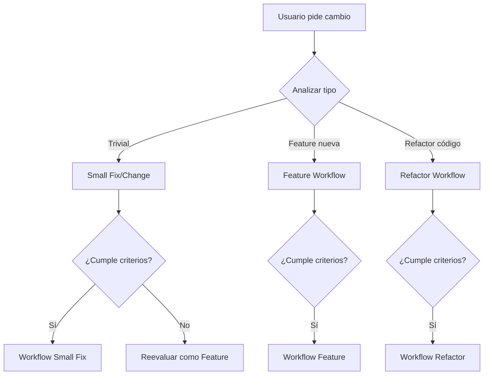

# Workflows Detallados - Hospeda Project

Este documento describe los workflows completos para Feature Development, Refactors, y Small Fixes.

---

## 🎯 Decision Tree - Paso 0 (SIEMPRE PRIMERO)

**Pregunta inicial**: ¿Qué tipo de cambio es este?



---

### Criterios de Decisión

| Criterio | Small Fix | Feature | Refactor |
|----------|-----------|---------|----------|
| **Tiempo estimado** | < 30 min | > 1 hora | Variable |
| **Archivos afectados** | 1-3 | 5+ | Variable |
| **Lógica de negocio** | No afecta o mínima | Sí, nueva | Sí, mejora existente |
| **Necesita planning** | No | Sí (completo) | Sí (completo) |
| **Riesgo regresión** | Muy bajo | Medio-Alto | Medio-Alto |
| **Tests nuevos** | 0-2 | 5+ | Variable |

**Small Fix incluye:**
- Small bug fixes
- Small improvements (performance, security, small refactors)
- Trivial new features
- Style changes
- Documentation updates
- Configuration tweaks

**Regla de oro**: Si tienes duda, usa workflow completo (Feature o Refactor). Mejor pecar de precavido.

---

## 📋 Workflow 1: Feature Development (Completo - 24 pasos)

### FASE 1: Planning (Pasos 1-15)

#### Paso 1: Generación de Código y Nombre

**Acción**: Claude genera código único y nombre del planning

```bash
# Formato: PF-XXX-feature-name-kebab-case
# Ejemplo: PF-003-user-authentication
```

**Proceso**:
1. Leer `.claude/sessions/planning/.code-registry.json`
2. Obtener `lastPlanningNumber`
3. Incrementar en 1
4. Generar código: `PF-{número}`
5. Solicitar al usuario nombre descriptivo en kebab-case

**Output**: `PF-003-user-authentication`

---

#### Paso 2: Crear Folder de Planning

**Acción**: Crear estructura de carpetas

```bash
mkdir -p .claude/sessions/planning/features/PF-003-user-authentication
```

**Estructura esperada**:
```
.claude/sessions/planning/features/PF-003-user-authentication/
├── PDR.md (paso 6)
├── tech-analysis.md (paso 8)
├── TODOs.md (paso 12)
└── mockups/ (opcional)
```

---

#### Paso 3: Actualizar Code Registry

**Acción**: Agregar entrada en `.claude/sessions/planning/.code-registry.json`

```json
{
  "lastPlanningNumber": 3,
  "plannings": {
    "features": {
      "PF-003": {
        "name": "user-authentication",
        "issueId": "", // Se llenará en paso 15
        "description": "Sistema de autenticación de usuarios con OAuth",
        "totalTasks": 0, // Se actualizará en paso 12
        "completedTasks": 0,
        "status": "planning",
        "createdAt": "2025-10-30T10:00:00Z",
        "lastUpdate": "2025-10-30T10:00:00Z"
      }
    }
  }
}
```

---

#### Paso 4: Evaluar Subagents y Skills Necesarios

**Acción**: Claude analiza qué agents y skills necesitará

**Agents probables para features**:
- `product-functional` (siempre)
- `product-technical` (siempre)
- `ux-ui-designer` (si tiene UI)
- `db-drizzle-engineer` (si afecta DB)
- `hono-engineer` (si afecta API)
- `astro-engineer` o `tanstack-start-engineer` (según frontend)
- `react-senior-dev` (si tiene componentes)

**Skills probables**:
- `tdd-methodology` (siempre)
- `brand-guidelines` (si tiene UI)
- `error-handling-patterns` (siempre)
- Específicos según tecnología

**Output**: Lista de agents/skills a usar en planning

---

#### Paso 5: Presentar Plan de Planning

**Acción**: Claude presenta al usuario el plan de trabajo

```
📋 Planning para PF-003-user-authentication

🎯 Objetivo: Sistema de autenticación de usuarios con OAuth

👥 Agents que voy a invocar:
- product-functional → PDR.md
- ux-ui-designer → Mockups
- product-technical → tech-analysis.md

📚 Skills que usaré:
- brand-guidelines
- tdd-methodology
- error-handling-patterns

📁 Outputs esperados:
- PDR.md (Product Design Requirements)
- tech-analysis.md (Technical Analysis)
- TODOs.md (Tasks breakdown)
- mockups/ (UI wireframes)

¿Procedemos?
```

---

#### Paso 6: Escribir PDR.md (en Inglés)

**Acción**: Invocar `product-functional` agent

```bash
# Agent genera PDR.md siguiendo template
# .claude/docs/templates/PDR-template.md
```

**Contenido del PDR** (en inglés, chat en español):
- Overview
- User Stories con Acceptance Criteria
- User Flows
- Business Rules
- UI/UX Requirements
- Edge Cases & Error Handling
- Non-Functional Requirements
- Dependencies
- Success Metrics
- Out of Scope
- Open Questions

**Iteración**: Usuario y Claude discuten (en español) y modifican PDR hasta aprobación

**Nota**: PDR se escribe directamente en inglés, solo el chat es en español

---

#### Paso 7: Usuario Aprueba PDR

**Acción**: Usuario revisa y aprueba PDR

**Usuario dice**: "Ok, aprobado" o "Perfecto, sigamos"

**Nota**: Ya no hay traducción, PDR ya está en inglés

---

#### Paso 8: Escribir tech-analysis.md (en Inglés)

**Acción**: Invocar `product-technical` agent

```bash
# Agent genera tech-analysis.md siguiendo template
# .claude/docs/templates/tech-analysis-template.md
```

**Contenido del Tech Analysis** (en inglés, chat en español):
- Technical Overview
- Architecture Design
- Technology Stack (confirmar/ajustar)
- Database Design (si aplica)
- API Design (si aplica)
- Frontend Design (si aplica)
- Security Considerations
- Performance Considerations
- Testing Strategy
- Risks & Mitigations
- Implementation Phases

**Iteración**: Usuario y Claude discuten (en español) y modifican análisis técnico

**Nota**: Tech analysis se escribe directamente en inglés, solo el chat es en español

**Archivos extras opcionales**: El agent o subagent puede crear folders adicionales dentro de la planificación:
- `mockups/` - UI mockups, wireframes
- `diagrams/` - Architecture diagrams, flowcharts
- `notes/` - Additional notes, research
- `examples/` - Code examples, snippets

Todos los archivos creados deben ser linkeados en los lugares correspondientes dentro de PDR.md o tech-analysis.md

---

#### Paso 9: Revisar con Subagents/Skills

**Acción**: Pedir review a agents especialistas

**Ejemplo**:
```bash
# Si afecta DB
→ Invocar db-drizzle-engineer para revisar database design

# Si tiene API
→ Invocar hono-engineer para revisar API design

# Si tiene UI
→ Invocar ux-ui-designer para revisar mockups
```

**Output**: Feedback de agents especialistas

---

#### Paso 10: Presentar Plan Técnico al Usuario

**Acción**: Claude presenta resumen del análisis técnico

```
📊 Análisis Técnico Completo

🏗️ Arquitectura:
- Auth con Clerk
- Sessions en Redis
- OAuth providers: Google, GitHub

💾 Database:
- Nueva tabla: users
- Nueva tabla: sessions
- Migración: add-auth-tables

🔌 API:
- Nuevos endpoints: /auth/*, /users/*
- Middleware: authentication, authorization

🎨 Frontend:
- Login/Register pages
- Profile management
- Protected routes

✅ Validado por:
- db-drizzle-engineer ✓
- hono-engineer ✓
- ux-ui-designer ✓

¿Apruebas el análisis técnico?
```

---

#### Paso 11: Usuario Aprueba Tech Analysis

**Acción**: Usuario aprueba

**Nota**: Ya no hay traducción, tech-analysis.md ya está en inglés

---

#### Paso 12: Generar TODOs.md (en Inglés)

**Acción**: Claude atomiza el trabajo en tasks

```bash
# Genera TODOs.md siguiendo template
# .claude/docs/templates/TODOs-template.md
```

**Estructura de TODOs**:
```markdown
# TODOs - PF-003-user-authentication

## Summary
[Brief description]

## Tasks

### PF-003-T-001: Setup Clerk integration
- [ ] PF-003-T-001-001: Install Clerk dependencies
- [ ] PF-003-T-001-002: Configure Clerk in environment
- [ ] PF-003-T-001-003: Create Clerk provider component

### PF-003-T-002: Database schema for users
[...]

## Current Progress
- Total Tasks: 15
- Completed: 0
- In Progress: 0
- Remaining: 15

## Next Steps
1. Start with PF-003-T-001
```

**Cada task debe**:
- Ser atomic (1-2 horas máx)
- Tener código único
- Tener acceptance criteria
- Tener dependencies claras

---

#### Paso 13: Usuario Valida TODOs

**Acción**: Usuario revisa tasks

**Posibles respuestas**:
- "Ok, perfecto" → Paso 14
- "Falta XYZ" → Claude agrega y vuelve a presentar
- "Esta task es muy grande" → Claude la atomiza más

---

#### Paso 14: Commit Planning Files

**Acción**: Claude genera comandos de commit

```bash
git add .claude/sessions/planning/features/PF-003-user-authentication/
git add .claude/sessions/planning/.code-registry.json

git commit -m "feat(planning): add PF-003 user authentication planning

- Add PDR.md with user stories and acceptance criteria
- Add tech-analysis.md with architecture and design
- Add TODOs.md with 15 atomic tasks
- Update code registry with PF-003

Planning Code: PF-003
Status: ready"
```

**Usuario ejecuta el commit**

---

#### Paso 15: Sincronizar con GitHub Issues

**Acción**: Ejecutar `/sync-planning PF-003`

**Proceso**:
1. Crear parent issue en GitHub
2. Crear sub-issues por cada task
3. Actualizar `.code-registry.json` con `issueId`
4. Guardar mapping en `issues-sync.json`

**Output**:
```
✅ Planning synced to GitHub!

📋 Parent Issue: #HOSP-167
   https://github.com/user/repo/issues/167

📊 Created 15 sub-issues

💡 You can now track progress in GitHub
```

---

### FASE 2: Implementation (Pasos 16-22)

#### Paso 16: Analizar Estado y Elegir Task

**Cuando**: Usuario dice "vamos a implementar" o "sigamos con el desarrollo"

**Acción**: Claude analiza TODOs.md

```bash
# Buscar primera task con status "pending" y sin dependencies bloqueantes
```

**Output**:
```
📊 Estado del Planning PF-003:
- Total tasks: 15
- Completed: 0
- Next task: PF-003-T-001 (Setup Clerk integration)

🎯 Voy a trabajar en: PF-003-T-001
```

---

#### Paso 17: Presentar Informe de Task

**Acción**: Claude presenta qué va a hacer

```
📋 Task: PF-003-T-001 - Setup Clerk integration

📝 Description:
Install and configure Clerk authentication provider

✅ Acceptance Criteria:
- Clerk SDK installed
- Environment variables configured
- Clerk Provider wrapping app
- Test authentication flow works

🔧 Subtasks:
1. PF-003-T-001-001: Install dependencies
2. PF-003-T-001-002: Configure environment
3. PF-003-T-001-003: Create provider component

⏱️ Estimated time: 45 minutes

¿Procedemos con la implementación?
```

---

#### Paso 18: Implementar Task con TDD

**Acción**: Seguir TDD estrictamente

**Loop para cada subtask**:
```
RED:
1. Escribir test que falla (NO SOLO HAPPY PATH)
   - Incluir edge cases
   - Incluir error handling
   - Incluir boundary conditions
   - Incluir invalid inputs

GREEN:
2. Implementar código mínimo para pasar test
   - Implementar happy path
   - Implementar error handling
   - Implementar edge cases

REFACTOR:
3. Mejorar código manteniendo tests verdes
   - Refactor para clarity
   - Refactor para performance
   - Refactor para maintainability

VERIFY:
4. Ejecutar /code-check
5. Ejecutar tests
6. Verificar coverage (90%+ mínimo)
```

**Importante**: Tests NO deben ser solo happy path:
- ✅ Test casos normales (happy path)
- ✅ Test edge cases (límites, valores extremos)
- ✅ Test error handling (excepciones, errores)
- ✅ Test boundary conditions (0, null, undefined, empty)
- ✅ Test invalid inputs (tipos incorrectos, valores inválidos)

**Skills usados**:
- `tdd-methodology`
- `error-handling-patterns`
- Específicos según código (ej: `vercel-specialist`)

---

#### Paso 19: Validar Task Completa

**Acción**: Claude valida que todo está ok

**Checklist**:
- [ ] Todos los tests pasan
- [ ] `/code-check` sin errores
- [ ] Acceptance criteria cumplida
- [ ] Código documentado (JSDoc)
- [ ] Sin TODOs o FIXMEs en código

**Output**:
```
✅ Task PF-003-T-001 completada

📊 Resultados:
- Tests: 8/8 passing ✓
- Lint: 0 errors ✓
- TypeCheck: 0 errors ✓
- Coverage: 95% ✓

📝 Archivos modificados:
- package.json (dependencies)
- .env.example (variables)
- src/providers/ClerkProvider.tsx (new)
- src/app/layout.tsx (wrapper)
- test/auth/clerk.test.tsx (new)
```

---

#### Paso 20: Preguntar al Usuario si Está OK

**Acción**: Claude pregunta confirmación

```
✅ Task PF-003-T-001 está completa y validada.

¿Todo está bien o falta algo?

Opciones:
1. "Está perfecto" → Marco como completa y sigo
2. "Falta XYZ" → Agrego lo que falta
3. "Muéstrame el código" → Muestro detalles
```

---

#### Paso 21: Marcar Task Completa en TODOs.md

**Acción**: Actualizar TODOs.md

**Cambios**:
```diff
### PF-003-T-001: Setup Clerk integration
- [x] PF-003-T-001-001: Install Clerk dependencies
- [x] PF-003-T-001-002: Configure Clerk in environment
- [x] PF-003-T-001-003: Create Clerk provider component

## Current Progress
- Total Tasks: 15
- Completed: 1
- In Progress: 0
- Remaining: 14

## Next Steps
1. Start with PF-003-T-002 (Database schema)
```

**Actualizar `.code-registry.json`**:
```json
{
  "PF-003": {
    "completedTasks": 1,
    "lastUpdate": "2025-10-30T14:30:00Z"
  }
}
```

---

#### Paso 22: Presentar Lista de Commits

**Acción**: Claude genera commits sugeridos

```bash
# Commit 1: Feature implementation
git add src/providers/ClerkProvider.tsx src/app/layout.tsx
git commit -m "feat(auth): add Clerk authentication provider

- Install @clerk/nextjs and dependencies
- Configure Clerk environment variables
- Create ClerkProvider wrapper component
- Wrap app layout with authentication

Task: PF-003-T-001
Coverage: 95%"

# Commit 2: Tests
git add test/auth/clerk.test.tsx
git commit -m "test(auth): add Clerk provider tests

- Test provider initialization
- Test authentication flow
- Test error handling

Task: PF-003-T-001"

# Commit 3: Config updates
git add package.json .env.example
git commit -m "chore(deps): add Clerk authentication dependencies

- Add @clerk/nextjs
- Update environment variables template

Task: PF-003-T-001"

# Commit 4: Planning updates
git add .claude/sessions/planning/features/PF-003-user-authentication/TODOs.md
git add .claude/sessions/planning/.code-registry.json
git commit -m "docs(planning): mark PF-003-T-001 as completed

- Update task progress in TODOs.md
- Update code registry with completion

Task: PF-003-T-001
Progress: 1/15 tasks"
```

**Usuario ejecuta los commits**

---

#### Paso 23: Repetir desde Paso 16

**Acción**: Volver al paso 16 hasta completar todas las tasks

**Loop**:
```
16. Analizar siguiente task
17. Presentar informe
18. Implementar con TDD
19. Validar
20. Confirmar con usuario
21. Marcar completa
22. Commits
23. Repetir
```

**Continúa hasta**: Usuario dice "para" o todas las tasks están completas

---

#### Paso 24: Finalización (cuando todas las tasks completas)

**Acción**: Claude presenta resumen final

```
🎉 Planning PF-003 Completado!

📊 Estadísticas:
- Total tasks: 15
- Completed: 15
- Time spent: ~12 hours
- Commits: 47
- Tests added: 85
- Coverage: 94%

📝 Documentos actualizados:
- TODOs.md ✓
- Code registry ✓
- GitHub issues ✓

🚀 Siguiente paso:
Ejecutar `/quality-check` final antes de merge
```

---

## 🔧 Workflow 2: Refactor (Similar a Feature, con variaciones)

### Diferencias vs Feature Workflow:

**Código**: `PR-XXX` en lugar de `PF-XXX`

**Folder**: `.claude/sessions/planning/refactors/` en lugar de `features/`

**PDR simplificado**: Menos énfasis en user stories, más en problemas técnicos

**Tech Analysis más profundo**: Análisis de código existente, identificación de code smells

**Paso adicional antes de implementación**:
- Análisis de impacto (qué se va a romper)
- Plan de migración
- Estrategia de rollback

**Tests**: Énfasis en NO romper tests existentes

**Commits**: Refactor en pasos pequeños, cada commit debe ser deployable

---

## ⚡ Workflow 3: Small Fix/Change (Simplificado - 8 pasos)

### Criterios para usar este workflow:

- Cambio trivial o small change
- < 30 minutos
- 1-3 archivos
- No afecta lógica de negocio o mínima afectación
- Sin riesgo de regresión

**Small Fix incluye:**
- Small bug fixes
- Small improvements (performance, security, small refactors)
- Trivial new features (agregar un campo simple, un botón básico)
- Style changes (CSS, colores, spacing)
- Documentation updates
- Configuration tweaks

---

### Paso 1: Identificar como Small Fix

**Acción**: Claude pregunta si es small fix o necesita planning

```
📋 Cambio solicitado: "Corregir typo en README"

🤔 Análisis:
- Archivos afectados: 1 (README.md)
- Tiempo estimado: 2 minutos
- Tipo de cambio: Documentation update
- Lógica de negocio: No afecta
- Riesgo: Muy bajo

✅ Esto califica como Small Fix (sin planning necesario)

¿Procedemos directamente con el cambio?
```

**Tipos de Small Fix:**
- Bug fix: "Fix validation error in form"
- Small improvement: "Add index to speed up query"
- Trivial feature: "Add 'copy to clipboard' button"
- Style change: "Update button colors"
- Documentation: "Fix typo in README"
- Config: "Update environment variable"

---

### Paso 2: Hacer Cambio Directamente

**Acción**: Editar archivo(s)

**No necesita**:
- PDR
- Tech analysis
- TODOs
- Planning folder

---

### Paso 3: Ejecutar /code-check

**Acción**: Validación rápida

```bash
/code-check
```

---

### Paso 4: Ejecutar /run-tests (si aplica)

**Acción**: Solo si el cambio afecta código con tests

```bash
/run-tests
```

---

### Paso 5: Validar con Usuario

```
✅ Cambio completado

📝 Modificado:
- README.md (línea 45)

¿Todo está bien?
```

---

### Paso 6: Generar Commit

```bash
git add README.md
git commit -m "docs: fix typo in README installation section"
```

---

### Paso 7: Usuario Ejecuta Commit

**Acción**: Usuario copia y pega el comando

---

### Paso 8: Fin

**No se actualiza code registry** (no es planning formal)

---

## 🔄 Switching Between Workflows

**Si un Small Fix crece**:
```
Usuario: "Ahora también cambiemos XYZ"
Claude: "Esto está creciendo más allá de small fix.
        ¿Deberíamos crear un planning formal? (PF/PR-XXX)"
```

**Regla**: Siempre es mejor subir de nivel (small→feature) que continuar sin planning

---

## 📚 Version History

- v1.0.0 (2025-10-30): Initial workflows definition
