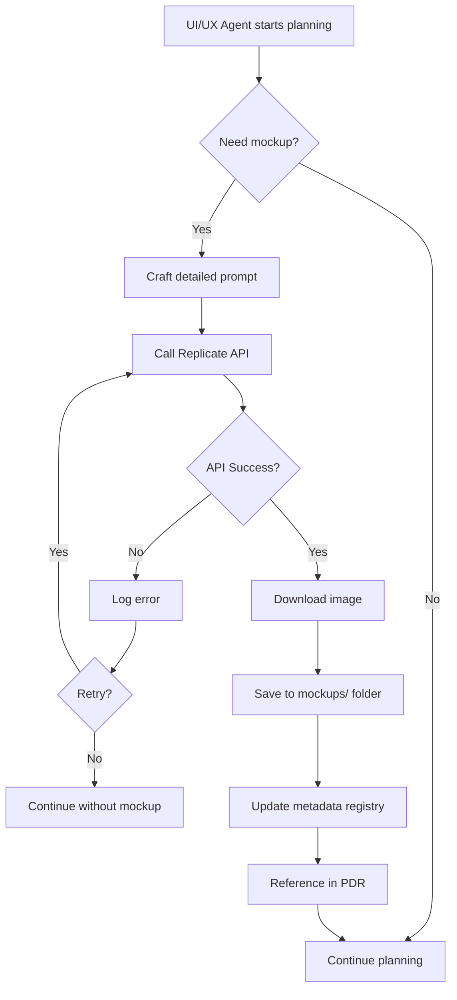

# Product Design Requirements (PDR)

## AI-Powered Wireframe Generation for UI/UX Designer Agent

**Date**: 2025-10-31
**Status**: Draft
**Priority**: P2 (Medium)
**Owner**: @tech-lead
**Feature Type**: Enhancement
**Visual Style**: Balsamiq-style Low-Fidelity Wireframes

---

## 1. Overview

### 1.1 Problem Statement

Currently, the UI/UX Designer agent can create design specifications and user flows, but lacks the ability to generate visual wireframes/mockups. This requires manual wireframe creation or relying on external tools like Balsamiq, creating a bottleneck in the planning workflow.

**Context:**

- **Business context**: Low-fidelity wireframes accelerate planning discussions and facilitate early-stage feedback without getting distracted by visual details
- **Technical context**: Replicate.com provides accessible AI image generation APIs with free tier support that can generate sketch-style wireframes
- **User context**: Tech leads and product owners need wireframe-style mockups during planning phase to focus on structure and layout, not final visual design

### 1.2 Goals & Success Metrics

**Primary Goal:**
Enable the UI/UX Designer agent to autonomously generate low-fidelity wireframes (Balsamiq-style mockups) from text descriptions and save them in planning sessions.

**Success Metrics:**

- **Wireframe Generation Time**: Average < 10 seconds per wireframe
  - How measured: Time from API call to saved PNG file
- **Wireframe Clarity**: 80%+ acceptance rate in planning reviews
  - How measured: User feedback - wireframes effectively communicate structure and layout
- **Cost Efficiency**: Stay within free tier (50 images/month) or < $5/month
  - How measured: Replicate API usage tracking

### 1.3 Non-Goals

What we explicitly won't do in this iteration:

- Real-time mockup editing or regeneration interface
- Integration with external design tools (Figma, Sketch)
- Multi-page mockup generation in a single call
- User authentication with Replicate (will use project API key)
- Custom model fine-tuning

---

## 2. User Stories

### US-001: Generate Mockup from Text Description

**As a** UI/UX Designer agent
**I want to** generate a mockup image from a text description
**So that** planning sessions include visual references without manual design work

**Priority**: P1

**Acceptance Criteria**:

- [ ] **AC-001**: Agent can send text prompts to Replicate API
  - Given: Agent has a text description of a UI screen
  - When: Agent calls mockup generation function
  - Then: API request is sent successfully with proper authentication

- [ ] **AC-002**: Generated mockups are saved with descriptive filenames
  - Given: API returns a generated image
  - When: Image is downloaded
  - Then: File is saved as `{screen-name}-{timestamp}.png` in `mockups/` folder

- [ ] **AC-003**: Agent handles API errors gracefully
  - Given: API call fails (network, rate limit, etc.)
  - When: Error is received
  - Then: Agent logs error and continues without crashing

**Edge Cases:**

- Rate limit exceeded: Queue request or inform user to wait
- Invalid prompt: Return helpful error message with prompt guidelines
- Large file size: Compress image if > 5MB

---

### US-002: Store Mockups in Planning Sessions

**As a** planning session organizer
**I want to** have all mockups stored in the session folder
**So that** mockups are version-controlled and accessible alongside PDR and tech-analysis

**Priority**: P1

**Acceptance Criteria**:

- [ ] **AC-001**: Mockups folder is created automatically
  - Given: Planning session exists (e.g., P-005-mockup-generation)
  - When: First mockup is generated
  - Then: `mockups/` subfolder is created if it doesn't exist

- [ ] **AC-002**: Mockup metadata is tracked
  - Given: Mockup is generated
  - When: File is saved
  - Then: Metadata file (`mockups/.registry.json`) is updated with prompt, timestamp, and filename

- [ ] **AC-003**: Mockups are referenced in PDR
  - Given: Mockup files exist in `mockups/` folder
  - When: PDR section 3.2 (Wireframes) or 3.3 (Mockups) is generated
  - Then: Relative paths to mockups are included in markdown

**Edge Cases:**

- Multiple mockups with same name: Append timestamp or increment counter
- Folder permissions: Check write access before attempting to save

---

### US-003: Configure Mockup Generation Parameters

**As a** tech lead
**I want to** configure mockup generation settings
**So that** output quality and costs are optimized for project needs

**Priority**: P2

**Acceptance Criteria**:

- [ ] **AC-001**: API key is configurable via environment variable
  - Given: Replicate API key is needed
  - When: Agent initializes
  - Then: Key is read from `REPLICATE_API_TOKEN` env var

- [ ] **AC-002**: Model selection is configurable via environment variable
  - Given: Multiple FLUX models available on Replicate
  - When: `REPLICATE_MODEL` environment variable is set
  - Then: Agent uses specified model (default: `black-forest-labs/flux-schnell` if not set)

- [ ] **AC-003**: Output parameters are configurable
  - Given: Image dimensions and quality can vary
  - When: Mockup is generated
  - Then: Parameters (width, height, steps) are applied from config

**Edge Cases:**

- Missing API key: Fail fast with clear error message
- Invalid model name: Fallback to default model

---

## 3. Design & Mockups

### 3.1 User Flow Diagram



**Description:**

1. Agent identifies need for visual mockup during planning phase
2. Crafts optimized prompt following UI/UX best practices
3. Calls Replicate API with FLUX-schnell model
4. Handles success/failure cases
5. Saves image with metadata
6. Updates PDR with mockup references

### 3.2 File Structure

```
.claude/sessions/planning/
└── P-XXX-feature-name/
    ├── PDR.md
    ├── tech-analysis.md
    ├── TODOs.md
    └── mockups/
        ├── .registry.json          # Mockup metadata
        ├── login-screen-20251031-143022.png
        ├── dashboard-view-20251031-143045.png
        └── mobile-navigation-20251031-143110.png
```

### 3.3 Mockup Metadata Structure

```json
{
  "version": "1.0",
  "generatedAt": "2025-10-31T14:30:22Z",
  "mockups": [
    {
      "id": "1",
      "filename": "login-screen-20251031-143022.png",
      "prompt": "Modern login screen with dark mode, email and password fields, social login buttons for Google and GitHub, minimalist design, blue accent color",
      "model": "black-forest-labs/flux-schnell",
      "parameters": {
        "width": 1024,
        "height": 768,
        "steps": 4
      },
      "cost": 0.003,
      "timestamp": "2025-10-31T14:30:22Z",
      "referencedIn": ["PDR.md"]
    }
  ]
}
```

### 3.4 UI Components

N/A - This is a backend/agent feature with no user-facing UI components.

### 3.5 Prompt Examples with Brand Guidelines

All mockup prompts are built using a **template system** that automatically includes Hospeda's brand and design guidelines to ensure visual consistency. The template system loads guidelines from `.claude/docs/standards/design-standards.md` and `.claude/skills/brand-guidelines.md` and injects them into a structured template.

Below are examples of complete prompts that will be generated from the template system and sent to Replicate API:

#### Example 1: Login Screen (Desktop)

**User Input:** "Login screen with email and password fields"

**Complete Prompt Generated by Template System:**

```
Low-fidelity wireframe mockup in Balsamiq style for tourism platform login screen.
Hand-drawn sketch aesthetic, black and white with gray shading.

UI Elements:
- Logo/branding area at top center
- Email input field with placeholder "Correo electrónico"
- Password input field with placeholder "Contraseña"
- Checkbox with label "Recordarme"
- Link text "¿Olvidaste tu contraseña?"
- Primary button labeled "Iniciar sesión"
- Social login buttons (Google, Facebook icons with text)
- All elements with hand-drawn borders and sketch-style appearance

IMPORTANT: All text MUST be in Spanish (Argentina). Use these translations:
- "Correo electrónico" for email field
- "Contraseña" for password field
- "Iniciar sesión" for sign in button
- "Recordarme" for remember me checkbox
- "¿Olvidaste tu contraseña?" for forgot password link

Visual Style:
- Black and white sketch style like Balsamiq wireframes
- Hand-drawn appearance with slightly imperfect lines
- Simple rectangles for input fields with labels
- Button shown as rounded rectangle with text
- Use placeholder text "x" for icons/images
- Gray background (#F5F5F5), black outlines, white elements
- Comic Sans or similar informal font for wireframe feel
- NO realistic colors, NO gradients, NO shadows, NO photorealism

Layout: Desktop wireframe (1024x768px)
Purpose: Planning-stage mockup to communicate structure and layout, not final design.
```

**Dimensions:** 1024x768px (Desktop)

---

#### Example 2: Dashboard with Metrics (Desktop)

**User Input:** "Admin dashboard showing booking statistics and revenue charts"

**Complete Prompt Sent to API:**

```
Professional admin dashboard UI mockup for tourism booking platform.
Top navigation bar with user profile, metrics cards showing key stats
(total bookings, revenue, occupancy rate, new users),
data visualization charts (line chart for revenue trend, bar chart for bookings by property).

Design System:
- Primary color: Blue #3b82f6 for navigation and charts
- Secondary color: Orange #f97316 for highlights and badges
- Success green #10b981 for positive metrics
- Card backgrounds: White with subtle shadow, 8px rounded corners
- Typography: Inter font, H2 at 30px semibold, body at 16px
- Text colors: #111827 headings, #4b5563 body, #9ca3af secondary
- Spacing: 24px grid gaps, 32px section padding
- Icons: Line style, consistent size (24px)
- Badges: Rounded-full, colored backgrounds (#f0fdf4 for success)

Layout: Sidebar navigation, grid layout (3 columns for metric cards),
full-width chart section below.

Brand: Professional, trustworthy, data-driven yet approachable.
Modern tourism/hospitality management aesthetic.
High-fidelity mockup, clean UI, photorealistic rendering.
```

**Dimensions:** 1440x900px (Large Desktop)

---

#### Example 3: Mobile Property Card

**User Input:** "Mobile card showing hotel information with photo"

**Complete Prompt Sent to API:**

```
Mobile UI card mockup for accommodation listing on tourism platform.
Hotel photo at top (16:9 ratio), property name as heading,
location with pin icon, star rating (4.5/5), price per night,
brief description (2 lines), amenities icons (WiFi, parking, pool),
"View Details" button at bottom.

Design System:
- Primary color: Blue #3b82f6 for "View Details" button
- Secondary color: Orange #f97316 for featured badge
- Card: White background, rounded-xl (12px), border gray #e5e7eb
- Typography: Inter font, H3 at 20px semibold, body at 14px
- Text: #111827 for title, #4b5563 for description, #9ca3af for meta
- Spacing: 16px internal padding, 12px between elements
- Icons: 20px, gray #6b7280
- Button: Rounded-lg (8px), full-width, medium font weight
- Shadows: Subtle drop shadow on card

Brand: Warm, welcoming, authentic local experiences.
Mobile-first tourism platform aesthetic.
High-quality UI mockup, modern design, sharp details.
```

**Dimensions:** 375x600px (Mobile)

---

#### Example 4: Search Filters Modal

**User Input:** "Filter modal for searching accommodations"

**Complete Prompt Sent to API:**

```
Modal overlay UI mockup for accommodation search filters.
Modal header with "Filters" title and close button,
filter sections: price range slider, property type checkboxes
(Hotel, Hostel, B&B, Apartment), amenities multi-select
(WiFi, Parking, Pool, Pet-friendly), star rating selector,
footer with "Clear All" and "Apply Filters" buttons.

Design System:
- Modal: White background, 16px rounded corners, centered on gray overlay
- Primary blue #3b82f6 for "Apply Filters" button and active states
- Secondary gray button for "Clear All"
- Typography: Inter font, H3 at 24px semibold for title, labels at 14px medium
- Text colors: #111827 headings, #4b5563 labels, #9ca3af helper text
- Spacing: 24px modal padding, 16px between sections, 8px between items
- Inputs: Border gray #d1d5db, focus with blue ring #3b82f6
- Checkboxes: Blue when selected, gray when empty
- Sliders: Blue track and thumb
- Close button: Gray ghost button, top-right corner

Layout: Vertical stack, scrollable content area, sticky footer.
Brand: User-friendly, clear, trustworthy tourism platform.
Modern filter UI, clean and accessible design.
High-fidelity mockup, photorealistic rendering.
```

**Dimensions:** 480x720px (Modal on Tablet)

---

#### Example 5: Booking Confirmation Screen

**User Input:** "Success screen after completing booking"

**Complete Prompt Sent to API:**

```
Success confirmation screen UI mockup for completed booking.
Large checkmark icon in success green circle at top,
"Booking Confirmed!" heading, confirmation number display,
booking summary card (property name, dates, guests, total price),
"What's next" section with timeline (confirmation email, host contact, check-in),
"View Booking Details" primary button, "Download Receipt" secondary button.

Design System:
- Success color: Green #10b981 for checkmark and positive elements
- Primary blue #3b82f6 for main CTA button
- Card: White background, subtle shadow, 12px rounded corners
- Typography: Inter font, Display at 48px bold for heading, body at 16px
- Text: #111827 headings, #4b5563 body, #6b7280 meta information
- Spacing: 32px top padding, 24px between sections, 16px card padding
- Icons: Success checkmark 64px, timeline icons 24px
- Buttons: Primary full-width rounded-lg, secondary outline style
- Badges: Confirmation number in gray badge with mono font

Layout: Centered content, vertical flow, clear visual hierarchy.
Brand: Celebratory yet professional, warm confirmation, trustworthy.
Tourism booking success aesthetic, reassuring design.
High-quality mockup, clean UI, photorealistic details.
```

**Dimensions:** 1024x768px (Desktop)

---

**Key Elements Included in All Prompts via Template System:**

- **Visual Style**: Balsamiq-style low-fidelity wireframes, hand-drawn sketch aesthetic
- **Color Scheme**: Black and white with gray shading only, NO realistic colors
- **Typography**: Comic Sans or informal wireframe-style fonts for sketch feel
- **Component Representation**: Simple shapes (rectangles, rounded rectangles, lines)
- **Drawing Style**: Hand-drawn appearance with slightly imperfect lines
- **Placeholder Icons**: Use "x" or simple shapes, not realistic icons
- **Language**: All text in wireframes must be in Spanish (platform target: Argentina)
- **Purpose**: Planning-stage mockups to communicate structure/layout, NOT final design
- **What to AVOID**: Photorealism, gradients, shadows, realistic colors, high fidelity

**Design System Application:**

While wireframes are low-fidelity, they still follow conceptual guidelines:

- Primary interactive elements (buttons) clearly distinguishable
- Consistent spacing between elements (conceptual grid)
- Clear visual hierarchy (headers larger, body text smaller)
- Accessibility considerations (clear labels, logical flow)

These guidelines are automatically loaded from `.claude/docs/standards/design-standards.md` and `.claude/skills/brand-guidelines.md` and adapted for wireframe style in the template system.

---

## 4. Technical Constraints

### 4.1 Performance Requirements

**API Response Time:**

- Mockup generation: < 10 seconds per image
- File save operation: < 1 second

**Image Specifications:**

- Default dimensions: 1024x768px (desktop), 375x812px (mobile)
- Format: PNG
- Max file size: 5MB (compress if larger)

**Concurrent Requests:**

- Max 2 concurrent API calls to avoid rate limits

### 4.2 Security Requirements

**Authentication:**

- Required: Yes
- Level: Project-level API key
- Provider: Replicate.com

**API Key Management:**

- Storage: Environment variable (`REPLICATE_API_TOKEN`)
- Access: Read-only by UI/UX agent
- Rotation: Quarterly or on compromise

**Data Privacy:**

- PII involved: No (prompts describe UI, not user data)
- Data classification: Internal
- Prompts sent to Replicate: Log locally for audit
- Generated images: Stored locally, not uploaded to external services

**Input Validation:**

- Prompt length: 1-500 characters
- Sanitization: Remove potentially harmful instructions
- Rate limiting: Max 10 requests per planning session

### 4.3 Accessibility Requirements

**WCAG Level**: N/A (generated mockups are planning artifacts, not production UI)

**Note**: While mockups themselves don't need to be accessible, prompts should encourage accessible design patterns (e.g., "ensure high contrast", "include focus indicators").

### 4.4 Browser/Device Support

N/A - This is a server-side/agent feature with no browser requirements.

---

## 5. Dependencies & Integrations

### 5.1 Internal Dependencies

| Package/Service | Version | Why Needed | Impact if Unavailable |
|----------------|---------|------------|----------------------|
| @claude/agents | current | UI/UX Designer agent | Core functionality unavailable |
| Node.js fs | built-in | File system operations | Cannot save mockups |
| Node.js path | built-in | Path handling | Cannot organize files |

### 5.2 External Dependencies

| Service/API | Version | Why Needed | Rate Limits | Fallback |
|-------------|---------|------------|-------------|----------|
| Replicate.com | v1 | AI image generation | 50 free/month, then $0.003/image | Manual mockup creation |
| FLUX.1 [schnell] | latest | Fast image generation model | Same as Replicate | Switch to FLUX [dev] or Stable Diffusion |

### 5.3 New Dependencies

**Packages to Add:**

- `replicate`: ^0.25.0 - Official Replicate Node.js client - ~50KB bundle size
- `sharp`: ^0.32.0 - Image processing (compression, resizing) - ~8MB bundle size

**Justification:**

- **replicate**: Official SDK ensures compatibility and proper error handling. Alternative: raw HTTP calls (more complex)
- **sharp**: Industry-standard image processing with excellent performance. Alternative: jimp (slower, pure JS)

---

## 6. Risks & Mitigations

| Risk | Impact | Probability | Mitigation Strategy | Owner |
|------|--------|-------------|-------------------|-------|
| API rate limits exceeded | Medium | Medium | Implement request queue, monitor usage, alert when approaching limit | Backend Dev |
| Poor mockup quality | High | Low | Craft detailed prompts, test with various UI patterns, allow retries | UI/UX Designer |
| API key exposure | High | Low | Use env vars, never commit keys, rotate regularly | Tech Lead |
| Cost overrun | Low | Medium | Set monthly budget alerts, track usage, auto-disable after threshold | Product Owner |
| Service outage | Medium | Low | Graceful degradation, continue planning without mockups | Backend Dev |

**Risk Details:**

### Risk 1: API Rate Limits Exceeded

- **Description**: Free tier allows 50 images/month. High usage could exceed limits.
- **Impact if occurs**: Unable to generate mockups, workflow interruption
- **Mitigation**:
  - Track usage in real-time
  - Alert at 40/50 threshold
  - Implement request queue for concurrent sessions
  - Consider upgrading to paid tier if consistently needed
- **Monitoring**: Log all API calls with response metadata

### Risk 2: Poor Mockup Quality

- **Description**: Generated mockups may not match expectations or design standards
- **Impact if occurs**: Wasted API calls, time spent regenerating
- **Mitigation**:
  - Create prompt engineering guidelines
  - Test with common UI patterns beforehand
  - Allow manual prompt override
  - Provide examples of good/bad prompts
- **Monitoring**: Track regeneration requests, gather user feedback

### Risk 3: API Key Exposure

- **Description**: API key could be accidentally committed or leaked
- **Impact if occurs**: Unauthorized usage, potential service abuse
- **Mitigation**:
  - Use `.env` file with `.gitignore` entry
  - Never log full API key
  - Implement pre-commit hooks to detect keys
  - Rotate key quarterly
- **Monitoring**: Check Replicate dashboard for unusual activity

---

## 7. Out of Scope / Future Work

**Explicitly Out of Scope:**

- Interactive mockup editor - Use external tools like Figma
- Real-time collaboration on mockups - Not needed for planning phase
- Version control for mockup iterations - Simple overwrite approach sufficient for now
- Integration with design systems - Future enhancement once design system is established

**Future Enhancements:**

- **Batch generation**: Generate multiple mockups from a single prompt list - When planning workflow matures
- **Style consistency**: Maintain consistent visual style across all mockups in a session - When brand guidelines are finalized
- **Mockup variations**: Generate light/dark mode variants automatically - When needed by design process
- **Cost tracking dashboard**: Visualize API usage and costs over time - If usage increases significantly

**Technical Debt Created:**

- **Synchronous API calls**: May block agent during generation - Plan to make async if it becomes an issue
- **No image optimization pipeline**: Sharp is used for basic compression only - Consider CDN integration later
- **Metadata stored in JSON file**: Not queryable or scalable - Migrate to database if mockup library grows

---

## 8. Testing Strategy

### 8.1 Test Coverage Requirements

- Unit tests: 90%+ coverage
- Integration tests: Replicate API integration
- E2E tests: Full mockup generation workflow

### 8.2 Test Scenarios

**Unit Tests:**

- Prompt validation and sanitization
- Filename generation with timestamps
- Metadata registry update logic
- Error handling for various failure modes
- Image compression and resizing

**Integration Tests:**

- Replicate API authentication
- Successful mockup generation and download
- API error handling (rate limits, network failures)
- File system operations (create folder, save file)

**E2E Tests:**

- Complete workflow: Agent generates mockup during planning
- Mockup is saved to correct location
- PDR is updated with mockup reference
- Metadata registry is accurate

### 8.3 Performance Testing

- Load test: Generate 10 mockups in succession
- Stress test: Handle API failures and retries gracefully
- Network test: Simulate slow connections (download timeout)

---

## 9. Documentation Requirements

**Documentation to Create/Update:**

- [x] PDR (this document)
- [ ] Technical Analysis document
- [ ] UI/UX Designer agent documentation (.claude/agents/specialized/ui-ux-designer.md)
- [ ] Environment setup guide (add REPLICATE_API_TOKEN)
- [ ] Prompt engineering guidelines for mockup generation
- [ ] Example mockup gallery in documentation

---

## 10. Deployment Plan

**Deployment Type**: Feature Flag

**Rollout Plan:**

1. **Phase 1**: Internal testing with tech-lead only
   - Enable feature flag for tech-lead agent invocations
   - Generate mockups for 2-3 planning sessions
   - Validate quality and gather feedback

2. **Phase 2**: Beta rollout to all planning sessions
   - Enable feature globally
   - Monitor API usage and costs
   - Collect user feedback on mockup quality

3. **Phase 3**: General availability
   - Remove feature flag
   - Document in quick-start guide
   - Add to agent capabilities list

**Rollback Plan:**

- Trigger: High costs, poor quality, or API reliability issues
- Steps: Disable feature flag, revert to manual mockup creation
- Data: Preserve generated mockups (already saved locally)

**Feature Flags:**

- `enable-mockup-generation`: Enable/disable AI mockup generation

---

## 11. Related Documents

**Planning Documents:**

- [Technical Analysis](./tech-analysis.md) - Technical implementation details
- [TODOs & Progress](./TODOs.md) - Task breakdown and progress tracking

**External References:**

- [Replicate API Documentation](https://replicate.com/docs)
- [FLUX.1 Schnell Model](https://replicate.com/black-forest-labs/flux-schnell)
- [Replicate Node.js Client](https://github.com/replicate/replicate-javascript)
- [Sharp Image Processing](https://sharp.pixelplumbingco.uk/)

---

## 12. Stakeholder Sign-Off

| Role | Name | Status | Date | Comments |
|------|------|--------|------|----------|
| Product Owner | @qazuor | Pending | - | - |
| Tech Lead | @tech-lead | Pending | - | - |
| UI/UX Designer | @ui-ux-designer | Pending | - | - |

---

## 13. Changelog

| Date | Author | Changes | Version |
|------|--------|---------|---------|
| 2025-10-31 | @tech-lead | Initial draft | 0.1 |
| 2025-10-31 | @tech-lead | Added configurable model requirement and template system | 0.2 |
| 2025-10-31 | @tech-lead | Added Spanish language requirement for all mockup text | 0.3 |
| 2025-10-31 | @tech-lead | Changed from high-fidelity mockups to Balsamiq-style low-fidelity wireframes | 0.4 |

---

## 14. Questions & Answers

**Q1**: Should mockups be regenerated automatically if prompts change?
**A1**: No, for now mockups are static artifacts. Manual regeneration is acceptable. - 2025-10-31 - @tech-lead

**Q2**: What if the free tier runs out mid-month?
**A2**: Alert user and offer to either pay for additional generations or continue without mockups. Monitor usage carefully. - 2025-10-31 - @tech-lead

---

## Notes

**General Notes:**

- This feature enhances but does not replace manual design work
- Quality of generated mockups depends heavily on prompt engineering
- Consider this a "design draft" tool, not a production-ready design system

**Meeting Notes:**

- 2025-10-31: Initial planning discussion with user. Confirmed use of Replicate.com and FLUX-schnell model.

---

**Status**: This PDR is Draft
**Next Actions**: Create technical analysis document, break down into tasks
**Owner**: @tech-lead
