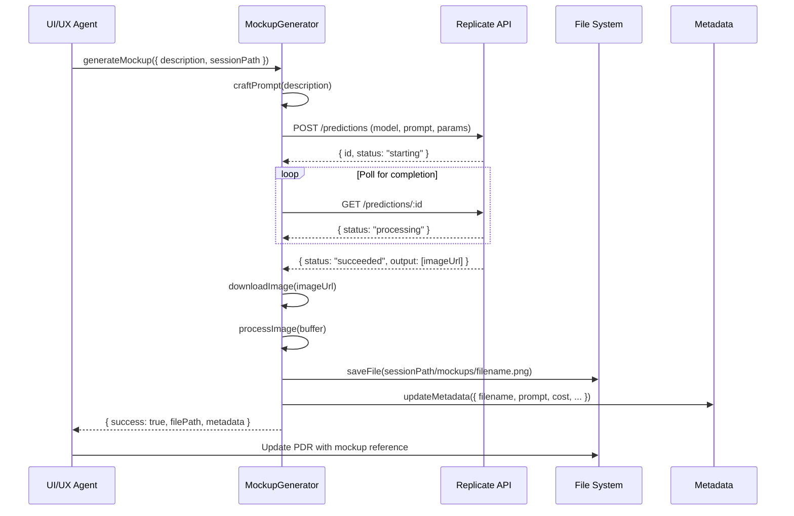

# Technical Analysis

## AI-Powered Wireframe Generation for UX/UI Designer Agent

**Date**: 2025-10-31
**Related PDR**: [PDR.md](./PDR.md)
**Status**: Draft
**Tech Lead**: @tech-lead
**Visual Style**: Balsamiq-style Low-Fidelity Wireframes

---

## 1. Executive Summary

**Feature Overview:**

We're enhancing the UX/UI Designer agent to autonomously generate **low-fidelity wireframes** (Balsamiq-style mockups) from text descriptions using Replicate.com's FLUX.1 [schnell] model. Generated wireframes will be saved as PNG files in planning session folders (`mockups/` subdirectory) and automatically referenced in PDR documents.

**Technical Approach:**

- Integrate Replicate Node.js SDK for API communication
- Implement Handlebars template system for Balsamiq-style wireframe prompt generation
- Create file management system for organizing wireframes with metadata
- Extend UX/UI Designer agent with wireframe generation capabilities
- Add configuration management for API keys and generation parameters (including model selection)

**Key Decisions:**

1. **Model Selection**: FLUX.1 [schnell] chosen for balance of speed ($0.003/image) and quality, configurable via env var
2. **Visual Style**: Balsamiq-style low-fidelity wireframes (black/white sketch) NOT photorealistic mockups
3. **Template System**: Handlebars.js templates for structured, maintainable prompts
4. **Storage Strategy**: Local file system storage within planning sessions (not cloud/CDN)
5. **Metadata Tracking**: JSON registry file for each session's wireframes
6. **Integration Point**: Extend existing UX/UI Designer agent rather than creating new agent
7. **Language**: All wireframe text in Spanish (Argentina) for target market

**Estimated Complexity**: Medium

**Estimated Timeline**: 2-3 days

---

## 2. Architecture Overview

### 2.1 System Architecture

```mermaid
graph TB
    Agent[UX/UI Designer Agent]
    WireframeGen[Wireframe Generator]
    AIImagePkg[@repo/ai-image-generation]
    Provider[Replicate Provider]
    TemplateEngine[Template Engine]
    Replicate[Replicate API]
    FileSystem[File System]
    Metadata[Metadata Registry]

    Agent -->|Generate wireframe| WireframeGen
    WireframeGen -->|Use generic package| AIImagePkg
    AIImagePkg -->|Load templates| TemplateEngine
    AIImagePkg -->|Call provider| Provider
    Provider -->|API call| Replicate
    Replicate -->|Image URL| Provider
    Provider -->|Return image| AIImagePkg
    AIImagePkg -->|Process & save| FileSystem
    AIImagePkg -->|Update metadata| Metadata
    AIImagePkg -->|Return result| WireframeGen
    WireframeGen -->|Return path| Agent
    Agent -->|Update PDR| FileSystem

    subgraph "@repo/ai-image-generation (Generic Package)"
        Config[Configuration]
        Providers[Provider Interface]
        Templates[Template System]
        ImageProc[Image Processing]
        MetaMgr[Metadata Manager]

        AIImagePkg --> Config
        AIImagePkg --> Providers
        AIImagePkg --> Templates
        AIImagePkg --> ImageProc
        AIImagePkg --> MetaMgr
    end

    subgraph "Wireframe-Specific (Agent Utils)"
        WireframeTemplates[Wireframe Templates]
        WireframeConfig[Wireframe Config]

        WireframeGen --> WireframeTemplates
        WireframeGen --> WireframeConfig
    end

    subgraph "Planning Session"
        PDR[PDR.md]
        MockupFolder[mockups/]
        Registry[.registry.json]

        FileSystem --> PDR
        FileSystem --> MockupFolder
        Metadata --> Registry
    end
```

**Description:**

1. UX/UI Designer agent identifies need for wireframe during planning
2. Calls Wireframe Generator (agent-specific wrapper)
3. Wireframe Generator uses generic `@repo/ai-image-generation` package
4. Package loads wireframe-specific templates from agent utils
5. Template engine generates Balsamiq-style prompt
6. Provider interface calls Replicate API (extensible to other providers)
7. Image URL returned, downloaded and processed (compression via Sharp)
8. Metadata Manager updates registry file
9. File path returned to Wireframe Generator
10. Agent receives result and updates PDR

**Key Architecture Benefits:**

- **Generic Package**: `@repo/ai-image-generation` can be used for ANY image generation need
- **Provider Pattern**: Easy to add OpenAI DALL-E, Midjourney, Stability AI, etc.
- **Template System**: Extensible - wireframes today, illustrations/icons tomorrow
- **Separation of Concerns**: Core logic separate from specific use cases
- **Reusability**: Same package for product images, diagrams, social media graphics, etc.

### 2.2 Data Flow



**Flow Description:**

1. Agent calls `generateMockup()` with description and session path
2. Generator crafts UI-optimized prompt from description
3. API request sent to Replicate (async prediction)
4. Poll API for completion (max 30s timeout)
5. Download image from returned URL
6. Process with Sharp (compression, resize if needed)
7. Save to `<sessionPath>/mockups/<filename>.png`
8. Update metadata registry with generation details
9. Return file path to agent
10. Agent inserts mockup reference into PDR

---

## 3. Package Structure

### 3.1 New Generic Package: `@repo/ai-image-generation`

**Package Location:** `packages/ai-image-generation/`

**Purpose:** Generic, configurable, extensible package for AI-powered image generation with any provider.

**Directory Structure:**

```
packages/ai-image-generation/
├── src/
│   ├── providers/
│   │   ├── base-provider.ts          # Abstract provider interface
│   │   ├── replicate-provider.ts     # Replicate implementation
│   │   └── index.ts
│   ├── templates/
│   │   ├── template-engine.ts        # Handlebars template engine
│   │   ├── template-loader.ts        # Load templates from filesystem
│   │   └── index.ts
│   ├── processors/
│   │   ├── image-processor.ts        # Sharp-based image processing
│   │   └── index.ts
│   ├── metadata/
│   │   ├── metadata-manager.ts       # JSON registry management
│   │   └── index.ts
│   ├── types/
│   │   ├── provider.types.ts
│   │   ├── template.types.ts
│   │   ├── config.types.ts
│   │   └── index.ts
│   ├── image-generator.ts            # Main generator class
│   ├── config.ts                     # Configuration manager
│   └── index.ts
├── test/
│   ├── providers/
│   ├── templates/
│   ├── processors/
│   └── integration/
├── package.json
├── tsconfig.json
└── README.md
```

**Core Interfaces:**

```typescript
// Provider Interface (extensible to any AI service)
export interface AIImageProvider {
  name: string;
  generate(params: GenerateImageParams): Promise<GenerateImageResult>;
  validateConfig(config: ProviderConfig): boolean;
}

// Template Interface
export interface TemplateConfig {
  templatePath: string;
  partialsPath?: string;
  helpers?: Record<string, HandlebarsHelperDelegate>;
}

// Generator Configuration
export interface ImageGeneratorConfig {
  provider: AIImageProvider;
  templateConfig?: TemplateConfig;
  outputPath: string;
  imageProcessing?: ImageProcessingOptions;
  metadata?: MetadataOptions;
}

// Generation Parameters
export interface GenerateImageParams {
  prompt: string;
  width?: number;
  height?: number;
  model?: string;
  additionalParams?: Record<string, any>;
}

// Generation Result
export interface GenerateImageResult {
  success: boolean;
  filePath?: string;
  filename?: string;
  metadata?: ImageMetadata;
  error?: ImageGenerationError;
}
```

**Usage Example (Wireframe Generation):**

```typescript
// .claude/agents/utils/wireframe-generator.ts
import { ImageGenerator, ReplicateProvider } from '@repo/ai-image-generation';

export class WireframeGenerator {
  private generator: ImageGenerator;

  constructor() {
    // Configure Replicate provider
    const provider = new ReplicateProvider({
      apiToken: process.env.REPLICATE_API_TOKEN!,
      model: process.env.REPLICATE_MODEL || 'black-forest-labs/flux-schnell',
    });

    // Configure generator with wireframe templates
    this.generator = new ImageGenerator({
      provider,
      templateConfig: {
        templatePath: '.claude/agents/utils/templates/wireframes',
        partialsPath: '.claude/agents/utils/templates/wireframes/partials',
      },
      outputPath: '.claude/sessions/planning',
      imageProcessing: {
        format: 'png',
        compressionLevel: 9,
        maxFileSize: 5 * 1024 * 1024, // 5MB
      },
      metadata: {
        enabled: true,
        registryFile: '.registry.json',
      },
    });
  }

  async generateWireframe(
    description: string,
    sessionPath: string,
    device: 'desktop' | 'tablet' | 'mobile' = 'desktop'
  ): Promise<GenerateImageResult> {
    // Generator handles template loading, prompt building, API call,
    // image processing, and metadata management
    return await this.generator.generate({
      templateData: {
        description,
        device,
        style: 'balsamiq',
      },
      sessionPath,
      filename: this.generateFilename(description),
    });
  }
}
```

**Future Use Cases (Same Package):**

```typescript
// Example 1: Product illustrations for marketing
const illustrationGen = new ImageGenerator({
  provider: new ReplicateProvider({ model: 'dall-e-3' }),
  templateConfig: { templatePath: './templates/illustrations' },
  outputPath: './public/images/products',
});

// Example 2: Social media graphics
const socialMediaGen = new ImageGenerator({
  provider: new StabilityAIProvider(),
  templateConfig: { templatePath: './templates/social-media' },
  outputPath: './public/images/social',
});

// Example 3: Icon generation
const iconGen = new ImageGenerator({
  provider: new MidjourneyProvider(),
  templateConfig: { templatePath: './templates/icons' },
  outputPath: './public/icons',
  imageProcessing: { format: 'svg' },
});
```

---

## 4. Technical Stack

### 4.1 Technologies Used

| Layer | Technology | Version | Why Chosen |
|-------|-----------|---------|------------|
| AI Model | FLUX.1 [schnell] (configurable) | latest | Fastest FLUX variant, low cost, Apache 2.0 license. Model configurable via `REPLICATE_MODEL` env var |
| API Service | Replicate.com | API v1 | Reliable, generous free tier (50/month), official SDK |
| Node.js SDK | replicate | ^0.25.0 | Official client, TypeScript support, handles polling |
| Image Processing | sharp | ^0.32.0 | Industry standard, fast, comprehensive features |
| File System | Node.js fs | built-in | Standard file operations |
| Metadata | JSON files | N/A | Simple, git-friendly, no DB needed |
| Prompt Templates | Handlebars.js | ^4.7.8 | Template engine for structured prompts with variable injection |

### 4.2 New Package Dependencies

**Package:** `@repo/ai-image-generation`

**Location:** `packages/ai-image-generation/package.json`

```json
{
  "name": "@repo/ai-image-generation",
  "version": "0.1.0",
  "description": "Generic AI image generation package with multi-provider support",
  "main": "dist/index.js",
  "types": "dist/index.d.ts",
  "dependencies": {
    "replicate": "^0.25.0",
    "handlebars": "^4.7.8",
    "sharp": "^0.32.0"
  },
  "devDependencies": {
    "@types/node": "^20.0.0",
    "@types/handlebars": "^4.1.0",
    "@repo/logger": "workspace:*",
    "@repo/config": "workspace:*",
    "vitest": "^1.0.0"
  },
  "exports": {
    ".": {
      "import": "./dist/index.js",
      "types": "./dist/index.d.ts"
    },
    "./providers": {
      "import": "./dist/providers/index.js",
      "types": "./dist/providers/index.d.ts"
    },
    "./templates": {
      "import": "./dist/templates/index.js",
      "types": "./dist/templates/index.d.ts"
    }
  }
}
```

**Dependency Justification:**

- **replicate** (~50KB): Official SDK for Replicate API. Provides TypeScript types, handles polling, manages authentication. Alternative: raw fetch (more complex, error-prone)
- **handlebars** (~65KB): Template engine for structured, reusable prompts. Supports partials, helpers, and variable injection. Alternative: template literals (less maintainable, no reusability)
- **sharp** (~8MB): High-performance image processing. Native C++ bindings for speed. Handles resize, compress, format conversion. Alternative: jimp (pure JS, much slower)
- **@types/node**: TypeScript definitions for Node.js built-ins (fs, path, etc.)
- **@types/handlebars**: TypeScript definitions for Handlebars
- **@repo/logger**: Internal package for structured logging
- **@repo/config**: Internal package for environment configuration

**Bundle Impact:**

- **Package size**: ~8.6MB (mostly Sharp native binaries)
- **Frontend impact**: None (server-side only package)
- **Runtime memory**: ~20-50MB during image processing
- **Tree-shakeable**: Yes (ESM exports for individual modules)

**Why This is a Separate Package:**

1. **Reusability**: Can be used by any app/package in monorepo
2. **Testability**: Isolated testing without agent dependencies
3. **Maintainability**: Single source of truth for AI image generation
4. **Versioning**: Independent versioning and releases
5. **Documentation**: Dedicated README with usage examples
6. **Future-proof**: Easy to extend with new providers (OpenAI, Stability AI, Midjourney)

---

## 4. Database Design

N/A - This feature does not require database changes. Metadata stored in JSON files within planning sessions.

---

## 5. API Design

N/A - This feature is agent-internal functionality. No public API endpoints added.

### 5.1 Internal API (Agent Functions)

#### Function: `generateMockup`

```typescript
interface GenerateMockupInput {
  description: string;
  sessionPath: string;
  options?: {
    width?: number;      // Default: 1024
    height?: number;     // Default: 768
    steps?: number;      // Default: 4 (schnell optimized)
    device?: 'desktop' | 'tablet' | 'mobile'; // Preset dimensions
  };
}

interface GenerateMockupOutput {
  success: boolean;
  filePath?: string;
  filename?: string;
  metadata?: MockupMetadata;
  error?: {
    code: string;
    message: string;
  };
}

async function generateMockup(
  input: GenerateMockupInput
): Promise<GenerateMockupOutput>
```

#### Function: `listMockups`

```typescript
interface ListMockupsInput {
  sessionPath: string;
}

interface ListMockupsOutput {
  mockups: MockupMetadata[];
  total: number;
}

async function listMockups(
  input: ListMockupsInput
): Promise<ListMockupsOutput>
```

---

## 6. Service Layer Design

### 6.1 Generic Package Architecture

**Main Package Class:**

```typescript
// packages/ai-image-generation/src/image-generator.ts

import { AIImageProvider } from './providers/base-provider';
import { TemplateEngine } from './templates/template-engine';
import { ImageProcessor } from './processors/image-processor';
import { MetadataManager } from './metadata/metadata-manager';

export class ImageGenerator {
  private provider: AIImageProvider;
  private templateEngine?: TemplateEngine;
  private imageProcessor: ImageProcessor;
  private metadataManager?: MetadataManager;
  private config: ImageGeneratorConfig;

  constructor(config: ImageGeneratorConfig) {
    this.config = config;
    this.provider = config.provider;

    if (config.templateConfig) {
      this.templateEngine = new TemplateEngine(config.templateConfig);
    }

    this.imageProcessor = new ImageProcessor(
      config.imageProcessing || {}
    );

    if (config.metadata?.enabled) {
      this.metadataManager = new MetadataManager(config.metadata);
    }
  }

  async initialize(): Promise<void> {
    // Load templates if configured
    if (this.templateEngine) {
      await this.templateEngine.initialize();
    }
  }

  async generate(params: {
    prompt?: string;
    templateData?: any;
    sessionPath: string;
    filename: string;
  }): Promise<GenerateImageResult> {
    try {
      // 1. Build prompt (from template or direct)
      const prompt = params.prompt ||
        await this.templateEngine!.buildPrompt(params.templateData);

      // 2. Validate configuration
      if (!this.provider.validateConfig()) {
        throw new Error('Invalid provider configuration');
      }

      // 3. Call provider (Replicate, OpenAI, etc.)
      const result = await this.provider.generate({
        prompt,
        width: params.templateData?.width,
        height: params.templateData?.height,
      });

      // 4. Download image
      const imageBuffer = await this.downloadImage(result.imageUrl);

      // 5. Process image (compress, resize, etc.)
      const processedBuffer = await this.imageProcessor.process(
        imageBuffer,
        params.templateData
      );

      // 6. Save to filesystem
      const outputPath = path.join(
        this.config.outputPath,
        params.sessionPath,
        'mockups'
      );
      await fs.mkdir(outputPath, { recursive: true });
      const filePath = path.join(outputPath, params.filename);
      await fs.writeFile(filePath, processedBuffer);

      // 7. Update metadata registry
      if (this.metadataManager) {
        await this.metadataManager.addEntry({
          filename: params.filename,
          prompt,
          provider: this.provider.name,
          ...result.metadata,
        });
      }

      // 8. Return result
      return {
        success: true,
        filePath,
        filename: params.filename,
        metadata: result.metadata,
      };
    } catch (error) {
      return {
        success: false,
        error: {
          code: 'GENERATION_FAILED',
          message: error.message,
          details: error,
        },
      };
    }
  }

  private async downloadImage(url: string): Promise<Buffer> {
    const response = await fetch(url);
    if (!response.ok) {
      throw new Error(`Failed to download image: ${response.statusText}`);
    }
    return Buffer.from(await response.arrayBuffer());
  }
}
```

**Provider Interface:**

```typescript
// packages/ai-image-generation/src/providers/base-provider.ts

export abstract class BaseImageProvider implements AIImageProvider {
  abstract name: string;
  protected config: ProviderConfig;

  constructor(config: ProviderConfig) {
    this.config = config;
  }

  abstract generate(params: GenerateImageParams): Promise<ProviderResult>;
  abstract validateConfig(): boolean;
}

// packages/ai-image-generation/src/providers/replicate-provider.ts

export class ReplicateProvider extends BaseImageProvider {
  name = 'replicate';
  private client: Replicate;

  constructor(config: ReplicateProviderConfig) {
    super(config);
    this.client = new Replicate({ auth: config.apiToken });
  }

  validateConfig(): boolean {
    return !!this.config.apiToken;
  }

  async generate(params: GenerateImageParams): Promise<ProviderResult> {
    const model = params.model || this.config.model ||
                  'black-forest-labs/flux-schnell';

    const output = await this.client.run(model, {
      input: {
        prompt: params.prompt,
        width: params.width || 1024,
        height: params.height || 768,
        num_inference_steps: params.additionalParams?.steps || 4,
      },
    });

    return {
      imageUrl: Array.isArray(output) ? output[0] : output,
      metadata: {
        model,
        provider: this.name,
        generatedAt: new Date().toISOString(),
        cost: this.calculateCost(model),
      },
    };
  }

  private calculateCost(model: string): number {
    const costs = {
      'black-forest-labs/flux-schnell': 0.003,
      'black-forest-labs/flux-dev': 0.055,
      'black-forest-labs/flux-pro': 0.055,
    };
    return costs[model] || 0;
  }
}
```

**Wireframe-Specific Wrapper:**

```typescript
// .claude/agents/utils/wireframe-generator.ts

import {
  ImageGenerator,
  ReplicateProvider
} from '@repo/ai-image-generation';

export class WireframeGenerator {
  private generator: ImageGenerator;

  constructor() {
    const provider = new ReplicateProvider({
      apiToken: process.env.REPLICATE_API_TOKEN!,
      model: process.env.REPLICATE_MODEL || 'black-forest-labs/flux-schnell',
    });

    this.generator = new ImageGenerator({
      provider,
      templateConfig: {
        templatePath: '.claude/agents/utils/templates/wireframes',
        partialsPath: '.claude/agents/utils/templates/wireframes/partials',
      },
      outputPath: '.claude/sessions/planning',
      imageProcessing: {
        format: 'png',
        compressionLevel: 9,
        maxFileSize: 5 * 1024 * 1024,
      },
      metadata: {
        enabled: true,
        registryFile: '.registry.json',
      },
    });
  }

  async initialize(): Promise<void> {
    await this.generator.initialize();
  }

  async generateWireframe(
    description: string,
    sessionPath: string,
    device: 'desktop' | 'tablet' | 'mobile' = 'desktop'
  ): Promise<GenerateImageResult> {
    const timestamp = new Date().toISOString().replace(/[:.]/g, '-');
    const filename = `${this.sanitizeName(description)}-${timestamp}.png`;

    return await this.generator.generate({
      templateData: {
        description,
        device,
        style: 'balsamiq',
        width: this.getDimensions(device).width,
        height: this.getDimensions(device).height,
      },
      sessionPath,
      filename,
    });
  }

  private sanitizeName(name: string): string {
    return name
      .toLowerCase()
      .replace(/[^a-z0-9]+/g, '-')
      .substring(0, 50);
  }

  private getDimensions(device: string) {
    const dimensions = {
      desktop: { width: 1024, height: 768 },
      tablet: { width: 768, height: 1024 },
      mobile: { width: 375, height: 812 },
    };
    return dimensions[device] || dimensions.desktop;
  }
}
```

### 6.2 Prompt Template System (Generic Package)

**Template System Overview:**

The generic `@repo/ai-image-generation` package includes a **TemplateEngine** that uses Handlebars.js for structured prompt generation. This makes the package extensible for ANY image generation use case (wireframes, illustrations, icons, diagrams, etc.).

**How It Works in the Generic Package:**

```typescript
// packages/ai-image-generation/src/templates/template-engine.ts

export class TemplateEngine {
  private templates: Map<string, HandlebarsTemplateDelegate> = new Map();
  private partials: Map<string, string> = new Map();
  private helpers: Record<string, HandlebarsHelperDelegate>;

  constructor(config: TemplateConfig) {
    this.config = config;
    this.helpers = config.helpers || {};
  }

  async initialize(): Promise<void> {
    // Register custom helpers
    Object.entries(this.helpers).forEach(([name, helper]) => {
      Handlebars.registerHelper(name, helper);
    });

    // Load and register partials
    if (this.config.partialsPath) {
      await this.loadPartials(this.config.partialsPath);
    }

    // Load and compile main templates
    await this.loadTemplates(this.config.templatePath);
  }

  async buildPrompt(
    templateName: string,
    data: any
  ): Promise<string> {
    const template = this.templates.get(templateName);
    if (!template) {
      throw new Error(`Template '${templateName}' not found`);
    }

    return template(data).trim();
  }

  private async loadTemplates(templatePath: string): Promise<void> {
    const files = await fs.readdir(templatePath);
    for (const file of files) {
      if (file.endsWith('.hbs')) {
        const content = await fs.readFile(
          path.join(templatePath, file),
          'utf-8'
        );
        const name = file.replace('.hbs', '');
        this.templates.set(name, Handlebars.compile(content));
      }
    }
  }

  private async loadPartials(partialsPath: string): Promise<void> {
    const files = await fs.readdir(partialsPath);
    for (const file of files) {
      if (file.endsWith('.hbs')) {
        const content = await fs.readFile(
          path.join(partialsPath, file),
          'utf-8'
        );
        const name = file.replace('.hbs', '');
        Handlebars.registerPartial(name, content);
        this.partials.set(name, content);
      }
    }
  }
}
```

**Wireframe-Specific Template Structure:**

```
.claude/agents/utils/templates/wireframes/
├── base-wireframe.hbs        # Base template for Balsamiq-style wireframes
└── partials/
    ├── desktop-layout.hbs    # Desktop wireframe layout instructions
    ├── tablet-layout.hbs     # Tablet wireframe layout instructions
    └── mobile-layout.hbs     # Mobile wireframe layout instructions
```

**Template Configuration in WireframeGenerator:**

```typescript
// .claude/agents/utils/wireframe-generator.ts

export class WireframeGenerator {
  constructor() {
    // Load guidelines from project docs
    const guidelines = await this.loadGuidelines();

    const provider = new ReplicateProvider({
      apiToken: process.env.REPLICATE_API_TOKEN!,
      model: process.env.REPLICATE_MODEL || 'black-forest-labs/flux-schnell',
    });

    this.generator = new ImageGenerator({
      provider,
      templateConfig: {
        templatePath: '.claude/agents/utils/templates/wireframes',
        partialsPath: '.claude/agents/utils/templates/wireframes/partials',
        helpers: {
          // Custom helper for Spanish translations
          t: (key: string) => this.translate(key),
        },
      },
      outputPath: '.claude/sessions/planning',
      imageProcessing: {
        format: 'png',
        compressionLevel: 9,
        maxFileSize: 5 * 1024 * 1024,
      },
      metadata: {
        enabled: true,
        registryFile: '.registry.json',
      },
    });
  }

  private async loadGuidelines(): Promise<WireframeGuidelines> {
    // Load design standards and brand guidelines from markdown files
    const designStandards = await this.parseDesignStandards(
      '.claude/docs/standards/design-standards.md'
    );
    const brandGuidelines = await this.parseBrandGuidelines(
      '.claude/skills/brand-guidelines.md'
    );

    return { designStandards, brandGuidelines };
  }

  private translate(key: string): string {
    const translations = {
      'sign_in': 'Iniciar sesión',
      'email': 'Correo electrónico',
      'password': 'Contraseña',
      'remember_me': 'Recordarme',
      'forgot_password': '¿Olvidaste tu contraseña?',
      'search': 'Buscar',
      'filter': 'Filtrar',
      'book_now': 'Reservar ahora',
      'view_details': 'Ver detalles',
      'availability': 'Disponibilidad',
      'rooms': 'Habitaciones',
      'price_per_night': 'Precio por noche',
    };
    return translations[key] || key;
  }
}
```

**Why Generic Package Uses Templates:**

The template system makes the `@repo/ai-image-generation` package reusable for different purposes:

1. **Wireframes** - Low-fidelity Balsamiq-style sketches (current use case)
2. **Product Illustrations** - High-fidelity product images with brand guidelines
3. **Social Media Graphics** - Branded graphics with specific dimensions and styles
4. **Icons** - Consistent icon sets with specific style requirements
5. **Diagrams** - Architecture diagrams, flowcharts, etc.

Each use case just needs its own template directory and configuration.

**Base Wireframe Template (`base-wireframe.hbs`):**

```handlebars
Low-fidelity wireframe mockup in Balsamiq style for {{brand.industry}}.
Hand-drawn sketch aesthetic, black and white with gray shading.

UI Elements for: {{userDescription}}

IMPORTANT: All text in wireframe MUST be in Spanish (Argentina locale).
Common translations for this platform:
- "Iniciar sesión" (Sign in)
- "Correo electrónico" (Email)
- "Contraseña" (Password)
- "Recordarme" (Remember me)
- "¿Olvidaste tu contraseña?" (Forgot password)
- "Buscar" (Search)
- "Filtrar" (Filter)
- "Reservar ahora" (Book now)
- "Ver detalles" (View details)
- "Disponibilidad" (Availability)
- "Habitaciones" (Rooms)
- "Precio por noche" (Price per night)

Visual Style - Wireframe Specifications:
- Black and white sketch style like Balsamiq wireframes
- Hand-drawn appearance with slightly imperfect lines
- Simple rectangles for input fields, cards, and containers
- Rounded rectangles for buttons with clear labels
- Use "X" or simple shapes for icons/images placeholders
- Gray background (#F5F5F5), black outlines (#000000), white elements (#FFFFFF)
- Comic Sans MS or similar informal font for wireframe feel
- NO realistic colors, NO gradients, NO shadows, NO photorealism
- NO high-fidelity design elements

Layout Principles (conceptual from design system):
- Clear visual hierarchy: larger elements for headers ({{typography.h1.size}}px concept)
- Consistent spacing: {{spacing.default}}px gaps between elements (conceptual)
- {{spacing.card}}px padding inside containers (conceptual)
- Primary buttons clearly distinguishable (thicker borders)
- Input fields with visible borders and placeholder text
- Logical reading flow (top to bottom, left to right for Spanish)

{{> layoutPartial}}

Purpose: Planning-stage wireframe to communicate structure and layout.
Style: Low-fidelity, sketch-style, hand-drawn aesthetic.
DO NOT include: realistic images, colors (except grayscale), shadows, or final design polish.
```

**Usage Example (Wireframe Generation):**

```typescript
// .claude/agents/utils/wireframe-generator.ts

async generateWireframe(
  description: string,
  sessionPath: string,
  device: 'desktop' | 'tablet' | 'mobile' = 'desktop'
): Promise<GenerateImageResult> {
  // Load guidelines from project docs
  const guidelines = await this.loadGuidelines();

  // Prepare template data with guidelines
  const templateData = {
    description: this.sanitizeDescription(description),
    device,
    style: 'balsamiq',
    width: this.getDimensions(device).width,
    height: this.getDimensions(device).height,
    // Guidelines data for conceptual reference in template
    typography: guidelines.designStandards.typography,
    spacing: guidelines.designStandards.spacing,
    brand: guidelines.brandGuidelines,
  };

  // Generic package's ImageGenerator handles the rest
  return await this.generator.generate({
    templateData,
    sessionPath,
    filename: this.generateFilename(description),
  });
}

private sanitizeDescription(description: string): string {
  // Remove potentially harmful instructions
  let sanitized = description;
  const blacklist = ['ignore previous', 'system prompt', 'admin mode', 'jailbreak'];

  for (const term of blacklist) {
    sanitized = sanitized.replace(new RegExp(term, 'gi'), '');
  }

  // Limit length
  if (sanitized.length > 500) {
    sanitized = sanitized.substring(0, 500);
  }

  return sanitized;
}
```

**Layout Partial Templates:**

```handlebars
{{!-- desktop-layout.hbs --}}
Layout: Desktop wireframe (1024x768px)
- Horizontal navigation bar at top (sketch-style)
- Multi-column layout where appropriate (2-3 columns)
- Spacious padding between sections
- Menu items shown as text labels with hand-drawn separators
```

```handlebars
{{!-- tablet-layout.hbs --}}
Layout: Tablet wireframe (768x1024px)
- Responsive 2-column grid for content
- Touch-friendly button sizes (larger tap targets)
- Hamburger menu icon for navigation
- Balanced portrait orientation layout
```

```handlebars
{{!-- mobile-layout.hbs --}}
Layout: Mobile wireframe (375x812px)
- Single column layout (stacked elements)
- Full-width input fields and buttons
- Bottom navigation bar with icons
- Simplified header with logo and menu icon
- Vertical scrolling layout
```

**Example Generated Prompt:**

When WireframeGenerator calls the generic ImageGenerator with template data, the TemplateEngine produces:

```typescript
// Input
const description = "Login screen with email and password fields";
const device = 'desktop';

// Generated prompt (from base-wireframe.hbs template):
/*
Low-fidelity wireframe mockup in Balsamiq style for Tourism accommodation platform.
Hand-drawn sketch aesthetic, black and white with gray shading.

UI Elements for: Login screen with email and password fields

IMPORTANT: All text in wireframe MUST be in Spanish (Argentina locale).
Common translations for this platform:
- "Iniciar sesión" (Sign in)
- "Correo electrónico" (Email)
- "Contraseña" (Password)
- "Recordarme" (Remember me)
- "¿Olvidaste tu contraseña?" (Forgot password)
- "Buscar" (Search)
- "Filtrar" (Filter)
- "Reservar ahora" (Book now)
- "Ver detalles" (View details)
- "Disponibilidad" (Availability)
- "Habitaciones" (Rooms)
- "Precio por noche" (Price per night)

Visual Style - Wireframe Specifications:
- Black and white sketch style like Balsamiq wireframes
- Hand-drawn appearance with slightly imperfect lines
- Simple rectangles for input fields, cards, and containers
- Rounded rectangles for buttons with clear labels
- Use "X" or simple shapes for icons/images placeholders
- Gray background (#F5F5F5), black outlines (#000000), white elements (#FFFFFF)
- Comic Sans MS or similar informal font for wireframe feel
- NO realistic colors, NO gradients, NO shadows, NO photorealism
- NO high-fidelity design elements

Layout Principles (conceptual from design system):
- Clear visual hierarchy: larger elements for headers (36px concept)
- Consistent spacing: 16px gaps between elements (conceptual)
- 24px padding inside containers (conceptual)
- Primary buttons clearly distinguishable (thicker borders)
- Input fields with visible borders and placeholder text
- Logical reading flow (top to bottom, left to right for Spanish)

Layout: Desktop wireframe (1024x768px)
- Horizontal navigation bar at top (sketch-style)
- Multi-column layout where appropriate (2-3 columns)
- Spacious padding between sections
- Menu items shown as text labels with hand-drawn separators

Purpose: Planning-stage wireframe to communicate structure and layout.
Style: Low-fidelity, sketch-style, hand-drawn aesthetic.
DO NOT include: realistic images, colors (except grayscale), shadows, or final design polish.
*/
```

**Benefits of Generic Template System:**

1. **Consistency**: All images from same template follow consistent style (wireframes, illustrations, etc.)
2. **Extensibility**: Easy to add new image types by creating new template directories
3. **Maintainability**: Update templates once, all future generations benefit
4. **Type Safety**: Handlebars structure prevents malformed prompts
5. **Automation**: Guidelines/data loaded automatically and injected into templates
6. **Single Source of Truth**: Design principles propagate via templates
7. **Context Awareness**: Templates can access project-specific context (brand, guidelines, etc.)
8. **Reusability**: Same template system works for ANY image generation need
9. **Separation of Concerns**: Generic package doesn't know about wireframes, illustrations, etc.
10. **Customization**: Each use case provides its own templates and data
11. **Future-Proof**: Adding new AI providers doesn't affect template system

**Complete prompt examples in PDR.md section 3.5.**

### 6.3 Metadata Management (Generic Package)

**Metadata Manager in Generic Package:**

```typescript
// packages/ai-image-generation/src/metadata/metadata-manager.ts

export interface ImageMetadata {
  id: string;
  filename: string;
  prompt: string;
  provider: string;
  model: string;
  parameters: {
    width: number;
    height: number;
    [key: string]: any;  // Provider-specific params
  };
  cost?: number;
  timestamp: string;
  generationTime?: number; // ms
  providerMetadata?: Record<string, any>;  // Provider-specific metadata
}

export interface ImageRegistry {
  version: string;
  generatedAt: string;
  images: ImageMetadata[];
}

export class MetadataManager {
  private config: MetadataOptions;
  private registryPath: string;

  constructor(config: MetadataOptions) {
    this.config = config;
  }

  async initialize(outputPath: string): Promise<void> {
    this.registryPath = path.join(outputPath, this.config.registryFile);

    // Create registry if doesn't exist
    if (!await this.exists()) {
      await this.save({
        version: '1.0.0',
        generatedAt: new Date().toISOString(),
        images: [],
      });
    }
  }

  async addEntry(metadata: Omit<ImageMetadata, 'id' | 'timestamp'>): Promise<void> {
    const registry = await this.load();

    const entry: ImageMetadata = {
      ...metadata,
      id: this.generateId(),
      timestamp: new Date().toISOString(),
    };

    registry.images.push(entry);
    registry.generatedAt = new Date().toISOString();

    await this.save(registry);
  }

  async load(): Promise<ImageRegistry> {
    const content = await fs.readFile(this.registryPath, 'utf-8');
    return JSON.parse(content);
  }

  async save(registry: ImageRegistry): Promise<void> {
    await fs.writeFile(
      this.registryPath,
      JSON.stringify(registry, null, 2),
      'utf-8'
    );
  }

  private generateId(): string {
    return `img_${Date.now()}_${Math.random().toString(36).substr(2, 9)}`;
  }

  private async exists(): Promise<boolean> {
    try {
      await fs.access(this.registryPath);
      return true;
    } catch {
      return false;
    }
  }
}
```

**Usage in Wireframe Generator:**

When WireframeGenerator uses the generic ImageGenerator, metadata is automatically tracked:

```typescript
// After generation completes, metadata is in .registry.json
{
  "version": "1.0.0",
  "generatedAt": "2025-10-31T14:23:15.000Z",
  "images": [
    {
      "id": "img_1730383395000_x7k9m2p",
      "filename": "login-screen-2025-10-31T14-23-15-000Z.png",
      "prompt": "Low-fidelity wireframe mockup in Balsamiq style...",
      "provider": "replicate",
      "model": "black-forest-labs/flux-schnell",
      "parameters": {
        "width": 1024,
        "height": 768,
        "steps": 4
      },
      "cost": 0.003,
      "timestamp": "2025-10-31T14:23:15.000Z",
      "generationTime": 2341,
      "providerMetadata": {
        "predictionId": "abc123xyz",
        "version": "v1.0"
      }
    }
  ]
}
```

---

## 7. Frontend Implementation

N/A - This is a backend/agent feature with no user-facing UI. The "frontend" is the agent's text output in planning documents.

---

## 8. Integration Points

### 8.1 Internal Integrations (Monorepo)

**How Different Apps/Packages Use `@repo/ai-image-generation`:**

**1. Current Use Case: Wireframe Generation (UX/UI Designer Agent)**

```typescript
// .claude/agents/utils/wireframe-generator.ts

import { ImageGenerator, ReplicateProvider } from '@repo/ai-image-generation';

export class WireframeGenerator {
  private generator: ImageGenerator;

  constructor() {
    const provider = new ReplicateProvider({
      apiToken: process.env.REPLICATE_API_TOKEN!,
      model: 'black-forest-labs/flux-schnell',
    });

    this.generator = new ImageGenerator({
      provider,
      templateConfig: {
        templatePath: '.claude/agents/utils/templates/wireframes',
        partialsPath: '.claude/agents/utils/templates/wireframes/partials',
      },
      outputPath: '.claude/sessions/planning',
      imageProcessing: { format: 'png', compressionLevel: 9 },
      metadata: { enabled: true, registryFile: '.registry.json' },
    });
  }

  async generateWireframe(description: string, sessionPath: string) {
    return await this.generator.generate({
      templateData: { description, style: 'balsamiq' },
      sessionPath,
      filename: `wireframe-${Date.now()}.png`,
    });
  }
}
```

**2. Future Use Case: Product Illustrations (Marketing)**

```typescript
// apps/web/src/utils/product-image-generator.ts

import { ImageGenerator, ReplicateProvider } from '@repo/ai-image-generation';

export class ProductImageGenerator {
  private generator: ImageGenerator;

  constructor() {
    const provider = new ReplicateProvider({
      apiToken: process.env.REPLICATE_API_TOKEN!,
      model: 'black-forest-labs/flux-dev',  // Higher quality model
    });

    this.generator = new ImageGenerator({
      provider,
      templateConfig: {
        templatePath: './templates/product-illustrations',
      },
      outputPath: './public/generated-images',
      imageProcessing: {
        format: 'webp',
        quality: 90,
        maxFileSize: 500 * 1024,  // 500KB
      },
    });
  }

  async generateProductImage(productType: string) {
    return await this.generator.generate({
      templateData: { productType, style: 'photorealistic' },
      sessionPath: 'products',
      filename: `${productType}-${Date.now()}.webp`,
    });
  }
}
```

**3. Future Use Case: Social Media Graphics (Marketing Automation)**

```typescript
// packages/marketing/src/social-graphics-generator.ts

import { ImageGenerator, ReplicateProvider } from '@repo/ai-image-generation';

export class SocialGraphicsGenerator {
  async generateOpenGraphImage(
    title: string,
    description: string
  ) {
    const provider = new ReplicateProvider({
      apiToken: process.env.REPLICATE_API_TOKEN!,
      model: 'black-forest-labs/flux-schnell',
    });

    const generator = new ImageGenerator({
      provider,
      templateConfig: {
        templatePath: './templates/social-media',
      },
      outputPath: './public/og-images',
      imageProcessing: {
        format: 'jpeg',
        quality: 85,
      },
    });

    return await generator.generate({
      templateData: {
        title,
        description,
        dimensions: { width: 1200, height: 630 },  // OG image spec
      },
      sessionPath: 'og-images',
      filename: `og-${title.toLowerCase().replace(/\s+/g, '-')}.jpg`,
    });
  }
}
```

**4. Future Use Case: Icon Generation (Design System)**

```typescript
// packages/icons/src/icon-generator.ts

import { ImageGenerator, ReplicateProvider } from '@repo/ai-image-generation';

export class IconGenerator {
  async generateIcon(name: string, style: 'outlined' | 'filled') {
    const provider = new ReplicateProvider({
      apiToken: process.env.REPLICATE_API_TOKEN!,
      model: 'black-forest-labs/flux-schnell',
    });

    const generator = new ImageGenerator({
      provider,
      templateConfig: {
        templatePath: './templates/icons',
      },
      outputPath: './src/generated-icons',
      imageProcessing: {
        format: 'png',
        transparentBackground: true,
      },
    });

    return await generator.generate({
      templateData: {
        iconName: name,
        style,
        size: 512,  // High-res for scaling down
      },
      sessionPath: 'icons',
      filename: `${name}-${style}.png`,
    });
  }
}
```

**Benefits of Generic Package:**

1. **Single Dependency**: All apps import `@repo/ai-image-generation` instead of duplicating code
2. **Consistent API**: Same interface for wireframes, illustrations, icons, etc.
3. **Shared Testing**: Package tests benefit all consumers
4. **Version Control**: Upgrade AI providers/models in one place
5. **Cost Tracking**: Centralized metadata management across all use cases

### 8.2 External Integrations (AI Providers)

**Current Provider: Replicate API**

The `ReplicateProvider` class implements the `AIImageProvider` interface:

```typescript
// packages/ai-image-generation/src/providers/replicate-provider.ts

export class ReplicateProvider extends BaseImageProvider {
  name = 'replicate';
  private client: Replicate;

  constructor(config: ReplicateProviderConfig) {
    super(config);
    this.client = new Replicate({ auth: config.apiToken });
  }

  async generate(params: GenerateImageParams): Promise<ProviderResult> {
    const output = await this.client.run(this.config.model, {
      input: {
        prompt: params.prompt,
        width: params.width || 1024,
        height: params.height || 768,
        num_inference_steps: params.additionalParams?.steps || 4,
      },
    });

    return {
      imageUrl: Array.isArray(output) ? output[0] : output,
      metadata: {
        model: this.config.model,
        provider: this.name,
        generatedAt: new Date().toISOString(),
        cost: this.calculateCost(this.config.model),
      },
    };
  }
}
```

**Configuration:**

- **Authentication**: `REPLICATE_API_TOKEN` environment variable
- **Model Selection**: `REPLICATE_MODEL` environment variable (default: `black-forest-labs/flux-schnell`)
- **Rate Limits**: 50 free generations/month, then $0.003/image
- **Timeout**: 30 seconds for prediction
- **Retry Strategy**: 3 retries with exponential backoff (handled by provider)

**Future Providers (Extensibility):**

The provider interface allows adding new AI services without changing consumer code:

```typescript
// Future: OpenAI DALL-E provider
export class OpenAIProvider extends BaseImageProvider {
  name = 'openai';
  // Implementation...
}

// Future: Stability AI provider
export class StabilityAIProvider extends BaseImageProvider {
  name = 'stability-ai';
  // Implementation...
}

// Future: Midjourney provider
export class MidjourneyProvider extends BaseImageProvider {
  name = 'midjourney';
  // Implementation...
}
```

**Provider Switching:**

Switch providers without changing consumer code:

```typescript
// Use Replicate
const provider = new ReplicateProvider({
  apiToken: process.env.REPLICATE_API_TOKEN!,
  model: 'black-forest-labs/flux-schnell',
});

// OR use OpenAI (future)
const provider = new OpenAIProvider({
  apiKey: process.env.OPENAI_API_KEY!,
  model: 'dall-e-3',
});

// Same ImageGenerator code works with any provider
const generator = new ImageGenerator({ provider, ...otherConfig });
```

### 8.3 MCP Servers Integration

**Available MCP Servers:**

The Hospeda project has access to several MCP (Model Context Protocol) servers that can be leveraged during development and implementation:

| MCP Server | Purpose | Relevance to P-005 |
|-----------|---------|-------------------|
| **Context7** | Fetch up-to-date library documentation | Use for Replicate SDK, Handlebars, Sharp docs |
| **Neon** | PostgreSQL database operations | Not directly used (no DB changes) |
| **Git/GitHub** | Version control operations | Standard git workflow, no special integration |
| **Serena** | Code navigation and semantic tools | Use for codebase exploration during implementation |
| **Socket** | Dependency security scanning | Verify Replicate SDK and dependencies security |

**Context7 Usage Example:**

```typescript
// When implementing Replicate provider, use Context7 to get latest SDK docs:
// 1. Resolve library: "replicate" → Context7 library ID
// 2. Get documentation: Latest Replicate Node.js SDK API reference
// 3. Implement based on current best practices
```

**Integration Notes:**

- **No new MCP servers required** - existing servers are sufficient
- Context7 is primary tool for staying current with external library APIs
- Socket for dependency security validation before adding new packages
- Serena for efficient codebase navigation during implementation

---

## 9. Error Handling

### 9.1 Error Scenarios

| Error Type | Cause | Handling Strategy | User Impact |
|-----------|-------|------------------|-------------|
| Missing API Key | `REPLICATE_API_TOKEN` not set | Fail fast, clear error message | Cannot generate mockups |
| Rate Limit | Free tier exceeded | Log warning, continue without mockup | Planning proceeds without visual |
| Network Timeout | Slow API response | Retry 3x, then fail gracefully | Temporary delay or skip mockup |
| Invalid Prompt | Malformed description | Sanitize prompt, retry | May produce unexpected result |
| Image Download Fail | Network error | Retry download, fallback to URL only | Mockup URL saved but no local file |
| File System Error | Permission denied | Check permissions, suggest fix | Cannot save mockup locally |

### 9.2 Error Response Format

```typescript
interface MockupError {
  code:
    | 'MISSING_API_KEY'
    | 'RATE_LIMIT_EXCEEDED'
    | 'NETWORK_TIMEOUT'
    | 'INVALID_PROMPT'
    | 'DOWNLOAD_FAILED'
    | 'FILE_SYSTEM_ERROR'
    | 'API_ERROR';
  message: string;
  details?: any;
  retryable: boolean;
}
```

### 9.3 Logging

```typescript
interface MockupLog {
  timestamp: string;
  level: 'info' | 'warn' | 'error';
  event: string;
  data: {
    sessionPath?: string;
    prompt?: string;
    cost?: number;
    error?: MockupError;
  };
}

// Example logs
logger.info('Mockup generation started', { sessionPath, prompt });
logger.info('Mockup generated successfully', { filename, cost, generationTime });
logger.warn('Rate limit approaching', { current: 45, limit: 50 });
logger.error('Mockup generation failed', { error, sessionPath });
```

---

## 10. Testing Strategy

**Test Organization:**

All tests follow the project's standardized structure:

- **Location**: `test/` folder at package root (NOT `src/__tests__/`)
- **Structure**: Mirror source folder structure
  - Source: `src/models/user.model.ts`
  - Test: `test/models/user.model.test.ts`
- **Imports**: Use relative imports from `../src/`
- **Reference**: `.claude/docs/standards/testing-standards.md`

### 10.1 Package-Level Unit Tests

**ImageGenerator Tests:**

```typescript
// packages/ai-image-generation/test/image-generator.test.ts

describe('ImageGenerator', () => {
  let generator: ImageGenerator;
  let mockProvider: jest.Mocked<AIImageProvider>;

  beforeEach(() => {
    mockProvider = createMockProvider();
    generator = new ImageGenerator({
      provider: mockProvider,
      outputPath: '/tmp/test',
    });
  });

  describe('generate', () => {
    it('should call provider with correct parameters');
    it('should download and process image');
    it('should save image to filesystem');
    it('should update metadata registry');
    it('should handle provider errors gracefully');
  });
});
```

**TemplateEngine Tests:**

```typescript
// packages/ai-image-generation/test/templates/template-engine.test.ts

describe('TemplateEngine', () => {
  describe('initialize', () => {
    it('should load all templates from directory');
    it('should register custom helpers');
    it('should register partials');
    it('should throw error if template directory not found');
  });

  describe('buildPrompt', () => {
    it('should compile template with data');
    it('should use partials correctly');
    it('should apply custom helpers');
    it('should throw error for missing template');
  });

  });
});
```

**ReplicateProvider Tests:**

```typescript
// packages/ai-image-generation/test/providers/replicate-provider.test.ts

describe('ReplicateProvider', () => {
  let provider: ReplicateProvider;

  beforeEach(() => {
    provider = new ReplicateProvider({
      apiToken: 'test-token',
      model: 'black-forest-labs/flux-schnell',
    });
  });

  describe('validateConfig', () => {
    it('should return true with valid API token');
    it('should return false with missing API token');
  });

  describe('generate', () => {
    it('should call Replicate API with correct params');
    it('should return image URL and metadata');
    it('should calculate cost correctly for each model');
    it('should handle API errors');
    it('should retry on network failure');
  });

  describe('calculateCost', () => {
    it('should return $0.003 for flux-schnell');
    it('should return $0.055 for flux-dev');
    it('should return $0.055 for flux-pro');
  });
});
```

**ImageProcessor Tests:**

```typescript
// packages/ai-image-generation/test/processors/image-processor.test.ts

describe('ImageProcessor', () => {
  let processor: ImageProcessor;

  beforeEach(() => {
    processor = new ImageProcessor({
      format: 'png',
      compressionLevel: 9,
      maxFileSize: 5 * 1024 * 1024,
    });
  });

  describe('process', () => {
    it('should compress image to target size');
    it('should resize to specified dimensions');
    it('should convert to specified format');
    it('should handle corrupt images');
    it('should preserve aspect ratio when resizing');
  });
});
```

**MetadataManager Tests:**

```typescript
// packages/ai-image-generation/test/metadata/metadata-manager.test.ts

describe('MetadataManager', () => {
  let manager: MetadataManager;

  beforeEach(() => {
    manager = new MetadataManager({
      enabled: true,
      registryFile: '.test-registry.json',
    });
  });

  describe('initialize', () => {
    it('should create registry file if not exists');
    it('should load existing registry');
  });

  describe('addEntry', () => {
    it('should add image metadata to registry');
    it('should generate unique ID');
    it('should update generatedAt timestamp');
  });

  describe('load/save', () => {
    it('should load registry from filesystem');
    it('should save registry with proper formatting');
    it('should handle concurrent writes');
  });
});
```

### 10.2 Consumer-Level Tests

**WireframeGenerator Tests:**

```typescript
// .claude/agents/utils/test/wireframe-generator.test.ts

describe('WireframeGenerator', () => {
  let generator: WireframeGenerator;

  beforeEach(async () => {
    generator = new WireframeGenerator();
    await generator.initialize();
  });

  describe('generateWireframe', () => {
    it('should generate Balsamiq-style wireframe');
    it('should sanitize harmful prompt content');
    it('should use correct dimensions for device type');
    it('should save to planning session directory');
    it('should track metadata in registry');
  });

  describe('loadGuidelines', () => {
    it('should load design standards from markdown');
    it('should load brand guidelines from markdown');
    it('should cache loaded guidelines');
  });

  describe('translate', () => {
    it('should translate common UI terms to Spanish');
    it('should return key if translation not found');
  });
});
```

### 10.3 Integration Tests

**Package Integration (ImageGenerator + Provider):**

```typescript
// packages/ai-image-generation/test/integration/generator-provider.test.ts

describe('ImageGenerator + ReplicateProvider Integration', () => {
  it('should generate image end-to-end', async () => {
    const provider = new ReplicateProvider({
      apiToken: process.env.REPLICATE_API_TOKEN!,
      model: 'black-forest-labs/flux-schnell',
    });

    const generator = new ImageGenerator({
      provider,
      outputPath: '/tmp/test',
    });

    const result = await generator.generate({
      prompt: 'Test wireframe',
      sessionPath: 'test-session',
      filename: 'test.png',
    });

    expect(result.success).toBe(true);
    expect(result.filePath).toBeDefined();
  }, 60000);  // 60s timeout for API call

  it('should handle Replicate API errors gracefully');
  it('should retry on network failures');
  it('should timeout after 30 seconds');
});
```

**Consumer Integration (WireframeGenerator):**

```typescript
// .claude/agents/utils/test/integration/wireframe-generator.test.ts

describe('WireframeGenerator Integration', () => {
  let generator: WireframeGenerator;

  beforeEach(async () => {
    generator = new WireframeGenerator();
    await generator.initialize();
  });

  it('should generate wireframe and save to filesystem', async () => {
    const result = await generator.generateWireframe(
      'Login screen with email and password',
      '.claude/sessions/planning/P-TEST',
      'desktop'
    );

    expect(result.success).toBe(true);
    expect(fs.existsSync(result.filePath!)).toBe(true);

    // Verify metadata
    const registry = await loadRegistry('.claude/sessions/planning/P-TEST');
    expect(registry.images).toHaveLength(1);
  }, 60000);

  it('should create mockups directory if not exists');
  it('should handle filesystem permission errors');
});
```

### 10.4 E2E Tests

**Full Workflow (Planning Session):**

```typescript
// .claude/agents/utils/test/e2e/wireframe-workflow.test.ts

describe('Wireframe Generation E2E Workflow', () => {
  it('should complete full wireframe generation workflow', async () => {
    // 1. Create test planning session
    const sessionPath = createTestSession('P-999-test');

    // 2. Initialize WireframeGenerator
    const generator = new WireframeGenerator();
    await generator.initialize();

    // 3. Generate wireframe
    const result = await generator.generateWireframe(
      'Dashboard with user metrics, navigation bar, and data tables',
      sessionPath,
      'desktop'
    );

    // 4. Verify result
    expect(result.success).toBe(true);
    expect(result.filePath).toBeDefined();
    expect(result.metadata).toBeDefined();

    // 5. Verify file exists and is valid PNG
    expect(fs.existsSync(result.filePath!)).toBe(true);
    const image = await sharp(result.filePath!).metadata();
    expect(image.format).toBe('png');
    expect(image.width).toBe(1024);
    expect(image.height).toBe(768);

    // 6. Verify metadata registry
    const registry = await loadRegistry(sessionPath);
    expect(registry.images).toHaveLength(1);
    expect(registry.images[0].filename).toBe(result.filename);
    expect(registry.images[0].provider).toBe('replicate');
    expect(registry.images[0].cost).toBe(0.003);

    // 7. Verify template was used correctly (check prompt)
    expect(registry.images[0].prompt).toContain('Balsamiq style');
    expect(registry.images[0].prompt).toContain('black and white');

    // Cleanup
    await fs.rm(sessionPath, { recursive: true });
  }, 90000);  // 90s timeout for full workflow
});
```

### 10.4 Manual Testing

**Test Cases:**

1. **Happy Path**: Generate mockup for login screen
   - Verify image quality and relevance
   - Check file size < 5MB
   - Confirm metadata accuracy

2. **Edge Cases**:
   - Generate mockup with very long description
   - Generate mockup with special characters in name
   - Generate multiple mockups in quick succession
   - Generate mockup when rate limit is close to cap

3. **Error Scenarios**:
   - Generate without API token (should fail gracefully)
   - Generate with invalid session path
   - Simulate network timeout
   - Fill disk space (test error handling)

---

## 11. Performance Considerations

### 11.1 Generation Time

- **Target**: < 10 seconds per mockup
- **Typical**: 4-8 seconds (FLUX-schnell optimized for speed)
- **Max acceptable**: 30 seconds (timeout threshold)

**Optimization Strategies:**

- Use FLUX-schnell (fastest variant)
- Minimize inference steps (4 steps default)
- Parallel generation not recommended (rate limits)
- Cache common mockup patterns (future enhancement)

### 11.2 File Size

- **Target**: < 5MB per mockup
- **Typical**: 1-3MB (PNG with compression level 9)
- **Mitigation**: Sharp compression, resize oversized images

### 11.3 Cost Management

- **Free Tier**: 50 images/month
- **Paid**: $0.003 per image
- **Budget Alert**: Notify at 40/50 usage
- **Monthly Cap**: $10 (3,333 images max)

**Cost Tracking:**

```typescript
class CostTracker {
  private currentMonth: string;
  private count: number = 0;
  private totalCost: number = 0;

  async track(cost: number): Promise<void> {
    this.count++;
    this.totalCost += cost;

    if (this.count >= 40) {
      logger.warn('Approaching rate limit', {
        current: this.count,
        limit: 50,
      });
    }
  }

  async getUsage(): Promise<{ count: number; cost: number }> {
    return { count: this.count, cost: this.totalCost };
  }
}
```

---

## 12. Security Considerations

### 12.1 API Key Security

- **Storage**: Environment variable only
- **Access**: Read-only by MockupGenerator
- **Logging**: Never log full key (mask with `***`)
- **Rotation**: Quarterly, or immediately if compromised

**Pre-commit Hook:**

```bash
# Check for exposed API keys
if git diff --cached | grep -i "replicate.*api.*key"; then
  echo "ERROR: Replicate API key detected in commit"
  exit 1
fi
```

### 12.2 Prompt Injection Prevention

```typescript
function sanitizePrompt(prompt: string): string {
  // Remove potentially harmful instructions
  const blacklist = ['ignore previous', 'system prompt', 'admin mode'];

  let sanitized = prompt;
  for (const term of blacklist) {
    sanitized = sanitized.replace(new RegExp(term, 'gi'), '');
  }

  // Limit length
  if (sanitized.length > 500) {
    sanitized = sanitized.substring(0, 500);
  }

  return sanitized;
}
```

### 12.3 Rate Limiting

```typescript
class RateLimiter {
  private requests: number[] = [];
  private maxPerSession: number = 10;

  async checkLimit(sessionPath: string): Promise<boolean> {
    const sessionRequests = this.requests.filter(
      (r) => r === sessionPath
    ).length;

    if (sessionRequests >= this.maxPerSession) {
      throw new Error(
        `Rate limit exceeded for session ${sessionPath}. Max ${this.maxPerSession} mockups per planning session.`
      );
    }

    return true;
  }
}
```

---

## 13. Deployment Plan

### 13.1 Rollout Strategy

**Phase 1: Local Testing (Day 1)**

- Set up Replicate account
- Generate API token
- Test locally with 5-10 mockups
- Verify quality and cost

**Phase 2: Documentation (Day 2)**

- Update UX/UI Designer agent docs
- Add environment setup guide
- Create prompt engineering guidelines
- Document example mockups

**Phase 3: Beta Usage (Day 2-3)**

- Use in 1-2 real planning sessions
- Gather feedback on quality
- Monitor costs and performance
- Iterate on prompts if needed

**Phase 4: General Availability (Day 3)**

- Enable for all planning sessions
- Add to quick-start guide
- Announce in project docs

### 13.2 Environment Setup

**Required Environment Variables:**

```bash
# .env
REPLICATE_API_TOKEN=r8_xxxxxxxxxxxxxxxxxxxxxxxxxxxxxxxxxx
```

**Optional Configuration:**

```bash
# .env (optional overrides)

# Model configuration (default: black-forest-labs/flux-schnell)
REPLICATE_MODEL=black-forest-labs/flux-schnell

# Alternative models:
# REPLICATE_MODEL=black-forest-labs/flux-dev        # Higher quality, slower, $0.055/image
# REPLICATE_MODEL=black-forest-labs/flux-pro        # Best quality, slowest, $0.055/image
# REPLICATE_MODEL=stability-ai/sdxl                 # Alternative provider

# Mockup generation defaults
MOCKUP_DEFAULT_WIDTH=1024
MOCKUP_DEFAULT_HEIGHT=768
MOCKUP_MAX_COST_PER_MONTH=10
```

**Setup Instructions:**

1. Create Replicate account at <https://replicate.com>
2. Generate API token from account settings
3. Add `REPLICATE_API_TOKEN` to `.env` file
4. (Optional) Set `REPLICATE_MODEL` if using a different model
5. Verify setup: `node -e "console.log(process.env.REPLICATE_API_TOKEN ? 'OK' : 'Missing token')"`

### 13.3 Rollback Plan

**Trigger Conditions:**

- Cost exceeds $10/month unexpectedly
- Poor mockup quality (>50% rejection rate)
- API reliability issues (>10% failure rate)

**Rollback Steps:**

1. Set `ENABLE_MOCKUP_GENERATION=false` in environment
2. Agent continues without mockup generation
3. Manually create mockups if critical

### 13.4 Git & Commit Strategy

**Atomic Commits Policy:**

This feature MUST follow the project's **Atomic Commits Policy** (`.claude/docs/standards/atomic-commits.md`):

**Core Rules:**

- **ONLY** commit files modified for the specific PF-XXX task
- **NEVER** use `git add .` or `git add -A`
- **ALWAYS** use `git add <specific-file>` for task-related files
- Each PF-XXX subtask should have its own focused commit

**Commit Examples:**

```bash
# PF-005-1: Package structure
git add packages/ai-image-generation/package.json
git add packages/ai-image-generation/tsconfig.json
git commit -m "feat(ai-image): create package structure [PF-005-1]"

# PF-005-10: Replicate provider + tests
git add packages/ai-image-generation/src/providers/replicate-provider.ts
git add packages/ai-image-generation/test/providers/replicate-provider.test.ts
git commit -m "feat(ai-image): implement Replicate provider [PF-005-10]"

# PF-005-37: Agent integration
git add .claude/agents/design/ux-ui-designer.md
git add .claude/agents/utils/wireframe-generator.ts
git commit -m "feat(agents): integrate wireframe generation in UX/UI designer [PF-005-37]"
```

**Warning System:**

If `git status` shows unrelated modified files, the implementer MUST:

1. Inform about unrelated files detected
2. Confirm proceeding with ONLY task-related files
3. Leave unrelated files uncommitted for their respective tasks

**Workflow Integration:**

- Level 3 (Feature Planning): One commit per PF-XXX subtask
- Include task code in commit message: `[PF-005-XX]`
- Reference: `.claude/docs/workflows/phase-2-implementation.md`

---

## 14. Task Breakdown

### Phase 1: Generic Package Setup (6 hours)

**Package Structure & Dependencies:**

- [PF-005-1] Create `packages/ai-image-generation/` package structure
- [PF-005-2] Set up package.json with dependencies (replicate, handlebars, sharp)
- [PF-005-3] Configure TypeScript (tsconfig.json, build setup)
- [PF-005-4] Define core TypeScript interfaces (AIImageProvider, ImageGeneratorConfig, etc.)
- [PF-005-5] Set up ESM exports configuration
- [PF-005-6] Create environment variable configuration types

### Phase 2: Core Package Implementation (12 hours)

**Provider Layer:**

- [PF-005-7] Implement BaseImageProvider abstract class
- [PF-005-8] Implement ReplicateProvider with FLUX.1 integration
- [PF-005-9] Add provider cost calculation and metadata tracking
- [PF-005-10] Add provider error handling and retry logic

**Template System:**

- [PF-005-11] Implement TemplateEngine class (Handlebars)
- [PF-005-12] Add template loader (from filesystem)
- [PF-005-13] Add partial registration system
- [PF-005-14] Add custom helper registration

**Image Processing:**

- [PF-005-15] Implement ImageProcessor class (Sharp)
- [PF-005-16] Add compression/resize/format conversion
- [PF-005-17] Add image validation and error handling

**Metadata Management:**

- [PF-005-18] Implement MetadataManager class
- [PF-005-19] Add JSON registry file management
- [PF-005-20] Add metadata entry creation and updates

**Core Generator:**

- [PF-005-21] Implement ImageGenerator main class
- [PF-005-22] Integrate all components (provider, templates, processor, metadata)
- [PF-005-23] Add complete generation workflow (8-step process)
- [PF-005-24] Add error handling and result formatting

### Phase 3: Wireframe-Specific Implementation (8 hours)

**Template Creation:**

- [PF-005-25] Create wireframe template directory structure
- [PF-005-26] Create base-wireframe.hbs template (Balsamiq style)
- [PF-005-27] Create layout partials (desktop, tablet, mobile)
- [PF-005-28] Add Spanish translations helper

**Guidelines Integration:**

- [PF-005-29] Create GuidelinesLoader utility (for WireframeGenerator)
- [PF-005-30] Implement design standards parser (from markdown)
- [PF-005-31] Implement brand guidelines parser (from markdown)

**Wireframe Generator:**

- [PF-005-32] Implement WireframeGenerator wrapper class
- [PF-005-33] Configure ImageGenerator with wireframe templates
- [PF-005-34] Add device dimension mapping (desktop/tablet/mobile)
- [PF-005-35] Add filename generation and sanitization
- [PF-005-36] Add prompt sanitization (security)

**Agent Integration:**

- [PF-005-37] Integrate WireframeGenerator with UX/UI Designer agent
- [PF-005-38] Add wireframe generation to PDR workflow
- [PF-005-39] Add wireframe reference insertion in PDR documents

### Phase 4: Testing (10 hours)

**Package Unit Tests:**

- [PF-005-40] Write ImageGenerator unit tests
- [PF-005-41] Write TemplateEngine unit tests
- [PF-005-42] Write ReplicateProvider unit tests
- [PF-005-43] Write ImageProcessor unit tests
- [PF-005-44] Write MetadataManager unit tests

**Consumer Unit Tests:**

- [PF-005-45] Write WireframeGenerator unit tests
- [PF-005-46] Write GuidelinesLoader unit tests
- [PF-005-47] Test Spanish translation helper

**Integration Tests:**

- [PF-005-48] Test ImageGenerator + ReplicateProvider integration
- [PF-005-49] Test WireframeGenerator + filesystem integration
- [PF-005-50] Test Replicate API with real API calls (mocked in CI)

**E2E Tests:**

- [PF-005-51] Write full wireframe generation workflow test
- [PF-005-52] Test planning session integration
- [PF-005-53] Verify metadata registry updates
- [PF-005-54] Verify Spanish language output in wireframes

**Manual Testing:**

- [PF-005-55] Test with various wireframe descriptions
- [PF-005-56] Test all device types (desktop, tablet, mobile)
- [PF-005-57] Verify Balsamiq-style output quality
- [PF-005-58] Test error scenarios and recovery

### Phase 5: Documentation (6 hours)

**Package Documentation:**

- [PF-005-59] Create @repo/ai-image-generation README.md
- [PF-005-60] Document package API (ImageGenerator, providers, etc.)
- [PF-005-61] Add usage examples for different use cases
- [PF-005-62] Document provider interface for extensibility
- [PF-005-63] Add TypeScript API documentation (JSDoc)

**Wireframe Documentation:**

- [PF-005-64] Update UX/UI Designer agent documentation
- [PF-005-65] Document wireframe template system
- [PF-005-66] Create wireframe generation guide
- [PF-005-67] Add environment setup guide (Replicate API token)
- [PF-005-68] Create example wireframe gallery with Spanish text

**Future Use Cases:**

- [PF-005-69] Document how to add new providers (OpenAI, Stability AI, etc.)
- [PF-005-70] Document how to create new image types (illustrations, icons, etc.)
- [PF-005-71] Add migration guide for future enhancements

### Phase 6: Deployment (2 hours)

- [PF-005-72] Set up Replicate account and generate API token
- [PF-005-73] Add REPLICATE_API_TOKEN to environment
- [PF-005-74] Test package in local development
- [PF-005-75] Build and verify package exports

**Total Estimated Time**: ~44 hours (~5.5 days)

**Notes:**

- Generic package approach adds ~17 hours vs. wireframe-only implementation
- But provides massive long-term value (reusability for illustrations, icons, social graphics, etc.)
- Package can be imported by any app/package in monorepo
- Adding new providers/image types becomes trivial

---

## 15. Monitoring & Observability

### 15.1 Metrics to Track

- **Usage**: Mockups generated per day/week/month
- **Cost**: Total spend vs budget
- **Performance**: Average generation time
- **Quality**: Regeneration rate (indicates dissatisfaction)
- **Errors**: Failure rate by error type

### 15.2 Alerts

```typescript
interface Alert {
  type: 'COST' | 'RATE_LIMIT' | 'ERROR_RATE' | 'PERFORMANCE';
  threshold: number;
  action: string;
}

const alerts: Alert[] = [
  {
    type: 'COST',
    threshold: 8.0,
    action: 'Notify tech lead of approaching budget limit',
  },
  {
    type: 'RATE_LIMIT',
    threshold: 45,
    action: 'Warn that free tier is nearly exhausted',
  },
  {
    type: 'ERROR_RATE',
    threshold: 0.1,
    action: 'Investigate API reliability issues',
  },
  {
    type: 'PERFORMANCE',
    threshold: 15000,
    action: 'Check if model or network is slow',
  },
];
```

---

## 16. Future Enhancements

### 16.1 Planned Improvements

1. **Batch Generation** (Complexity: Medium, Timeline: 1 day)
   - Generate multiple mockups from a list in one call
   - Reduce API overhead and latency

2. **Style Consistency** (Complexity: High, Timeline: 2 days)
   - Maintain consistent visual style across session mockups
   - Use style reference images or LoRA models

3. **Interactive Regeneration** (Complexity: High, Timeline: 3 days)
   - Allow users to request mockup regeneration with feedback
   - Implement web UI for mockup gallery

4. **Mockup Variants** (Complexity: Medium, Timeline: 1 day)
   - Auto-generate light/dark mode variants
   - Generate desktop/tablet/mobile responsive versions

### 16.2 Technical Debt

- **Synchronous API calls**: Consider async/await with queuing
- **No caching**: Consider caching similar prompts to save costs
- **JSON metadata**: Migrate to SQLite if mockup library grows
- **Manual quality check**: Implement automated quality scoring

---

## 17. Related Documents

- [Product Design Requirements](./PDR.md)
- [Task Breakdown](./TODOs.md)
- [Replicate API Docs](https://replicate.com/docs)
- [FLUX.1 Model Card](https://replicate.com/black-forest-labs/flux-schnell)

---

## 18. Changelog

| Date | Author | Changes | Version |
|------|--------|---------|---------|
| 2025-10-31 | @tech-lead | Initial draft | 0.1 |
| 2025-10-31 | @tech-lead | Added configurable model via REPLICATE_MODEL env var | 0.2 |
| 2025-10-31 | @tech-lead | Implemented Handlebars template system for prompts | 0.3 |
| 2025-10-31 | @tech-lead | Added Spanish language requirement for mockup text | 0.4 |
| 2025-10-31 | @tech-lead | Changed from high-fidelity mockups to Balsamiq-style wireframes | 0.5 |
| 2025-10-31 | @tech-lead | Refactored to generic @repo/ai-image-generation package with provider interface pattern | 0.6 |

---

**Status**: This technical analysis is Draft
**Next Steps**: Break down into atomic tasks in TODOs.md
**Owner**: @tech-lead
