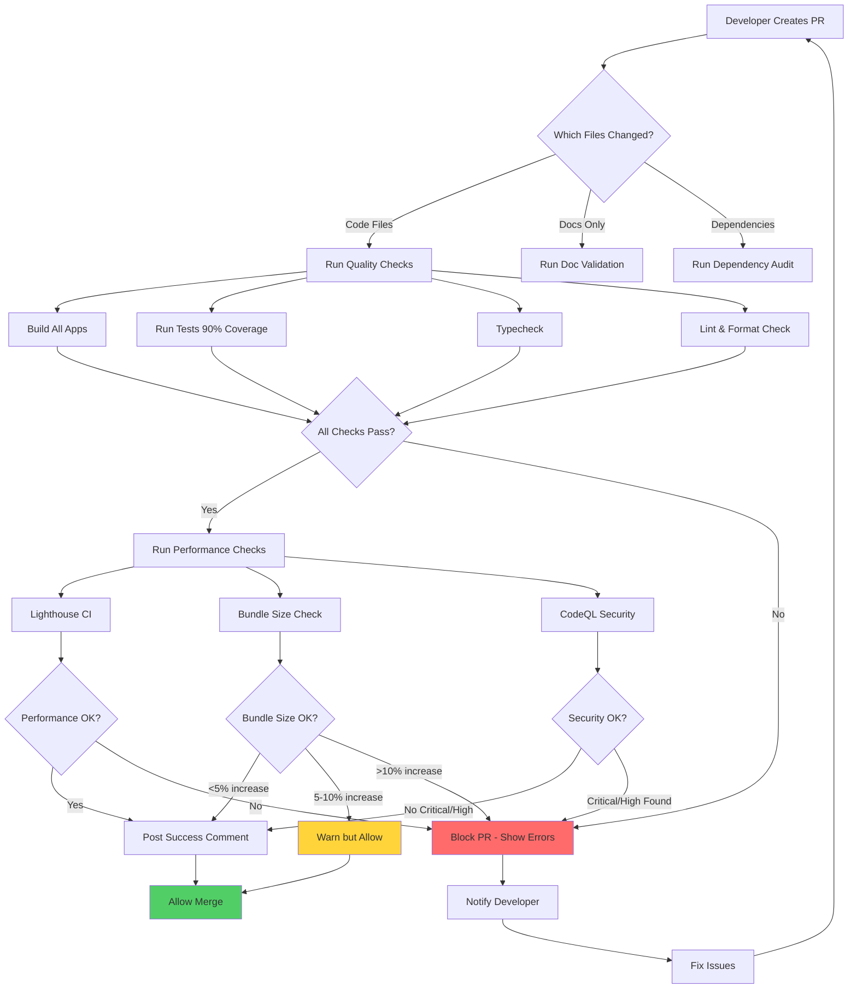

# Product Design Requirements (PDR)

## GitHub Actions CI/CD Automation

**Date**: 2025-11-01
**Status**: Draft
**Priority**: P1 (High)
**Owner**: Tech Lead / DevOps
**Feature Type**: Enhancement

---

## 1. Overview

### 1.1 Problem Statement

Currently, the Hospeda project lacks automated CI/CD pipelines, which creates several challenges:

- **Manual Quality Checks**: Developers must manually run tests, linters, and build processes locally before pushing code
- **Inconsistent Deployments**: No automated deployment process leads to human errors and deployment inconsistencies
- **No Performance Monitoring**: Bundle size and performance regressions can slip through unnoticed
- **Security Vulnerabilities**: Dependencies with known security issues may not be discovered until production
- **No Automated Dependency Updates**: Manual dependency updates are time-consuming and often neglected
- **Mixed Workflow State**: While PR workflow guides exist, codebase still contains assumptions about direct commits to main

**Context:**

- **Business Context**: As the project grows, manual processes don't scale and increase risk of production bugs
- **Technical Context**: We need to fully migrate from "commit-to-main" to "PR-based workflow" BEFORE enabling automated CI/CD
- **User Context**: Developers need fast feedback on code quality, security, and performance without manual intervention
- **Migration Context**: 62+ files require updates to align with PR-based workflow (agents, commands, skills, docs)

### 1.2 Goals & Success Metrics

**Primary Goal:**
Implement comprehensive GitHub Actions CI/CD pipelines that automatically validate code quality, security, performance, and manage dependencies for every Pull Request.

**Success Metrics:**

- **Metric 1**: CI/CD Pipeline Coverage - Target: 100% of PRs
  - How measured: GitHub Actions run logs, all PRs must pass checks before merge
- **Metric 2**: Build/Test Time - Target: < 5 minutes for typical PR
  - How measured: GitHub Actions execution time metrics
- **Metric 3**: Security Issue Detection - Target: Block 100% of Critical/High severity issues
  - How measured: CodeQL alerts prevented from merging
- **Metric 4**: Performance Regression Prevention - Target: Block 100% of bundles >10% size increase
  - How measured: Bundle size check failures
- **Metric 5**: Dependency Update Rate - Target: 80% of patch/minor updates auto-merged within 1 week
  - How measured: Renovate merge statistics

### 1.3 Non-Goals

What we explicitly won't do in this iteration:

- Automated deployment to production (will be manual approval gate)
- E2E tests in CI (requires staging environment setup - future work)
- Visual regression testing (requires Percy/Chromatic setup - future work)
- Mobile app CI/CD (no mobile apps yet)
- Database migration automation in CI (too risky - manual process)
- Load testing automation (requires separate infrastructure)

---

## 2. User Stories

### US-001: PR Quality Gate

**As a** developer
**I want to** have automated quality checks run on every Pull Request
**So that** I can ensure my code meets project standards before merging

**Priority**: P0

**Acceptance Criteria**:

- [ ] **AC-001**: Automated checks run on PR creation and updates
  - Given: I create or update a Pull Request
  - When: I push commits to the PR branch
  - Then: GitHub Actions automatically runs all quality checks (build, test, lint, typecheck)

- [ ] **AC-002**: PR cannot be merged if checks fail
  - Given: One or more quality checks fail
  - When: I attempt to merge the PR
  - Then: GitHub prevents the merge with a clear error message indicating which checks failed

- [ ] **AC-003**: Clear status indicators on PR
  - Given: Quality checks are running or completed
  - When: I view the Pull Request
  - Then: I see status badges showing pass/fail/in-progress for each check

- [ ] **AC-004**: Fast feedback loop
  - Given: I push code to a PR
  - When: Quality checks run
  - Then: I receive results within 5 minutes for typical changes

**Edge Cases:**

- Draft PRs should run checks but allow merge bypass
- Dependabot PRs should have auto-merge for minor/patch updates
- Hotfix branches may need emergency bypass (requires admin approval)

---

### US-002: Performance Budget Guardian

**As a** tech lead
**I want to** prevent bundle size regressions through automated checks
**So that** the web/admin apps remain performant and fast-loading

**Priority**: P0

**Acceptance Criteria**:

- [ ] **AC-001**: Bundle size tracked for every PR
  - Given: PR modifies code in apps/web or apps/admin
  - When: GitHub Actions builds the apps
  - Then: Bundle sizes are measured and compared to main branch baseline

- [ ] **AC-002**: PR comment shows bundle size comparison
  - Given: Bundle size check completes
  - When: Results are available
  - Then: A comment is posted on the PR showing before/after sizes with percentage change

- [ ] **AC-003**: Alert on moderate increase (5-10%)
  - Given: Bundle size increases by 5-10%
  - When: Check completes
  - Then: PR check shows warning status (doesn't block) with alert message

- [ ] **AC-004**: Block on significant increase (>10%)
  - Given: Bundle size increases by more than 10%
  - When: Check completes
  - Then: PR check fails, preventing merge, with explanation requiring manual review

- [ ] **AC-005**: Historical tracking
  - Given: Multiple PRs are merged over time
  - When: Reviewing bundle size history
  - Then: Trend data is available showing bundle size evolution

**Edge Cases:**

- Intentional bundle size increases (new major features) should be bypassable with justification
- Multiple bundle formats (JS, CSS) tracked separately
- Tree-shaking effects should be measured in production build, not dev

---

### US-003: Lighthouse Performance Audit

**As a** product owner
**I want to** ensure web performance standards are maintained through Lighthouse CI
**So that** users have a consistently fast and accessible experience

**Priority**: P1

**Acceptance Criteria**:

- [ ] **AC-001**: Lighthouse runs on key pages
  - Given: PR affects web app code
  - When: Lighthouse CI workflow runs
  - Then: Audits are performed on /, /alojamientos, /destinos pages

- [ ] **AC-002**: Strict performance thresholds enforced
  - Given: Lighthouse audit completes
  - When: Scores are evaluated
  - Then: PR fails if Performance < 90, Accessibility < 95, SEO < 90, Best Practices < 90

- [ ] **AC-003**: Budget limits checked
  - Given: Lighthouse audit measures web vitals
  - When: Results are compared to budgets
  - Then: PR fails if FCP >= 1.8s, LCP >= 2.5s, or TTI >= 3.8s

- [ ] **AC-004**: Lighthouse report available
  - Given: Audit completes
  - When: Developer views PR
  - Then: Link to detailed Lighthouse report is available in PR comments

**Edge Cases:**

- Network variability in CI may cause flaky results (allow 1 retry)
- Server-side rendering pages may need warm-up requests before audit
- Dynamic content (user-specific) should use consistent test data

---

### US-004: Security Vulnerability Scanner

**As a** security engineer
**I want to** automatically detect security vulnerabilities in code and dependencies
**So that** known security issues are caught before reaching production

**Priority**: P0

**Acceptance Criteria**:

- [ ] **AC-001**: CodeQL scans TypeScript/JavaScript code
  - Given: PR contains code changes
  - When: CodeQL workflow runs
  - Then: Code is scanned for security vulnerabilities using security-extended + security-and-quality query suites

- [ ] **AC-002**: Critical/High severity issues block merge
  - Given: CodeQL finds Critical or High severity vulnerability
  - When: Scan completes
  - Then: PR check fails and merge is blocked with detailed vulnerability report

- [ ] **AC-003**: Medium severity issues show warnings
  - Given: CodeQL finds Medium severity vulnerability
  - When: Scan completes
  - Then: PR check passes with warning annotation requiring manual review

- [ ] **AC-004**: Weekly full codebase scans
  - Given: Weekly scheduled scan is configured
  - When: Monday 10 AM UTC arrives
  - Then: Full CodeQL scan runs on main branch, creating GitHub Security alerts for any findings

**Edge Cases:**

- False positives should be suppressable with inline comments + justification
- Third-party code (node_modules) is scanned but not in detail (focus on our code)
- Security hotfixes may need emergency bypass (requires security team approval)

---

### US-005: Automated Dependency Updates

**As a** developer
**I want to** automatically receive and review dependency updates
**So that** the project stays up-to-date with security patches and new features without manual effort

**Priority**: P1

**Acceptance Criteria**:

- [ ] **AC-001**: Renovate creates PRs for dependency updates
  - Given: Dependencies have available updates
  - When: Renovate runs (weekly schedule)
  - Then: PRs are created grouped by ecosystem (React, TanStack, Drizzle, etc.)

- [ ] **AC-002**: Auto-merge for safe updates
  - Given: Update is patch version of devDependency OR security fix
  - When: All CI checks pass
  - Then: Renovate automatically merges the PR

- [ ] **AC-003**: Manual review for major updates
  - Given: Update is major version
  - When: Renovate creates PR
  - Then: PR requires manual review and approval before merge

- [ ] **AC-004**: Update PRs include changelogs
  - Given: Renovate creates update PR
  - When: Developer reviews PR
  - Then: PR description includes release notes, changelogs, and breaking changes

**Edge Cases:**

- Breaking changes in major updates need migration guide review
- Multiple related updates should be grouped (e.g., all @tanstack packages)
- Failed auto-merge should notify team in Slack/email

---

### US-006: Scheduled Health Checks

**As a** tech lead
**I want to** run automated health checks on a schedule
**So that** I'm proactively notified of issues before they impact users

**Priority**: P2

**Acceptance Criteria**:

- [ ] **AC-001**: Daily dependency health check
  - Given: Daily 8 AM UTC schedule
  - When: Workflow runs
  - Then: Check for outdated dependencies, security advisories, and create GitHub issue if critical issues found

- [ ] **AC-002**: Daily documentation validation
  - Given: Daily 9 AM UTC schedule
  - When: Workflow runs
  - Then: Validate markdown formatting, broken links, schema validation of PDR/tech-analysis files

- [ ] **AC-003**: Weekly database health check
  - Given: Weekly Monday 10 AM UTC schedule
  - When: Workflow runs
  - Then: Check for missing indexes, slow queries (from logs), schema drift

- [ ] **AC-004**: Weekly bundle analysis
  - Given: Weekly Friday 6 PM UTC schedule
  - When: Workflow runs
  - Then: Generate detailed bundle analysis report, post to Slack/GitHub Discussions

**Edge Cases:**

- Scheduled workflows should not block deployment if they fail (informational only)
- Failure notifications should go to #engineering channel, not individual devs
- Historical data should be stored for trend analysis

---

### US-007: Monorepo Migration to PR-Based Workflow

**As a** developer
**I want to** have the entire codebase, documentation, and tooling fully aligned with PR-based workflow
**So that** I can work confidently knowing all guardrails are in place and I won't accidentally commit to main

**Priority**: P0 (Blocker - must complete before enabling CI/CD)

**Acceptance Criteria**:

- [ ] **AC-001**: All agents updated to require PRs
  - Given: I invoke any agent for development work
  - When: Agent provides workflow instructions
  - Then: Agent instructs me to create feature branch worktree and submit PR
  - And: Agent never suggests direct commits to main

- [ ] **AC-002**: Git hooks prevent direct commits to main
  - Given: I am on main branch
  - When: I attempt to commit changes
  - Then: Pre-commit hook blocks the commit with clear error message
  - And: Hook suggests creating feature branch worktree instead

- [ ] **AC-003**: GitHub branch protection configured
  - Given: Main branch exists on GitHub
  - When: I view branch protection rules
  - Then: Main branch requires at least 1 PR review
  - And: Main branch requires all status checks to pass
  - And: Direct pushes to main are blocked (except for admins in emergencies)

- [ ] **AC-004**: All documentation reflects PR workflow
  - Given: I read any workflow documentation
  - When: I follow the documented process
  - Then: Documentation includes feature branch creation step
  - And: Documentation includes PR creation step
  - And: Documentation shows correct worktree usage

- [ ] **AC-005**: Scripts support worktree environments
  - Given: I run any project script from within a worktree
  - When: Script executes
  - Then: Script works correctly (uses git root detection)
  - And: Script doesn't assume single project instance

- [ ] **AC-006**: Hybrid worktree-PR strategy implemented
  - Given: I need to start work on a task
  - When: I choose workflow level (Quick Fix, Atomic Task, or Feature)
  - Then: Appropriate PR strategy is documented and scripted
  - And: Level 1 (Quick Fix) allows direct commits (< 30 min tasks)
  - And: Level 2 (Atomic Task) uses worktree + PR when ready
  - And: Level 3 (Feature) uses worktree + draft PR immediately

- [ ] **AC-007**: Migration complete across all files
  - Given: Migration analysis identified 62+ files requiring updates
  - When: I audit the codebase
  - Then: All P0 blocker files are updated (11 files)
  - And: All P1 high-priority files are updated (22 files)
  - And: Commands, agents, skills, workflows align with PR workflow

**Dependencies:**

- `migration-analysis.md` - Complete file inventory and priority matrix
- `worktree-pr-workflow-strategies.md` - Hybrid workflow strategy (Option E)
- `.claude/docs/guides/pr-workflow.md` - PR workflow guide (already exists)
- `.claude/docs/guides/git-worktrees.md` - Git worktrees guide (already exists)

**Estimated Effort:** 56 hours distributed over 4 weeks

- Week 1: P0 blockers (16 hours)
- Week 2: P1 high-priority (24 hours)
- Week 3-4: P2 medium-priority (13 hours)
- Ongoing: P3 low-priority (3 hours)

**Success Metrics:**

- **Metric 1**: Zero accidental commits to main - Target: 0 direct commits per month
  - How measured: GitHub commit history, pre-commit hook blocks
- **Metric 2**: PR workflow adoption - Target: 100% of changes through PRs
  - How measured: GitHub Insights, all commits come from merged PRs
- **Metric 3**: Worktree adoption rate - Target: >80% of developers use worktrees
  - How measured: Developer survey, worktree usage tracking
- **Metric 4**: Developer satisfaction - Target: >4.0/5.0
  - How measured: Post-migration survey
- **Metric 5**: Workflow confusion incidents - Target: <5 per month
  - How measured: Support tickets, Slack questions

**Edge Cases:**

- Emergency hotfixes may need bypass mechanism (admin override only)
- Existing work in main branch needs migration path
- Developers working across multiple devices need cross-device sync guidance
- Multiple simultaneous features require worktree management best practices

**Migration Phases:**

**Phase 0 - Preparation (Week 0):**

- Create migration branch
- Implement all P0 changes
- Test with migration PR
- Team notification and training

**Phase 1 - Soft Launch (Week 1):**

- Merge migration PR
- Branch protection NOT yet enforced
- Voluntary adoption period
- Monitor and support

**Phase 2 - Hard Launch (Week 2):**

- Enable pre-commit hook enforcement
- Enable GitHub branch protection
- Announce enforcement
- First-day intensive support

**Phase 3 - Stabilization (Weeks 2-4):**

- Implement P1 changes
- Collect and address feedback
- Optimize workflows
- Implement P2 changes

**Phase 4 - Completion (Week 4+):**

- Implement P3 changes
- Document learnings
- Final audit
- Migration closure

**Rollback Plan:**

If migration causes blocking issues:

1. Disable GitHub branch protection (GitHub Settings)
2. Revert pre-commit hook changes (`git revert <commit>`)
3. Push to main with `--no-verify` flag
4. Communicate rollback to team
5. Analyze failures and re-plan

**Files Requiring Updates (Summary):**

- **P0 Blockers (11 files)**: Husky hooks, CLAUDE.md, tech-lead agent, commit command, quality-check command, core workflows
- **P1 High (22 files)**: All engineering agents, planning commands, phase workflows, code standards, scripts
- **P2 Medium (18 files)**: Remaining agents/commands, skills, testing standards, package configs
- **P3 Low (11 files)**: Design agents, specialized skills, documentation patterns

See `migration-analysis.md` for complete file list and detailed priority matrix.

---

## 3. Design & Mockups

### 3.1 CI/CD Workflow Diagram



**Description:**

1. **Trigger**: Developer creates or updates a Pull Request
2. **Smart Detection**: Workflow determines which checks to run based on changed files
3. **Parallel Execution**: Quality checks run in parallel for speed
4. **Progressive Validation**: Basic checks must pass before expensive performance checks run
5. **Decision Points**: Each check has clear pass/fail/warn criteria
6. **Feedback Loop**: Failed checks block PR and show actionable error messages

### 3.2 Pull Request Checks UI

#### Desktop View - GitHub PR Checks Section

**Key Elements:**

- **Status Overview**: Shows "X checks passed, Y checks failed, Z checks pending"
- **Expandable Check Details**: Click to see logs for each workflow
- **Required vs Optional**: Clear visual distinction (required have 🔴 block icon)
- **Re-run Button**: Allow re-running failed checks without new commit

Example status:

```text
✅ Build - All Apps (2m 34s)
✅ Test - 90% Coverage Achieved (3m 12s)
✅ TypeCheck (1m 05s)
✅ Lint & Format (45s)
⚠️ Bundle Size - +7% increase (warning) (1m 22s)
✅ Lighthouse CI - All scores passed (2m 45s)
✅ CodeQL - No vulnerabilities found (4m 10s)

All checks have passed (1 warning)
```

#### PR Comment - Bundle Size Report

Example comment posted by bot:

```markdown
## 📦 Bundle Size Report

| App | Before | After | Diff | Status |
|-----|--------|-------|------|--------|
| 🌐 Web | 245 KB | 262 KB | **+17 KB (+6.9%)** | ⚠️ Warning |
| 🔧 Admin | 312 KB | 315 KB | +3 KB (+0.96%) | ✅ OK |

### 🌐 Web - Detailed Breakdown

| Chunk | Before | After | Diff |
|-------|--------|-------|------|
| main.js | 187 KB | 201 KB | +14 KB |
| vendor.js | 58 KB | 61 KB | +3 KB |

**⚠️ Warning**: Bundle size increased by 6.9%. This is within acceptable range (5-10%), but please review if this increase is intentional.

**Largest Contributors:**
- `date-fns` (+12 KB) - Consider using `date-fns/esm` for tree-shaking

[View Full Report](https://github.com/user/repo/actions/runs/12345)
```

#### PR Comment - Lighthouse Report

```markdown
## 🔍 Lighthouse CI Report

### / (Home Page)

| Category | Score | Status |
|----------|-------|--------|
| 🎯 Performance | 94 | ✅ |
| ♿ Accessibility | 98 | ✅ |
| 🎨 Best Practices | 92 | ✅ |
| 🔍 SEO | 95 | ✅ |

**Web Vitals:**
- FCP: 1.2s ✅ (budget: <1.8s)
- LCP: 2.1s ✅ (budget: <2.5s)
- TTI: 3.2s ✅ (budget: <3.8s)

### /alojamientos (Accommodations)

| Category | Score | Status |
|----------|-------|--------|
| 🎯 Performance | 91 | ✅ |
| ♿ Accessibility | 96 | ✅ |
| 🎨 Best Practices | 92 | ✅ |
| 🔍 SEO | 93 | ✅ |

**All pages passed thresholds!** 🎉

[View Detailed Reports](https://storage.googleapis.com/lighthouse-ci/...)
```

### 3.3 Scheduled Workflow - GitHub Issue Template

When scheduled health check detects issues:

```markdown
---
title: "[Health Check] Critical Dependency Vulnerabilities Detected"
labels: ["security", "dependencies", "automated"]
assignees: ["@tech-lead"]
---

## 🚨 Automated Health Check Alert

**Check Type**: Daily Dependency Health Check
**Severity**: Critical
**Detected**: 2025-11-01 08:00 UTC

### Critical Vulnerabilities Found

| Package | Current | Fixed In | Severity | CVE |
|---------|---------|----------|----------|-----|
| `axios` | 0.21.0 | 0.21.2 | High | CVE-2021-3749 |
| `lodash` | 4.17.19 | 4.17.21 | High | CVE-2021-23337 |

### Recommended Actions

1. Update `axios` to `>=0.21.2`
2. Update `lodash` to `>=4.17.21`
3. Run `pnpm audit fix`
4. Test affected functionality
5. Deploy security update ASAP

### Automated PR

Renovate will create a PR within 24 hours to update these dependencies.

---

**Generated by**: `.github/workflows/health-check-dependencies.yml`
**Next Check**: 2025-11-02 08:00 UTC
```

### 3.4 UI Components

| Component | Description | Behavior | States |
|-----------|-------------|----------|--------|
| PR Status Badge | Shows overall PR health | Updates in real-time | Pending, Passing, Failing, Warning |
| Check Details Expandable | Shows logs for each check | Click to expand/collapse | Collapsed, Expanded, Loading |
| Re-run Button | Re-trigger failed checks | Click to re-run workflow | Idle, Running, Disabled |
| Bot Comment | Automated feedback on PR | Posted/updated by GitHub Actions | Creating, Posted, Updated |
| Lighthouse Chart | Visual score comparison | Shows before/after scores | Loading, Success, Failed |

**Component Details:**

- **PR Status Badge**: Uses GitHub's native PR check UI, color-coded (green/yellow/red), shows count of passed/failed checks
- **Bot Comment**: Markdown-formatted, includes tables, links, and emojis for readability. Updates existing comment instead of creating new ones to reduce noise

---

## 4. Technical Constraints

### 4.1 Performance Requirements

**Workflow Execution Time:**

- Typical PR (code changes): < 5 minutes total
- Large refactoring PR: < 10 minutes total
- Scheduled workflows: < 15 minutes total

**Resource Usage:**

- GitHub Actions minutes: Stay within free tier limits (2000 min/month for private repos, unlimited for public)
- Workflow concurrency: Max 3 concurrent workflows per PR
- Artifact storage: < 2 GB per workflow run

**Caching Strategy:**

- Node modules cache: Restore within 30 seconds
- Build cache: Restore within 1 minute
- Cache hit rate: > 80% for typical PRs

### 4.2 Security Requirements

**Authentication:**

- Required: Yes
- Level: GitHub Actions OIDC token for authenticated API calls
- Provider: GitHub native authentication

**Authorization:**

- Who can trigger workflows: Repository collaborators with write access
- Who can bypass checks: Repository admins only (emergency situations)
- Who can view workflow logs: All repository collaborators

**Data Privacy:**

- PII involved: No (no user data in CI/CD)
- Data classification: Internal (source code, build artifacts)
- Encryption: At rest (GitHub's storage) and in transit (HTTPS)

**Secrets Management:**

- Store sensitive data in GitHub Secrets (never in code)
- Use environment-specific secrets (staging vs production)
- Rotate secrets quarterly
- Lighthouse CI token, Renovate token, etc. stored as secrets

**Rate Limiting:**

- GitHub API: Respect rate limits (5000 req/hour for authenticated)
- External APIs (Lighthouse CI): Stay within free tier limits

### 4.3 Accessibility Requirements

**WCAG Level**: Not directly applicable (CI/CD infrastructure)

**Required Support for Generated Reports:**

- [ ] Markdown reports use semantic structure (headings, lists, tables)
- [ ] Color alone is not used to convey status (use icons: ✅ ❌ ⚠️)
- [ ] Links have descriptive text (not "click here")
- [ ] Tables include proper headers for screen readers

### 4.4 Browser/Device Support

**Not applicable** - GitHub Actions runs server-side

**Lighthouse CI Browser Support:**

- Desktop browsers: Chrome (latest stable for Lighthouse audits)
- Mobile emulation: Chrome mobile emulation (Pixel 5)

---

## 5. Dependencies & Integrations

### 5.1 Internal Dependencies

| Package/Service | Version | Why Needed | Impact if Unavailable |
|----------------|---------|------------|----------------------|
| All workspace packages | workspace:* | Build & test entire monorepo | Complete CI/CD failure |
| `package.json` scripts | N/A | Execute build/test commands | Cannot run checks |
| TurboRepo | ^2.5.3 | Parallel task execution with caching | Slower builds |

### 5.2 External Dependencies

| Service/API | Version | Why Needed | Rate Limits | Fallback |
|-------------|---------|------------|-------------|----------|
| GitHub Actions | N/A | CI/CD platform | 2000 min/month (private) | None (critical) |
| Lighthouse CI | Latest | Performance audits | 100 runs/day (free tier) | Graceful degradation, skip on limit |
| CodeQL | Latest | Security scanning | GitHub rate limits | None (required for security) |
| Renovate Bot | Latest | Dependency updates | GitHub API limits | Manual dependency updates |
| size-limit | ^11.0.0 | Bundle size tracking | None | bundlewatch as alternative |
| bundlewatch | ^0.4.0 | Bundle size comparison | None | size-limit as primary |

### 5.3 New Dependencies

**GitHub Actions:**

- `actions/checkout@v4` - Checkout repository code
- `actions/setup-node@v4` - Setup Node.js environment
- `actions/cache@v4` - Cache dependencies and build outputs
- `actions/upload-artifact@v4` - Store build artifacts
- `pnpm/action-setup@v4` - Setup pnpm package manager
- `treosh/lighthouse-ci-action@v12` - Run Lighthouse CI
- `github/codeql-action@v3` - CodeQL security scanning

**NPM Packages:**

- `@lhci/cli@^0.14.0` - Lighthouse CI CLI
- `size-limit@^11.0.0` - Bundle size tracking
- `bundlewatch@^0.4.0` - Bundle size comparison with history

**Justification:**

- **GitHub Actions**: Industry standard, native GitHub integration, free for public repos
- **Lighthouse CI**: Official Google tool for performance audits, widely adopted
- **CodeQL**: GitHub's native security scanner, deeply integrated with GitHub Security
- **Renovate**: More powerful than Dependabot, better grouping, auto-merge capabilities
- **size-limit**: Zero-config bundle size tool with good defaults
- **bundlewatch**: Persistent storage for historical bundle size tracking

**Bundle Size Impact:**

- All tools run in CI/CD only, zero impact on production bundle

---

## 6. Risks & Mitigations

| Risk | Impact | Probability | Mitigation Strategy | Owner |
|------|--------|-------------|-------------------|-------|
| Flaky tests causing false failures | High | Medium | Implement test retries, improve test isolation, identify and fix flaky tests | QA Engineer |
| Lighthouse CI timeouts on slow pages | Medium | Medium | Increase timeout limits, warm-up server before audit, use production-like environment | Frontend Dev |
| GitHub Actions minutes exhausted | High | Low | Monitor usage, optimize workflows with caching, consider self-hosted runners if needed | DevOps |
| Renovate auto-merge breaking changes | High | Low | Extensive testing, auto-merge only patch/minor devDeps, require tests to pass | Tech Lead |
| CodeQL false positives blocking PRs | Medium | Medium | Review CodeQL rules, create suppression list with justifications | Security Engineer |
| Workflow configuration errors | High | Low | Test workflows in feature branches, peer review workflow changes, use reusable workflows | Tech Lead |

**Risk Details:**

### Risk 1: Flaky Tests Causing False Failures

- **Description**: Tests that randomly fail due to timing issues, external dependencies, or race conditions
- **Impact if occurs**: Developer frustration, wasted time re-running workflows, loss of trust in CI/CD
- **Mitigation**:
  1. Run tests 2-3 times locally before committing
  2. Use `vi.retryTimes(2)` for flaky tests as temporary measure
  3. Quarantine consistently flaky tests and fix them
  4. Use deterministic test data (no `Math.random()`, stable dates)
- **Monitoring**: Track test failure rates, identify patterns

### Risk 2: GitHub Actions Minutes Exhausted

- **Description**: Free tier limits could be exceeded with many PRs
- **Impact if occurs**: CI/CD stops working, PRs cannot be merged, development blocked
- **Mitigation**:
  1. Monitor usage in GitHub settings
  2. Implement aggressive caching (node_modules, build artifacts)
  3. Use matrix strategy only when necessary
  4. Consider self-hosted runners if project becomes very active
  5. Optimize workflows to skip unnecessary steps (e.g., skip Lighthouse if only backend changes)
- **Monitoring**: Weekly review of GitHub Actions usage

### Risk 3: Renovate Auto-Merge Breaking Changes

- **Description**: Auto-merged dependency update introduces breaking changes or bugs
- **Impact if occurs**: Build failures, test failures, production bugs
- **Mitigation**:
  1. Auto-merge ONLY: patch versions of devDependencies OR security fixes in any deps
  2. Require full test suite to pass before auto-merge
  3. Use Renovate's stabilityDays setting (wait N days before auto-merging)
  4. Group related packages (e.g., all @tanstack/* together)
  5. Have rollback plan (revert commit, pin previous version)
- **Monitoring**: Track auto-merged PRs, alert on post-merge failures

---

## 7. Out of Scope / Future Work

**Explicitly Out of Scope:**

- Automated deployment to production - Manual approval gate required for production deploys (safety)
- E2E tests in CI - Requires staging environment setup, database seeding, more complex infrastructure
- Visual regression testing - Requires Percy/Chromatic subscription, screenshot management
- Mobile app CI/CD - No mobile apps in current scope
- Database migration testing - Too risky to automate in CI, manual review required
- Load testing - Requires separate infrastructure, performance testing environment
- Canary deployments - Future optimization when traffic justifies it
- Multi-region deployment - Single region sufficient for MVP

**Future Enhancements:**

- **Q1 2026**: Add E2E tests with Playwright in CI once staging environment is stable
- **Q2 2026**: Implement visual regression testing if UI churn becomes problematic
- **Q3 2026**: Evaluate self-hosted runners if GitHub Actions minutes become constraint
- **Future**: Add deployment pipeline for production with manual approval gates

**Technical Debt Created:**

- Lighthouse CI uses emulation, not real devices - May not catch all mobile performance issues
- CodeQL rules may need tuning over time as false positives are discovered
- Bundle size thresholds (5%, 10%) are arbitrary - May need adjustment based on real-world data

---

## 8. Testing Strategy

### 8.1 Test Coverage Requirements

- Unit tests: 90%+ coverage (enforced in CI)
- Integration tests: Critical API endpoints
- E2E tests: Future work (out of scope for this iteration)

### 8.2 Test Scenarios

**Workflow Testing (Pre-Merge):**

- Test workflows in feature branch before merging to main
- Use `workflow_dispatch` trigger for manual testing
- Validate workflow with intentional failures to test error handling

**Unit Tests for Workflow Scripts:**

- If custom scripts are written for workflows (e.g., bundle comparison), unit test them

**Integration Tests:**

- Test interaction between workflows (e.g., bundle check depends on build success)
- Test webhook triggers (PR opened, PR updated, PR closed)

### 8.3 Performance Testing

**Workflow Performance:**

- Load test: Not applicable (GitHub manages infrastructure)
- Benchmark: Measure typical workflow execution time, optimize to < 5 minutes
- Caching effectiveness: Measure cache hit rate, aim for >80%

**Lighthouse Performance:**

- Run Lighthouse on production-like builds (SSR + static optimizations)
- Use consistent network throttling (Simulated Slow 4G)
- Use consistent device emulation (Pixel 5)

---

## 9. Documentation Requirements

**Documentation to Create/Update:**

- [ ] `.github/workflows/README.md` - Overview of all workflows, when they run, what they check
- [ ] `docs/development/ci-cd-guide.md` - Developer guide for understanding CI/CD checks, how to debug failures
- [ ] `docs/development/workflow-maintenance.md` - Guide for maintaining workflows, updating dependencies, troubleshooting
- [ ] `CONTRIBUTING.md` - Update with PR requirements (must pass CI checks)
- [ ] `.github/workflows/lighthouse-ci.yml` - Inline comments explaining configuration
- [ ] `.github/workflows/bundle-size.yml` - Inline comments explaining thresholds
- [ ] `.github/workflows/codeql.yml` - Inline comments explaining security rules
- [ ] `.github/workflows/renovate.json` - Inline comments explaining grouping rules

---

## 10. Deployment Plan

**Deployment Type**: Phased Rollout with Migration Prerequisites

**CRITICAL**: US-007 (Monorepo Migration to PR-Based Workflow) must be completed BEFORE starting Phase 1

**Rollout Plan:**

### Phase 0 - Migration Prerequisites (Weeks 1-4)

**Complete US-007: Monorepo Migration to PR-Based Workflow**

This is a BLOCKER. Cannot proceed to Phase 1 without completing migration.

**Week 1:**

- Update all P0 blocker files (11 files, 16 hours)
- Enable pre-commit hook to block main commits
- Configure GitHub branch protection
- Test with migration PR
- Team training session

**Week 2:**

- Update all P1 high-priority files (22 files, 24 hours)
- All agents, commands, workflows updated
- Monitor team adoption
- Intensive support for questions

**Week 3-4:**

- Update P2 medium-priority files (18 files, 13 hours)
- Polish documentation
- Optimize workflows based on feedback
- Complete P3 low-priority items as needed

**Validation Criteria Before Phase 1:**

- [ ] 100% of commits go through PRs (verified via GitHub Insights)
- [ ] Pre-commit hook prevents main commits (tested)
- [ ] Branch protection enabled and working
- [ ] All agents give correct PR workflow instructions
- [ ] Team comfortable with worktree workflow (survey >4/5)
- [ ] Zero workflow-blocking issues

### Phase 1 - Basic Quality Checks (Week 5)

**Prerequisites:** Phase 0 complete, all validation criteria met

- Create workflows for: build, test, typecheck, lint
- Enable as required checks on PRs
- Monitor for false failures
- Tune as needed

### Phase 2 - Performance & Security (Week 6)

- Add Lighthouse CI workflow
- Add CodeQL security scanning
- Add bundle size checking
- Enable as required checks
- Establish baseline thresholds

### Phase 3 - Automation (Week 7)

- Configure Renovate for dependency updates
- Enable auto-merge for safe updates
- Test auto-merge with a few patch updates
- Monitor for issues

### Phase 4 - Scheduled Jobs (Week 8)

- Add daily dependency health check
- Add daily docs validation
- Add weekly database health check
- Add weekly bundle analysis
- Set up notifications (Slack/email)

**Rollback Plan:**

- **Trigger**: >50% of PRs blocked by false failures OR workflow taking >10 minutes regularly
- **Steps**:
  1. Disable failing workflow as required check (make it optional)
  2. Debug issue in feature branch
  3. Fix and test thoroughly
  4. Re-enable as required check
- **Data**: Workflow logs, PR comments preserved even if workflow disabled

**Feature Flags:**

- No application-level feature flags needed (workflows can be enabled/disabled independently)

---

## 11. Related Documents

**Planning Documents:**

- [Technical Analysis](./tech-analysis.md) - Technical implementation details
- [TODOs & Progress](./TODOs.md) - Task breakdown and progress tracking
- [Migration Analysis](./migration-analysis.md) - Complete analysis of 62+ files requiring PR workflow updates
- [Worktree PR Workflow Strategies](./worktree-pr-workflow-strategies.md) - Hybrid workflow strategy (Option E)

**Internal Guides (Already Created):**

- [PR Workflow Guide](../../docs/guides/pr-workflow.md) - Complete guide to PR-based development
- [Git Worktrees Guide](../../docs/guides/git-worktrees.md) - Deep dive into Git worktrees usage

**External References:**

- [GitHub Actions Documentation](https://docs.github.com/en/actions)
- [Lighthouse CI Documentation](https://github.com/GoogleChrome/lighthouse-ci)
- [CodeQL Documentation](https://codeql.github.com/docs/)
- [Renovate Documentation](https://docs.renovatebot.com/)
- [Size Limit Documentation](https://github.com/ai/size-limit)
- [bundlewatch Documentation](https://bundlewatch.io/)
- [Git Worktrees Official Docs](https://git-scm.com/docs/git-worktree)
- [GitHub Branch Protection](https://docs.github.com/en/repositories/configuring-branches-and-merges-in-your-repository/managing-protected-branches/about-protected-branches)

---

## 12. Stakeholder Sign-Off

| Role | Name | Status | Date | Comments |
|------|------|--------|------|----------|
| Product Owner | TBD | Pending | YYYY-MM-DD | |
| Tech Lead | TBD | Pending | YYYY-MM-DD | |
| DevOps | TBD | Pending | YYYY-MM-DD | |
| Security | TBD | Pending | YYYY-MM-DD | |

---

## 13. Changelog

| Date | Author | Changes | Version |
|------|--------|---------|---------|
| 2025-11-01 | Claude (product-functional agent) | Initial draft | 0.1 |
| 2025-11-01 | Claude (product-functional agent) | Added US-007: Monorepo Migration to PR-Based Workflow as P0 blocker. Updated Overview section to mention migration context. Updated Deployment Plan to include Phase 0 (Migration Prerequisites) before CI/CD implementation. Added migration analysis documents to Related Documents. | 0.2 |

---

## 14. Questions & Answers

**Q1**: Should we run Lighthouse CI on every PR or only PRs that touch frontend code?
**A1**: TBD - Pending user decision. Options: (1) Every PR for consistency, (2) Only frontend PRs to save minutes

**Q2**: What should be the auto-merge policy for Renovate? How conservative should we be?
**A2**: TBD - Pending user decision. Proposal: Auto-merge only patch devDeps + security fixes, manual review for everything else

**Q3**: Should we implement deployment workflows in this iteration or separate future work?
**A3**: TBD - Pending user decision. Recommendation: Separate future work to keep scope manageable

**Q4**: Do we need Slack notifications for workflow failures or GitHub notifications sufficient?
**A4**: TBD - Pending user decision. GitHub native notifications may be enough initially

---

## Notes

**General Notes:**

- This PDR focuses on Pull Request automation and scheduled health checks
- Production deployment automation is intentionally out of scope (requires additional approval workflows)
- E2E tests are future work due to infrastructure requirements
- All workflows should be idempotent and safe to re-run

**Meeting Notes:**

- None yet

---

**Status**: This PDR is **Draft**
**Next Actions**: User review and approval
**Owner**: Tech Lead
