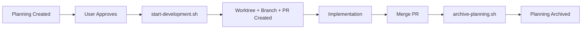

# Worktree + PR Workflow: Final Decision

**Project:** Hospeda
**Session:** P-006-github-actions-ci-cd
**Decision Date:** 2025-11-01
**Status:** ✅ Final

---

## Decision History

### Initial Analysis (2025-11-01)

- Analyzed 5 workflow options (A-E)
- Recommended Option E (Hybrid Approach) with level-specific strategies
- Level 1: No PR, Level 2: PR when ready, Level 3: Draft PR early

### User Feedback & Revision (2025-11-01)

- **Contradiction identified**: Level 1 can't commit to main if commits are blocked
- **Simplification requested**: Remove complexity, single workflow for all levels
- **Automation requirement**: Command must integrate with planning approval workflow

### Final Decision

- ✅ **Unified Workflow**: ALL levels use worktree + draft PR immediately
- ✅ **No exceptions**: Even Level 1 (quick fixes) go through PR
- ✅ **Automated setup**: `start-development.sh <planning-code>` creates everything
- ✅ **Planning integration**: Plan → Approve → Auto-setup → Implement → Merge → Archive
- ✅ **GitHub Projects**: Only for Level 3 (reduces overhead)

---

## Key Takeaways

1. **Simplicity wins** - Single workflow eliminates confusion
2. **Consistency matters** - No exceptions means no temptation to bypass
3. **Automation is critical** - Setup time < 1 minute with automated command
4. **Planning integration** - Workflow aligns perfectly with existing planning process
5. **Cost consideration** - Yes, more CI runs, but consistency and quality > cost

---

## Implementation Checklist

### Automation Scripts

- [ ] Create `start-development.sh` script (US-008)
  - Extract metadata from PDR.md (title, workflow level)
  - Generate branch name from planning code + slug
  - Create worktree + branch
  - Push initial commit
  - Create draft PR with planning metadata
  - Create GitHub Project (Level 3 only)

- [ ] Create `archive-planning.sh` script (US-009)
  - Move planning to archive/<code>-completed-<date>
  - Update registry
  - Remind about worktree cleanup

### Documentation Updates

- [ ] Update all documentation to reflect unified workflow
  - Remove Level 1 exception
  - Update workflow guides
  - Update agent instructions

---

## Quick Reference

### "How do I start working on anything?"

```bash
# For ANY task (Level 1, 2, or 3)
./start-development.sh P-006

# That's it! Everything is auto-created.
```

### "What's different between workflow levels?"

- **Level 1-2**: Draft PR created, NO GitHub Project
- **Level 3**: Draft PR created, WITH GitHub Project
- **All levels**: Same workflow, same commands

### "Why did we reject the hybrid approach?"

1. Contradicts blocking commits to main (Level 1 exception impossible)
2. Two different workflows = cognitive overhead
3. Exception creates bypass temptation
4. Automation makes setup instant anyway

---

## Workflow Diagram



---

**Document Status:** ✅ Final Decision
**Reviewed By:** User + Tech Lead Agent
**Version:** 2.0

> **📚 Note:** For complete analysis of all 5 workflow options considered, see `migration-audit-full.md` in this directory.
