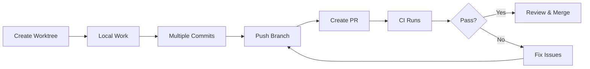
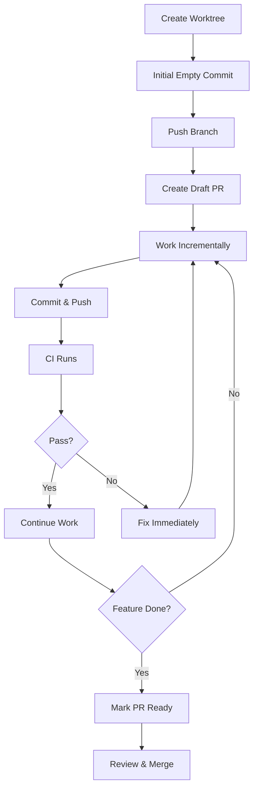
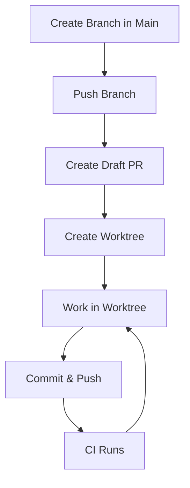
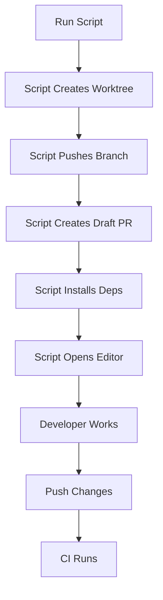
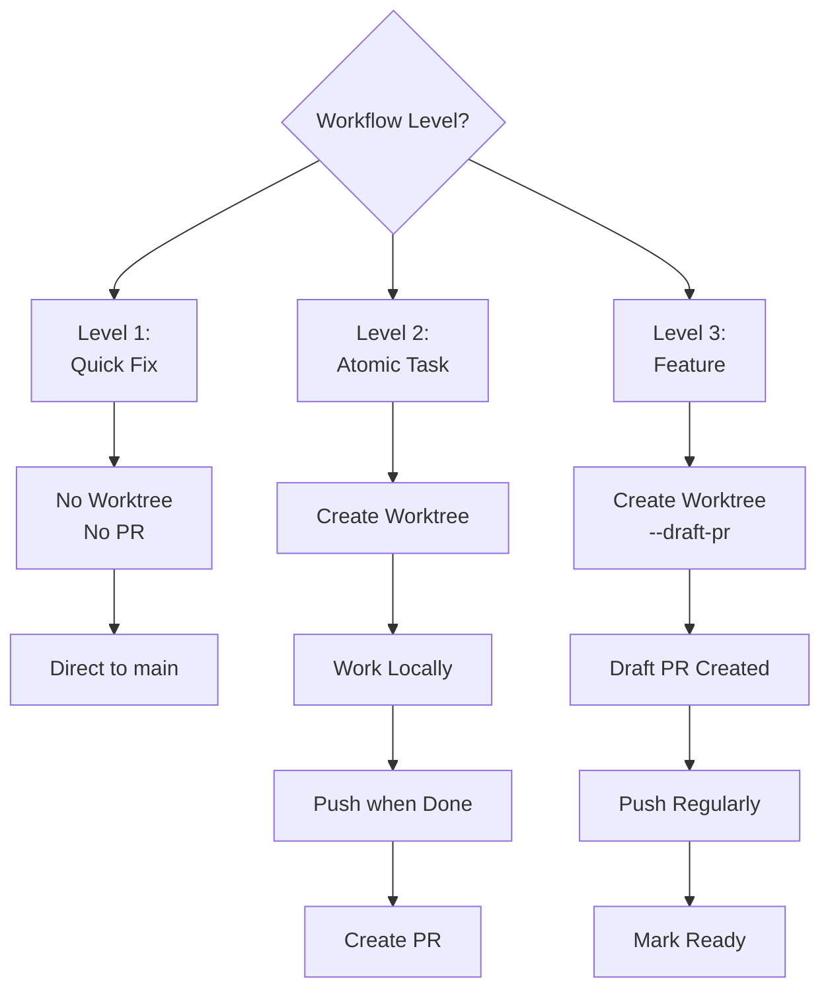
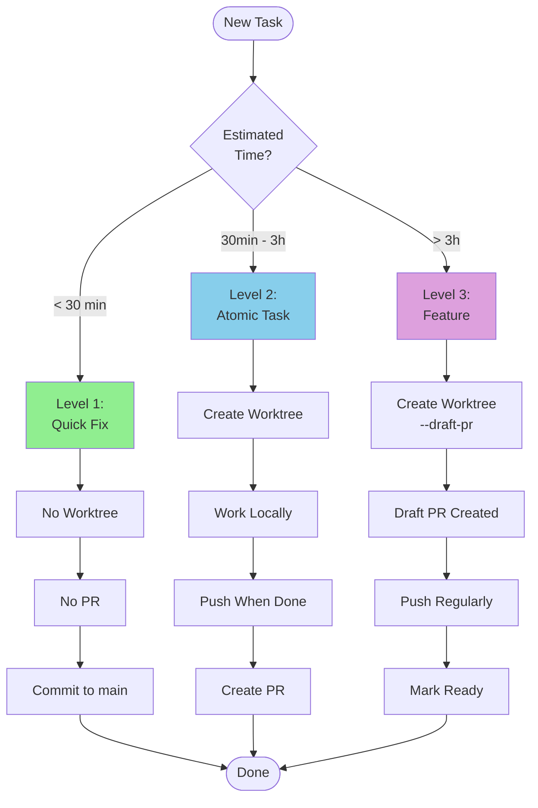

# Worktree + PR Workflow Strategies Analysis

**Project:** Hospeda
**Session:** P-006-github-actions-ci-cd
**Created:** 2025-11-01
**Status:** Analysis Complete

---

## Table of Contents

1. [Executive Summary](#executive-summary)
2. [Context & Constraints](#context--constraints)
3. [Workflow Options Analysis](#workflow-options-analysis)
4. [Comparison Matrices](#comparison-matrices)
5. [Recommendations](#recommendations)
6. [Implementation Guide](#implementation-guide)
7. [Special Considerations](#special-considerations)
8. [Appendices](#appendices)

---

## Executive Summary

### Problem Statement

The Hospeda project uses **Git Worktrees** for parallel development but requires all work to go through **Pull Requests**. We need to determine the optimal workflow that balances:

- Developer experience (minimal cognitive load)
- CI/CD efficiency (cost and feedback speed)
- Team collaboration (visibility and code review)
- Quality control (when checks run, early feedback)

### Key Finding

**There is no one-size-fits-all solution.** Different workflow levels require different strategies:

- **Level 1 (Quick Fix)**: Direct commit to main (no PR, no worktree)
- **Level 2 (Atomic Task)**: Worktree → Work → PR when ready
- **Level 3 (Feature Planning)**: Worktree + Draft PR early for visibility

### Primary Recommendation

**Option E: Hybrid Approach** with workflow-level specific strategies:

```bash
# Quick fixes (< 30 min) - NO PR
git checkout main
# Make change, commit, push directly

# Atomic tasks (30min - 3h) - PR when ready
./.claude/scripts/worktree-create.sh feature/task-name
# Work, commit, push, create PR when done

# Features (multi-day) - Draft PR early
./.claude/scripts/worktree-create.sh feature/big-feature --draft-pr
# Creates worktree + draft PR immediately
```

**Rationale:** Matches the cognitive model developers already use for workflow level selection.

---

## Context & Constraints

### Current State

**Repository:**

- GitHub: `https://github.com/qazuor/hospeda.git`
- Branch protection: All work must go through PRs
- No direct commits to `main`

**Tech Stack:**

- Monorepo: TurboRepo + pnpm workspaces
- Testing: Vitest (90% coverage minimum)
- CI: GitHub Actions (limited free minutes)
- Deployment: Vercel (frontend), Fly.io (backend)

**Existing Scripts:**

- `.claude/scripts/worktree-create.sh` - Creates worktree from branch
- `.claude/scripts/worktree-cleanup.sh` - Cleans up merged worktrees
- GitHub CLI (`gh`) available for PR operations

**Workflow Levels:**

- **Level 1**: Quick Fix (< 30 min, 1-2 files, very low risk)
- **Level 2**: Atomic Task (30min - 3h, 2-10 files, low-medium risk)
- **Level 3**: Feature Planning (multi-day, 10+ files, medium-high risk)

### Constraints

1. **All work must go through PRs** (branch protection)
2. **CI runs on every PR push** (costs GitHub Actions minutes)
3. **Team may work on multiple features simultaneously** (parallel worktrees)
4. **Cross-device workflow** (desktop → laptop, requires Git sync)
5. **TurboRepo caching** must work correctly across worktrees
6. **pnpm workspaces** must resolve dependencies correctly

### Success Metrics

- **Developer satisfaction**: How easy is it to use?
- **CI efficiency**: How many unnecessary CI runs?
- **Feedback speed**: How quickly do developers get feedback?
- **Team visibility**: Can others see work in progress?
- **Error prevention**: How hard is it to make mistakes?

---

## Workflow Options Analysis

### Option A: Sequential (Worktree → Work → PR)

#### Description

```bash
# 1. Create worktree
./.claude/scripts/worktree-create.sh feature/my-feature

# 2. Work on feature (multiple commits locally)
cd ../hospeda-feature-my-feature
git commit -m "feat: add model"
git commit -m "feat: add service"
git commit -m "feat: add API routes"

# 3. Push when ready
git push -u origin feature/my-feature

# 4. Create PR
gh pr create --title "feat: add accommodation search"
```

#### Workflow



#### Analysis

##### Developer Experience

**Pros:**

- ✅ Simple, linear flow
- ✅ No PR management overhead until done
- ✅ Local commits can be messy (no one sees them yet)
- ✅ Can squash/rebase locally before pushing

**Cons:**

- ❌ No CI feedback until PR created
- ❌ Late discovery of issues (after significant work done)
- ❌ Team has no visibility until PR
- ❌ Risk of accumulating technical debt

**Cognitive Load:** Low (familiar Git workflow)

##### CI/CD Integration

**Pros:**

- ✅ CI runs only once (when PR created)
- ✅ Minimal GitHub Actions minutes consumed
- ✅ No intermediate noise

**Cons:**

- ❌ Late feedback (potentially hours/days of work before first CI run)
- ❌ If CI fails, lots of code to debug
- ❌ No incremental validation

**Cost Efficiency:** Excellent (1 CI run per PR)
**Feedback Timing:** Poor (only at the end)

##### Collaboration

**Pros:**

- ✅ No WIP clutter in PR list

**Cons:**

- ❌ Zero visibility until PR created
- ❌ Cannot collaborate early
- ❌ No early code review
- ❌ Hard to spot architectural issues early

**Visibility:** Poor

##### Quality Control

**Pros:**

- ✅ Clean PR history (can clean up commits first)

**Cons:**

- ❌ Late quality checks
- ❌ Risk of large refactors needed
- ❌ No incremental validation

**Risk:** Medium (late validation)

##### Best For

- **Level 1 workflows** - Quick fixes where you're confident
- **Solo developers** working alone
- **Experimental work** that might be discarded

##### Worst For

- **Level 3 workflows** - Multi-day features (too much risk)
- **Team environments** - No collaboration support
- **Complex features** - Late feedback is costly

##### Scoring

| Dimension | Score | Weight | Weighted |
|-----------|-------|--------|----------|
| Developer Experience | 7/10 | 25% | 1.75 |
| CI Efficiency | 9/10 | 20% | 1.80 |
| Collaboration | 3/10 | 25% | 0.75 |
| Quality Control | 4/10 | 30% | 1.20 |
| **Total** | | | **5.50/10** |

---

### Option B: PR-First (Draft PR Early)

#### Description

```bash
# 1. Create worktree
./.claude/scripts/worktree-create.sh feature/my-feature

# 2. Initial commit + push
cd ../hospeda-feature-my-feature
git commit --allow-empty -m "feat: initial commit for my-feature"
git push -u origin feature/my-feature

# 3. Create DRAFT PR immediately
gh pr create --draft --title "WIP: my feature" --body "## Work in Progress

**Status:** 🚧 In Development

## Planned Changes
- [ ] Add model
- [ ] Add service
- [ ] Add API routes

## Progress
Will update as I go."

# 4. Work and push regularly
git commit -m "feat: add model"
git push  # CI runs

git commit -m "feat: add service"
git push  # CI runs

git commit -m "feat: add API routes"
git push  # CI runs

# 5. Mark as ready when done
gh pr ready
```

#### Workflow



#### Analysis

##### Developer Experience

**Pros:**

- ✅ Early CI feedback on every push
- ✅ Catch issues immediately
- ✅ Can see progress in PR
- ✅ Natural checkpoint system (every push)

**Cons:**

- ❌ Overhead of managing draft PR
- ❌ Need to create PR before starting work
- ❌ More context switching (push more frequently)
- ❌ Commit history visible from the start (can't be messy)

**Cognitive Load:** Medium (more steps upfront)

##### CI/CD Integration

**Pros:**

- ✅ Incremental validation (catch issues early)
- ✅ Smaller changesets per CI run (easier to debug)
- ✅ Can configure CI to skip drafts (save minutes)

**Cons:**

- ❌ Many CI runs (higher cost)
- ❌ Noise in CI logs
- ❌ Potentially redundant runs

**Cost Efficiency:** Poor (N CI runs per feature)
**Feedback Timing:** Excellent (immediate on every push)

##### Collaboration

**Pros:**

- ✅ Full visibility from day 1
- ✅ Team can comment early
- ✅ Easy to spot architectural issues early
- ✅ Can collaborate on same feature
- ✅ Shows progress (checklist in PR description)

**Cons:**

- ❌ Draft PR clutter in PR list
- ❌ Notifications on every push (noise)

**Visibility:** Excellent

##### Quality Control

**Pros:**

- ✅ Early and continuous validation
- ✅ Catch issues before they compound
- ✅ Incremental code review possible
- ✅ Lower risk of large refactors

**Cons:**

- ❌ Commit history must be clean from start
- ❌ Can't experiment freely (everything is visible)

**Risk:** Low (continuous validation)

##### Best For

- **Level 3 workflows** - Multi-day features
- **Team collaboration** - Multiple people on same feature
- **Complex features** - Need early feedback
- **Learning environments** - Mentoring junior developers

##### Worst For

- **Level 1 workflows** - Quick fixes (too much overhead)
- **Solo experimentation** - Too much visibility
- **Rapid prototyping** - Overhead slows iteration

##### Scoring

| Dimension | Score | Weight | Weighted |
|-----------|-------|--------|----------|
| Developer Experience | 6/10 | 25% | 1.50 |
| CI Efficiency | 4/10 | 20% | 0.80 |
| Collaboration | 9/10 | 25% | 2.25 |
| Quality Control | 9/10 | 30% | 2.70 |
| **Total** | | | **7.25/10** |

---

### Option C: Branch-First (Branch → PR → Worktree)

#### Description

```bash
# 1. Create branch from main worktree (no worktree yet)
cd ~/projects/WEBS/hospeda
git checkout -b feature/my-feature
git push -u origin feature/my-feature

# 2. Create draft PR
gh pr create --draft --title "WIP: my feature"

# 3. NOW create worktree from existing branch
git worktree add ../hospeda-feature-my-feature feature/my-feature

# 4. Work in worktree
cd ../hospeda-feature-my-feature
# ... develop, commit, push ...
```

#### Workflow



#### Analysis

##### Developer Experience

**Pros:**

- ✅ Separation of concerns (PR setup separate from work)
- ✅ PR metadata (title, description) set before work starts
- ✅ Can review PR setup in main worktree's IDE

**Cons:**

- ❌ Extra steps (create branch, push, create PR, then worktree)
- ❌ Context switching between main and worktree
- ❌ More complex mental model
- ❌ Easy to forget steps

**Cognitive Load:** High (non-intuitive flow)

##### CI/CD Integration

**Pros:**

- ✅ Same as Option B (incremental validation)

**Cons:**

- ❌ Same as Option B (many CI runs)
- ❌ Empty initial commit triggers CI for no reason

**Cost Efficiency:** Poor
**Feedback Timing:** Good

##### Collaboration

**Pros:**

- ✅ Same visibility as Option B

**Cons:**

- ❌ Harder to set up (teammates less likely to do it correctly)

**Visibility:** Excellent (but harder to achieve)

##### Quality Control

**Pros:**

- ✅ Same as Option B

**Cons:**

- ❌ Complexity increases chance of mistakes

**Risk:** Low (continuous validation)

##### Best For

- **Situations requiring PR metadata first** (rare)
- **Automated workflows** where PR created by bots

##### Worst For

- **Most workflows** - Too complex without clear benefit
- **Manual workflows** - Error-prone

##### Scoring

| Dimension | Score | Weight | Weighted |
|-----------|-------|--------|----------|
| Developer Experience | 4/10 | 25% | 1.00 |
| CI Efficiency | 4/10 | 20% | 0.80 |
| Collaboration | 8/10 | 25% | 2.00 |
| Quality Control | 8/10 | 30% | 2.40 |
| **Total** | | | **6.20/10** |

**Verdict:** Similar benefits to Option B but more complex. Not recommended.

---

### Option D: Fully Automated (Script-Driven)

#### Description

```bash
# Single command does everything
./.claude/scripts/worktree-pr-create.sh feature/my-feature "feat: my feature description"

# Script automatically:
# 1. Creates worktree
# 2. Creates initial empty commit
# 3. Pushes to remote
# 4. Creates draft PR with template
# 5. Opens worktree in VS Code
# 6. Displays next steps

# Developer then:
cd ../hospeda-feature-my-feature
# ... work normally ...
```

#### Implementation Example

```bash
#!/bin/bash
# .claude/scripts/worktree-pr-create.sh

set -e

BRANCH=$1
TITLE=$2
BASE_BRANCH=${3:-main}
WORKTREE_NAME="hospeda-${BRANCH//\//-}"
WORKTREE_PATH="../${WORKTREE_NAME}"

echo "🚀 Creating worktree + draft PR..."

# 1. Create worktree
git worktree add "$WORKTREE_PATH" -b "$BRANCH" "$BASE_BRANCH"
cd "$WORKTREE_PATH"

# 2. Initial commit
git commit --allow-empty -m "chore: initial commit for $BRANCH"

# 3. Push
git push -u origin "$BRANCH"

# 4. Create draft PR
gh pr create --draft --title "WIP: $TITLE" --body "## 🚧 Work in Progress

**Status:** In Development

## Planned Changes
- [ ] TODO: Add checklist

## Notes
Created automatically by worktree-pr-create.sh"

# 5. Install dependencies
pnpm install --frozen-lockfile

# 6. Open in editor (optional)
if command -v code &> /dev/null; then
    code .
fi

echo "✅ Done! Worktree + Draft PR created"
echo "📁 Path: $WORKTREE_PATH"
echo "🔗 PR: $(gh pr view --web)"
```

#### Workflow



#### Analysis

##### Developer Experience

**Pros:**

- ✅✅ Excellent DX (single command)
- ✅ Consistent setup every time
- ✅ No forgotten steps
- ✅ Can encode best practices
- ✅ Faster onboarding (new team members)

**Cons:**

- ❌ Less flexibility (script decides everything)
- ❌ Black box (developers don't learn underlying Git)
- ❌ Maintenance overhead (script needs updates)

**Cognitive Load:** Very Low (one command)

##### CI/CD Integration

**Pros:**

- ✅ Same as Option B (incremental validation)
- ✅ Can configure PR template automatically

**Cons:**

- ❌ Same as Option B (many CI runs)

**Cost Efficiency:** Poor
**Feedback Timing:** Excellent

##### Collaboration

**Pros:**

- ✅ Same as Option B (full visibility)
- ✅ Consistent PR format (template)

**Visibility:** Excellent

##### Quality Control

**Pros:**

- ✅ Same as Option B
- ✅ Can enforce conventions (PR naming, labels, etc.)

**Risk:** Low

##### Best For

- **Teams** - Consistency across developers
- **Frequent feature work** - Worth the automation
- **Standardization** - Enforce processes

##### Worst For

- **Learning Git** - Hides underlying mechanics
- **Edge cases** - Script might not handle all scenarios
- **Customization needs** - Less flexible

##### Scoring

| Dimension | Score | Weight | Weighted |
|-----------|-------|--------|----------|
| Developer Experience | 9/10 | 25% | 2.25 |
| CI Efficiency | 4/10 | 20% | 0.80 |
| Collaboration | 9/10 | 25% | 2.25 |
| Quality Control | 9/10 | 30% | 2.70 |
| **Total** | | | **8.00/10** |

**Note:** Score assumes well-maintained script. Drops significantly if script becomes stale.

---

### Option E: Hybrid Approach (Configurable)

#### Description

**Match workflow level to PR strategy:**

```bash
# Level 1: Quick Fix (< 30 min)
# NO worktree, NO PR - direct commit to main
cd ~/projects/WEBS/hospeda
git checkout main
# make change
git commit -m "docs: fix typo"
git push origin main

# Level 2: Atomic Task (30min - 3h)
# Worktree, PR when READY
./.claude/scripts/worktree-create.sh feature/task-name
cd ../hospeda-feature-task-name
# work, commit multiple times locally
git push -u origin feature/task-name  # when done
gh pr create --title "feat: task name"  # when done

# Level 3: Feature Planning (multi-day)
# Worktree, DRAFT PR immediately
./.claude/scripts/worktree-create.sh feature/big-feature --draft-pr
# Script creates worktree + draft PR
cd ../hospeda-feature-big-feature
# work, push regularly, CI runs each time
```

#### Implementation

**Enhanced Script:**

```bash
#!/bin/bash
# .claude/scripts/worktree-create.sh

set -e

BRANCH=$1
DRAFT_PR=false

# Check for --draft-pr flag
if [[ "$2" == "--draft-pr" ]] || [[ "$3" == "--draft-pr" ]]; then
    DRAFT_PR=true
    BASE_BRANCH=${2:-main}
    [[ "$2" == "--draft-pr" ]] && BASE_BRANCH=${3:-main}
else
    BASE_BRANCH=${2:-main}
fi

WORKTREE_NAME="hospeda-${BRANCH//\//-}"
WORKTREE_PATH="../${WORKTREE_NAME}"

echo "🌿 Creating worktree..."
git worktree add "$WORKTREE_PATH" -b "$BRANCH" "$BASE_BRANCH"
cd "$WORKTREE_PATH"

pnpm install --frozen-lockfile

if [ "$DRAFT_PR" = true ]; then
    echo "📝 Creating draft PR..."

    git commit --allow-empty -m "chore: initial commit for $BRANCH"
    git push -u origin "$BRANCH"

    gh pr create --draft --title "WIP: ${BRANCH#feature/}" --body "## 🚧 Work in Progress

**Workflow Level:** 3 (Feature Planning)
**Status:** In Development

## Checklist
- [ ] Update this checklist with planned tasks

## Notes
Auto-created with --draft-pr flag"

    echo "✅ Worktree + Draft PR created!"
    echo "🔗 PR: $(gh pr view --json url -q .url)"
else
    echo "✅ Worktree created!"
    echo "💡 Create PR when ready: gh pr create --title 'feat: description'"
fi

echo "📁 Path: $WORKTREE_PATH"
```

**Decision Tree:**



#### Workflow Examples

##### Level 1: Quick Fix

```bash
# Example: Fix typo in documentation
cd ~/projects/WEBS/hospeda
git checkout main
git pull origin main

# Edit file
echo "fix typo" >> README.md

# Commit directly
git add README.md
git commit -m "docs: fix typo in installation section"
git push origin main

# Done! No PR needed (< 30 min, very low risk)
```

##### Level 2: Atomic Task

```bash
# Example: Add search filter to accommodations list
./.claude/scripts/worktree-create.sh feature/add-search-filter

cd ../hospeda-feature-add-search-filter

# Work on feature (multiple commits)
git commit -m "feat: add search input component"
git commit -m "test: add search tests"
git commit -m "feat: integrate search in accommodation list"

# All done? Push and create PR
git push -u origin feature/add-search-filter
gh pr create --title "feat: add search filter to accommodations" --body "## Summary
- Add search input component
- Client-side filtering with debounce
- 92% test coverage

## Testing
- [x] Unit tests pass
- [x] Manual testing completed"

# PR created, CI runs once, ready for review
```

##### Level 3: Feature Planning

```bash
# Example: Multi-day booking system feature
./.claude/scripts/worktree-create.sh feature/booking-system --draft-pr

# Script output:
# ✅ Worktree created!
# 📝 Creating draft PR...
# ✅ Worktree + Draft PR created!
# 🔗 PR: https://github.com/qazuor/hospeda/pull/42

cd ../hospeda-feature-booking-system

# Day 1: Models
git commit -m "feat(db): add booking model"
git push  # CI runs, get early feedback

# Day 2: Services
git commit -m "feat(services): add booking service"
git push  # CI runs

# Day 3: API
git commit -m "feat(api): add booking endpoints"
git push  # CI runs

# Day 4: Frontend
git commit -m "feat(web): add booking UI"
git push  # CI runs

# All done? Mark PR as ready
gh pr ready
# Team reviews, merges
```

#### Analysis

##### Developer Experience

**Pros:**

- ✅✅✅ Matches existing mental model (workflow levels)
- ✅✅ Appropriate overhead for each level
- ✅ Flexibility (can choose)
- ✅ Simple for simple tasks, powerful for complex

**Cons:**

- ❌ Requires decision making (which level?)
- ❌ Two different patterns to learn

**Cognitive Load:** Low (aligns with existing workflow knowledge)

##### CI/CD Integration

**Pros:**

- ✅✅ Optimal CI usage per workflow level
- ✅ Level 1: No CI (no PR)
- ✅ Level 2: Minimal CI (1 run)
- ✅ Level 3: Continuous CI (many runs, but justified)

**Cons:**

- ❌ Inconsistent CI patterns (by design)

**Cost Efficiency:** Excellent (optimized per workflow)
**Feedback Timing:** Optimal (matched to needs)

##### Collaboration

**Pros:**

- ✅ Level 1: No noise (no PR for trivial changes)
- ✅ Level 2: Visibility when needed
- ✅ Level 3: Full visibility throughout

**Cons:**

- ❌ Team needs to understand the system

**Visibility:** Adaptive (appropriate per level)

##### Quality Control

**Pros:**

- ✅✅ Risk-appropriate validation
- ✅ Level 1: Low risk, minimal checks
- ✅ Level 2: Medium risk, one validation pass
- ✅ Level 3: High risk, continuous validation

**Cons:**

- None significant

**Risk:** Low (matched to workflow)

##### Best For

- **All workflows** - Adapts to each level
- **Teams familiar with workflow levels**
- **Projects with mixed task types**

##### Worst For

- **New team members** - Need to learn workflow levels first
- **Projects with only one task type**

##### Scoring

| Dimension | Score | Weight | Weighted |
|-----------|-------|--------|----------|----------|
| Developer Experience | 10/10 | 25% | 2.50 |
| CI Efficiency | 9/10 | 20% | 1.80 |
| Collaboration | 9/10 | 25% | 2.25 |
| Quality Control | 10/10 | 30% | 3.00 |
| **Total** | | | **9.55/10** |

**Verdict:** Best overall solution. Aligns perfectly with existing workflow system.

---

## Comparison Matrices

### Overall Comparison

| Option | DX | CI Efficiency | Collaboration | Quality | Total | Rank |
|--------|-----|---------------|---------------|---------|-------|------|
| **A: Sequential** | 7/10 | 9/10 | 3/10 | 4/10 | 5.50 | 5th |
| **B: PR-First** | 6/10 | 4/10 | 9/10 | 9/10 | 7.25 | 3rd |
| **C: Branch-First** | 4/10 | 4/10 | 8/10 | 8/10 | 6.20 | 4th |
| **D: Automated** | 9/10 | 4/10 | 9/10 | 9/10 | 8.00 | 2nd |
| **E: Hybrid** | 10/10 | 9/10 | 9/10 | 10/10 | 9.55 | 🥇 1st |

### By Workflow Level

#### Level 1: Quick Fix (< 30 min)

| Option | Suitability | Recommendation |
|--------|-------------|----------------|
| A: Sequential | ✅ Good | Alternative if no main access |
| B: PR-First | ❌ Too much overhead | Not recommended |
| C: Branch-First | ❌ Way too complex | Not recommended |
| D: Automated | ⚠️ Overkill but works | Use if standardization needed |
| E: Hybrid | ✅✅ Perfect (no PR at all) | **RECOMMENDED** |

**Best:** Option E (direct commit, no PR)

#### Level 2: Atomic Task (30min - 3h)

| Option | Suitability | Recommendation |
|--------|-------------|----------------|
| A: Sequential | ✅✅ Good fit | **RECOMMENDED** (simple) |
| B: PR-First | ⚠️ Overhead might not be worth it | Use for complex tasks |
| C: Branch-First | ❌ Unnecessary complexity | Not recommended |
| D: Automated | ✅ Good if team uses it | Alternative |
| E: Hybrid | ✅✅ Perfect (PR when ready) | **RECOMMENDED** |

**Best:** Option E or A (similar workflow, E adds flag support)

#### Level 3: Feature Planning (multi-day)

| Option | Suitability | Recommendation |
|--------|-------------|----------------|
| A: Sequential | ❌ Too risky (late feedback) | Not recommended |
| B: PR-First | ✅✅ Designed for this | **RECOMMENDED** |
| C: Branch-First | ⚠️ Same as B but complex | Use B instead |
| D: Automated | ✅✅ Excellent | **RECOMMENDED** |
| E: Hybrid | ✅✅ Perfect (--draft-pr flag) | **RECOMMENDED** |

**Best:** Option E, D, or B (E combines benefits of all)

### By Team Size

#### Solo Developer

- **Best:** Option A or E
- **Rationale:** Minimal overhead, E adds flexibility
- **CI Cost:** Not a concern (few PRs)

#### Small Team (2-5 developers)

- **Best:** Option E
- **Rationale:** Balance of flexibility and collaboration
- **CI Cost:** Moderate concern (use hybrid strategy)

#### Large Team (5+ developers)

- **Best:** Option D or E
- **Rationale:** Standardization matters, E allows customization
- **CI Cost:** Significant concern (optimize with hybrid)

### CI Minutes Analysis

**Assumptions:**

- 1 feature = 10 commits
- CI run = 5 minutes
- Cost = $0.008/minute (GitHub Actions)

| Option | Commits Before PR | Commits After PR | Total CI Runs | Minutes | Cost |
|--------|-------------------|------------------|---------------|---------|------|
| A: Sequential | 10 | 2 (fixes) | 3 | 15 min | $0.12 |
| B: PR-First | 0 | 12 | 12 | 60 min | $0.48 |
| C: Branch-First | 0 | 12 | 12 | 60 min | $0.48 |
| D: Automated | 0 | 12 | 12 | 60 min | $0.48 |
| E: Hybrid L2 | 10 | 2 | 3 | 15 min | $0.12 |
| E: Hybrid L3 | 0 | 12 | 12 | 60 min | $0.48 |

**Annual Cost Estimate (100 features/year):**

- **Option A:** $12/year (all features)
- **Option B-D:** $48/year (all features)
- **Option E:** $18-24/year (mixed: 70% L2, 30% L3)

**Verdict:** Option E saves ~50% CI costs vs always-draft-PR approach

---

## Recommendations

### Primary Recommendation: Option E (Hybrid Approach)

**Implement a workflow-level-aware Git + PR strategy:**

```
Level 1 (Quick Fix):
  → No worktree, no PR
  → Direct commit to main
  → For: typos, docs, configs

Level 2 (Atomic Task):
  → Worktree, PR when ready
  → Minimal CI runs
  → For: bugfixes, small features

Level 3 (Feature Planning):
  → Worktree + draft PR immediately
  → Continuous CI feedback
  → For: multi-day features
```

#### Why This Is Best

1. **Aligns with existing mental model** - Developers already choose workflow levels
2. **Optimal CI usage** - Pay for CI only when needed
3. **Risk-appropriate validation** - More validation for higher risk
4. **Flexibility** - Can adapt to task needs
5. **No wasted overhead** - Simple tasks stay simple

#### Implementation Priority

**Phase 1: Enhance Scripts (Week 1)**

1. Update `worktree-create.sh` with `--draft-pr` flag
2. Create `worktree-pr-create.sh` alias (convenience)
3. Add validation checks
4. Update documentation

**Phase 2: Documentation (Week 1)**

1. Update workflow level docs with PR strategies
2. Create decision flowchart
3. Add examples to each workflow doc
4. Update CLAUDE.md

**Phase 3: Team Training (Week 2)**

1. Demo to team
2. Practice with each workflow level
3. Gather feedback
4. Refine process

**Phase 4: Optimization (Week 3-4)**

1. Add shell aliases for common patterns
2. Optimize CI to skip drafts (optional)
3. Create PR templates
4. Add metrics tracking

### Alternative Recommendation: Option D (Automated)

**If team prefers maximum automation:**

Implement fully automated script that:

- Creates worktree
- Sets up draft PR
- Opens editor
- Installs dependencies

**Pros:** Zero thinking required
**Cons:** Less flexibility

**Use if:** Team values consistency > flexibility

### Not Recommended

**Option C (Branch-First):** Too complex, no clear benefit over B
**Option A alone:** Too risky for multi-day features
**Option B alone:** Too much overhead for simple tasks

---

## Implementation Guide

### Phase 1: Enhance worktree-create.sh

```bash
#!/bin/bash
# .claude/scripts/worktree-create.sh
# Enhanced version with PR support

set -e

# ============================================================================
# Configuration
# ============================================================================

SCRIPT_DIR="$(cd "$(dirname "${BASH_SOURCE[0]}")" && pwd)"
PROJECT_ROOT="$(cd "$SCRIPT_DIR/../.." && pwd)"

# ============================================================================
# Parse Arguments
# ============================================================================

show_usage() {
    cat << EOF
Usage: ./worktree-create.sh <branch-name> [options]

Creates a Git worktree with optional draft PR

Arguments:
    branch-name         Branch name (e.g., feature/my-feature)

Options:
    --base BRANCH       Base branch (default: main)
    --draft-pr          Create draft PR immediately (Level 3)
    --help, -h          Show this help message

Examples:
    # Level 2: Atomic Task (no PR yet)
    ./worktree-create.sh feature/add-search

    # Level 3: Feature Planning (draft PR immediately)
    ./worktree-create.sh feature/booking-system --draft-pr

    # Custom base branch
    ./worktree-create.sh hotfix/critical-bug --base production

Workflow Levels:
    Level 1 (Quick Fix)     → No worktree needed, commit directly
    Level 2 (Atomic Task)   → Worktree, create PR when done
    Level 3 (Feature)       → Worktree + draft PR immediately

See: .claude/docs/workflows/decision-tree.md
EOF
}

# Parse arguments
BRANCH=""
BASE_BRANCH="main"
DRAFT_PR=false

while [[ $# -gt 0 ]]; do
    case $1 in
        --base)
            BASE_BRANCH="$2"
            shift 2
            ;;
        --draft-pr)
            DRAFT_PR=true
            shift
            ;;
        -h|--help)
            show_usage
            exit 0
            ;;
        -*)
            echo "Error: Unknown option: $1"
            show_usage
            exit 1
            ;;
        *)
            if [ -z "$BRANCH" ]; then
                BRANCH="$1"
            else
                echo "Error: Unexpected argument: $1"
                show_usage
                exit 1
            fi
            shift
            ;;
    esac
done

# Validate branch name
if [ -z "$BRANCH" ]; then
    echo "Error: Branch name required"
    show_usage
    exit 1
fi

# ============================================================================
# Setup
# ============================================================================

WORKTREE_NAME="hospeda-${BRANCH//\//-}"
WORKTREE_PATH="$PROJECT_ROOT/../$WORKTREE_NAME"

echo "━━━━━━━━━━━━━━━━━━━━━━━━━━━━━━━━━━━━━━━━"
echo "🌿 Creating Worktree"
if [ "$DRAFT_PR" = true ]; then
    echo "📝 With Draft PR (Level 3 - Feature)"
else
    echo "📦 Without PR (Level 2 - Atomic Task)"
fi
echo "━━━━━━━━━━━━━━━━━━━━━━━━━━━━━━━━━━━━━━━━"
echo "Branch:      $BRANCH"
echo "Base:        $BASE_BRANCH"
echo "Path:        $WORKTREE_PATH"
echo "━━━━━━━━━━━━━━━━━━━━━━━━━━━━━━━━━━━━━━━━"
echo ""

# ============================================================================
# Validation
# ============================================================================

# Check if base branch exists
if ! git rev-parse --verify "$BASE_BRANCH" >/dev/null 2>&1; then
    echo "❌ Base branch '$BASE_BRANCH' not found"
    exit 1
fi

# Check if branch already exists
if git rev-parse --verify "$BRANCH" >/dev/null 2>&1; then
    echo "❌ Branch '$BRANCH' already exists"
    echo "💡 Use existing branch: git worktree add $WORKTREE_PATH $BRANCH"
    exit 1
fi

# Check if gh CLI available (if draft PR requested)
if [ "$DRAFT_PR" = true ]; then
    if ! command -v gh &> /dev/null; then
        echo "❌ GitHub CLI (gh) not found"
        echo "💡 Install: https://cli.github.com/"
        exit 1
    fi

    # Check gh authentication
    if ! gh auth status &> /dev/null; then
        echo "❌ GitHub CLI not authenticated"
        echo "💡 Run: gh auth login"
        exit 1
    fi
fi

# ============================================================================
# Create Worktree
# ============================================================================

echo "📁 Creating worktree..."
cd "$PROJECT_ROOT"

if ! git worktree add "$WORKTREE_PATH" -b "$BRANCH" "$BASE_BRANCH"; then
    echo "❌ Failed to create worktree"
    exit 1
fi

cd "$WORKTREE_PATH"

# ============================================================================
# Install Dependencies
# ============================================================================

echo ""
echo "📦 Installing dependencies..."
if ! pnpm install --frozen-lockfile; then
    echo "⚠️  Dependency installation failed"
    echo "💡 Continue manually: cd $WORKTREE_PATH && pnpm install"
fi

# ============================================================================
# Create Draft PR (if requested)
# ============================================================================

if [ "$DRAFT_PR" = true ]; then
    echo ""
    echo "📝 Creating draft PR..."

    # Initial commit (empty)
    git commit --allow-empty -m "chore: initial commit for $BRANCH

This is an automated initial commit to enable draft PR creation.
Real work will be committed incrementally."

    # Push branch
    if ! git push -u origin "$BRANCH"; then
        echo "❌ Failed to push branch"
        exit 1
    fi

    # Extract feature name from branch
    FEATURE_NAME="${BRANCH#feature/}"
    FEATURE_NAME="${FEATURE_NAME#fix/}"
    FEATURE_NAME="${FEATURE_NAME#hotfix/}"

    # Create draft PR
    PR_BODY="## 🚧 Work in Progress

**Workflow Level:** 3 (Feature Planning)
**Status:** In Development
**Started:** $(date +%Y-%m-%d)

## Planned Changes

- [ ] TODO: Update this checklist with planned tasks from TODOs.md

## Implementation Progress

- [x] Initial setup
- [ ] Schema/Model layer
- [ ] Service layer
- [ ] API layer
- [ ] Frontend components
- [ ] Tests (90%+ coverage)
- [ ] Documentation

## Notes

Created automatically with \`worktree-create.sh --draft-pr\`

See: \`.claude/sessions/planning/[session-name]/\`"

    if gh pr create --draft --title "WIP: $FEATURE_NAME" --body "$PR_BODY"; then
        PR_URL=$(gh pr view --json url -q .url)
        echo "✅ Draft PR created!"
        echo "🔗 $PR_URL"
    else
        echo "⚠️  Failed to create draft PR"
        echo "💡 Create manually: gh pr create --draft"
    fi
fi

# ============================================================================
# Summary
# ============================================================================

echo ""
echo "━━━━━━━━━━━━━━━━━━━━━━━━━━━━━━━━━━━━━━━━"
echo "✅ Worktree created successfully!"
echo "━━━━━━━━━━━━━━━━━━━━━━━━━━━━━━━━━━━━━━━━"
echo "📁 Path:   $WORKTREE_PATH"
echo "🌿 Branch: $BRANCH"

if [ "$DRAFT_PR" = true ]; then
    echo "📝 Draft PR created (see URL above)"
fi

echo ""
echo "Next steps:"
echo "  cd $WORKTREE_PATH"
echo "  pnpm dev"
echo ""

if [ "$DRAFT_PR" = true ]; then
    echo "Development workflow (Level 3):"
    echo "  1. Work on feature"
    echo "  2. Commit regularly: git commit -m 'feat: ...'"
    echo "  3. Push for CI feedback: git push"
    echo "  4. When done: gh pr ready"
else
    echo "Development workflow (Level 2):"
    echo "  1. Work on feature"
    echo "  2. Commit regularly (stays local)"
    echo "  3. When done: git push -u origin $BRANCH"
    echo "  4. Create PR: gh pr create --title 'feat: description'"
fi

echo ""
echo "When finished:"
echo "  cd $PROJECT_ROOT"
echo "  .claude/scripts/worktree-cleanup.sh"
echo "━━━━━━━━━━━━━━━━━━━━━━━━━━━━━━━━━━━━━━━━"
```

### Phase 2: Update Documentation

**Update: `.claude/docs/workflows/decision-tree.md`**

Add PR strategy to each workflow level:

```markdown
## Level 2: Feature/Refactor

### Git Workflow

**Worktree + PR When Ready:**

1. Create worktree:
   ```bash
   ./.claude/scripts/worktree-create.sh feature/task-name
   ```

2. Work locally (commit multiple times)

3. Push when done:

   ```bash
   git push -u origin feature/task-name
   ```

4. Create PR:

   ```bash
   gh pr create --title "feat: task description"
   ```

**Rationale:** Atomic tasks are short-lived (< 3h). Creating PR at the end minimizes CI runs while providing validation before merge.

```

**Update: `.claude/docs/workflows/atomic-task-protocol.md`**

Add section after Step 11:

```markdown
## Step 12: Create Pull Request 🔄

**Objective**: Submit for code review and merge

**Actions:**

1. **Ensure all commits pushed:**

   ```bash
   git push -u origin PB-XXX-task-name
   ```

2. **Create PR:**

   ```bash
   gh pr create --title "fix(PB-XXX): task description" --body "## Summary

   Brief description of changes

   ## Changes
   - Change 1
   - Change 2

   ## Testing
   - [x] Unit tests pass
   - [x] Coverage >= 90%
   - [x] Manual testing complete

   ## Related
   Closes #issue-number"
   ```

3. **Wait for CI:**
   - GitHub Actions will run automatically
   - Fix any failures immediately

4. **Request review:**

   ```bash
   gh pr ready  # If draft
   ```

5. **Merge when approved:**

   ```bash
   gh pr merge --squash  # Or via GitHub UI
   ```

**Output:** PR merged, feature in main branch

```

**Update: `.claude/docs/workflows/phase-2-implementation.md`**

Add Git workflow section:

```markdown
## Git Workflow During Implementation

### For Level 3 Features (Multi-day)

If you used `worktree-create.sh --draft-pr`:

```bash
# Work locally
git commit -m "feat: add model"

# Push for CI feedback (recommended after each major change)
git push

# Continue working...
git commit -m "feat: add service"
git push

# Mark ready when done
gh pr ready
```

**Best Practice:** Push at least once per day for:

- CI feedback
- Team visibility
- Cross-device sync
- Progress tracking

### For Level 2 Tasks (Atomic)

If you used `worktree-create.sh` (no --draft-pr):

```bash
# Work locally (multiple commits)
git commit -m "feat: add model"
git commit -m "test: add model tests"
git commit -m "feat: add service"

# Push only when done
git push -u origin feature/task-name

# Create PR
gh pr create --title "feat: task description"
```

**Best Practice:** Keep work local until done (< 3h). Create PR once for review.

```

### Phase 3: Shell Aliases (Optional)

Add to developer's `~/.bashrc` or `~/.zshrc`:

```bash
# Hospeda Worktree Aliases

# Level 2: Atomic Task (no PR)
alias wt-atomic='~/projects/WEBS/hospeda/.claude/scripts/worktree-create.sh'

# Level 3: Feature (with draft PR)
alias wt-feature='~/projects/WEBS/hospeda/.claude/scripts/worktree-create.sh --draft-pr'

# Cleanup
alias wt-clean='cd ~/projects/WEBS/hospeda && ./.claude/scripts/worktree-cleanup.sh'

# Quick PR creation (from within worktree)
alias pr-create='gh pr create --title "feat: " --edit'
alias pr-ready='gh pr ready'
alias pr-view='gh pr view --web'
```

Usage:

```bash
# Atomic task
wt-atomic feature/add-search

# Feature
wt-feature feature/booking-system

# Create PR (when in worktree)
pr-create

# Mark ready
pr-ready
```

### Phase 4: CI Optimization (Optional)

**Optimize CI to skip draft PRs:**

`.github/workflows/ci.yml`:

```yaml
name: CI

on:
  pull_request:
    types: [opened, synchronize, reopened, ready_for_review]
  push:
    branches: [main]

jobs:
  skip-check:
    runs-on: ubuntu-latest
    outputs:
      should-skip: ${{ steps.skip.outputs.should-skip }}
    steps:
      - id: skip
        run: |
          if [[ "${{ github.event.pull_request.draft }}" == "true" ]]; then
            echo "Skipping CI for draft PR"
            echo "should-skip=true" >> $GITHUB_OUTPUT
          else
            echo "should-skip=false" >> $GITHUB_OUTPUT
          fi

  quality-check:
    needs: skip-check
    if: needs.skip-check.outputs.should-skip != 'true'
    runs-on: ubuntu-latest
    steps:
      # ... existing CI steps ...
```

**Tradeoff:**

- **Pros:** Saves CI minutes on draft PRs
- **Cons:** No CI feedback until marked ready

**Recommendation:** Don't use this. CI feedback is valuable even for drafts. The cost savings (~$20-40/year) are not worth the loss of continuous validation.

---

## Special Considerations

### TurboRepo Caching

**Q: Does worktree location affect TurboRepo cache?**

**A:** No, with proper configuration.

**Explanation:**

TurboRepo uses content-based caching (hash of inputs → outputs). Location doesn't matter.

**Verify:**

```bash
# In main worktree
cd ~/projects/WEBS/hospeda
pnpm build
# Cache created

# In feature worktree
cd ~/projects/WEBS/hospeda-feature-test
pnpm build
# Cache hit! (if code unchanged)
```

**Shared Cache:**

`.turbo/cache/` is in `.git/`, which is shared:

```
~/projects/WEBS/hospeda/           ← main worktree
  .git/                              ← real .git directory
    .turbo/cache/                    ← shared cache
~/projects/WEBS/hospeda-feature-X/ ← worktree
  .git                               ← file pointing to main .git
```

**Conclusion:** Worktrees share TurboRepo cache. No issues.

### pnpm Workspaces

**Q: Do pnpm workspaces resolve correctly in worktrees?**

**A:** Yes, with `pnpm install` after worktree creation.

**How it works:**

1. `pnpm-workspace.yaml` defines workspace structure
2. Each worktree gets its own `node_modules/`
3. Workspace links are relative (`packages/db` → `../../packages/db`)
4. Worktrees see same workspace structure

**Potential Issue:**

If you forget `pnpm install` in worktree:

```bash
# Worktree just created
cd ~/projects/WEBS/hospeda-feature-test

# Try to run without install
pnpm dev
# Error: Cannot find module '@repo/db'

# Fix: Install dependencies
pnpm install --frozen-lockfile
# Now works
```

**Solution:** Script already does this automatically.

**Conclusion:** No issues if dependencies installed.

### VS Code Multi-Root Workspaces

**Q: How to work with multiple worktrees in VS Code?**

**A:** Use multi-root workspaces.

**Setup:**

1. Create workspace file: `hospeda.code-workspace`

```json
{
  "folders": [
    {
      "name": "Main (hospeda)",
      "path": "~/projects/WEBS/hospeda"
    },
    {
      "name": "Feature: Booking",
      "path": "~/projects/WEBS/hospeda-feature-booking-system"
    },
    {
      "name": "Feature: Search",
      "path": "~/projects/WEBS/hospeda-feature-add-search"
    }
  ],
  "settings": {
    "files.exclude": {
      "**/node_modules": true,
      "**/.turbo": true
    },
    "search.exclude": {
      "**/node_modules": true,
      "**/.turbo": true,
      "**/dist": true
    }
  }
}
```

2. Open workspace: `code hospeda.code-workspace`

**Benefit:** See all worktrees in one window, switch with file explorer.

**Alternative:** Open each worktree in separate VS Code window.

**Recommendation:** For Level 3 features with multiple worktrees, use multi-root. For single worktree, open directly.

### Git Hooks

**Q: Do Git hooks work correctly in worktrees?**

**A:** Yes, hooks are shared.

**How:**

Hooks live in `.git/hooks/`, which is shared:

```
~/projects/WEBS/hospeda/.git/hooks/
  pre-commit              ← shared by all worktrees
  commit-msg
  pre-push
```

When you commit in any worktree, hooks run.

**Husky:**

Hospeda uses Husky. It stores hooks in `.husky/`:

```
~/projects/WEBS/hospeda/.husky/
  pre-commit
  commit-msg
```

These are committed to Git, so all worktrees see them.

**Verify:**

```bash
# In feature worktree
cd ~/projects/WEBS/hospeda-feature-test

# Hooks run on commit
git commit -m "test"
# → pre-commit hook runs lint
# → commit-msg hook validates message format
```

**Conclusion:** No issues. Hooks work identically in all worktrees.

### CI Efficiency Strategies

#### Strategy 1: Workflow-Aware CI (Recommended)

Match CI intensity to workflow level:

```yaml
# .github/workflows/ci.yml
name: CI

on:
  pull_request:
    types: [opened, synchronize, reopened, ready_for_review]

jobs:
  detect-workflow-level:
    runs-on: ubuntu-latest
    outputs:
      level: ${{ steps.detect.outputs.level }}
    steps:
      - id: detect
        run: |
          if [[ "${{ github.event.pull_request.draft }}" == "true" ]]; then
            echo "level=3" >> $GITHUB_OUTPUT
          else
            echo "level=2" >> $GITHUB_OUTPUT
          fi

  quick-checks:
    needs: detect-workflow-level
    runs-on: ubuntu-latest
    steps:
      - uses: actions/checkout@v4
      - name: Lint
        run: pnpm lint
      - name: TypeCheck
        run: pnpm typecheck

  full-tests:
    needs: detect-workflow-level
    if: needs.detect-workflow-level.outputs.level == '2'
    runs-on: ubuntu-latest
    steps:
      - uses: actions/checkout@v4
      - name: Test
        run: pnpm test:coverage

  incremental-tests:
    needs: detect-workflow-level
    if: needs.detect-workflow-level.outputs.level == '3'
    runs-on: ubuntu-latest
    steps:
      - uses: actions/checkout@v4
      - name: Test Changed
        run: pnpm test --changed
```

**Benefit:** Level 3 (draft) gets fast feedback, Level 2 gets full validation.

#### Strategy 2: Smart Caching

Maximize cache hits to reduce CI time:

```yaml
- name: Cache pnpm
  uses: actions/cache@v4
  with:
    path: |
      ~/.pnpm-store
      **/node_modules
    key: ${{ runner.os }}-pnpm-${{ hashFiles('**/pnpm-lock.yaml') }}

- name: Cache Turbo
  uses: actions/cache@v4
  with:
    path: |
      **/.turbo
    key: ${{ runner.os }}-turbo-${{ github.sha }}
    restore-keys: |
      ${{ runner.os }}-turbo-
```

**Benefit:** Faster CI runs (cache hits reduce install time by ~80%)

#### Strategy 3: Parallel Jobs

Run checks in parallel:

```yaml
jobs:
  lint:
    runs-on: ubuntu-latest
    steps: # ... lint only

  typecheck:
    runs-on: ubuntu-latest
    steps: # ... typecheck only

  test:
    runs-on: ubuntu-latest
    steps: # ... tests only
```

**Benefit:** 3x faster (jobs run simultaneously)

#### Strategy 4: Path-Based Triggering

Skip CI if only docs changed:

```yaml
on:
  pull_request:
    paths-ignore:
      - '**.md'
      - 'docs/**'
      - '.claude/**'
```

**Benefit:** Saves CI runs for doc-only changes

**Recommendation:** Combine all 4 strategies for optimal CI efficiency.

---

## Appendices

### Appendix A: Command Cheat Sheet

```bash
# ============================================================================
# Level 1: Quick Fix (< 30 min, no PR)
# ============================================================================

cd ~/projects/WEBS/hospeda
git checkout main
git pull
# ... make change ...
git add specific-file.ts
git commit -m "docs: fix typo"
git push origin main

# ============================================================================
# Level 2: Atomic Task (30min - 3h, PR when ready)
# ============================================================================

# 1. Create worktree
./.claude/scripts/worktree-create.sh feature/task-name

# 2. Work
cd ../hospeda-feature-task-name
git commit -m "feat: add model"
git commit -m "test: add tests"
git commit -m "feat: add service"

# 3. Push + PR when done
git push -u origin feature/task-name
gh pr create --title "feat: task description" --body "..."

# ============================================================================
# Level 3: Feature (multi-day, draft PR immediately)
# ============================================================================

# 1. Create worktree + draft PR
./.claude/scripts/worktree-create.sh feature/big-feature --draft-pr

# 2. Work incrementally
cd ../hospeda-feature-big-feature
git commit -m "feat: add model"
git push  # CI runs

git commit -m "feat: add service"
git push  # CI runs

# 3. Mark ready
gh pr ready

# ============================================================================
# Cleanup
# ============================================================================

# Return to main
cd ~/projects/WEBS/hospeda

# Cleanup merged worktrees
./.claude/scripts/worktree-cleanup.sh

# Manual cleanup (if needed)
git worktree remove ../hospeda-feature-task-name
git branch -d feature/task-name
```

### Appendix B: Troubleshooting

#### Issue 1: Worktree Already Exists

**Error:**

```
fatal: 'feature/task-name' already exists
```

**Solution:**

```bash
# Option A: Remove old worktree
git worktree remove ../hospeda-feature-task-name
git branch -d feature/task-name

# Option B: Use existing worktree
cd ../hospeda-feature-task-name
git pull origin feature/task-name
```

#### Issue 2: PR Creation Fails

**Error:**

```
gh: command not found
```

**Solution:**

```bash
# Install GitHub CLI
# macOS
brew install gh

# Linux
sudo apt install gh

# Authenticate
gh auth login
```

#### Issue 3: Dependencies Not Found

**Error:**

```
Cannot find module '@repo/db'
```

**Solution:**

```bash
# Reinstall dependencies in worktree
cd worktree-path
pnpm install --frozen-lockfile
```

#### Issue 4: CI Fails After Push

**Error:**

```
Tests failing in CI but pass locally
```

**Solution:**

```bash
# Ensure clean state
pnpm clean
pnpm install --frozen-lockfile
pnpm build
pnpm test

# If passes locally, check CI logs for differences
gh run view --log  # latest run
```

#### Issue 5: Cannot Switch to Main

**Error:**

```
error: Your local changes to the following files would be overwritten
```

**Solution:**

```bash
# You're in a worktree, don't switch in worktrees
# Use main worktree instead
cd ~/projects/WEBS/hospeda  # main worktree
git checkout main
```

### Appendix C: Metrics to Track

Track these metrics to evaluate strategy success:

#### Developer Productivity

- **Setup time**: Time from "start task" to "ready to code"
- **Feedback time**: Time from "push" to "CI result"
- **Merge time**: Time from "PR created" to "merged"
- **Context switches**: Number of switches between worktrees/branches

**Target:**

- Setup: < 5 minutes
- Feedback: < 10 minutes
- Merge: < 2 hours
- Context switches: < 3 per day

#### CI Efficiency

- **Total CI minutes/month**: Track GitHub Actions usage
- **CI cost/month**: Calculate cost ($0.008/minute)
- **Failed CI runs**: How often CI fails
- **CI runs per PR**: Average runs before merge

**Target:**

- Cost: < $20/month (2,500 minutes)
- Failed runs: < 10%
- Runs per PR: < 3

#### Quality

- **Bugs found in CI**: Issues caught before merge
- **Bugs found in review**: Issues caught by reviewers
- **Bugs found in prod**: Issues that escaped

**Target:**

- CI catches: > 60%
- Review catches: > 30%
- Prod bugs: < 10%

#### Collaboration

- **PR comments**: Number of comments per PR
- **Review time**: Time from "ready" to "first review"
- **Collaboration instances**: PRs with multiple contributors

**Target:**

- Review time: < 4 hours
- Collaboration: > 20% of PRs

### Appendix D: Decision Flowchart



### Appendix E: Script Installation

**Install scripts in team environment:**

```bash
# 1. Clone repository
git clone https://github.com/qazuor/hospeda.git
cd hospeda

# 2. Make scripts executable
chmod +x .claude/scripts/*.sh

# 3. Optional: Add to PATH
echo 'export PATH="$PATH:$HOME/projects/WEBS/hospeda/.claude/scripts"' >> ~/.bashrc
source ~/.bashrc

# 4. Optional: Create aliases
cat << 'EOF' >> ~/.bashrc
# Hospeda Worktree Aliases
alias wt-atomic='worktree-create.sh'
alias wt-feature='worktree-create.sh --draft-pr'
alias wt-clean='cd ~/projects/WEBS/hospeda && worktree-cleanup.sh'
EOF
source ~/.bashrc

# 5. Verify installation
worktree-create.sh --help
```

### Appendix F: Team Adoption Plan

**Week 1: Introduction**

- Demo workflow strategies
- Explain workflow levels
- Show script usage
- Practice with sandbox repository

**Week 2: Pilot**

- 2-3 team members use new workflow
- Collect feedback
- Identify issues
- Refine process

**Week 3: Rollout**

- Train entire team
- Update documentation
- Set up monitoring
- Establish support channel

**Week 4: Optimization**

- Review metrics
- Adjust based on feedback
- Document lessons learned
- Plan next improvements

**Success Criteria:**

- [ ] 100% team trained
- [ ] < 5 support requests/week
- [ ] Positive feedback from majority
- [ ] Metrics trending positive

---

## Summary

### Key Takeaways

1. **No universal solution** - Different workflows need different strategies
2. **Option E (Hybrid) is best** - Matches workflow levels perfectly
3. **CI optimization matters** - Can save 50% costs with smart strategy
4. **Tooling is critical** - Scripts and aliases reduce friction
5. **Team adoption is key** - Training and documentation ensure success

### Next Steps

1. ✅ Review this analysis with team
2. ✅ Choose strategy (recommend: Option E)
3. ✅ Implement enhanced scripts
4. ✅ Update documentation
5. ✅ Train team
6. ✅ Monitor metrics
7. ✅ Iterate based on feedback

### Quick Decision

**"Which option should I use?"**

→ **Option E (Hybrid Approach)**

**"I need just one command"**

→ **Level 2:** `./worktree-create.sh feature/task-name`
→ **Level 3:** `./worktree-create.sh feature/big-feature --draft-pr`

**"Show me the most important change"**

→ **Add `--draft-pr` flag to `worktree-create.sh`**

---

**Document Status:** ✅ Complete
**Reviewed By:** Tech Lead Agent
**Date:** 2025-11-01
**Version:** 1.0
