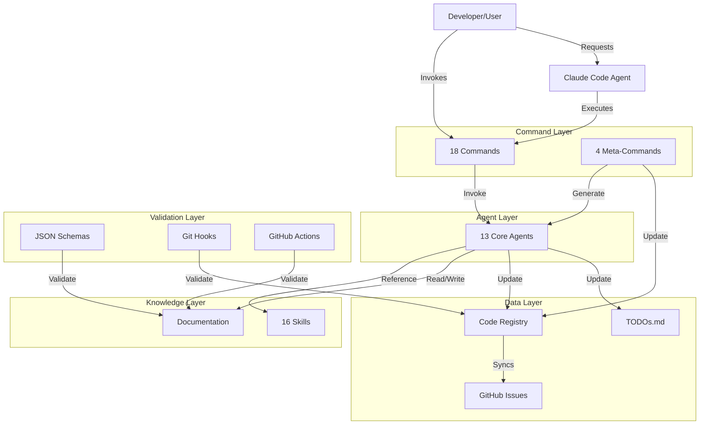
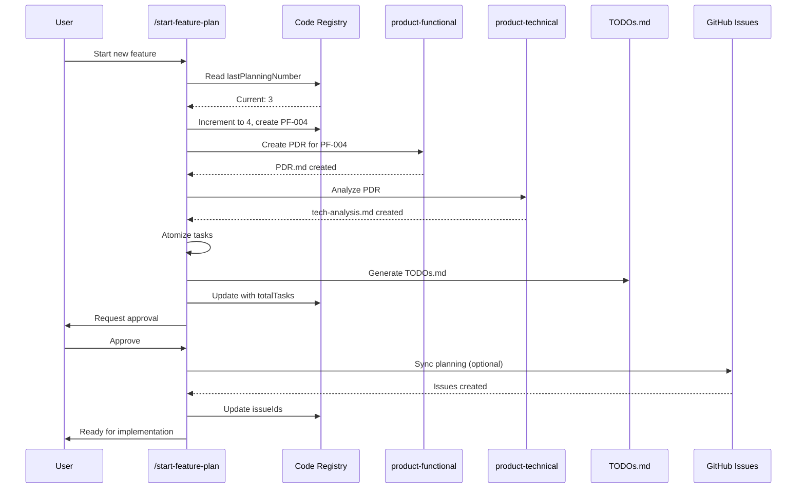
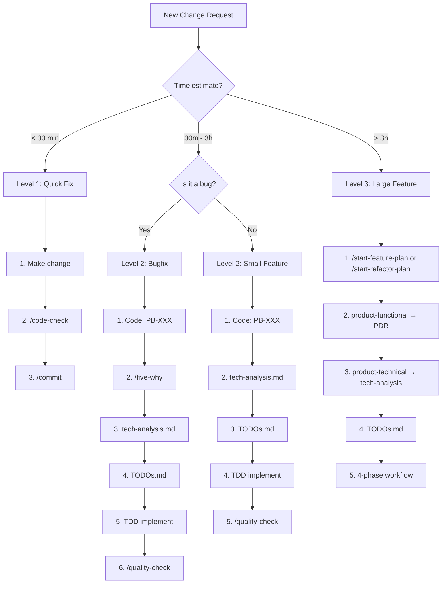

# Technical Analysis: Workflow Optimization System

**Date**: 2025-10-30
**Related PDR**: [PDR.md](./PDR.md)
**Status**: Draft
**Tech Lead**: product-technical agent

---

## 1. Executive Summary

**Feature Overview:**

This project optimizes the entire Claude Code development workflow system for the Hospeda project. It involves consolidating 25 agents to 13, reorganizing 15 commands to 18 (with meta-commands), expanding 5 skills to 16, restructuring CLAUDE.md from ~1000 to ~300-400 lines, implementing a code registry system for planning tracking, creating flexible workflows (3 levels), and adding automation/validation systems.

**Technical Approach:**

This is a documentation and process optimization project. The "architecture" is the meta-system that governs how we build Hospeda. The implementation involves:

1. **File reorganization**: Restructure markdown documentation with clear hierarchy
2. **Automation scripts**: Bash/Node scripts for validation and synchronization
3. **JSON schemas**: Validate all documentation templates
4. **Git hooks**: Ensure consistency on commits
5. **Meta-commands**: Self-extending system for creating agents/commands/skills
6. **Telemetry system**: Track usage of tools for continuous improvement

**Key Decisions:**

1. **Agents consolidation**: 25 → 13 core agents (52% reduction)
2. **Skills expansion**: 5 → 16 specialized skills (knowledge modules)
3. **Code registry**: `.code-registry.json` as computed (not source of truth)
4. **Task naming**: Simplified to `PF002-1`, `PF002-2.1` format
5. **All docs in English**: No ES→EN translation needed
6. **Offline-first**: GitHub sync optional, system works without it

**Estimated Complexity**: High

**Estimated Timeline**: 8-14 days

---

## 2. Architecture Overview

### 2.1 System Architecture

This is a **meta-system** - the infrastructure that governs development. The architecture is conceptual, not code-based.



**Description:**

- **User** interacts by invoking commands or requesting Claude to act
- **Commands** orchestrate workflows and invoke agents
- **Agents** do specialized work, use skills as reference, generate docs
- **Skills** are knowledge modules that agents consult
- **Registry** tracks all planning sessions and their state
- **Validation** ensures consistency across the system

### 2.2 Data Flow: Feature Planning Workflow



---

## 3. Technical Stack

### 3.1 Technologies Used

| Component | Technology | Version | Why Chosen |
|-----------|-----------|---------|------------|
| Documentation | Markdown | N/A | Standard, readable, versionable |
| Diagrams | Mermaid | N/A | Code-based diagrams in markdown |
| Validation | JSON Schema | Draft 07 | Standard validation for docs |
| Scripting | Bash + Node.js | N/A | Bash for hooks, Node for complex validation |
| CI/CD | GitHub Actions | N/A | Already used in project |
| Registry | JSON | N/A | Simple, readable, easily parseable |
| Hooks | Husky | ^9.0.0 | Standard git hooks solution |
| Telemetry | JSON | N/A | Local file, no external service |

### 3.2 New Dependencies

**Packages to Add:**

```json
{
  "devDependencies": {
    "husky": "^9.1.7",  // Already installed, verify version
    "ajv": "^8.12.0",
    "ajv-formats": "^2.1.1",
    "glob": "^10.3.0"
    // Note: markdownlint-cli2 already installed (used for linting)
    // Note: marked NOT needed (markdownlint-cli2 is sufficient)
  }
}
```

**Justification:**

- **husky**: Git hooks management (4KB gzipped) - Already installed at ^9.1.7 (latest version), no update needed
- **ajv**: JSON Schema validation (53KB gzipped) - Fastest JSON Schema validator
- **ajv-formats**: Additional format validators for ajv (2KB) - Supports date, email, etc.
- **glob**: File pattern matching (15KB) - For finding files in validation scripts
- **markdownlint-cli2**: Already installed - Used for markdown linting (rules validation)
  - No need for `marked` (markdown parser) - markdownlint-cli2 is sufficient for our needs

**Bundle Impact:**

- Current size: N/A (devDependencies only)
- After additions: ~74KB gzipped (reduced from 117KB, removed marked)
- These are dev dependencies, no runtime impact

**Note**: We use `markdownlint-cli2` for markdown validation (checking formatting rules), not `marked` (which is for parsing markdown to HTML)

---

## 4. File Structure Design

### 4.1 New Directory Structure

```
.claude/
├── agents/
│   ├── README.md (updated: 13 agents)
│   ├── product/
│   │   ├── product-functional.md
│   │   └── product-technical.md
│   ├── engineering/
│   │   ├── tech-lead.md (consolidated: includes architecture-validator, backend-reviewer, frontend-reviewer)
│   │   ├── hono-engineer.md
│   │   ├── db-drizzle-engineer.md
│   │   ├── astro-engineer.md
│   │   ├── react-senior-dev.md
│   │   └── tanstack-start-engineer.md
│   ├── quality/
│   │   ├── qa-engineer.md
│   │   └── debugger.md
│   ├── design/
│   │   └── ux-ui-designer.md
│   ├── specialized/
│   │   ├── i18n-specialist.md
│   │   └── tech-writer.md (consolidated: includes dependency-mapper, changelog-specialist)
│   └── [DELETED - not archived]
│       ├── architecture-validator.md → DELETED (merged into tech-lead)
│       ├── backend-reviewer.md → DELETED (merged into tech-lead)
│       ├── frontend-reviewer.md → DELETED (merged into tech-lead)
│       ├── dependency-mapper.md → DELETED (merged into tech-writer)
│       ├── changelog-specialist.md → DELETED (merged into tech-writer)
│       ├── prompt-engineer.md → DELETED (removed)
│       ├── security-engineer.md → DELETED (converted to command)
│       ├── performance-engineer.md → DELETED (converted to command)
│       ├── accessibility-engineer.md → DELETED (converted to command)
│       ├── deployment-engineer.md → DELETED (removed)
│       ├── cicd-engineer.md → DELETED (removed)
│       └── payments-specialist.md → DELETED (removed per user decision)
│
├── commands/
│   ├── README.md (updated: 18 commands)
│   ├── planning/
│   │   ├── start-feature-plan.md
│   │   └── start-refactor-plan.md
│   ├── quality/
│   │   ├── quality-check.md
│   │   ├── code-check.md
│   │   └── run-tests.md
│   ├── audit/
│   │   ├── security-audit.md (NEW)
│   │   ├── performance-audit.md (NEW)
│   │   └── accessibility-audit.md (NEW)
│   ├── development/
│   │   ├── add-new-entity.md
│   │   └── update-docs.md
│   ├── formatting/
│   │   └── format-markdown.md (renamed from format-md.md, moved from git/)
│   ├── git/
│   │   └── commit.md
│   ├── integration/
│   │   └── sync-planning.md
│   ├── analysis/
│   │   └── five-why.md
│   ├── meta/
│   │   ├── create-agent.md (NEW)
│   │   ├── create-command.md (NEW)
│   │   ├── create-skill.md (NEW)
│   │   └── help.md (NEW)
│   └── [DELETED - not archived]
│       ├── format-md.md → RENAMED to format-markdown.md and MOVED to formatting/
│       ├── review-code.md → DELETED (removed, redundant)
│       ├── review-security.md → DELETED (merged into security-audit)
│       ├── pen-test.md → DELETED (merged into security-audit)
│       ├── review-performance.md → DELETED (merged into performance-audit)
│       └── rule2hook.md → DELETED (removed per user decision)
│
├── skills/
│   ├── README.md (updated: 16 skills)
│   ├── testing/
│   │   ├── web-app-testing.md
│   │   ├── api-app-testing.md (NEW)
│   │   ├── performance-testing.md (NEW)
│   │   └── security-testing.md (NEW)
│   ├── qa/
│   │   └── qa-criteria-validator.md
│   ├── design/
│   │   └── brand-guidelines.md
│   ├── git/
│   │   └── git-commit-helper.md (MOVED from qa/)
│   ├── patterns/
│   │   ├── tdd-methodology.md (NEW)
│   │   └── error-handling-patterns.md (NEW)
│   ├── tech/
│   │   ├── vercel-specialist.md (NEW)
│   │   ├── shadcn-specialist.md (NEW)
│   │   └── mermaid-diagram-specialist.md (NEW)
│   ├── utils/
│   │   ├── add-memory.md (NEW)
│   │   ├── pdf-creator-editor.md (NEW)
│   │   ├── json-data-auditor.md (NEW)
│   │   ├── create-new-monorepo-app.md (NEW)
│   │   └── create-new-monorepo-package.md (NEW)
│   └── [DELETED - not archived]
│       └── markdown-formatter.md → DELETED (removed, duplicates command)
│
├── docs/
│   ├── INDEX.md (NEW - master index)
│   ├── quick-start.md (NEW - 15min onboarding)
│   ├── glossary.md (NEW - terminology)
│   ├── standards/
│   │   ├── code-standards.md
│   │   ├── architecture-patterns.md
│   │   ├── testing-standards.md
│   │   ├── documentation-standards.md
│   │   └── design-standards.md (NEW)
│   ├── workflows/
│   │   ├── phase-1-planning.md
│   │   ├── phase-2-implementation.md
│   │   ├── phase-3-validation.md
│   │   ├── phase-4-finalization.md
│   │   ├── quick-fix-protocol.md (NEW)
│   │   ├── bugfix-small-workflow.md (NEW)
│   │   ├── task-atomization.md
│   │   ├── task-completion-protocol.md
│   │   └── decision-tree.md (NEW - workflow selection)
│   ├── templates/
│   │   ├── PDR-template.md
│   │   ├── tech-analysis-template.md
│   │   ├── TODOs-template.md
│   │   ├── agent-template.md (NEW)
│   │   ├── command-template.md (NEW)
│   │   ├── skill-template.md (NEW)
│   │   ├── github-issue-template.md (NEW)
│   │   └── github-subissue-template.md (NEW)
│   ├── schemas/
│   │   ├── PDR.schema.json (NEW)
│   │   ├── tech-analysis.schema.json (NEW)
│   │   ├── TODOs.schema.json (NEW)
│   │   ├── agent-definition.schema.json (NEW)
│   │   ├── command-definition.schema.json (NEW)
│   │   ├── skill-definition.schema.json (NEW)
│   │   └── code-registry.schema.json (NEW)
│   ├── diagrams/
│   │   ├── workflow-decision-tree.mmd (NEW)
│   │   ├── agent-hierarchy.mmd (NEW)
│   │   ├── tools-relationship.mmd (NEW)
│   │   └── documentation-map.mmd (NEW)
│   ├── maintenance/
│   │   ├── system-maintenance.md (NEW)
│   │   ├── doc-sync.md (NEW)
│   │   └── RECOMMENDED-HOOKS.md (NEW)
│   ├── learnings/
│   │   ├── fish-shell-for-loop-hangs.md (MIGRATED)
│   │   ├── monorepo-command-execution-from-root.md (MIGRATED)
│   │   ├── test-organization-in-test-folder.md (MIGRATED)
│   │   └── [more individual learning files...]
│   ├── CHANGELOG.md (NEW)
│   └── mcp-servers.md
│
├── sessions/planning/
│   ├── .code-registry.json (NEW - planning tracker)
│   ├── features/
│   │   ├── PF-001-business-model-system/
│   │   ├── PF-002-accommodation-schedule/
│   │   └── [future features...]
│   ├── refactors/
│   │   ├── PR-001-database-optimization/
│   │   └── [future refactors...]
│   └── bugfix-small/
│       ├── PB-001-fix-booking-validation/ (NEW category)
│       └── [future bugfixes/small features...]
│
├── scripts/
│   ├── validate-docs.sh (NEW)
│   ├── sync-registry.sh (NEW)
│   ├── health-check.sh (NEW)
│   ├── validate-schemas.js (NEW)
│   └── telemetry-report.js (NEW)
│
├── .telemetry.json (NEW - local, gitignored)
├── .gitignore (updated - add .telemetry.json only)
└── Note: .checkpoint.json files are NOT gitignored (tracked for cross-device workflow)
```

### 4.2 Key Changes Summary

**Added (25 new files):**

- 4 meta-commands
- 3 audit commands
- 11 new skills
- 6 new docs (INDEX, quick-start, glossary, etc.)
- 7 JSON schemas
- 4 diagrams
- 3 maintenance docs
- Individual learning files
- 5 validation/automation scripts
- Code registry system

**Modified (8 files):**

- CLAUDE.md (restructured, ~60% size reduction)
- agents/README.md (updated counts and structure)
- commands/README.md (updated counts and categories)
- skills/README.md (updated counts and categories)
- All existing agent files (updated references)
- .gitignore (add .telemetry.json to gitignore)
- Note: .checkpoint.json files are NOT added to gitignore (tracked for cross-device workflow)

**Removed/Archived (17 files):**

- 12 agent files (6 merged, 3 converted, 3 removed)
- 5 command files (merged or removed)

---

## 5. Technical Components Design

### 5.1 Code Registry System

**File**: `.claude/sessions/planning/.code-registry.json`

**Schema**:

```json
{
  "$schema": "http://json-schema.org/draft-07/schema#",
  "type": "object",
  "required": ["version", "lastPlanningNumber", "plannings"],
  "properties": {
    "version": {
      "type": "string",
      "pattern": "^\\d+\\.\\d+\\.\\d+$",
      "description": "Schema version"
    },
    "lastPlanningNumber": {
      "type": "integer",
      "minimum": 0,
      "description": "Last used planning number (incremental)"
    },
    "plannings": {
      "type": "object",
      "properties": {
        "features": {
          "type": "object",
          "patternProperties": {
            "^PF-\\d{3}$": { "$ref": "#/definitions/planning" }
          }
        },
        "refactors": {
          "type": "object",
          "patternProperties": {
            "^PR-\\d{3}$": { "$ref": "#/definitions/planning" }
          }
        },
        "bugfixSmall": {
          "type": "object",
          "patternProperties": {
            "^PB-\\d{3}$": { "$ref": "#/definitions/planning" }
          }
        }
      }
    }
  },
  "definitions": {
    "planning": {
      "type": "object",
      "required": ["name", "status", "totalTasks", "completedTasks", "createdAt", "lastUpdate"],
      "properties": {
        "name": { "type": "string" },
        "issueId": { "type": "string", "pattern": "^HOSP-\\d+$" },
        "description": { "type": "string" },
        "totalTasks": { "type": "integer", "minimum": 0 },
        "completedTasks": { "type": "integer", "minimum": 0 },
        "status": {
          "enum": ["planning", "ready", "in-progress", "completed", "paused", "cancelled"]
        },
        "createdAt": { "type": "string", "format": "date-time" },
        "lastUpdate": { "type": "string", "format": "date-time" }
      }
    }
  }
}
```

**Example Data**:

```json
{
  "version": "1.0.0",
  "lastPlanningNumber": 4,
  "plannings": {
    "features": {
      "PF-001": {
        "name": "business-model-system",
        "issueId": "HOSP-123",
        "description": "Complete business model system",
        "totalTasks": 35,
        "completedTasks": 35,
        "status": "completed",
        "createdAt": "2025-10-15T10:30:00Z",
        "lastUpdate": "2025-10-20T15:45:00Z"
      },
      "PF-002": {
        "name": "accommodation-schedule",
        "issueId": "HOSP-145",
        "description": "Accommodation scheduling system",
        "totalTasks": 28,
        "completedTasks": 12,
        "status": "in-progress",
        "createdAt": "2025-10-22T09:00:00Z",
        "lastUpdate": "2025-10-28T14:20:00Z"
      }
    },
    "refactors": {
      "PR-001": {
        "name": "database-optimization",
        "issueId": "HOSP-156",
        "description": "Database query and index optimization",
        "totalTasks": 15,
        "completedTasks": 8,
        "status": "in-progress",
        "createdAt": "2025-10-25T11:00:00Z",
        "lastUpdate": "2025-10-29T16:30:00Z"
      }
    },
    "bugfixSmall": {
      "PB-003": {
        "name": "booking-date-validation",
        "description": "Fix booking form date validation",
        "totalTasks": 3,
        "completedTasks": 0,
        "status": "ready",
        "createdAt": "2025-10-30T09:00:00Z",
        "lastUpdate": "2025-10-30T09:00:00Z"
      }
    }
  }
}
```

**Key Design Decisions**:

1. **Computed, not source of truth**: Registry is regenerated from TODOs.md
2. **Read at session start**: Check consistency and warn if discrepancies
3. **Atomic updates**: Use file locking when updating
4. **Validation**: JSON Schema validation before writing
5. **Incremental numbering**: Global counter across all types

### 5.2 Task Naming Convention

**Format**: `{CODE}-{TASK}[.{SUBTASK}[.{SUBSUBTASK}]]`

**Examples**:

```
PF-002-1          → Planning Feature 2, Task 1
PF-002-2          → Planning Feature 2, Task 2
PF-002-2.1        → Planning Feature 2, Task 2, Subtask 1
PF-002-2.2        → Planning Feature 2, Task 2, Subtask 2
PF-002-2.2.1      → Planning Feature 2, Task 2, Subtask 2, Sub-subtask 1

PR-001-1          → Planning Refactor 1, Task 1
PB-003-1          → Planning Bugfix 3, Task 1
```

**Benefits**:

- Shorter and clearer than `PF-002-T-003-002-001`
- Hierarchical structure obvious with dot notation
- Easy to parse programmatically
- Easy to type in commits

### 5.3 Telemetry System

**File**: `.claude/.telemetry.json` (gitignored)

**Schema**:

```json
{
  "$schema": "http://json-schema.org/draft-07/schema#",
  "type": "object",
  "properties": {
    "version": { "type": "string" },
    "startDate": { "type": "string", "format": "date-time" },
    "lastUpdate": { "type": "string", "format": "date-time" },
    "agents": {
      "type": "object",
      "patternProperties": {
        ".*": {
          "type": "object",
          "properties": {
            "invocations": { "type": "integer", "minimum": 0 },
            "avgDuration": { "type": "string" },
            "lastUsed": { "type": "string", "format": "date-time" }
          }
        }
      }
    },
    "commands": {
      "type": "object",
      "patternProperties": {
        ".*": {
          "type": "object",
          "properties": {
            "invocations": { "type": "integer", "minimum": 0 },
            "avgDuration": { "type": "string" },
            "lastUsed": { "type": "string", "format": "date-time" }
          }
        }
      }
    },
    "skills": {
      "type": "object",
      "patternProperties": {
        ".*": {
          "type": "object",
          "properties": {
            "references": { "type": "integer", "minimum": 0 },
            "lastUsed": { "type": "string", "format": "date-time" }
          }
        }
      }
    },
    "workflows": {
      "type": "object",
      "properties": {
        "quickFix": { "type": "integer", "minimum": 0 },
        "bugfixSmall": { "type": "integer", "minimum": 0 },
        "largeFeature": { "type": "integer", "minimum": 0 }
      }
    }
  }
}
```

**Privacy**:

- Local file only, never committed
- No personal data
- Only counts and timestamps
- User can delete anytime

**Usage**:

- Generate report with `pnpm telemetry:report`
- Review quarterly to identify unused tools
- Optimize workflows based on actual usage

### 5.4 Workflow Checkpoints

**File**: `.claude/sessions/planning/{type}/{code}/.checkpoint.json` (NOT gitignored - must be tracked for cross-device continuity)

**Schema**:

```json
{
  "workflow": "feature | refactor | bugfix-small | quick-fix",
  "currentPhase": 1 | 2 | 3 | 4,
  "currentStep": 1,
  "totalSteps": 24,
  "currentTask": "PF-003-5",
  "lastUpdate": "2025-10-30T14:30:00Z",
  "context": {
    "testsWritten": 5,
    "filesModified": ["src/api/users.ts", "test/users.test.ts"],
    "lastAction": "Implemented user authentication service"
  }
}
```

**Purpose**:

- Resume work after pausing
- Cross-session continuity
- Progress tracking
- Context preservation

### 5.5 Validation Scripts

#### validate-docs.sh

**Purpose**: Validate documentation consistency

**Checks**:

1. Agent count in README matches actual files
2. Command count in README matches actual files
3. Skill count in README matches actual files
4. All markdown files have valid frontmatter
5. No broken links in documentation
6. Code registry is valid JSON and matches schema

**Usage**: `pnpm validate:docs`

**Exit codes**:

- 0: All valid
- 1: Validation errors found

#### sync-registry.sh

**Purpose**: Regenerate code registry from TODOs.md files

**Algorithm**:

1. Scan all planning sessions
2. Parse each TODOs.md
3. Count total tasks and completed tasks
4. Determine status
5. Generate fresh registry JSON
6. Validate against schema
7. Write atomically

**Usage**: `pnpm sync:registry`

#### health-check.sh

**Purpose**: Overall system health check

**Checks**:

1. All validation scripts pass
2. No inconsistencies in registry
3. All hooks configured correctly
4. Telemetry file valid
5. Recent learnings < 10 items

**Output**: Summary report with warnings/errors

**Usage**: `pnpm health-check`

---

## 6. Meta-Commands Design

### 6.1 /create-agent

**Purpose**: Scaffold new agent with correct template

**Algorithm**:

1. Prompt user for agent details:
   - Name (kebab-case)
   - Category (core | specialized)
   - Description
   - Expertise areas
   - Used by (which workflows/phases)

2. Validate inputs

3. Generate agent file from template:

   ```markdown
   ---
   name: {agent-name}
   type: agent
   category: {category}
   model: claude-sonnet-4.5
   version: 1.0.0
   created: {date}
   updated: {date}
   ---

   # {Agent Name}

   [Template content...]
   ```

4. Update `.claude/agents/README.md`:
   - Add to appropriate category
   - Update count
   - Add to index

5. Validate with JSON Schema

6. Report success with next steps

**Usage**: `/create-agent`

### 6.2 /create-command

**Purpose**: Scaffold new command with correct template

**Algorithm**: Similar to /create-agent

**Inputs**:

- Name (kebab-case with slash: /command-name)
- Category (planning | quality | audit | etc.)
- Description
- Agents it invokes
- Steps it performs

**Usage**: `/create-command`

### 6.3 /create-skill

**Purpose**: Scaffold new skill with correct template

**Algorithm**: Similar to /create-agent

**Inputs**:

- Name (kebab-case)
- Category (testing | qa | design | patterns | tech | utils)
- Description
- Used by (which agents)
- Content type (methodology | checklist | patterns | etc.)

**Usage**: `/create-skill`

### 6.4 /help

**Purpose**: Interactive help system

**Features**:

1. **List all commands**:

   ```
   /help

   Available Commands:

   Planning:
     /start-feature-plan    - Start planning for large feature
     /start-refactor-plan   - Start planning for refactor

   Quality:
     /quality-check         - Full quality validation
     /code-check            - Quick lint + typecheck
     [...]
   ```

2. **Command details**:

   ```
   /help quality-check

   Command: /quality-check
   Category: Quality

   Description:
   Runs complete quality validation including lint, typecheck,
   tests, security review, and code review.

   Usage:
   Simply invoke /quality-check with no arguments

   What it does:
   1. Runs pnpm lint (stops on error)
   2. Runs pnpm typecheck (stops on error)
   [...]
   ```

3. **Search**:

   ```
   /help search security

   Matching commands:
   - /security-audit: Security audit and vulnerability scan

   Matching agents:
   - (none - security-engineer was converted to command)

   Matching skills:
   - security-testing: Security testing methodology
   ```

**Usage**: `/help [command-name | search <term>]`

---

## 7. Workflow Levels Design

### 7.1 Level 1: Quick Fix Protocol

**Criteria**:

- Time: < 30 minutes
- Files: 1-2
- Risk: Very low
- Examples: typos, style tweaks, doc updates

**Workflow**:

```
1. Identify as quick fix
2. Make change directly
3. Run /code-check
4. Run tests if applicable
5. /commit
6. User approves and commits
```

**Documentation**: `.claude/docs/workflows/quick-fix-protocol.md`

**No planning docs generated**

### 7.2 Level 2: Bugfix/Small Feature Workflow

**Criteria**:

- Time: 30 min - 3 hours
- Files: 2-10
- Risk: Low-Medium
- Examples: bugfixes, small features, small refactors

**Workflow**:

```
1. Generate code: PB-XXX
2. Create folder: .claude/sessions/planning/bugfix-small/PB-XXX-{name}/
3. If bug: /five-why analysis
4. Create simplified tech-analysis.md (no PDR needed)
5. Create TODOs.md
6. Sync to GitHub (optional)
7. TDD implementation
8. /quality-check
9. Update CHANGELOG.md
10. /commit
11. User commits
```

**Documentation**: `.claude/docs/workflows/bugfix-small-workflow.md`

**Docs generated**: tech-analysis.md (simplified), TODOs.md

### 7.3 Level 3: Large Feature Workflow

**Criteria**:

- Time: > 3 hours
- Files: 10+
- Risk: Medium-High
- Examples: complete features, large refactors

**Workflow**: Current 4-phase workflow (24 steps)

**Documentation**: Existing phase-1 through phase-4 docs

**Docs generated**: PDR.md, tech-analysis.md, TODOs.md, docs updates

### 7.4 Decision Tree Implementation

**File**: `.claude/docs/workflows/decision-tree.md`

**Content**: Mermaid diagram + prose explanation



---

## 8. JSON Schema Design

### 8.1 Schema Organization

**Location**: `.claude/docs/schemas/`

**Schemas**:

1. **PDR.schema.json** - Validates PDR.md structure
2. **tech-analysis.schema.json** - Validates tech-analysis.md structure
3. **TODOs.schema.json** - Validates TODOs.md structure
4. **agent-definition.schema.json** - Validates agent .md files
5. **command-definition.schema.json** - Validates command .md files
6. **skill-definition.schema.json** - Validates skill .md files
7. **code-registry.schema.json** - Validates .code-registry.json

### 8.2 Example: agent-definition.schema.json

```json
{
  "$schema": "http://json-schema.org/draft-07/schema#",
  "title": "Agent Definition",
  "description": "Schema for validating agent markdown files",
  "type": "object",
  "required": ["frontmatter", "content"],
  "properties": {
    "frontmatter": {
      "type": "object",
      "required": ["name", "type", "category", "model", "version", "created", "updated"],
      "properties": {
        "name": {
          "type": "string",
          "pattern": "^[a-z-]+$",
          "description": "Agent name in kebab-case"
        },
        "type": {
          "const": "agent"
        },
        "category": {
          "enum": ["core", "specialized", "archived"],
          "description": "Agent category"
        },
        "model": {
          "enum": ["claude-sonnet-4.5", "claude-haiku-4", "auto"],
          "description": "Claude model to use"
        },
        "version": {
          "type": "string",
          "pattern": "^\\d+\\.\\d+\\.\\d+$",
          "description": "Semantic version"
        },
        "created": {
          "type": "string",
          "format": "date",
          "description": "Creation date YYYY-MM-DD"
        },
        "updated": {
          "type": "string",
          "format": "date",
          "description": "Last update date YYYY-MM-DD"
        },
        "usedBy": {
          "type": "array",
          "items": { "type": "string" },
          "description": "Workflows/phases that use this agent"
        },
        "skills": {
          "type": "array",
          "items": { "type": "string" },
          "description": "Skills this agent references"
        }
      }
    },
    "content": {
      "type": "object",
      "required": ["title", "sections"],
      "properties": {
        "title": { "type": "string" },
        "sections": {
          "type": "array",
          "minItems": 5,
          "items": {
            "type": "object",
            "required": ["heading", "content"],
            "properties": {
              "heading": { "type": "string" },
              "content": { "type": "string", "minLength": 50 }
            }
          }
        }
      }
    }
  }
}
```

### 8.3 Validation Integration

**In CI** (GitHub Actions):

```yaml
name: Validate Documentation
on: [push, pull_request]
jobs:
  validate:
    runs-on: ubuntu-latest
    steps:
      - uses: actions/checkout@v3
      - uses: actions/setup-node@v3
        with:
          node-version: '20'
      - run: pnpm install
      - run: pnpm validate:docs
      - run: pnpm validate:schemas
```

**In Git Hook** (pre-commit):

```bash
#!/bin/bash
# .husky/pre-commit

# Validate changed markdown files
pnpm validate:docs --staged

# Validate registry if changed
if git diff --cached --name-only | grep -q ".code-registry.json"; then
  pnpm validate:registry
fi
```

---

## 9. Git Hooks Design

### 9.1 Recommended Hooks

**File**: `.claude/docs/maintenance/RECOMMENDED-HOOKS.md`

**Hooks**:

1. **pre-commit**:
   - Format markdown files (`/format-md`)
   - Validate changed docs
   - Validate registry if changed
   - Run quick linting

2. **commit-msg**:
   - Validate conventional commit format
   - Ensure task code if applicable

3. **post-commit**:
   - Update telemetry
   - Update checkpoint

4. **post-checkout** (session start):
   - Check registry consistency
   - Warn if discrepancies
   - Offer to sync

**Configuration**:

User can enable/disable hooks via `.huskyrc`:

```json
{
  "hooks": {
    "pre-commit": true,
    "commit-msg": true,
    "post-commit": false,
    "post-checkout": true
  }
}
```

### 9.2 Hook Performance

**Constraints**:

- Fast hooks (<5s): Always run
- Slow hooks (>5s): Optional, disabled by default

**Optimizations**:

- Only validate changed files
- Use incremental validation
- Cache validation results
- Parallel validation where possible

---

## 10. CLAUDE.md Restructure

### 10.1 New Structure (~300-400 lines)

```markdown
# CLAUDE.md - Hospeda Project

## 1. Agent Identity & Core Responsibilities
[Who Claude is, operating principle]

## 2. Quick Start
- New feature: /start-feature-plan
- Bugfix: Use bugfix-small workflow
- Quick fix: Quick fix protocol
- See: Decision Tree

## 3. Project Essentials
- Tech stack (brief)
- Monorepo structure (brief)
- Core principles (KISS, TDD, YAGNI)

## 4. Workflow Overview
- 3 Levels: Quick Fix, Bugfix/Small, Large Feature
- Decision tree link
- Links to detailed workflows

## 5. Tools Quick Reference
- 13 Core Agents (link to README)
- 18 Commands (link to README)
- 16 Skills (link to README)
- MCP Servers (link to doc)

## 6. Development Rules
- Language: Code EN, Chat ES
- TDD required, 90% coverage
- Standards links

## 7. Communication Guidelines
- Present options
- Consult before decisions
- Response format

## 8. Recent Learnings (Max 10)
[Latest learnings inline]

## 9. Archived Learnings
[Links to individual learning files]

## 10. Important Links
- Full index: .claude/docs/INDEX.md
- Standards: .claude/docs/standards/
- Workflows: .claude/docs/workflows/
```

### 10.2 Content Distribution

**CLAUDE.md keeps**:

- Agent identity
- Quick reference
- Links to everything

**Moves to sub-docs**:

- Detailed agent descriptions → `.claude/agents/README.md`
- Detailed command descriptions → `.claude/commands/README.md`
- Detailed workflow steps → `.claude/docs/workflows/`
- Code standards → `.claude/docs/standards/`
- Examples → Relevant docs

---

## 11. Implementation Phases

### Phase 1: Foundation (2-3 days)

**Goal**: Set up new structure without breaking existing system

**Tasks**:

1. **PF004-1**: Create new directory structure
   - Add all new folders
   - Don't delete anything yet
   - Estimated: 1 hour

2. **PF004-2**: Create JSON schemas
   - All 7 schemas
   - Validate against examples
   - Estimated: 3 hours

3. **PF004-3**: Create code registry system
   - `.code-registry.json` structure
   - Schema validation
   - Initial population from existing plannings
   - Estimated: 2 hours

4. **PF004-4**: Create validation scripts
   - `validate-docs.sh`
   - `sync-registry.sh`
   - `validate-schemas.js`
   - Estimated: 4 hours

5. **PF004-5**: Create new documentation
   - INDEX.md
   - quick-start.md
   - glossary.md
   - decision-tree.md
   - Estimated: 4 hours

6. **PF004-6**: Set up telemetry system
   - Schema
   - Collection logic
   - Report script
   - Estimated: 2 hours

**Total**: 16 hours (~2 days)

### Phase 2: Consolidation (2-3 days)

**Goal**: Reorganize agents, commands, skills

**Tasks**:

7. **PF004-7**: Archive removed agents
   - Move 12 agents to archive/
   - Update with "archived" notes
   - Estimated: 2 hours

8. **PF004-8**: Update consolidated agents
   - tech-lead (absorb 3 agents)
   - tech-writer (absorb 2 agents)
   - Update responsibilities
   - Estimated: 3 hours

9. **PF004-9**: Rename and reorganize agents
   - db-drizzle-engineer
   - react-senior-dev
   - tanstack-start-engineer
   - ux-ui-designer
   - Estimated: 2 hours

10. **PF004-10**: Update agents/README.md
    - New count (13)
    - New categories
    - New descriptions
    - Estimated: 1 hour

11. **PF004-11**: Archive removed commands
    - Move 5 commands to archive/
    - Document reasons
    - Estimated: 1 hour

12. **PF004-12**: Create new audit commands
    - /security-audit
    - /performance-audit
    - /accessibility-audit
    - Estimated: 3 hours

13. **PF004-13**: Create meta-commands
    - /create-agent
    - /create-command
    - /create-skill
    - /help
    - Estimated: 4 hours

14. **PF004-14**: Update commands/README.md
    - New count (18)
    - New categories
    - New descriptions
    - Estimated: 1 hour

15. **PF004-15**: Create new skills
    - 11 new skills
    - Full documentation each
    - Estimated: 6 hours

16. **PF004-16**: Update skills/README.md
    - New count (16)
    - New categories
    - Decision matrix
    - Estimated: 1 hour

**Total**: 24 hours (~3 days)

### Phase 3: Workflows (1-2 days)

**Goal**: Implement new workflow levels

**Tasks**:

17. **PF004-17**: Create quick-fix-protocol.md
    - Complete documentation
    - Examples
    - Estimated: 2 hours

18. **PF004-18**: Create bugfix-small-workflow.md
    - Complete documentation
    - PB-XXX code system
    - Examples
    - Estimated: 3 hours

19. **PF004-19**: Create workflow diagrams
    - Decision tree (Mermaid)
    - Agent hierarchy
    - Tools relationship
    - Documentation map
    - Estimated: 2 hours

20. **PF004-20**: Update existing workflow docs
    - References to new levels
    - Links to decision tree
    - Estimated: 2 hours

**Total**: 9 hours (~1-2 days)

### Phase 4: CLAUDE.md Restructure (1 day)

**Goal**: Slim down and modularize CLAUDE.md

**Tasks**:

21. **PF004-21**: Create new CLAUDE.md structure
    - ~300-400 lines
    - Links instead of duplication
    - Estimated: 3 hours

22. **PF004-22**: Migrate learnings
    - Extract to individual files
    - Keep latest 10 inline
    - Link all archived
    - Estimated: 2 hours

23. **PF004-23**: Update all cross-references
    - Fix links in all docs
    - Update references
    - Estimated: 2 hours

24. **PF004-24**: Validate complete restructure
    - Run all validation scripts
    - Check all links
    - Estimated: 1 hour

**Total**: 8 hours (~1 day)

### Phase 5: Automation (1 day)

**Goal**: Set up hooks and CI

**Tasks**:

25. **PF004-25**: Configure Git hooks
    - Husky setup
    - Create hook scripts
    - RECOMMENDED-HOOKS.md
    - Estimated: 2 hours

26. **PF004-26**: Create health-check system
    - health-check.sh script
    - /health-check command
    - Estimated: 2 hours

27. **PF004-27**: Set up CI validation
    - GitHub Actions workflow
    - Validate on PR
    - Estimated: 2 hours

28. **PF004-28**: Create checkpoint system
    - Checkpoint schema
    - Save/restore logic
    - Estimated: 2 hours

**Total**: 8 hours (~1 day)

### Phase 6: Documentation & Testing (1-2 days)

**Goal**: Complete all docs and validate

**Tasks**:

29. **PF004-29**: Create design-standards.md
    - Color palette
    - Typography
    - Components
    - Estimated: 3 hours

30. **PF004-30**: Create maintenance docs
    - system-maintenance.md
    - doc-sync.md
    - Estimated: 2 hours

31. **PF004-31**: Update all app/package CLAUDE.md files
    - Review existing
    - Improve consistency
    - Estimated: 2 hours

32. **PF004-32**: Create CHANGELOG.md
    - Document all changes
    - Migration guide
    - Estimated: 2 hours

33. **PF004-33**: Test complete system
    - Walk through all workflows
    - Test all commands
    - Validate all scripts
    - Estimated: 3 hours

34. **PF004-34**: User onboarding test
    - Test quick-start.md
    - Verify 15-minute onboarding
    - Iterate based on feedback
    - Estimated: 2 hours

**Total**: 14 hours (~2 days)

### Phase 7: Finalization (0.5 day)

**Goal**: Final polish and documentation

**Tasks**:

35. **PF004-35**: Final validation sweep
    - All scripts passing
    - All links working
    - All schemas valid
    - Estimated: 2 hours

36. **PF004-36**: Generate final reports
    - Telemetry baseline
    - Health check report
    - Documentation coverage
    - Estimated: 1 hour

37. **PF004-37**: User handoff
    - Demo new system
    - Review changes
    - Training if needed
    - Estimated: 1 hour

**Total**: 4 hours (~0.5 day)

---

## 12. Risk Assessment & Mitigation

### Risk 1: Breaking Existing Workflows

**Probability**: Medium
**Impact**: High
**Severity**: High

**Description**:
Changes to agent/command names or workflows could break in-progress work or cause confusion.

**Mitigation**:

1. ✅ Archive old agents/commands, don't delete
2. ✅ Maintain backward compatibility during transition
3. ✅ Create migration guide in CHANGELOG.md
4. ✅ Gradual rollout - new system optional at first
5. ✅ Test with actual user before full switch
6. ✅ Keep old CLAUDE.md as CLAUDE.md.backup

**Contingency**:

- Quick rollback script to restore old structure
- Document rollback procedure
- Git tags before each major change

### Risk 2: Registry Desynchronization

**Probability**: High
**Impact**: High
**Severity**: Critical

**Description**:
Code registry could become out of sync with TODOs.md, causing incorrect tracking.

**Mitigation**:

1. ✅ Registry is computed, not source of truth
2. ✅ Auto-regenerate from TODOs.md on session start
3. ✅ Validation hook on commit
4. ✅ /sync-registry command for manual fix
5. ✅ CI validation prevents bad commits
6. ✅ Alert on session start if inconsistency

**Contingency**:

- Always trust TODOs.md over registry
- Delete registry.json to force regeneration
- Manual reconciliation procedure documented

### Risk 3: Meta-Command Quality Issues

**Probability**: Medium
**Impact**: Medium
**Severity**: Medium

**Description**:
Auto-generated agents/commands/skills might have inconsistent quality or miss best practices.

**Mitigation**:

1. ✅ JSON Schema validation of templates
2. ✅ Templates must be comprehensive
3. ✅ Post-generation validation
4. ✅ Manual review required before commit
5. ✅ If README update fails, warn user

**Contingency**:

- Provide manual update instructions
- Template improvement based on issues found
- Version templates and validate

### Risk 4: Hooks Slowing Down Workflow

**Probability**: Medium
**Impact**: Medium
**Severity**: Medium

**Description**:
Git hooks might become slow and interrupt development flow.

**Mitigation**:

1. ✅ Strict timeouts (fast <5s, slow <30s)
2. ✅ Only validate changed files
3. ✅ Slow hooks optional, disabled by default
4. ✅ Performance monitoring
5. ✅ User can disable any hook

**Contingency**:

- Disable problematic hooks
- Optimize or remove slow validation
- Move expensive checks to CI only

### Risk 5: add-memory Skill Creating Noise

**Probability**: Medium
**Impact**: Low
**Severity**: Low

**Description**:
Auto-learning system might suggest too many trivial learnings.

**Mitigation**:

1. ✅ User approval required always
2. ✅ Threshold: 3+ attempts or significant impact
3. ✅ Learning proposal format clear
4. ✅ Easy to reject
5. ✅ Quarterly review to remove bad learnings

**Contingency**:

- Disable add-memory if too noisy
- Increase thresholds
- Make it opt-in instead of automatic

### Risk 6: GitHub API Failures

**Probability**: Medium
**Impact**: Medium
**Severity**: Medium

**Description**:
GitHub API might fail, rate limit, or be unavailable, blocking work.

**Mitigation**:

1. ✅ Offline-first design
2. ✅ Sync is optional, not required
3. ✅ Graceful degradation
4. ✅ Retry with exponential backoff
5. ✅ Cache issues locally
6. ✅ Manual sync available

**Contingency**:

- Work continues without sync
- Sync later when API available
- Manual issue creation if needed

### Risk 7: Over-Engineering

**Probability**: Low
**Impact**: Medium
**Severity**: Low

**Description**:
System might become more complex than the problem it solves.

**Mitigation**:

1. ✅ Follow KISS principle strictly
2. ✅ Validate each feature adds value
3. ✅ Prototype before full implementation
4. ✅ User feedback at each phase
5. ✅ Measure actual usage with telemetry

**Contingency**:

- Remove unused features
- Simplify if complexity grows
- Iterate based on real usage

---

## 13. Technical Debt & Tradeoffs

### Acceptable Tradeoffs

1. **Manual validation in Phase 1**:
   - Tradeoff: Scripts run manually, not automated yet
   - Why acceptable: Allows testing before automating
   - Plan: Automate in Phase 5
   - Timeline: Week 2

2. **Telemetry is local-only**:
   - Tradeoff: No aggregated metrics across team
   - Why acceptable: Team of 1-2, privacy priority
   - Plan: Could add aggregation if team grows
   - Timeline: When team > 3

3. **Checkpoint files IN GIT (tracked)**:
   - Decision: Checkpoint files are committed to git
   - Reason: Enable cross-device workflow (work from different machines)
   - Benefit: Can pause work on one machine, resume on another
   - Implementation: .checkpoint.json committed with planning files

### Known Technical Debt

1. **No automated migration of existing plannings**:
   - Debt: Existing PF-001, PF-002 use old format
   - Impact: Inconsistent task naming
   - Plan: Migrate manually as we work on them
   - Timeline: Gradual, as plannings are touched

2. **Skills not yet integrated into agents**:
   - Debt: New skills exist but agents don't reference them yet
   - Impact: Skills might not be used initially
   - Plan: Update agents in Phase 2 to reference skills
   - Timeline: Week 1-2

3. **Validation is markdown-specific**:
   - Debt: No validation for code quality in generated files
   - Impact: Could generate syntactically invalid code
   - Plan: Add linting to meta-commands
   - Timeline: Phase 6 if issues found

---

## 14. Dependencies & Prerequisites

### Internal Dependencies

**Must exist before starting**:

1. Current CLAUDE.md and documentation structure
2. Existing planning sessions (PF-001, PF-002, etc.)
3. Current agents/commands/skills

**Must remain compatible**:

1. Monorepo structure
2. Package naming conventions
3. Existing tooling (pnpm, git, etc.)
4. Existing code standards

**Will be migrated**:

1. Agent definitions (25 → 13)
2. Command definitions (15 → 18)
3. Skill definitions (5 → 16)
4. CLAUDE.md structure

### External Dependencies

**Required packages** (listed in section 3.2):

- husky: ^9.0.0
- ajv: ^8.12.0
- ajv-formats: ^2.1.1
- glob: ^10.3.0
- marked: ^11.0.0

**No breaking changes expected** - All are stable, mature libraries.

### Sequencing Requirements

**Phase order is important**:

1. **Phase 1 must complete first**: Foundation for everything else
2. **Phase 2 after Phase 1**: Needs schemas and structure in place
3. **Phase 3 can overlap with Phase 2**: Workflow docs independent
4. **Phase 4 after Phase 2-3**: Needs agents/commands/workflows finalized
5. **Phase 5 after Phase 4**: Hooks validate final structure
6. **Phase 6 parallel with Phase 5**: Documentation can proceed
7. **Phase 7 last**: Finalization requires everything done

**Critical path**: Phase 1 → Phase 2 → Phase 4 → Phase 5 → Phase 7

---

## 15. Testing Strategy

### 15.1 Validation Testing

**Schema Validation**:

- Test each schema against valid examples
- Test against invalid examples (should fail)
- Coverage: All 7 schemas
- Tool: ajv with examples

**Script Testing**:

- Unit test each validation function
- Test with valid/invalid inputs
- Test error handling
- Test edge cases
- Coverage: All scripts in `.claude/scripts/`

**Hook Testing**:

- Test each hook with scenarios
- Test timeout behavior
- Test with fast/slow operations
- Test graceful failure
- Coverage: All configured hooks

### 15.2 Integration Testing

**Workflow Testing**:

- Walk through Level 1 workflow end-to-end
- Walk through Level 2 workflow end-to-end
- Walk through Level 3 workflow end-to-end
- Verify all docs generated correctly
- Verify registry updated correctly

**Meta-Command Testing**:

- Create agent with /create-agent
- Create command with /create-command
- Create skill with /create-skill
- Verify validation passes
- Verify READMEs updated

**Registry Testing**:

- Create new planning
- Update tasks
- Complete tasks
- Verify sync
- Test regeneration

### 15.3 User Acceptance Testing

**Onboarding Test**:

- New user follows quick-start.md
- Time to productivity: < 30 minutes
- Can find needed documentation: < 2 minutes
- Understands workflow selection

**Workflow Test**:

- User performs quick fix
- User performs bugfix
- User starts large feature
- Feedback on clarity and efficiency

**Maintenance Test**:

- User adds new agent
- User adds new command
- User updates documentation
- Verify system stays consistent

### 15.4 Performance Testing

**Script Performance**:

- validate-docs.sh: < 10s on full repo
- sync-registry.sh: < 5s
- health-check.sh: < 15s

**Hook Performance**:

- pre-commit: < 5s typical
- post-checkout: < 3s
- All hooks have timeouts

**Decision Time**:

- Workflow selection: < 30s
- Finding docs: < 60s
- Understanding command: < 2 min

---

## 16. Success Metrics

### Quantitative Metrics

1. **Complexity Reduction**:
   - Target: 25 → 13 agents (52% reduction) ✅
   - Target: CLAUDE.md ~1000 → ~300-400 lines (60% reduction) ✅
   - Target: 0 desynchronized READMEs ✅

2. **Time Metrics**:
   - Workflow decision: < 30 seconds
   - Doc discovery: < 60 seconds
   - Onboarding: < 30 minutes

3. **Quality Metrics**:
   - All validation scripts pass: 100%
   - No broken links: 100%
   - Schema validation: 100%

4. **Usage Metrics** (via telemetry):
   - Quick fix workflow: 40-50% of changes
   - Bugfix/small workflow: 30-40% of changes
   - Large feature workflow: 10-20% of changes
   - Most used commands tracked
   - Most referenced skills tracked

### Qualitative Metrics

1. **User Satisfaction**:
   - System clarity: > 4.5/5
   - Efficiency improvement: > 4.5/5
   - Ease of maintenance: > 4.0/5
   - Discoverability: > 4.5/5

2. **Documentation Quality**:
   - Findability: Information easy to locate
   - Clarity: Unambiguous instructions
   - Completeness: No missing critical info
   - Consistency: Uniform structure and style

3. **System Health**:
   - /health-check shows green
   - No accumulating technical debt
   - Learnings processed regularly
   - Registry always in sync

---

## 17. Monitoring & Observability

### What We'll Monitor

1. **Tool Usage** (telemetry):
   - Agent invocations
   - Command executions
   - Skill references
   - Workflow selections

2. **System Health** (health-check):
   - Documentation consistency
   - Registry sync status
   - Hook status
   - Validation pass rate

3. **Performance** (metrics):
   - Script execution times
   - Hook latency
   - Validation duration

4. **Quality** (validation):
   - Schema compliance
   - Link validity
   - Count accuracy

### Alerts & Warnings

1. **Critical** (block work):
   - Registry corrupted
   - Validation scripts failing
   - Broken CLAUDE.md

2. **Warning** (investigate):
   - Registry out of sync
   - Slow hook performance
   - Broken links in docs

3. **Info** (awareness):
   - New learning suggested
   - Telemetry milestone
   - Unused tool detected

### Reporting

1. **Daily** (automatic):
   - Health check on session start
   - Registry sync status

2. **Weekly** (manual):
   - Review new learnings
   - Check telemetry report

3. **Monthly** (manual):
   - Full system review
   - Usage pattern analysis
   - Optimization opportunities

---

## 18. Rollout Plan

### Pre-Rollout (Before Phase 1)

1. **Backup current state**:
   - Tag git: `v-pre-p004-optimization`
   - Backup CLAUDE.md: `CLAUDE.md.backup`
   - Document rollback procedure

2. **Communication**:
   - Review PDR and tech-analysis with user
   - Get explicit approval
   - Agree on success criteria

3. **Preparation**:
   - Create feature branch: `feature/p004-workflow-optimization`
   - Set up project tracking
   - Schedule time blocks

### Rollout Phases (During Implementation)

**Phase 1: Foundation** (2-3 days)

- Risk: Low
- Testing: Validation scripts locally
- Rollback: Delete new files, restore from backup

**Phase 2: Consolidation** (2-3 days)

- Risk: Medium
- Testing: Validate all agents/commands/skills
- Rollback: Restore from backup, git revert

**Phase 3: Workflows** (1-2 days)

- Risk: Low
- Testing: Walk through each workflow
- Rollback: Simple (only docs)

**Phase 4: CLAUDE.md** (1 day)

- Risk: Medium
- Testing: Verify all links, cross-references
- Rollback: Restore CLAUDE.md.backup

**Phase 5: Automation** (1 day)

- Risk: Medium
- Testing: Hooks with actual commits
- Rollback: Disable hooks, remove from git

**Phase 6: Documentation** (1-2 days)

- Risk: Low
- Testing: Review all docs
- Rollback: Simple (only docs)

**Phase 7: Finalization** (0.5 day)

- Risk: Low
- Testing: Full system walkthrough
- Rollback: Full branch revert if critical issues

### Post-Rollout

1. **Immediate** (Day 1):
   - Merge to main
   - Deploy CLAUDE.md changes
   - Enable hooks

2. **First Week**:
   - Monitor telemetry
   - Watch for issues
   - Collect user feedback

3. **First Month**:
   - Review usage patterns
   - Identify improvements
   - Document learnings

4. **Quarterly**:
   - Review tool usage
   - Remove unused tools
   - Optimize based on data

---

## 19. Documentation Requirements

### New Documents to Create

**High Priority** (Phase 1-2):

1. `.claude/docs/INDEX.md` - Master index
2. `.claude/docs/quick-start.md` - 15-min onboarding
3. `.claude/docs/glossary.md` - Terminology
4. `.claude/docs/workflows/decision-tree.md` - Workflow selection
5. `.claude/docs/workflows/quick-fix-protocol.md` - Level 1
6. `.claude/docs/workflows/bugfix-small-workflow.md` - Level 2
7. All JSON schemas (7 files)

**Medium Priority** (Phase 3-4):
8. `.claude/docs/standards/design-standards.md` - Design system
9. `.claude/docs/maintenance/system-maintenance.md` - How to maintain
10. `.claude/docs/maintenance/doc-sync.md` - Sync process
11. `.claude/docs/maintenance/RECOMMENDED-HOOKS.md` - Hook guide
12. `.claude/docs/CHANGELOG.md` - Change history
13. All new agent files (3 updated, 3 renamed)
14. All new command files (7 new)
15. All new skill files (11 new)

**Low Priority** (Phase 6):
16. All diagram files (4 mermaid diagrams)
17. Individual learning files (migrate existing)
18. Template files for agents/commands/skills

### Documents to Update

**Critical Updates**:

1. `CLAUDE.md` - Complete restructure
2. `.claude/agents/README.md` - New count and categories
3. `.claude/commands/README.md` - New count and categories
4. `.claude/skills/README.md` - New count and categories

**Important Updates**:
5. All phase workflow docs - Add references to new levels
6. All existing agent files - Update cross-references
7. All existing command files - Update descriptions
8. App/package CLAUDE.md files - Consistency pass

**Nice-to-Have Updates**:
9. All code standards docs - Add new patterns
10. All templates - Improve based on learnings

---

## 20. Open Questions & Decisions Needed

### Resolved

1. ✅ **Agent consolidation**: 25 → 13 approved
2. ✅ **Skills expansion**: 5 → 16 approved
3. ✅ **Task naming**: `PF002-1`, `PF002-2.1` approved
4. ✅ **Learnings**: Individual files approved
5. ✅ **Docs language**: English only approved
6. ✅ **Automation**: CI validation approved
7. ✅ **Telemetry**: Local file approved
8. ✅ **Offline-first**: Approved for GitHub sync

### Still Open

None - All questions from PDR have been resolved.

### For User Final Approval

1. **Complexity estimate**: Is 8-14 days acceptable?
2. **Phasing approach**: Do the 7 phases make sense?
3. **Risk mitigation**: Are the mitigation strategies sufficient?
4. **Rollout plan**: Comfortable with gradual rollout?
5. **Success metrics**: Are these the right metrics to track?

---

## 21. Implementation Checklist

**Pre-Implementation**:

- [ ] User approves this tech-analysis.md
- [ ] TODOs.md created with all 37 tasks
- [ ] GitHub issues created (optional sync)
- [ ] Feature branch created
- [ ] Backup tagged

**Phase 1** (Foundation):

- [ ] Directory structure created
- [ ] JSON schemas implemented
- [ ] Code registry system built
- [ ] Validation scripts working
- [ ] New docs created
- [ ] Telemetry system functional

**Phase 2** (Consolidation):

- [ ] Agents archived/consolidated
- [ ] Commands archived/created
- [ ] Skills created
- [ ] All READMEs updated
- [ ] Validation passing

**Phase 3** (Workflows):

- [ ] Quick fix protocol documented
- [ ] Bugfix/small workflow documented
- [ ] Diagrams created
- [ ] Existing workflows updated

**Phase 4** (CLAUDE.md):

- [ ] New CLAUDE.md structure
- [ ] Learnings migrated
- [ ] All cross-references updated
- [ ] Validation passing

**Phase 5** (Automation):

- [ ] Git hooks configured
- [ ] Health check system working
- [ ] CI validation set up
- [ ] Checkpoint system implemented

**Phase 6** (Documentation):

- [ ] Design standards created
- [ ] Maintenance docs complete
- [ ] App CLAUDE.md files updated
- [ ] CHANGELOG complete
- [ ] All validation passing

**Phase 7** (Finalization):

- [ ] Final validation sweep clean
- [ ] Reports generated
- [ ] User training complete
- [ ] Merge to main
- [ ] System live

---

## 22. Related Documents

- [PDR (Product Design Requirements)](./PDR.md)
- [Problems and Improvements Analysis](./PROBLEMS-AND-IMPROVEMENTS.md)
- [TODOs & Task Breakdown](./TODOs.md) *(to be created)*

---

## 23. Changelog

| Date | Author | Changes | Version |
|------|--------|---------|---------|
| 2025-10-30 | product-technical | Initial draft | 0.1 |
| 2025-10-30 | product-technical | Complete technical analysis | 1.0 |

---

**Status**: Draft - Pending User Approval
**Next Steps**:

1. User reviews and provides feedback
2. Create TODOs.md with atomized tasks
3. Begin Phase 1 implementation upon approval

**Owner**: product-technical agent → User
