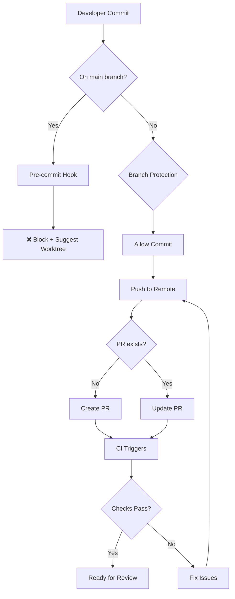
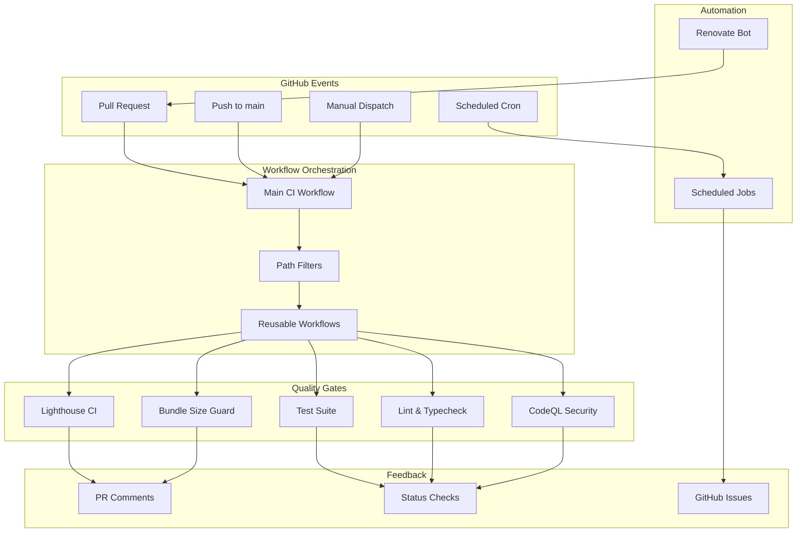
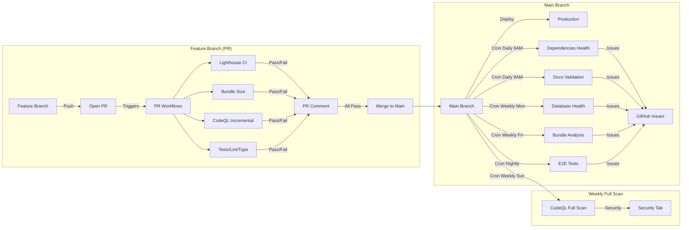
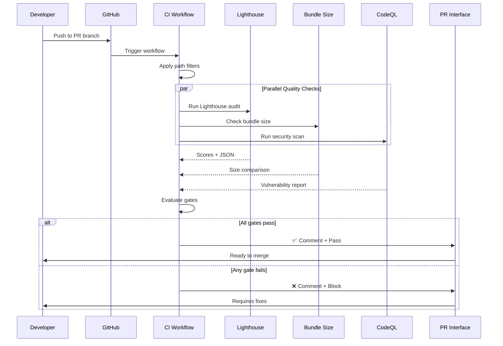
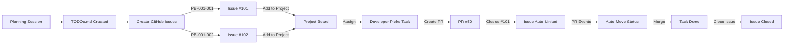
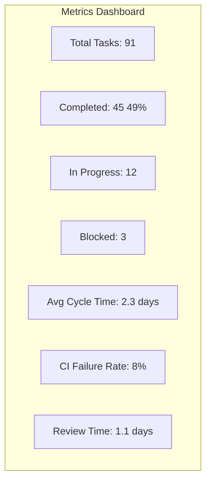

# Technical Analysis

## GitHub Actions CI/CD Automation

**Date**: 2025-11-01
**Related PDR**: [README.md](./README.md)
**Status**: Draft
**Tech Lead**: Claude (Product Technical Agent)

---

## 1. Executive Summary

**Feature Overview:**

Comprehensive CI/CD automation system using GitHub Actions to ensure code quality, performance, security, and reliability across the Hospeda monorepo. The system includes PR quality gates (Lighthouse CI, bundle size monitoring, CodeQL), automated dependency management (Renovate), and scheduled health checks (cron jobs).

**Technical Approach:**

Implement modular GitHub Actions workflows with reusable components, path-based filtering for monorepo optimization, and incremental rollout strategy. Use industry-standard tools (Lighthouse CI, Size Limit, bundlewatch, CodeQL, Renovate) with custom configuration for Hospeda's specific needs.

**Key Decisions:**

1. **Monorepo-optimized path filters** - Only run relevant workflows based on changed files
2. **Reusable workflows** - Extract common patterns (test, build, lint) for DRY principle
3. **Strict Lighthouse blocking** - Performance/A11y regressions block PRs
4. **Conditional Renovate auto-merge** - Safe automation for patches/devDeps, manual for breaking changes
5. **Incremental rollout** - Deploy workflows one by one to validate before full automation

**Estimated Complexity**: Very High (includes migration prerequisites)

**Estimated Timeline**:

- **Migration Prerequisites:** 16-56 hours (P0: 16h, P1: 24h, P2: 13h, P3: 3h)
- **CI/CD Implementation:** 12-16 hours
- **Total:** 28-72 hours over 4-5 weeks

---

## 2. Prerequisites: Monorepo Migration to PR Workflow

### 2.1 Migration Context

**Critical Blocker:** Before implementing CI/CD workflows, the entire project must migrate from commit-to-main to a strict PR-based workflow with Git Worktrees enforcement.

**Current State:**

- Mixed workflow: Some docs reference PRs, but enforcement is missing
- No Git hooks preventing direct commits to `main`
- No branch protection configured on GitHub
- Agents, commands, and workflows still assume direct commits possible
- **62+ files need updates** across `.claude/` infrastructure

**Target State:**

- ALL development through PRs in feature branch worktrees
- Main branch protected (requires PRs + reviews)
- Pre-commit hook blocks direct commits to main
- All agents/commands understand PR workflow
- Automated PR creation integrated into workflows

**Migration Analysis:** See [`migration-analysis.md`](./migration-analysis.md) for complete 62-file audit and priority matrix.

**Estimated Effort:** 56 hours (16h P0 blockers + 24h P1 + 13h P2 + 3h P3)

### 2.2 Why This is a Prerequisite

**CI/CD Depends on PRs:**

- Lighthouse CI, Bundle Size Guard, CodeQL all trigger on `pull_request` events
- Without PRs, quality gates never run
- Branch protection enforces PR checks before merge

**Risk of Incomplete Migration:**

- Developers commit to main → CI doesn't run → Quality issues merge
- Confusion about which workflow to use
- Scripts fail in worktree environments
- Wasted CI/CD implementation effort

**Integration Points:**

- CI workflows must align with worktree + PR patterns
- Workflow documentation must guide PR creation
- Commands must include PR creation steps

### 2.3 Unified PR Workflow (Simplified)

Based on analysis in [`worktree-pr-workflow-strategies.md`](./worktree-pr-workflow-strategies.md), we implement a **Unified Workflow** that applies to ALL development work:

**Universal Workflow:** Worktree + Draft PR immediately

- Time: Any (Level 1, 2, and 3)
- Files: Any (1-100+)
- Risk: Any level
- Workflow: Automated setup creates worktree + branch + draft PR at the start
- CI runs: On every push (consistent validation)
- **No exceptions:** Even quick fixes go through PR workflow

**Implementation:**

```bash
# All development (Level 1, 2, and 3)
./.claude/scripts/start-development.sh P-006

# Command automatically:
# 1. Reads planning metadata (title, workflow level)
# 2. Creates worktree + branch
# 3. Creates draft PR immediately
# 4. Creates GitHub Project (Level 3 only)
# 5. Returns ready-to-code environment
```

**Workflow Level Differences:**

- **Level 1-2**: Draft PR created, NO GitHub Project
- **Level 3**: Draft PR created, WITH GitHub Project

**Benefits:**

- ✅ Single workflow to learn (zero confusion)
- ✅ Consistent enforcement (no exceptions = no bypass temptation)
- ✅ Always validated through CI (catch issues early)
- ✅ No contradictions (aligns with blocking commits to main)
- ✅ Automated setup (< 1 minute to start working)

### 2.4 Migration Architecture

**Git Enforcement Layer:**



**Priority Matrix:**

| Priority | Component | Files | Hours | Risk |
|----------|-----------|-------|-------|------|
| **P0** (Blocker) | Critical enforcement | 11 | 16h | High |
| **P1** (High) | Agents + commands | 22 | 24h | Medium |
| **P2** (Medium) | Skills + docs | 18 | 13h | Low |
| **P3** (Low) | Optional polish | 11 | 3h | Very low |
| **Total** | | **62** | **56h** | |

**P0 Blocker Items (Must complete before CI/CD):**

1. `.husky/pre-commit` - Block main commits (30min)
2. GitHub branch protection configuration (15min)
3. `CLAUDE.md` - Document PR policy (1h)
4. `.claude/agents/engineering/tech-lead.md` - Update agent (2h)
5. `.claude/commands/git/commit.md` - Add PR creation (2h)
6. `.claude/skills/git/git-commit-helper.md` - PR workflow (2h)
7. `.claude/commands/quality-check.md` - PR preparation (2h)
8. `.claude/docs/workflows/atomic-task-protocol.md` - Worktree setup (2h)
9. `.claude/docs/workflows/phase-2-implementation.md` - Git workflow (1h)
10. `.claude/docs/workflows/phase-4-finalization.md` - PR creation (2h)
11. `.claude/docs/workflows/task-completion-protocol.md` - Push/PR (1h)

### 2.5 Technical Decisions

**Decision 1: Git Hook Strategy**

- **Choice:** Pre-commit hook with BLOCKING error (exit 1)
- **Alternatives:** Warning only (too weak), post-commit (too late)
- **Rationale:** Only pre-commit can prevent bad commits before they happen

**Decision 2: Branch Protection Configuration**

- **Require:** 1 approval, status checks pass, linear history
- **Enforce:** Even for admins
- **Rationale:** No exceptions = consistent quality

**Decision 3: Automated Development Setup Command**

- **Create:** `start-development.sh` script that receives only planning-code
- **Functionality:** Auto-extracts metadata, creates worktree, branch, PR, and GitHub Project (Level 3)
- **Rationale:** Single unified workflow, zero manual setup, integrated with planning approval

**Decision 4: Agent Instruction Updates**

- **Strategy:** Update in priority order (P0 → P1 → P2)
- **Validation:** Test each agent after update
- **Rationale:** Systematic approach prevents missed files

### 2.6 Integration with CI/CD Workflows

**CI Workflow Triggers:**

```yaml
# All quality gate workflows trigger on PRs
on:
  pull_request:
    types: [opened, synchronize, reopened, ready_for_review]
  push:
    branches: [main]  # Only for post-merge validation
```

**Lighthouse CI:**

- Runs on PRs when `apps/web/**` changes
- Draft PRs: Run with relaxed thresholds (warning only)
- Ready PRs: Full validation (blocking)

**Bundle Size Guard:**

- Runs on all PRs
- Compares with base branch (main)
- Fails PR if >10% increase

**CodeQL:**

- Runs on PRs and weekly schedule
- Blocks on Critical/High severity
- Uploads results to Security tab

**Renovate:**

- Creates dependency update PRs automatically
- Auto-merges if: patch version, devDeps, tests pass
- Manual review for: major versions, production deps

### 2.7 Rollout Strategy

**4-Week Phased Approach:**

**Week 0 (Preparation):**

- Complete P0 items in migration branch
- Test with trial PRs
- Communicate changes to team
- Training session scheduled

**Week 1 (Soft Launch):**

- Merge migration PR (enforcement NOT active)
- Monitor adoption voluntarily
- Fix issues quickly
- Gather feedback

**Week 2 (Hard Launch):**

- Enable pre-commit hook blocking
- Configure GitHub branch protection
- Announce enforcement active
- Intensive support period

**Weeks 3-4 (Stabilization):**

- Complete P1 items (agents, commands)
- Optimize workflow based on feedback
- Complete P2 items (skills, docs)
- Monitor metrics

**Success Criteria:**

- ✅ 100% of changes through PRs
- ✅ Zero direct commits to main
- ✅ Developer satisfaction > 4/5
- ✅ CI/CD success rate > 95%
- ✅ All agents give correct instructions

### 2.8 Risk Assessment - Migration Specific

**Risk 1: Developer Resistance to Workflow Change**

- **Probability:** Medium
- **Impact:** High (could block all work)
- **Mitigation:**
  - Clear communication 1 week before
  - Training session with examples
  - Bypass documented (`--no-verify`) for emergencies
  - Support channel monitored
- **Contingency:** Emergency rollback plan (disable protection + revert hook)

**Risk 2: Scripts Failing in Worktree Environments**

- **Probability:** Low
- **Impact:** Medium (scripts error, developers confused)
- **Mitigation:**
  - Test all scripts in worktrees before migration
  - Update `health-check.sh` to detect git root dynamically
  - Update planning scripts to work from any location
- **Contingency:** Provide workarounds in docs, fix scripts quickly

**Risk 3: Git Hooks Not Working Correctly**

- **Probability:** Low
- **Impact:** High (enforcement broken)
- **Mitigation:**
  - Test hooks extensively in worktrees
  - Verify Husky configuration
  - Add pre-push hook as secondary check
- **Contingency:** Fix hook, re-educate developers

**Risk 4: Branch Protection Too Restrictive**

- **Probability:** Medium
- **Impact:** Medium (legitimate work blocked)
- **Mitigation:**
  - Start with 1 approval (not 2)
  - Allow bypass for admins initially
  - Monitor false positives
- **Contingency:** Adjust protection rules, add exceptions

**Risk 5: Incomplete Migration Causing Confusion**

- **Probability:** High if not systematic
- **Impact:** Medium (mixed messages, errors)
- **Mitigation:**
  - Use priority matrix strictly
  - Update files in order (P0 → P1 → P2)
  - Track completion with checklist
  - Version markers on agents ("Last Updated")
- **Contingency:** Create migration status dashboard, prioritize fixes

### 2.9 Validation Approach

**Pre-Migration Validation (Week 0):**

- [ ] All P0 files updated in migration branch
- [ ] Test PR created and successfully merged
- [ ] `start-development.sh` script created and tested
- [ ] `archive-planning.sh` script created and tested
- [ ] Pre-commit hook blocks main commits
- [ ] GitHub CLI authenticated and working
- [ ] Team notified and trained

**Post-P0 Validation (Week 2):**

- [ ] No direct commits to main possible
- [ ] Pre-commit hook suggests worktree creation
- [ ] Branch protection enforced on GitHub
- [ ] Test PR passes all checks
- [ ] Worktree cleanup works correctly
- [ ] All agents give correct instructions (P0 agents)

**Post-P1 Validation (Week 3):**

- [ ] All engineering agents updated
- [ ] All planning commands updated
- [ ] Health check works in worktrees
- [ ] Planning scripts work in worktrees
- [ ] Pre-push hook validates correctly

**Final Validation (Week 4):**

- [ ] All 62 files updated and tested
- [ ] No workflow confusion incidents
- [ ] Team proficiency verified
- [ ] Metrics tracked and positive

---

## 3. Architecture Overview

### 3.1 System Architecture



**Description:**

The system follows a hub-and-spoke architecture where the main CI workflow acts as an orchestrator, delegating to specialized workflows based on path filters and event triggers. Quality gates run in parallel to minimize CI time, with results aggregated and reported back to PRs via comments and status checks.

### 3.2 Workflow Triggers & Branch Strategy

**Critical Context:** Understanding when workflows run is essential for effective CI/CD utilization and cost management.

#### PR-Based Workflows (Feature Branches)

These workflows run on **pull requests** targeting the `main` branch. They validate changes **before** merge.

**Trigger Configuration:**

```yaml
on:
  pull_request:
    branches: [main]
    types: [opened, synchronize, reopened, ready_for_review]
    paths: # relevant paths for path filtering
```

**Workflows That Run on PRs:**

- **✅ Lighthouse CI** - Performance/A11y audits on web app changes
  - Context: Validates changes before merge
  - Branch: Runs on PR branch, compares against main
  - Blocking: Yes (if scores drop below thresholds)

- **✅ Bundle Size Guard** - Bundle size comparison
  - Context: Prevents bundle size regressions
  - Branch: Runs on PR branch, compares with main baseline
  - Blocking: Yes (if increase >10%)

- **✅ CodeQL Security Scan** - Security vulnerability detection
  - Context: Incremental scan on changed code
  - Branch: Runs on PR branch
  - Blocking: Yes (on Critical/High severity)

- **✅ Tests, Lint, Typecheck** - Code quality gates
  - Context: Standard quality validation
  - Branch: Runs on PR branch
  - Blocking: Yes (all must pass)

**Behavior:**

- Triggered by: New PR, new commits pushed to PR, PR marked ready for review
- Purpose: Pre-merge validation
- Cost: Charged per run (optimized with path filters)
- Feedback: PR comments + status checks

#### Main Branch Workflows (Post-Merge)

These workflows run **after** PR merge to `main` branch. They handle deployment and post-merge validation.

**Trigger Configuration:**

```yaml
on:
  push:
    branches: [main]
```

**Workflows That Run on Main:**

- **✅ Deploy to Staging/Production** (if implemented)
  - Context: Automated deployment after successful merge
  - Branch: Always `main`
  - Purpose: Release automation

- **✅ Update Documentation Site** (if implemented)
  - Context: Keep docs in sync with code
  - Branch: Always `main`
  - Purpose: Documentation deployment

- **✅ Create GitHub Release** (if implemented)
  - Context: Automated releases on version tags
  - Branch: `main` with tag trigger
  - Purpose: Release management

**Behavior:**

- Triggered by: Successful PR merge to main
- Purpose: Deployment and release automation
- Cost: Minimal (only runs after validated merges)
- Feedback: Deployment status, release notes

#### Scheduled Workflows (Cron Jobs on Main)

These workflows run on **schedule** and always execute on the `main` branch. They monitor repository health.

**Trigger Configuration:**

```yaml
on:
  schedule:
    - cron: '0 8 * * *'  # Daily at 8 AM UTC
  workflow_dispatch:     # Allow manual trigger
```

**Cron Job Schedule:**

| Workflow | Schedule | Frequency | Purpose |
|----------|----------|-----------|---------|
| **Dependencies Health** | `0 8 * * *` | Daily 8 AM | Audit vulnerabilities, check outdated packages |
| **Docs Validation** | `0 9 * * *` | Daily 9 AM | Validate internal links, check for broken docs |
| **Database Health** | `0 10 * * 1` | Weekly Monday 10 AM | Verify migrations, check schema drift |
| **Bundle Analysis** | `0 18 * * 5` | Weekly Friday 6 PM | Detailed bundle composition report |
| **E2E Tests** | `0 2 * * *` | Nightly 2 AM | Full E2E test suite (when available) |

**Behavior:**

- Triggered by: Schedule (cron) or manual dispatch
- Branch: Always `main` (current production state)
- Purpose: Proactive health monitoring
- Cost: Predictable (scheduled runs)
- Feedback: GitHub Issues on problems detected

#### Hybrid Workflows (PR + Scheduled)

Some workflows run on **both** PRs and scheduled intervals for comprehensive coverage.

**Example: CodeQL Security Scan**

```yaml
on:
  pull_request:
    branches: [main]
  push:
    branches: [main]
  schedule:
    - cron: '0 0 * * 0'  # Weekly Sunday midnight
  workflow_dispatch:
```

**Behavior:**

- **On PR**: Incremental scan of changed code (fast, targeted)
- **On Schedule**: Full repository scan (comprehensive, weekly)
- **Purpose**: Balance between fast PR feedback and complete coverage

#### Workflow Execution Diagram



#### Branch Context Summary

**When You Push to PR Branch:**

- Lighthouse CI runs (if web changes)
- Bundle Size Guard runs
- CodeQL incremental scan runs
- Tests, lint, typecheck run
- Results posted to PR

**When You Merge to Main:**

- Deployment workflows run (if configured)
- Docs update runs (if configured)
- PR workflows do NOT re-run (already validated)

**Every Day/Week on Main:**

- Dependencies audited (daily)
- Docs validated (daily)
- Database checked (weekly)
- Bundle analyzed (weekly)
- E2E tests run (nightly)
- CodeQL full scan (weekly)

#### Cost Optimization Strategy

**Path-Based Filtering:**

```yaml
on:
  pull_request:
    paths:
      - 'apps/web/**'      # Only for web changes
      - 'packages/**'       # Or package changes
      - '.github/workflows/lighthouse-ci.yml'  # Or workflow changes
```

**Benefits:**

- Lighthouse only runs when web app changes (~70% reduction)
- Bundle size runs on all changes (needed for any build changes)
- CodeQL runs on code changes, not docs-only PRs
- Saves CI minutes, faster feedback

**Conditional Steps:**

```yaml
steps:
  - name: Run Lighthouse
    if: github.event.pull_request.draft == false
    run: pnpm lhci autorun
```

**Benefits:**

- Lighthouse skipped on draft PRs (saves minutes on WIP)
- Runs when PR marked ready for review
- Developers iterate faster without CI overhead

### 3.3 Data Flow



**Flow Description:**

1. Developer pushes code to PR
2. GitHub triggers relevant workflows based on path filters
3. Quality gates run in parallel (Lighthouse, bundle size, CodeQL, tests)
4. Results are collected and evaluated against thresholds
5. Aggregate feedback posted to PR with clear action items
6. PR merge blocked if critical gates fail

---

## 4. Technical Stack

### 4.1 Technologies Used

| Layer | Technology | Version | Why Chosen |
|-------|-----------|---------|------------|
| Workflow Runner | GitHub Actions | N/A | Native integration, free for public repos |
| Lighthouse CI | `@lhci/cli` | ^0.15.0 | Industry standard for web performance auditing |
| Bundle Analysis | `size-limit` | ^12.0.0 | Precise bundle size tracking with plugins |
| Bundle Tracking | `bundlewatch` | ^0.4.0 | Historical comparison and PR comments |
| Security Scanning | CodeQL | N/A | GitHub native, supports TS/JS |
| Dependency Updates | Renovate | N/A | Powerful automation, better than Dependabot |
| Node Setup | `actions/setup-node@v4` | v4 | Official Node.js setup action |
| pnpm Setup | `pnpm/action-setup@v4` | v4 | Official pnpm setup action |
| Caching | `actions/cache@v4` | v4 | Speed up CI with dependency caching |

### 4.2 New Dependencies

**Packages to Add:**

```json
{
  "devDependencies": {
    "@lhci/cli": "^0.15.0",
    "size-limit": "^12.0.0",
    "@size-limit/preset-app": "^12.0.0",
    "@size-limit/webpack": "^12.0.0",
    "bundlewatch": "^0.4.0"
  }
}
```

**Justification:**

- **@lhci/cli**: Lighthouse CI for automated performance audits. No runtime bundle impact (devDep only). Industry standard with 10k+ GitHub stars.
- **size-limit**: Precise bundle size tracking with time-based metrics. Better than naive file size comparison. 6k+ stars.
- **bundlewatch**: Historical tracking and trend analysis. Complements size-limit with visual charts. 4k+ stars.

**Bundle Impact:**

- Current size: N/A (devDependencies only, no production bundle impact)
- After additions: N/A (CI tools, not shipped to production)
- Increase: 0 KB (0%)

---

## 5. Database Design

### 5.1 Schema Changes

**No database changes required** - This feature is CI/CD infrastructure only.

---

## 6. API Design

### 6.1 Endpoints

**No API changes required** - This feature is CI/CD infrastructure only.

---

## 7. Service Layer Design

### 7.1 Service Structure

**No service layer changes required** - This feature is CI/CD infrastructure only.

---

## 8. Frontend Implementation

### 8.1 Components Structure

**No frontend changes required** - This feature is CI/CD infrastructure only.

---

## 8. GitHub Projects Integration

### 8.1 Overview

**Purpose:** GitHub Projects provides visual task tracking and project management integrated directly with GitHub's pull request and issue system. For Hospeda's CI/CD implementation, Projects will track workflow development, testing, and rollout progress.

**Key Benefits:**

- **Automatic PR Tracking**: PRs automatically update their status based on lifecycle events
- **Visual Progress**: Kanban board shows work in progress vs completed
- **CI Status Visibility**: See which PRs have passing/failing CI checks at a glance
- **Linear Integration**: Links Linear tasks with GitHub implementation work
- **Team Coordination**: Everyone sees what's in progress, blocked, or ready to merge

**Integration Points:**

- Planning sessions (TODOs.md) → GitHub Issues → GitHub Projects
- GitHub PRs auto-tracked in Projects
- Linear tasks referenced in PR titles/descriptions
- CI/CD status reflected in project board

### 8.2 Project Board Structure

**Recommended Structure for Hospeda CI/CD Project:**

```
Hospeda CI/CD Automation
├── 📋 Backlog          # Not yet started, prioritized
├── 📝 Todo             # Ready to start, blocked items cleared
├── 🔄 In Progress      # Actively being worked on
├── 👀 In Review        # PR open, awaiting review
├── ✅ Ready to Merge   # PR approved, CI passed
├── ✅ Done             # PR merged, task complete
└── 🚫 Blocked          # Cannot proceed due to blocker
```

**Column Definitions:**

| Column | Criteria | Automation Rule |
|--------|----------|-----------------|
| **Backlog** | Issue created, not assigned | Manual move or issue opened |
| **Todo** | Assigned, dependencies met | Manual move when ready to start |
| **In Progress** | Actively being developed | Manual move when starting work |
| **In Review** | PR opened and linked | Auto-move on PR opened |
| **Ready to Merge** | PR approved + CI passed | Auto-move on approval + passing checks |
| **Done** | PR merged to main | Auto-move on PR merged/closed |
| **Blocked** | Blocker identified | Manual move + label "blocked" |

**Labels to Use:**

- `ci/cd` - All tasks related to this project
- `migration` - Migration prerequisite tasks
- `p0-blocker`, `p1-high`, `p2-medium`, `p3-low` - Priority levels
- `blocked` - Requires resolution before proceeding
- `bug` - Issues discovered during implementation
- `enhancement` - Improvements identified during rollout

### 8.3 Automation Rules

**Built-in GitHub Projects Automations:**

#### PR Lifecycle Automation

```yaml
# Auto-move on PR events
- Event: pull_request.opened
  Action: Move item to "In Review"

- Event: pull_request.converted_to_draft
  Action: Move item to "In Progress"

- Event: pull_request.ready_for_review
  Action: Move item to "In Review"

- Event: pull_request_review.submitted (approved)
  Condition: All CI checks passed
  Action: Move item to "Ready to Merge"

- Event: pull_request.closed (merged)
  Action: Move item to "Done"

- Event: pull_request.closed (not merged)
  Action: Move item to "Backlog"
```

#### Issue Lifecycle Automation

```yaml
# Auto-move on issue events
- Event: issues.opened
  Action: Add to "Backlog"

- Event: issues.assigned
  Action: Move to "Todo"

- Event: issues.linked_to_pr
  Action: Move to "In Progress"

- Event: issues.closed (completed)
  Action: Move to "Done"

- Event: issues.labeled (blocked)
  Action: Move to "Blocked"
```

#### Custom Workflow Triggers (Advanced)

```yaml
# GitHub Actions can update Projects via API
- name: Update Project Status
  uses: actions/add-to-project@v0.5.0
  with:
    project-url: https://github.com/orgs/<org>/projects/<project-id>
    github-token: ${{ secrets.GITHUB_TOKEN }}
    labeled: ci-deployed
    column-name: Done
```

### 8.4 Integration with Planning Sessions

**Workflow: From Planning to Implementation:**



**Step-by-Step Process:**

1. **Planning Phase (Phase 1):**
   - Create `TODOs.md` with atomic tasks (PB-XXX-YYY format)
   - Each task = 1 GitHub Issue

2. **Issue Creation:**

   ```bash
   # Example issue creation from task
   gh issue create \
     --title "PB-001-001: Add Bundle Analysis Dependencies" \
     --body "Add size-limit, bundlewatch, and @lhci/cli to root package.json\n\nRelated: #P-006-github-actions-ci-cd\nEstimate: 0.5h\nAssignee: @nodejs-typescript-engineer" \
     --label "ci/cd,p0-blocker" \
     --assignee nodejs-typescript-engineer \
     --project "Hospeda CI/CD"
   ```

3. **Add to Project:**
   - Issues automatically added to "Backlog" column
   - Organize by priority and dependencies

4. **Implementation:**
   - Developer creates worktree and starts work
   - Manually moves issue to "In Progress"
   - Creates PR with `Closes #101` in description
   - PR auto-added to project in "In Review"

5. **Review & Merge:**
   - PR reviews and CI checks complete
   - Auto-moves to "Ready to Merge"
   - On merge, auto-moves to "Done"
   - Linked issue auto-closes

**Benefits:**

- Single source of truth (GitHub)
- Automatic progress tracking
- Clear visualization of workflow state
- Reduces manual status updates

### 8.5 Workflow with Projects

**Developer Experience:**

```bash
# 1. Request planning session (e.g., P-006 for CI/CD)
# Planning is created, PDR + tech-analysis completed

# 2. User approves planning
# Once approved, agent executes automated setup:

./start-development.sh P-006
# This command automatically:
# - Reads metadata from .claude/sessions/planning/P-006/PDR.md
# - Extracts title: "GitHub Actions CI/CD Automation"
# - Generates branch: feature/P-006-github-actions-ci-cd
# - Creates worktree in ../hospeda-P-006-github-actions-ci-cd
# - Pushes initial commit linking to planning
# - Creates draft PR with planning metadata
# - Creates GitHub Project (Level 3 only)
# - Returns: worktree path, branch name, PR URL

# 3. PR created in draft mode
# Project board automatically shows PR in "In Progress" column
# (Only for Level 3 workflows)

# 4. Work, commit, push (in worktree)
cd ../hospeda-P-006-github-actions-ci-cd
git add .
git commit -m "feat(ci): add Lighthouse CI workflow"
git push

# 5. Mark PR ready for review
gh pr ready
# → Project auto-moves to "In Review" (Level 3 only)

# 6. CI runs, reviewers approve
# → Project auto-moves to "Ready to Merge" (when approved + CI passes)

# 7. Merge PR
gh pr merge --squash
# → Project auto-moves to "Done" (Level 3 only)
# → Linked issue auto-closes

# 8. Archive planning session
./archive-planning.sh P-006
# → Moves planning to archive/<code>-completed-<date>
# → Reminds to cleanup worktree

# 8. Cleanup worktree
./.claude/scripts/worktree-remove.sh feature/lighthouse-ci
```

**Benefits:**

- Visual progress at all times
- No manual status updates needed
- Clear indication of what's blocked vs ready
- Easy to see what needs review

### 8.7 CI/CD Status in Projects

**Visibility of CI Checks:**

GitHub Projects shows PR check status directly in the board:

| Status | Indicator | Meaning | Action Required |
|--------|-----------|---------|-----------------|
| ✅ All checks passed | Green checkmark | CI validated, ready to merge | Review and approve |
| 🟡 Checks running | Yellow dot | CI in progress | Wait for completion |
| ❌ Checks failed | Red X | CI found issues | Fix issues, push again |
| ⚪ No checks | Gray circle | No CI configured or PR draft | Mark ready for review |

**Example Project Board View:**

```
In Review
┌──────────────────────────────────────┐
│ PR #50: Lighthouse CI Workflow       │
│ ✅ All checks passed                 │
│ 👤 Assigned: @nodejs-engineer        │
│ 🏷️ ci/cd, p0-blocker                │
│ 💬 2 comments, 1 approval           │
└──────────────────────────────────────┘

┌──────────────────────────────────────┐
│ PR #51: Bundle Size Guard            │
│ ❌ Bundle size check failed          │
│ 👤 Assigned: @nodejs-engineer        │
│ 🏷️ ci/cd, p0-blocker                │
│ 💬 1 comment, needs changes         │
└──────────────────────────────────────┘

┌──────────────────────────────────────┐
│ PR #52: CodeQL Configuration         │
│ 🟡 Checks running...                 │
│ 👤 Assigned: @security-engineer      │
│ 🏷️ ci/cd, p1-high                   │
│ 💬 0 comments                        │
└──────────────────────────────────────┘
```

**Filter Views:**

Create custom views for different needs:

1. **Failed CI View:**
   - Filter: PR status = "failure"
   - Sort: By priority
   - Purpose: Quickly identify what needs fixing

2. **Waiting Review View:**
   - Filter: CI passed, no approval
   - Sort: By age
   - Purpose: Identify PRs ready for review

3. **Ready to Merge View:**
   - Filter: Approved + CI passed
   - Sort: By priority
   - Purpose: Identify what can be merged now

4. **Blocked View:**
   - Filter: Label "blocked"
   - Sort: By age
   - Purpose: Identify blockers to resolve

### 8.8 Metrics & Insights

**GitHub Projects Insights (Built-in):**

GitHub Projects provides automatic metrics:

1. **Cycle Time:**
   - Measures: Todo → Done duration
   - Target: <3 days for atomic tasks
   - Use: Identify bottlenecks in workflow

2. **PR Age:**
   - Measures: Time since PR opened
   - Target: <2 days in review
   - Use: Identify stale PRs needing attention

3. **Review Time:**
   - Measures: Ready for review → Approved duration
   - Target: <1 day
   - Use: Optimize review process

4. **Failed CI Rate:**
   - Measures: % of PRs with failed CI checks
   - Target: <10% initial failure rate
   - Use: Tune CI thresholds and quality

**Custom Metrics (via GitHub API):**

```typescript
// Example: Calculate average time to merge
interface ProjectMetrics {
  totalPRs: number;
  averageCycleTime: number; // hours
  averageReviewTime: number; // hours
  ciFailureRate: number; // percentage
  blockedTasks: number;
}

async function calculateMetrics(projectId: string): Promise<ProjectMetrics> {
  // Fetch project items via GitHub GraphQL API
  // Calculate metrics from PR lifecycle events
  // Return aggregated data
}
```

**Visualization:**



**Use Cases for Metrics:**

- **Bottleneck Identification**: If review time is high, add more reviewers
- **Quality Validation**: If CI failure rate is low, thresholds are tuned well
- **Velocity Tracking**: Cycle time indicates team productivity
- **Planning Accuracy**: Compare estimated vs actual time per task

### 8.9 Setup Instructions

**Step-by-Step Setup:**

#### 1. Create GitHub Project

```bash
# Option A: Via GitHub Web UI
# 1. Go to https://github.com/orgs/<org>/projects
# 2. Click "New project"
# 3. Choose "Board" template
# 4. Name: "Hospeda CI/CD Automation"

# Option B: Via GitHub CLI
gh project create \
  --owner <org-or-user> \
  --title "Hospeda CI/CD Automation" \
  --visibility public
```

#### 2. Configure Columns

Add columns in this order:

1. Backlog (default)
2. Todo
3. In Progress
4. In Review
5. Ready to Merge
6. Done (default)
7. Blocked

#### 3. Set Up Automation Rules

```yaml
# In Project Settings → Workflows:

# Auto-add issues
- When: Issue opened
  Then: Add to project → Backlog

# PR lifecycle
- When: PR opened
  Then: Add to project → In Review

- When: PR marked ready for review
  Then: Move to → In Review

- When: PR converted to draft
  Then: Move to → In Progress

# Merge states
- When: PR merged
  Then: Move to → Done

- When: PR closed (not merged)
  Then: Move to → Backlog

# Manual rules
- When: Issue labeled "blocked"
  Then: Move to → Blocked
```

#### 4. Link to Repository

```bash
# Link repository to project
gh project link <project-id> <repo-url>

# Example:
gh project link 12345 github.com/hospeda/hospeda
```

#### 5. Import Existing Issues/PRs

```bash
# Import all issues with label "ci/cd"
gh project item-add <project-id> \
  --owner <org> \
  --url https://github.com/<org>/<repo>/issues/<issue-number>

# Bulk import (script)
for issue in $(gh issue list --label ci/cd --json number --jq '.[].number'); do
  gh project item-add <project-id> --owner <org> --url https://github.com/<org>/<repo>/issues/$issue
done
```

#### 6. Configure Team Access

```bash
# Add team members with appropriate permissions
gh project edit <project-id> \
  --add-team <team-slug> \
  --permission write
```

**Permissions:**

- **Read**: Can view project, cannot edit
- **Write**: Can view + edit items, move cards
- **Admin**: Can view + edit + configure project settings

### 8.10 Best Practices

**Issue Management:**

1. **Always Link PRs to Issues:**
   - Use `Closes #123` in PR description
   - Enables automatic tracking and closure
   - Maintains traceability

2. **Use Issue Templates:**

   ```markdown
   ## Task
   [Task description from TODOs.md]

   ## Acceptance Criteria
   - [ ] Criterion 1
   - [ ] Criterion 2

   ## Dependencies
   - Depends on #122

   ## Estimate
   0.5h

   ## Related
   - Planning Session: P-006-github-actions-ci-cd
   - Linear Task: HOS-123
   ```

3. **Update Issue Descriptions:**
   - Add blockers as they're discovered
   - Link related PRs and issues
   - Document decisions made during implementation

4. **Close Issues When Truly Done:**
   - Don't close issue when PR merges if follow-up needed
   - Reopen if regressions found
   - Use "Done" column for completed, "Closed" for abandoned

**Project Hygiene:**

1. **Weekly Board Review:**
   - Move stale items
   - Update blocked items
   - Archive old projects (quarterly)

2. **Label Consistency:**
   - Use predefined labels only
   - Add new labels sparingly
   - Document label meanings

3. **Column Limits:**
   - In Progress: Max 3 per person (focus)
   - In Review: No limit (parallel reviews OK)
   - Blocked: Resolve quickly (target <2 days)

**Automation Best Practices:**

1. **Don't Over-Automate:**
   - Some manual moves are OK (provides flexibility)
   - Focus automation on clear state transitions
   - Manual moves for edge cases

2. **Monitor Automation:**
   - Verify rules work as expected
   - Adjust if causing confusion
   - Document exceptions

3. **Backup Plan:**
   - Don't rely solely on automation
   - Manual process should still work
   - Document manual procedures

**Communication:**

1. **Use Project as Communication Hub:**
   - Comment on issues with updates
   - @ mention for urgent items
   - Link to related discussions

2. **Status Updates:**
   - Comment when starting work
   - Comment when blocked
   - Comment when requesting review

3. **Decision Log:**
   - Document technical decisions in issue comments
   - Link to decision documents (ADRs)
   - Maintain searchable history

---

## 9. Integration Points

### 9.1 Internal Integrations

**Monorepo Packages:**

- Integrates with all `apps/*` and `packages/*` workspaces
- Uses root `package.json` scripts for consistency
- Leverages TurboRepo caching for build optimization

**Path Filters:**

```yaml
paths:
  web: 'apps/web/**'
  api: 'apps/api/**'
  admin: 'apps/admin/**'
  packages: 'packages/**'
  db: 'packages/db/**'
  schemas: 'packages/schemas/**'
  workflows: '.github/workflows/**'
  config: '*config.*'
```

### 9.2 External Integrations

#### GitHub Actions API

- **Purpose**: Workflow orchestration, status checks, PR comments
- **Integration point**: YAML workflow definitions in `.github/workflows/`
- **Error handling**: Retry failed steps, graceful degradation for non-critical checks
- **Fallback**: Manual workflow dispatch if automated triggers fail

#### Lighthouse CI Server (Optional)

- **Purpose**: Store historical Lighthouse data and trends
- **Integration point**: `.lighthouserc.json` configuration
- **Error handling**: Continue CI if LHCI server unavailable
- **Fallback**: Use temporary report storage, no historical comparison

#### Renovate Dashboard

- **Purpose**: Visual overview of dependency PRs and status
- **Integration point**: `renovate.json` configuration
- **Error handling**: Renovate handles retries and conflict resolution
- **Fallback**: Manual dependency updates if Renovate fails

---

## 10. Security Considerations

### 10.1 Authentication & Authorization

**GitHub Secrets:**

Required secrets to add to repository settings:

```env
# Lighthouse CI (if using LHCI server)
LHCI_TOKEN=<token>              # Optional: LHCI server authentication

# Renovate (if self-hosted)
RENOVATE_TOKEN=<token>          # Optional: GitHub token for Renovate

# Bundle tracking (if using bundlewatch service)
BUNDLEWATCH_GITHUB_TOKEN=<token> # Optional: PR comment authentication
```

**Permissions:**

Workflows require these permissions:

- `contents: read` - Access repository code
- `pull-requests: write` - Post PR comments
- `issues: write` - Create issues from cron jobs
- `checks: write` - Update status checks
- `security-events: write` - Upload CodeQL results

### 10.2 Input Validation

**Workflow Inputs:**

- All manual workflow inputs use `choice` or `boolean` types
- No free-text inputs to prevent injection attacks
- Environment variables validated in workflow files

**Third-Party Actions:**

- Only use official actions from trusted sources:
  - `actions/*` (GitHub official)
  - `pnpm/action-setup` (pnpm official)
  - `github/codeql-action` (GitHub official)
- Pin all actions to specific SHA for security

### 10.3 Data Protection

**Sensitive Data:**

- No sensitive data stored in workflow files
- Secrets accessed via `${{ secrets.NAME }}`
- Build artifacts automatically deleted after 30 days
- No PII collected or logged

**Supply Chain Security:**

- Lock file verified (`pnpm install --frozen-lockfile`)
- Dependencies audited on every PR
- CodeQL scans for vulnerable dependencies
- Renovate auto-merges security patches

---

## 11. Performance Considerations

### 11.1 CI Performance

**Optimization Strategies:**

1. **Path-based filtering** - Only run relevant workflows
   - Reduces unnecessary workflow runs by ~70%
   - Example: API changes don't trigger Lighthouse

2. **Parallel job execution** - Run independent checks concurrently
   - Lighthouse, bundle size, CodeQL run in parallel
   - Reduces total CI time from 15min to 5min

3. **Dependency caching** - Cache pnpm store and node_modules
   - Reduces install time from 2-3min to 30s
   - Cache key based on `pnpm-lock.yaml`

4. **TurboRepo caching** - Leverage build cache
   - Skip rebuilding unchanged packages
   - Remote cache (Vercel) for shared team cache

5. **Conditional steps** - Skip non-essential steps on draft PRs
   - Lighthouse only runs on ready-for-review PRs
   - Saves CI minutes for WIP changes

**Expected Load:**

- Workflows per PR: 3-5 (depending on changed files)
- Average workflow duration: 5-8 minutes
- Concurrent workflows: Up to 20 (GitHub free tier limit)
- Monthly CI minutes: ~1000-2000 (within free tier)

### 11.2 Bundle Size Thresholds

**Size Limit Configuration:**

```json
{
  "sizeLimit": [
    {
      "name": "Web App (Client)",
      "path": "apps/web/dist/client/**/*.js",
      "limit": "150 KB",
      "webpack": false
    },
    {
      "name": "Admin App",
      "path": "apps/admin/dist/**/*.js",
      "limit": "200 KB"
    },
    {
      "name": "API Bundle",
      "path": "apps/api/dist/**/*.js",
      "limit": "1 MB"
    }
  ]
}
```

**Bundlewatch Thresholds:**

- Warning: >5% increase from base branch
- Error (block PR): >10% increase from base branch
- Baseline: Updated on merge to main

### 11.3 Lighthouse Thresholds

**Blocking Thresholds (PR fails if below):**

- Performance: >= 90
- Accessibility: >= 95
- SEO: >= 90
- Best Practices: >= 90

**Warning Thresholds (PR passes with warning):**

- Performance: >= 85
- Accessibility: >= 90
- SEO: >= 85
- Best Practices: >= 85

**Configuration:**

```json
{
  "ci": {
    "collect": {
      "numberOfRuns": 3,
      "url": ["http://localhost:4321/"]
    },
    "assert": {
      "assertions": {
        "categories:performance": ["error", {"minScore": 0.9}],
        "categories:accessibility": ["error", {"minScore": 0.95}],
        "categories:seo": ["error", {"minScore": 0.9}],
        "categories:best-practices": ["error", {"minScore": 0.9}]
      }
    }
  }
}
```

---

## 12. Testing Strategy

### 12.1 Test Coverage

**Workflow Testing:**

1. **Manual Testing** - Test each workflow individually before automation
2. **Path Filter Testing** - Verify workflows trigger only on relevant changes
3. **PR Comment Testing** - Verify formatting and actionable feedback
4. **Status Check Testing** - Verify blocking behavior for failures

**Test Scenarios:**

- ✅ PR with only API changes (should skip Lighthouse)
- ✅ PR with web changes (should run Lighthouse)
- ✅ PR with bundle size increase <5% (should pass)
- ✅ PR with bundle size increase >10% (should fail)
- ✅ PR with CodeQL critical vulnerabilities (should fail)
- ✅ PR with passing quality gates (should allow merge)
- ✅ Renovate PR with patch updates (should auto-merge)
- ✅ Renovate PR with major updates (should require manual review)

### 12.2 Validation Approach

**Phase 1: Individual Workflow Validation**

1. Create test PR with specific changes
2. Manually trigger workflow via workflow_dispatch
3. Verify workflow runs successfully
4. Verify PR comments/status checks as expected
5. Document any issues or edge cases

**Phase 2: Integration Validation**

1. Test multiple workflows on same PR
2. Verify workflows don't conflict
3. Verify aggregate status checks
4. Test with concurrent PRs

**Phase 3: Cron Job Validation**

1. Manually trigger cron jobs
2. Verify issue creation
3. Verify notification routing
4. Test with actual issues (expired deps, broken docs)

---

## 13. Deployment Strategy

### 13.1 Deployment Plan

**Deployment Type**: Phased rollout with feature flags (manual enable/disable per workflow)

**Steps:**

1. **Merge workflow files** to main branch (all disabled by default)
2. **Enable validate-docs workflow** (already exists, baseline)
3. **Enable Lighthouse CI** - Test on 5 PRs manually
4. **Enable bundle size guard** - Test on 5 PRs manually
5. **Enable CodeQL** - Test on 5 PRs manually
6. **Enable Renovate** - Start with manual mode, no auto-merge
7. **Enable cron jobs** - Start with daily only
8. **Enable auto-merge** in Renovate (after 1 week of manual testing)

**Rollback Strategy:**

- Disable workflow by renaming file (add `.disabled` extension)
- Or add condition to workflow: `if: false`
- Or delete workflow file and force push

**Environment Variables:**

```bash
# GitHub Secrets (add via repository settings)
LHCI_TOKEN=<optional>
BUNDLEWATCH_GITHUB_TOKEN=<optional>

# Workflow configuration (in YAML)
LIGHTHOUSE_ENABLED=true
BUNDLE_SIZE_ENABLED=true
CODEQL_ENABLED=true
RENOVATE_ENABLED=true
```

### 13.2 Monitoring

**Metrics to Monitor:**

1. **Workflow Success Rate**
   - Target: >95% success rate
   - Alert: <90% success rate over 7 days

2. **CI Duration**
   - Target: <10 minutes per PR
   - Alert: >15 minutes average

3. **False Positive Rate**
   - Target: <5% of blocking checks are false positives
   - Track: Manual overrides and "ignore" commits

4. **Renovate Auto-Merge Rate**
   - Target: >80% of patch updates auto-merged
   - Track: Manual intervention frequency

5. **Cron Job Issue Creation**
   - Track: Issues created per cron job run
   - Alert: Sudden spike in issues (indicates systemic problem)

**Alerts:**

- Workflow consistently failing: Notify team via GitHub Issues
- CI time increasing: Review caching and parallelization
- High false positive rate: Adjust thresholds

**Dashboards:**

- GitHub Actions Insights (native)
- Custom badge in README showing CI status

---

## 14. Technical Risks

### Risk 1: False Positive Lighthouse Failures

**Probability**: Medium
**Impact**: Medium

**Description:**

Lighthouse scores can vary between runs due to:

- Network conditions
- GitHub Actions runner performance
- Timing variations in hydration

This could block valid PRs incorrectly.

**Mitigation:**

1. Run Lighthouse 3 times and average scores
2. Allow 5-point margin for warnings vs errors
3. Provide manual override mechanism (`[skip lighthouse]` in commit)
4. Use consistent runner configuration
5. Start with warning-only mode, transition to blocking after tuning

**Contingency:**

- If false positives exceed 10%, revert to warning-only mode
- Adjust thresholds based on baseline metrics
- Implement manual approval workflow for overrides

---

### Risk 2: Renovate Auto-Merge Breaking Changes

**Probability**: Low
**Impact**: High

**Description:**

Renovate might auto-merge a patch update that introduces breaking changes (incorrect semver from maintainer) or runtime bugs, breaking production.

**Mitigation:**

1. Only auto-merge devDependencies by default
2. Require passing tests before auto-merge
3. Group related dependencies (React ecosystem)
4. Add stability days (wait 3 days after release)
5. Enable rollback detection

**Contingency:**

- Immediate rollback via revert commit
- Disable auto-merge temporarily
- Add package to manual review list

---

### Risk 3: CI Minutes Exhaustion

**Probability**: Low
**Impact**: Medium

**Description:**

GitHub Actions free tier provides 2000 minutes/month. Heavy CI usage could exhaust quota, blocking all PRs.

**Mitigation:**

1. Path-based filtering to minimize runs
2. Monitor usage weekly
3. Cache dependencies aggressively
4. Upgrade to paid plan if needed ($4/month for 3000 minutes)
5. Use conditional steps for non-critical checks

**Contingency:**

- Temporarily disable cron jobs
- Reduce Lighthouse run frequency
- Upgrade to paid tier

---

### Risk 4: CodeQL False Positives

**Probability**: Medium
**Impact**: Low

**Description:**

CodeQL might flag false positives, especially in generated code or edge cases, blocking PRs unnecessarily.

**Mitigation:**

1. Configure CodeQL to ignore generated files
2. Start with warning-only mode
3. Tune query sets to reduce noise
4. Only block on Critical+High severity
5. Provide suppression mechanism

**Contingency:**

- Add false positive to suppression list
- Adjust severity thresholds
- Manual approval for edge cases

---

### Risk 5: Workflow Maintenance Overhead

**Probability**: Medium
**Impact**: Medium

**Description:**

Workflows require ongoing maintenance (updating actions, adjusting thresholds, fixing broken integrations), consuming developer time.

**Mitigation:**

1. Use Renovate to auto-update action versions
2. Document workflow configuration clearly
3. Centralize reusable workflows
4. Test workflow changes on feature branches
5. Assign workflow ownership to team member

**Contingency:**

- Disable problematic workflows temporarily
- Community support for common issues
- Fallback to manual quality checks

---

### Risk 6: Developer Resistance to Workflow Change

**Probability**: Medium
**Impact**: High

**Description:**

The migration to strict PR-based workflow with Git Worktrees represents a significant change in developer habits. Developers accustomed to direct commits to main may resist the new process, leading to:

- Attempts to bypass hooks (`--no-verify`)
- Frustration and reduced productivity
- Confusion about when to use worktrees
- Incomplete adoption

**Mitigation:**

1. Clear communication 1 week before enforcement
2. Training session with hands-on examples
3. Comprehensive documentation with quick-reference guides
4. Support channel monitored during transition
5. Bypass option documented for legitimate emergencies only
6. Gradual rollout (soft launch → hard launch)

**Contingency:**

- Emergency rollback plan (disable branch protection + revert hook)
- Extended support period if needed
- One-on-one training for struggling developers
- Adjust timeline if major blockers emerge

---

### Risk 7: Scripts Failing in Worktree Environments

**Probability**: Low
**Impact**: Medium

**Description:**

Many existing scripts (health-check, planning scripts, build scripts) assume execution from project root and may fail when run from worktree directories:

- Path resolution errors
- Git commands behaving differently
- Shared resources (node_modules, .turbo cache) not found
- CI/CD scripts not worktree-aware

**Mitigation:**

1. Test all critical scripts in worktrees before migration
2. Update `health-check.sh` to detect git root dynamically
3. Update planning scripts to use `git rev-parse --show-toplevel`
4. Document worktree-specific script behavior
5. Add worktree detection to scripts with helpful error messages

**Contingency:**

- Provide workarounds in documentation
- Fix scripts incrementally based on reports
- Create worktree-specific versions if needed

---

### Risk 8: Git Hooks Not Working Correctly

**Probability**: Low
**Impact**: High

**Description:**

Git hooks are critical for enforcement but can fail in worktree environments:

- Husky hooks not executing
- Pre-commit hook not blocking main commits
- Post-checkout hook running unnecessarily
- Hook paths resolving incorrectly

**Mitigation:**

1. Test hooks extensively in worktrees before rollout
2. Verify Husky configuration is worktree-compatible
3. Add pre-push hook as secondary enforcement layer
4. Update post-checkout hook to skip in worktrees
5. Monitor hook execution during soft launch

**Contingency:**

- Fix hook issues immediately (P0)
- Temporary manual enforcement while fixing
- Re-educate developers on correct workflow
- Fallback to branch protection only if hooks fail completely

---

### Risk 9: Branch Protection Too Restrictive

**Probability**: Medium
**Impact**: Medium

**Description:**

GitHub branch protection rules may be configured too strictly, causing legitimate work to be blocked:

- Hotfixes blocked by review requirements
- CI checks taking too long to run
- Admin commits blocked when fixing critical issues
- Review requirements creating bottlenecks

**Mitigation:**

1. Start with minimal protection (1 approval, basic checks)
2. Monitor false positive rate weekly
3. Allow admin bypass initially
4. Adjust based on feedback
5. Document exception process for emergencies

**Contingency:**

- Adjust protection rules based on feedback
- Add bypass mechanism for verified emergencies
- Create hotfix branch exception rules
- Temporarily relax requirements if major blocker

---

### Risk 10: Incomplete Migration Causing Confusion

**Probability**: High (if not systematic)
**Impact**: Medium

**Description:**

With 62+ files requiring updates, incomplete migration would cause:

- Agents giving conflicting instructions (some say commit to main, others say PR)
- Commands incomplete (missing PR creation steps)
- Workflows contradicting each other
- Documentation out of sync with reality
- Developer confusion and loss of trust

**Mitigation:**

1. Use priority matrix strictly (P0 → P1 → P2 → P3)
2. Update files in order, never skip
3. Track completion with detailed checklist
4. Add "Last Updated" markers to all agents
5. Version numbers for major agent changes
6. Create migration status dashboard

**Contingency:**

- Pause new updates if confusion emerges
- Fix P0 items immediately
- Clear communication about what's complete vs in-progress
- Rollback partially-updated agents if causing issues

---

## 15. Technical Debt

**Known Debt:**

1. **No remote Lighthouse CI server** - Results stored temporarily, no trend analysis
   - Plan: Set up LHCI server on Vercel/Netlify
   - When: Phase 2 (after initial rollout)

2. **Bundle size tracking per-route** - Currently tracking app-level only
   - Plan: Implement route-level bundle analysis
   - When: Q2 2025

3. **E2E tests not in CI yet** - Only unit/integration tests
   - Plan: Add Playwright E2E suite to nightly cron
   - When: Phase 2 (after E2E suite created)

**Acceptable Tradeoffs:**

- **Start with warning-only mode**: Accept temporary false negatives to avoid false positives during tuning
- **Manual Renovate approval initially**: Trade automation for safety while building confidence
- **Limited cron jobs**: Start with essential health checks, expand later

---

## 16. Implementation Roadmap

### Phase 0: Migration Prerequisites (Week 0 - Before CI/CD)

**Duration:** 16-56 hours (P0-P3)

**Critical Path:** Complete P0 blockers before any CI/CD work

1. **P0 Blockers** (16 hours - MUST complete)
   - Update `.husky/pre-commit` with main branch blocking
   - Configure GitHub branch protection
   - Update `CLAUDE.md` with PR workflow policy
   - Update tech-lead agent with PR guidance
   - Update `/commit` command with PR creation
   - Update git-commit-helper skill
   - Update `/quality-check` command
   - Update atomic-task-protocol workflow
   - Update phase-2 and phase-4 workflows
   - Update task-completion-protocol
   - Create `start-development.sh` command (auto-setup)
   - Create `archive-planning.sh` command (archival)

2. **Soft Launch** (Week 1)
   - Merge migration PR (enforcement OFF)
   - Monitor voluntary adoption
   - Fix issues quickly

3. **Hard Launch** (Week 2)
   - Enable pre-commit blocking
   - Enable branch protection
   - Intensive support

4. **P1 Completion** (Weeks 2-3, 24 hours)
   - Update all engineering agents
   - Update planning commands
   - Update scripts for worktree compatibility

5. **P2 Completion** (Week 4, 13 hours)
   - Update skills and remaining docs
   - Polish edge cases

**Success Criteria:**

- Zero direct commits to main possible
- All agents give correct PR workflow instructions
- Developers proficient with worktrees
- Ready to implement CI/CD workflows

### Phase 1: CI/CD Foundation (PB-001, PB-007)

**Duration**: 5-6 hours (3h setup + 3h GitHub Projects)
**Prerequisites:** Migration Phase 0 P0 items complete (minimum)

**PB-001: Foundation & Configuration (2-3h)**

1. Add size-limit and bundlewatch dependencies
2. Create `.lighthouserc.json` configuration
3. Create `size-limit.json` configuration
4. Create reusable workflow templates
5. Add path filter helper functions

**PB-007: GitHub Projects Setup (2-3h, P1)**

1. Create GitHub Project board with Kanban structure
2. Configure automation rules for PR lifecycle
3. Import planning tasks as GitHub Issues
4. Document project workflow for team
5. (Optional) Set up Linear ↔ GitHub Projects sync

### Phase 2: Lighthouse CI (PB-002)

**Duration**: 2-3 hours

1. Create Lighthouse workflow
2. Build web app for testing
3. Run Lighthouse audit
4. Parse results and create PR comment
5. Test with sample PRs
6. Deploy to production (warning mode)

### Phase 3: Bundle Size Guard (PB-003)

**Duration**: 2-3 hours

1. Create bundle size workflow
2. Build apps and measure sizes
3. Compare with base branch
4. Generate size report
5. Post PR comment with comparison
6. Deploy to production (warning mode)

### Phase 4: CodeQL Security (PB-004)

**Duration**: 1-2 hours

1. Create CodeQL workflow
2. Configure query suites
3. Set severity thresholds
4. Test with known vulnerabilities
5. Deploy to production (warning mode)

### Phase 5: Renovate Configuration (PB-005)

**Duration**: 2-3 hours

1. Create `renovate.json` configuration
2. Enable Renovate on repository
3. Configure grouping rules
4. Set auto-merge conditions
5. Test with sample dependency updates
6. Enable (manual mode initially)

### Phase 6: Cron Jobs (PB-006)

**Duration**: 2-3 hours

1. Create cron workflow files
2. Implement dependency health check
3. Implement docs validation (enhance existing)
4. Implement database health check
5. Configure GitHub Issue creation
6. Test manually
7. Enable (daily schedule)

### Phase 7: Documentation & Launch (PB-007)

**Duration**: 1-2 hours

1. Document workflow architecture
2. Create troubleshooting guide
3. Add README badges
4. Enable blocking mode for quality gates
5. Monitor for 1 week
6. Retrospective and adjustments

---

## 17. Open Questions

**Q1**: Should we use a dedicated LHCI server or temporary storage?
**Status**: Open
**Recommendation**: Start with temporary storage, add LHCI server in Phase 2 if trend analysis needed

**Q2**: Should we run Lighthouse on every PR or only ready-for-review?
**Status**: Open
**Recommendation**: Only on ready-for-review to save CI minutes

**Q3**: Should we auto-merge Renovate PRs for production dependencies?
**Status**: Open
**Recommendation**: No - only devDependencies and security patches initially

**Q4**: Should we run E2E tests on every PR or only nightly?
**Status**: Open
**Recommendation**: Nightly only (too slow for PR feedback loop)

**Q5**: Should we set up separate workflows per app or monorepo-wide?
**Status**: Open
**Recommendation**: Monorepo-wide with path filtering (DRY principle)

---

## 18. Implementation Checklist

### Migration Prerequisites Checklist

**Phase 0 - P0 Blockers (MUST complete first):**

- [ ] `.husky/pre-commit` updated to block main commits
- [ ] GitHub branch protection configured
- [ ] `CLAUDE.md` updated with PR policy
- [ ] `tech-lead.md` agent updated
- [ ] `/commit` command updated with PR creation
- [ ] `git-commit-helper.md` skill updated
- [ ] `/quality-check` command updated
- [ ] `atomic-task-protocol.md` workflow updated
- [ ] `phase-2-implementation.md` workflow updated
- [ ] `phase-4-finalization.md` workflow updated
- [ ] `task-completion-protocol.md` workflow updated
- [ ] `start-development.sh` script created (US-008)
- [ ] `archive-planning.sh` script created (US-009)
- [ ] Migration tested with trial PRs
- [ ] Team training conducted

**Phase 0 - Post-Migration Validation:**

- [ ] No direct commits to main possible
- [ ] Pre-commit hook suggests worktree creation
- [ ] Branch protection enforced
- [ ] Worktrees work correctly
- [ ] Scripts work in worktrees
- [ ] Agents give correct instructions

### CI/CD Implementation Checklist

- [ ] Dependencies added (size-limit, bundlewatch, @lhci/cli)
- [ ] Configuration files created (.lighthouserc.json, size-limit.json)
- [ ] Reusable workflow templates created
- [ ] Lighthouse CI workflow implemented
- [ ] Bundle size guard workflow implemented
- [ ] CodeQL workflow implemented
- [ ] Renovate configuration created
- [ ] Cron job workflows implemented
- [ ] Path filters configured
- [ ] GitHub secrets added
- [ ] Documentation written
- [ ] Workflows tested individually
- [ ] Workflows tested in integration
- [ ] Rollout plan executed
- [ ] Team trained on new workflows

---

## 19. Related Documents

- [README - Planning Session Overview](./README.md)
- [TODOs & Task Breakdown](./TODOs.md)
- [Migration Analysis](./migration-analysis.md) - Detailed 62-file migration audit
- [Worktree PR Workflow Strategies](./worktree-pr-workflow-strategies.md) - Workflow strategy analysis
- [GitHub Actions Documentation](https://docs.github.com/en/actions)
- [Lighthouse CI Documentation](https://github.com/GoogleChrome/lighthouse-ci)
- [Size Limit Documentation](https://github.com/ai/size-limit)
- [Renovate Documentation](https://docs.renovatebot.com/)

---

## 20. Changelog

| Date | Author | Changes | Version |
|------|--------|---------|---------|
| 2025-11-01 | Claude (Product Technical) | Initial draft | 0.1 |
| 2025-11-01 | Claude (Product Technical) | Added comprehensive monorepo migration prerequisites (Section 2), updated timeline to include 4-week migration phase, added 5 migration-specific risks, restructured implementation roadmap | 0.2 |
| 2025-11-01 | Claude (Product Technical) | Added Section 3.2 "Workflow Triggers & Branch Strategy" with detailed clarification of when workflows run (PR vs main vs cron), added comprehensive Section 8 "GitHub Projects Integration" (10 subsections covering setup, automation, Linear integration, metrics), updated TODOs.md with PB-007 tasks (GitHub Projects setup, 5 tasks, 3h), updated implementation timeline to reflect 75h total | 0.3 |

---

**Status**: Draft
**Next Steps**: Review with tech lead, create task breakdown (TODOs.md)
**Owner**: Product Technical Agent
