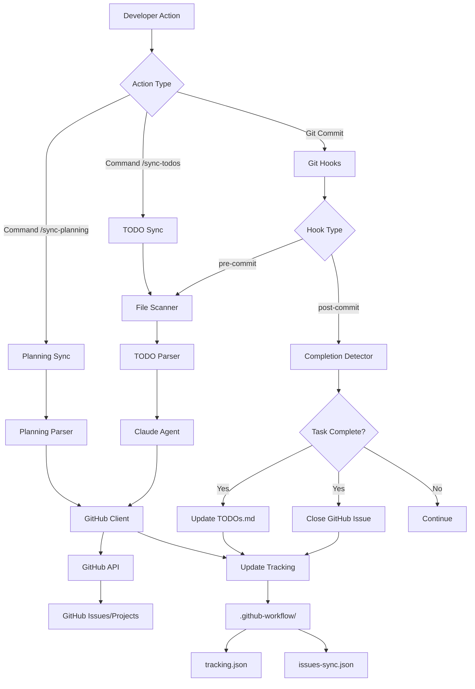

# Unified GitHub Issues Synchronization System

## 1. Executive Summary

### Overview

Unify the `planning-sync` and `tools-todo-linear` packages into a single GitHub Issues synchronization system that:

- Synchronizes feature planning sessions with GitHub Projects and Issues
- Detects and synchronizes TODOs/HACKs in code with GitHub Issues
- Automatically enriches issues with context using Claude Code
- Provides commands and hooks to fully automate the workflow
- Is highly configurable and extensible

### Current Problem

**Tooling Fragmentation:**

- `planning-sync`: Syncs planning sessions but uses Linear (which we want to eliminate)
- `tools-todo-linear`: Syncs TODOs but is overly complex (~2000 lines) and uses external AIs
- No integration between both systems
- Too much complexity with 5 external AI providers

**Limitations:**

- Two separate systems make it hard to see the complete picture of work
- Duplicated configuration and maintenance of two codebases
- Linear as a dependency we want to remove
- Lack of automation in detecting completed tasks

### Proposed Solution

**Unified package: `@repo/github-workflow`**

An integrated system combining the best of both packages:

- ✅ Planning session sync → GitHub Projects + Issues
- ✅ TODO/HACK sync → GitHub Issues
- ✅ Automatic detection of completed tasks
- ✅ Context enrichment using Claude Code (no external AIs)
- ✅ Integrated Claude Code commands
- ✅ Husky hooks for automation
- ✅ VSCode links for direct navigation
- ✅ Highly configurable
- ✅ **Offline sync support** - Resync when working offline
- ✅ **Pre-created GitHub Projects** - Use existing organizational structure
- ✅ **Smart labeling system** - Auto-generated labels by Claude Code
- ✅ **GitHub issue templates** - Consistent issue formatting
- ✅ **Sub-sub-task support** - Hierarchical task organization (3 levels)

### Key Benefits

**For the development team:**

- 🎯 **Single management point**: All issues in GitHub
- 🔄 **Automatic sync**: Planning and code always up to date
- 📊 **Complete visibility**: See planning and tech debt in one place
- ⚡ **Less friction**: Simple commands for entire workflow
- 🤖 **Automatic context**: Claude Code enriches issues without configuration

**For the project:**

- 💰 **Cost reduction**: Eliminate Linear dependency
- 🧹 **Less complexity**: ~800 lines vs ~2200 current lines
- 🔧 **More maintainable**: Unified and simple codebase
- 📈 **Better adoption**: Easier tool to use

### Success Metrics

| Metric | Before | After | Improvement |
|---------|-------|--------|------------|
| **Lines of code** | ~2200 | ~800 | -64% |
| **External dependencies** | 2 (Linear, 5 AI providers) | 1 (GitHub) | -50% |
| **Required commands** | 8+ | 4 | -50% |
| **Config files** | 2 | 1 | -50% |
| **Setup time** | ~15 min | ~5 min | -67% |
| **Complexity (Cyclomatic)** | High | Low | -60% |

---

## 2. Business Context

### Problem to Solve

**What problem are we solving?**

The development team faces fragmentation in work management:

1. **Disconnected planning**: Planning sessions in `.claude/sessions/planning/` are not automatically synced with the tracking system
2. **Invisible technical debt**: TODOs and HACKs in code don't automatically become trackable issues
3. **Duplicate tools**: Two separate systems doing similar work
4. **Unnecessary dependency**: Linear as an intermediate platform we're not using to its full potential
5. **Lack of automation**: Marking tasks as complete requires manual steps
6. **No automatic context**: Issues lack environment information and implementation suggestions

**Why is it important?**

- **Productivity**: Time wasted managing multiple systems
- **Visibility**: Work not reflected in GitHub makes tracking difficult
- **Quality**: Undocumented technical debt leads to future problems
- **Collaboration**: Team can't easily see what needs to be done

**Who is affected?**

- **Developers**: Need to manage planning and TODOs efficiently
- **Tech Lead**: Needs complete visibility of work and technical debt
- **Product Manager**: Needs accurate progress tracking
- **QA**: Needs to know what features are complete and ready for testing

### Business Objectives

**Objective 1: Unify work management**

- All work management in GitHub Issues and Projects
- Eliminate Linear dependency
- Reduce management overhead

**Objective 2: Automate synchronization**

- Planning → GitHub Projects automatically
- TODOs/HACKs → GitHub Issues automatically
- Automatic detection of completed tasks

**Objective 3: Improve issue context**

- Each issue has direct link to code (VSCode protocol)
- Claude Code adds context, analysis and suggestions
- More informative issues without manual effort

**Objective 4: Simplify workflow**

- Simple commands for all operations
- Automatic hooks on commits
- Unified and clear configuration

### Constraints

**Technical:**

- Must work with GitHub API v4 (GraphQL)
- Must use Claude Code for enrichment (not external AIs)
- Must maintain compatibility with current `.claude/sessions/planning/` structure
- Must respect GitHub API rate limits

**Business:**

- Don't use additional paid services (eliminating Linear)
- Implementation in 2-3 sprints maximum
- Don't break existing workflows during migration

**Operational:**

- Must be easy to configure (< 5 minutes)
- Must work offline for basic functions
- Must have comprehensive logging for debugging

---

## 3. Functional Specification

### User Stories

#### US-001: As a developer, I want to sync planning with GitHub

**Story:**

As a developer
When I complete a planning in `.claude/sessions/planning/`
I want to sync it automatically with GitHub
So the team can see tasks in GitHub Projects

**Acceptance Criteria:**

```gherkin
Given a complete planning in .claude/sessions/planning/P-XXX-feature/
  And PDR.md and TODOs.md files exist
When I execute `/sync-planning` command
Then a GitHub Project is created with the feature name
  And a parent issue is created with PDR content
  And sub-issues are created for each task in TODOs.md
  And TODOs.md is updated with issue links
  And metadata is saved in issues-sync.json
```

```gherkin
Given an already synced planning
  And I modify a task status in TODOs.md
When I execute `/sync-planning`
Then the issue status is updated in GitHub
  And issues-sync.json is updated
  And no duplicate issues are created
```

**Priority:** P0 (Must Have)

---

#### US-002: As a developer, I want TODOs in code to sync automatically

**Story:**

As a developer
When I write a TODO/HACK comment in code
I want it to automatically create a GitHub issue
So I don't forget to resolve the technical debt

**Acceptance Criteria:**

```gherkin
Given a file with comment "// TODO: Fix authentication bug"
When I execute `/sync-todos` or commit with the hook
Then a GitHub Issue is created with title "Fix authentication bug"
  And the issue has "TODO" label
  And the issue has link to file and line (vscode://)
  And the issue has code context added by Claude Code
  And it's registered in .github-workflow/tracking.json
```

```gherkin
Given a synced TODO in code
When I modify the TODO text
  And execute `/sync-todos`
Then the issue is updated in GitHub with new text
  And the same issue ID is maintained
  And tracking.json is updated
```

```gherkin
Given a synced TODO in code
When I remove the TODO
  And execute `/sync-todos`
Then the issue is closed in GitHub
  And it's marked as completed in tracking.json
```

**Priority:** P0 (Must Have)

---

#### US-003: As a developer, I want automatic context in TODO issues

**Story:**

As a developer
When an issue is created from a TODO
I want Claude Code to add context automatically
So I can better understand what needs to be done without reading all the code

**Acceptance Criteria:**

```gherkin
Given a TODO in file src/services/auth.service.ts line 45
When the issue is created in GitHub
Then the issue contains:
  - VSCode link to file and line
  - Surrounding code (10 lines before/after)
  - Claude Code analysis about:
    * What the current code does
    * Why the TODO is necessary
    * Implementation suggestions
    * Related files that might need changes
  - Automatic labels based on type and location
  - Complexity estimate
```

**Priority:** P0 (Must Have)

---

#### US-004: As a developer, I want automatic detection of completed tasks

**Story:**

As a developer
When I complete code related to a planning task
I want the system to detect completion automatically
So I don't have to manually mark it in GitHub

**Acceptance Criteria:**

```gherkin
Given a task "Implement User model" in planning
  And the issue has label "task:phase-2"
When I create file packages/db/src/models/user.model.ts
  And create test packages/db/test/models/user.model.test.ts
  And tests pass
  And I commit with message including task code "T-003-001"
Then the system detects the task as complete
  And marks checkbox in TODOs.md as [x]
  And closes the issue in GitHub
  And updates issues-sync.json
```

**Priority:** P1 (Should Have)

---

#### US-005: As a developer, I want simple commands in Claude Code

**Story:**

As a developer
I want to execute simple commands for all operations
So I don't have to remember complex terminal commands

**Acceptance Criteria:**

```gherkin
Given I'm working in Claude Code
When I write `/sync-planning`
Then the current planning syncs with GitHub

When I write `/sync-todos`
Then all TODOs in code sync with GitHub

When I write `/check-completed`
Then completed tasks are detected and marked

When I write `/cleanup-issues`
Then option is offered to archive/delete completed issues
```

**Priority:** P0 (Must Have)

---

#### US-006: As a developer, I want automatic hooks on commits

**Story:**

As a developer
When I commit
I want TODOs to sync automatically and completed tasks to be detected
So GitHub is always up to date without manual effort

**Acceptance Criteria:**

```gherkin
Given I have husky configured
When I commit files with new/modified TODOs
Then pre-commit hook:
  - Scans staged files for TODOs
  - Syncs TODOs with GitHub
  - Adds issue links to comments

Then post-commit hook:
  - Detects if commit completes any task
  - Marks tasks as completed in GitHub
  - Updates TODOs.md if applicable
```

**Priority:** P1 (Should Have)

---

#### US-007: As a developer, I want flexible configuration

**Story:**

As a developer
I want to configure what gets synced and how
So I can adapt the system to my workflow

**Acceptance Criteria:**

```gherkin
Given .github-workflow.config.ts file
When I configure:
  sync:
    planning: true/false
    todos: true/false
    hacks: true/false
  detection:
    autoComplete: true/false
    requireTests: true/false
  github:
    organization: "my-org"
    repository: "my-repo"
    labels:
      todo: "debt:todo"
      hack: "debt:hack"
  hooks:
    preCommit: true/false
    postCommit: true/false
Then the system respects all configuration
```

**Priority:** P1 (Should Have)

---

#### US-008: As tech lead, I want to archive issues when completing planning

**Story:**

As tech lead
When a planning is 100% complete
I want to archive/delete all its GitHub issues
To keep the board clean and focused on active work

**Acceptance Criteria:**

```gherkin
Given a planning with all tasks completed
When I execute `/complete-planning`
Then the system shows summary:
  - Total issues: 15
  - Completed: 15
  - Pending: 0
  And asks: "Archive completed issues? (yes/no/archive)"

When I respond "yes"
Then all project issues are deleted
  And planning is marked as archived in metadata

When I respond "archive"
Then issues are closed but not deleted
  And "archived" label is added

When I respond "no"
Then nothing is done
```

**Priority:** P2 (Nice to Have)

---

#### US-009: As a developer, I want intelligent label management

**Story:**

As a developer
When issues are created from planning or TODOs
I want labels to be automatically generated and applied
So issues are properly categorized without manual work

**Acceptance Criteria:**

```gherkin
Given an issue created from planning task
When the task affects packages/api
  And has priority HIGH
  And impacts multiple apps
Then labels are automatically added:
  - "app:api"
  - "priority:high"
  - "impact:multiple-apps"
  - "type:feature"
  - "planning:P-003"
  - "from:claude-code"
  And labels are created if they don't exist
  And Claude Code generates appropriate labels based on context
```

```gherkin
Given a TODO comment in code
When TODO is type "// TODO: Fix bug"
Then labels are added:
  - "todo"
  - "from:claude-code"
  - Auto-detected labels from context (difficulty, impact, type)
```

```gherkin
Given a HACK comment in code
When HACK is type "// HACK: Temporary workaround"
Then labels are added:
  - "hack"
  - "from:claude-code"
  - Auto-detected labels from context
```

**Label Categories:**

- **Source**: `from:claude-code`
- **Type**: `type:feature`, `type:bugfix`, `type:refactor`, `type:docs`
- **App/Package**: `app:api`, `app:web`, `app:admin`, `pkg:db`, `pkg:service-core`
- **Priority**: `priority:critical`, `priority:high`, `priority:medium`, `priority:low`
- **Difficulty**: `difficulty:easy`, `difficulty:medium`, `difficulty:hard`
- **Impact**: `impact:breaking`, `impact:multiple-apps`, `impact:single-app`
- **Planning**: `planning:P-XXX`
- **Debt**: `todo`, `hack`, `debug`

**Priority:** P0 (Must Have)

---

#### US-010: As a developer, I want to use pre-created GitHub Projects

**Story:**

As a developer
When syncing planning or TODOs
I want issues to be assigned to the correct pre-existing GitHub Project
So work is organized within the established project structure

**Acceptance Criteria:**

```gherkin
Given 4 pre-created projects in GitHub:
  - "Hospeda" (general/cross-cutting)
  - "Hospeda API"
  - "Hospeda Admin"
  - "Hospeda Web"

When syncing a planning that affects all apps
Then issues are added to "Hospeda" project

When syncing a TODO from apps/api/
Then issue is added to "Hospeda API" project

When syncing a TODO from apps/admin/
Then issue is added to "Hospeda Admin" project

When syncing a TODO from apps/web/
Then issue is added to "Hospeda Web" project

When syncing a TODO from packages/
  And it affects API
Then issue is added to "Hospeda API" project
```

**Configuration:**

```typescript
github: {
  projects: {
    general: "Hospeda",
    api: "Hospeda API",
    admin: "Hospeda Admin",
    web: "Hospeda Web",
  },
  projectMapping: {
    "apps/api/**": "api",
    "apps/admin/**": "admin",
    "apps/web/**": "web",
    "packages/**": "general", // unless specified otherwise
  }
}
```

**Priority:** P0 (Must Have)

---

#### US-011: As a developer, I want consistent issue formatting with templates

**Story:**

As a developer
When issues are created from planning or TODOs
I want them to use GitHub issue templates
So all issues have consistent structure and required information

**Acceptance Criteria:**

```gherkin
Given a planning task
When issue is created
Then it uses "planning-task-template.md" with sections:
  - Description
  - Acceptance Criteria
  - Related Files
  - Dependencies
  - Enrichment (from Claude Code)
  - VSCode Links

Given a TODO in code
When issue is created
Then it uses "code-todo-template.md" with sections:
  - Location (file:line)
  - TODO Comment
  - Code Context (snippet)
  - Analysis (from Claude Code)
  - Related Files
  - Complexity Estimate
  - VSCode Links

Given a HACK in code
When issue is created
Then it uses "code-hack-template.md" with sections:
  - Location (file:line)
  - HACK Comment
  - Why This Hack Exists
  - Proper Solution
  - Code Context
  - VSCode Links
```

**Templates Location:**

- `.github/ISSUE_TEMPLATE/planning-task.md`
- `.github/ISSUE_TEMPLATE/code-todo.md`
- `.github/ISSUE_TEMPLATE/code-hack.md`

**Priority:** P0 (Must Have)

---

#### US-012: As a developer, I want to resync after working offline

**Story:**

As a developer
When I work offline and make changes
I want to resync everything when I'm back online
So GitHub reflects all my offline work

**Acceptance Criteria:**

```gherkin
Given I worked offline for 2 days
  And made changes to planning TODOs.md
  And added/modified TODO comments in code
  And completed 3 tasks
When I'm back online
  And execute `/resync-all`
Then the system:
  - Detects all local changes since last sync
  - Shows summary of changes to sync
  - Asks for confirmation
  And when confirmed:
    - Syncs planning changes
    - Syncs TODO/HACK changes
    - Detects and marks completed tasks
    - Updates all tracking files
    - Shows detailed sync report
```

```gherkin
Given tracking files show last sync was 3 days ago
When I execute `/resync-all`
Then sync is performed from last sync timestamp
  And conflicts are detected and reported
  And I can choose how to resolve each conflict
```

**Priority:** P1 (Should Have)

---

#### US-013: As a developer, I want hierarchical task organization (sub-sub-tasks)

**Story:**

As a developer
When I have complex tasks with subtasks that also have subtasks
I want to maintain that 3-level hierarchy in GitHub Issues
So the task breakdown is accurately reflected

**Acceptance Criteria:**

```gherkin
Given a planning task with structure:
  - [ ] Implement authentication system
    - [ ] Create auth service
      - [ ] JWT token generation
      - [ ] Token refresh logic
      - [ ] Token validation
    - [ ] Create auth middleware
      - [ ] Permission checks
      - [ ] Rate limiting

When syncing to GitHub
Then issues are created:
  #123 [PARENT] Implement authentication system
  #124 [SUB] Create auth service (linked to #123)
  #125 [SUB-SUB] JWT token generation (linked to #124)
  #126 [SUB-SUB] Token refresh logic (linked to #124)
  #127 [SUB-SUB] Token validation (linked to #124)
  #128 [SUB] Create auth middleware (linked to #123)
  #129 [SUB-SUB] Permission checks (linked to #128)
  #130 [SUB-SUB] Rate limiting (linked to #128)

And issue titles include level indicator:
  - [PARENT] for top-level
  - [SUB] for second-level
  - [SUB-SUB] for third-level

And GitHub issue relationships maintain the hierarchy
```

**TODOs.md Format:**

```markdown
- [ ] Implement authentication system
  > Main authentication system
  > **GitHub:** #123

  - [ ] Create auth service
    > Authentication service implementation
    > **GitHub:** #124

    - [ ] JWT token generation
      > Implement JWT generation
      > **GitHub:** #125

    - [ ] Token refresh logic
      > Implement token refresh
      > **GitHub:** #126
```

**Priority:** P1 (Should Have)

---

#### US-014: As a developer, I want to clean up Linear TODOs and add GitHub tracking

**Story:**

As a developer
When migrating from Linear to GitHub
I want to clean all Linear IDs from TODO comments
And add GitHub issue tracking directly in comments
So tracking persists even if files move or are renamed

**Acceptance Criteria:**

```gherkin
Given TODO comments in code with Linear IDs:
  // TODO(LIN-123): Fix authentication bug
  // HACK(LIN-456): Temporary workaround

When I execute `/cleanup-linear-todos`
Then all Linear IDs are removed:
  // TODO: Fix authentication bug
  // HACK: Temporary workaround

And a cleanup report is generated showing:
  - Total TODOs found: 47
  - TODOs with Linear IDs: 23
  - TODOs cleaned: 23
  - Files modified: 12
```

```gherkin
Given a TODO without GitHub tracking:
  // TODO: Fix authentication bug

When synced with GitHub (creates issue #345)
Then the comment is updated to include GitHub info:
  // TODO(#345): Fix authentication bug
  // GitHub: https://github.com/org/repo/issues/345

And this tracking persists even if:
  - The TODO moves to different line
  - The file is renamed
  - The file is moved to different directory
```

```gherkin
Given a TODO with GitHub tracking:
  // TODO(#345): Fix authentication bug
  // GitHub: https://github.com/org/repo/issues/345

When the TODO text changes:
  // TODO(#345): Fix authentication and add logging
  // GitHub: https://github.com/org/repo/issues/345

And I execute `/sync-todos`
Then issue #345 is updated with new text
  And the same issue number is maintained
  And no duplicate issue is created
```

**Comment Format:**

```typescript
// Single-line format
// TODO(#123): Fix this bug
// HACK(#456): Temporary workaround

// Multi-line format with metadata
// TODO(#123): Implement user authentication
// GitHub: https://github.com/org/repo/issues/123
// Context: Need to add Clerk integration
```

**Tracking Strategy:**

1. **Primary**: GitHub issue number in comment `(#123)`
2. **Secondary**: Full URL in next line (optional but recommended)
3. **Fallback**: File path + line number in tracking.json

**Migration Process:**

1. Scan all files for TODOs with Linear IDs
2. Remove Linear IDs from comments
3. Create cleanup commit
4. Sync all clean TODOs to GitHub
5. Update comments with GitHub issue numbers
6. Create sync commit

**Priority:** P0 (Must Have)

---

### Mockups / Wireframes

#### GitHub Project View

```
┌─────────────────────────────────────────────────────────────┐
│ 🎯 Project: P-003 Planning Workflow Automation              │
├─────────────────────────────────────────────────────────────┤
│                                                              │
│ 📋 Planning Session                                          │
│ └─ #123 [PARENT] Unified Synchronization System             │
│    │                                                         │
│    ├─ #124 ✅ T-003-001: Design package structure           │
│    ├─ #125 🔄 T-003-002: Implement TODO parser              │
│    ├─ #126 ⬜ T-003-003: Create GitHub client               │
│    └─ #127 ⬜ T-003-004: Integrate Claude Code agent        │
│                                                              │
│ 🔧 Technical Debt (from code TODOs)                          │
│ ├─ #128 TODO: Fix auth token refresh logic                  │
│ │  📍 packages/auth/src/token.ts:45                         │
│ │  🤖 Claude suggests: Use refresh token rotation...        │
│ │                                                            │
│ └─ #129 HACK: Temporary workaround for Safari              │
│    📍 apps/web/src/components/Button.tsx:23                 │
│    🤖 Claude suggests: Implement proper feature detection   │
│                                                              │
└─────────────────────────────────────────────────────────────┘
```

#### Issue Detail View

```
┌─────────────────────────────────────────────────────────────┐
│ #128 TODO: Fix auth token refresh logic                     │
├─────────────────────────────────────────────────────────────┤
│ Labels: TODO | packages:auth | priority:high                │
│ Assignee: @developer                                         │
│ Project: P-003 Planning Workflow Automation                 │
├─────────────────────────────────────────────────────────────┤
│ 📍 Location                                                  │
│ File: packages/auth/src/token.ts:45                         │
│ [Open in VSCode](vscode://file//.../token.ts:45)            │
│                                                              │
│ 📝 Code Context                                              │
│ ```typescript                                                │
│ 40 | export async function refreshToken(token: string) {    │
│ 41 |   const decoded = jwt.verify(token, SECRET);           │
│ 42 |   // TODO: Fix auth token refresh logic                │
│ 43 |   // Current implementation doesn't handle expiry      │
│ 44 |   return jwt.sign({ ...decoded }, SECRET);             │
│ 45 | }                                                       │
│ ```                                                          │
│                                                              │
│ 🤖 Claude Code Analysis                                      │
│                                                              │
│ **Current Behavior:**                                        │
│ The function decodes and re-signs the token without checking│
│ expiration or implementing proper rotation.                 │
│                                                              │
│ **Why Fix Needed:**                                          │
│ - Security risk: Expired tokens can be refreshed           │
│ - No token rotation increases attack surface                │
│ - Not following OAuth 2.0 best practices                    │
│                                                              │
│ **Suggested Implementation:**                                │
│ 1. Verify token expiration before refresh                   │
│ 2. Implement refresh token rotation                         │
│ 3. Store refresh tokens securely (Redis/DB)                 │
│ 4. Add refresh token expiration                             │
│                                                              │
│ **Related Files:**                                           │
│ - packages/auth/src/middleware/auth.middleware.ts           │
│ - packages/auth/src/types/token.types.ts                    │
│ - packages/db/src/models/session.model.ts                   │
│                                                              │
│ **Estimated Complexity:** Medium (3-5 hours)                │
│                                                              │
├─────────────────────────────────────────────────────────────┤
│ 💬 Comments                                                  │
│ [User can add comments here]                                │
└─────────────────────────────────────────────────────────────┘
```

#### Command Output Examples

**`/sync-planning` Output:**

```
🚀 Syncing planning...

📂 Planning: P-003-planning-workflow-automation
📝 Feature: Unified Synchronization System

✅ GitHub Project created
   https://github.com/org/repo/projects/12

✅ Parent issue created: #123
   https://github.com/org/repo/issues/123

✅ Sub-issues created:
   #124 T-003-001: Design package structure
   #125 T-003-002: Implement TODO parser
   #126 T-003-003: Create GitHub client
   #127 T-003-004: Integrate Claude Code agent

✅ TODOs.md updated with links

📊 Summary:
   - Issues created: 5
   - Tasks synced: 4
   - Labels applied: 12

💾 Metadata saved in issues-sync.json

✨ Done! Planning synced with GitHub
```

**`/sync-todos` Output:**

```
🔍 Scanning code for TODOs...

📁 Files scanned: 247
📝 TODOs found: 12

🆕 New TODOs (3):
   ✅ #128 packages/auth/src/token.ts:45
      "Fix auth token refresh logic"
   ✅ #129 apps/web/src/components/Button.tsx:23
      "Temporary workaround for Safari"
   ✅ #130 packages/db/src/models/user.model.ts:67
      "Add email validation"

🔄 TODOs updated (1):
   ✅ #131 packages/service-core/src/booking.ts:89
      Description updated

🗑️ TODOs deleted (2):
   ✅ #132 Closed (code removed)
   ✅ #133 Closed (code removed)

📊 Summary:
   - Issues created: 3
   - Issues updated: 1
   - Issues closed: 2
   - Active TODOs: 12

✨ Sync complete!
```

---

## 4. Technical Specification

### System Architecture

#### Package Structure

```
packages/
└── github-workflow/              # New unified package
    ├── src/
    │   ├── core/                # Core functionality
    │   │   ├── github-client.ts      # GitHub API client
    │   │   ├── file-scanner.ts       # File scanning
    │   │   ├── todo-parser.ts        # TODO parser
    │   │   ├── planning-parser.ts    # Planning parser
    │   │   ├── tracking.ts           # Tracking system
    │   │   └── completion-detector.ts # Completion detection
    │   │
    │   ├── sync/                # Synchronization
    │   │   ├── planning-sync.ts      # Planning sync
    │   │   ├── todo-sync.ts          # TODO sync
    │   │   └── auto-complete.ts      # Auto-completion
    │   │
    │   ├── enrichment/          # Enrichment
    │   │   ├── claude-agent.ts       # Claude Code agent
    │   │   ├── context-extractor.ts  # Context extraction
    │   │   └── analyzer.ts           # Code analysis
    │   │
    │   ├── config/              # Configuration
    │   │   ├── config.ts             # Config management
    │   │   └── defaults.ts           # Default values
    │   │
    │   ├── commands/            # CLI commands
    │   │   ├── sync-planning.ts
    │   │   ├── sync-todos.ts
    │   │   ├── check-completed.ts
    │   │   └── cleanup-issues.ts
    │   │
    │   ├── hooks/               # Git hooks
    │   │   ├── pre-commit.ts
    │   │   └── post-commit.ts
    │   │
    │   ├── types/               # Type definitions
    │   │   └── index.ts
    │   │
    │   └── index.ts             # Public exports
    │
    ├── test/                    # Tests
    │   ├── core/
    │   ├── sync/
    │   ├── enrichment/
    │   └── integration/
    │
    ├── .github-workflow.config.ts  # Example config
    ├── package.json
    ├── tsconfig.json
    ├── vitest.config.ts
    └── README.md
```

#### Data Flow



#### Main Components

**1. GitHub Client (`github-client.ts`)**

```typescript
export class GitHubClient {
  private octokit: Octokit;

  async createProject(config: ProjectConfig): Promise<Project>
  async createIssue(issue: IssueData): Promise<Issue>
  async updateIssue(id: string, updates: IssueUpdate): Promise<Issue>
  async closeIssue(id: string): Promise<void>
  async linkIssues(parent: string, children: string[]): Promise<void>
  async addLabels(issueId: string, labels: string[]): Promise<void>
}
```

**2. Planning Sync (`planning-sync.ts`)**

```typescript
export class PlanningSync {
  async syncPlanning(sessionPath: string): Promise<SyncResult> {
    // 1. Parse PDR.md and TODOs.md
    // 2. Create/Update GitHub Project
    // 3. Create/Update parent issue
    // 4. Create/Update sub-issues
    // 5. Update TODOs.md with links
    // 6. Save metadata
  }
}
```

**3. TODO Sync (`todo-sync.ts`)**

```typescript
export class TodoSync {
  async syncTodos(options: SyncOptions): Promise<SyncResult> {
    // 1. Scan files for TODOs
    // 2. Parse TODO comments
    // 3. Enrich with Claude Code
    // 4. Create/Update/Close issues
    // 5. Update tracking
  }
}
```

**4. Claude Agent (`claude-agent.ts`)**

```typescript
export class ClaudeAgent {
  async analyzeContext(context: CodeContext): Promise<Analysis> {
    // 1. Extract code around TODO
    // 2. Analyze what code does
    // 3. Suggest why TODO is needed
    // 4. Provide implementation suggestions
    // 5. Find related files
    // 6. Estimate complexity
  }
}
```

**5. Completion Detector (`completion-detector.ts`)**

```typescript
export class CompletionDetector {
  async detectCompleted(commit: GitCommit): Promise<CompletedTask[]> {
    // 1. Parse commit message for task codes
    // 2. Check if files match task requirements
    // 3. Verify tests exist and pass
    // 4. Return completed tasks
  }
}
```

### Data Formats

#### Configuration File (`.github-workflow.config.ts`)

```typescript
export default {
  github: {
    token: process.env.GITHUB_TOKEN,
    owner: 'hospeda-org',
    repo: 'hospeda',

    // Pre-created GitHub Projects
    projects: {
      general: 'Hospeda',
      api: 'Hospeda API',
      admin: 'Hospeda Admin',
      web: 'Hospeda Web',
    },

    // Project assignment based on file paths
    projectMapping: {
      'apps/api/**': 'api',
      'apps/admin/**': 'admin',
      'apps/web/**': 'web',
      'packages/db/**': 'general',
      'packages/service-core/**': 'general',
      'packages/**': 'general',
    },
  },

  sync: {
    planning: {
      enabled: true,
      autoSync: false,
      projectTemplate: 'Planning: {featureName}',
      useTemplates: true,
    },

    todos: {
      enabled: true,
      types: ['TODO', 'HACK', 'DEBUG'],
      excludePaths: [
        'node_modules',
        'dist',
        '.git',
        'coverage',
        '*.test.ts',
        '*.spec.ts',
      ],
      useTemplates: true,
    },
  },

  labels: {
    // Universal label for all issues
    universal: 'from:claude-code',

    // Source labels
    source: {
      todo: 'todo',
      hack: 'hack',
      debug: 'debug',
    },

    // Auto-generate these labels using Claude Code
    autoGenerate: {
      type: true,          // type:feature, type:bugfix, etc.
      app: true,           // app:api, app:web, etc.
      package: true,       // pkg:db, pkg:service-core, etc.
      priority: true,      // priority:critical, priority:high, etc.
      difficulty: true,    // difficulty:easy, difficulty:medium, etc.
      impact: true,        // impact:breaking, impact:multiple-apps, etc.
    },

    // Label color schemes
    colors: {
      'from:claude-code': '0E8A16',
      'type:*': '1D76DB',
      'app:*': 'FBCA04',
      'pkg:*': 'D4C5F9',
      'priority:critical': 'B60205',
      'priority:high': 'D93F0B',
      'priority:medium': 'FBCA04',
      'priority:low': '0E8A16',
      'difficulty:*': 'C2E0C6',
      'impact:*': 'D93F0B',
      'planning:*': '5319E7',
      'todo': 'FEF2C0',
      'hack': 'F9D0C4',
      'debug': 'BFD4F2',
    },
  },

  detection: {
    autoComplete: true,
    requireTests: true,
    requireCoverage: 90,
  },

  enrichment: {
    enabled: true,
    contextLines: 10,
    includeImports: true,
    includeRelatedFiles: true,

    // Use Claude Code for enrichment
    agent: 'general-purpose',

    // Request label suggestions from Claude Code
    requestLabels: true,
  },

  hooks: {
    preCommit: true,
    postCommit: true,
  },

  links: {
    ide: 'vscode',
    template: 'vscode://file/{filePath}:{lineNumber}',
  },

  templates: {
    issuesPath: '.github/ISSUE_TEMPLATE',
    planning: 'planning-task.md',
    todo: 'code-todo.md',
    hack: 'code-hack.md',
  },
} satisfies GitHubWorkflowConfig;
```

#### Tracking File (`.github-workflow/tracking.json`)

```json
{
  "version": "1.0",
  "lastSync": "2025-01-15T10:30:00Z",
  "todos": [
    {
      "id": "abc-123-def",
      "type": "TODO",
      "filePath": "packages/auth/src/token.ts",
      "line": 45,
      "title": "Fix auth token refresh logic",
      "githubIssue": {
        "number": 128,
        "url": "https://github.com/org/repo/issues/128",
        "state": "open"
      },
      "createdAt": "2025-01-10T14:20:00Z",
      "updatedAt": "2025-01-15T10:30:00Z"
    }
  ],
  "plannings": [
    {
      "sessionPath": ".claude/sessions/planning/P-003-planning-workflow-automation",
      "code": "P-003",
      "feature": "Planning Workflow Automation",
      "githubProject": {
        "id": "PVT_12",
        "url": "https://github.com/orgs/hospeda-org/projects/12"
      },
      "parentIssue": {
        "number": 123,
        "url": "https://github.com/org/repo/issues/123"
      },
      "tasks": [
        {
          "id": "task-001",
          "code": "T-003-001",
          "title": "Design package structure",
          "status": "completed",
          "githubIssue": {
            "number": 124,
            "url": "https://github.com/org/repo/issues/124"
          }
        }
      ],
      "syncedAt": "2025-01-15T10:30:00Z"
    }
  ]
}
```

#### Planning Session Sync File (`.claude/sessions/planning/P-XXX/issues-sync.json`)

```json
{
  "version": "1.0",
  "feature": "Planning Workflow Automation",
  "planningCode": "P-003",
  "platform": "github",
  "parentGithubIssueNumber": 123,
  "parentGithubIssueUrl": "https://github.com/org/repo/issues/123",
  "githubProject": {
    "id": "PVT_12",
    "name": "Hospeda",
    "url": "https://github.com/orgs/hospeda-org/projects/12"
  },
  "tasks": [
    {
      "id": "task-001",
      "code": "T-003-001",
      "title": "Design package structure",
      "description": "Create the package structure...",
      "status": "completed",
      "phase": 1,
      "githubIssueNumber": 124,
      "githubIssueUrl": "https://github.com/org/repo/issues/124",
      "labels": [
        "planning:P-003",
        "phase:1",
        "type:setup",
        "from:claude-code"
      ],
      "createdAt": "2025-01-15T10:00:00Z",
      "updatedAt": "2025-01-16T14:30:00Z",
      "completedAt": "2025-01-16T14:30:00Z"
    },
    {
      "id": "task-002",
      "code": "T-003-002",
      "title": "Implement GitHub client",
      "description": "Implement GitHub client...",
      "status": "in_progress",
      "phase": 1,
      "githubIssueNumber": 125,
      "githubIssueUrl": "https://github.com/org/repo/issues/125",
      "labels": [
        "planning:P-003",
        "phase:1",
        "type:implementation",
        "priority:high",
        "from:claude-code"
      ],
      "subtasks": [
        {
          "id": "subtask-001",
          "title": "GraphQL mutations",
          "status": "completed",
          "githubIssueNumber": 126,
          "githubIssueUrl": "https://github.com/org/repo/issues/126"
        },
        {
          "id": "subtask-002",
          "title": "REST fallback",
          "status": "pending",
          "githubIssueNumber": 127,
          "githubIssueUrl": "https://github.com/org/repo/issues/127"
        }
      ],
      "createdAt": "2025-01-15T10:00:00Z",
      "updatedAt": "2025-01-17T09:00:00Z"
    }
  ],
  "syncedAt": "2025-01-17T09:00:00Z",
  "lastSyncBy": "claude-code"
}
```

**Key Points:**

- Each task and subtask has `githubIssueUrl` for quick access
- Supports hierarchical subtasks (3 levels: parent → sub → sub-sub)
- Labels are stored for reference
- Status tracking with timestamps
- Project information for organization

### Technology Stack

| Component | Technology | Justification |
|------------|-----------|---------------|
| **Runtime** | Node.js 20+ | Compatible with current project |
| **Language** | TypeScript 5.3+ | Type safety and better DX |
| **GitHub API** | Octokit v4 (GraphQL) | Official API, full support |
| **File Watching** | chokidar | Reliable, cross-platform |
| **Testing** | Vitest | Fast, integrated with project |
| **Config** | cosmiconfig | Flexible, multiple formats |
| **Git Hooks** | Husky | Project standard |
| **Parsing** | Acorn + Esprima | AST parser for code |
| **Logging** | pino | Performance, structured |

### Dependencies

**Main:**

```json
{
  "dependencies": {
    "@octokit/graphql": "^7.0.0",
    "@octokit/rest": "^20.0.0",
    "chokidar": "^3.5.0",
    "cosmiconfig": "^9.0.0",
    "globby": "^14.0.0",
    "pino": "^8.17.0",
    "zod": "^3.22.0"
  },
  "devDependencies": {
    "vitest": "^1.1.0",
    "@types/node": "^20.10.0"
  }
}
```

---

## 5. Implementation Plan

### Development Phases

#### Phase 1: Foundation (Sprint 1 - Week 1)

**Goal:** Basic setup and fundamental parsers

**Tasks:**

1. **T-003-001: Setup package structure** (2h)
   - Create folder structure
   - Configure TypeScript and build
   - Setup Vitest
   - Configure linting

2. **T-003-002: Implement planning parser** (3h)
   - Parser for PDR.md
   - Parser for TODOs.md
   - Parser tests
   - Format validation

3. **T-003-003: Implement TODO parser** (3h)
   - File scanning
   - TODO/HACK comment parser
   - Metadata extraction
   - Tests

4. **T-003-004: Create GitHub client** (4h)
   - Setup Octokit
   - Wrapper for Projects API
   - Wrapper for Issues API
   - Rate limit handling
   - Tests with mocks

**Deliverables:**

- ✅ Complete package structure
- ✅ Working parsers with tests
- ✅ Basic GitHub client
- ✅ Coverage > 90%

---

#### Phase 2: Core Sync (Sprint 1 - Week 2)

**Goal:** Implement core synchronization

**Tasks:**

1. **T-003-005: Planning synchronization** (5h)
   - Create/update GitHub Projects
   - Create/update parent issues
   - Create/update sub-issues
   - Link parent-child issues
   - Update TODOs.md with links
   - Integration tests

2. **T-003-006: TODO synchronization** (4h)
   - Create issues from TODOs
   - Update existing issues
   - Close issues of deleted TODOs
   - Apply automatic labels
   - Tests

3. **T-003-007: Tracking system** (3h)
   - Local tracking system
   - CRUD of tracking data
   - Change detection
   - File persistence
   - Tests

**Deliverables:**

- ✅ Functional planning sync
- ✅ Functional TODO sync
- ✅ Persistent tracking
- ✅ Integration tests

---

#### Phase 3: Enrichment (Sprint 2 - Week 1)

**Goal:** Enrichment with Claude Code

**Tasks:**

1. **T-003-008: Claude Code agent** (5h)
   - Integration with Claude agent
   - Code context extraction
   - Automatic analysis
   - Suggestion generation
   - Tests

2. **T-003-009: Context extraction** (3h)
   - Extract surrounding code
   - Extract imports
   - Detect related files
   - Format for presentation
   - Tests

3. **T-003-010: Issue enrichment** (3h)
   - Enrich issues with analysis
   - Add VSCode links
   - Format descriptions
   - Tests

**Deliverables:**

- ✅ Claude Code integrated
- ✅ Enriched issues
- ✅ Working VSCode links
- ✅ Quality analysis

---

#### Phase 4: Automation (Sprint 2 - Week 2)

**Goal:** Commands and hooks

**Tasks:**

1. **T-003-011: Completion detection** (4h)
   - Detect commits that complete tasks
   - Verify created files
   - Verify tests
   - Mark as completed
   - Tests

2. **T-003-012: Claude Code commands** (3h)
   - `/sync-planning` command
   - `/sync-todos` command
   - `/check-completed` command
   - `/cleanup-issues` command
   - Command tests

3. **T-003-013: Git hooks** (3h)
   - Pre-commit hook setup
   - Post-commit hook setup
   - Husky integration
   - Tests

4. **T-003-014: Configuration system** (2h)
   - Config schema with Zod
   - Defaults
   - Validation
   - Tests

**Deliverables:**

- ✅ Working automatic detection
- ✅ Implemented commands
- ✅ Configured hooks
- ✅ Configurable system

---

#### Phase 5: Migration & Polish (Sprint 3 - Week 1)

**Goal:** Migration and documentation

**Tasks:**

1. **T-003-015: Migration utilities** (3h)
   - Migration script from planning-sync
   - Migration script from tools-todo-linear
   - Validation of migrated data
   - Tests

2. **T-003-016: Documentation** (4h)
   - Complete README
   - Setup guide
   - Usage examples
   - API documentation
   - Troubleshooting guide

3. **T-003-017: Error handling** (3h)
   - Robust error handling
   - Comprehensive logging
   - Clear user messages
   - Error scenario tests

**Deliverables:**

- ✅ Migration scripts
- ✅ Complete documentation
- ✅ Robust error handling
- ✅ Ready for team use

---

### Timeline

```
Sprint 1 - Week 1 (Foundation)
├── Day 1-2: Package setup + Planning parser
├── Day 3-4: TODO parser + GitHub client
└── Day 5: Integration tests

Sprint 1 - Week 2 (Core Sync)
├── Day 1-2: Planning synchronization
├── Day 3-4: TODO synchronization
└── Day 5: Tracking system

Sprint 2 - Week 1 (Enrichment)
├── Day 1-3: Claude Code integration
├── Day 4: Context extraction
└── Day 5: Issue enrichment

Sprint 2 - Week 2 (Automation)
├── Day 1-2: Completion detection
├── Day 3: Commands
├── Day 4: Hooks
└── Day 5: Configuration

Sprint 3 - Week 1 (Migration & Polish)
├── Day 1-2: Migration utilities
├── Day 3: Documentation
├── Day 4-5: Testing & refinement
```

**Total:** ~15 working days (~3 weeks)

---

## 6. Testing and QA

### Testing Strategy

#### Unit Tests (90% coverage minimum)

**Core Components:**

- ✅ Parsers (planning, TODOs)
- ✅ GitHub client methods
- ✅ Tracking system
- ✅ Configuration handling
- ✅ Context extraction

**Test Structure:**

```typescript
describe('PlanningParser', () => {
  describe('parseTodosMarkdown', () => {
    it('should parse tasks with all statuses', () => {
      const content = `
        - [ ] Pending task
        - [~] In progress task
        - [x] Completed task
      `;

      const tasks = parseTodosMarkdown(content);

      expect(tasks).toHaveLength(3);
      expect(tasks[0].status).toBe('pending');
      expect(tasks[1].status).toBe('in_progress');
      expect(tasks[2].status).toBe('completed');
    });

    it('should extract task descriptions', () => {
      const content = `
        - [ ] Task title
          > Task description
          > Multi-line description
      `;

      const tasks = parseTodosMarkdown(content);

      expect(tasks[0].description).toBe('Task description\nMulti-line description');
    });
  });
});
```

#### Integration Tests

**Scenarios:**

1. **Planning Sync End-to-End**

```typescript
describe('Planning Sync Integration', () => {
  it('should sync complete planning to GitHub', async () => {
    // Setup: Create planning files
    const sessionPath = createTestPlanning();

    // Execute: Sync
    const result = await planningSync.sync(sessionPath);

    // Verify: GitHub state
    expect(result.projectCreated).toBe(true);
    expect(result.issuesCreated).toBe(4);

    // Verify: Local state
    const tracking = await readTrackingFile();
    expect(tracking.plannings).toHaveLength(1);
  });
});
```

2. **TODO Sync Lifecycle**

```typescript
describe('TODO Sync Lifecycle', () => {
  it('should handle TODO creation, update, and deletion', async () => {
    // Create TODO
    await writeFile('test.ts', '// TODO: Test task');
    await todoSync.sync();
    let tracking = await readTracking();
    expect(tracking.todos).toHaveLength(1);

    // Update TODO
    await writeFile('test.ts', '// TODO: Updated task');
    await todoSync.sync();
    tracking = await readTracking();
    expect(tracking.todos[0].title).toBe('Updated task');

    // Delete TODO
    await writeFile('test.ts', '// No TODO');
    await todoSync.sync();
    tracking = await readTracking();
    expect(tracking.todos[0].githubIssue.state).toBe('closed');
  });
});
```

3. **Completion Detection**

```typescript
describe('Completion Detection', () => {
  it('should detect task completion from commit', async () => {
    // Setup: Planning with pending task
    const planning = await createPlanning();
    const task = planning.tasks[0]; // T-003-001

    // Execute: Commit with task code
    await git.commit('feat(db): implement User model\n\nT-003-001');
    await detector.detectCompleted();

    // Verify: Task marked complete
    const todos = await readTodos();
    expect(todos).toContain('- [x] Implement User model');

    const issue = await github.getIssue(task.githubIssueNumber);
    expect(issue.state).toBe('closed');
  });
});
```

#### E2E Tests

**User Workflows:**

1. **Complete Feature Planning Workflow**

```typescript
describe('Feature Planning E2E', () => {
  it('should handle complete planning workflow', async () => {
    // 1. Create planning
    await command('/start-feature-plan');

    // 2. Write PDR and TODOs
    await writePDR(pdrContent);
    await writeTODOs(todosContent);

    // 3. Sync to GitHub
    await command('/sync-planning');

    // 4. Verify GitHub
    const project = await github.getProject('P-004');
    expect(project.issues).toHaveLength(5);

    // 5. Complete a task
    await implementTask('T-004-001');
    await git.commit('feat: complete task T-004-001');

    // 6. Auto-detect completion
    await hook.postCommit();

    // 7. Verify completion
    const todos = await readTodos();
    expect(todos).toContain('- [x] Task 1');
  });
});
```

2. **TODO Management Workflow**

```typescript
describe('TODO Management E2E', () => {
  it('should manage TODOs through complete lifecycle', async () => {
    // 1. Write code with TODO
    await writeCode('auth.ts', codeWithTodo);

    // 2. Commit triggers sync
    await git.commit('feat: add auth');

    // 3. Verify issue created
    const issues = await github.getIssues({ label: 'debt:todo' });
    expect(issues).toHaveLength(1);
    expect(issues[0].body).toContain('Claude Code Analysis');

    // 4. Fix TODO
    await writeCode('auth.ts', codeWithoutTodo);
    await git.commit('fix: resolve TODO');

    // 5. Verify issue closed
    const updated = await github.getIssue(issues[0].number);
    expect(updated.state).toBe('closed');
  });
});
```

### Acceptance Criteria Validation

| User Story | Test Type | Validation Method |
|------------|-----------|-------------------|
| US-001 | Integration | Verify GitHub project and issues created |
| US-002 | E2E | Complete TODO lifecycle with verification |
| US-003 | Integration | Check issue body contains Claude analysis |
| US-004 | Integration | Verify auto-detection marks tasks complete |
| US-005 | E2E | Test all commands execute successfully |
| US-006 | Integration | Verify hooks trigger on commits |
| US-007 | Unit | Validate all config options work |
| US-008 | E2E | Test cleanup workflow with confirmation |

### Performance Testing

**Benchmarks:**

- Scan 1000 files: < 5s
- Sync planning (20 tasks): < 10s
- Sync TODOs (50 items): < 15s
- Enrichment with Claude (10 items): < 30s

**Load Testing:**

- Handle repository with 10,000 files
- Process 500 TODOs without issues
- Respect GitHub rate limits (5000/hour)

---

## 7. Risks and Mitigations

### Technical Risks

#### RT-001: GitHub API Rate Limits

**Description:** GitHub limits to 5000 requests/hour

**Probability:** High

**Impact:** Medium

**Mitigation:**

- Implement aggressive caching
- Batch requests where possible
- Show progress to user
- Implement exponential backoff
- Allow pause/resume of operations

**Contingency Plan:**

- Offline mode that syncs only metadata
- Local queue to sync when rate limit recovers

---

#### RT-002: Claude Code Integration Complexity

**Description:** Integration with agents may be complex

**Probability:** Medium

**Impact:** High

**Mitigation:**

- Start with simple analysis
- Increase complexity gradually
- Make analysis optional (fallback to basic description)
- Exhaustive integration tests

**Contingency Plan:**

- Temporarily disable enrichment
- Issues created without analysis but functional

---

#### RT-003: File System Performance

**Description:** Scanning many files may be slow

**Probability:** Medium

**Impact:** Medium

**Mitigation:**

- Use workers to parallelize
- Implement result caching
- Respect gitignore to exclude files
- Show progress to user

**Contingency Plan:**

- Allow incremental scanning
- Option to scan only modified files

---

### Business Risks

#### RN-001: Team Adoption

**Description:** Team may resist tool change

**Probability:** Low

**Impact:** High

**Mitigation:**

- Gradual migration (don't force immediate use)
- Clear documentation and examples
- Training sessions
- Active support in first weeks

**Contingency Plan:**

- Keep old packages temporarily
- Allow parallel use during transition

---

#### RN-002: Breaking Changes in Workflows

**Description:** Changes may break existing workflows

**Probability:** Medium

**Impact:** High

**Mitigation:**

- Automatic migration scripts
- Backward compatibility where possible
- Exhaustive testing pre-release
- Documentation of breaking changes

**Contingency Plan:**

- Prepared rollback plan
- Version pinning in package.json

---

### Data Risks

#### RD-001: Loss of Tracking Data

**Description:** Tracking files corruption

**Probability:** Low

**Impact:** High

**Mitigation:**

- Automatic backups before modifying
- Data validation before writing
- Recovery utilities
- Git track metadata files

**Contingency Plan:**

- Rebuild tracking from GitHub
- Restore from backups

---

## 8. Success Metrics

### Technical KPIs

| Metric | Goal | Measurement |
|---------|----------|----------|
| **Test Coverage** | ≥ 90% | Vitest coverage report |
| **Performance** | Sync < 15s for 50 TODOs | Benchmarks |
| **Code Quality** | 0 lint errors, 0 type errors | CI/CD checks |
| **Bundle Size** | < 500KB | Build output |
| **Dependencies** | < 10 direct deps | package.json |

### User KPIs

| Metric | Goal | Measurement |
|---------|----------|----------|
| **Setup Time** | < 5 minutes | User testing |
| **Command Success Rate** | > 95% | Telemetry (optional) |
| **Sync Accuracy** | 100% TODOs detected | Validation tests |
| **Issue Quality** | 100% issues with context | Manual review |
| **Adoption Rate** | 100% of team uses | Survey after 1 month |

### Acceptance Criteria

**Must Have (P0):**

- ✅ Functional planning sync with GitHub
- ✅ Functional TODO sync with GitHub
- ✅ Enrichment with Claude Code
- ✅ Basic commands working
- ✅ Coverage ≥ 90%
- ✅ Complete documentation

**Should Have (P1):**

- ✅ Automatic completion detection
- ✅ Configured git hooks
- ✅ Flexible configuration
- ✅ Migration scripts

**Nice to Have (P2):**

- ✅ Issue cleanup when completing planning
- ✅ Watch mode for continuous sync
- ✅ Metrics dashboard
- ✅ Anonymous telemetry

---

## 9. Appendices

### Glossary

| Term | Definition |
|---------|------------|
| **Planning Session** | Folder in `.claude/sessions/planning/P-XXX-feature/` with PDR, TODOs, etc. |
| **TODO** | Comment in code marked as TODO, HACK, or DEBUG |
| **Task Code** | Unique task identifier (e.g., T-003-001) |
| **Planning Code** | Unique planning identifier (e.g., P-003) |
| **Sub-issue** | GitHub issue child of a parent issue |
| **Tracking File** | JSON file maintaining sync state |
| **Enrichment** | Process of adding context to issues using Claude Code |
| **Completion Detection** | Automatic detection of completed tasks by commits |

### References

**Documentation:**

- [GitHub GraphQL API](https://docs.github.com/en/graphql)
- [GitHub Projects V2](https://docs.github.com/en/issues/planning-and-tracking-with-projects)
- [Octokit Documentation](https://github.com/octokit/octokit.js)
- [Claude Code Agents](../../.claude/agents/README.md)

**Existing Packages:**

- [planning-sync](../../packages/planning-sync/)
- [tools-todo-linear](../../packages/tools-todo-linear/)

**Current Workflows:**

- [Phase 1: Planning](../../.claude/docs/workflows/phase-1-planning.md)
- [Task Completion Protocol](../../.claude/docs/workflows/task-completion-protocol.md)

### Changelog

| Version | Date | Author | Changes |
|---------|-------|-------|---------|
| 1.0 | 2025-01-31 | Claude + User | Initial complete PDR |

---

**Approval Required:** ✅

**Next Step:** User review → Start Phase 1 implementation

---

*Generated by Claude Code - Principal Software Architect*
*Date: 2025-01-31*
