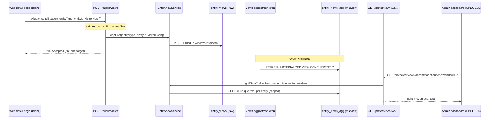

# Technical Analysis: SPEC-159 — Cross-Entity View Tracking

## 1. Overview

### Feature Summary

Provide a single, reusable mechanism to count and expose detail-page **views** for three
entity types — **accommodation**, **post**, **event** — surfacing **unique visitors + total
visits** over **7-day and 30-day** windows, scoped per role:

- **HOST** sees views for its OWN accommodations only.
- **EDITOR** sees views for ALL posts and ALL events.

This is the backend that SPEC-155's three deferred view widgets (HOST Card G "Vistas de mi
alojamiento", EDITOR Card E "Vistas por post", EDITOR Card F "Vistas por evento") consume. It is
built ONCE here rather than three times.

Today PostHog fires `accommodation_viewed` client-side
(`apps/web/src/components/analytics/AccommodationViewTracker.client.tsx`) but **nothing is
persisted in our DB**, and there are NO equivalent `post_viewed` / `event_viewed` events at all.
There is no `viewsCount` column anywhere in the schema.

### The core decision (spec §4)

Two viable approaches, **NOT yet decided** — analyzed in §7 and recommended at the end, but the
final pick is **PENDING USER APPROVAL**:

1. **Own `entity_views` DB table + first-party server-side capture.**
2. **Query the PostHog API server-side** (PostHog stays source of truth).

### Technical Complexity

**Rating:** High

**Justification:** The capture endpoint sits on a high-traffic, unauthenticated hot path (every
detail-page load on the public web), so write-path performance, bot filtering, and abuse
resistance dominate the design. Unique-visitor dedup without storing raw IPs is a privacy-sensitive
sub-problem. The aggregation must answer 7d/30d unique+total cheaply for dashboard reads. None of
the individual pieces are novel for this codebase — there are strong precedents for every layer
(polymorphic `entityId+entityType`, public rate-limited POST, matview + refresh cron, per-host
scoped aggregation route) — but composing them correctly under load is what makes this High.

### Estimated Effort

These are rough engineering estimates for the **recommended option (Option 1)**, not timeline
commitments.

- DB schema (`entity_views` table) + model + migration + extras (indexes/matview): 4 h
- Zod schemas in `@repo/schemas` (capture body, read query, response shapes): 3 h
- Service layer (`EntityViewService`: capture + aggregate, dedup logic, Result<T>): 6 h
- Public capture route (`POST /public/views`, skipAuth + rate limit + bot filter): 4 h
- Read routes (HOST protected scoped + EDITOR protected scoped): 4 h
- Web capture wiring (extend tracker islands for accommodation/post/event + beacon): 4 h
- Aggregation refresh cron (if pre-aggregated matview) + run recording: 3 h
- Unit + integration tests (dedup window, scoping, bot filter, aggregation correctness): 8 h
- i18n / docs / privacy note: 2 h

**Rough total:** 38-44 h.

---

## 2. Architecture Analysis

### Affected Layers

- [x] Database (new `entity_views` table; optionally a `entity_view_daily` rollup or matview)
- [x] Model / Repository (new `EntityViewModel` extending `BaseModel`)
- [x] Schemas (`@repo/schemas` — new `entityView` entity schemas)
- [x] Service (`@repo/service-core` — new `EntityViewService` extending `BaseCrudService`)
- [x] API public tier (`POST /api/v1/public/views` capture endpoint)
- [x] API protected tier (HOST own-accommodation views; EDITOR post/event views)
- [x] Cron (optional aggregation refresh job, mirrors `search-index-refresh.job.ts`)
- [x] Frontend web (extend/add tracker islands to write server-side, not only PostHog)
- [ ] Frontend admin (consumer only — built in SPEC-155, out of scope here)

### New vs Existing

- **New tables:** `entity_views` (raw events). Optional: `entity_view_daily` rollup table OR an
  `entity_views_agg` materialized view (decision inside Option 1, see §5).
- **New schemas (Zod):** `EntityViewCaptureSchema` (capture body), `EntityViewWindowEnum`
  (`7d`/`30d`), `EntityViewStatsSchema` (`{ unique, total }`), `HostAccommodationViewsSchema`
  (per-accommodation breakdown), `EntityViewsByEntitySchema` (post/event read response),
  `EntityViewQuerySchema` (window param).
- **New service:** `EntityViewService` (`capture`, `getStatsForEntity`,
  `getStatsForHostAccommodations`, `getStatsForEditorEntities`).
- **New model:** `EntityViewModel` (insert + windowed aggregation queries).
- **New API routes:** 1 public capture + 2-3 protected read routes.
- **Reused infra:** `EntityTypePgEnum` / `EntityTypeEnumSchema` (already has ACCOMMODATION, POST,
  EVENT), `createSimpleRoute` (`skipAuth` + `customRateLimit`), `createProtectedRoute`,
  `BaseCrudService` + `Result<T>`, `getActorFromContext`, the matview-refresh cron pattern, the
  `migrations/extras/` carril, `trackEvent` web wrapper.

### Architecture diagram (Option 1 — recommended)



The web page also keeps firing the existing PostHog `accommodation_viewed` event unchanged — the
first-party capture is ADDITIVE, PostHog stays for product analytics/funnels. (See §6 risk on
double-counting / consent.)

---

## 3. PostHog: verified current state (grounds Option 2)

These facts come from reading the actual web integration, not assumptions:

| Fact | Source | Implication |
|------|--------|-------------|
| Only `accommodation_viewed` exists; NO `post_viewed`/`event_viewed`. | `apps/web/src/lib/analytics/events.ts` | Option 2 cannot serve EDITOR post/event widgets without **first adding two new client events** — so "PostHog already has the data" is FALSE for 2 of the 3 widgets. |
| `accommodation_viewed` payload = `{ slug, accommodation_id, locale }`. | `AccommodationViewTracker.client.tsx` | Entity id IS present for accommodation. Good for Option 2 filtering, but only for accommodations. |
| PostHog init uses `person_profiles: 'identified_only'`. | `PostHogScript.astro` | Anonymous visitors get NO durable person profile. Unique-visitor dedup in PostHog for anonymous traffic relies on `$device_id`/`distinct_id`, which is cookieless (`persistence: 'memory'`) when consent is absent → unreliable for unique counts. |
| Persistence is `'memory'` unless the `cookie-consent.analytics` cookie is `true`; `respect_dnt: true`. | `PostHogScript.astro` | A meaningful share of traffic captures with NO stable id → PostHog unique-visitor numbers undercount and are consent-gated. The SAME constraint applies to Option 1's dedup (see §4). |
| PostHog runs entirely **client-side**; there is NO server-side PostHog usage. | `rg posthog` across `apps/api` + `packages` | Option 2 introduces a brand-new server→PostHog integration and a new secret (Personal API key) that does not exist today. |
| Only env keys today are `PUBLIC_POSTHOG_KEY` (project ingestion key) + `PUBLIC_POSTHOG_HOST`. NO Personal API key. | `packages/config/src/env-registry.client.ts` | Option 2 requires registering a NEW server secret (`HOSPEDA_POSTHOG_PERSONAL_API_KEY` + project id) and wiring it through `apps/api/.../env.ts` + Coolify. |
| Project is PostHog **US Cloud**, Hospeda org. | env registry `howToObtain` | Option 2 reads add cross-region external latency per dashboard request unless cached. |

**Conclusion for Option 2 feasibility:** PostHog is NOT a drop-in source of truth today. It would
need (a) two new client events, (b) a new server secret + integration, and (c) it still inherits
the same consent/cookieless dedup weakness as Option 1 — while ADDING external dependency,
latency, rate limits, and data-ownership cost. This materially weakens Option 2 versus the spec's
neutral framing.

---

## 4. Unique-visitor dedup strategy (applies to Option 1)

### Visitor identity

Privacy constraint from CLAUDE.md + existing PostHog config (`respect_dnt`, consent-gated
persistence): **do NOT store raw IPs.** Strategy:

1. **Authenticated visitor** → dedup key = `userId` (already available if a session cookie is
   present; the capture endpoint can resolve it opportunistically without REQUIRING auth).
2. **Anonymous visitor** → dedup key = a **`visitorHash`**: a salted hash computed **server-side**
   from a rotating daily salt + a coarse fingerprint. Two sub-options:
   - **(a) Cookieless server hash** (recommended for privacy): `sha256(dailySalt + truncatedIp +
     userAgent)` computed server-side and stored as the hash ONLY — the raw IP never lands in the
     DB and the daily salt makes the hash non-reversible and non-cross-day-linkable (GDPR-lite:
     pseudonymous, auto-expiring linkability). This is the standard "Plausible-style" cookieless
     unique count.
   - **(b) First-party anonymous id cookie** (`hospeda_vid`, httpOnly, SameSite=Lax): more stable
     unique counts but introduces a tracking cookie → must be consent-gated to match the existing
     PostHog consent model, which REDUCES coverage exactly like PostHog. Not recommended unless
     product wants cross-day unique accuracy and accepts the consent banner coupling.

**Recommended:** (a) cookieless server hash. It needs no consent banner (pseudonymous, no durable
client storage), stores no raw IP, and yields "unique visitors per day/window" that are good
enough for a dashboard KPI. State this limitation explicitly: unique counts are an
**approximation** (a visitor on two devices/IPs counts twice; behind shared NAT may undercount).

### Dedup window

To make "total visits" meaningful (not inflated by SPA re-renders / refreshes) enforce a **dedup
window** per `(entityType, entityId, visitorHash)`: collapse repeated views inside, e.g., a
30-minute window into one "visit". Two implementations:

- **Write-time dedup:** the service checks for a recent row before inserting (one indexed lookup
  per write — adds read cost on the hot path).
- **Insert-always + dedup at read/rollup time:** always insert raw rows, collapse during the
  aggregation (matview / rollup) with `DISTINCT ON` over the window bucket. Cheaper writes,
  heavier aggregation. **Recommended** given the write path is the hot one.

"Unique visitors" for a window = `COUNT(DISTINCT visitorHash)` over the window. "Total visits" =
count of windowed-deduped events.

### Bot filtering

Detail pages get heavy crawler traffic. Filter at capture time:

- Reject obvious bots by `User-Agent` (a small denylist regex: `bot|crawl|spider|preview|curl|wget`
  - known SEO crawlers). Cheap, no dependency.
- The capture endpoint requires a real beacon POST from a hydrated island (not a GET), which most
  naive crawlers won't issue — a structural filter.
- Honeypot/rate-limit already available via `customRateLimit` (precedent: `contact/submit.ts`).

---

## 5. Database design (Option 1)

### New table: `entity_views` (raw capture)

Follows the established polymorphic pattern from `user_bookmarks`
(`packages/db/src/schemas/user/user_bookmark.dbschema.ts`).

| Column | Type | Notes |
|--------|------|-------|
| `id` | uuid PK `defaultRandom()` | |
| `entityType` | `EntityTypePgEnum` NOT NULL | reuse existing enum (has ACCOMMODATION/POST/EVENT) |
| `entityId` | uuid NOT NULL | polymorphic FK (no DB-level FK, same as bookmarks) |
| `visitorHash` | text NOT NULL | salted daily hash OR `user:<uuid>` for authenticated |
| `isAuthenticated` | boolean NOT NULL default false | distinguishes user vs anon hash |
| `viewedAt` | timestamptz NOT NULL `defaultNow()` | window bucketing source |

**Deliberately NOT** including `BaseModel`'s full audit columns (`createdById`, `updatedById`,
`deletedAt`, soft-delete, `adminInfo`): view events are append-only telemetry, never edited, never
user-owned, and high-volume. Soft-delete + audit FKs would bloat the hottest-writing table in the
app. Retention is handled by a TTL purge cron instead (drop rows older than ~95 days, since the
widest window is 30d + buffer). **This is a deliberate deviation from the BaseModel convention, APPROVED by the user on
2026-06-04**: the table is lean (no audit columns, no soft-delete); retention is handled by the
TTL purge cron.

**Indexes** (declared on the Drizzle model AND mirrored in `migrations/extras/` per the two-carriles
rule, following `008-bookmark.indexes.sql`):

- `idx_entity_views_entity_time` on `(entity_type, entity_id, viewed_at)` — the core read index for
  windowed per-entity aggregation.
- `idx_entity_views_time` on `(viewed_at)` — supports the retention purge.

### Aggregation strategy: query-time vs pre-aggregated

| | Query-time aggregation | Pre-aggregated (matview or daily rollup) |
|---|---|---|
| Read latency | `COUNT(DISTINCT ...)` over up to 30d of raw rows per request | O(rows-in-rollup), tiny |
| Freshness | Real-time | Stale by refresh interval (acceptable per spec §3 OUT: "batch is fine for V1") |
| Write cost | None extra | None extra (refresh is async) |
| Complexity | Lowest | Adds a matview + refresh cron |
| Risk under load | `COUNT(DISTINCT)` over a high-volume table on every dashboard load can get slow | Bounded, predictable |

**Recommended:** start **query-time** for V1 with the compound index (volumes for this site are
modest; the index makes 7d/30d `COUNT(DISTINCT visitorHash)` cheap), and pre-aggregate ONLY if read
latency proves a problem. If pre-aggregating, mirror `search-index-refresh.job.ts`: an
`entity_views_agg` materialized view refreshed `CONCURRENTLY` by a cron every N minutes, with a
UNIQUE index to allow `CONCURRENTLY`. This keeps the door open without over-building V1 (YAGNI).

### Retention purge cron

New cron job (mirrors existing job structure + `recordCronRun`): nightly `DELETE FROM entity_views
WHERE viewed_at < now() - interval '95 days'`. Keeps the hot table bounded and is a GDPR-lite data
minimization control.

---

## 6. API design

### Capture (public, unauthenticated)

```
POST /api/v1/public/views
Auth: none (skipAuth: true)
Rate limit: customRateLimit { requests: 30, windowMs: 60000 } per IP
Request:  { entityType: 'ACCOMMODATION'|'POST'|'EVENT', entityId: uuid }
Response 202: { accepted: true }
Response 400: { error, code: VALIDATION_ERROR }   // bad entityType/id
Response 429: rate limited
```

- Validated by `EntityViewCaptureSchema` (`@repo/schemas`), exactly like `contact/submit.ts`
  validates `ContactSubmitSchema`.
- `visitorHash` is computed **server-side** from request headers (UA + truncated IP + daily salt) —
  never trusted from the client. `isAuthenticated`/`userId` resolved opportunistically from the
  session cookie if present.
- Bot UA denylist rejects with a 202 fake-accept (same "indistinguishable drop" pattern as the
  contact honeypot) so crawlers get no signal.
- Returns **202 fire-and-forget**: the client uses `navigator.sendBeacon` so the page never blocks
  on the response. The handler inserts and returns immediately.

### Read — HOST accommodation views (protected, own-scoped)

```
GET /api/v1/protected/views/accommodations/me?window=7d|30d
Auth: user session
Permission: ACCOMMODATION_VIEW_OWN  (+ ANALYTICS_VIEW if we gate analytics)
Response 200: [{ entityId: uuid, unique: number, total: number }]
```

- Scoped strictly to `actor.id` — the service iterates the host's OWN accommodations and never
  accepts an `ownerId` query param (same anti-peeking pattern as
  `conversations/protected/response-rate.ts`). Per-accommodation breakdown (Card G wants this).

### Read — EDITOR post/event views (protected, all-scoped)

```
GET /api/v1/protected/views/{posts|events}?window=7d|30d&entityIds=...
Auth: user session
Permission: POST_VIEW_ALL  (posts) / EVENT_VIEW_ALL  (events)
Response 200: [{ entityId: uuid, unique: number, total: number }]
```

- EDITOR has `POST_VIEW_ALL` + `EVENT_VIEW_ALL` (verified in permission enum) so no owner scoping;
  the route returns views for the requested set of post/event ids (or a top-N list for the widget).

All read routes get `cacheTTL: 60` + `customRateLimit` like the response-rate precedent.

---

## 7. The key decision (spec §4) — options analyzed

### Option 1 — Own `entity_views` table + first-party server-side capture

**What it does:** Web detail pages `sendBeacon` to `POST /public/views`; the API computes a
privacy-safe `visitorHash`, filters bots, inserts a row; reads aggregate 7d/30d unique+total from
our own DB, scoped per role.

**Pros:**

- Full **data ownership** + no external dependency, rate limit, or cost.
- Works identically for all 3 entity types TODAY (only `accommodation_viewed` exists in PostHog).
- Read latency is in-DB, fast, cacheable; no cross-region PostHog round-trips on dashboard loads.
- Reuses every existing pattern (polymorphic table, public rate-limited POST, matview+cron,
  scoped protected route) → low novelty, high confidence.
- Dedup logic is under our control and testable deterministically.

**Cons:**

- New high-write table on a hot path → must get write performance + retention right.
- Duplicates "view" data that also flows to PostHog (two systems counting; reconciliation noise).
- We own the privacy/GDPR responsibility for the visitor hash (mitigated: no raw IP, daily salt).
- Slightly more code than calling an API (new table, model, cron).

**Impact on existing code:** additive only. New schemas/model/service/routes; extend web tracker
islands to also `sendBeacon`. No existing endpoint or table changes. One deliberate convention
deviation (non-BaseModel table) to approve.

**Rough effort:** 38-44 h.

### Option 2 — Query the PostHog API server-side

**What it does:** Keep PostHog as source of truth. The API holds a PostHog **Personal API key**,
runs HogQL/insights queries against the project for `*_viewed` events filtered by entity id +
time window, aggregates unique (`COUNT(DISTINCT person/$device_id)`) + total, and serves the
dashboards (cached).

**Pros:**

- No new write path, no new table, no retention to manage — PostHog stores events.
- Reuses the analytics pipeline already capturing `accommodation_viewed`.
- One source of truth for "views" (no double-counting reconciliation).

**Cons (several are blockers, grounded in §3):**

- **post/event events DON'T EXIST yet** — Option 2 still requires adding `post_viewed` +
  `event_viewed` client events and waiting for data to accumulate, so it's NOT "free data" for 2
  of 3 widgets.
- Introduces a **new server secret** (Personal API key) + a brand-new server→PostHog integration
  that does not exist today; key exposure + rotation surface.
- **External latency + rate limits** on every dashboard read (US Cloud, cross-region) → must cache
  aggressively anyway, partially negating the "no infra" benefit.
- **Unreliable unique dedup**: PostHog uses `person_profiles: 'identified_only'` + cookieless
  `'memory'` persistence without consent + `respect_dnt` → anonymous unique counts are
  consent-gated and noisy. We'd be exposing a KPI we can't fully trust.
- **Data ownership / lock-in**: the dashboard KPI now depends on a third-party SaaS being reachable.
- HogQL/insights query shapes + rate limits are an external contract that can change.

**Impact on existing code:** new env secret + registry entry + `apps/api` env wiring + Coolify
provisioning; new web events for post/event; new server PostHog client. No DB changes.

**Rough effort:** 30-38 h (less DB, more external integration + caching + new events + secret ops),
but with materially higher uncertainty and weaker data quality.

### Recommendation (APPROVED by user 2026-06-04)

**Recommend Option 1 (own `entity_views` table + first-party capture)**, for these reasons:

1. It serves all three widgets TODAY; Option 2 still needs the two missing events, so the
   "PostHog already has it" advantage is illusory for posts/events.
2. Data ownership + predictable, cacheable in-DB reads with no external rate limit/latency.
3. It reuses battle-tested patterns already in this repo (polymorphic table, public rate-limited
   POST, matview+cron, scoped protected aggregation), minimizing novel risk.
4. Both options inherit the SAME cookieless/consent dedup limitation, so Option 2's only unique
   benefit (reuse the existing pipeline) is small and offset by external dependency + lock-in.

Within Option 1, recommend: **cookieless server-side `visitorHash` (no consent banner, no raw
IP)**, **insert-always + dedup-at-aggregation**, **query-time aggregation for V1** (pre-aggregate
only if read latency demands), and a **non-BaseModel append-only table** with a retention purge
cron. Keep firing the existing PostHog event unchanged (additive), so product analytics is
unaffected.

**Decision: Option 1 APPROVED by the user on 2026-06-04**, including the within-Option-1
recommendations (cookieless `visitorHash`, insert-always + dedup-at-aggregation, query-time
aggregation for V1, non-BaseModel lean append-only table + retention purge cron).

---

## 8. Risks & mitigations

| Risk | Probability | Impact | Mitigation |
|------|:-----------:|:------:|------------|
| Write path slows detail pages | Medium | High | `sendBeacon` fire-and-forget; 202 immediate return; no synchronous dedup read; insert is a single indexed write |
| `COUNT(DISTINCT)` aggregation slow at scale | Medium | Medium | Compound index `(entity_type, entity_id, viewed_at)`; escalate to matview+refresh cron (proven precedent) if needed |
| Bot/crawler inflation of counts | High | Medium | UA denylist + beacon-only POST + rate limit; counts framed as approximate |
| Privacy/GDPR exposure (storing identifiers) | Medium | High | No raw IP; daily-salted non-reversible hash; pseudonymous; 95-day retention purge; no consent banner needed |
| Unique counts inaccurate (cookieless) | High | Low | Document KPI as "approximate unique visitors"; same limitation PostHog has; acceptable for a dashboard |
| Double-counting vs PostHog confuses reporting | Medium | Low | Document the two systems' purposes (PostHog = product funnels; entity_views = dashboard KPI); they are not reconciled by design |
| Abuse: scripted POST inflation | Medium | Medium | Rate limit per IP + bot filter + (optional) require a valid referer/origin header from the web app |
| Hot table unbounded growth | Medium | Medium | Retention purge cron; index on `viewed_at` |
| Convention deviation (non-BaseModel table) rejected in review | Low | Medium | Flagged as an explicit decision; fallback is BaseModel + accept overhead |
| (Option 2) PostHog API unreachable/rate-limited | — | — | N/A if Option 1 chosen; would require caching + fallback if Option 2 |

---

## 9. Performance considerations

- **Write path (hottest):** every public detail-page load is a candidate write. Mitigations:
  `navigator.sendBeacon` (non-blocking, survives navigation), 202 fire-and-forget, single indexed
  INSERT, no synchronous dedup lookup, per-IP rate limit, bot rejection before insert. Beacon also
  means the capture does not delay `astro:page-load` or compete with hydration (the existing
  tracker already mounts `client:idle`).
- **Read path:** dashboard widgets call scoped aggregation endpoints with `cacheTTL: 60`. 7d/30d
  `COUNT(DISTINCT visitorHash)` + windowed total served by the `(entity_type, entity_id,
  viewed_at)` index. Per-accommodation HOST breakdown iterates only the host's own ids.
- **Aggregation escalation path:** if reads exceed budget, introduce `entity_views_agg` matview +
  `CONCURRENTLY` refresh cron (exact precedent: `search-index-refresh.job.ts`, every 6h there;
  views could refresh more frequently, e.g. every 15-30 min, still well within "batch is fine").
- **Storage:** bounded by the 95-day retention purge.
- **Monitoring:** capture-endpoint error rate + p95 latency; insert volume/min; rejected-bot ratio;
  aggregation query duration; cron run outcomes via the existing `cron_runs` recording.

---

## 10. Dependencies

### External packages

**None required.** Hashing uses Node's built-in `crypto`. Bot detection is a small in-repo regex
(no `isbot`/UA-parser dependency — YAGNI; add only if the denylist proves insufficient).

> Option 2 (NOT recommended) would add a server-side PostHog dependency + a new `HOSPEDA_POSTHOG_*`
> Personal API key secret in `@repo/config` registry + `apps/api` env + Coolify.

### Internal packages

| Package | Change |
|---------|--------|
| `@repo/schemas` | New `entityView` entity schemas (capture/query/response/stats) — source of truth for types |
| `@repo/db` | New `entity_views` dbschema + `EntityViewModel`; migration + `migrations/extras/` indexes (+ optional matview) |
| `@repo/service-core` | New `EntityViewService` (capture + scoped aggregation) extending `BaseCrudService`, `Result<T>` |
| `apps/api` | 1 public capture route + 2-3 protected read routes; optional refresh cron + retention purge cron |
| `apps/web` | Extend `AccommodationViewTracker` + add post/event tracker islands to `sendBeacon` to the capture endpoint (in addition to the existing PostHog event) |

**Build order:** schemas → db (model+migration) → service-core → api routes → web wiring → crons.

---

## 11. Testing strategy

- **Service unit tests (write tests first — pure logic):** dedup window collapses repeated views;
  authenticated vs anonymous hash key selection; bot UA rejection; windowed unique vs total
  correctness (seed rows across 7d/30d boundaries and assert counts); `Result<T>` error paths.
- **Hash/privacy unit tests:** same visitor same day → same hash; cross-day → different hash (salt
  rotation); raw IP never present in stored payload.
- **Route integration tests:** public capture returns 202; rate limit returns 429; bad entityType
  → 400; HOST read scoped to own accommodations (a host cannot read another host's views);
  EDITOR read requires `POST_VIEW_ALL`/`EVENT_VIEW_ALL`; window param validation.
- **Aggregation correctness:** fixture of raw rows → assert per-entity `{unique,total}` for both
  windows; if matview used, assert refresh produces identical numbers to query-time.
- **Cron tests:** retention purge deletes only rows older than threshold; dry-run produces no
  deletes; run recorded via `recordCronRun`.
- **Web tests:** tracker island fires `sendBeacon` with correct `{entityType, entityId}` once per
  page load and rebinds on `astro:page-load` (the SPEC-191 VT-swap gotcha — listeners are lost on
  view-transition swaps; mirror that fix). PostHog event still fires unchanged.
- Coverage target 90% per repo standard; no `.only`/`.skip`.

---

## External References Verified

PostHog behavior in this analysis is grounded in the **actual in-repo integration** (read
2026-06-04), not external docs, because the relevant facts are how THIS project configured PostHog:

- `apps/web/src/lib/analytics/events.ts` — event catalog (only `accommodation_viewed`).
- `apps/web/src/components/analytics/AccommodationViewTracker.client.tsx` — event payload.
- `apps/web/src/components/analytics/PostHogScript.astro` — `person_profiles: 'identified_only'`,
  consent-gated `persistence`, `respect_dnt`, capture is client-only.
- `packages/config/src/env-registry.client.ts` — only `PUBLIC_POSTHOG_KEY` (project key) +
  `PUBLIC_POSTHOG_HOST`; NO server Personal API key; US Cloud.

> Note: the PostHog **public docs** referenced in-repo are `https://posthog.com/docs/libraries/astro`
> (cited in `PostHogScript.astro`). For Option 2, the HogQL/Query API + Personal-API-key + project
> rate limits would need verification against `https://posthog.com/docs/api/queries` and
> `https://posthog.com/docs/api` **before** Option 2 is chosen — this analysis recommends Option 1,
> so that external verification is deferred and explicitly flagged as a prerequisite IF the user
> picks Option 2.
