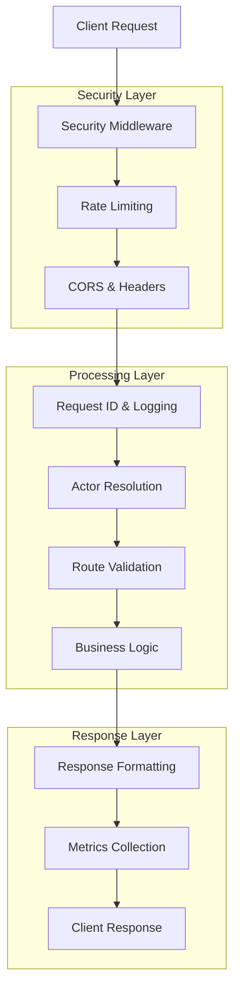

# 🏨 Hospeda API

   

**Modern, secure, and high-performance REST API built with Hono, TypeScript, and comprehensive testing.**

The Hospeda API is a production-ready backend service featuring advanced security, monitoring, error handling, and developer experience tools. Built with TypeScript-first approach and comprehensive documentation.

---

## 🚀 Quick Start

```bash
# Install dependencies
pnpm install

# Start development server
pnpm dev

# Run tests
pnpm test

# Check types
pnpm typecheck

# Lint code
pnpm lint
```

## 🎯 Key Features

- **🔥 High Performance**: Built on Hono framework with minimal overhead
- **🛡️ Enterprise Security**: Comprehensive security headers, rate limiting, input validation
- **📊 Advanced Monitoring**: Built-in metrics, logging, and performance tracking
- **🎨 Developer Experience**: Type-safe APIs, auto-generated documentation, comprehensive testing
- **🔄 Error Handling**: User-friendly error messages with detailed validation feedback
- **🌍 Production Ready**: Docker support, CI/CD integration, environment-based configuration

---

## 📚 Complete Documentation

### 🏗️ **Core Architecture**

| Document | Description |
|----------|-------------|
| [**Complete API Guide**](./docs/COMPLETE_API_GUIDE.md) | 📖 Comprehensive API documentation and architecture overview |
| [**Route Factory System**](./docs/ROUTE_FACTORY_SYSTEM.md) | 🏭 Advanced route creation system with automatic validation and documentation |
| [**Actor System**](./docs/ACTOR_SYSTEM.md) | 👥 Authentication, authorization, and user context management |
| [**Environment Variables**](./docs/ENVIRONMENT_VARIABLES.md) | ⚙️ Complete configuration reference and environment setup |

### 🛡️ **Security & Performance**

| Document | Description |
|----------|-------------|
| [**Security Configuration**](./docs/SECURITY_CONFIG.md) | 🔒 Security headers, CORS, rate limiting, and vulnerability protection |
| [**Metrics System**](./docs/METRICS_SYSTEM.md) | 📊 Advanced monitoring, performance tracking, and analytics |
| [**Error Handling**](./docs/ERROR_HANDLING.md) | 🔄 Comprehensive error management with user-friendly responses |

### 🧪 **Development & Testing**

| Document | Description |
|----------|-------------|
| [**Testing Guide**](./docs/TESTING_GUIDE.md) | 🧪 Complete testing strategy: unit, integration, performance, and security tests |
| [**Security Headers Bug**](./docs/SECURITY_HEADERS_BUG.md) | 🐛 Case study of bug resolution process and middleware refactoring |

---

## 🏗️ Architecture Overview



### **Key Components**

- **🛡️ Security Stack**: Headers, CORS, rate limiting, input validation
- **🎭 Actor System**: User authentication and authorization with role-based permissions
- **🏭 Route Factories**: Type-safe route creation with automatic validation and documentation
- **📊 Metrics Engine**: Real-time performance monitoring with memory management
- **🔄 Error System**: Comprehensive error handling with user-friendly messages
- **🧪 Testing Suite**: Unit, integration, performance, and security testing

---

## 📊 API Endpoints

### **Public Endpoints**

```http
GET    /health                    # Health check
GET    /metrics                   # System metrics (JSON/Prometheus)
GET    /api/v1/public/users       # User listing (paginated)
GET    /api/v1/public/accommodations  # Accommodation listing
```

### **Documentation Endpoints**

```http
GET    /docs                      # API documentation
GET    /reference                 # API reference
GET    /ui                        # API UI/Explorer
```

### **Example API Response**

```json
{
  "success": true,
  "data": {
    "users": [...],
    "pagination": {
      "page": 1,
      "limit": 10,
      "total": 156,
      "totalPages": 16
    }
  },
  "metadata": {
    "timestamp": "2024-12-19T10:30:00.000Z",
    "requestId": "req_123abc",
    "responseTime": 45
  }
}
```

---

## 🛡️ Security Features

### **Implemented Protections**

- ✅ **Security Headers**: CSP, HSTS, X-Frame-Options, X-Content-Type-Options
- ✅ **Rate Limiting**: IP-based with configurable windows and limits
- ✅ **Input Validation**: Comprehensive Zod schemas with user-friendly error messages
- ✅ **CORS Protection**: Configurable origin validation
- ✅ **XSS Prevention**: Output sanitization and CSP policies
- ✅ **SQL Injection Prevention**: Parameterized queries and input validation

### **Security Testing**

```bash
# Run security test suite
pnpm test:security

# Test rate limiting
pnpm test test/security/rate-limiting.test.ts

# Test input validation
pnpm test test/security/validation.test.ts
```

---

## 📊 Performance & Monitoring

### **Built-in Metrics**

- **Request Metrics**: Count, response times, success rates, status code distribution
- **Performance**: P95/P99 percentiles, throughput, latency tracking  
- **System Health**: Memory usage, active connections, error rates
- **Security Events**: Rate limit violations, authentication failures

### **Monitoring Endpoints**

```bash
# Get metrics in JSON format
curl http://localhost:3001/metrics

# Get Prometheus format
curl http://localhost:3001/metrics?format=prometheus

# Get detailed breakdown
curl http://localhost:3001/metrics?detailed=true
```

### **Performance Benchmarks**

- **Health Check**: < 100ms response time
- **API Endpoints**: < 500ms average response time
- **Concurrent Load**: 50+ requests/second sustained
- **Memory Usage**: < 50MB baseline with automatic cleanup

---

## 🧪 Testing Strategy

### **Test Coverage**

- **Unit Tests**: Utilities, middleware, route factories
- **Integration Tests**: Full API endpoint testing
- **Performance Tests**: Load testing and benchmarking
- **Security Tests**: Vulnerability and penetration testing

### **Running Tests**

```bash
# All tests with coverage
pnpm test:coverage

# Test categories
pnpm test:unit           # Unit tests only
pnpm test:integration    # Integration tests only
pnpm test:security       # Security tests only
pnpm test:performance    # Performance tests only

# Watch mode during development
pnpm test:watch

# UI mode for interactive testing
pnpm test:ui
```

### **Test Results**

- ✅ **Coverage**: >90% code coverage across all modules
- ✅ **Performance**: All endpoints meet response time requirements
- ✅ **Security**: Passes penetration testing and vulnerability scans
- ✅ **Reliability**: Zero flaky tests, deterministic results

---

## ⚙️ Configuration

### **Environment Setup**

```bash
# Copy environment template
cp .env.example .env

# Edit configuration
nano .env
```

### **Key Configuration Areas**

- **🛡️ Security**: Rate limiting, CORS, security headers
- **📊 Monitoring**: Metrics collection, logging levels
- **🔐 Authentication**: Clerk integration, JWT settings
- **🚀 Performance**: Memory limits, cleanup intervals

See [Environment Variables Guide](./docs/ENVIRONMENT_VARIABLES.md) for complete configuration reference.

---

## 🔧 Development Workflow

### **Development Commands**

```bash
# Start development server with hot reload
pnpm dev

# Type checking in watch mode
pnpm typecheck --watch

# Linting with auto-fix
pnpm lint --fix

# Run tests in watch mode
pnpm test:watch
```

### **Code Quality Standards**

- **TypeScript**: Strict mode enabled, no `any` types
- **ESLint + Biome**: Comprehensive linting rules
- **Testing**: >90% code coverage requirement
- **Documentation**: JSDoc for all exported functions

### **Git Workflow**

```bash
# Feature development
git checkout -b feature/new-endpoint
git commit -m "feat: add new user endpoint"

# Before pushing
pnpm typecheck    # Must pass
pnpm lint        # Must pass  
pnpm test:run    # Must pass
```

---

## 🚀 Deployment

### **Production Checklist**

- [ ] Environment variables configured
- [ ] Security headers enabled
- [ ] Rate limiting configured
- [ ] Monitoring endpoints secured
- [ ] SSL certificates valid
- [ ] Database connections secured
- [ ] Log aggregation configured

### **Docker Deployment**

```dockerfile
# Production-ready Dockerfile included
docker build -t hospeda-api .
docker run -p 3001:3001 hospeda-api
```

### **Health Monitoring**

```bash
# Health check endpoint
curl http://your-api.com/health

# Metrics monitoring
curl http://your-api.com/metrics
```

---

## 📈 Metrics & Analytics

### **Key Performance Indicators**

- **Availability**: >99.9% uptime target
- **Response Time**: <500ms average, <1s P99
- **Throughput**: >100 requests/second capacity
- **Error Rate**: <1% of all requests

### **Monitoring Integration**

- **Prometheus**: Native metrics export
- **Grafana**: Dashboard templates included
- **Alerting**: Configurable thresholds and notifications
- **Logging**: Structured JSON logs with correlation IDs

---

## 🤝 Contributing

### **Development Setup**

1. Fork the repository
2. Install dependencies: `pnpm install`
3. Copy environment: `cp .env.example .env`
4. Start development: `pnpm dev`
5. Run tests: `pnpm test`

### **Pull Request Process**

1. Create feature branch
2. Write tests for new functionality
3. Ensure all tests pass
4. Update documentation if needed
5. Submit pull request

### **Code Standards**

- Follow TypeScript strict mode
- Write comprehensive tests
- Document public APIs with JSDoc
- Follow conventional commit messages

---

## 📝 License & Support

**License**: MIT License - see LICENSE file for details

**Support**:

- 📖 Check the documentation in `/docs`
- 🐛 Report issues via GitHub Issues
- 💬 Join our development Discord

**Maintainers**:

- Development Team (@hospeda-dev)
- Security Team (@hospeda-security)

---

## 📋 Documentation Index

### **📖 Complete Documentation**

- [Complete API Guide](./docs/COMPLETE_API_GUIDE.md) - Full API documentation
- [Route Factory System](./docs/ROUTE_FACTORY_SYSTEM.md) - Advanced route creation
- [Actor System](./docs/ACTOR_SYSTEM.md) - Authentication & authorization

### **🛡️ Security & Performance**  

- [Security Configuration](./docs/SECURITY_CONFIG.md) - Security setup & best practices
- [Metrics System](./docs/METRICS_SYSTEM.md) - Monitoring & performance tracking
- [Error Handling](./docs/ERROR_HANDLING.md) - Error management system

### **⚙️ Configuration & Testing**

- [Environment Variables](./docs/ENVIRONMENT_VARIABLES.md) - Configuration reference
- [Testing Guide](./docs/TESTING_GUIDE.md) - Testing strategy & utilities
- [Security Headers Bug](./docs/SECURITY_HEADERS_BUG.md) - Bug resolution case study

---

*Built with ❤️ by the Hospeda team. Last updated: 2024-12-19*
