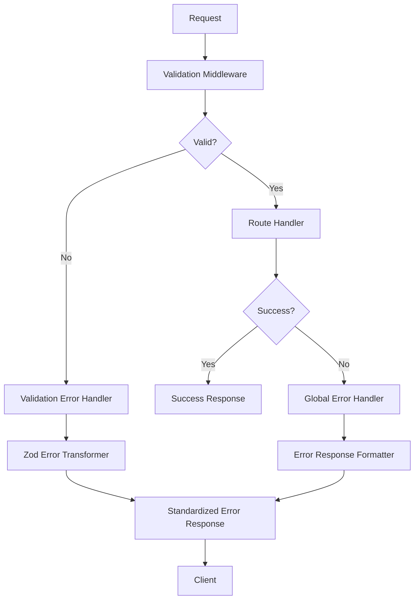

# 🔄 Error Handling System

## Overview

The Hospeda API implements a comprehensive error handling system that provides consistent, user-friendly error responses while maintaining security and debugging capabilities. The system transforms technical errors into actionable feedback for developers and end users.

## 🎯 Core Principles

- **🎨 User-Friendly**: Clear, actionable error messages
- **🔒 Secure**: No sensitive information exposure
- **🔍 Debuggable**: Rich context for development
- **📊 Consistent**: Standardized error format
- **🌍 Localized**: Multi-language error support
- **⚡ Performance**: Minimal overhead error processing

---

## 🏗️ Error Architecture

### **Error Flow**


### **Error Types Hierarchy**
```typescript
interface ErrorResponse {
  success: false;
  error: {
    code: string;           // Machine-readable error code
    message: string;        // Developer message (English)
    translatedMessage?: string; // User message (localized)
    userFriendlyMessage?: string; // Simplified user message
    details?: ErrorDetail[]; // Detailed error breakdown
    suggestion?: string;     // How to fix the error
    retryable?: boolean;    // Can the request be retried?
  };
  metadata: {
    timestamp: string;
    requestId: string;
    traceId?: string;
  };
}
```

---

## 🛠️ Error Types & Handling

### **1. Validation Errors (400)**
Handled by Zod Error Transformer for detailed, user-friendly validation feedback.

```typescript
// Input
{
  "email": "invalid-email",
  "age": "not-a-number",
  "password": "123"
}

// Output
{
  "success": false,
  "error": {
    "code": "VALIDATION_ERROR",
    "message": "Request validation failed",
    "userFriendlyMessage": "Please check the following fields and try again",
    "details": [
      {
        "field": "email",
        "message": "Invalid email format",
        "userFriendlyMessage": "Please enter a valid email address",
        "suggestion": "Use format: name@domain.com",
        "value": "invalid-email"
      },
      {
        "field": "age",
        "message": "Expected number, received string",
        "userFriendlyMessage": "Age must be a number",
        "suggestion": "Enter your age as a number (e.g., 25)",
        "value": "not-a-number"
      },
      {
        "field": "password",
        "message": "String must contain at least 8 character(s)",
        "userFriendlyMessage": "Password must be at least 8 characters long",
        "suggestion": "Try adding more characters. Minimum required: 8",
        "value": "[REDACTED]"
      }
    ],
    "summary": {
      "totalErrors": 3,
      "fieldCount": 3,
      "mostCommonError": "format_validation"
    }
  }
}
```

### **2. Authentication Errors (401)**
```typescript
{
  "success": false,
  "error": {
    "code": "AUTHENTICATION_REQUIRED",
    "message": "Valid authentication token required",
    "userFriendlyMessage": "Please log in to access this resource",
    "suggestion": "Sign in to your account or create a new account",
    "retryable": true
  }
}
```

### **3. Authorization Errors (403)**
```typescript
{
  "success": false,
  "error": {
    "code": "INSUFFICIENT_PERMISSIONS",
    "message": "User lacks required permissions for this action",
    "userFriendlyMessage": "You don't have permission to perform this action",
    "suggestion": "Contact an administrator for access",
    "retryable": false
  }
}
```

### **4. Not Found Errors (404)**
```typescript
{
  "success": false,
  "error": {
    "code": "RESOURCE_NOT_FOUND",
    "message": "The requested resource was not found",
    "userFriendlyMessage": "The item you're looking for doesn't exist",
    "suggestion": "Check the URL or try searching for similar items",
    "retryable": false
  }
}
```

### **5. Rate Limiting Errors (429)**
```typescript
{
  "success": false,
  "error": {
    "code": "RATE_LIMIT_EXCEEDED",
    "message": "Too many requests. Rate limit exceeded",
    "userFriendlyMessage": "You're sending requests too quickly",
    "suggestion": "Please wait a moment before trying again",
    "retryable": true,
    "retryAfter": 60
  }
}
```

### **6. Server Errors (500)**
```typescript
// Production
{
  "success": false,
  "error": {
    "code": "INTERNAL_SERVER_ERROR",
    "message": "An unexpected error occurred",
    "userFriendlyMessage": "Something went wrong on our end",
    "suggestion": "Please try again later or contact support",
    "retryable": true
  }
}

// Development (includes stack trace)
{
  "success": false,
  "error": {
    "code": "INTERNAL_SERVER_ERROR",
    "message": "Database connection failed",
    "userFriendlyMessage": "Something went wrong on our end",
    "details": [
      {
        "stack": "Error: Connection timeout\n    at Database.connect...",
        "query": "SELECT * FROM users WHERE id = $1",
        "parameters": "[REDACTED]"
      }
    ]
  }
}
```

---

## 🎨 Zod Error Transformer

### **Advanced Validation Error Processing**

The Zod Error Transformer converts technical validation errors into user-friendly messages:

```typescript
// src/utils/zod-error-transformer.ts

// Transform raw Zod errors
export const transformZodError = (error: ZodError): ValidationErrorResponse => {
  const details = error.issues.map(issue => ({
    field: issue.path.join('.'),
    message: issue.message,
    userFriendlyMessage: generateUserFriendlyMessage(issue),
    suggestion: generateSuggestion(issue),
    value: sanitizeValue(issue.received)
  }));

  return {
    code: 'VALIDATION_ERROR',
    message: 'Request validation failed',
    userFriendlyMessage: generateOverallMessage(details),
    details,
    summary: createErrorSummary(details)
  };
};
```

### **User-Friendly Message Generation**
```typescript
const generateUserFriendlyMessage = (issue: ZodIssue): string => {
  const fieldName = formatFieldName(issue.path.join('.'));
  
  switch (issue.code) {
    case 'too_small':
      if (issue.type === 'string') {
        return `${fieldName} must be at least ${issue.minimum} characters long`;
      }
      if (issue.type === 'number') {
        return `${fieldName} must be at least ${issue.minimum}`;
      }
      break;
      
    case 'invalid_type':
      return `${fieldName} must be a ${issue.expected}`;
      
    case 'invalid_string':
      if (issue.validation === 'email') {
        return `${fieldName} must be a valid email address`;
      }
      if (issue.validation === 'url') {
        return `${fieldName} must be a valid URL`;
      }
      break;
      
    case 'invalid_enum_value':
      return `${fieldName} must be one of: ${issue.options.join(', ')}`;
  }
  
  return `${fieldName} is invalid`;
};
```

### **Helpful Suggestions**
```typescript
const generateSuggestion = (issue: ZodIssue): string | undefined => {
  switch (issue.code) {
    case 'too_small':
      if (issue.type === 'string') {
        return `Try adding more characters. Minimum required: ${issue.minimum}`;
      }
      break;
      
    case 'invalid_string':
      if (issue.validation === 'email') {
        return 'Use format: name@domain.com';
      }
      if (issue.validation === 'url') {
        return 'Use format: https://example.com';
      }
      break;
      
    case 'invalid_enum_value':
      const limitedOptions = issue.options.slice(0, 3).join(', ');
      return `Try one of these: ${limitedOptions}${issue.options.length > 3 ? '...' : ''}`;
  }
  
  return undefined;
};
```

---

## 🌍 Internationalization

### **Multi-Language Error Support**
```typescript
// src/utils/error-i18n.ts
const ERROR_MESSAGES = {
  en: {
    VALIDATION_ERROR: 'Request validation failed',
    AUTHENTICATION_REQUIRED: 'Please log in to access this resource',
    INSUFFICIENT_PERMISSIONS: 'You don\'t have permission to perform this action',
    RESOURCE_NOT_FOUND: 'The item you\'re looking for doesn\'t exist',
    RATE_LIMIT_EXCEEDED: 'You\'re sending requests too quickly',
    INTERNAL_SERVER_ERROR: 'Something went wrong on our end'
  },
  es: {
    VALIDATION_ERROR: 'La validación de la solicitud falló',
    AUTHENTICATION_REQUIRED: 'Por favor inicia sesión para acceder a este recurso',
    INSUFFICIENT_PERMISSIONS: 'No tienes permisos para realizar esta acción',
    RESOURCE_NOT_FOUND: 'El elemento que buscas no existe',
    RATE_LIMIT_EXCEEDED: 'Estás enviando solicitudes muy rápidamente',
    INTERNAL_SERVER_ERROR: 'Algo salió mal de nuestro lado'
  }
};

export const translateError = (code: string, locale: string = 'en'): string => {
  return ERROR_MESSAGES[locale]?.[code] || ERROR_MESSAGES.en[code] || code;
};
```

### **Locale Detection**
```typescript
// Automatic locale detection from headers
const detectLocale = (c: Context): string => {
  const acceptLanguage = c.req.header('Accept-Language');
  const userLocale = c.req.header('X-User-Locale');
  
  return userLocale || 
         acceptLanguage?.split(',')[0]?.split('-')[0] || 
         'en';
};
```

---

## 🔒 Security Considerations

### **Information Disclosure Prevention**
```typescript
const sanitizeError = (error: Error, isProduction: boolean): ErrorInfo => {
  if (isProduction) {
    // Remove sensitive information in production
    return {
      message: 'An unexpected error occurred',
      stack: undefined,
      details: undefined
    };
  }
  
  // Include debugging info in development
  return {
    message: error.message,
    stack: error.stack,
    details: extractErrorDetails(error)
  };
};
```

### **Value Sanitization**
```typescript
const sanitizeValue = (value: unknown): unknown => {
  if (typeof value === 'string') {
    // Redact password-like fields
    if (isPasswordField(value)) {
      return '[REDACTED]';
    }
    
    // Truncate long values
    if (value.length > 100) {
      return value.substring(0, 100) + '...';
    }
  }
  
  return value;
};

const isPasswordField = (fieldPath: string): boolean => {
  const passwordFields = ['password', 'secret', 'token', 'key'];
  return passwordFields.some(field => 
    fieldPath.toLowerCase().includes(field)
  );
};
```

---

## 🧪 Testing Error Handling

### **Error Response Testing**
```typescript
describe('Error Handling', () => {
  it('should return validation errors with user-friendly messages', async () => {
    const response = await app.request('/api/users', {
      method: 'POST',
      headers: { 'Content-Type': 'application/json' },
      body: JSON.stringify({
        email: 'invalid-email',
        age: 'not-a-number'
      })
    });
    
    const data = await response.json();
    
    expect(response.status).toBe(400);
    expect(data.success).toBe(false);
    expect(data.error.code).toBe('VALIDATION_ERROR');
    expect(data.error.details).toHaveLength(2);
    
    // Check user-friendly messages
    const emailError = data.error.details.find(d => d.field === 'email');
    expect(emailError.userFriendlyMessage).toBe('Please enter a valid email address');
    expect(emailError.suggestion).toBe('Use format: name@domain.com');
  });
  
  it('should handle authentication errors', async () => {
    const response = await app.request('/api/protected');
    const data = await response.json();
    
    expect(response.status).toBe(401);
    expect(data.error.code).toBe('AUTHENTICATION_REQUIRED');
    expect(data.error.retryable).toBe(true);
  });
  
  it('should localize error messages', async () => {
    const response = await app.request('/api/invalid', {
      headers: { 'Accept-Language': 'es' }
    });
    
    const data = await response.json();
    expect(data.error.translatedMessage).toMatch(/español/);
  });
});
```

### **Error Boundary Testing**
```typescript
describe('Error Boundaries', () => {
  it('should catch and handle unexpected errors', async () => {
    // Mock a service to throw an error
    vi.spyOn(userService, 'getById').mockRejectedValue(
      new Error('Database connection failed')
    );
    
    const response = await app.request('/api/users/123');
    const data = await response.json();
    
    expect(response.status).toBe(500);
    expect(data.error.code).toBe('INTERNAL_SERVER_ERROR');
    expect(data.error.userFriendlyMessage).toBe('Something went wrong on our end');
    
    // Should not expose internal error details in production
    if (process.env.NODE_ENV === 'production') {
      expect(data.error.details).toBeUndefined();
    }
  });
});
```

---

## 📊 Error Monitoring

### **Error Tracking Integration**
```typescript
// src/utils/error-tracking.ts
import { captureException, captureMessage } from '@sentry/node';

export const trackError = (error: Error, context: ErrorContext) => {
  // Add contextual information
  const tags = {
    endpoint: context.endpoint,
    method: context.method,
    userId: context.actor?.type === 'USER' ? context.actor.user.id : 'anonymous',
    requestId: context.requestId
  };
  
  // Track in external service
  captureException(error, { tags, extra: context });
  
  // Log locally
  logger.error('Application error', {
    error: error.message,
    stack: error.stack,
    ...tags
  });
};
```

### **Error Metrics**
```typescript
// Automatic error rate tracking
export const recordErrorMetric = (errorCode: string, endpoint: string) => {
  metricsService.increment('api.errors.total', {
    code: errorCode,
    endpoint,
    timestamp: Date.now()
  });
  
  // Alert on high error rates
  const errorRate = metricsService.getErrorRate(endpoint);
  if (errorRate > 5) { // > 5% error rate
    alertingService.sendAlert({
      level: 'warning',
      message: `High error rate on ${endpoint}: ${errorRate}%`,
      endpoint,
      errorRate
    });
  }
};
```

---

## 🚀 Production Best Practices

### **Error Logging Strategy**
```typescript
// Different log levels for different error types
const logError = (error: ErrorInfo, context: RequestContext) => {
  switch (error.statusCode) {
    case 400: // Client errors - info level
      logger.info('Client error', { error, context });
      break;
      
    case 401:
    case 403: // Auth errors - warn level
      logger.warn('Authentication/Authorization error', { error, context });
      break;
      
    case 429: // Rate limiting - debug level
      logger.debug('Rate limit exceeded', { error, context });
      break;
      
    case 500: // Server errors - error level
      logger.error('Server error', { error, context });
      trackError(error.originalError, context);
      break;
  }
};
```

### **Performance Optimization**
```typescript
// Cache error messages to avoid repeated processing
const errorMessageCache = new Map<string, string>();

const getCachedErrorMessage = (code: string, locale: string): string => {
  const key = `${code}:${locale}`;
  
  if (!errorMessageCache.has(key)) {
    errorMessageCache.set(key, translateError(code, locale));
  }
  
  return errorMessageCache.get(key)!;
};

// Async error processing for non-critical errors
const processErrorAsync = async (error: Error, context: RequestContext) => {
  // Don't block the response for these operations
  setImmediate(() => {
    trackError(error, context);
    updateErrorMetrics(error, context);
    checkErrorPatterns(error, context);
  });
};
```

---

## 📚 Related Documentation

- [Zod Error Transformer](./ZOD_ERROR_SYSTEM.md) - Detailed validation error handling
- [Validation System](./COMPLETE_API_GUIDE.md#validation-system) - Request validation
- [Metrics System](./METRICS_SYSTEM.md) - Error rate monitoring
- [Security Configuration](./SECURITY_CONFIG.md) - Security error handling
- [Testing Guide](./TESTING_GUIDE.md) - Testing error scenarios

---

*The error handling system ensures consistent, secure, and user-friendly error responses across the entire API. Last updated: 2024-12-19*
