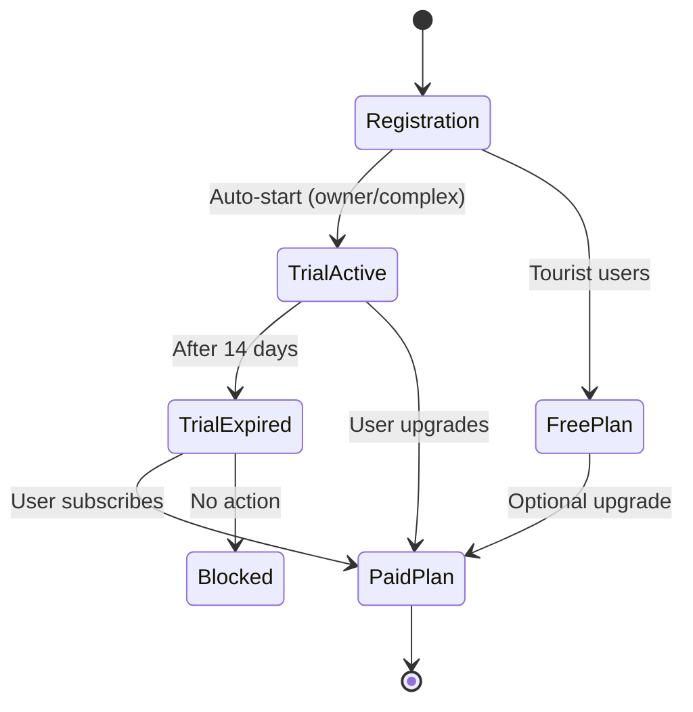
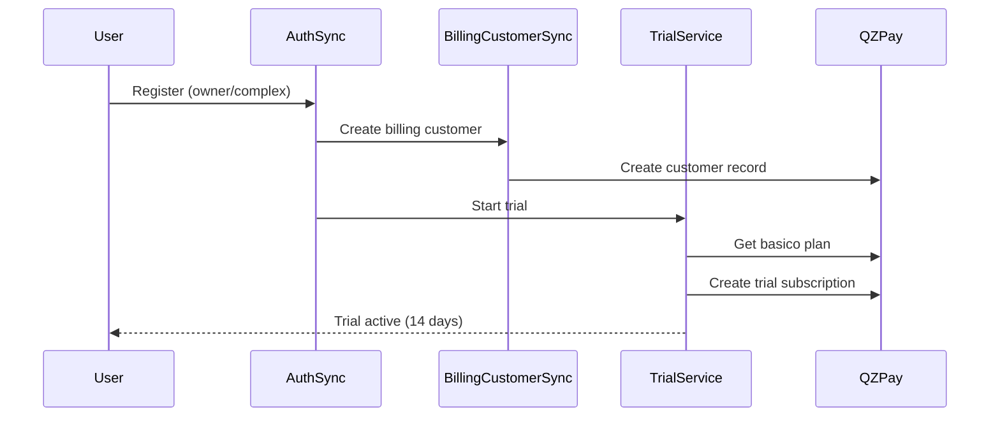

# Trial System Documentation

## Overview

The Hospeda platform provides a 14-day trial period for owner and complex users. This document describes the trial system implementation, lifecycle, and integration points.

## Features

- **Auto-start**: Trial starts automatically when owner/complex users register
- **14-day countdown**: Trial expires after 14 days from start
- **Auto-block**: Dashboard access is blocked when trial expires
- **Data preservation**: All user data is preserved when trial expires
- **Easy upgrade**: Users can upgrade to paid plan at any time
- **Batch expiry checking**: Cron job to block all expired trials

## User Types and Trial Eligibility

| User Role | Maps To | Trial Eligible | Trial Plan | Trial Duration |
|-----------|---------|---------------|------------|----------------|
| HOST | Owner | ✅ Yes | owner-basico | 14 days |
| USER | Tourist | ❌ No | tourist-free (permanent) | N/A |
| GUEST | Tourist | ❌ No | N/A | N/A |
| Other roles | N/A | ❌ No | N/A | N/A |

**Note**: Complex/Hotel accounts will use a different role (TBD) and will get `complex-basico` plan trial when implemented.

## Trial Lifecycle



## Architecture

### Components

1. **TrialService** (`services/trial.service.ts`)
   - Core business logic for trial management
   - Methods: startTrial, getTrialStatus, checkTrialExpiry, blockExpiredTrials, reactivateFromTrial

2. **Trial Middleware** (`middlewares/trial.ts`)
   - Blocks access to protected routes when trial expired
   - Returns 402 Payment Required
   - Allows access to billing and export routes

3. **Trial Routes** (`routes/billing/trial.ts`)
   - GET /api/v1/billing/trial/status - Get trial status
   - POST /api/v1/billing/trial/start - Start trial (internal)
   - POST /api/v1/billing/trial/check-expiry - Batch expiry check (admin)

4. **Auth Sync Integration** (`routes/auth/sync.ts`)
   - Auto-starts trial when new owner/complex user registers
   - Creates billing customer → starts trial subscription

### Data Flow



## API Reference

### Get Trial Status

```http
GET /api/v1/billing/trial/status
Authorization: Bearer <token>
```

**Response:**

```json
{
  "isOnTrial": true,
  "isExpired": false,
  "startedAt": "2024-01-01T00:00:00.000Z",
  "expiresAt": "2024-01-15T00:00:00.000Z",
  "daysRemaining": 7,
  "planSlug": "owner-basico"
}
```

### Start Trial (Internal)

```http
POST /api/v1/billing/trial/start
Content-Type: application/json

{
  "customerId": "billing_customer_id",
  "userType": "owner" | "complex"
}
```

**Response:**

```json
{
  "success": true,
  "subscriptionId": "sub_xyz",
  "message": "Trial started successfully"
}
```

### Check Expired Trials (Admin)

```http
POST /api/v1/billing/trial/check-expiry
Authorization: Bearer <admin-token>
```

**Response:**

```json
{
  "success": true,
  "blockedCount": 5,
  "message": "Successfully blocked 5 expired trial(s)"
}
```

## Trial Middleware Behavior

### Blocked Routes (when trial expired)

All routes **except** the following are blocked:

- `/api/v1/billing/*` - Billing management
- `/api/v1/export/*` - Data export
- `/health`, `/docs`, `/reference`, `/ui` - Documentation and health

### Error Response

When access is blocked due to expired trial:

```json
{
  "error": "Your trial has expired. Please upgrade your subscription to continue using this feature.",
  "code": "TRIAL_EXPIRED",
  "trialStatus": {
    "isOnTrial": true,
    "isExpired": true,
    "expiresAt": "2024-01-15T00:00:00.000Z",
    "daysRemaining": 0
  },
  "upgradeUrl": "/billing/plans"
}
```

**HTTP Status**: 402 Payment Required

## Usage Examples

### Check Trial Status in Route Handler

```typescript
import { checkTrialStatus } from '../middlewares/trial';

app.get('/dashboard', async (c) => {
  const trialStatus = await checkTrialStatus(c);

  if (trialStatus?.isOnTrial && trialStatus.daysRemaining <= 3) {
    // Show trial expiring warning
    return c.json({
      warning: `Your trial expires in ${trialStatus.daysRemaining} days`,
      data: dashboardData
    });
  }

  return c.json({ data: dashboardData });
});
```

### Require Active Subscription

```typescript
import { requireActiveSubscription } from '../middlewares/trial';

app.post(
  '/premium-feature',
  requireActiveSubscription(),
  async (c) => {
    // User has active subscription or valid trial
    return c.json({ success: true });
  }
);
```

### Apply Trial Middleware Globally

```typescript
import { trialMiddleware } from './middlewares/trial';

// Apply after auth and billing customer middleware
app.use('*', actorMiddleware());
app.use('*', billingCustomerMiddleware());
app.use('*', trialMiddleware());
```

## Batch Expiry Check (Cron Job)

The trial system includes a batch operation to check and block expired trials. This should be run daily via cron.

### Setup Cron Job

```bash
# Daily at 2 AM
0 2 * * * curl -X POST https://api.hospeda.com/api/v1/billing/trial/check-expiry -H "Authorization: Bearer <admin-token>"
```

### Manual Trigger

```bash
curl -X POST http://localhost:3001/api/v1/billing/trial/check-expiry \
  -H "Authorization: Bearer <admin-token>"
```

## Integration Points

### 1. User Registration Flow

When a new owner or complex user registers:

1. Clerk auth creates user
2. Auth sync creates DB user record
3. Billing customer sync creates billing customer
4. **Trial service auto-starts 14-day trial**
5. User gets full Basico plan access

### 2. Dashboard Access

When user accesses protected routes:

1. Auth middleware validates token
2. Billing customer middleware loads customer
3. **Trial middleware checks expiry**
4. If expired: return 402, block access
5. If active: continue to route handler

### 3. Subscription Upgrade

When user upgrades from trial:

1. User selects new plan
2. Create checkout session
3. User completes payment
4. **Trial service cancels trial subscription**
5. **Trial service creates paid subscription**
6. User gets full plan access

## Testing

### Unit Tests

```bash
cd apps/api
pnpm test test/services/trial.service.test.ts
```

### Manual Testing Scenarios

1. **New owner registration**
   - Register as owner
   - Verify trial auto-starts
   - Check trial status endpoint

2. **Trial expiry**
   - Manually set trial end date to past
   - Try accessing protected route
   - Verify 402 error

3. **Billing route access**
   - Expire trial
   - Access /api/v1/billing/trial/status
   - Verify access allowed

4. **Batch expiry check**
   - Create multiple expired trials
   - Call check-expiry endpoint
   - Verify all blocked

## Monitoring and Logging

### Trial Events Logged

- Trial start (INFO)
- Trial status check (DEBUG)
- Trial expiry warning (<3 days, WARN)
- Trial access blocked (WARN)
- Batch expiry check results (INFO)

### Log Examples

```
INFO: Trial subscription created successfully
  customerId: cus_xyz
  subscriptionId: sub_abc
  planSlug: owner-basico
  trialEnd: 2024-01-15T00:00:00.000Z

WARN: Trial expiring soon
  customerId: cus_xyz
  daysRemaining: 2
  expiresAt: 2024-01-15T00:00:00.000Z

WARN: Blocked access due to expired trial
  customerId: cus_xyz
  path: /api/v1/accommodations
  expiresAt: 2024-01-15T00:00:00.000Z
```

## Best Practices

1. **Auto-start trials** - Never require manual trial activation
2. **Preserve data** - Always soft-block, never delete on expiry
3. **Clear messaging** - Show days remaining prominently
4. **Easy upgrade** - One-click upgrade from trial
5. **Allow billing access** - Users must be able to manage subscription
6. **Run daily cron** - Ensure expired trials are blocked promptly
7. **Log all events** - Track trial lifecycle for analytics

## Troubleshooting

### Trial not starting for new user

Check:

- Is user type owner or complex?
- Is billing enabled?
- Does basico plan exist in database?
- Check logs for errors in auth sync

### User blocked but trial should be active

Check:

- Trial end date in subscription
- System clock (timezone issues)
- Middleware order (trial middleware after auth)

### Batch expiry not working

Check:

- Billing service configured?
- Admin authentication on endpoint
- Subscription status in database

## Future Enhancements

- [ ] Trial extension for support cases
- [ ] Custom trial duration per user
- [ ] Trial usage analytics
- [ ] Email notifications before expiry
- [ ] Automatic payment retry on expiry
- [ ] Trial conversion rate tracking
