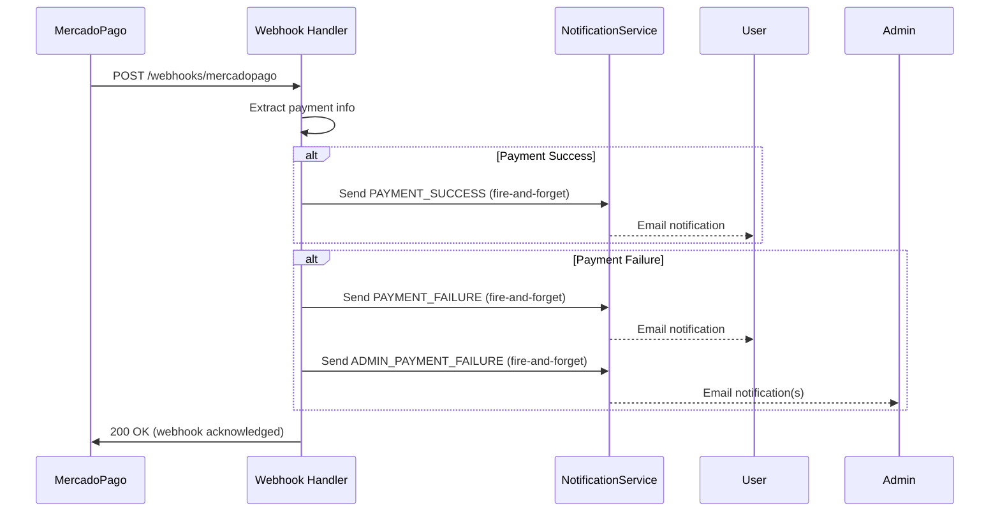

# Payment Notifications Implementation

## Overview

Payment success/failure notifications are automatically sent when MercadoPago webhook events are processed. These notifications are sent using the fire-and-forget pattern to prevent webhook processing delays.

## Notification Types

### 1. PAYMENT_SUCCESS

**Sent when:** Payment status is `approved` or `accredited`

**Recipient:** Customer (user who made the payment)

**Payload:**

```ts
{
  type: NotificationType.PAYMENT_SUCCESS,
  recipientEmail: string,        // Customer email
  recipientName: string,          // Customer name or email
  userId: string | null,          // User ID if available
  customerId: string,             // Billing customer ID
  planName: string,               // Subscription plan name
  amount: number,                 // Payment amount
  currency: string,               // Payment currency (e.g., "ARS")
  paymentMethod?: string          // Payment method used (optional)
}
```

### 2. PAYMENT_FAILURE

**Sent when:** Payment status is `rejected`, `cancelled`, or `refunded`

**Recipient:** Customer (user whose payment failed)

**Payload:**

```ts
{
  type: NotificationType.PAYMENT_FAILURE,
  recipientEmail: string,        // Customer email
  recipientName: string,          // Customer name or email
  userId: string | null,          // User ID if available
  customerId: string,             // Billing customer ID
  planName: string,               // Subscription plan name
  amount: number,                 // Payment amount
  currency: string,               // Payment currency
  failureReason: string,          // Reason for failure (status_detail or status)
  retryDate: string              // ISO date string (3 days from failure)
}
```

### 3. ADMIN_PAYMENT_FAILURE

**Sent when:** Payment fails (same trigger as PAYMENT_FAILURE)

**Recipient:** Admin email list (from `ADMIN_NOTIFICATION_EMAILS` env variable)

**Payload:**

```ts
{
  type: NotificationType.ADMIN_PAYMENT_FAILURE,
  recipientEmail: string,        // Admin email
  recipientName: "Admin",
  userId: null,
  customerId: string,             // Billing customer ID
  affectedUserEmail: string,      // Customer's email
  affectedUserId?: string,        // Customer's user ID if available
  eventDetails: {
    amount: number,
    currency: string,
    failureReason: string,
    planName?: string,
    retryDate: string
  },
  severity: "warning"
}
```

## Implementation Details

### Payment Status Detection

The webhook handler extracts payment information from the MercadoPago event:

```ts
// Payment statuses that trigger SUCCESS notification:
- "approved"
- "accredited"

// Payment statuses that trigger FAILURE notifications:
- "rejected"
- "cancelled"
- "refunded"
```

### Fire-and-Forget Pattern

All notifications use the fire-and-forget pattern:

1. Notifications are sent asynchronously without `await`
2. Errors are caught silently and logged for debugging
3. Webhook processing continues regardless of notification success/failure
4. Failed notifications are handled by the retry service

```ts
sendNotification({...}).catch((error) => {
  apiLogger.debug('Notification failed (will retry)', { error });
});
```

### Admin Email Configuration

Configure admin notification recipients in `.env`:

```env
# Single admin
ADMIN_NOTIFICATION_EMAILS=admin@hospeda.com.ar

# Multiple admins (comma-separated)
ADMIN_NOTIFICATION_EMAILS=admin@hospeda.com.ar,finance@hospeda.com.ar,alerts@hospeda.com.ar
```

If `ADMIN_NOTIFICATION_EMAILS` is not set, admin notifications are skipped silently.

### Retry Logic

Payment failures include a retry date calculated as:

```ts
const retryDate = new Date();
retryDate.setDate(retryDate.getDate() + 3); // 3 days from failure
```

This gives users time to update their payment method before automatic retry.

## Data Flow



## Testing

### Manual Testing

1. **Success Notification:**

```bash
# Trigger approved payment webhook
curl -X POST http://localhost:3001/api/v1/webhooks/mercadopago \
  -H "Content-Type: application/json" \
  -H "x-signature: ts=...,v1=..." \
  -d '{
    "type": "payment",
    "action": "payment.updated",
    "data": {
      "id": "payment-123",
      "status": "approved",
      "transaction_amount": 1500,
      "currency_id": "ARS",
      "payment_method_id": "visa",
      "metadata": {
        "customerId": "cus_123"
      }
    }
  }'
```

2. **Failure Notification:**

```bash
# Trigger rejected payment webhook
curl -X POST http://localhost:3001/api/v1/webhooks/mercadopago \
  -H "Content-Type: application/json" \
  -H "x-signature: ts=...,v1=..." \
  -d '{
    "type": "payment",
    "action": "payment.updated",
    "data": {
      "id": "payment-123",
      "status": "rejected",
      "status_detail": "cc_rejected_insufficient_amount",
      "transaction_amount": 1500,
      "currency_id": "ARS",
      "metadata": {
        "customerId": "cus_123"
      }
    }
  }'
```

### Integration Tests

See `apps/api/test/integration/webhooks/payment-notifications.test.ts` (when implemented in T-024c)

## Logging

Payment notification attempts are logged:

```ts
// Debug logs (verbose)
apiLogger.debug('Payment succeeded - sending success notification', { customerId, amount });
apiLogger.debug('Payment failed - sending failure notifications', { customerId, status });
apiLogger.debug('Notification failed (will retry)', { customerId, error });

// Warning logs
apiLogger.warn('Customer not found for payment failure notification', { customerId });
```

## Edge Cases

1. **Missing customer ID:** Notifications are skipped silently
2. **Customer not found:** Warning logged, notifications skipped
3. **Invalid payment data:** Notifications skipped, webhook continues
4. **Empty admin email list:** Admin notifications skipped silently
5. **Notification service unavailable:** Error logged, retry service handles it

## Related Files

- `apps/api/src/routes/webhooks/mercadopago.ts` - Webhook handler implementation
- `apps/api/src/utils/notification-helper.ts` - Fire-and-forget notification utility
- `packages/notifications/src/types/notification.types.ts` - Notification type definitions
- `.env.example` - Environment variable configuration

## Future Enhancements

- [ ] Configurable retry delay (currently hardcoded to 3 days)
- [ ] Payment method-specific notification templates
- [ ] Notification preferences per customer
- [ ] Webhook replay for failed notifications
- [ ] Admin dashboard for notification monitoring
