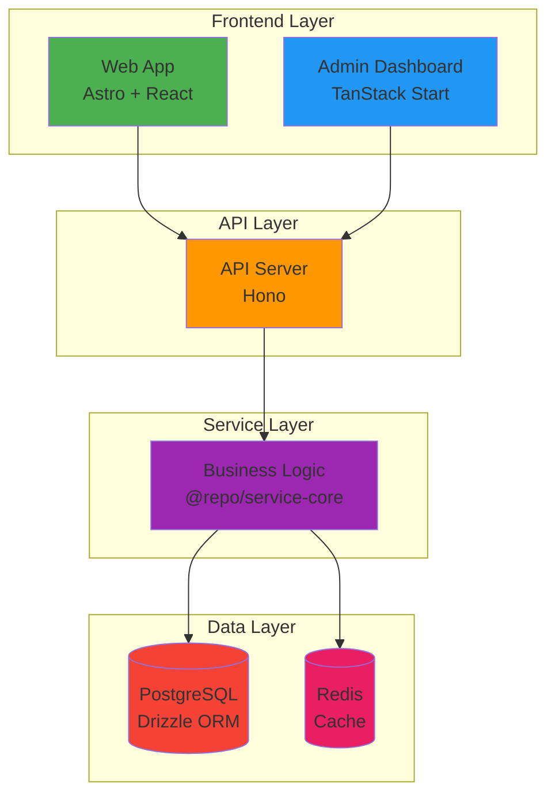
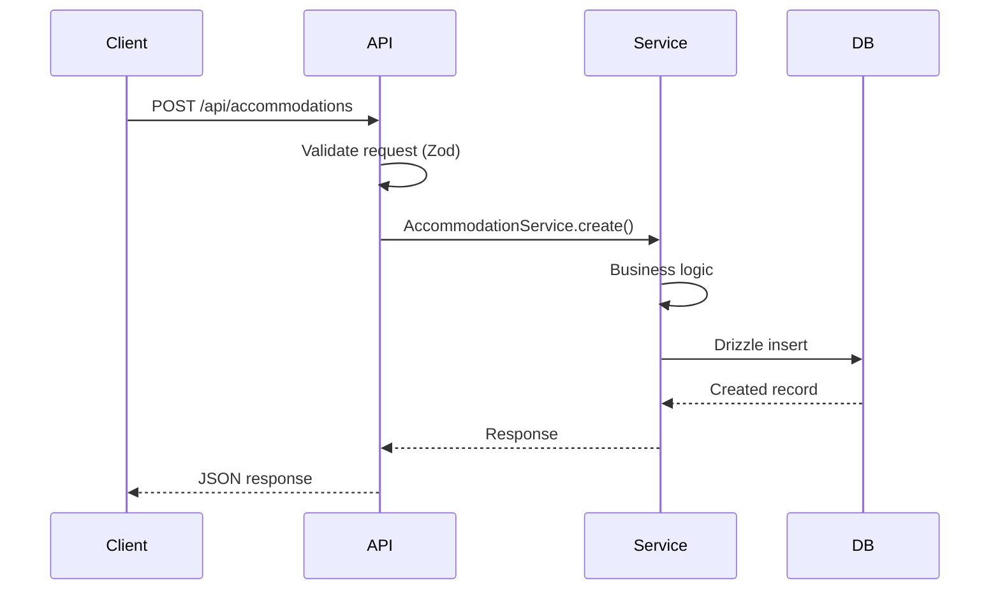

# Architecture

Welcome to Hospeda's architecture documentation. This section covers the system design, technical decisions, and structural patterns that power the platform.

---

## Quick Navigation

### Core Architecture

- [Overview](overview.md) - System design and architecture vision
- [Monorepo Structure](monorepo-structure.md) - Apps, packages, and organization
- [Data Flow](data-flow.md) - Request lifecycle and processing
- [Patterns](patterns.md) - Architectural patterns and conventions

### Technical Details

- [Tech Stack](tech-stack.md) - Technology choices and rationale
- [Layers](layers.md) - Frontend, API, Service, Database layers
- [Type System](type-system.md) - End-to-end type safety

### Deployment & Operations

- [Deployment Architecture](../deployment/architecture.md) - Infrastructure and hosting
- [Environments](../deployment/environments.md) - Development, staging, production
- [Monitoring](../deployment/monitoring.md) - Observability and metrics

---

## Architecture at a Glance

### System Architecture

Hospeda is a modern **monorepo** application with clear separation of concerns:



### Technology Stack

| Layer | Technologies |
|-------|-------------|
| **Frontend** | Astro, React 19, Tailwind CSS, Shadcn UI |
| **API** | Hono, Node.js, Zod |
| **Services** | TypeScript, Zod validation |
| **Database** | PostgreSQL, Drizzle ORM |
| **Cache** | Redis |
| **Auth** | Clerk |
| **Payments** | Mercado Pago |
| **Infrastructure** | Vercel, Neon Cloud, Docker |
| **Monorepo** | TurboRepo, pnpm workspaces |

---

## Core Principles

### 1. Simplicity First (KISS)

- Avoid over-engineering
- Prefer boring, proven technology
- Clear, maintainable code

### 2. Developer Experience

- Fast feedback loops (TDD)
- Comprehensive tooling
- Clear conventions

### 3. Type Safety

- End-to-end type safety
- Database → API → Frontend
- Compile-time error detection

### 4. Separation of Concerns

Each layer has a single responsibility:

```text
Database Schema → Model → Service → API Route → Frontend
```

---

## Learning Path

### For New Developers

**Time:** ~30 minutes

1. Read [Overview](overview.md) (10 min)
2. Review [Monorepo Structure](monorepo-structure.md) (10 min)
3. Understand [Data Flow](data-flow.md) (10 min)

**Next Steps:**

- Follow [Adding a New Entity](../guides/adding-new-entity.md) tutorial
- Study [Patterns](patterns.md) for best practices

### For Experienced Developers

**Time:** ~20 minutes

1. Quick scan [Overview](overview.md)
2. Deep dive [Patterns](patterns.md)
3. Review [Tech Stack](tech-stack.md) rationale

**Next Steps:**

- Review app-specific documentation
- Study [Data Flow](data-flow.md) for request lifecycle

---

## Key Concepts

### Monorepo Organization

```text
hospeda/
├── apps/              # Applications (api, web, admin)
├── packages/          # Shared packages (@repo/*)
└── docs/              # Documentation
```

All apps and packages share code through internal `@repo/*` packages.

### Base Patterns

**BaseModel** - All database models:

```typescript
class UserModel extends BaseModel<typeof userSchema> {
  // Automatic CRUD + validation
}
```

**BaseCrudService** - All business services:

```typescript
class UserService extends BaseCrudService {
  // Business logic + CRUD operations
}
```

### Type Inference

Types are inferred from Zod schemas:

```typescript
const userSchema = z.object({
  email: z.string().email(),
  name: z.string(),
});

type User = z.infer<typeof userSchema>;
```

### Route Factories

API routes use standardized factories:

```typescript
createCRUDRoute({
  path: '/users',
  service: userService,
  schema: userSchema,
});
```

---

## Request Lifecycle

Typical flow through the system:



**Detailed flow:** See [Data Flow](data-flow.md)

---

## Architecture Decisions

### Why Monorepo?

- **Single source of truth** - All code in one place
- **Shared packages** - No npm publishing needed
- **Atomic changes** - Update multiple apps together
- **Better DX** - Unified tooling and scripts

### Why TurboRepo?

- **Fast builds** - Smart caching
- **Parallel execution** - Run tasks in parallel
- **Simple configuration** - Easy setup
- **Great DX** - Excellent developer experience

### Why TypeScript Everywhere?

- **Compile-time errors** - Catch bugs before runtime
- **Better IDE support** - IntelliSense, refactoring
- **Self-documenting** - Types as documentation
- **Safer refactoring** - Confidence in changes

### Why Drizzle over Prisma?

- **SQL-like syntax** - Familiar for SQL developers
- **Type-safe queries** - Full TypeScript support
- **Zero runtime deps** - Smaller bundle size
- **Better performance** - Faster query execution

---

## Documentation Map

### Getting Started

Essential reading for new developers:

1. [Getting Started](../getting-started/README.md) - Setup guide
2. [Architecture Overview](overview.md) - System design
3. [First Contribution](../getting-started/first-contribution.md) - Make your first change

### Architecture Deep Dive

Understanding the system:

- [Overview](overview.md) - High-level design
- [Monorepo Structure](monorepo-structure.md) - Organization
- [Data Flow](data-flow.md) - Request lifecycle
- [Patterns](patterns.md) - Code patterns
- [Tech Stack](tech-stack.md) - Technology decisions

### App-Specific

Each app has detailed documentation:

- [API Documentation](../../apps/api/docs/README.md)
- [Web Documentation](../../apps/web/docs/README.md)
- [Admin Documentation](../../apps/admin/docs/README.md)

### Package Documentation

Core packages:

- [@repo/db](../../packages/db/docs/README.md) - Database layer
- [@repo/service-core](../../packages/service-core/docs/README.md) - Business logic
- [@repo/schemas](../../packages/schemas/docs/README.md) - Validation

---

## Architecture Diagrams

All diagrams use Mermaid and render on GitHub.

### Available Diagrams

- **System Architecture** - High-level component view ([Overview](overview.md))
- **Layer Architecture** - Frontend → API → Service → DB ([Overview](overview.md))
- **Request Flow** - Sequence diagram ([Data Flow](data-flow.md))
- **Monorepo Structure** - Directory tree ([Monorepo Structure](monorepo-structure.md))
- **Dependency Graph** - Package dependencies ([Tech Stack](tech-stack.md))

---

## Common Questions

### Why Astro for Web App?

- **Best performance** - Minimal JavaScript shipped
- **Content-focused** - Perfect for marketing sites
- **React islands** - Interactive components where needed
- **SEO-optimized** - Built-in SSR and static generation

### Why TanStack Start for Admin?

- **Type-safe routing** - Router with TypeScript
- **Built-in data fetching** - TanStack Query integration
- **Form validation** - TanStack Form
- **Server-side rendering** - Full SSR support

### Why Hono for API?

- **Ultra-fast** - Faster than Express
- **Edge-compatible** - Works on edge runtimes
- **Great TypeScript** - Excellent type support
- **Minimal overhead** - Small bundle size

### Why Zod for Validation?

- **Runtime + compile-time** - Validates at both levels
- **Type inference** - Generate TypeScript types
- **Reusable** - Share schemas across layers
- **Great DX** - Excellent developer experience

---

## Getting Help

### Understanding Architecture

- **Overview questions**: See [Overview](overview.md)
- **Code patterns**: Check [Patterns](patterns.md)
- **Tech choices**: Review [Tech Stack](tech-stack.md)

### Implementation Questions

- **Adding features**: See [Adding a New Entity](../guides/adding-new-entity.md)
- **App-specific**: Check app documentation
- **Package-specific**: Check package documentation

### Community

- **Discussions**: [GitHub Discussions](https://github.com/qazuor/hospeda/discussions)
- **Issues**: [Report bugs](https://github.com/qazuor/hospeda/issues)
- **Q&A**: [Ask questions](https://github.com/qazuor/hospeda/discussions/categories/q-a)

---

**Ready to dive deeper?** → Start with [Architecture Overview](overview.md)

**Need implementation details?** → See [Patterns](patterns.md)

**Want to understand the monorepo?** → Read [Monorepo Structure](monorepo-structure.md)
