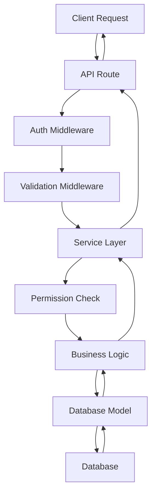

# Architecture Overview

This document provides a high-level overview of the Hospeda platform architecture.

## 🏗️ System Architecture

Hospeda follows a **monorepo architecture** with clear separation of concerns:

```
hospeda/
├── apps/                 # Applications
│   ├── api/             # Hono API server
│   ├── web/             # Astro + React frontend
│   └── admin/           # TanStack Start admin panel
├── packages/            # Shared packages
│   ├── db/              # Database layer (Drizzle ORM)
│   ├── schemas/         # Zod validation schemas
│   ├── types/           # TypeScript type definitions
│   ├── service-core/    # Business logic services
│   ├── auth-ui/         # Authentication components
│   └── config/          # Shared configuration
└── docs/                # Documentation
```

## 🏛️ Layered Architecture

The system follows a **layered architecture** pattern:

### 1. Presentation Layer (`apps/`)

- **API Layer**: RESTful API using Hono
- **Web Application**: User-facing website (Astro + React)
- **Admin Panel**: Management interface (TanStack Start)

### 2. Service Layer (`packages/service-core/`)

- Business logic and domain services
- Service-to-service communication
- Transaction management
- Permission validation

### 3. Data Access Layer (`packages/db/`)

- Database models and queries
- Schema definitions
- Migration management
- Connection pooling

### 4. Schema Layer (`packages/schemas/`)

- Input validation (Zod)
- Type generation
- API contract definitions

## 🔄 Request Flow



## 🔐 Security Architecture

### Authentication & Authorization

- **Clerk Integration**: Handles user authentication
- **Actor System**: Context-aware user representation
- **Role-Based Access Control (RBAC)**: Hierarchical permissions
- **Permission System**: Granular action-based permissions

### Actor Context Flow

```typescript
type Actor = {
    id: string;
    role: RoleEnum;
    permissions: PermissionEnum[];
    clerkUserId: string;
};
```

Every request includes an actor context that flows through all layers.

## 📊 Data Architecture

### Database Design

- **PostgreSQL**: Primary database
- **Drizzle ORM**: Type-safe database access
- **Schema-First**: Database schema drives type generation
- **Audit Fields**: Standardized tracking across all entities

### Schema Patterns

```typescript
// Base patterns used across all entities
BaseAuditFields: {
    createdAt: Date,
    updatedAt: Date,
    createdById: string,
    updatedById: string,
    deletedAt?: Date,
    deletedById?: string
}

BaseLifecycleFields: {
    lifecycleState: LifecycleStatusEnum
}

BaseModerationFields: {
    moderationState: ModerationStatusEnum
}

BaseVisibilityFields: {
    visibility: VisibilityEnum
}
```

## 🛠️ Service Architecture

### Base Service Pattern

All services extend `BaseCrudService` providing:

- Standardized CRUD operations
- Permission validation
- Audit logging
- Error handling
- Transaction support

```typescript
class ExampleService extends BaseCrudService<
    Entity,
    Model,
    CreateInput,
    UpdateInput,
    SearchInput
> {
    // Custom business logic here
}
```

### Service Context

Services operate within a context containing:

```typescript
type ServiceContext = {
    db: DatabaseConnection;
    actor: Actor;
    logger: Logger;
    cache?: CacheClient;
};
```

## 🔀 API Architecture

### Route Factory Pattern

Standardized route creation:

```typescript
// CRUD routes
const entityCRUDRoute = createCRUDRoute({
    service: EntityService,
    schemas: { create, update },
    permissions: { create: ['ENTITY_CREATE'] }
});

// List routes
const entityListRoute = createListRoute({
    service: EntityService,
    schema: EntitySearchSchema
});
```

### Middleware Stack

1. **CORS**: Cross-origin request handling
2. **Rate Limiting**: Request throttling
3. **Authentication**: Clerk token validation
4. **Actor Resolution**: User context creation
5. **Validation**: Request/response validation
6. **Logging**: Request/response logging
7. **Error Handling**: Standardized error responses

## 🏷️ Type System Architecture

### Type Flow

```
Database Schema → Drizzle Types → Zod Schemas → TypeScript Types → API Contracts
```

### Schema-First Development

1. Define database schema (Drizzle)
2. Generate TypeScript types
3. Create Zod validation schemas
4. Build API routes with type safety

### Package Structure

```typescript
// Types package - pure TypeScript definitions
export type User = {
    id: string;
    name: string;
    // ...
};

// Schemas package - Zod validation + type inference
export const UserSchema = z.object({
    id: z.string().uuid(),
    name: z.string().min(1),
    // ...
});

export type User = z.infer<typeof UserSchema>;
```

## 🧪 Testing Architecture

### Testing Layers

1. **Unit Tests**: Service layer business logic
2. **Integration Tests**: API endpoint testing
3. **E2E Tests**: Full application workflows

### Test Factory Pattern

Standardized mock data generation:

```typescript
// Factory functions for consistent test data
export const createMockUser = (overrides = {}) => ({
    ...baseUser,
    ...overrides
});

// Builder pattern for complex scenarios
export class UserFactoryBuilder {
    with(overrides) { /* ... */ }
    admin() { /* ... */ }
    build() { /* ... */ }
}
```

## 📦 Package Dependencies

### Dependency Graph

```
apps/api → service-core → db → schemas
apps/web → schemas, types
service-core → types, schemas
```

### Shared Packages

- **@repo/db**: Database models and migrations
- **@repo/schemas**: Validation schemas
- **@repo/types**: Type definitions
- **@repo/service-core**: Business services
- **@repo/config**: Environment configuration
- **@repo/auth-ui**: Authentication components

## 🚀 Deployment Architecture

### Production Stack

- **Application**: Node.js (Hono API)
- **Database**: PostgreSQL with connection pooling
- **Cache**: Redis for session and query caching
- **CDN**: Static asset delivery
- **Monitoring**: Logging and performance metrics

### Environment Separation

- **Development**: Local database, hot reloading
- **Staging**: Production-like environment for testing
- **Production**: Optimized builds, monitoring, backups

## 🔄 Development Workflow

### Code Generation

1. Database schema changes trigger type regeneration
2. Zod schemas auto-sync with TypeScript types
3. API documentation updates from schema changes

### Build Process

```bash
# Type generation
pnpm db:generate

# Build all packages
pnpm build

# Test all packages
pnpm test

# Deploy
pnpm deploy
```

## 📈 Scalability Considerations

### Horizontal Scaling

- **Stateless Services**: Services can be replicated
- **Database Sharding**: Prepared for data partitioning
- **Cache Layer**: Reduces database load
- **CDN Integration**: Static asset optimization

### Performance Patterns

- **Pagination**: All list endpoints support pagination
- **Lazy Loading**: Optional data loading
- **Query Optimization**: Efficient database queries
- **Caching Strategy**: Multi-level caching

## 🔍 Monitoring & Observability

### Logging Strategy

- **Structured Logging**: JSON format for parsing
- **Request Tracing**: End-to-end request tracking
- **Error Aggregation**: Centralized error collection
- **Performance Metrics**: Response time monitoring

### Health Checks

- **Database Connectivity**: Connection health
- **Service Availability**: Endpoint health checks
- **Resource Utilization**: Memory and CPU monitoring

## 🎯 Design Principles

### Core Principles

1. **Type Safety**: Compile-time error prevention
2. **Separation of Concerns**: Clear layer boundaries
3. **Convention over Configuration**: Standardized patterns
4. **Fail Fast**: Early error detection
5. **Testability**: Easy unit and integration testing

### Code Quality

- **ESLint + Biome**: Code linting and formatting
- **TypeScript Strict Mode**: Maximum type safety
- **100% Test Coverage**: Comprehensive testing
- **Code Reviews**: Mandatory peer review

## 🔮 Future Architecture

### Planned Enhancements

- **Microservices Migration**: Gradual service extraction
- **Event-Driven Architecture**: Async communication
- **GraphQL API**: Alternative query interface
- **Real-time Features**: WebSocket integration
- **Mobile API**: Mobile-optimized endpoints

### Technology Roadmap

- **Kubernetes**: Container orchestration
- **Message Queues**: Async job processing
- **Search Engine**: Elasticsearch integration
- **Analytics**: Data warehouse integration

---

For detailed implementation guides, see:

- [Adding Services](../development/adding-services.md)
- [Development Patterns](../development/patterns.md)
- [API Catalog](../api/service-catalog.md)
