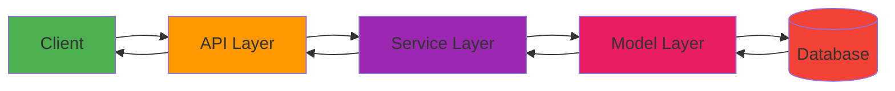
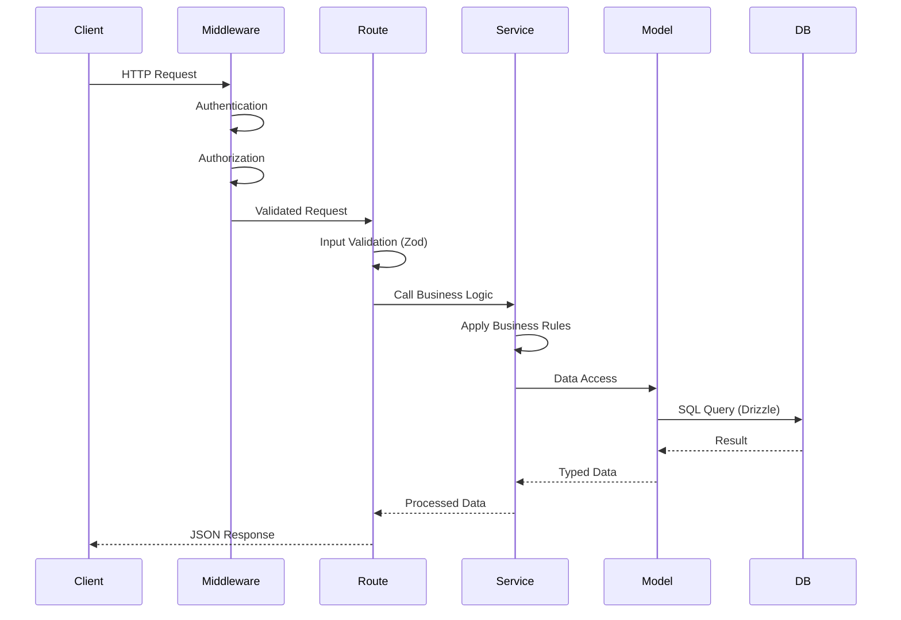
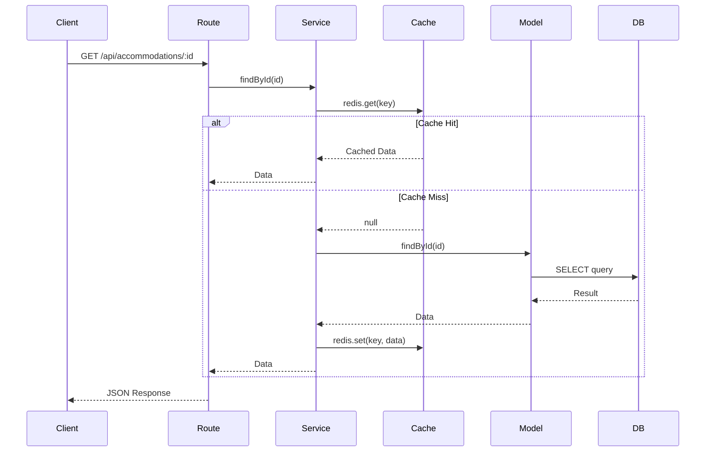
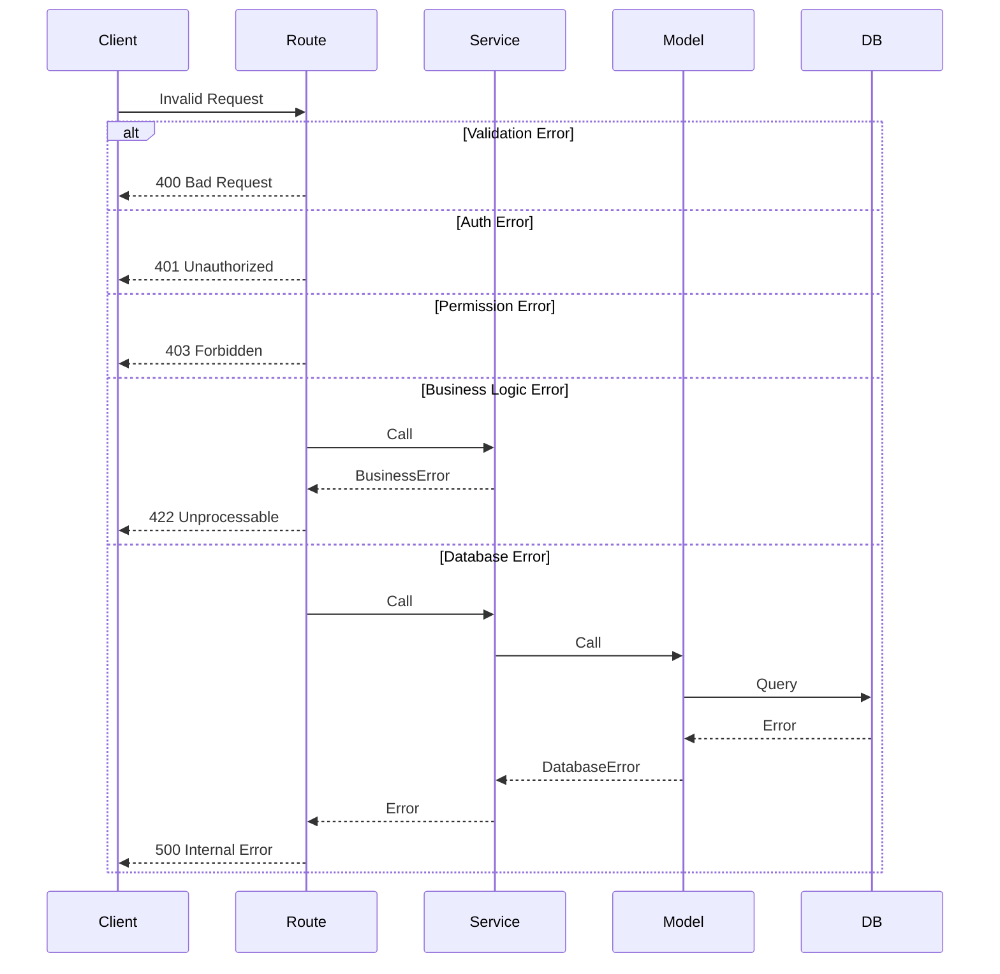
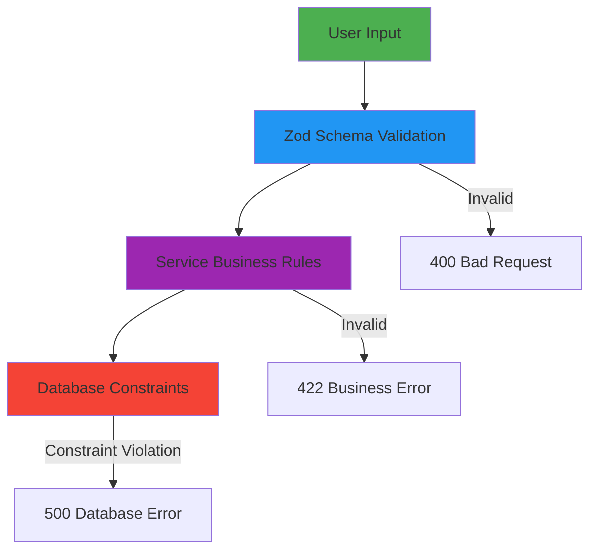
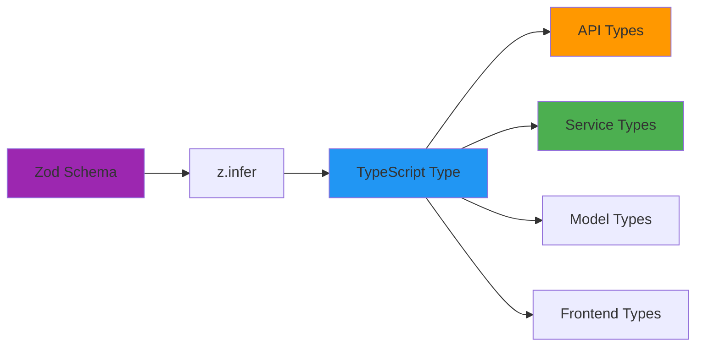
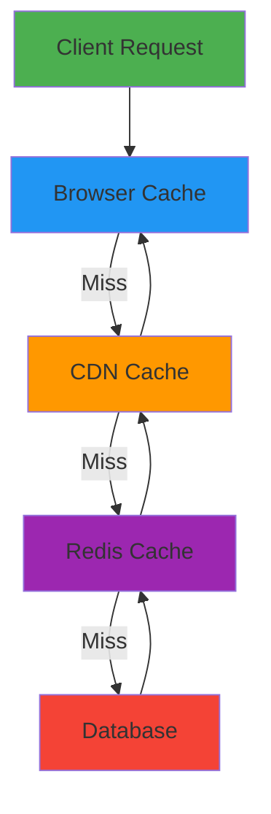

# Data Flow

Complete guide to how data flows through Hospeda's architecture from client request to database and back.

---

## Overview

Data in Hospeda flows through well-defined layers with clear responsibilities:



**Key Principles:**

- **Unidirectional flow** - Data flows down, responses flow up
- **Layer isolation** - Each layer only talks to adjacent layers
- **Type safety** - Types maintained throughout the flow
- **Validation** - Multiple validation points

---

## Request Lifecycle

### Complete Request Flow



### Detailed Flow Example

Let's trace a **POST /api/accommodations** request through the entire system.

#### 1. Client Request

**File**: `apps/web/src/lib/api-client.ts`

```typescript
// Client makes request
const response = await fetch('/api/accommodations', {
  method: 'POST',
  headers: {
    'Content-Type': 'application/json',
    Authorization: `Bearer ${token}`,
  },
  body: JSON.stringify({
    name: 'Beachfront Villa',
    description: 'Beautiful villa with ocean view',
    city: 'Concepción del Uruguay',
    pricePerNight: 15000,
  }),
});
```

#### 2. API Layer - Middleware

**File**: `apps/api/src/middleware/auth.ts`

```typescript
// Authentication middleware
export const authMiddleware = async (c: Context, next: Next) => {
  const token = c.req.header('Authorization')?.replace('Bearer ', '');

  if (!token) {
    return c.json({ error: 'Unauthorized' }, 401);
  }

  try {
    // Verify JWT token
    const decoded = await verifyToken(token);
    c.set('user', decoded);
    await next();
  } catch (error) {
    return c.json({ error: 'Invalid token' }, 401);
  }
};
```

**File**: `apps/api/src/middleware/permissions.ts`

```typescript
// Authorization middleware
export const requirePermission = (action: string) => {
  return async (c: Context, next: Next) => {
    const user = c.get('user');
    const actor = user.role; // 'admin', 'owner', 'user'

    if (!hasPermission(actor, action)) {
      return c.json({ error: 'Forbidden' }, 403);
    }

    await next();
  };
};
```

#### 3. API Layer - Route Handler

**File**: `apps/api/src/routes/accommodations.ts`

```typescript
import { Hono } from 'hono';
import { accommodationSchema } from '@repo/schemas';
import { accommodationService } from '@repo/service-core';

const app = new Hono();

app.post(
  '/',
  authMiddleware,
  requirePermission('create:accommodation'),
  async (c) => {
    // Parse and validate request body
    const body = await c.req.json();
    const validated = accommodationSchema.parse(body);

    // Get authenticated user
    const user = c.get('user');

    try {
      // Call service layer
      const accommodation = await accommodationService.create({
        data: {
          ...validated,
          ownerId: user.id,
        },
      });

      return c.json(accommodation, 201);
    } catch (error) {
      return c.json({ error: error.message }, 400);
    }
  }
);
```

#### 4. Service Layer - Business Logic

**File**: `packages/service-core/src/services/accommodation.service.ts`

```typescript
import { BaseCrudService } from './base-crud.service';
import { accommodationModel } from '@repo/db';
import { accommodationSchema } from '@repo/schemas';

export class AccommodationService extends BaseCrudService {
  constructor() {
    super(accommodationModel, accommodationSchema);
  }

  async create(params: {
    data: CreateAccommodation;
  }): Promise<Accommodation> {
    // Business rule: Validate city is in supported list
    const supportedCities = ['Concepción del Uruguay', 'Colón', 'Gualeguaychú'];

    if (!supportedCities.includes(params.data.city)) {
      throw new Error('City not supported');
    }

    // Business rule: Price must be reasonable
    if (params.data.pricePerNight < 1000 || params.data.pricePerNight > 100000) {
      throw new Error('Price out of valid range');
    }

    // Call model layer
    const accommodation = await this.model.create({
      data: params.data,
    });

    // Business logic: Create default availability
    await availabilityService.createDefaultAvailability({
      accommodationId: accommodation.id,
    });

    return accommodation;
  }
}

export const accommodationService = new AccommodationService();
```

#### 5. Model Layer - Data Access

**File**: `packages/db/src/models/accommodation.model.ts`

```typescript
import { BaseModel } from './base.model';
import { accommodationTable } from '../schemas/accommodation.schema';
import { accommodationSchema } from '@repo/schemas';

export class AccommodationModel extends BaseModel<typeof accommodationSchema> {
  constructor() {
    super('accommodations', accommodationTable, accommodationSchema);
  }

  async create(params: { data: CreateAccommodation }): Promise<Accommodation> {
    // Add audit fields
    const dataWithAudit = {
      ...params.data,
      createdAt: new Date(),
      updatedAt: new Date(),
    };

    // Execute query
    const [result] = await this.db
      .insert(this.table)
      .values(dataWithAudit)
      .returning();

    return result;
  }
}

export const accommodationModel = new AccommodationModel();
```

#### 6. Database Layer - SQL Execution

**File**: `packages/db/src/schemas/accommodation.schema.ts`

```typescript
import { pgTable, serial, varchar, text, integer, timestamp } from 'drizzle-orm/pg-core';

export const accommodationTable = pgTable('accommodations', {
  id: serial('id').primaryKey(),
  name: varchar('name', { length: 255 }).notNull(),
  description: text('description'),
  city: varchar('city', { length: 100 }).notNull(),
  pricePerNight: integer('price_per_night').notNull(),
  ownerId: integer('owner_id').notNull(),
  createdAt: timestamp('created_at').notNull(),
  updatedAt: timestamp('updated_at').notNull(),
  deletedAt: timestamp('deleted_at'),
});
```

**Generated SQL**:

```sql
INSERT INTO accommodations (
  name,
  description,
  city,
  price_per_night,
  owner_id,
  created_at,
  updated_at
)
VALUES (
  'Beachfront Villa',
  'Beautiful villa with ocean view',
  'Concepción del Uruguay',
  15000,
  42,
  '2025-01-15 10:30:00',
  '2025-01-15 10:30:00'
)
RETURNING *;
```

#### 7. Response Flow

**Database → Model**:

```typescript
// Result from database
{
  id: 123,
  name: 'Beachfront Villa',
  description: 'Beautiful villa with ocean view',
  city: 'Concepción del Uruguay',
  pricePerNight: 15000,
  ownerId: 42,
  createdAt: 2025-01-15T10:30:00.000Z,
  updatedAt: 2025-01-15T10:30:00.000Z,
  deletedAt: null
}
```

**Model → Service → API → Client**:

```json
{
  "id": 123,
  "name": "Beachfront Villa",
  "description": "Beautiful villa with ocean view",
  "city": "Concepción del Uruguay",
  "pricePerNight": 15000,
  "ownerId": 42,
  "createdAt": "2025-01-15T10:30:00.000Z",
  "updatedAt": "2025-01-15T10:30:00.000Z"
}
```

---

## Read Operations

### GET Request Flow



### Example: Read with Caching

**File**: `packages/service-core/src/services/accommodation.service.ts`

```typescript
async findById(params: { id: number }): Promise<Accommodation> {
  // Try cache first
  const cacheKey = `accommodation:${params.id}`;
  const cached = await redis.get(cacheKey);

  if (cached) {
    logger.info(`Cache hit for accommodation ${params.id}`);
    return JSON.parse(cached);
  }

  // Query database
  const accommodation = await this.model.findById(params);

  if (!accommodation) {
    throw new NotFoundError('Accommodation not found');
  }

  // Cache for 5 minutes
  await redis.setex(cacheKey, 300, JSON.stringify(accommodation));

  return accommodation;
}
```

---

## Write Operations

### Transaction Flow

**File**: `packages/service-core/src/services/booking.service.ts`

```typescript
async createBooking(params: {
  accommodationId: number;
  userId: number;
  checkIn: Date;
  checkOut: Date;
}): Promise<Booking> {
  // Use database transaction for atomicity
  return this.db.transaction(async (tx) => {
    // 1. Check availability
    const isAvailable = await availabilityService.checkAvailability({
      accommodationId: params.accommodationId,
      dateRange: { start: params.checkIn, end: params.checkOut },
      tx,
    });

    if (!isAvailable) {
      throw new Error('Accommodation not available for selected dates');
    }

    // 2. Calculate total price
    const accommodation = await accommodationModel.findById({
      id: params.accommodationId,
      tx,
    });

    const nights = differenceInDays(params.checkOut, params.checkIn);
    const totalAmount = accommodation.pricePerNight * nights;

    // 3. Create booking
    const booking = await bookingModel.create({
      data: {
        accommodationId: params.accommodationId,
        userId: params.userId,
        checkIn: params.checkIn,
        checkOut: params.checkOut,
        totalAmount,
        status: 'pending',
      },
      tx,
    });

    // 4. Reserve availability
    await availabilityService.reserve({
      accommodationId: params.accommodationId,
      dateRange: { start: params.checkIn, end: params.checkOut },
      tx,
    });

    // 5. Invalidate cache
    await redis.del(`accommodation:${params.accommodationId}`);

    return booking;
  });
}
```

**Transaction guarantees**:

- All operations succeed or all fail
- No partial updates
- Consistent state maintained

---

## Error Flow

### Error Handling Cascade



### Error Types

**File**: `packages/service-core/src/errors/index.ts`

```typescript
export class ValidationError extends Error {
  statusCode = 400;
  constructor(message: string) {
    super(message);
    this.name = 'ValidationError';
  }
}

export class UnauthorizedError extends Error {
  statusCode = 401;
  constructor(message: string = 'Unauthorized') {
    super(message);
    this.name = 'UnauthorizedError';
  }
}

export class ForbiddenError extends Error {
  statusCode = 403;
  constructor(message: string = 'Forbidden') {
    super(message);
    this.name = 'ForbiddenError';
  }
}

export class NotFoundError extends Error {
  statusCode = 404;
  constructor(message: string) {
    super(message);
    this.name = 'NotFoundError';
  }
}

export class BusinessError extends Error {
  statusCode = 422;
  constructor(message: string) {
    super(message);
    this.name = 'BusinessError';
  }
}
```

**File**: `apps/api/src/middleware/error-handler.ts`

```typescript
export const errorHandler = async (err: Error, c: Context) => {
  logger.error('Request error', { error: err });

  // Map error types to HTTP status codes
  if (err instanceof ValidationError) {
    return c.json({ error: err.message }, 400);
  }

  if (err instanceof UnauthorizedError) {
    return c.json({ error: err.message }, 401);
  }

  if (err instanceof ForbiddenError) {
    return c.json({ error: err.message }, 403);
  }

  if (err instanceof NotFoundError) {
    return c.json({ error: err.message }, 404);
  }

  if (err instanceof BusinessError) {
    return c.json({ error: err.message }, 422);
  }

  // Unknown error - log and return generic message
  return c.json(
    { error: 'Internal server error' },
    500
  );
};
```

---

## Data Validation

### Three-Layer Validation



#### Layer 1: Zod Schema Validation

**File**: `packages/schemas/src/accommodation/accommodation.schema.ts`

```typescript
export const accommodationSchema = z.object({
  id: z.number().int().positive(),
  name: z.string().min(1).max(255),
  description: z.string().max(5000).optional(),
  city: z.string().min(1).max(100),
  pricePerNight: z.number().int().positive().min(1000).max(100000),
  ownerId: z.number().int().positive(),
});
```

#### Layer 2: Service Business Rules

**File**: `packages/service-core/src/services/accommodation.service.ts`

```typescript
async create(params: { data: CreateAccommodation }) {
  // Business rule: Check city is supported
  const supportedCities = await cityService.getSupportedCities();
  if (!supportedCities.includes(params.data.city)) {
    throw new BusinessError('City not supported');
  }

  // Business rule: Check owner exists and is verified
  const owner = await userService.findById({ id: params.data.ownerId });
  if (!owner.isVerified) {
    throw new BusinessError('Owner must be verified');
  }

  return this.model.create({ data: params.data });
}
```

#### Layer 3: Database Constraints

**File**: `packages/db/src/schemas/accommodation.schema.ts`

```typescript
export const accommodationTable = pgTable('accommodations', {
  id: serial('id').primaryKey(),
  name: varchar('name', { length: 255 }).notNull(),
  city: varchar('city', { length: 100 }).notNull(),
  pricePerNight: integer('price_per_night').notNull(),
  ownerId: integer('owner_id')
    .notNull()
    .references(() => userTable.id),
}, (table) => ({
  // Constraints
  positivePrice: check('price_positive', sql`${table.pricePerNight} > 0`),
  uniqueName: unique().on(table.name, table.ownerId),
}));
```

---

## Type Flow

### Schema to Type Inference



**Example**:

```typescript
// 1. Define schema
export const accommodationSchema = z.object({
  id: z.number(),
  name: z.string(),
  // ...
});

// 2. Infer type
export type Accommodation = z.infer<typeof accommodationSchema>;

// 3. Type used everywhere
function findAccommodation(id: number): Promise<Accommodation> {
  // ...
}
```

**Benefits**:

- Single source of truth
- Runtime validation matches compile-time types
- No type drift
- Refactoring safety

---

## Caching Strategy

### Multi-Level Cache



### Cache Invalidation

**File**: `packages/service-core/src/services/accommodation.service.ts`

```typescript
async update(params: {
  id: number;
  data: Partial<Accommodation>;
}): Promise<Accommodation> {
  // Update in database
  const accommodation = await this.model.update(params);

  // Invalidate caches
  await Promise.all([
    redis.del(`accommodation:${params.id}`),
    redis.del('accommodations:list:*'), // Pattern delete
    cdn.purge(`/api/accommodations/${params.id}`),
  ]);

  return accommodation;
}
```

---

## Next Steps

**Learn architectural patterns:**

→ [Patterns](patterns.md)

**Understand technology choices:**

→ [Tech Stack](tech-stack.md)

**Explore specific layers:**

→ [Layers](layers.md)
