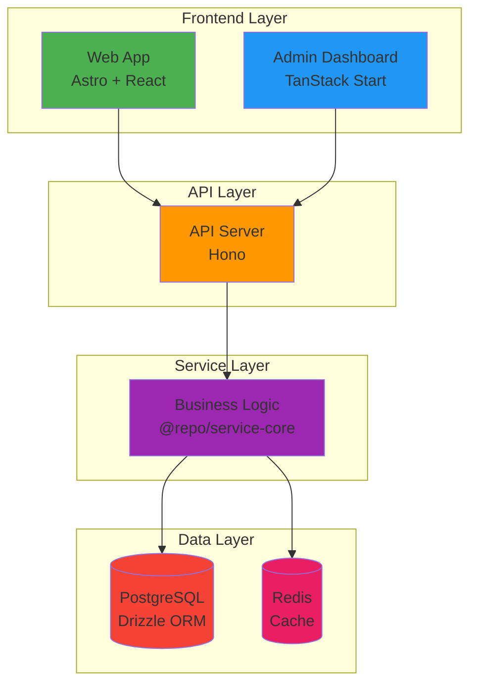
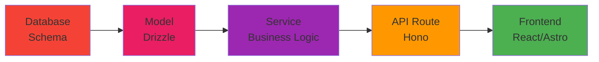
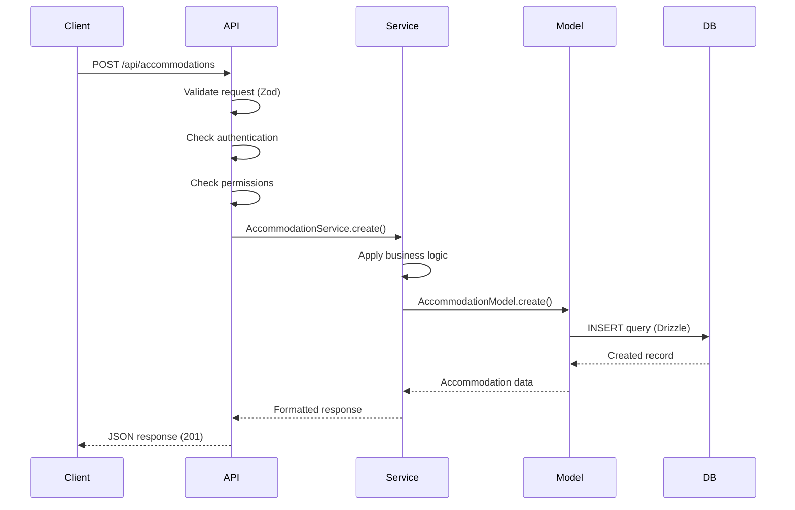
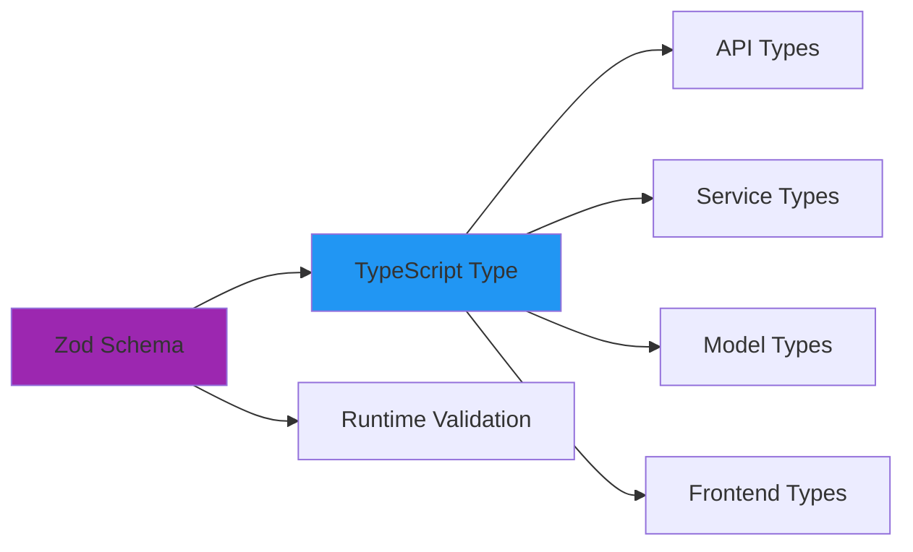

# Architecture Overview

This document provides a comprehensive overview of Hospeda's system architecture, design principles, and technical decisions.

---

## Architecture Vision

Hospeda is built as a **modern, scalable, type-safe monorepo application** designed for:

- **Performance**: Fast page loads, optimized API responses
- **Developer Experience**: Fast feedback loops, clear conventions, comprehensive tooling
- **Maintainability**: Clean separation of concerns, consistent patterns
- **Type Safety**: End-to-end type safety from database to frontend
- **Scalability**: Horizontal scaling, caching strategies, efficient queries

---

## System Architecture

### High-Level Overview



### Component Responsibilities

**Frontend Layer:**

- **Web App (Astro + React)**: Public-facing website with SSR/SSG
  - Marketing pages (static)
  - Accommodation listings (SSR)
  - Search and booking flow (islands)
  - SEO-optimized content

- **Admin Dashboard (TanStack Start)**: Administrative interface
  - Property management
  - Booking administration
  - User management
  - Analytics and reports

**API Layer:**

- **API Server (Hono)**: RESTful API with edge compatibility
  - Route handling
  - Request validation (Zod)
  - Authentication middleware
  - Response serialization
  - Error handling

**Service Layer:**

- **Business Logic (@repo/service-core)**: Reusable business logic
  - CRUD operations
  - Complex business rules
  - Data validation
  - Transaction management
  - Cache management

**Data Layer:**

- **PostgreSQL**: Primary data store
  - ACID transactions
  - Relational integrity
  - Full-text search
  - JSON support

- **Redis**: Caching and sessions
  - API response caching
  - Session storage
  - Rate limiting
  - Temporary data

---

## Layered Architecture

### The Four Layers



**1. Database Layer** (`@repo/db`)

- Drizzle ORM schemas
- Type-safe queries
- Migrations
- Seed data

**Responsibilities:**

- Define database tables
- Manage schema migrations
- Provide type-safe query builders

**Example:**

```typescript
// packages/db/src/schemas/accommodation.schema.ts
export const accommodationTable = pgTable('accommodations', {
  id: serial('id').primaryKey(),
  name: varchar('name', { length: 255 }).notNull(),
  description: text('description'),
  // ...
});
```

---

**2. Model Layer** (`@repo/db/models`)

- Extends `BaseModel<T>`
- CRUD operations
- Data access abstraction
- Query optimization

**Responsibilities:**

- Provide database abstraction
- Implement basic CRUD
- Handle data transformation

**Example:**

```typescript
// packages/db/src/models/accommodation.model.ts
export class AccommodationModel extends BaseModel<typeof accommodationSchema> {
  constructor() {
    super('accommodations', accommodationTable, accommodationSchema);
  }

  // Custom queries
  async findByLocation(params: { city: string }) {
    return this.db
      .select()
      .from(this.table)
      .where(eq(this.table.city, params.city));
  }
}
```

---

**3. Service Layer** (`@repo/service-core`)

- Extends `BaseCrudService`
- Business logic
- Complex operations
- Transaction management

**Responsibilities:**

- Implement business rules
- Coordinate multiple models
- Manage transactions
- Handle caching

**Example:**

```typescript
// packages/service-core/src/services/accommodation.service.ts
export class AccommodationService extends BaseCrudService {
  constructor() {
    super(accommodationModel, accommodationSchema);
  }

  async createWithAmenities(params: {
    accommodation: CreateAccommodation;
    amenityIds: number[];
  }): Promise<Accommodation> {
    return this.db.transaction(async (tx) => {
      // 1. Create accommodation
      const accommodation = await this.create({
        data: params.accommodation,
      });

      // 2. Link amenities
      await amenityService.linkToAccommodation({
        accommodationId: accommodation.id,
        amenityIds: params.amenityIds,
      });

      return accommodation;
    });
  }
}
```

---

**4. API Layer** (`apps/api`)

- Route definitions
- Request validation
- Response formatting
- Authentication/Authorization

**Responsibilities:**

- Define HTTP endpoints
- Validate requests (Zod)
- Call services
- Format responses

**Example:**

```typescript
// apps/api/src/routes/accommodations.ts
export const accommodationRoutes = createCRUDRoute({
  path: '/accommodations',
  service: accommodationService,
  schema: accommodationSchema,
  permissions: {
    create: ['admin', 'owner'],
    update: ['admin', 'owner'],
    delete: ['admin'],
  },
});
```

---

**5. Frontend Layer** (`apps/web`, `apps/admin`)

- UI components
- API client calls
- State management
- User interactions

**Responsibilities:**

- Render user interfaces
- Handle user input
- Call API endpoints
- Manage client state

**Example:**

```typescript
// apps/web/src/components/AccommodationCard.tsx
export function AccommodationCard({ accommodation }: Props) {
  const { mutate: bookAccommodation } = useMutation({
    mutationFn: (data: BookingData) =>
      apiClient.post('/bookings', data),
  });

  return (
    <div>
      <h2>{accommodation.name}</h2>
      <p>{accommodation.description}</p>
      <button onClick={() => bookAccommodation(/* ... */)}>
        Book Now
      </button>
    </div>
  );
}
```

---

## Request Lifecycle

### Typical Request Flow



### Request Flow Steps

#### 1. Client Request

```typescript
// Frontend makes API call
const response = await fetch('/api/accommodations', {
  method: 'POST',
  headers: {
    'Content-Type': 'application/json',
    Authorization: `Bearer ${token}`,
  },
  body: JSON.stringify(accommodationData),
});
```

#### 2. API Layer - Validation

```typescript
// apps/api/src/routes/accommodations.ts
app.post('/accommodations', async (c) => {
  // Validate request body
  const body = await c.req.json();
  const validated = accommodationSchema.parse(body);

  // Validation passes, continue...
});
```

#### 3. API Layer - Authentication and Authorization

```typescript
// apps/api/src/middleware/auth.ts
const authMiddleware = async (c, next) => {
  const token = c.req.header('Authorization');
  const user = await verifyToken(token);

  // Check permissions
  if (!hasPermission(user, 'create:accommodation')) {
    return c.json({ error: 'Forbidden' }, 403);
  }

  c.set('user', user);
  await next();
};
```

#### 4. Service Layer - Business Logic

```typescript
// packages/service-core/src/services/accommodation.service.ts
const accommodation = await accommodationService.create({
  data: validated,
  userId: c.get('user').id,
});
```

#### 5. Model Layer - Database Operation

```typescript
// packages/db/src/models/accommodation.model.ts
return this.db
  .insert(this.table)
  .values(params.data)
  .returning();
```

#### 6. Response

```typescript
// apps/api/src/routes/accommodations.ts
return c.json(accommodation, 201);
```

---

## Security Architecture

### Actor-Based Authorization

Hospeda uses an **Actor system** for fine-grained access control.

**Actors:**

- `guest` - Unauthenticated user
- `user` - Authenticated user
- `owner` - Property owner
- `admin` - System administrator
- `superadmin` - Full system access

**Permission Model:**

```typescript
// @repo/schemas/src/permissions
export const actorPermissions = {
  guest: {
    accommodations: ['read'],
    bookings: [],
  },
  user: {
    accommodations: ['read'],
    bookings: ['create', 'read', 'update'],
  },
  owner: {
    accommodations: ['create', 'read', 'update', 'delete'],
    bookings: ['read', 'update'],
  },
  admin: {
    accommodations: ['create', 'read', 'update', 'delete'],
    bookings: ['create', 'read', 'update', 'delete'],
    users: ['create', 'read', 'update', 'delete'],
  },
};
```

### Row-Level Security (RLS)

Services enforce ownership-based access:

```typescript
// packages/service-core/src/services/accommodation.service.ts
async update(params: {
  id: number;
  data: UpdateAccommodation;
  userId: number;
}): Promise<Accommodation> {
  // Check ownership
  const accommodation = await this.findById({ id: params.id });

  if (accommodation.ownerId !== params.userId) {
    throw new UnauthorizedError('You can only update your own properties');
  }

  return super.update(params);
}
```

### Security Features

- **Authentication**: Clerk-based authentication
- **Authorization**: Actor-based permissions + RLS
- **Input Validation**: Zod schemas on all inputs
- **SQL Injection Prevention**: Drizzle parameterized queries
- **XSS Prevention**: React automatic escaping
- **CSRF Protection**: Token-based validation
- **Rate Limiting**: Redis-based rate limits

---

## Data Architecture

### Database Schema Patterns

**All tables include standard audit fields:**

```typescript
export const baseFields = {
  id: serial('id').primaryKey(),
  createdAt: timestamp('created_at').defaultNow().notNull(),
  updatedAt: timestamp('updated_at').defaultNow().notNull(),
  deletedAt: timestamp('deleted_at'), // Soft deletes
};
```

### Schema Organization

```text
packages/db/src/schemas/
├── accommodation.schema.ts   # Accommodation tables
├── booking.schema.ts         # Booking tables
├── user.schema.ts            # User tables
├── payment.schema.ts         # Payment tables
└── index.ts                  # Barrel export
```

### Relationships

**One-to-Many Example:**

```typescript
// Accommodation has many Amenities
export const accommodationAmenitiesTable = pgTable(
  'accommodation_amenities',
  {
    accommodationId: integer('accommodation_id')
      .references(() => accommodationTable.id)
      .notNull(),
    amenityId: integer('amenity_id')
      .references(() => amenityTable.id)
      .notNull(),
  }
);

// Define relation
export const accommodationRelations = relations(
  accommodationTable,
  ({ many }) => ({
    amenities: many(accommodationAmenitiesTable),
  })
);
```

### Data Validation

**Three-layer validation:**

1. **Database constraints** (NOT NULL, UNIQUE, CHECK)
2. **Model validation** (Zod schemas)
3. **Service validation** (Business rules)

---

## Service Architecture

### BaseCrudService Pattern

All services extend `BaseCrudService` for consistency:

```typescript
export abstract class BaseCrudService<
  TTable extends PgTable,
  TSchema extends z.ZodType
> {
  protected model: BaseModel<TSchema>;
  protected schema: TSchema;

  // Standard CRUD methods
  async findById(params: { id: number }): Promise<z.infer<TSchema>> {
    // Implementation
  }

  async findAll(params?: { limit?: number; offset?: number }) {
    // Implementation
  }

  async create(params: { data: z.infer<TSchema> }) {
    // Implementation
  }

  async update(params: { id: number; data: Partial<z.infer<TSchema>> }) {
    // Implementation
  }

  async delete(params: { id: number }) {
    // Implementation
  }
}
```

### Service Patterns

**Transaction Management:**

```typescript
async createBooking(params: CreateBookingParams) {
  return this.db.transaction(async (tx) => {
    // 1. Create booking
    const booking = await bookingModel.create({ data: params.booking });

    // 2. Process payment
    const payment = await paymentService.process({
      bookingId: booking.id,
      amount: booking.totalAmount,
    });

    // 3. Update availability
    await availabilityService.reserve({
      accommodationId: booking.accommodationId,
      dateRange: params.dateRange,
    });

    return booking;
  });
}
```

**Caching Strategy:**

```typescript
async findById(params: { id: number }) {
  // Try cache first
  const cached = await redis.get(`accommodation:${params.id}`);
  if (cached) return JSON.parse(cached);

  // Query database
  const accommodation = await this.model.findById(params);

  // Cache result (5 minutes)
  await redis.setex(
    `accommodation:${params.id}`,
    300,
    JSON.stringify(accommodation)
  );

  return accommodation;
}
```

---

## Type System

### Zod Schema-First Design

**All types are inferred from Zod schemas:**

```typescript
// packages/schemas/src/accommodation/accommodation.schema.ts
import { z } from 'zod';

export const accommodationSchema = z.object({
  id: z.number().int().positive(),
  name: z.string().min(1).max(255),
  description: z.string().max(5000).optional(),
  city: z.string().min(1).max(100),
  // ...
});

// Type is automatically inferred
export type Accommodation = z.infer<typeof accommodationSchema>;
```

### Type Flow



**Benefits:**

- **Single source of truth** - Schema defines both validation and types
- **Compile-time safety** - TypeScript catches type errors
- **Runtime validation** - Zod validates at runtime
- **No type drift** - Types always match validation

---

## Scalability Considerations

### Horizontal Scaling

**Stateless API:**

- No server-side sessions (use Redis)
- JWT-based authentication
- Load balancer ready
- Multiple instances support

**Database Scaling:**

- Connection pooling (Neon)
- Read replicas for queries
- Write to primary only
- Query optimization

### Caching Strategy

**Multi-level caching:**

1. **Browser cache** - Static assets (1 year)
2. **CDN cache** - API responses (5 minutes)
3. **Redis cache** - Database queries (5-60 minutes)
4. **Query cache** - Drizzle prepared statements

### Performance Optimization

**Frontend:**

- Code splitting (lazy loading)
- Image optimization (Astro)
- Minimal JavaScript (islands)
- Static generation where possible

**API:**

- Response compression (gzip)
- Rate limiting
- Query optimization
- Prepared statements

**Database:**

- Indexed columns
- Efficient queries
- Connection pooling
- Query result caching

---

## Technology Decisions

### Why This Stack?

**Frontend Choices:**

- **Astro**: Best performance, minimal JS, great SEO
- **React 19**: Component reusability, strong ecosystem
- **TanStack Start**: Type-safe routing, built-in data fetching
- **Tailwind CSS**: Utility-first, fast development

**Backend Choices:**

- **Hono**: Ultra-fast, edge-compatible, great TypeScript
- **Node.js**: Familiar, great ecosystem, good performance
- **Drizzle**: Type-safe, SQL-like, zero runtime deps
- **PostgreSQL**: ACID, relational, full-text search

**Infrastructure:**

- **Vercel**: Easy deployment, edge functions, great DX
- **Neon**: Serverless Postgres, automatic scaling
- **TurboRepo**: Fast builds, smart caching

---

## Next Steps

**Understand the monorepo organization:**

→ [Monorepo Structure](monorepo-structure.md)

**Learn architectural patterns:**

→ [Patterns](patterns.md)

**Understand data flow:**

→ [Data Flow](data-flow.md)

**Explore specific layers:**

→ [Layers](layers.md)
