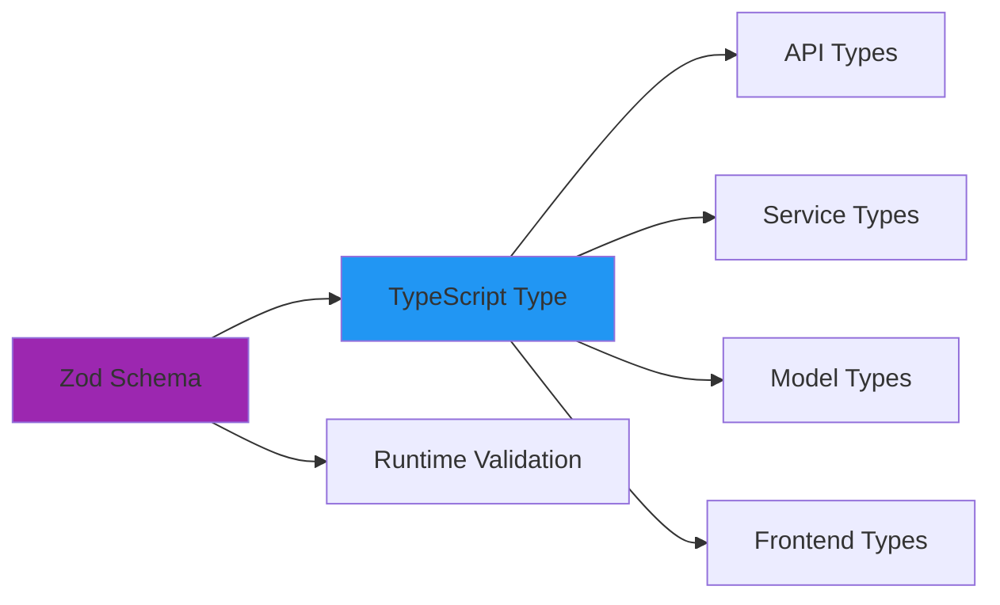

# Architectural Patterns

Complete guide to the design patterns and conventions used throughout Hospeda's codebase.

---

## Overview

Hospeda follows consistent patterns across all layers to ensure:

- **Predictability** - Same patterns everywhere
- **Maintainability** - Easy to understand and modify
- **Type Safety** - Compile-time error detection
- **Reusability** - Don't repeat yourself

---

## Core Patterns

### 1. Schema-First Design

**All types and validation come from Zod schemas.**



**Example**:

**File**: `packages/schemas/src/accommodation/accommodation.schema.ts`

```typescript
import { z } from 'zod';

// 1. Define schema
export const accommodationSchema = z.object({
  id: z.string().uuid(),
  name: z.string().min(1).max(255),
  slug: z.string().min(1).max(255),
  description: z.string().max(5000),
  city: z.string().min(1).max(100),
  pricePerNight: z.number().int().positive(),
  // ...
});

// 2. Infer type automatically
export type Accommodation = z.infer<typeof accommodationSchema>;

// 3. Create variants for CRUD operations
export const createAccommodationSchema = accommodationSchema.omit({
  id: true,
  createdAt: true,
  updatedAt: true,
});

export type CreateAccommodation = z.infer<typeof createAccommodationSchema>;

export const updateAccommodationSchema = accommodationSchema
  .omit({
    id: true,
    createdAt: true,
  })
  .partial();

export type UpdateAccommodation = z.infer<typeof updateAccommodationSchema>;
```

**Benefits**:

- Single source of truth
- Runtime validation matches compile-time types
- No type drift between layers
- Automatic API documentation generation

---

### 2. BaseModel Pattern

**All database models extend `BaseModel<T>`** for consistent CRUD operations.

**File**: `packages/db/src/base/base.model.ts`

```typescript
import type { PgTable } from 'drizzle-orm/pg-core';
import type { NodePgDatabase } from 'drizzle-orm/node-postgres';

export abstract class BaseModel<T> {
  protected abstract table: PgTable;
  protected abstract entityName: string;

  // Standard CRUD methods
  async findById(id: string): Promise<T | null> {
    const db = getDb();
    const result = await db
      .select()
      .from(this.table)
      .where(eq(this.table.id, id))
      .limit(1);

    return result[0] ?? null;
  }

  async findAll(filters?: Partial<T>): Promise<T[]> {
    const db = getDb();
    const query = db.select().from(this.table);

    if (filters) {
      const whereClauses = buildWhereClause(this.table, filters);
      query.where(whereClauses);
    }

    return query;
  }

  async create(data: Partial<T>): Promise<T> {
    const db = getDb();
    const [result] = await db
      .insert(this.table)
      .values(data)
      .returning();

    return result;
  }

  async update(id: string, data: Partial<T>): Promise<T> {
    const db = getDb();
    const [result] = await db
      .update(this.table)
      .set({ ...data, updatedAt: new Date() })
      .where(eq(this.table.id, id))
      .returning();

    return result;
  }

  async softDelete(id: string): Promise<void> {
    await this.update(id, { deletedAt: new Date() } as any);
  }

  async hardDelete(id: string): Promise<void> {
    const db = getDb();
    await db.delete(this.table).where(eq(this.table.id, id));
  }
}
```

**Usage**:

**File**: `packages/db/src/models/accommodation/accommodation.model.ts`

```typescript
import { BaseModel } from '../../base/base.model';
import { accommodationTable } from '../../schemas';
import type { Accommodation } from '@repo/schemas';

export class AccommodationModel extends BaseModel<Accommodation> {
  protected table = accommodationTable;
  protected entityName = 'accommodation';

  protected getTableName(): string {
    return 'accommodations';
  }

  // Add custom methods beyond base CRUD
  async findBySlug(slug: string): Promise<Accommodation | null> {
    return this.findOne({ slug });
  }

  async findByCity(city: string): Promise<Accommodation[]> {
    return this.findAll({ city, isActive: true });
  }

  async search(params: AccommodationSearchInput): Promise<{
    items: Accommodation[];
    total: number;
  }> {
    const db = getDb();

    const whereClauses = [];

    if (params.city) {
      whereClauses.push(eq(this.table.city, params.city));
    }

    if (params.minPrice) {
      whereClauses.push(gte(this.table.pricePerNight, params.minPrice));
    }

    if (params.maxPrice) {
      whereClauses.push(lte(this.table.pricePerNight, params.maxPrice));
    }

    const where = and(...whereClauses);

    // Get total count
    const [{ count: total }] = await db
      .select({ count: count() })
      .from(this.table)
      .where(where);

    // Get paginated results
    const items = await db
      .select()
      .from(this.table)
      .where(where)
      .limit(params.pageSize ?? 10)
      .offset(((params.page ?? 1) - 1) * (params.pageSize ?? 10));

    return { items, total };
  }
}

export const accommodationModel = new AccommodationModel();
```

---

### 3. BaseCrudService Pattern

**All services extend `BaseCrudService`** for consistent business logic layer.

**File**: `packages/service-core/src/base/base.crud.service.ts`

```typescript
import type { BaseModel } from '@repo/db';
import type { ZodSchema } from 'zod';

export abstract class BaseCrudService<
  TEntity,
  TModel extends BaseModel<TEntity>,
  TCreateSchema extends ZodSchema,
  TUpdateSchema extends ZodSchema,
  TSearchSchema extends ZodSchema
> {
  protected model: TModel;
  protected createSchema: TCreateSchema;
  protected updateSchema: TUpdateSchema;
  protected searchSchema: TSearchSchema;

  constructor(
    model: TModel,
    schemas: {
      create: TCreateSchema;
      update: TUpdateSchema;
      search: TSearchSchema;
    }
  ) {
    this.model = model;
    this.createSchema = schemas.create;
    this.updateSchema = schemas.update;
    this.searchSchema = schemas.search;
  }

  // Standard CRUD with validation
  async create(params: {
    data: z.infer<TCreateSchema>;
  }): Promise<ServiceResult<TEntity>> {
    try {
      // Validate input
      const validated = this.createSchema.parse(params.data);

      // Call model
      const result = await this.model.create(validated);

      return { success: true, data: result };
    } catch (error) {
      return this.handleError(error);
    }
  }

  async findById(params: {
    id: string;
  }): Promise<ServiceResult<TEntity>> {
    try {
      const result = await this.model.findById(params.id);

      if (!result) {
        return {
          success: false,
          error: {
            code: 'NOT_FOUND',
            message: 'Entity not found',
          },
        };
      }

      return { success: true, data: result };
    } catch (error) {
      return this.handleError(error);
    }
  }

  async update(params: {
    id: string;
    data: z.infer<TUpdateSchema>;
  }): Promise<ServiceResult<TEntity>> {
    try {
      // Validate input
      const validated = this.updateSchema.parse(params.data);

      // Update
      const result = await this.model.update(params.id, validated);

      return { success: true, data: result };
    } catch (error) {
      return this.handleError(error);
    }
  }

  async delete(params: { id: string }): Promise<ServiceResult<void>> {
    try {
      await this.model.softDelete(params.id);
      return { success: true, data: undefined };
    } catch (error) {
      return this.handleError(error);
    }
  }

  protected handleError(error: unknown): ServiceResult<never> {
    if (error instanceof ZodError) {
      return {
        success: false,
        error: {
          code: 'VALIDATION_ERROR',
          message: error.errors[0].message,
        },
      };
    }

    return {
      success: false,
      error: {
        code: 'INTERNAL_ERROR',
        message: 'An unexpected error occurred',
      },
    };
  }
}
```

**Usage**:

**File**: `packages/service-core/src/services/accommodation/accommodation.service.ts`

```typescript
import { BaseCrudService } from '../../base/base.crud.service';
import { accommodationModel } from '@repo/db';
import type { Accommodation } from '@repo/schemas';
import {
  accommodationSchema,
  createAccommodationSchema,
  updateAccommodationSchema,
  searchAccommodationSchema,
} from '@repo/schemas';

export class AccommodationService extends BaseCrudService<
  Accommodation,
  typeof accommodationModel,
  typeof createAccommodationSchema,
  typeof updateAccommodationSchema,
  typeof searchAccommodationSchema
> {
  constructor() {
    super(accommodationModel, {
      create: createAccommodationSchema,
      update: updateAccommodationSchema,
      search: searchAccommodationSchema,
    });
  }

  // Add custom business logic methods
  async publish(params: { id: string }): Promise<ServiceResult<Accommodation>> {
    // Business rule: Check if accommodation can be published
    const accommodation = await this.model.findById(params.id);

    if (!accommodation) {
      return {
        success: false,
        error: { code: 'NOT_FOUND', message: 'Accommodation not found' },
      };
    }

    if (accommodation.status !== 'draft') {
      return {
        success: false,
        error: {
          code: 'BUSINESS_RULE_VIOLATION',
          message: 'Only draft accommodations can be published',
        },
      };
    }

    // Business rule: Must have required fields
    if (!accommodation.description || accommodation.description.length < 100) {
      return {
        success: false,
        error: {
          code: 'BUSINESS_RULE_VIOLATION',
          message: 'Description must be at least 100 characters',
        },
      };
    }

    // Update status
    return this.update({
      id: params.id,
      data: { status: 'published' },
    });
  }
}

export const accommodationService = new AccommodationService();
```

---

### 4. RO-RO Pattern (Receive Object, Return Object)

**All functions receive and return objects** for better maintainability.

**❌ Don't**:

```typescript
function createAccommodation(
  name: string,
  slug: string,
  description: string,
  city: string,
  pricePerNight: number,
  ownerId: string
): Promise<Accommodation> {
  // ...
}

// Call with positional arguments (error-prone)
await createAccommodation(
  'Hotel',
  'hotel-slug',
  'Description',
  'City',
  15000,
  'owner-123'
);
```

**✅ Do**:

```typescript
function createAccommodation(params: {
  name: string;
  slug: string;
  description: string;
  city: string;
  pricePerNight: number;
  ownerId: string;
}): Promise<{ accommodation: Accommodation }> {
  // ...
}

// Call with named parameters (clear and safe)
await createAccommodation({
  name: 'Hotel',
  slug: 'hotel-slug',
  description: 'Description',
  city: 'City',
  pricePerNight: 15000,
  ownerId: 'owner-123',
});
```

**Benefits**:

- Named parameters (self-documenting)
- Easy to add new parameters
- TypeScript autocomplete works better
- Easier to refactor
- Consistent return types

---

### 5. Route Factories

**Use factories to create standardized routes.**

**File**: `apps/api/src/factories/crud-route.factory.ts`

```typescript
import type { Hono } from 'hono';
import type { BaseCrudService } from '@repo/service-core';

export function createCRUDRoute<T>(params: {
  path: string;
  service: BaseCrudService<T>;
  permissions?: {
    create?: string[];
    read?: string[];
    update?: string[];
    delete?: string[];
  };
}): Hono {
  const app = new Hono();

  // POST - Create
  app.post(
    '/',
    requirePermission(params.permissions?.create),
    async (c) => {
      const body = await c.req.json();
      const result = await params.service.create({ data: body });

      if (!result.success) {
        return c.json({ error: result.error.message }, 400);
      }

      return c.json(result.data, 201);
    }
  );

  // GET - List
  app.get(
    '/',
    requirePermission(params.permissions?.read),
    async (c) => {
      const query = c.req.query();
      const result = await params.service.findAll({ filters: query });

      if (!result.success) {
        return c.json({ error: result.error.message }, 400);
      }

      return c.json(result.data);
    }
  );

  // GET - Single
  app.get(
    '/:id',
    requirePermission(params.permissions?.read),
    async (c) => {
      const id = c.req.param('id');
      const result = await params.service.findById({ id });

      if (!result.success) {
        return c.json({ error: result.error.message }, 404);
      }

      return c.json(result.data);
    }
  );

  // PUT - Update
  app.put(
    '/:id',
    requirePermission(params.permissions?.update),
    async (c) => {
      const id = c.req.param('id');
      const body = await c.req.json();
      const result = await params.service.update({ id, data: body });

      if (!result.success) {
        return c.json({ error: result.error.message }, 400);
      }

      return c.json(result.data);
    }
  );

  // DELETE - Soft delete
  app.delete(
    '/:id',
    requirePermission(params.permissions?.delete),
    async (c) => {
      const id = c.req.param('id');
      const result = await params.service.delete({ id });

      if (!result.success) {
        return c.json({ error: result.error.message }, 400);
      }

      return c.json({ message: 'Deleted successfully' });
    }
  );

  return app;
}
```

**Usage**:

**File**: `apps/api/src/routes/accommodations.ts`

```typescript
import { Hono } from 'hono';
import { createCRUDRoute } from '../factories/crud-route.factory';
import { accommodationService } from '@repo/service-core';

const app = new Hono();

// Create all CRUD routes automatically
const crudRoutes = createCRUDRoute({
  path: '/accommodations',
  service: accommodationService,
  permissions: {
    create: ['admin', 'owner'],
    read: ['*'], // Public
    update: ['admin', 'owner'],
    delete: ['admin'],
  },
});

app.route('/', crudRoutes);

// Add custom routes
app.post('/:id/publish', async (c) => {
  const id = c.req.param('id');
  const result = await accommodationService.publish({ id });

  if (!result.success) {
    return c.json({ error: result.error.message }, 400);
  }

  return c.json(result.data);
});

export default app;
```

---

### 6. Barrel Exports

**Use `index.ts` files to export from directories.**

**❌ Don't**:

```typescript
// In consumer file
import { AccommodationModel } from '@repo/db/models/accommodation/accommodation.model';
import { DestinationModel } from '@repo/db/models/destination/destination.model';
import { EventModel } from '@repo/db/models/event/event.model';
```

**✅ Do**:

```typescript
// packages/db/src/models/index.ts
export * from './accommodation/accommodation.model';
export * from './destination/destination.model';
export * from './event/event.model';

// In consumer file
import {
  AccommodationModel,
  DestinationModel,
  EventModel,
} from '@repo/db';
```

**Benefits**:

- Clean imports
- Controlled API surface
- Easy to refactor internal structure
- Better IDE autocomplete

---

### 7. Named Exports Only

**Never use default exports.**

**❌ Don't**:

```typescript
export default class AccommodationModel {
  // ...
}

// Import
import AccommodationModel from '@repo/db/models/accommodation';
```

**✅ Do**:

```typescript
export class AccommodationModel {
  // ...
}

// Import
import { AccommodationModel } from '@repo/db';
```

**Benefits**:

- Consistent naming across codebase
- Better IDE support
- Easier to search
- No ambiguity
- Easier to refactor

---

### 8. Actor-Based Authorization

**Use actor system for permissions.**

**Actors**:

- `guest` - Unauthenticated user
- `user` - Authenticated user
- `owner` - Resource owner
- `admin` - System administrator

**File**: `packages/schemas/src/permissions/actors.ts`

```typescript
export type Actor = 'guest' | 'user' | 'owner' | 'admin';

export const actorPermissions = {
  guest: {
    accommodations: ['read'],
    bookings: [],
  },
  user: {
    accommodations: ['read'],
    bookings: ['create', 'read', 'update'],
  },
  owner: {
    accommodations: ['create', 'read', 'update', 'delete'],
    bookings: ['read', 'update'],
  },
  admin: {
    accommodations: ['create', 'read', 'update', 'delete'],
    bookings: ['create', 'read', 'update', 'delete'],
  },
};

export function hasPermission(
  actor: Actor,
  resource: string,
  action: string
): boolean {
  const permissions = actorPermissions[actor][resource];
  return permissions?.includes(action) ?? false;
}
```

**Usage**:

```typescript
// In middleware
const user = c.get('user');
const actor = user?.role ?? 'guest';

if (!hasPermission(actor, 'accommodations', 'create')) {
  return c.json({ error: 'Forbidden' }, 403);
}
```

---

### 9. Service Result Pattern

**All service methods return `ServiceResult<T>`** for consistent error handling.

```typescript
type ServiceResult<T> =
  | { success: true; data: T }
  | { success: false; error: { code: string; message: string } };

// Usage
const result = await accommodationService.create({ data });

if (result.success) {
  console.log('Success:', result.data);
} else {
  console.error('Error:', result.error.message);
}
```

**Benefits**:

- Explicit error handling
- No try-catch needed at consumer
- Type-safe error codes
- Consistent across all services

---

### 10. Audit Fields Pattern

**All tables include standard audit fields.**

```typescript
export const baseAuditFields = {
  createdAt: timestamp('created_at').defaultNow().notNull(),
  updatedAt: timestamp('updated_at').defaultNow().notNull(),
  deletedAt: timestamp('deleted_at'), // Soft delete
};

// Use in table definitions
export const accommodationTable = pgTable('accommodations', {
  id: uuid('id').defaultRandom().primaryKey(),
  name: varchar('name', { length: 255 }).notNull(),
  // ... other fields
  ...baseAuditFields,
});
```

**Benefits**:

- Track record lifecycle
- Support soft deletes
- Audit trail
- Consistent timestamps

---

## Pattern Checklist

When creating new entities, follow this checklist:

**1. Schema (`@repo/schemas`)**:

- [ ] Create Zod schema
- [ ] Infer TypeScript type with `z.infer`
- [ ] Create CRUD variants (create, update, search)
- [ ] Export from barrel file

**2. Database Schema (`@repo/db/schemas`)**:

- [ ] Define Drizzle table schema
- [ ] Include audit fields
- [ ] Define relations if needed
- [ ] Export from barrel file

**3. Model (`@repo/db/models`)**:

- [ ] Extend `BaseModel<T>`
- [ ] Define table and entityName
- [ ] Add custom methods if needed
- [ ] Export singleton instance

**4. Service (`@repo/service-core`)**:

- [ ] Extend `BaseCrudService`
- [ ] Pass schemas to constructor
- [ ] Add business logic methods
- [ ] Implement authorization checks
- [ ] Export singleton instance

**5. API Routes (`apps/api`)**:

- [ ] Use `createCRUDRoute` factory
- [ ] Define permissions
- [ ] Add custom routes if needed
- [ ] Register in main router

**6. Frontend** (`apps/web` or `apps/admin`):

- [ ] Create API client functions
- [ ] Use TanStack Query for state
- [ ] Create UI components
- [ ] Handle loading/error states

---

## Next Steps

**Understand data flow:**

→ [Data Flow](data-flow.md)

**Learn technology decisions:**

→ [Tech Stack](tech-stack.md)

**See patterns in action:**

→ [Adding a New Entity](../guides/adding-new-entity.md)
