# Technology Stack

Complete guide to Hospeda's technology choices, rationale, and tradeoffs.

---

## Stack Overview

```mermaid
graph TB
    subgraph "Frontend"
        ASTRO[Astro 4]
        REACT[React 19]
        TANSTACK[TanStack Start]
        TAILWIND[Tailwind CSS]
        SHADCN[Shadcn UI]
    end

    subgraph "Backend"
        HONO[Hono]
        NODE[Node.js]
    end

    subgraph "Data"
        POSTGRES[PostgreSQL]
        DRIZZLE[Drizzle ORM]
        REDIS[Redis]
    end

    subgraph "Validation"
        ZOD[Zod]
    end

    subgraph "Infrastructure"
        VERCEL[Vercel]
        NEON[Neon Cloud]
        DOCKER[Docker]
    end

    subgraph "Tooling"
        TURBO[TurboRepo]
        PNPM[pnpm]
        BIOME[Biome]
        VITEST[Vitest]
    end

    style ASTRO fill:#FF5D01
    style REACT fill:#61DAFB
    style HONO fill:#E36002
    style POSTGRES fill:#336791
    style VERCEL fill:#000000
```



---

## Frontend Stack

### Astro 4 (Public Website)

**Why Astro?**

- **Best performance** - Ships zero JavaScript by default
- **Content-first** - Optimized for content-heavy sites
- **Islands architecture** - Interactive components where needed
- **SEO-optimized** - Built-in SSR and static generation
- **Framework agnostic** - Can use React, Vue, Svelte, etc.

**Use cases in Hospeda:**

- Marketing pages (static)
- Accommodation listings (SSR)
- Destination guides (static)
- Search results (SSR with islands)

**Example**:

```astro
---
// src/pages/accommodations/[slug].astro
import { getAccommodation } from '@repo/api-client';
import Layout from '@/layouts/BaseLayout.astro';
import BookingForm from '@/components/BookingForm'; // Island

const { slug } = Astro.params;
const accommodation = await getAccommodation(slug);
---

<Layout title={accommodation.name}>
  <h1>{accommodation.name}</h1>
  <p>{accommodation.description}</p>

  {/* Interactive island */}
  <BookingForm
    accommodationId={accommodation.id}
    client:load
  />
</Layout>
```

**Alternatives considered:**

- **Next.js**: Heavier, more JavaScript shipped to client
- **Remix**: Great but more complex for content sites
- **Gatsby**: Outdated, slow builds

**Tradeoffs:**

- ✅ Exceptional performance
- ✅ Great DX for content
- ✅ SEO-optimized
- ⚠️ Smaller ecosystem than Next.js
- ⚠️ Learning curve for islands pattern

---

### React 19 (UI Components)

**Why React 19?**

- **Industry standard** - Largest ecosystem
- **Component reusability** - Use in both Astro and TanStack Start
- **Server Components** - RSC support in React 19
- **Concurrent rendering** - Better performance
- **Strong TypeScript support** - Excellent type safety

**Use cases in Hospeda:**

- Shared UI components
- Interactive islands in Astro
- Full admin dashboard (TanStack Start)

**Example**:

```typescript
// components/AccommodationCard.tsx
import type { Accommodation } from '@repo/schemas';

interface Props {
  accommodation: Accommodation;
  onBook?: (id: string) => void;
}

export function AccommodationCard({ accommodation, onBook }: Props) {
  return (
    <div className="card">
      <h3>{accommodation.name}</h3>
      <p>{accommodation.description}</p>
      <button onClick={() => onBook?.(accommodation.id)}>
        Book Now
      </button>
    </div>
  );
}
```

**Alternatives considered:**

- **Vue**: Smaller ecosystem, less TypeScript support
- **Svelte**: Great DX but smaller ecosystem
- **Solid**: Too new, risky for production

**Tradeoffs:**

- ✅ Huge ecosystem
- ✅ Excellent TypeScript support
- ✅ Component reusability
- ⚠️ Larger bundle size than Svelte/Solid
- ⚠️ More boilerplate than Vue

---

### TanStack Start (Admin Dashboard)

**Why TanStack Start?**

- **Type-safe routing** - TanStack Router with TypeScript
- **Built-in data fetching** - TanStack Query integration
- **Form handling** - TanStack Form
- **SSR support** - Server-side rendering out of the box
- **File-based routing** - Convention over configuration

**Use cases in Hospeda:**

- Admin dashboard
- Property management
- Booking administration
- User management

**Example**:

```typescript
// routes/accommodations/$id.tsx
import { createFileRoute } from '@tanstack/react-router';
import { useQuery } from '@tanstack/react-query';
import { getAccommodation } from '@/api';

export const Route = createFileRoute('/accommodations/$id')({
  component: AccommodationDetail,
  loader: async ({ params }) => {
    // Prefetch on server
    return getAccommodation(params.id);
  },
});

function AccommodationDetail() {
  const { id } = Route.useParams();
  const { data: accommodation } = useQuery({
    queryKey: ['accommodation', id],
    queryFn: () => getAccommodation(id),
  });

  return (
    <div>
      <h1>{accommodation.name}</h1>
      {/* Edit form */}
    </div>
  );
}
```

**Alternatives considered:**

- **Next.js App Router**: Heavier, more opinionated
- **Remix**: Great but different philosophy
- **Vite + React Router**: More manual setup

**Tradeoffs:**

- ✅ Type-safe routing
- ✅ Great DX
- ✅ Lightweight
- ⚠️ Newer framework (less mature)
- ⚠️ Smaller community

---

### Tailwind CSS + Shadcn UI

**Why Tailwind CSS?**

- **Utility-first** - Fast development
- **No CSS files** - Everything in JSX
- **Highly customizable** - Full design system control
- **Tree-shakeable** - Only used classes in production
- **Great TypeScript support** - Type-safe classes

**Why Shadcn UI?**

- **Copy-paste components** - Own the code
- **Radix UI primitives** - Accessible by default
- **Customizable** - Easy to modify
- **No runtime** - Just source code

**Example**:

```typescript
// components/ui/button.tsx (from Shadcn)
import { cva, type VariantProps } from 'class-variance-authority';

const buttonVariants = cva(
  'rounded-md font-medium transition-colors',
  {
    variants: {
      variant: {
        default: 'bg-primary text-white hover:bg-primary/90',
        outline: 'border border-primary text-primary hover:bg-primary/10',
        ghost: 'hover:bg-primary/10',
      },
      size: {
        sm: 'px-3 py-1.5 text-sm',
        md: 'px-4 py-2',
        lg: 'px-6 py-3 text-lg',
      },
    },
    defaultVariants: {
      variant: 'default',
      size: 'md',
    },
  }
);

export interface ButtonProps
  extends React.ButtonHTMLAttributes<HTMLButtonElement>,
    VariantProps<typeof buttonVariants> {}

export function Button({ variant, size, className, ...props }: ButtonProps) {
  return (
    <button
      className={cn(buttonVariants({ variant, size }), className)}
      {...props}
    />
  );
}
```

**Alternatives considered:**

- **CSS Modules**: More boilerplate, not as flexible
- **Styled Components**: Runtime overhead
- **Material UI**: Opinionated, hard to customize

**Tradeoffs:**

- ✅ Fast development
- ✅ Customizable
- ✅ Own the components
- ⚠️ Verbose HTML
- ⚠️ Learning curve

---

## Backend Stack

### Hono (API Framework)

**Why Hono?**

- **Ultra-fast** - Faster than Express, Fastify
- **Edge-compatible** - Works on Vercel Edge, Cloudflare Workers
- **Great TypeScript** - Excellent type inference
- **Minimal overhead** - Small bundle size
- **Express-like API** - Easy to learn

**Use cases in Hospeda:**

- REST API endpoints
- Middleware (auth, validation)
- SSR for Astro pages

**Example**:

```typescript
// apps/api/src/index.ts
import { Hono } from 'hono';
import { logger } from 'hono/logger';
import { cors } from 'hono/cors';
import accommodations from './routes/accommodations';
import bookings from './routes/bookings';

const app = new Hono();

// Middleware
app.use('*', logger());
app.use('*', cors());

// Routes
app.route('/api/accommodations', accommodations);
app.route('/api/bookings', bookings);

export default app;
```

**Alternatives considered:**

- **Express**: Slower, not edge-compatible
- **Fastify**: Fast but complex
- **NestJS**: Too heavy, over-engineered

**Tradeoffs:**

- ✅ Blazing fast
- ✅ Edge-compatible
- ✅ Great TypeScript
- ✅ Simple API
- ⚠️ Smaller ecosystem than Express
- ⚠️ Less mature

---

### Node.js

**Why Node.js?**

- **JavaScript everywhere** - Same language frontend/backend
- **Great ecosystem** - npm packages
- **Good performance** - V8 engine
- **Easy deployment** - Vercel, AWS, etc.

**Alternatives considered:**

- **Deno**: Too new, smaller ecosystem
- **Bun**: Very new, risky for production

**Tradeoffs:**

- ✅ Huge ecosystem
- ✅ Easy to hire for
- ✅ Great tooling
- ⚠️ Single-threaded (need clustering)
- ⚠️ Callback hell (solved with async/await)

---

## Data Stack

### PostgreSQL

**Why PostgreSQL?**

- **ACID compliance** - Data integrity
- **Relational model** - Complex queries
- **Full-text search** - Built-in search
- **JSON support** - Flexible data
- **Mature and stable** - Battle-tested
- **Great performance** - Optimized queries

**Use cases in Hospeda:**

- User data
- Accommodations
- Bookings
- Reviews
- All relational data

**Example schema**:

```sql
CREATE TABLE accommodations (
  id UUID PRIMARY KEY DEFAULT gen_random_uuid(),
  name VARCHAR(255) NOT NULL,
  slug VARCHAR(255) NOT NULL UNIQUE,
  description TEXT,
  city VARCHAR(100) NOT NULL,
  price_per_night INTEGER NOT NULL,
  owner_id UUID NOT NULL REFERENCES users(id),
  created_at TIMESTAMP DEFAULT NOW() NOT NULL,
  updated_at TIMESTAMP DEFAULT NOW() NOT NULL,
  deleted_at TIMESTAMP
);

CREATE INDEX idx_accommodations_city ON accommodations(city);
CREATE INDEX idx_accommodations_owner ON accommodations(owner_id);
```

**Alternatives considered:**

- **MySQL**: Less feature-rich
- **MongoDB**: No transactions, harder to query
- **SQLite**: Not scalable

**Tradeoffs:**

- ✅ ACID guarantees
- ✅ Rich query language
- ✅ Full-text search
- ✅ JSON support
- ⚠️ More complex than NoSQL
- ⚠️ Vertical scaling limits

---

### Drizzle ORM

**Why Drizzle?**

- **SQL-like syntax** - Familiar for SQL developers
- **Type-safe queries** - Full TypeScript support
- **Zero runtime dependencies** - Smaller bundle
- **Better performance** - Faster than Prisma
- **SQL migrations** - Full control over database

**Use cases in Hospeda:**

- All database operations
- Type-safe queries
- Migrations

**Example**:

```typescript
// schemas/accommodation.schema.ts
import { pgTable, uuid, varchar, integer } from 'drizzle-orm/pg-core';

export const accommodations = pgTable('accommodations', {
  id: uuid('id').defaultRandom().primaryKey(),
  name: varchar('name', { length: 255 }).notNull(),
  city: varchar('city', { length: 100 }).notNull(),
  pricePerNight: integer('price_per_night').notNull(),
});

// Usage
import { db } from '@repo/db';
import { accommodations } from './schemas';
import { eq } from 'drizzle-orm';

const accommodation = await db
  .select()
  .from(accommodations)
  .where(eq(accommodations.id, id))
  .limit(1);
```

**Alternatives considered:**

- **Prisma**: Slower, black-box migrations
- **TypeORM**: Complex, outdated
- **Kysely**: Good but less features

**Tradeoffs:**

- ✅ Type-safe
- ✅ SQL-like
- ✅ Fast
- ✅ Zero runtime
- ⚠️ Smaller ecosystem than Prisma
- ⚠️ Less mature tooling

---

### Redis

**Why Redis?**

- **In-memory storage** - Extremely fast
- **Caching** - API response caching
- **Session storage** - User sessions
- **Rate limiting** - API rate limits
- **Pub/Sub** - Real-time features

**Use cases in Hospeda:**

- API response caching
- Session storage
- Rate limiting

**Example**:

```typescript
import { redis } from '@repo/cache';

// Cache API response
const cacheKey = `accommodation:${id}`;
const cached = await redis.get(cacheKey);

if (cached) {
  return JSON.parse(cached);
}

const accommodation = await db.findById(id);

// Cache for 5 minutes
await redis.setex(cacheKey, 300, JSON.stringify(accommodation));

return accommodation;
```

**Alternatives considered:**

- **Memcached**: Less features
- **In-memory JS cache**: Not scalable

**Tradeoffs:**

- ✅ Extremely fast
- ✅ Simple API
- ✅ Scalable
- ⚠️ Additional infrastructure
- ⚠️ Data persistence challenges

---

## Validation & Types

### Zod

**Why Zod?**

- **Runtime + compile-time** - Validates at both levels
- **Type inference** - Generate TypeScript types
- **Reusable schemas** - Share across layers
- **Great error messages** - User-friendly validation
- **Composable** - Build complex schemas

**Use cases in Hospeda:**

- Input validation
- Type inference
- API schemas
- Database schemas

**Example**:

```typescript
import { z } from 'zod';

// Define schema
export const accommodationSchema = z.object({
  id: z.string().uuid(),
  name: z.string().min(1).max(255),
  city: z.string().min(1).max(100),
  pricePerNight: z.number().int().positive(),
});

// Infer type
export type Accommodation = z.infer<typeof accommodationSchema>;

// Validate at runtime
const result = accommodationSchema.safeParse(data);

if (!result.success) {
  console.error(result.error.errors);
}
```

**Alternatives considered:**

- **Yup**: Less TypeScript support
- **Joi**: No type inference
- **io-ts**: Too complex

**Tradeoffs:**

- ✅ Type inference
- ✅ Runtime validation
- ✅ Great DX
- ⚠️ Bundle size (mitigated with tree-shaking)

---

## Infrastructure

### Vercel (Hosting)

**Why Vercel?**

- **Easy deployment** - Git push to deploy
- **Edge functions** - Fast global API
- **Automatic scaling** - No configuration
- **Preview deployments** - PR previews
- **Great DX** - Simple configuration

**Alternatives considered:**

- **AWS**: Complex, expensive
- **Netlify**: Similar but less optimized
- **Railway**: Good but newer

**Tradeoffs:**

- ✅ Easy deployment
- ✅ Great DX
- ✅ Auto-scaling
- ⚠️ Vendor lock-in
- ⚠️ Cost at scale

---

### Neon Cloud (Database)

**Why Neon?**

- **Serverless Postgres** - Auto-scaling
- **Branching** - Database branches for dev
- **Pay-per-use** - Cost-effective
- **Great DX** - Simple setup

**Alternatives considered:**

- **Supabase**: More features but heavier
- **PlanetScale**: MySQL only
- **Self-hosted**: More maintenance

**Tradeoffs:**

- ✅ Serverless
- ✅ Branching
- ✅ Cost-effective
- ⚠️ Newer service
- ⚠️ Less control

---

### Docker (Development)

**Why Docker?**

- **Consistent environment** - Same for all devs
- **Easy setup** - docker-compose up
- **PostgreSQL + Redis** - Local development

**Example**:

```yaml
# docker-compose.yml
version: '3.8'
services:
  postgres:
    image: postgres:15
    ports:
      - '5432:5432'
    environment:
      POSTGRES_DB: hospeda
      POSTGRES_USER: postgres
      POSTGRES_PASSWORD: postgres

  redis:
    image: redis:7
    ports:
      - '6379:6379'
```

**Tradeoffs:**

- ✅ Consistent environment
- ✅ Easy setup
- ⚠️ Resource overhead
- ⚠️ Learning curve

---

## Tooling

### TurboRepo (Monorepo)

**Why TurboRepo?**

- **Fast builds** - Smart caching
- **Parallel execution** - Tasks run in parallel
- **Simple config** - Easy setup
- **Great DX** - Excellent developer experience

**Alternatives considered:**

- **Nx**: More complex, over-engineered
- **Lerna**: Outdated
- **Yarn Workspaces**: No caching

**Tradeoffs:**

- ✅ Fast
- ✅ Simple
- ✅ Great caching
- ⚠️ Newer than Nx

---

### pnpm (Package Manager)

**Why pnpm?**

- **Disk efficient** - Shared node_modules
- **Fast installs** - Faster than npm/yarn
- **Strict dependencies** - No phantom dependencies
- **Workspace support** - Great for monorepos

**Alternatives considered:**

- **npm**: Slower, disk inefficient
- **yarn**: Slower than pnpm

**Tradeoffs:**

- ✅ Fast
- ✅ Disk efficient
- ✅ Strict
- ⚠️ Less common than npm

---

### Biome (Linting & Formatting)

**Why Biome?**

- **All-in-one** - Linter + formatter
- **Fast** - Rust-based
- **Zero config** - Works out of the box
- **Drop-in replacement** - For ESLint + Prettier

**Alternatives considered:**

- **ESLint + Prettier**: Slower, more config
- **dprint**: Less features

**Tradeoffs:**

- ✅ Fast
- ✅ All-in-one
- ✅ Zero config
- ⚠️ Newer tool
- ⚠️ Less plugins

---

### Vitest (Testing)

**Why Vitest?**

- **Vite-powered** - Fast
- **Jest-compatible** - Easy migration
- **Great TypeScript support** - Native TS
- **Watch mode** - Fast feedback

**Alternatives considered:**

- **Jest**: Slower
- **Mocha**: Less features

**Tradeoffs:**

- ✅ Fast
- ✅ Jest-compatible
- ✅ Great DX
- ⚠️ Newer than Jest

---

## Decision Matrix

| Category | Choice | Why | Tradeoff |
|----------|--------|-----|----------|
| **Web Framework** | Astro | Performance, SEO | Smaller ecosystem |
| **UI Framework** | React 19 | Ecosystem, reusability | Bundle size |
| **Admin Framework** | TanStack Start | Type-safety, DX | Newer |
| **API Framework** | Hono | Speed, edge-compatible | Smaller ecosystem |
| **Database** | PostgreSQL | ACID, features | Complexity |
| **ORM** | Drizzle | Type-safety, performance | Less mature |
| **Cache** | Redis | Speed, features | Infrastructure |
| **Validation** | Zod | Type inference, DX | Bundle size |
| **Hosting** | Vercel | DX, auto-scaling | Vendor lock-in |
| **DB Hosting** | Neon | Serverless, branching | Newer |
| **Monorepo** | TurboRepo | Speed, simplicity | Newer |
| **Package Manager** | pnpm | Speed, efficiency | Less common |
| **Linting** | Biome | Speed, all-in-one | Newer |
| **Testing** | Vitest | Speed, DX | Newer |

---

## Next Steps

**Understand how it all fits together:**

→ [Architecture Overview](overview.md)

**Learn the patterns:**

→ [Patterns](patterns.md)

**See the data flow:**

→ [Data Flow](data-flow.md)
