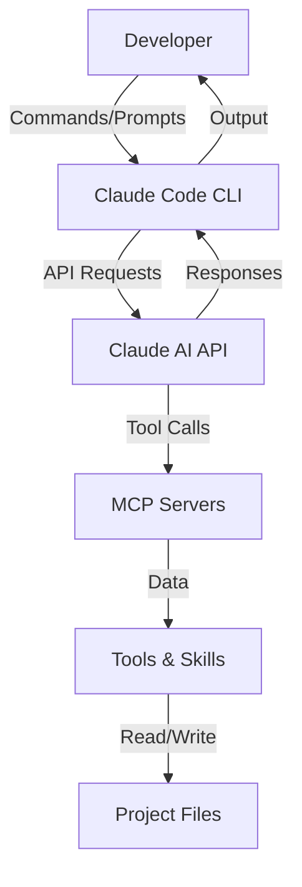

# Introduction to Claude Code

## What is Claude Code?

**Claude Code** is Anthropic's official command-line interface (CLI) tool that brings the power of Claude AI directly into your development environment. It's an AI-powered coding assistant designed to help developers write better code faster through intelligent code generation, refactoring, testing, documentation, and problem-solving capabilities.

### Key Characteristics

- **Official Anthropic Product**: Built and maintained by the creators of Claude AI
- **CLI-First**: Designed for terminal-based workflows and automation
- **Context-Aware**: Understands your entire codebase, not just individual files
- **Extensible**: Supports custom agents, commands, and skills
- **MCP-Compatible**: Uses Model Context Protocol for tool integrations
- **Project-Specific**: Can be configured per-project with custom workflows

### Why We Use Claude Code

At Hospeda, we've chosen Claude Code as our primary AI-assisted development tool because it:

1. **Accelerates Development**: Write code 3-5x faster with intelligent assistance
2. **Improves Code Quality**: Consistent patterns, best practices, and comprehensive testing
3. **Reduces Cognitive Load**: Let AI handle boilerplate, focus on business logic
4. **Enhances Documentation**: Automatic generation of comprehensive docs
5. **Facilitates Learning**: Explains complex concepts and suggests improvements
6. **Scales with Teams**: Consistent approaches across all developers

## How Claude Code Works

### Architecture Overview



### Core Components

#### 1. Claude AI Model

The foundation is Anthropic's Claude AI model (currently Sonnet 4.5), which provides:

- **Natural Language Understanding**: Interprets your requests in plain English
- **Code Generation**: Creates syntactically correct, idiomatic code
- **Code Understanding**: Analyzes existing code and suggests improvements
- **Context Awareness**: Maintains understanding across conversation turns
- **Multi-File Reasoning**: Understands relationships between files

#### 2. CLI Interface

The command-line interface that:

- **Manages Sessions**: Tracks conversation history and context
- **Handles I/O**: Processes commands and displays results
- **Coordinates Tools**: Orchestrates MCP servers and skills
- **Token Management**: Optimizes context usage within budget limits
- **Error Handling**: Gracefully handles failures and provides feedback

#### 3. MCP (Model Context Protocol) Servers

External services that extend Claude Code's capabilities:

- **Context7**: Access to library documentation (Astro, React, Hono, etc.)
- **Git**: Version control operations
- **GitHub**: Issue tracking, PR management
- **PostgreSQL/Neon**: Database queries and operations
- **Docker**: Container management
- **Vercel**: Deployment operations

#### 4. Agents System

Specialized AI personas configured for specific tasks. Each agent has:

- **Defined Role**: Specific expertise (backend, frontend, QA, etc.)
- **Responsibilities**: Clear scope of work
- **Context**: Relevant knowledge and patterns
- **Constraints**: Rules and guidelines to follow

#### 5. Commands System

Predefined workflows that automate common tasks:

- **Structured Prompts**: Template-based task execution
- **Multi-Step Workflows**: Orchestrate complex processes
- **Quality Gates**: Built-in checks and validations
- **Reusability**: Consistent approach across team

#### 6. Skills System

Modular capabilities that can be invoked by agents or commands:

- **Specialized Functions**: Testing, auditing, documentation, etc.
- **Composable**: Can be combined for complex tasks
- **Reusable**: Shared across agents and commands

### Interaction Flow

#### Basic Interaction

```text
1. Developer writes prompt
   ↓
2. Claude Code CLI processes input
   ↓
3. Request sent to Claude AI API
   ↓
4. Claude analyzes request and context
   ↓
5. Claude decides which tools to use
   ↓
6. MCP servers execute tool calls
   ↓
7. Results returned to Claude
   ↓
8. Claude formulates response
   ↓
9. Response displayed to developer
```

#### Agent Invocation Flow

```text
1. Developer invokes agent (Task: Invoke <agent>)
   ↓
2. CLI loads agent definition
   ↓
3. Agent context injected into Claude
   ↓
4. Claude adopts agent role
   ↓
5. Agent executes assigned task
   ↓
6. Agent may invoke skills
   ↓
7. Results validated against agent rules
   ↓
8. Output returned to developer
```

#### Command Execution Flow

```text
1. Developer runs command (/command-name)
   ↓
2. CLI loads command definition
   ↓
3. Command prompts loaded
   ↓
4. Claude executes command workflow
   ↓
5. Multi-step process (may invoke agents/skills)
   ↓
6. Quality checks applied
   ↓
7. Final output returned
```

## Key Features

### 1. Context Awareness

Claude Code understands your entire project:

**What it tracks:**

- Project structure and file organization
- Code patterns and conventions
- Dependencies and relationships
- Recent changes and history
- Documentation and comments

**How it helps:**

```text
# Instead of explaining everything:
"Create an accommodation service"

# Claude knows:
- Your service base class pattern
- Your model structure
- Your Zod schema approach
- Your test requirements
- Your naming conventions
```

### 2. Intelligent Code Generation

Generate production-ready code that follows your patterns:

**Features:**

- **Pattern Recognition**: Learns from existing code
- **Convention Following**: Matches your style
- **Type Safety**: Respects TypeScript constraints
- **Error Handling**: Includes proper error management
- **Testing**: Generates corresponding tests

**Example:**

```typescript
// You ask: "Create a booking service"

// Claude generates:
export class BookingService extends BaseCrudService<
  Booking,
  BookingModel,
  CreateBookingSchema,
  UpdateBookingSchema,
  SearchBookingSchema
> {
  constructor(ctx: ServiceContext, model?: BookingModel) {
    super(ctx, model ?? new BookingModel());
  }

  async createBooking(input: CreateBookingInput): Promise<Result<Booking>> {
    // Business logic validation
    const availability = await this.checkAvailability(input);
    if (!availability.success) {
      return Err(availability.error);
    }

    // Create booking
    const result = await this.create(input);
    if (!result.success) {
      return result;
    }

    // Send confirmation email
    await this.notificationService.sendBookingConfirmation(result.data);

    return result;
  }

  private async checkAvailability(
    input: CreateBookingInput
  ): Promise<Result<boolean>> {
    // Implementation
  }
}
```

### 3. Refactoring Assistance

Improve existing code while maintaining functionality:

**Capabilities:**

- **Pattern Extraction**: Identify repeated code
- **Type Improvements**: Strengthen type safety
- **Performance Optimization**: Identify bottlenecks
- **Readability Enhancement**: Improve code clarity
- **Test Coverage**: Add missing tests

**Example:**

```typescript
// Before: Multiple parameters
function createUser(name: string, email: string, role: string) {
  // ...
}

// After: RO-RO pattern (Claude suggests)
function createUser(input: CreateUserInput): Promise<Result<User>> {
  // ...
}
```

### 4. Testing Support

Comprehensive test generation and improvement:

**TDD Workflow:**

1. **Red**: Generate failing test based on requirements
2. **Green**: Implement minimum code to pass
3. **Refactor**: Improve while maintaining tests

**Test Types:**

- **Unit Tests**: Individual function testing
- **Integration Tests**: Component interaction testing
- **E2E Tests**: Full workflow testing

**Example:**

```typescript
// You say: "Write tests for AccommodationService.create"

// Claude generates:
describe('AccommodationService.create', () => {
  it('should create accommodation with valid data', async () => {
    // Arrange
    const input = createMockAccommodationInput();
    const service = new AccommodationService(mockContext);

    // Act
    const result = await service.create(input);

    // Assert
    expect(result.success).toBe(true);
    expect(result.data).toMatchObject(input);
  });

  it('should reject invalid price', async () => {
    // Arrange
    const input = createMockAccommodationInput({ pricePerNight: -100 });
    const service = new AccommodationService(mockContext);

    // Act
    const result = await service.create(input);

    // Assert
    expect(result.success).toBe(false);
    expect(result.error.code).toBe('VALIDATION_ERROR');
  });

  // More test cases...
});
```

### 5. Documentation Generation

Create comprehensive documentation automatically:

**Types of Documentation:**

- **Code Comments**: JSDoc for functions and classes
- **API Documentation**: OpenAPI/Swagger specs
- **Architecture Docs**: System design and patterns
- **User Guides**: How-to and tutorials
- **README Files**: Project and package overviews

**Example:**

```typescript
// You ask: "Document this function"

/**
 * Calculate total booking price including all fees
 *
 * Calculates base price for nights stayed, applies weekend surcharges,
 * adds cleaning and service fees using accommodation's pricing rules.
 *
 * @param input - Booking calculation parameters
 * @param input.accommodationId - Accommodation unique identifier
 * @param input.checkIn - Check-in date (ISO 8601)
 * @param input.checkOut - Check-out date (ISO 8601)
 * @param input.guests - Number of guests (1-20)
 * @returns Detailed price breakdown
 * @throws {ValidationError} If dates invalid or guests exceed maximum
 * @throws {NotFoundError} If accommodation doesn't exist
 * @example
 * ```typescript
 * const pricing = await calculatePrice({
 *   accommodationId: 'acc-123',
 *   checkIn: '2024-01-15',
 *   checkOut: '2024-01-20',
 *   guests: 2,
 * });
 * ```
 */
export async function calculateBookingPrice(
  input: CalculateBookingPriceInput
): Promise<BookingPriceBreakdown> {
  // Implementation
}
```

### 6. Debugging and Problem Solving

Identify and fix issues quickly:

**Capabilities:**

- **Error Analysis**: Understand error messages
- **Root Cause Identification**: Find underlying issues
- **Solution Suggestions**: Multiple fix options
- **Preventive Measures**: Avoid similar issues

**Example:**

```text
Developer: "Getting 'Cannot find module' error"

Claude:
1. Analyzes error stack trace
2. Checks import paths
3. Verifies file existence
4. Checks tsconfig.json paths
5. Identifies missing export
6. Suggests fix with explanation
```

### 7. Learning and Explanation

Understand unfamiliar code or concepts:

**Educational Features:**

- **Code Explanation**: Line-by-line breakdown
- **Concept Teaching**: Explain patterns and principles
- **Best Practices**: Industry standards and conventions
- **Alternatives**: Different approaches with tradeoffs

**Example:**

```text
Developer: "Explain this code"

Claude:
"This is a Higher-Order Component (HOC) pattern:
1. Takes a component as input
2. Wraps it with additional functionality
3. Returns enhanced component

Benefits:
- Code reuse across components
- Separation of concerns
- Testability

In this case, it adds authentication:
- Checks if user is logged in
- Redirects if not authenticated
- Passes user data as props"
```

## Agent System

### What are Agents?

Agents are specialized AI personas, each configured with:

- **Role**: Specific expertise (Backend Engineer, QA Engineer, etc.)
- **Knowledge**: Domain-specific information and patterns
- **Responsibilities**: Defined scope of work
- **Constraints**: Rules and guidelines to follow
- **Skills**: Capabilities they can invoke

### Hospeda's 14 Agents

#### Product Team

##### product-functional

- **Role**: Product Manager / Requirements Analyst
- **Expertise**: User stories, requirements, feature specifications
- **Outputs**: PDR documents, user acceptance criteria
- **When to Use**: Defining new features, clarifying requirements

##### product-technical

- **Role**: Technical Product Manager
- **Expertise**: Technical analysis, architecture planning
- **Outputs**: tech-analysis.md, task breakdowns
- **When to Use**: Planning technical implementation, architecture decisions

#### Leadership

##### tech-lead

- **Role**: Technical Lead / Architect
- **Expertise**: Architecture, coordination, decision facilitation
- **Outputs**: Architecture decisions, team coordination
- **When to Use**: Complex features, architectural changes, resolving conflicts

#### Backend Engineering

##### hono-engineer

- **Role**: Hono API Developer
- **Expertise**: Hono framework, API design, routing, middleware
- **Outputs**: API routes, middleware, request handlers
- **When to Use**: Creating/modifying API endpoints

##### db-drizzle-engineer

- **Role**: Database Engineer
- **Expertise**: Drizzle ORM, PostgreSQL, schema design, migrations
- **Outputs**: Database schemas, models, migrations
- **When to Use**: Database schema changes, model creation

##### node-typescript-engineer

- **Role**: Node.js/TypeScript Developer
- **Expertise**: Shared packages, utilities, type definitions
- **Outputs**: Utility functions, type definitions, shared modules
- **When to Use**: Creating shared packages, utility functions

#### Frontend Engineering

##### astro-engineer

- **Role**: Astro Developer
- **Expertise**: Astro framework, SSR, islands architecture
- **Outputs**: Astro pages, components, layouts
- **When to Use**: Web app development

##### react-senior-dev

- **Role**: Senior React Developer
- **Expertise**: React 19, hooks, components, state management
- **Outputs**: React components, hooks, context providers
- **When to Use**: Complex React components, hooks

##### tanstack-start-engineer

- **Role**: TanStack Start Developer
- **Expertise**: TanStack Start, routing, SSR
- **Outputs**: Admin dashboard pages, routes
- **When to Use**: Admin dashboard development

#### Quality Assurance

##### qa-engineer

- **Role**: QA Engineer / Test Specialist
- **Expertise**: Testing strategies, test writing, quality validation
- **Outputs**: Test suites, test plans, quality reports
- **When to Use**: Writing tests, validating quality

##### debugger

- **Role**: Debugging Specialist
- **Expertise**: Issue diagnosis, root cause analysis, troubleshooting
- **Outputs**: Bug analysis, fix suggestions, debugging strategies
- **When to Use**: Investigating bugs, performance issues

#### Design Team

##### ux-ui-designer

- **Role**: UX/UI Designer
- **Expertise**: User experience, interface design, mockups
- **Outputs**: UI mockups, component designs, user flows
- **When to Use**: Designing new features, improving UX

##### content-writer

- **Role**: Content Writer / Copywriter
- **Expertise**: User-facing text, messaging, microcopy
- **Outputs**: Button text, error messages, help text
- **When to Use**: Writing user-facing content

#### Specialized

##### tech-writer

- **Role**: Technical Writer / Documentation Specialist
- **Expertise**: Documentation, API specs, guides
- **Outputs**: Documentation, JSDoc, OpenAPI specs
- **When to Use**: Creating/updating documentation

### Agent Invocation

**Syntax:**

```text
Task: Invoke <agent-name> agent with the following task: <description>
```

**Example:**

```text
Task: Invoke hono-engineer agent with the following task:
Create a new API endpoint for booking cancellation:
- Route: DELETE /bookings/:id
- Validate booking ownership
- Check cancellation policy
- Process refund if applicable
- Return cancellation confirmation
```

### Agent Collaboration

Agents can work together on complex tasks:

**Example: New Feature Workflow**

```text
1. product-functional → Creates PDR
2. ux-ui-designer → Creates mockups
3. product-technical → Creates tech-analysis
4. db-drizzle-engineer → Designs database schema
5. hono-engineer → Creates API endpoints
6. astro-engineer → Creates frontend pages
7. qa-engineer → Writes tests
8. tech-writer → Updates documentation
```

## Skill System

### What are Skills?

Skills are modular, reusable capabilities that agents and commands can invoke to perform specialized tasks. Think of them as "tools in the toolbox" that enhance agent capabilities.

### Skill Categories

#### Audit Skills (3)

##### accessibility-audit

- **Purpose**: Check WCAG compliance
- **Outputs**: Accessibility report, fix suggestions
- **Used by**: qa-engineer, astro-engineer, react-senior-dev

##### performance-audit

- **Purpose**: Analyze performance bottlenecks
- **Outputs**: Performance report, optimization suggestions
- **Used by**: tech-lead, hono-engineer, astro-engineer

##### security-audit

- **Purpose**: Scan for vulnerabilities
- **Outputs**: Security report, risk assessment
- **Used by**: hono-engineer, tech-lead

#### Testing Skills (4)

##### api-app-testing

- **Purpose**: Test API endpoints
- **Outputs**: API test suites (Vitest)
- **Used by**: qa-engineer, hono-engineer

##### performance-testing

- **Purpose**: Load and stress testing
- **Outputs**: Performance benchmarks
- **Used by**: qa-engineer, hono-engineer

##### security-testing

- **Purpose**: Penetration testing
- **Outputs**: Security test results
- **Used by**: qa-engineer, hono-engineer

##### web-app-testing

- **Purpose**: E2E testing for web apps
- **Outputs**: Playwright test suites
- **Used by**: qa-engineer, astro-engineer

#### Documentation Skills (1)

##### markdown-formatter

- **Purpose**: Lint and format markdown
- **Outputs**: Formatted markdown files
- **Used by**: tech-writer, all agents

#### Git Skills (1)

##### git-commit-helper

- **Purpose**: Generate atomic commits
- **Outputs**: Conventional commit messages
- **Used by**: All agents

#### Pattern Skills (2)

##### error-handling-patterns

- **Purpose**: Apply error handling best practices
- **Outputs**: Consistent error handling code
- **Used by**: All engineering agents

##### tdd-methodology

- **Purpose**: Guide TDD implementation
- **Outputs**: Red-Green-Refactor workflow
- **Used by**: qa-engineer, all engineering agents

#### QA Skills (1)

##### qa-criteria-validator

- **Purpose**: Validate acceptance criteria
- **Outputs**: Quality validation report
- **Used by**: qa-engineer

#### Tech Skills (3)

##### mermaid-diagram-specialist

- **Purpose**: Create/edit Mermaid diagrams
- **Outputs**: Mermaid diagram code
- **Used by**: tech-writer, tech-lead

##### shadcn-specialist

- **Purpose**: Shadcn UI expertise
- **Outputs**: Shadcn component implementations
- **Used by**: react-senior-dev, astro-engineer

##### vercel-specialist

- **Purpose**: Vercel deployment expertise
- **Outputs**: Deployment configs, optimization
- **Used by**: tech-lead, hono-engineer

#### Utility Skills (3)

##### add-memory

- **Purpose**: Store persistent context
- **Outputs**: Memory entries
- **Used by**: tech-lead

##### json-data-auditor

- **Purpose**: Validate and analyze JSON
- **Outputs**: JSON validation reports
- **Used by**: All agents

##### pdf-creator-editor

- **Purpose**: Generate/edit PDFs
- **Outputs**: PDF documents
- **Used by**: tech-writer

#### Brand Skills (1)

##### brand-guidelines

- **Purpose**: Ensure Hospeda brand consistency
- **Outputs**: Brand-compliant content
- **Used by**: content-writer, ux-ui-designer

### Skill Invocation

Skills are typically invoked by agents or commands automatically, but you can request them:

**Example:**

```text
"Use the performance-audit skill to analyze the accommodation search endpoint"
```

## Command System

### What are Commands?

Commands are predefined workflows that automate common development tasks. They combine prompts, agents, and skills into reusable processes.

### Command Categories

#### Planning Commands (3)

##### /start-feature-plan

- **Purpose**: Initiate Level 3 feature planning
- **Workflow**:
  1. Invoke product-functional (PDR)
  2. Invoke ux-ui-designer (mockups)
  3. Invoke product-technical (tech-analysis)
  4. Generate TODOs
- **Output**: Planning session with all artifacts

##### /start-refactor-plan

- **Purpose**: Plan major refactoring
- **Workflow**:
  1. Analyze current code
  2. Identify improvements
  3. Create refactoring plan
  4. Generate tasks
- **Output**: Refactoring plan with tasks

##### /sync-planning-github

- **Purpose**: Sync planning docs to GitHub/Linear
- **Workflow**:
  1. Parse planning documents
  2. Create/update Linear issues
  3. Link to planning session
- **Output**: Synced tasks in Linear

#### Quality Commands (3)

##### /quality-check

- **Purpose**: Comprehensive quality validation
- **Workflow**:
  1. Run linting
  2. Run type checking
  3. Run tests with coverage
  4. Check formatting
- **Output**: Quality report

##### /code-check

- **Purpose**: Code quality validation (no tests)
- **Workflow**:
  1. Run linting
  2. Run type checking
  3. Check formatting
- **Output**: Code quality report

##### /run-tests

- **Purpose**: Execute test suites
- **Workflow**:
  1. Run all tests
  2. Generate coverage report
  3. Identify gaps
- **Output**: Test results and coverage

#### Development Commands (2)

##### /add-new-entity

- **Purpose**: Scaffold complete entity
- **Workflow**:
  1. Create Zod schema
  2. Create DB schema
  3. Create model
  4. Create service
  5. Create API routes
  6. Generate tests
- **Output**: Complete entity implementation

##### /update-docs

- **Purpose**: Update documentation
- **Workflow**:
  1. Analyze changes
  2. Update relevant docs
  3. Generate JSDoc
  4. Update README if needed
- **Output**: Updated documentation

#### Git Commands (1)

##### /commit

- **Purpose**: Generate conventional commits
- **Workflow**:
  1. Analyze staged changes
  2. Group related files
  3. Generate commit messages
  4. Suggest commit strategy
- **Output**: Commit message suggestions

#### Audit Commands (3)

##### /audit:security-audit

- **Purpose**: Security vulnerability scan
- **Workflow**:
  1. Invoke security-audit skill
  2. Analyze dependencies
  3. Check code patterns
  4. Generate report
- **Output**: Security audit report

##### /audit:performance-audit

- **Purpose**: Performance analysis
- **Workflow**:
  1. Invoke performance-audit skill
  2. Identify bottlenecks
  3. Suggest optimizations
  4. Generate report
- **Output**: Performance audit report

##### /audit:accessibility-audit

- **Purpose**: Accessibility compliance check
- **Workflow**:
  1. Invoke accessibility-audit skill
  2. Check WCAG compliance
  3. Suggest improvements
  4. Generate report
- **Output**: Accessibility audit report

#### Meta Commands (4)

##### /meta:help

- **Purpose**: Show command help
- **Output**: List of available commands

##### /meta:create-agent

- **Purpose**: Create new agent
- **Workflow**:
  1. Define agent role
  2. Specify responsibilities
  3. Generate agent file
- **Output**: New agent definition

##### /meta:create-command

- **Purpose**: Create new command
- **Workflow**:
  1. Define command purpose
  2. Specify workflow
  3. Generate command file
- **Output**: New command definition

##### /meta:create-skill

- **Purpose**: Create new skill
- **Workflow**:
  1. Define skill capability
  2. Specify usage
  3. Generate skill file
- **Output**: New skill definition

## Benefits of AI-Assisted Development

### 1. Velocity

**Traditional Development:**

- Research patterns
- Write boilerplate
- Create tests
- Write documentation
- Debug issues

**Time**: 4-8 hours per feature

**With Claude Code:**

- Describe feature
- Review generated code
- Adjust as needed
- Run quality checks

**Time**: 1-2 hours per feature

**Speed Increase**: 3-5x

### 2. Quality

**Automated Best Practices:**

- Consistent code patterns
- Comprehensive testing (90%+ coverage)
- Type safety enforcement
- Error handling
- Documentation

**Result**: Higher quality, fewer bugs

### 3. Learning

**Built-in Mentor:**

- Explains unfamiliar concepts
- Suggests improvements
- Teaches best practices
- Provides alternatives

**Result**: Faster skill development

### 4. Focus

**Delegate Mechanical Work:**

- Boilerplate generation
- Test scaffolding
- Documentation writing
- Pattern application

**Focus on Business Logic:**

- Core functionality
- Edge cases
- User experience
- Architecture decisions

**Result**: Better use of human expertise

### 5. Consistency

**Team-Wide Standards:**

- Same patterns everywhere
- Consistent naming
- Uniform testing approach
- Standardized documentation

**Result**: Easier code review, maintenance

## When to Use Claude Code vs Traditional Coding

### Use Claude Code For

**✅ Code Generation**

- New features (scaffolding)
- Boilerplate code
- Test generation
- Documentation

**✅ Refactoring**

- Pattern extraction
- Code organization
- Type improvements
- Performance optimization

**✅ Problem Solving**

- Debugging
- Understanding errors
- Finding solutions
- Learning concepts

**✅ Documentation**

- JSDoc comments
- API documentation
- Architecture docs
- User guides

**✅ Planning**

- Feature breakdown
- Task atomization
- Technical analysis
- Architecture decisions

### Use Traditional Coding For

**🔧 Complex Business Logic**

- Domain-specific algorithms
- Nuanced requirements
- Proprietary processes

**🔧 Creative Solutions**

- Novel approaches
- Experimental features
- Unique patterns

**🔧 Sensitive Code**

- Security-critical code
- Financial calculations
- Regulatory compliance

**🔧 Fine-Tuning**

- Performance optimization
- Edge case handling
- User experience polish

### Hybrid Approach (Best Practice)

Most tasks benefit from combining both:

1. **Claude Code**: Generate initial implementation
2. **Human Review**: Verify correctness, business logic
3. **Claude Code**: Add tests, documentation
4. **Human Review**: Validate coverage, edge cases
5. **Claude Code**: Refactor for quality
6. **Human Review**: Final approval, deployment

## Context Management

### Understanding Token Budget

Claude Code has a token budget (typically 200,000 tokens) that limits how much context can be in each conversation.

**What Consumes Tokens:**

- Conversation history
- File contents read
- Tool outputs
- Code generated
- Documentation

**Managing Budget:**

1. **Start Fresh Sessions**: New feature = new conversation
2. **Be Specific**: Target specific files/components
3. **Use Memory**: Store persistent knowledge with `/add-memory`
4. **Clear Focus**: One task at a time

### Best Practices

**DO:**

- ✅ Start new conversation for new features
- ✅ Reference specific files by path
- ✅ Use concise, clear prompts
- ✅ Let Claude know what context it needs
- ✅ Use `/add-memory` for persistent info

**DON'T:**

- ❌ Include unnecessary files
- ❌ Repeat information already in context
- ❌ Ask overly broad questions
- ❌ Try to do too much in one session
- ❌ Include large files unless necessary

## Limitations and Considerations

### Current Limitations

1. **Context Window**: Limited token budget per conversation
2. **Model Knowledge Cutoff**: January 2025 (may not know latest frameworks)
3. **No Internet Access**: Cannot browse web or fetch latest docs
4. **File System Scope**: Only accesses project files, not external systems
5. **Execution Environment**: Cannot run code directly (requires manual execution)

### What Claude Code Cannot Do

**❌ Replace Human Judgment**

- Cannot make business decisions
- Cannot determine user preferences
- Cannot evaluate aesthetic quality
- Cannot assess organizational needs

**❌ Handle All Edge Cases**

- May miss domain-specific edge cases
- Cannot predict all user behaviors
- May not consider regulatory requirements

**❌ Ensure Correctness**

- Generated code must be reviewed
- Tests must be validated
- Business logic must be verified

**❌ Deploy or Run Code**

- Cannot execute code
- Cannot deploy to servers
- Cannot modify external systems

### Mitigations

**Always:**

1. **Review Generated Code**: Understand before accepting
2. **Test Thoroughly**: Run tests, check edge cases
3. **Validate Business Logic**: Ensure correctness
4. **Security Review**: Check for vulnerabilities
5. **Human Approval**: Required for major decisions

## Getting the Most Out of Claude Code

### 1. Write Clear Prompts

**❌ Vague:**

```text
"Fix the booking thing"
```

**✅ Specific:**

```text
"Fix the bug in BookingService.create() where weekend surcharge
is not applied correctly. The issue is in the date calculation
at line 145. Weekend should include Friday, Saturday, Sunday."
```

### 2. Provide Context

**❌ No Context:**

```text
"Create a user service"
```

**✅ With Context:**

```text
"Create a UserService following the same pattern as
AccommodationService (extends BaseCrudService). Include methods
for:
- create (with email validation)
- updateProfile (excluding email changes)
- deactivate (soft delete)
Include comprehensive tests with 90%+ coverage."
```

### 3. Break Down Complex Tasks

**❌ Too Broad:**

```text
"Build the booking system"
```

**✅ Broken Down:**

```text
"Let's build the booking system in steps:

Step 1: Create Zod schema for booking validation
Step 2: Create database schema with foreign keys
Step 3: Create BookingModel extending BaseModel
Step 4: Create BookingService with business methods
Step 5: Create API routes with proper validation
Step 6: Add comprehensive tests

Let's start with Step 1."
```

### 4. Use Proper Terminology

**❌ Ambiguous:**

```text
"Add the thing that shows the price"
```

**✅ Precise:**

```text
"Create a PriceBreakdown React component that displays:
- Base price per night
- Number of nights
- Weekend surcharge
- Cleaning fee
- Service fee
- Total price

Use Shadcn Card component and format currency with Intl."
```

### 5. Leverage Agents

**❌ Generic Request:**

```text
"Create tests for the API"
```

**✅ Agent Invocation:**

```text
"Task: Invoke qa-engineer agent to create comprehensive test suite
for the Accommodation API endpoints following TDD methodology.
Include unit tests for the service, integration tests for the API
routes, and E2E tests for the complete flow."
```

### 6. Iterate and Refine

**Process:**

1. Generate initial solution
2. Review and identify issues
3. Request specific improvements
4. Validate changes
5. Repeat until satisfied

**Example:**

```text
Initial: "Create AccommodationService"
Review: "Generated service missing availability check"
Refine: "Add checkAvailability method that queries bookings table"
Review: "Good, but needs date overlap logic"
Refine: "Update checkAvailability to detect date overlaps using
         SQL BETWEEN clause for check-in/check-out dates"
```

### 7. Use Commands Effectively

**Before Major Commits:**

```bash
/quality-check   # Validate quality
/run-tests       # Ensure tests pass
/commit          # Generate commit message
```

**For New Features:**

```bash
/start-feature-plan   # Structured planning
# ... implement ...
/update-docs          # Update documentation
```

## Next Steps

Now that you understand Claude Code:

1. **[Setup Guide](./setup.md)** - Configure Claude Code for Hospeda
2. **[Best Practices](./best-practices.md)** - Develop effective AI-assisted patterns
3. **[Workflows](./workflows.md)** - Master project-specific workflows
4. **[Resources](./resources.md)** - Explore additional learning materials

## Changelog

| Version | Date | Changes | Author |
|---------|------|---------|--------|
| 1.0.0 | 2025-01-15 | Initial documentation | tech-writer |

---

**Ready to start?** Head to the [Setup Guide](./setup.md).
