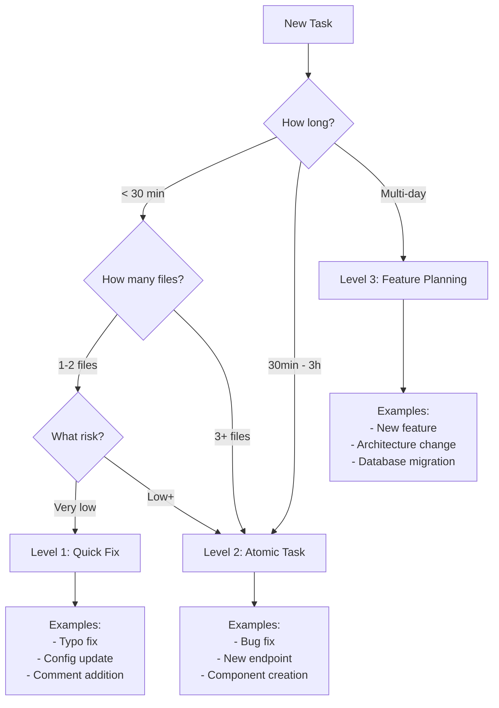
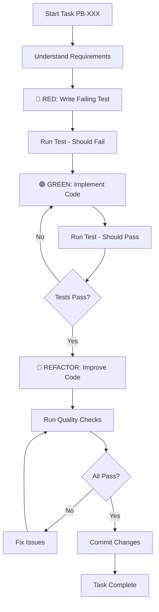
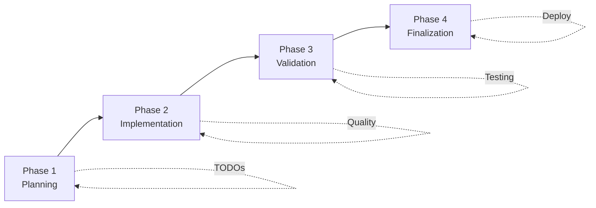

# Workflows

## Overview

This guide details the project-specific workflows for Hospeda development using Claude Code. We use three workflow levels based on task complexity, timeframe, and risk.

## Workflow Decision Tree

Use this decision tree to choose the right workflow:



## Level 1: Quick Fix Protocol

**Time**: < 30 minutes
**Files**: 1-2
**Risk**: Very low
**Examples**: Typos, formatting, simple config updates

### When to Use

Use Level 1 for:

- ✅ Fixing typos in code or documentation
- ✅ Updating configuration values
- ✅ Adding comments
- ✅ Formatting fixes
- ✅ Renaming variables (single file)
- ✅ Simple documentation updates

### Process

```text
1. Identify Issue
   ↓
2. Make Fix
   ↓
3. Verify
   ↓
4. Commit
```

### Step-by-Step Example

#### Task: Fix typo in error message

**1. Identify Issue**

```typescript
// packages/service-core/src/services/booking/booking.service.ts
throw new Error('Accomodation not available'); // Typo: "Accomodation"
```

**2. Make Fix**

```text
Prompt to Claude:
"Fix typo in packages/service-core/src/services/booking/booking.service.ts
line 45. Change 'Accomodation' to 'Accommodation'"
```

**3. Verify**

```bash
# Quick check
grep -r "Accomodation" packages/service-core/src/
# Should return no results

# Run code check
/code-check
```

**4. Commit**

```bash
/commit

# Expected commit message:
# fix(service): correct typo in booking error message
#
# Changed 'Accomodation' to 'Accommodation' in BookingService
```

### Quick Fix Checklist

- [ ] Change is obvious and safe
- [ ] Affects 1-2 files maximum
- [ ] No business logic changes
- [ ] No type changes
- [ ] No test changes needed (or trivial)
- [ ] Can be verified in < 5 minutes
- [ ] Low risk if wrong

## Level 2: Atomic Task Protocol

**Time**: 30 minutes - 3 hours
**Files**: 2-10
**Risk**: Low to medium
**Examples**: Bug fixes, small features, new endpoints

### When to Use

Use Level 2 for:

- ✅ Bug fixes (with tests)
- ✅ New API endpoints
- ✅ New React components
- ✅ Service method additions
- ✅ Database model updates
- ✅ Small feature implementations

### TDD Workflow (Red-Green-Refactor)

Level 2 ALWAYS uses Test-Driven Development:

```text
RED: Write failing test
   ↓
GREEN: Make test pass
   ↓
REFACTOR: Improve code
   ↓
COMMIT: Atomic commit
```

### Process Flow



### Step-by-Step Example

#### Task PB-042: Add endpoint to cancel booking

**1. Understand Requirements**

```text
Requirements:
- Endpoint: DELETE /bookings/:id
- Validate user owns booking
- Check cancellation policy (24h before check-in)
- Process refund if applicable
- Update booking status to 'cancelled'
- Send cancellation confirmation email
- Return 200 with updated booking
```

**2. RED: Write Failing Test**

```text
Prompt to Claude:
"Task: Invoke qa-engineer agent to write failing tests for
booking cancellation endpoint (DELETE /bookings/:id) with these scenarios:

1. Happy path: Cancel booking 3 days before check-in
2. Error: Cancel within 24h of check-in (policy violation)
3. Error: User doesn't own booking (403)
4. Error: Booking doesn't exist (404)
5. Error: Booking already cancelled (400)
6. Edge case: Refund calculation for partial cancellation

Follow TDD methodology - tests should fail initially."
```

**Generated Tests:**

```typescript
// apps/api/test/routes/bookings/cancel.test.ts
import { describe, it, expect, beforeEach } from 'vitest';
import { app } from '@/app';
import { createTestBooking, createTestUser } from '@/test/helpers';

describe('DELETE /bookings/:id', () => {
  let user: TestUser;
  let booking: TestBooking;

  beforeEach(async () => {
    user = await createTestUser();
    booking = await createTestBooking({
      userId: user.id,
      checkIn: addDays(new Date(), 7), // 7 days from now
      status: 'confirmed',
    });
  });

  it('should cancel booking 3 days before check-in', async () => {
    const response = await app.request(
      `/bookings/${booking.id}`,
      {
        method: 'DELETE',
        headers: { Authorization: `Bearer ${user.token}` },
      }
    );

    expect(response.status).toBe(200);
    const data = await response.json();
    expect(data.booking.status).toBe('cancelled');
    expect(data.refundAmount).toBeGreaterThan(0);
  });

  it('should reject cancellation within 24h of check-in', async () => {
    booking = await createTestBooking({
      userId: user.id,
      checkIn: addHours(new Date(), 12), // 12 hours from now
    });

    const response = await app.request(
      `/bookings/${booking.id}`,
      {
        method: 'DELETE',
        headers: { Authorization: `Bearer ${user.token}` },
      }
    );

    expect(response.status).toBe(400);
    const data = await response.json();
    expect(data.error.code).toBe('CANCELLATION_POLICY_VIOLATION');
  });

  it('should reject if user does not own booking', async () => {
    const otherUser = await createTestUser();

    const response = await app.request(
      `/bookings/${booking.id}`,
      {
        method: 'DELETE',
        headers: { Authorization: `Bearer ${otherUser.token}` },
      }
    );

    expect(response.status).toBe(403);
  });

  // More tests...
});
```

**Run Tests (Should Fail):**

```bash
cd apps/api && pnpm test cancel
# ❌ All tests fail (endpoint doesn't exist yet)
```

**3. GREEN: Implement Code**

```text
Prompt to Claude:
"Now implement the DELETE /bookings/:id endpoint to make these tests pass.

Create:
1. Route handler in apps/api/src/routes/bookings/cancel.ts
2. Service method BookingService.cancel() in packages/service-core/
3. Update booking schema to include 'cancelled' status

Follow existing patterns from BookingService.create()"
```

**Generated Implementation:**

```typescript
// apps/api/src/routes/bookings/cancel.ts
import { createRoute } from '@/lib/route-factory';
import { BookingService } from '@repo/service-core';
import { z } from 'zod';

const paramsSchema = z.object({
  id: z.string().uuid(),
});

export const cancelBookingRoute = createRoute({
  method: 'DELETE',
  path: '/bookings/:id',
  auth: true,
  schema: { params: paramsSchema },
  handler: async (c) => {
    const { id } = c.req.valid('param');
    const actor = c.get('actor');

    const service = new BookingService({ actor, logger: c.get('logger') });
    const result = await service.cancel({ id });

    if (!result.success) {
      return c.json({ error: result.error }, result.error.status || 400);
    }

    return c.json({
      success: true,
      booking: result.data.booking,
      refundAmount: result.data.refundAmount,
    });
  },
});

// packages/service-core/src/services/booking/booking.service.ts
export class BookingService extends BaseCrudService<...> {
  async cancel(input: { id: string }): Promise<Result<CancellationResult>> {
    // 1. Find booking
    const bookingResult = await this.findById({ id: input.id });
    if (!bookingResult.success) {
      return bookingResult;
    }

    const booking = bookingResult.data;

    // 2. Verify ownership
    if (booking.userId !== this.ctx.actor.id) {
      return Err({
        code: 'FORBIDDEN',
        message: 'You do not own this booking',
        status: 403,
      });
    }

    // 3. Check if already cancelled
    if (booking.status === 'cancelled') {
      return Err({
        code: 'ALREADY_CANCELLED',
        message: 'Booking is already cancelled',
        status: 400,
      });
    }

    // 4. Check cancellation policy (24h before check-in)
    const now = new Date();
    const checkIn = new Date(booking.checkIn);
    const hoursBefore = (checkIn.getTime() - now.getTime()) / (1000 * 60 * 60);

    if (hoursBefore < 24) {
      return Err({
        code: 'CANCELLATION_POLICY_VIOLATION',
        message: 'Cancellation must be at least 24 hours before check-in',
        status: 400,
      });
    }

    // 5. Calculate refund
    const refundAmount = this.calculateRefund(booking, hoursBefore);

    // 6. Update booking status
    const updateResult = await this.update({
      id: booking.id,
      status: 'cancelled',
      cancelledAt: now,
    });

    if (!updateResult.success) {
      return updateResult;
    }

    // 7. Process refund (if applicable)
    if (refundAmount > 0) {
      await this.paymentService.processRefund({
        bookingId: booking.id,
        amount: refundAmount,
      });
    }

    // 8. Send confirmation email
    await this.notificationService.sendCancellationConfirmation({
      booking: updateResult.data,
      refundAmount,
    });

    return Ok({
      booking: updateResult.data,
      refundAmount,
    });
  }

  private calculateRefund(booking: Booking, hoursBefore: number): number {
    // Full refund if > 7 days before
    if (hoursBefore > 24 * 7) {
      return booking.totalPrice;
    }

    // 50% refund if 24h-7days before
    return booking.totalPrice * 0.5;
  }
}
```

**Run Tests (Should Pass):**

```bash
cd apps/api && pnpm test cancel
# ✅ All tests pass
```

**4. REFACTOR: Improve Code**

```text
Prompt to Claude:
"Review the booking cancellation code for improvements:
1. Can we extract the policy logic to a separate class?
2. Are there any edge cases we're missing?
3. Can we simplify the refund calculation?
4. Add JSDoc comments"
```

**Refactored Code:**

```typescript
// Extract policy to separate class
class CancellationPolicy {
  private static readonly FULL_REFUND_HOURS = 24 * 7; // 7 days
  private static readonly MIN_CANCELLATION_HOURS = 24; // 24 hours

  static canCancel(checkIn: Date): Result<number> {
    const hoursBefore = this.getHoursBeforeCheckIn(checkIn);

    if (hoursBefore < this.MIN_CANCELLATION_HOURS) {
      return Err({
        code: 'CANCELLATION_POLICY_VIOLATION',
        message: 'Cancellation must be at least 24 hours before check-in',
      });
    }

    return Ok(hoursBefore);
  }

  static calculateRefundPercentage(hoursBefore: number): number {
    if (hoursBefore > this.FULL_REFUND_HOURS) {
      return 1.0; // 100% refund
    }
    return 0.5; // 50% refund
  }

  private static getHoursBeforeCheckIn(checkIn: Date): number {
    const now = new Date();
    return (checkIn.getTime() - now.getTime()) / (1000 * 60 * 60);
  }
}

// Update service to use policy
export class BookingService extends BaseCrudService<...> {
  /**
   * Cancel a booking and process refund if applicable
   *
   * Validates ownership, checks cancellation policy, processes refund,
   * and sends confirmation email.
   *
   * @param input - Cancellation parameters
   * @param input.id - Booking UUID
   * @returns Cancelled booking and refund amount
   * @throws {ForbiddenError} If user doesn't own booking
   * @throws {ValidationError} If cancellation policy violated
   */
  async cancel(input: { id: string }): Promise<Result<CancellationResult>> {
    // ... (cleaner implementation using CancellationPolicy)
  }
}
```

**Run Tests Again:**

```bash
cd apps/api && pnpm test cancel
# ✅ All tests still pass after refactoring
```

**5. Run Quality Checks**

```bash
/quality-check

# Output:
# Running quality checks...
# 1. Linting... ✓
# 2. Type checking... ✓
# 3. Tests... ✓ (92% coverage)
# 4. Format validation... ✓
#
# All checks passed!
```

**6. Commit Changes**

```bash
/commit

# Claude suggests:
# Commit 1: feat(schemas): add booking cancelled status
# Files: packages/schemas/src/booking.schema.ts
#
# Commit 2: feat(service): add booking cancellation with policy
# Files:
# - packages/service-core/src/services/booking/booking.service.ts
# - packages/service-core/src/services/booking/cancellation-policy.ts
# - packages/service-core/test/services/booking/cancel.test.ts
#
# Commit 3: feat(api): add booking cancellation endpoint
# Files:
# - apps/api/src/routes/bookings/cancel.ts
# - apps/api/test/routes/bookings/cancel.test.ts

# Execute commits
git add packages/schemas/src/booking.schema.ts
git commit -m "feat(schemas): add booking cancelled status"

# ... (remaining commits)
```

**Task Complete!** ✅

### Atomic Task Checklist

- [ ] Understood requirements clearly
- [ ] Wrote failing tests first (RED)
- [ ] Implemented code to pass tests (GREEN)
- [ ] Refactored for quality (REFACTOR)
- [ ] Ran quality checks (all passed)
- [ ] Created atomic commits
- [ ] Updated documentation (if needed)
- [ ] Task code referenced in commits

## Level 3: Feature Planning (4 Phases)

**Time**: Multi-day
**Complexity**: High
**Examples**: New features, architecture changes, major refactoring

### When to Use

Use Level 3 for:

- ✅ New features requiring multiple components
- ✅ Database schema changes
- ✅ Architecture changes
- ✅ Cross-team coordination
- ✅ Multiple atomic tasks (5+)
- ✅ Breaking changes

### Overview of 4 Phases



### Phase 1: Planning

**Goal**: Create comprehensive plan with all necessary artifacts

#### Artifacts Created

1. **PDR** (Product Design & Requirements)
2. **Mockups** (UI/UX designs)
3. **tech-analysis.md** (Technical analysis)
4. **TODOs.md** (Task breakdown)

#### Phase 1: Process

**Step 1: Initiate Planning**

```bash
/start-feature-plan
```

**Step 2: Describe Feature**

```text
Claude: "Describe the feature you want to plan"

You: "Subscription system for hosts to access premium features:

Features:
- Multiple pricing tiers (Basic free, Pro $29/mo, Enterprise $99/mo)
- 14-day free trial
- Monthly/yearly billing
- Credit card payments via Mercado Pago
- Usage limits per tier
- Subscription management (upgrade/downgrade/cancel)

Users:
- Hosts can subscribe
- Admins can manage subscriptions
- Guests see host's tier badge

Scope:
- Phase 1: Basic subscription (this planning)
- Future: Usage-based billing, team plans"
```

**Step 3: Review PDR**

```text
Claude invokes product-functional agent, generates PDR:

# PDR: Host Subscription System

## Overview
Enable hosts to subscribe to premium features with tiered pricing.

## User Stories
1. As a host, I want to subscribe to Pro tier to access premium features
2. As a host, I want a 14-day free trial before being charged
3. As a host, I want to manage my subscription (upgrade/cancel)
4. As an admin, I want to track subscription revenue

## Acceptance Criteria
- [ ] Support 3 tiers: Basic (free), Pro ($29/mo), Enterprise ($99/mo)
- [ ] 14-day free trial for paid tiers
- [ ] Monthly and yearly billing options
- [ ] Credit card payments via Mercado Pago
- [ ] Email notifications for subscription changes
- [ ] Admin dashboard for subscription analytics

## Out of Scope
- Usage-based billing
- Team/organization plans
- Custom pricing

## Success Metrics
- 20% of hosts upgrade to paid tier within 3 months
- 60% trial-to-paid conversion rate
```

You: "Approved! Continue with mockups"

**Step 4: Review Mockups**

```text
Claude invokes ux-ui-designer agent, generates mockups:

[Detailed UI mockups for:]
1. Pricing page
2. Subscription selection
3. Payment form
4. Subscription management
5. Admin analytics dashboard

You: "Looks good! Please change the payment form to single-page
instead of multi-step."

Claude: [Updates mockups]

You: "Perfect! Continue with technical analysis"
```

**Step 5: Review Technical Analysis**

```text
Claude invokes product-technical agent, generates tech-analysis.md:

# Technical Analysis: Subscription System

## Architecture

### Database Schema
- subscriptions table (tier, status, trial_end, current_period_end)
- subscription_items table (usage tracking)
- pricing_tiers table (tier configuration)

### Services
- SubscriptionService (CRUD, upgrade/downgrade, cancel)
- BillingService (payment processing, invoicing)
- UsageService (track usage against limits)

### API Endpoints
- POST /subscriptions (create/subscribe)
- GET /subscriptions (list user's subscriptions)
- PATCH /subscriptions/:id (upgrade/downgrade)
- DELETE /subscriptions/:id (cancel)
- POST /subscriptions/:id/resume (reactivate)

### Frontend
- Web: Pricing page, subscription management
- Admin: Subscription analytics, user management

## Implementation Phases
Phase 1: Database + Service (PB-100 to PB-105)
Phase 2: API Endpoints (PB-106 to PB-110)
Phase 3: Frontend (PB-111 to PB-115)
Phase 4: Testing + Docs (PB-116 to PB-120)

## Dependencies
- Mercado Pago SDK
- Email service (for notifications)
- Redis (for rate limiting)

## Risks
- Payment gateway integration complexity
- PCI compliance requirements
- Proration calculation complexity

## Estimated Effort
- Backend: 3-4 days
- Frontend: 2-3 days
- Testing: 1-2 days
- Total: ~8 days
```

You: "Approved! Generate task breakdown"

**Step 6: Review TODOs**

```text
Claude generates TODOs.md with atomized tasks:

# Subscription System - Task Breakdown

## Phase 1: Database Foundation (Days 1-2)

### PB-100: Create subscription Zod schemas
- [ ] Create subscription validation schemas
- [ ] Create pricing tier schemas
- [ ] Add subscription status enum
**Agent**: node-typescript-engineer
**Estimated**: 1h

### PB-101: Create subscription database schema
- [ ] Create subscriptions table
- [ ] Create pricing_tiers table
- [ ] Create subscription_items table
- [ ] Add migration
**Agent**: db-drizzle-engineer
**Estimated**: 2h

### PB-102: Create SubscriptionModel
- [ ] Extend BaseModel
- [ ] Add findByUser method
- [ ] Add findActive method
- [ ] Add tests (90%+ coverage)
**Agent**: db-drizzle-engineer
**Estimated**: 2h

[... more tasks ...]

You: "Perfect! Let's start implementation"
```

**Planning Phase Checklist:**

- [ ] Feature clearly described
- [ ] PDR created and approved
- [ ] Mockups created and approved
- [ ] Technical analysis completed
- [ ] Tasks atomized (each < 3h)
- [ ] Dependencies identified
- [ ] Risks documented
- [ ] Effort estimated

### Phase 2: Implementation

**Goal**: Implement all tasks using TDD with specialized agents

#### Phase 2: Process

**For Each Task:**

```text
1. Select task from TODOs.md
2. Invoke appropriate agent
3. Use TDD (Red-Green-Refactor)
4. Run quality checks
5. Mark task complete
6. Commit changes
```

#### Example: Implementing PB-102

```text
Task: PB-102 - Create SubscriptionModel

1. Read task requirements from TODOs.md

1. Invoke agent:
"Task: Invoke db-drizzle-engineer agent to implement PB-102:

Create SubscriptionModel in packages/db/src/models/subscription.model.ts
- Extend BaseModel<Subscription>
- Add findByUser(userId: string): Promise<Result<Subscription[]>>
- Add findActive(userId: string): Promise<Result<Subscription | null>>
- Include comprehensive tests in test/models/subscription.model.test.ts
- Follow pattern from AccommodationModel
- Ensure 90%+ coverage"

1. Agent uses TDD:
   RED: Writes failing tests
   GREEN: Implements SubscriptionModel
   REFACTOR: Improves code quality

1. Run quality checks:
   /quality-check

1. Mark complete in TODOs.md:
   - [x] PB-102: Create SubscriptionModel ✅

1. Commit:
   /commit
   git commit -m "feat(db): add SubscriptionModel with user queries"
```

**Implementation Phase Checklist:**

- [ ] All tasks from TODOs.md completed
- [ ] Each task followed TDD
- [ ] All quality checks passed
- [ ] 90%+ test coverage achieved
- [ ] All changes committed
- [ ] Documentation updated

### Phase 3: Validation

**Goal**: Comprehensive QA and quality validation

#### Phase 3: Process

**Step 1: QA Validation**

```text
Task: Invoke qa-engineer agent to validate subscription system:

1. Review all tests for completeness
2. Add missing edge case tests
3. Perform integration testing
4. Verify error handling
5. Check happy paths and sad paths
6. Validate acceptance criteria from PDR
```

**Step 2: Code Review**

```text
Request code review from Claude:

"Review the subscription system implementation for:
1. Code quality and patterns
2. Type safety
3. Error handling
4. Security issues
5. Performance concerns
6. Documentation completeness"
```

**Step 3: Testing**

```bash
# Run all tests
/run-tests

# Run specific test suites
cd packages/service-core && pnpm test subscription
cd apps/api && pnpm test subscriptions

# Check coverage
pnpm test:coverage
# Verify 90%+ coverage
```

**Step 4: Manual Testing**

```bash
# Start development environment
pnpm dev

# Test flows:
1. Create subscription
2. Upgrade tier
3. Downgrade tier
4. Cancel subscription
5. Reactivate subscription
6. Trial expiration
7. Payment failure
```

**Validation Phase Checklist:**

- [ ] QA engineer validated
- [ ] Code review completed
- [ ] All automated tests pass
- [ ] 90%+ coverage verified
- [ ] Manual testing completed
- [ ] Acceptance criteria met
- [ ] No critical issues found

### Phase 4: Finalization

**Goal**: Documentation, commits, and deployment

#### Phase 4: Process

**Step 1: Update Documentation**

```bash
/update-docs

# Updates:
1. API documentation (OpenAPI spec)
2. Architecture docs
3. User guides
4. README files
5. Inline JSDoc comments
```

**Step 2: Generate Commits**

```bash
/commit

# Review suggested commits
# Ensure atomic commits
# Verify conventional commit format
```

**Step 3: Create PR**

```bash
# Push branch
git push origin feature/subscription-system

# Create PR with:
- PDR link
- Implementation summary
- Testing notes
- Breaking changes (if any)
- Screenshots/demos
```

**Step 4: Sync to Linear**

```bash
# Sync planning to Linear
pnpm planning:sync .claude/sessions/planning/P-00X-subscription-system/

# Or use command
/sync-planning-github
```

**Step 5: Deployment**

```bash
# Merge to main
# CI/CD will:
1. Run all tests
2. Run quality checks
3. Build applications
4. Deploy to staging
5. Run E2E tests
6. Deploy to production (if approved)
```

**Finalization Phase Checklist:**

- [ ] Documentation updated
- [ ] Atomic commits created
- [ ] PR created with description
- [ ] Planning synced to Linear
- [ ] CI/CD passing
- [ ] Deployed to staging
- [ ] Stakeholder approval
- [ ] Deployed to production

## Common Workflows

### Creating a New Entity

Complete entity creation (DB → Service → API → Frontend)

```bash
/add-new-entity

# Claude will prompt for:
Entity name: Subscription
Fields: tier, status, trialEnd, currentPeriodEnd
Relations: belongsTo User, hasMany SubscriptionItems

# Generates:
1. Zod schema (packages/schemas)
2. DB schema (packages/db/schemas)
3. Model (packages/db/models)
4. Service (packages/service-core)
5. API routes (apps/api/routes)
6. Tests (test/ folders)
```

### Fixing a Bug

Use Level 2 workflow with TDD:

```text
1. Create issue in Linear/GitHub
2. Reproduce bug with failing test (RED)
3. Fix bug (GREEN)
4. Refactor if needed (REFACTOR)
5. Run quality checks
6. Commit with issue reference
7. Close issue
```

### Adding a Feature

**Small feature** (< 1 day): Use Level 2
**Large feature** (multi-day): Use Level 3

### Refactoring Code

```bash
# For major refactoring:
/start-refactor-plan

# Claude will:
1. Analyze current code
2. Identify issues
3. Suggest improvements
4. Create refactoring plan
5. Break into tasks

# Then implement with:
- TDD to maintain behavior
- Quality checks at each step
- Atomic commits
```

### Writing Tests

Use qa-engineer agent:

```text
Task: Invoke qa-engineer agent to create comprehensive test suite for
SubscriptionService including:

1. Unit tests for each method
2. Integration tests for workflows
3. Edge cases (trial expiration, payment failure, etc.)
4. Error scenarios
5. Ensure 90%+ coverage
6. Follow TDD methodology
```

### Updating Documentation

```bash
/update-docs

# Or manually invoke tech-writer:
Task: Invoke tech-writer agent to update documentation for
subscription system:

1. API documentation (OpenAPI spec)
2. Architecture docs
3. User guide for subscription management
4. JSDoc for all public methods
```

### Performance Optimization

```bash
# Run audit
/audit:performance-audit

# Review report
# Implement optimizations with Level 2 workflow
# Verify improvements with benchmarks
```

### Security Fix

```bash
# Run audit
/audit:security-audit

# For each vulnerability:
1. Create bug task
2. Fix with Level 2 workflow (TDD)
3. Verify fix with security-testing skill
4. Commit with security: prefix
```

## GitHub Integration

### Syncing Planning to Linear

After completing Phase 1 (Planning):

```bash
# Sync planning session
pnpm planning:sync .claude/sessions/planning/P-00X-feature-name/

# This creates:
1. Linear issue for feature
2. Sub-tasks for each TODO
3. Links to planning artifacts
4. Proper labels and assignees
```

### Creating Issues

Use GitHub MCP server:

```text
"Create GitHub issue for bug in booking availability check:

Title: Availability check not detecting overlapping bookings
Description: [detailed description]
Labels: bug, backend, high-priority
Assignee: @username"
```

### Tracking Tasks

Link commits to Linear tasks:

```bash
git commit -m "feat(service): add subscription cancellation

Implements cancellation with prorated refund calculation.

Closes PB-105"
```

## Collaboration Patterns

### Working with Multiple Agents

Example: Complex feature requiring coordination

```text
1. product-functional → Create PDR
2. ux-ui-designer → Create mockups
3. product-technical → Analyze architecture
4. db-drizzle-engineer → Design database
5. hono-engineer → Create API
6. react-senior-dev → Create components
7. qa-engineer → Write tests
8. tech-writer → Update docs
```

### Agent Coordination

Tech-lead coordinates agents:

```text
Task: Invoke tech-lead agent to coordinate subscription system
implementation across:

- db-drizzle-engineer (database)
- hono-engineer (API)
- astro-engineer (frontend)
- qa-engineer (testing)

Ensure:
- Consistent patterns
- Proper dependencies
- Quality standards
```

### Resolving Conflicts

When agents disagree:

```text
Claude: "db-drizzle-engineer suggests using JSONB for metadata,
but hono-engineer prefers separate table for type safety.

Options:

1. JSONB column (flexible but less type-safe)
   Pros: Flexible schema, single table
   Cons: Less type safety, harder to query

1. Separate table (type-safe but more complex)
   Pros: Type safety, easier validation
   Cons: More tables, more joins

Which approach do you prefer?"

You: [Make decision based on project needs]
```

## Next Steps

- **[Best Practices](./best-practices.md)** - Effective AI-assisted development patterns
- **[Resources](./resources.md)** - Additional learning materials
- **[Introduction](./introduction.md)** - Deep dive into Claude Code

## Changelog

| Version | Date | Changes | Author |
|---------|------|---------|--------|
| 1.0.0 | 2025-01-15 | Initial workflows documentation | tech-writer |

---

**Master these workflows** and you'll efficiently handle any task in Hospeda!
