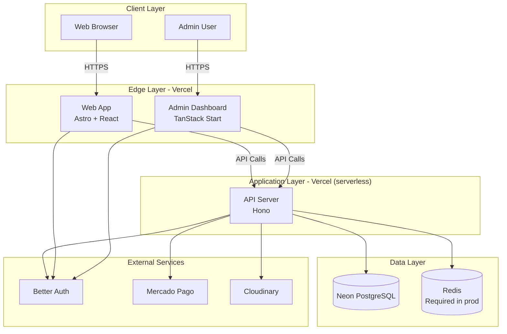

# Deployment Documentation

> **Important**: For environment variables, secrets, and per-service onboarding, ALWAYS refer to [`secrets.md`](./secrets.md) (canonical). For first-time production setup, follow [`first-time-setup.md`](./first-time-setup.md).

**Last Updated**: 2026-04-30

## Introduction

Hospeda is a tourism accommodation platform built as a TurboRepo monorepo with three deployable apps and supporting managed services.

### Platform Components

1. **Web App** (`apps/web`) — Public-facing Astro + React 19 site for browsing and booking.
2. **Admin Dashboard** (`apps/admin`) — Internal TanStack Start tool for managing listings, bookings, and operations.
3. **API Server** (`apps/api`) — Hono REST API serving both apps.

### Technology Stack

| Layer | Technology | Purpose |
|-------|------------|---------|
| Frontend (Web) | Astro + React 19 | SSR public website |
| Frontend (Admin) | TanStack Start + React 19 | SSR admin dashboard |
| Backend (API) | Hono (Node.js) | REST API server |
| Database | PostgreSQL (Neon) | Primary data store |
| ORM | Drizzle | Type-safe database access |
| Authentication | Better Auth | User authentication |
| Payments | Mercado Pago | Payment processing |
| Storage | Cloudinary | Image hosting and CDN |
| Hosting | Vercel | All three apps |

## Architecture



## Deployment Strategy

### Multi-Cloud Deployment

| Service | Platform | Purpose |
|---------|----------|---------|
| Web | Vercel | Public-facing website |
| Admin | Vercel | Administration dashboard |
| API | Vercel (serverless) | Backend API server |
| Database | Neon | Serverless PostgreSQL |
| Auth | Better Auth | Authentication |
| Payments | Mercado Pago | Payment processing |
| Image CDN | Cloudinary | Image hosting and delivery |

### Core Principles

1. **Continuous Deployment** — Automated deployments via GitHub Actions on merge.
2. **Progressive Delivery** — `staging` branch deploys to staging before `main` deploys to production.
3. **Zero-Downtime Deployments** — Vercel atomic deployments.
4. **Rollback Capability** — Instant rollback via `vercel rollback` or dashboard promotion.
5. **Observability First** — Sentry, Vercel Analytics, Neon monitoring.

### Deployment Triggers

- **Production**: Push/merge to `main` → `cd-production.yml` runs `vercel --prod`.
- **Staging**: Push/merge to `staging` → `cd-staging.yml` runs preview deploy.
- **Preview**: Pull requests to `main` → automatic Vercel preview.
- **Manual**: `pnpm deploy:api`, `pnpm deploy:web`, `pnpm deploy:admin`, `pnpm deploy:all`.

## Environment Strategy

Three deployment tiers. The full per-environment matrix lives in [`environments.md`](./environments.md). Quick reference:

| Tier | Branch | API URL | Web URL | Admin URL |
|------|--------|---------|---------|-----------|
| Development | local | `http://localhost:3001` | `http://localhost:4321` | `http://localhost:3000` |
| Staging | `staging` | `https://api.staging.hospeda.ar` | `https://staging.hospeda.ar` | `https://admin.staging.hospeda.ar` |
| Production | `main` | `https://api.hospeda.ar` | `https://hospeda.ar` | `https://admin.hospeda.ar` |

For environment variable definitions, prefix conventions, and how to add new variables, see [`environments.md`](./environments.md). For per-secret values and how to obtain them, see [`secrets.md`](./secrets.md).

## Rollback Procedures

### Application Rollback (Vercel)

```bash
vercel ls                          # List recent deployments
vercel rollback                    # Rollback to previous deployment
vercel rollback <deployment-url>   # Rollback to a specific deployment
```

You can also promote a previous deployment via the Vercel dashboard (instant, no rebuild).

### Database Rollback

Hospeda uses `drizzle-kit push` (no numbered migration files). To revert a schema change, push a corrective schema and re-run `packages/db/scripts/apply-postgres-extras.sh`. For data recovery, use Neon point-in-time recovery from the Neon console.

## Monitoring and Health Checks

### Health Check Endpoints

```bash
curl https://api.hospeda.ar/health          # API
curl https://hospeda.ar/api/health          # Web
curl https://admin.hospeda.ar/api/health    # Admin
```

### Monitoring Tools

- **Vercel Analytics** — Frontend and API performance metrics.
- **Vercel Logs** — Real-time function logs and deployment logs (built-in).
- **Neon Console** — Database performance and connection pool monitoring.
- **Sentry** — Error tracking and alerting (requires source maps upload in production).
- **BetterStack** — Uptime monitoring and public status page (free tier, 10 monitors).

### Alerting Thresholds

| Trigger | Threshold | Action |
|---------|-----------|--------|
| Error rate | > 5% for 5 minutes | Investigate immediately |
| Response time p95 | > 1000ms for 5 minutes | Investigate |
| Health check failures | 2 consecutive | Auto-rollback candidate |

### Service Status Pages

- Vercel: <https://www.vercel-status.com/>
- Neon: <https://neonstatus.com/>

## Security

For secret management policy, rotation cadence, and incident response, see:

- [`./secrets.md`](./secrets.md) — Per-secret reference (canonical).
- [`./rotation-schedule.md`](./rotation-schedule.md) — Secret rotation runbook and schedule.
- [`../security/README.md`](../security/README.md) — Cross-cutting security guidelines (CORS, headers, rate limiting, DDoS).

Critical points:

- HTTPS enforced on all endpoints; HSTS configured.
- CORS whitelisted to known app origins (`HOSPEDA_SITE_URL`, `HOSPEDA_ADMIN_URL`).
- Rate limiting requires Redis in production (`HOSPEDA_REDIS_URL`).
- Sentry source maps must be uploaded for readable stack traces.

## Disaster Recovery

### Backup Strategy

- **Automatic** — Neon daily backups (7-day staging retention, 30-day production retention).
- **Manual** — `pg_dump $HOSPEDA_DATABASE_URL > backup-$(date +%Y%m%d).sql`.

### Recovery Targets

- **RTO** (Recovery Time Objective): 1 hour.
- **RPO** (Recovery Point Objective): 24 hours.

### Recovery Procedures

1. **Database failure** — Restore from Neon backup or use point-in-time recovery from the Neon console.
2. **Application failure** — Rollback the affected app via `vercel rollback` or dashboard promotion.
3. **External service failure** — Graceful degradation; see app-specific deployment docs for fallback behavior.
4. **Complete infrastructure failure** — Follow [`first-time-setup.md`](./first-time-setup.md) on a backup provider.

## Common Commands

```bash
# Local development
pnpm dev                # Start all apps
pnpm test               # Run tests
pnpm typecheck          # Type checking
pnpm lint               # Code linting

# Database
pnpm db:start           # Start Postgres + Redis (Docker)
pnpm db:fresh-dev       # Reset + push schema + seed
pnpm db:studio          # Open Drizzle Studio

# Environment sync
pnpm env:check          # Validate local env against registry
pnpm env:pull           # Pull from Vercel
pnpm env:push           # Push to Vercel

# Manual deployment (CI/CD is preferred)
pnpm deploy:api         # Deploy API to production
pnpm deploy:web         # Deploy web to production
pnpm deploy:admin       # Deploy admin to production
pnpm deploy:all         # Deploy all three sequentially

# Vercel
vercel logs --prod      # View production logs
vercel ls               # List recent deployments
```

## Documents in This Folder

- **[`first-time-setup.md`](./first-time-setup.md)** — Master "from zero to deployed" runbook for setting up production from scratch.
- **[`environments.md`](./environments.md)** — Environment tiers, prefix conventions, and pointers to env-var registries.
- **[`secrets.md`](./secrets.md)** — Canonical per-secret reference (every variable, where to set it, how to obtain credentials).
- **[`rotation-schedule.md`](./rotation-schedule.md)** — Secret rotation runbook and cadence.
- **[`ci-cd.md`](./ci-cd.md)** — GitHub Actions CI/CD workflows (`ci.yml`, `cd-staging.yml`, `cd-production.yml`).
- **[`checklist.md`](./checklist.md)** — General pre/post-deployment checklist for all apps.
- **[`billing-checklist.md`](./billing-checklist.md)** — Pre-deployment checklist for billing/MercadoPago changes.

## Per-App Deployment Guides

- **[API Deployment](./apps/api.md)** — Hono serverless config, cron setup, Redis, Sentry source maps.
- **[Web Deployment](./apps/web.md)** — Astro build, ISR/SSR routing, `PUBLIC_*` env mirroring.
- **[Admin Deployment](./apps/admin.md)** — TanStack Start build, Vite client bundle, `VITE_*` env mirroring.

## External Documentation

- [Vercel Documentation](https://vercel.com/docs)
- [Neon Documentation](https://neon.tech/docs)
- [Better Auth Documentation](https://better-auth.com/docs)
- [Mercado Pago Documentation](https://www.mercadopago.com.ar/developers)

## Pre-Deployment Checklist

### Code Quality

- [ ] All tests passing (`pnpm test`)
- [ ] Type checking passes (`pnpm typecheck`)
- [ ] Linting passes (`pnpm lint`)
- [ ] Code coverage >= 90%
- [ ] No security vulnerabilities (`pnpm audit`)

### Database

- [ ] Schema changes tested in staging via `db:fresh-dev`
- [ ] `apply-postgres-extras.sh` executed if triggers/materialized views/CHECK constraints changed
- [ ] Backup verified (Neon daily backup or manual `pg_dump`)

### Configuration

- [ ] `pnpm env:check --ci` passes for the target environment
- [ ] New secrets registered in [`secrets.md`](./secrets.md)
- [ ] CORS origins verified

### External Services

- [ ] Better Auth configured for the target environment
- [ ] Mercado Pago tokens correct for the environment (`APP_USR-*` for prod, `TEST-*` for staging)
- [ ] Cloudinary uploads working
- [ ] Resend `HOSPEDA_RESEND_API_KEY` set if transactional email is in scope

### Monitoring

- [ ] Health check endpoints reachable
- [ ] Sentry DSN configured and source maps uploaded
- [ ] Alerts wired

### Communication

- [ ] Team notified of deployment window
- [ ] Rollback plan communicated
