# Deployment Documentation

## Introduction

Hospeda is a modern tourism accommodation platform built as a monorepo application with multiple services deployed across cloud-native infrastructure. This document covers the deployment strategy, architecture, and operational considerations.

### Platform Components

1. **Web App** .. Public-facing website for browsing and booking accommodations
2. **Admin Dashboard** .. Internal tool for managing listings, bookings, and operations
3. **API Server** .. Backend services handling business logic and data

### Technology Stack

| Layer | Technology | Purpose |
|-------|-----------|---------|
| Frontend (Web) | Astro + React 19 | SSR public website |
| Frontend (Admin) | TanStack Start + React 19 | SSR admin dashboard |
| Backend (API) | Hono (Node.js) | REST API server |
| Database | PostgreSQL (Neon) | Primary data store |
| ORM | Drizzle | Type-safe database access |
| Authentication | Better Auth | User authentication |
| Payments | Mercado Pago | Payment processing |
| Storage | Cloudinary | Image hosting and CDN |
| Hosting | Vercel | Application hosting (all three apps) |

## Architecture


## Deployment Strategy

### Monorepo Architecture

Hospeda uses a **TurboRepo monorepo** structure that enables:

- **Shared Dependencies**: Common packages used across applications
- **Coordinated Deployments**: Deploy all services or individual apps
- **Code Reusability**: Shared schemas, utilities, and business logic
- **Type Safety**: End-to-end type safety from database to frontend

### Multi-Cloud Deployment

| Service | Platform | Purpose |
|---------|----------|---------|
| Web | Vercel | Public-facing website |
| Admin | Vercel | Administration dashboard |
| API | Vercel (serverless) | Backend API server |
| Database | Neon | Serverless PostgreSQL |
| Auth | Better Auth | Authentication service |
| Payments | Mercado Pago | Payment processing |

### Core Principles

1. **Continuous Deployment** .. Automated deployments on code merge
2. **Progressive Delivery** .. Deploy to staging before production
3. **Zero-Downtime Deployments** .. Atomic deployment strategy
4. **Rollback Capability** .. Instant rollback if issues detected
5. **Infrastructure as Code** .. Configuration in version control
6. **Observability First** .. Comprehensive monitoring and logging

## Deployment Platforms

### Vercel (Web, Admin, API)

**Features Used:**

- Serverless functions for API
- SSR/SSG for frontend applications
- Global edge network for low-latency delivery
- Automatic SSL/TLS certificates
- Preview deployments for pull requests
- Atomic deployments with instant rollback
- Environment variable management

**Deployment Triggers:**

- **Production**: Push to `main` branch
- **Preview**: Pull requests to `main`
- **Manual**: Triggered via Vercel CLI or dashboard

### Neon (Database)

**Features Used:**

- Serverless PostgreSQL with automatic scaling
- Built-in connection pooling (Pgbouncer)
- Database branching for development
- Automatic daily backups with 7-day retention
- Point-in-time recovery
- Query performance monitoring

**Database Branches:**

- `main`: Production database
- `staging`: Staging environment database
- `dev`: Development database

### External Services

- **Better Auth**: OAuth providers, email/password auth, session management, webhooks
- **Mercado Pago**: Credit/debit card payments, installment plans, refunds, webhooks
- **Cloudinary**: Image uploads, automatic optimization, responsive images, global CDN

## Deployment Flow

```mermaid
graph LR
    subgraph "Development"
        Dev[Local Development]
        Test[Run Tests]
        Build[Build Apps]
    end

    subgraph "Quality Gates"
        TypeCheck[Type Check]
        Lint[Lint Code]
        Coverage[Coverage Check]
    end

    subgraph "Staging"
        StagingDeploy[Deploy to Staging]
        StagingTest[Staging Tests]
        Review[Manual Review]
    end

    subgraph "Production"
        ProdDeploy[Deploy to Production]
        Smoke[Smoke Tests]
        Monitor[Monitor]
    end

    Dev --> Test --> Build
    Build --> TypeCheck --> Lint --> Coverage
    Coverage --> StagingDeploy
    StagingDeploy --> StagingTest --> Review
    Review --> ProdDeploy
    ProdDeploy --> Smoke --> Monitor
```



### Stages

1. **Local Development**: Feature development, unit tests, local testing
2. **Quality Gates (CI)**: Type checking, linting, unit tests, coverage >= 90%, security audit
3. **Staging**: Deploy on merge to `develop`, run integration tests, manual QA
4. **Production**: Deploy on merge to `main`, run smoke tests, monitor error rates

### Safety Measures

- Atomic deployments (zero downtime)
- Automatic rollback on health check failure
- Database migration validation
- Post-deployment monitoring (15 minutes)

## Environment Strategy

### Environment Tiers

| Environment | Trigger | Database | External Services | Rate Limiting |
|-------------|---------|----------|-------------------|---------------|
| Development | Local | Local Docker | Mock/sandbox | None |
| Staging | Merge to `develop` | Staging Neon branch | Sandbox mode | Relaxed |
| Production | Merge to `main` | Production Neon | Production mode | Strict |

### Environment Variables

```env
# Development
NODE_ENV=development
HOSPEDA_API_URL=http://localhost:3001
HOSPEDA_SITE_URL=http://localhost:4321
HOSPEDA_DATABASE_URL=postgresql://localhost:5432/hospeda_dev

# Staging
NODE_ENV=staging
HOSPEDA_API_URL=https://api-staging.hospeda.com
HOSPEDA_SITE_URL=https://staging.hospeda.com

# Production
NODE_ENV=production
HOSPEDA_API_URL=https://api.hospeda.com
HOSPEDA_SITE_URL=https://hospeda.com
```

### Environment Isolation

- Separate databases for dev, staging, production
- Separate Better Auth applications per environment
- Separate payment credentials per environment
- Unique API keys per environment
- Different domain names per environment

## Rollback Procedures

### Application Rollback (Vercel)

```bash
# List recent deployments
vercel ls

# Rollback to previous deployment
vercel rollback

# Rollback to specific deployment
vercel rollback <deployment-url>

# Or promote a specific deployment via Vercel dashboard
```

### Database Rollback

```bash
pnpm db:rollback
pnpm db:rollback --to=<migration-name>
```

## Monitoring and Health Checks

### Health Check Endpoints

```bash
# API
curl https://api.hospeda.com/health
# Expected: {"status": "healthy", "timestamp": "..."}

# Web
curl https://hospeda.com/api/health

# Admin
curl https://admin.hospeda.com/api/health
```

### Monitoring Tools

- **Vercel Analytics**: Frontend and API performance metrics
- **Neon Console**: Database performance and connection pool monitoring
- **Sentry**: Error tracking and alerting
- **LogTail**: Centralized log viewing

### Alerting

| Trigger | Threshold | Action |
|---------|-----------|--------|
| Error rate | > 5% for 5 minutes | Investigate immediately |
| Response time p95 | > 1000ms for 5 minutes | Investigate |
| CPU usage | > 80% for 10 minutes | Scale up |
| Health check failures | 2 consecutive | Auto-rollback |

### Service Status Pages

- Vercel: <https://www.vercel-status.com/>
- Neon: <https://neonstatus.com/>

## Security Considerations

### Secret Management

- Never commit secrets to version control
- Use Vercel Environment Variables for production (encrypted at rest)
- Use `.env.local` for development (gitignored)
- Rotate secrets regularly
- Use different secrets per environment

### Network Security

- HTTPS enforced on all endpoints
- CORS properly configured (whitelist origins)
- Rate limiting per endpoint and per user
- Security headers (CSP, HSTS, X-Frame-Options)
- DDoS protection via Cloudflare

See [Security Documentation](../security/README.md) for detailed security guidelines.

## Disaster Recovery

### Backup Strategy

- **Automatic**: Daily backups via Neon (7-day staging, 30-day production)
- **Manual**: `pg_dump $HOSPEDA_DATABASE_URL > backup-$(date +%Y%m%d).sql`

### Recovery Targets

- **RTO (Recovery Time Objective)**: 1 hour
- **RPO (Recovery Point Objective)**: 24 hours

### Recovery Procedures

1. **Database Failure**: Restore from Neon backup or point-in-time recovery
2. **Application Failure**: Rollback deployment via Vercel
3. **External Service Failure**: Graceful degradation
4. **Complete Infrastructure Failure**: Migrate to backup provider

## Common Commands

### Development

```bash
pnpm dev                # Start all services locally
pnpm test               # Run unit tests
pnpm typecheck          # Type checking
pnpm lint               # Code linting
```

### Database

```bash
pnpm db:generate        # Generate migration
pnpm db:migrate         # Run migrations
pnpm db:rollback        # Rollback migration
pnpm db:studio          # Open database studio
pnpm db:seed            # Seed database
pnpm db:fresh           # Reset + migrate + seed
```

### Deployment

```bash
# Deploy individual apps via Vercel CLI
cd apps/api && vercel --prod
cd apps/web && vercel --prod
cd apps/admin && vercel --prod

# View logs
vercel logs --prod
```

## Quick Links

### Core Documentation

- **[Environment Configuration](./environments.md)** .. Environment variables and configuration
- **[API Deployment](../../apps/api/docs/development/deployment.md)** .. Hono API deployment to Vercel
- **[Web Deployment](../../apps/web/docs/deployment.md)** .. Astro web app deployment to Vercel
- **[Admin Deployment](../../apps/admin/docs/development/deployment.md)** .. TanStack Start admin deployment to Vercel

### Specialized Guides

- **[CI/CD Pipeline](./ci-cd.md)** .. Automated deployment workflows

### External Documentation

- [Vercel Documentation](https://vercel.com/docs)
- [Neon Documentation](https://neon.tech/docs)
- [Better Auth Documentation](https://better-auth.com/docs)
- [Mercado Pago Documentation](https://www.mercadopago.com.ar/developers)

## Pre-Deployment Checklist

### Code Quality

- [ ] All tests passing (`pnpm test`)
- [ ] Type checking passes (`pnpm typecheck`)
- [ ] Linting passes (`pnpm lint`)
- [ ] Code coverage >= 90%
- [ ] No security vulnerabilities (`pnpm audit`)

### Database

- [ ] Migrations tested in staging
- [ ] Backup created
- [ ] Rollback plan documented
- [ ] Database connection tested

### Configuration

- [ ] Environment variables configured
- [ ] Secrets stored securely
- [ ] API keys validated
- [ ] CORS settings verified
- [ ] Rate limiting configured

### External Services

- [ ] Better Auth authentication working
- [ ] Mercado Pago integration tested
- [ ] Cloudinary uploads working

### Monitoring

- [ ] Health check endpoints working
- [ ] Logging configured
- [ ] Error tracking enabled (Sentry)
- [ ] Alerts configured

### Communication

- [ ] Team notified of deployment
- [ ] Rollback plan communicated
