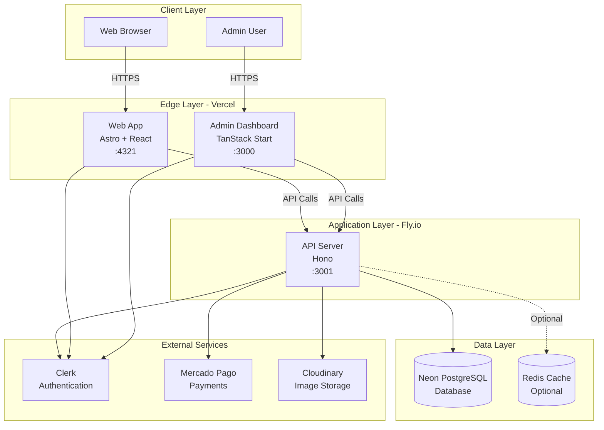

# Deployment Documentation

## Overview

This directory contains comprehensive deployment documentation for the Hospeda tourism platform. Hospeda is a monorepo application with multiple services deployed across different platforms.

## Architecture Overview

Hospeda uses a modern, cloud-native architecture:



## Deployment Platforms

| Service | Platform | URL Pattern | Purpose |
|---------|----------|-------------|---------|
| **Web** | Vercel | `hospeda.com` | Public-facing website |
| **Admin** | Vercel | `admin.hospeda.com` | Administration dashboard |
| **API** | Fly.io/Node | `api.hospeda.com` | Backend API server |
| **Database** | Neon | PostgreSQL endpoint | Primary data store |
| **Auth** | Clerk | Clerk endpoints | Authentication service |
| **Payments** | Mercado Pago | MP endpoints | Payment processing |

## Quick Links

### Core Documentation

- **[Deployment Overview](./overview.md)** - Architecture, strategy, and deployment flow
- **[Environment Configuration](./environments.md)** - Environment variables and configuration
- **[API Deployment](./api.md)** - Hono API deployment to Fly.io
- **[Web Deployment](./web.md)** - Astro web app deployment to Vercel
- **[Admin Deployment](./admin.md)** - TanStack Start admin deployment to Vercel
- **[Database Management](./database.md)** - Neon PostgreSQL setup and migrations

### Specialized Guides

- **[CI/CD Pipeline](./cicd.md)** - Automated deployment workflows
- **[Monitoring & Logging](./monitoring.md)** - Application monitoring and log management
- **[Disaster Recovery](./disaster-recovery.md)** - Backup and recovery procedures
- **[Scaling Guide](./scaling.md)** - Horizontal and vertical scaling strategies
- **[Security](./security.md)** - Security best practices and configuration
- **[Troubleshooting](./troubleshooting.md)** - Common issues and solutions

### Reference

- **[Environment Variables Reference](./environments.md#environment-variables-reference)** - Complete list of env vars
- **[Deployment Checklist](./checklist.md)** - Pre-deployment verification steps
- **[Rollback Procedures](./rollback.md)** - How to rollback deployments

## Prerequisites

Before deploying Hospeda, ensure you have:

### Required Accounts

- [ ] **Vercel Account** - For web and admin deployments
- [ ] **Fly.io Account** - For API deployment
- [ ] **Neon Account** - For PostgreSQL database
- [ ] **Clerk Account** - For authentication
- [ ] **Mercado Pago Account** - For payment processing
- [ ] **GitHub Account** - For source code and CI/CD

### Optional Accounts

- [ ] **Cloudinary Account** - For image storage and CDN
- [ ] **Redis Cloud Account** - For caching (if using Redis)
- [ ] **Sentry Account** - For error tracking
- [ ] **LogTail Account** - For centralized logging

### Local Development Tools

- [ ] **Node.js** - Version 20.10.0 or higher
- [ ] **PNPM** - Version 8.15.6 or higher
- [ ] **Git** - Version 2.40 or higher
- [ ] **Docker** - (Optional) For local database

### CLI Tools

```bash
# Install Vercel CLI
pnpm add -g vercel

# Install Fly CLI
curl -L https://fly.io/install.sh | sh

# Install Neon CLI
curl -fsSL https://raw.githubusercontent.com/neondatabase/neonctl/main/install.sh | bash
```

## Quick Start

### 1. Clone Repository

```bash
git clone https://github.com/hospeda/hospeda.git
cd hospeda
```

### 2. Install Dependencies

```bash
pnpm install
```

### 3. Configure Environment Variables

```bash
# Copy environment template
cp .env.example .env.local

# Edit .env.local with your values
nano .env.local
```

See [Environment Configuration](./environments.md) for detailed variable descriptions.

### 4. Set Up Database

```bash
# Run migrations
pnpm db:migrate

# Seed database (optional, for development)
pnpm db:seed
```

### 5. Deploy Services

```bash
# Deploy API to Fly.io
cd apps/api
fly deploy

# Deploy Web to Vercel
cd apps/web
vercel --prod

# Deploy Admin to Vercel
cd apps/admin
vercel --prod
```

See individual deployment guides for detailed instructions.

## Common Deployment Commands

### Development

```bash
# Start all services locally
pnpm dev

# Start specific service
pnpm dev --filter=api
pnpm dev --filter=web
pnpm dev --filter=admin

# Run tests before deployment
pnpm test

# Run type checking
pnpm typecheck

# Run linting
pnpm lint
```

### Database

```bash
# Generate migration
pnpm db:generate

# Run migrations
pnpm db:migrate

# Rollback migration
pnpm db:rollback

# Open database studio
pnpm db:studio

# Seed database
pnpm db:seed

# Fresh database (reset + migrate + seed)
pnpm db:fresh
```

### Deployment

```bash
# Deploy API (Fly.io)
cd apps/api
fly deploy
fly logs  # View logs

# Deploy Web (Vercel)
cd apps/web
vercel --prod
vercel logs  # View logs

# Deploy Admin (Vercel)
cd apps/admin
vercel --prod
vercel logs  # View logs
```

### Monitoring

```bash
# Check API health
curl https://api.hospeda.com/health

# View API logs (Fly.io)
fly logs -a hospeda-api

# View Web logs (Vercel)
vercel logs hospeda-web

# Check database status
neonctl status
```

## Deployment Flow

```mermaid
graph LR
    subgraph "Development"
        Dev[Local Development]
        Test[Run Tests]
        Build[Build Apps]
    end

    subgraph "Quality Gates"
        TypeCheck[Type Check]
        Lint[Lint Code]
        Coverage[Coverage Check]
    end

    subgraph "Staging"
        StagingDeploy[Deploy to Staging]
        StagingTest[Staging Tests]
        Review[Manual Review]
    end

    subgraph "Production"
        ProdDeploy[Deploy to Production]
        Smoke[Smoke Tests]
        Monitor[Monitor]
    end

    Dev --> Test --> Build
    Build --> TypeCheck --> Lint --> Coverage
    Coverage --> StagingDeploy
    StagingDeploy --> StagingTest --> Review
    Review --> ProdDeploy
    ProdDeploy --> Smoke --> Monitor
```



### Environments

1. **Development** (`dev`)
   - Local development environment
   - Hot reload enabled
   - Debug logging
   - Local or development database

1. **Staging** (`staging`)
   - Pre-production testing
   - Production-like configuration
   - Staging database (separate from prod)
   - Full monitoring enabled

1. **Production** (`production`)
   - Live production environment
   - Optimized builds
   - Production database
   - Full monitoring and alerting

## Deployment Checklist

Before deploying to production:

### Code Quality

- [ ] All tests passing (`pnpm test`)
- [ ] Type checking passes (`pnpm typecheck`)
- [ ] Linting passes (`pnpm lint`)
- [ ] Code coverage ≥ 90%
- [ ] No security vulnerabilities (`pnpm audit`)

### Database

- [ ] Migrations tested in staging
- [ ] Backup created
- [ ] Rollback plan documented
- [ ] Database connection tested

### Configuration

- [ ] Environment variables configured
- [ ] Secrets stored securely
- [ ] API keys validated
- [ ] CORS settings verified
- [ ] Rate limiting configured

### External Services

- [ ] Clerk authentication working
- [ ] Mercado Pago integration tested
- [ ] Cloudinary uploads working
- [ ] Email service configured

### Monitoring

- [ ] Health check endpoints working
- [ ] Logging configured
- [ ] Error tracking enabled (Sentry)
- [ ] Performance monitoring enabled
- [ ] Alerts configured

### Documentation

- [ ] Deployment notes updated
- [ ] Changelog updated
- [ ] API documentation current
- [ ] Environment variables documented

### Communication

- [ ] Team notified of deployment
- [ ] Maintenance window scheduled (if needed)
- [ ] Rollback plan communicated
- [ ] On-call engineer assigned

## Troubleshooting Quick Reference

### Common Issues

| Issue | Quick Fix | Documentation |
|-------|-----------|---------------|
| Build fails | Check Node.js version (20.10.0+) | [Troubleshooting](./troubleshooting.md#build-failures) |
| Database connection fails | Verify `HOSPEDA_DATABASE_URL` | [Database](./database.md#connection-issues) |
| Authentication not working | Check Clerk keys | [Security](./security.md#authentication) |
| API errors | Check logs: `fly logs` | [API Deployment](./api.md#debugging) |
| Vercel deployment fails | Check build logs in Vercel dashboard | [Web](./web.md)/[Admin](./admin.md) |
| Environment variables missing | Verify `.env` file | [Environments](./environments.md) |
| CORS errors | Update CORS configuration | [API](./api.md#cors-configuration) |
| Rate limiting issues | Adjust rate limit settings | [API](./api.md#rate-limiting) |
| Database migration fails | Check migration logs | [Database](./database.md#migrations) |
| Production errors | Check Sentry dashboard | [Monitoring](./monitoring.md) |

### Getting Help

1. **Check Documentation** - Start with relevant deployment guide
2. **Review Logs** - Check application and platform logs
3. **Verify Configuration** - Ensure environment variables are correct
4. **Test Staging** - Reproduce issue in staging environment
5. **Contact Team** - Reach out to team leads or DevOps

### Emergency Procedures

| Scenario | Immediate Action | Documentation |
|----------|------------------|---------------|
| Production down | Run health checks, check status page | [Disaster Recovery](./disaster-recovery.md) |
| Database connection lost | Verify Neon status, check connection pool | [Database](./database.md#troubleshooting) |
| High error rate | Check Sentry, review recent deployments | [Monitoring](./monitoring.md) |
| Security incident | Follow incident response plan | [Security](./security.md#incident-response) |
| Data loss | Initiate backup restoration | [Disaster Recovery](./disaster-recovery.md#data-recovery) |

## Monitoring & Health Checks

### Health Check Endpoints

```bash
# API health check
curl https://api.hospeda.com/health
# Expected: {"status": "healthy", "timestamp": "..."}

# Web health check
curl https://hospeda.com/api/health
# Expected: 200 OK

# Admin health check
curl https://admin.hospeda.com/api/health
# Expected: 200 OK
```

### Service Status

- **Vercel**: <https://www.vercel-status.com/>
- **Fly.io**: <https://status.flyio.net/>
- **Neon**: <https://neonstatus.com/>
- **Clerk**: <https://status.clerk.com/>

### Monitoring Dashboards

- **Vercel Analytics**: Monitor web and admin performance
- **Fly.io Metrics**: Monitor API performance and scaling
- **Neon Console**: Monitor database performance
- **Sentry**: Monitor errors and exceptions
- **LogTail**: Centralized log viewing

## Security Considerations

### Secret Management

- **Never commit secrets** to version control
- Use platform-specific secret management:
  - Vercel: Use Vercel Environment Variables
  - Fly.io: Use Fly Secrets (`fly secrets set`)
  - Development: Use `.env.local` (gitignored)

### Environment Isolation

- Separate databases for dev, staging, production
- Separate Clerk applications for each environment
- Separate API keys and secrets per environment
- Use different domain names for each environment

### Access Control

- Limit production access to authorized personnel
- Use role-based access control (RBAC)
- Enable two-factor authentication (2FA)
- Audit access logs regularly

### Network Security

- Enable HTTPS for all services
- Configure CORS properly
- Implement rate limiting
- Use security headers
- Enable DDoS protection

See [Security Documentation](./security.md) for detailed security guidelines.

## Performance Optimization

### Build Optimization

- Enable tree-shaking
- Optimize bundle size
- Use code splitting
- Compress assets
- Optimize images

### Runtime Optimization

- Enable caching (Redis)
- Use CDN for static assets
- Optimize database queries
- Implement pagination
- Use connection pooling

### Scaling

- **Horizontal Scaling**: Add more instances (Fly.io auto-scaling)
- **Vertical Scaling**: Increase instance resources
- **Database Scaling**: Use Neon scaling features
- **Caching**: Implement Redis for frequently accessed data

See [Scaling Guide](./scaling.md) for detailed scaling strategies.

## Continuous Integration/Continuous Deployment (CI/CD)

Hospeda uses GitHub Actions for automated deployment:

### Automated Workflows

1. **Pull Request Checks**
   - Run tests
   - Type checking
   - Linting
   - Code coverage

1. **Staging Deployment**
   - Deploy to staging on merge to `develop`
   - Run integration tests
   - Notify team

1. **Production Deployment**
   - Deploy to production on merge to `main`
   - Run smoke tests
   - Monitor error rates
   - Notify team

See [CI/CD Documentation](./cicd.md) for workflow configuration.

## Version Control & Branching

### Branch Strategy

- `main` - Production-ready code
- `develop` - Integration branch for staging
- `feature/*` - Feature development
- `fix/*` - Bug fixes
- `hotfix/*` - Critical production fixes

### Deployment Tags

Tag production deployments for version tracking:

```bash
git tag -a v1.2.0 -m "Release version 1.2.0"
git push origin v1.2.0
```

## Rollback Procedures

If a deployment causes issues:

### Quick Rollback

```bash
# Vercel - Rollback to previous deployment
vercel rollback

# Fly.io - Rollback to previous release
fly releases list
fly releases rollback <version>

# Database - Rollback migration
pnpm db:rollback
```

See [Rollback Procedures](./rollback.md) for detailed instructions.

## Support & Resources

### Documentation

- [Vercel Documentation](https://vercel.com/docs)
- [Fly.io Documentation](https://fly.io/docs/)
- [Neon Documentation](https://neon.tech/docs)
- [Clerk Documentation](https://clerk.com/docs)
- [Mercado Pago Documentation](https://www.mercadopago.com.ar/developers)

### Internal Resources

- Project README: `/README.md`
- Development Guide: `/docs/development/README.md`
- Architecture Guide: `/docs/architecture/README.md`
- API Documentation: `/docs/api/README.md`

### Team Contacts

- **Tech Lead**: Architecture and deployment strategy
- **DevOps**: Infrastructure and CI/CD
- **Backend Team**: API deployment and database
- **Frontend Team**: Web and admin deployment

## Contributing

When updating deployment documentation:

1. Follow the [Documentation Standards](../development/documentation.md)
2. Test all commands and procedures
3. Include screenshots for UI-based steps
4. Update the changelog
5. Request review from DevOps team

## Changelog

| Version | Date | Changes | Author |
|---------|------|---------|--------|
| 1.0.0 | 2024-01-15 | Initial deployment documentation | Tech Team |

---

**Last Updated**: 2024-01-15
**Maintained By**: DevOps Team
**Questions?** Contact the tech lead or DevOps team
