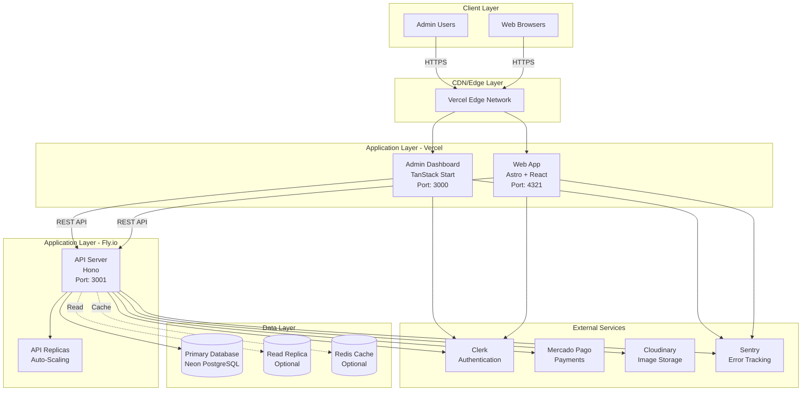
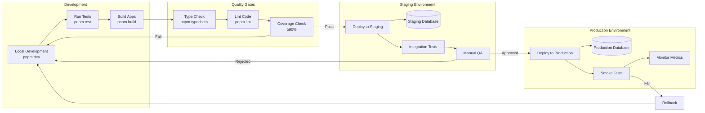

# Deployment Overview

## Table of Contents

- [Introduction](#introduction)
- [Deployment Strategy](#deployment-strategy)
- [System Architecture](#system-architecture)
- [Infrastructure Components](#infrastructure-components)
- [Deployment Flow](#deployment-flow)
- [Environment Strategy](#environment-strategy)
- Monitoring & Observability
- [Security Considerations](#security-considerations)
- Scalability & Performance
- [Disaster Recovery](#disaster-recovery)
- [Cost Optimization](#cost-optimization)

## Introduction

Hospeda is a modern tourism accommodation platform built as a monorepo application with multiple services deployed across cloud-native infrastructure. This document provides a comprehensive overview of the deployment strategy, architecture, and operational considerations.

### Platform Overview

**Hospeda** enables tourists to discover and book accommodations in Concepción del Uruguay and the Litoral region of Argentina. The platform consists of three main applications:

1. **Web App** - Public-facing website for browsing and booking accommodations
2. **Admin Dashboard** - Internal tool for managing listings, bookings, and operations
3. **API Server** - Backend services handling business logic and data

### Technology Stack

| Layer | Technology | Purpose |
|-------|-----------|---------|
| **Frontend (Web)** | Astro + React 19 | SSR/SSG public website |
| **Frontend (Admin)** | TanStack Start + React 19 | SSR admin dashboard |
| **Backend (API)** | Hono (Node.js) | REST API server |
| **Database** | PostgreSQL (Neon) | Primary data store |
| **ORM** | Drizzle | Type-safe database access |
| **Authentication** | Clerk | User authentication |
| **Payments** | Mercado Pago | Payment processing |
| **Storage** | Cloudinary | Image hosting and CDN |
| **Hosting** | Vercel + Fly.io | Application hosting |

## Deployment Strategy

### Monorepo Architecture

Hospeda uses a **TurboRepo monorepo** structure that enables:

- **Shared Dependencies**: Common packages used across applications
- **Coordinated Deployments**: Deploy all services or individual apps
- **Code Reusability**: Shared schemas, utilities, and business logic
- **Type Safety**: End-to-end type safety from database to frontend

```
hospeda/
├── apps/
│   ├── api/          # Hono backend → Fly.io
│   ├── web/          # Astro frontend → Vercel
│   └── admin/        # TanStack Start → Vercel
├── packages/
│   ├── db/           # Database schemas and models
│   ├── service-core/ # Business logic services
│   ├── schemas/      # Zod validation schemas
│   ├── utils/        # Shared utilities
│   └── ...
└── docs/             # Documentation
```

### Multi-Cloud Deployment

Hospeda leverages multiple cloud providers for optimal performance and cost:

**Vercel** (Web & Admin)

- Global edge network for fast content delivery
- Automatic SSL/TLS certificates
- Built-in preview deployments
- Seamless integration with Next.js/React
- Zero-config deployments

**Fly.io** (API)

- Low-latency application hosting
- Global distribution capabilities
- Built-in load balancing
- Easy horizontal scaling
- Cost-effective compute resources

**Neon** (Database)

- Serverless PostgreSQL
- Automatic scaling
- Branching for development
- Built-in connection pooling
- Automatic backups

### Deployment Philosophy

Our deployment strategy follows these core principles:

1. **Continuous Deployment** - Automated deployments on code merge
2. **Progressive Delivery** - Deploy to staging before production
3. **Zero-Downtime Deployments** - Blue-green deployment strategy
4. **Rollback Capability** - Instant rollback if issues detected
5. **Infrastructure as Code** - Configuration in version control
6. **Observability First** - Comprehensive monitoring and logging

## System Architecture

### High-Level Architecture



### Component Responsibilities

#### Web App (Astro + React)

**Deployment**: Vercel
**URL**: `https://hospeda.com`
**Port**: 4321 (development)

**Responsibilities:**

- Serve public-facing website
- Render accommodation listings
- Handle booking flow
- User registration and authentication
- SEO-optimized pages
- Static and server-rendered content

**Key Features:**

- Islands architecture for optimal performance
- SSR for dynamic content
- SSG for static pages
- Edge functions for API routes
- Automatic image optimization

#### Admin Dashboard (TanStack Start)

**Deployment**: Vercel
**URL**: `https://admin.hospeda.com`
**Port**: 3000 (development)

**Responsibilities:**

- Manage accommodations and listings
- View and process bookings
- User management and permissions
- Analytics and reporting
- Configuration management
- Content moderation

**Key Features:**

- Server-side rendering for security
- Role-based access control
- Real-time updates
- Data tables and filtering
- File uploads and management

#### API Server (Hono)

**Deployment**: Fly.io
**URL**: `https://api.hospeda.com`
**Port**: 3001

**Responsibilities:**

- Business logic and validation
- Database operations
- Authentication and authorization
- Payment processing
- File upload handling
- Email notifications
- Webhooks (Clerk, Mercado Pago)

**Key Features:**

- RESTful API design
- JWT token validation
- Rate limiting
- Request validation (Zod)
- Error handling and logging
- Health check endpoints

#### Database (Neon PostgreSQL)

**Deployment**: Neon Cloud
**Connection**: Connection string

**Responsibilities:**

- Primary data storage
- Transaction management
- Data integrity and constraints
- Full-text search
- Geospatial queries (accommodations)

**Key Features:**

- Automatic backups
- Point-in-time recovery
- Connection pooling
- Query performance monitoring
- Database branching

## Infrastructure Components

### Vercel Platform

**Purpose**: Host frontend applications (Web and Admin)

#### Vercel Platform Features Used

- **Serverless Functions**: API routes for lightweight operations
- **Edge Functions**: Low-latency API endpoints at the edge
- **Static Site Generation**: Pre-rendered pages for SEO
- **Server-Side Rendering**: Dynamic content rendering
- **Preview Deployments**: Automatic preview URLs for PRs
- **Analytics**: Performance and usage metrics
- **Environment Variables**: Secure configuration management

#### Vercel Platform Configuration

```json
{
  "buildCommand": "pnpm build",
  "outputDirectory": "dist",
  "installCommand": "pnpm install",
  "framework": "astro",
  "regions": ["iad1", "sfo1"]
}
```

#### Deployment Triggers

- **Production**: Push to `main` branch
- **Preview**: Pull requests to `main`
- **Manual**: Triggered via Vercel CLI or dashboard

### Fly.io Platform

**Purpose**: Host API server with global distribution

#### Fly.io Platform Features Used

- **Application Hosting**: Run Node.js API server
- **Auto-Scaling**: Scale instances based on load
- **Load Balancing**: Distribute traffic across instances
- **Health Checks**: Monitor application health
- **Secrets Management**: Secure environment variables
- **Regional Deployment**: Deploy to multiple regions
- **Built-in Metrics**: CPU, memory, request metrics

#### Configuration (`fly.toml`)

```toml
app = "hospeda-api"

[build]
  builder = "paketobuildpacks/builder:base"
  buildpacks = ["gcr.io/paketo-buildpacks/nodejs"]

[env]
  NODE_ENV = "production"
  PORT = "3001"

[[services]]
  http_checks = []
  internal_port = 3001
  protocol = "tcp"

  [[services.ports]]
    handlers = ["http"]
    port = 80

  [[services.ports]]
    handlers = ["tls", "http"]
    port = 443

  [[services.http_checks]]
    interval = "10s"
    timeout = "2s"
    grace_period = "5s"
    method = "GET"
    path = "/health"

[scaling]
  min_machines = 1
  max_machines = 10
```

#### Deployment Process

1. Build Docker container
2. Push to Fly.io registry
3. Deploy to specified regions
4. Run health checks
5. Route traffic to healthy instances

### Neon Database

**Purpose**: Serverless PostgreSQL database

#### Neon Database Features Used

- **Serverless Architecture**: Automatic scaling
- **Connection Pooling**: Built-in Pgbouncer
- **Branching**: Database branches for development
- **Automatic Backups**: Daily backups with 7-day retention
- **Point-in-Time Recovery**: Restore to any point in time
- **Query Insights**: Performance monitoring

#### Neon Database Configuration

```typescript
// Database connection
const connectionString = process.env.HOSPEDA_DATABASE_URL;

// Drizzle configuration
export const db = drizzle(postgres(connectionString), {
  schema,
  logger: process.env.NODE_ENV === 'development',
});
```

#### Database Branches

- **main**: Production database
- **staging**: Staging environment database
- **dev**: Development database (shared or personal)

### External Services

#### Clerk (Authentication)

**Purpose**: User authentication and management

**Features:**

- OAuth providers (Google, Facebook, etc.)
- Email/password authentication
- Session management
- User profile management
- Webhooks for user events

**Integration:**

```typescript
// API middleware
import { clerkMiddleware } from '@clerk/clerk-sdk-node';

app.use('*', clerkMiddleware());
```

#### Mercado Pago (Payments)

**Purpose**: Payment processing for bookings

**Features:**

- Credit/debit card payments
- Payment links
- Installment plans
- Refunds and chargebacks
- Webhooks for payment events

**Integration:**

```typescript
import { MercadoPagoConfig, Payment } from 'mercadopago';

const client = new MercadoPagoConfig({
  accessToken: process.env.MERCADO_PAGO_ACCESS_TOKEN,
});
```

#### Cloudinary (Image Storage)

**Purpose**: Image hosting and CDN

**Features:**

- Image uploads
- Automatic optimization
- Responsive images
- Transformations (resize, crop, etc.)
- Global CDN

**Integration:**

```typescript
import { v2 as cloudinary } from 'cloudinary';

cloudinary.config({
  cloud_name: process.env.CLOUDINARY_CLOUD_NAME,
  api_key: process.env.CLOUDINARY_API_KEY,
  api_secret: process.env.CLOUDINARY_API_SECRET,
});
```

## Deployment Flow

### Development to Production Pipeline



### Deployment Stages

#### 1. Local Development

**Activities:**

- Feature development
- Unit tests
- Local testing with development database
- Code review preparation

**Commands:**

```bash
pnpm dev                    # Start development servers
pnpm test                   # Run unit tests
pnpm typecheck              # Type checking
pnpm lint                   # Code linting
```

#### 2. Quality Gates

**Automated Checks (CI):**

- Type checking (TypeScript)
- Linting (ESLint + Prettier)
- Unit tests (Vitest)
- Code coverage (≥90% required)
- Security audit (pnpm audit)

**GitHub Actions Workflow:**

```yaml
name: CI

on:
  pull_request:
    branches: [main, develop]

jobs:
  quality:
    runs-on: ubuntu-latest
    steps:
      - uses: actions/checkout@v4
      - uses: pnpm/action-setup@v2
      - uses: actions/setup-node@v4
        with:
          node-version: '20'
          cache: 'pnpm'

      - run: pnpm install
      - run: pnpm typecheck
      - run: pnpm lint
      - run: pnpm test
      - run: pnpm test:coverage
```

#### 3. Staging Deployment

**Trigger**: Merge to `develop` branch

**Process:**

1. Build all applications
2. Deploy API to Fly.io staging
3. Deploy Web to Vercel preview
4. Deploy Admin to Vercel preview
5. Run database migrations (staging)
6. Execute integration tests
7. Manual QA testing

**Environment:**

- Staging database (separate from production)
- Staging Clerk application
- Staging Mercado Pago sandbox
- Test data and accounts

#### 4. Production Deployment

**Trigger**: Merge to `main` branch (after staging approval)

**Process:**

1. Tag release version
2. Build optimized production bundles
3. Deploy API to Fly.io production
4. Deploy Web to Vercel production
5. Deploy Admin to Vercel production
6. Run database migrations (production)
7. Execute smoke tests
8. Monitor error rates and metrics
9. Notify team of deployment

**Safety Measures:**

- Blue-green deployment (zero downtime)
- Automatic rollback on health check failure
- Incremental rollout (canary deployment)
- Database migration validation
- Post-deployment monitoring (15 minutes)

### Rollback Procedures

#### Vercel Rollback

```bash
# List recent deployments
vercel ls

# Rollback to previous deployment
vercel rollback

# Rollback to specific deployment
vercel rollback <deployment-url>
```

#### Fly.io Rollback

```bash
# List releases
fly releases list

# Rollback to previous release
fly releases rollback

# Rollback to specific release
fly releases rollback <version>
```

#### Database Rollback

```bash
# Rollback last migration
pnpm db:rollback

# Rollback to specific migration
pnpm db:rollback --to=<migration-name>
```

## Environment Strategy

### Environment Tiers

#### Development (dev)

**Purpose**: Local development and experimentation

**Characteristics:**

- Local development servers
- Hot module replacement
- Debug logging enabled
- Development database (local or shared)
- Mock external services (optional)
- No rate limiting

**Configuration:**

```env
NODE_ENV=development
HOSPEDA_API_URL=http://localhost:3001
HOSPEDA_SITE_URL=http://localhost:4321
HOSPEDA_DATABASE_URL=postgresql://localhost:5432/hospeda_dev
```

#### Staging (staging)

**Purpose**: Pre-production testing and QA

**Characteristics:**

- Production-like configuration
- Separate staging database
- Real external services (sandbox mode)
- Full monitoring enabled
- Rate limiting enabled (relaxed)
- Test data and accounts

**Configuration:**

```env
NODE_ENV=staging
HOSPEDA_API_URL=https://api-staging.hospeda.com
HOSPEDA_SITE_URL=https://staging.hospeda.com
HOSPEDA_DATABASE_URL=<staging-database-url>
```

#### Production (production)

**Purpose**: Live production environment

**Characteristics:**

- Optimized builds
- Production database
- Real external services (production mode)
- Full monitoring and alerting
- Strict rate limiting
- Real user data

**Configuration:**

```env
NODE_ENV=production
HOSPEDA_API_URL=https://api.hospeda.com
HOSPEDA_SITE_URL=https://hospeda.com
HOSPEDA_DATABASE_URL=<production-database-url>
```

### Environment Isolation

**Principle**: Complete isolation between environments to prevent cross-contamination

**Implementation:**

1. **Separate Databases**
   - Development: Local or shared dev database
   - Staging: Dedicated staging database
   - Production: Production database

1. **Separate Authentication**
   - Development: Development Clerk application
   - Staging: Staging Clerk application
   - Production: Production Clerk application

1. **Separate Payment Accounts**
   - Development: Sandbox credentials
   - Staging: Sandbox credentials
   - Production: Production credentials

1. **Separate API Keys**
   - Each environment has unique API keys
   - No sharing of keys between environments
   - Separate Cloudinary accounts or folders

## Monitoring & Observability

### Application Monitoring

#### Metrics Collection

**Key Metrics:**

- Request rate (requests per second)
- Response time (p50, p95, p99)
- Error rate (errors per minute)
- CPU usage (percentage)
- Memory usage (MB)
- Database connection pool
- Cache hit rate

**Monitoring Tools:**

- **Vercel Analytics**: Frontend performance
- **Fly.io Metrics**: API performance and scaling
- **Neon Console**: Database performance
- **Sentry**: Error tracking and alerting
- **Custom Metrics**: Business metrics (bookings, revenue)

#### Health Checks

**API Health Endpoint** (`GET /health`)

```typescript
app.get('/health', (c) => {
  return c.json({
    status: 'healthy',
    timestamp: new Date().toISOString(),
    version: process.env.APP_VERSION,
    uptime: process.uptime(),
    database: 'connected', // Check DB connection
    redis: 'connected', // Check Redis (if used)
  });
});
```

**Health Check Configuration:**

- Interval: 10 seconds
- Timeout: 2 seconds
- Grace period: 5 seconds
- Failure threshold: 3 consecutive failures

### Logging Strategy

#### Log Levels

- **ERROR**: Application errors, exceptions
- **WARN**: Warnings, deprecated features
- **INFO**: General information, requests
- **DEBUG**: Detailed debugging information

#### Log Structure

```json
{
  "level": "info",
  "timestamp": "2024-01-15T10:30:00.000Z",
  "message": "Request processed",
  "context": {
    "method": "POST",
    "path": "/api/bookings",
    "userId": "user_123",
    "duration": 45,
    "status": 201
  }
}
```

#### Log Aggregation

- **Development**: Console output
- **Staging/Production**: Centralized logging (LogTail, Fly.io logs)

### Error Tracking

**Sentry Integration:**

```typescript
import * as Sentry from '@sentry/node';

Sentry.init({
  dsn: process.env.SENTRY_DSN,
  environment: process.env.NODE_ENV,
  tracesSampleRate: 0.1,
});
```

**Error Categorization:**

- **Critical**: Database connection lost, payment failures
- **High**: API errors, authentication failures
- **Medium**: Validation errors, rate limit exceeded
- **Low**: Client errors, not found errors

### Alerting

**Alert Triggers:**

- Error rate > 5% for 5 minutes
- Response time p95 > 1000ms for 5 minutes
- CPU usage > 80% for 10 minutes
- Memory usage > 90%
- Database connection pool exhausted
- Health check failures

**Alert Channels:**

- Email notifications
- Slack integration
- SMS for critical alerts (production)

## Security Considerations

### Authentication & Authorization

**Strategy**: Clerk-based authentication with JWT tokens

**Implementation:**

- JWT tokens for API authentication
- Role-based access control (RBAC)
- Permission-based authorization
- Session management
- Secure token storage

**API Protection:**

```typescript
// Require authentication
app.use('/api/*', requireAuth());

// Require specific role
app.use('/api/admin/*', requireRole(['admin']));

// Require specific permission
app.use('/api/accommodations/:id/edit', requirePermission('accommodation:edit'));
```

### Data Security

**Encryption:**

- TLS/SSL for all connections (HTTPS)
- Encrypted database connections
- Encrypted secrets storage
- Encrypted backups

**Data Protection:**

- Input validation (Zod schemas)
- SQL injection prevention (Drizzle ORM)
- XSS protection (sanitization)
- CSRF protection
- Rate limiting

### API Security

**Rate Limiting:**

```typescript
import { rateLimiter } from '@repo/middleware';

// Global rate limit
app.use(rateLimiter({ maxRequests: 100, window: '1m' }));

// Endpoint-specific rate limit
app.post('/api/bookings', rateLimiter({ maxRequests: 10, window: '1m' }));
```

**CORS Configuration:**

```typescript
import { cors } from 'hono/cors';

app.use('*', cors({
  origin: [
    'https://hospeda.com',
    'https://admin.hospeda.com',
    process.env.NODE_ENV === 'development' ? 'http://localhost:4321' : '',
  ].filter(Boolean),
  credentials: true,
}));
```

**Security Headers:**

```typescript
app.use('*', securityHeaders({
  contentSecurityPolicy: true,
  xFrameOptions: 'DENY',
  xContentTypeOptions: 'nosniff',
  strictTransportSecurity: true,
  xssProtection: true,
}));
```

### Secret Management

**Best Practices:**

- Never commit secrets to version control
- Use platform-specific secret storage
- Rotate secrets regularly
- Use different secrets per environment
- Audit secret access

**Secret Storage:**

- **Vercel**: Environment variables in project settings
- **Fly.io**: Fly Secrets (`fly secrets set`)
- **Development**: `.env.local` file (gitignored)

## Scalability & Performance

### Horizontal Scaling

**API Server (Fly.io):**

- Auto-scaling based on CPU/memory
- Min instances: 1 (dev), 2 (prod)
- Max instances: 10
- Scale-to-zero: Disabled (production)

**Configuration:**

```toml
[scaling]
  min_machines = 2
  max_machines = 10

[services.concurrency]
  type = "requests"
  hard_limit = 1000
  soft_limit = 800
```

### Vertical Scaling

**Resource Allocation:**

- **Development**: 1 CPU, 512 MB RAM
- **Staging**: 1 CPU, 1 GB RAM
- **Production**: 2 CPU, 2 GB RAM

### Database Optimization

**Connection Pooling:**

```typescript
// Neon built-in pooling
const connectionString = process.env.HOSPEDA_DATABASE_URL;
// Includes ?pooled=true by default
```

**Query Optimization:**

- Index frequently queried fields
- Use `SELECT` specific columns (avoid `SELECT *`)
- Implement pagination
- Use database-level full-text search
- Cache expensive queries (Redis)

### Caching Strategy

**Cache Layers:**

1. **Browser Cache**: Static assets (images, CSS, JS)
2. **CDN Cache**: Vercel edge caching
3. **Application Cache**: Redis for API responses
4. **Database Cache**: Query result caching

**Cache Implementation (Redis):**

```typescript
import { Redis } from 'ioredis';

const redis = new Redis(process.env.HOSPEDA_REDIS_URL);

// Cache expensive query
async function getAccommodations(city: string) {
  const cacheKey = `accommodations:${city}`;
  const cached = await redis.get(cacheKey);

  if (cached) {
    return JSON.parse(cached);
  }

  const results = await db.query.accommodations.findMany({
    where: eq(accommodations.city, city),
  });

  await redis.setex(cacheKey, 300, JSON.stringify(results)); // 5 min TTL
  return results;
}
```

### Performance Targets

| Metric | Target | Measurement |
|--------|--------|-------------|
| API Response Time (p95) | < 500ms | Vercel Analytics |
| Page Load Time (p95) | < 2s | Web Vitals |
| Time to First Byte | < 200ms | Vercel Analytics |
| Database Query Time (p95) | < 100ms | Neon Console |
| Error Rate | < 0.1% | Sentry |
| Uptime | 99.9% | Status page |

## Disaster Recovery

### Backup Strategy

**Database Backups:**

- **Frequency**: Daily automatic backups
- **Retention**: 7 days (staging), 30 days (production)
- **Type**: Full database snapshot
- **Storage**: Neon managed backups

**Manual Backups:**

```bash
# Export database
pg_dump $HOSPEDA_DATABASE_URL > backup-$(date +%Y%m%d).sql

# Import database
psql $HOSPEDA_DATABASE_URL < backup-20240115.sql
```

### Recovery Procedures

**Database Recovery:**

1. Identify recovery point
2. Stop application writes
3. Restore from backup or use point-in-time recovery
4. Verify data integrity
5. Resume application

**Application Recovery:**

1. Identify issue (rollback deployment if recent deploy)
2. Roll back to last known good version
3. Verify health checks
4. Monitor error rates
5. Investigate root cause

### Business Continuity

**RTO (Recovery Time Objective)**: 1 hour
**RPO (Recovery Point Objective)**: 24 hours

**Disaster Scenarios:**

1. **Database Failure**: Restore from latest backup
2. **API Server Failure**: Automatic failover to healthy instances
3. **Frontend Failure**: Rollback deployment
4. **External Service Failure**: Graceful degradation
5. **Complete Infrastructure Failure**: Migrate to backup provider

## Cost Optimization

### Resource Allocation

**Current Costs (Monthly Estimates):**

- Vercel Pro: $20/month (per project)
- Fly.io: $10-50/month (based on usage)
- Neon: $19/month (Pro plan)
- Clerk: $25/month (Pro plan)
- Cloudinary: Free tier or $89/month
- **Total**: ~$100-200/month

### Optimization Strategies

**Infrastructure:**

- Use scale-to-zero for non-production environments
- Optimize database queries to reduce compute
- Implement caching to reduce API calls
- Use Vercel ISR instead of SSR where possible
- Compress and optimize images

**External Services:**

- Use Clerk webhooks efficiently
- Batch Cloudinary uploads
- Cache Mercado Pago responses
- Implement request deduplication

### Monitoring Costs

- Set up billing alerts
- Monitor resource usage
- Review costs monthly
- Optimize based on usage patterns

---

**Document Version**: 1.0.0
**Last Updated**: 2024-01-15
**Maintained By**: DevOps Team
**Next Review**: 2024-04-15
