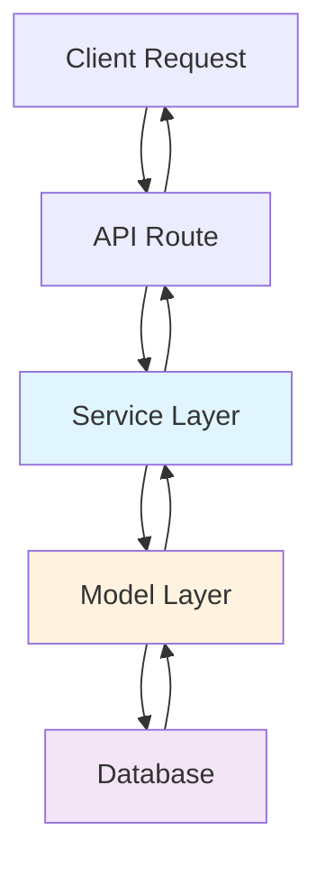

# Adding a New Entity - Complete Tutorial

Complete step-by-step guide for adding a new entity to the Hospeda platform, from database schema to API endpoints.

## Table of Contents

- [Overview](#overview)
- [Prerequisites](#prerequisites)
- [Architecture Overview](#architecture-overview)
- [Step 1: Define Zod Schemas](#step-1-define-zod-schemas)
- [Step 2: Create Drizzle Database Schema](#step-2-create-drizzle-database-schema)
- [Step 3: Create the Model](#step-3-create-the-model)
- [Step 4: Create the Service](#step-4-create-the-service)
- [Step 5: Create API Routes](#step-5-create-api-routes)
- [Step 6: Testing](#step-6-testing)
- [Common Issues & Solutions](#common-issues--solutions)
- [Next Steps](#next-steps)

## Overview

This tutorial teaches you how to add a new entity (e.g., "Review", "Booking", "Event") to the Hospeda platform following our established patterns and conventions.

**What You'll Build:**

- Zod validation schemas (types + validation)
- Drizzle database schema (PostgreSQL table)
- Model layer (database access via BaseModel)
- Service layer (business logic via BaseCrudService)
- API routes (REST endpoints via factories)
- Tests (unit + integration)

**Time Estimate:** 3-4 hours for a complete entity

**Example Entity:** We'll use a "Review" entity as an example throughout this guide.

## Prerequisites

Before starting, ensure you have:

1. **Project Setup Complete**
   - Development environment configured
   - Database running locally
   - Project dependencies installed

2. **Understanding of Core Concepts**
   - [Architecture Overview](../architecture/overview.md)
   - [Data Flow](../architecture/data-flow.md)
   - [Architectural Patterns](../architecture/patterns.md)

3. **Familiarity With**
   - TypeScript
   - Zod (validation)
   - Drizzle ORM
   - Hono (API framework)
   - Vitest (testing)

## Architecture Overview

Our entity architecture follows this layered pattern:



**Layers:**

1. **Schemas** (`@repo/schemas`) - Zod validation schemas, types
2. **Database Schema** (`@repo/db/schemas`) - Drizzle table definitions
3. **Model** (`@repo/db/models`) - Database access (extends `BaseModel`)
4. **Service** (`@repo/service-core`) - Business logic (extends `BaseCrudService`)
5. **API** (`apps/api/routes`) - HTTP endpoints (uses route factories)

**File Location Pattern:**

```text
packages/
├── schemas/src/entities/review/          # Zod schemas
├── db/src/schemas/review/                # Drizzle schemas
├── db/src/models/review/                 # Models
└── service-core/src/services/review/     # Services

apps/
└── api/src/routes/review/                # API routes
```

## Step 1: Define Zod Schemas

Zod schemas serve as the **single source of truth** for types and validation. All TypeScript types are inferred from Zod schemas using `z.infer<typeof schema>`.

### 1.1 Create Entity Schema

Create the main entity schema:

**File:** `packages/schemas/src/entities/review/review.schema.ts`

```typescript
import { z } from 'zod';
import { BaseAuditFields } from '../../common/audit.schema.js';
import { 
  ReviewIdSchema, 
  AccommodationIdSchema, 
  UserIdSchema 
} from '../../common/id.schema.js';
import { BaseLifecycleFields } from '../../common/lifecycle.schema.js';

/**
 * Review Schema - Main Entity Schema
 * 
 * Complete structure of a Review entity using base field objects
 * for consistency and maintainability.
 */
export const ReviewSchema = z.object({
  // Base fields
  id: ReviewIdSchema,
  ...BaseAuditFields,
  
  // Entity-specific fields
  title: z
    .string()
    .min(3, { message: 'zodError.review.title.min' })
    .max(100, { message: 'zodError.review.title.max' }),
  
  content: z
    .string()
    .min(10, { message: 'zodError.review.content.min' })
    .max(2000, { message: 'zodError.review.content.max' }),
  
  rating: z
    .number()
    .int({ message: 'zodError.review.rating.integer' })
    .min(1, { message: 'zodError.review.rating.min' })
    .max(5, { message: 'zodError.review.rating.max' }),
  
  // Relationships
  accommodationId: AccommodationIdSchema,
  authorId: UserIdSchema,
  
  // Lifecycle
  ...BaseLifecycleFields,
  
  // Optional fields
  verifiedStay: z.boolean().default(false),
  helpfulCount: z.number().int().default(0),
});

export type Review = z.infer<typeof ReviewSchema>;
```

### 1.2 Create CRUD Schemas

Create schemas for create, update, and search operations:

**File:** `packages/schemas/src/entities/review/review.crud.schema.ts`

```typescript
import { z } from 'zod';
import { ReviewSchema } from './review.schema.js';
import { PaginationQuerySchema } from '../../common/pagination.schema.js';

/**
 * Create Review Schema
 * Excludes auto-generated fields (id, timestamps)
 */
export const CreateReviewSchema = ReviewSchema.omit({
  id: true,
  createdAt: true,
  updatedAt: true,
  deletedAt: true,
  createdById: true,
  updatedById: true,
  deletedById: true,
  helpfulCount: true,
}).extend({
  // Override defaults for creation
  verifiedStay: z.boolean().optional(),
});

export type CreateReview = z.infer<typeof CreateReviewSchema>;

/**
 * Update Review Schema
 * All fields optional except id
 */
export const UpdateReviewSchema = ReviewSchema.omit({
  id: true,
  accommodationId: true,  // Cannot change accommodation
  authorId: true,         // Cannot change author
  createdAt: true,
  createdById: true,
}).partial();

export type UpdateReview = z.infer<typeof UpdateReviewSchema>;

/**
 * Search Review Schema
 * Supports filtering by multiple criteria
 */
export const SearchReviewSchema = z
  .object({
    q: z.string().optional(),  // Text search
    accommodationId: z.string().uuid().optional(),
    authorId: z.string().uuid().optional(),
    minRating: z.number().min(1).max(5).optional(),
    maxRating: z.number().min(1).max(5).optional(),
    verifiedStay: z.boolean().optional(),
    lifecycleState: z.enum(['DRAFT', 'ACTIVE', 'ARCHIVED']).optional(),
  })
  .merge(PaginationQuerySchema);

export type SearchReview = z.infer<typeof SearchReviewSchema>;
```

### 1.3 Export From Index

**File:** `packages/schemas/src/entities/review/index.ts`

```typescript
export * from './review.schema.js';
export * from './review.crud.schema.js';
```

### 1.4 Update Main Index

**File:** `packages/schemas/src/entities/index.ts`

```typescript
// ... existing exports

// Review
export * from './review/index.js';
```

**Key Points:**

- ✅ Use base field objects (`BaseAuditFields`, `BaseLifecycleFields`) for consistency
- ✅ Infer types from schemas using `z.infer<typeof schema>`
- ✅ Use `.omit()` and `.partial()` for create/update schemas
- ✅ Add validation messages with i18n keys
- ✅ Export all schemas from index files

**Related Documentation:**

- [Schema Package CLAUDE.md](../../packages/schemas/CLAUDE.md)
- [Schema-First Pattern](../architecture/patterns.md#schema-first-design)

## Step 2: Create Drizzle Database Schema

The Drizzle schema defines the actual PostgreSQL table structure.

### 2.1 Create Table Schema

**File:** `packages/db/src/schemas/review/review.dbschema.ts`

```typescript
import { relations } from 'drizzle-orm';
import {
  boolean,
  index,
  integer,
  pgTable,
  text,
  timestamp,
  uuid,
} from 'drizzle-orm/pg-core';
import { accommodations } from '../accommodation/accommodation.dbschema.ts';
import { users } from '../user/user.dbschema.ts';
import { LifecycleStatusPgEnum } from '../enums.dbschema.ts';

export const reviews = pgTable(
  'reviews',
  {
    id: uuid('id').primaryKey().defaultRandom(),
    title: text('title').notNull(),
    content: text('content').notNull(),
    rating: integer('rating').notNull(),
    
    // Relationships
    accommodationId: uuid('accommodation_id')
      .notNull()
      .references(() => accommodations.id, { onDelete: 'cascade' }),
    authorId: uuid('author_id')
      .notNull()
      .references(() => users.id, { onDelete: 'restrict' }),
    
    // Lifecycle
    lifecycleState: LifecycleStatusPgEnum('lifecycle_state')
      .notNull()
      .default('ACTIVE'),
    
    // Optional fields
    verifiedStay: boolean('verified_stay').notNull().default(false),
    helpfulCount: integer('helpful_count').notNull().default(0),
    
    // Audit fields
    createdAt: timestamp('created_at', { withTimezone: true })
      .defaultNow()
      .notNull(),
    updatedAt: timestamp('updated_at', { withTimezone: true })
      .defaultNow()
      .notNull(),
    deletedAt: timestamp('deleted_at', { withTimezone: true }),
    createdById: uuid('created_by_id').references(() => users.id, {
      onDelete: 'set null',
    }),
    updatedById: uuid('updated_by_id').references(() => users.id, {
      onDelete: 'set null',
    }),
    deletedById: uuid('deleted_by_id').references(() => users.id, {
      onDelete: 'set null',
    }),
  },
  (table) => ({
    // Indexes for performance
    reviews_accommodationId_idx: index('reviews_accommodationId_idx').on(
      table.accommodationId
    ),
    reviews_authorId_idx: index('reviews_authorId_idx').on(table.authorId),
    reviews_rating_idx: index('reviews_rating_idx').on(table.rating),
    reviews_lifecycleState_idx: index('reviews_lifecycleState_idx').on(
      table.lifecycleState
    ),
    reviews_createdAt_idx: index('reviews_createdAt_idx').on(table.createdAt),
  })
);

export const reviewsRelations = relations(reviews, ({ one }) => ({
  accommodation: one(accommodations, {
    fields: [reviews.accommodationId],
    references: [accommodations.id],
  }),
  author: one(users, {
    fields: [reviews.authorId],
    references: [users.id],
  }),
  createdBy: one(users, {
    fields: [reviews.createdById],
    references: [users.id],
  }),
  updatedBy: one(users, {
    fields: [reviews.updatedById],
    references: [users.id],
  }),
  deletedBy: one(users, {
    fields: [reviews.deletedById],
    references: [users.id],
  }),
}));
```

### 2.2 Export From Index

**File:** `packages/db/src/schemas/review/index.ts`

```typescript
export * from './review.dbschema.ts';
```

### 2.3 Update Main Schema Index

**File:** `packages/db/src/schemas/index.ts`

```typescript
// ... existing exports

// Review
export * from './review/index.ts';
```

### 2.4 Generate and Apply Migration

```bash
# Generate migration
pnpm db:generate

# Review the generated SQL in drizzle/migrations/
# Verify tables, columns, constraints, and indexes

# Apply migration
pnpm db:migrate
```

**Key Points:**

- ✅ Use `uuid('id').primaryKey().defaultRandom()` for primary keys
- ✅ Add foreign key constraints with `references()` and `onDelete` behavior
- ✅ Create indexes on frequently queried columns
- ✅ Use `timestamp('field', { withTimezone: true })` for dates
- ✅ Define relations for type-safe joins
- ✅ Use enums from `enums.dbschema.ts` for consistency

**Related Documentation:**

- [Database Package CLAUDE.md](../../packages/db/CLAUDE.md)
- [Drizzle ORM Documentation](https://orm.drizzle.team/)

## Step 3: Create the Model

The Model layer encapsulates all database access for an entity.

### 3.1 Create Model Class

**File:** `packages/db/src/models/review/review.model.ts`

```typescript
import type { Review } from '@repo/schemas';
import { BaseModel } from '../base/base.model.ts';
import { reviews } from '../../schemas/review/review.dbschema.ts';
import { eq, and, gte, lte, desc, sql } from 'drizzle-orm';
import { getDb } from '../../client.ts';

/**
 * ReviewModel - Database access layer for reviews
 * 
 * Extends BaseModel to provide CRUD operations plus
 * custom methods for review-specific queries.
 */
export class ReviewModel extends BaseModel<Review> {
  protected table = reviews;
  protected entityName = 'review';

  /**
   * Find reviews by accommodation with pagination
   */
  async findByAccommodation(params: {
    accommodationId: string;
    page?: number;
    pageSize?: number;
  }) {
    const page = params.page ?? 1;
    const pageSize = params.pageSize ?? 10;
    const offset = (page - 1) * pageSize;

    const db = getDb();

    const items = await db
      .select()
      .from(this.table)
      .where(
        and(
          eq(this.table.accommodationId, params.accommodationId),
          eq(this.table.deletedAt, null)
        )
      )
      .orderBy(desc(this.table.createdAt))
      .limit(pageSize)
      .offset(offset);

    const totalResult = await db
      .select({ count: sql<number>`count(*)` })
      .from(this.table)
      .where(
        and(
          eq(this.table.accommodationId, params.accommodationId),
          eq(this.table.deletedAt, null)
        )
      );

    const total = Number(totalResult[0]?.count ?? 0);

    return {
      items,
      total,
      page,
      pageSize,
      totalPages: Math.ceil(total / pageSize),
    };
  }

  /**
   * Calculate average rating for an accommodation
   */
  async getAverageRating(accommodationId: string): Promise<number> {
    const db = getDb();

    const result = await db
      .select({ avg: sql<number>`avg(${this.table.rating})` })
      .from(this.table)
      .where(
        and(
          eq(this.table.accommodationId, accommodationId),
          eq(this.table.deletedAt, null)
        )
      );

    return Number(result[0]?.avg ?? 0);
  }

  /**
   * Count reviews by rating for an accommodation
   */
  async countByRating(accommodationId: string): Promise<Record<number, number>> {
    const db = getDb();

    const results = await db
      .select({
        rating: this.table.rating,
        count: sql<number>`count(*)`,
      })
      .from(this.table)
      .where(
        and(
          eq(this.table.accommodationId, accommodationId),
          eq(this.table.deletedAt, null)
        )
      )
      .groupBy(this.table.rating);

    return results.reduce(
      (acc, { rating, count }) => {
        acc[rating] = Number(count);
        return acc;
      },
      {} as Record<number, number>
    );
  }

  /**
   * Search reviews with filters
   */
  async search(params: {
    q?: string;
    accommodationId?: string;
    authorId?: string;
    minRating?: number;
    maxRating?: number;
    verifiedStay?: boolean;
    page?: number;
    pageSize?: number;
  }) {
    const page = params.page ?? 1;
    const pageSize = params.pageSize ?? 10;
    const offset = (page - 1) * pageSize;

    const db = getDb();

    // Build WHERE conditions
    const conditions = [eq(this.table.deletedAt, null)];

    if (params.accommodationId) {
      conditions.push(eq(this.table.accommodationId, params.accommodationId));
    }

    if (params.authorId) {
      conditions.push(eq(this.table.authorId, params.authorId));
    }

    if (params.minRating !== undefined) {
      conditions.push(gte(this.table.rating, params.minRating));
    }

    if (params.maxRating !== undefined) {
      conditions.push(lte(this.table.rating, params.maxRating));
    }

    if (params.verifiedStay !== undefined) {
      conditions.push(eq(this.table.verifiedStay, params.verifiedStay));
    }

    // Text search
    if (params.q) {
      conditions.push(
        sql`(${this.table.title} ILIKE ${`%${params.q}%`} OR ${this.table.content} ILIKE ${`%${params.q}%`})`
      );
    }

    const whereClause = and(...conditions);

    const items = await db
      .select()
      .from(this.table)
      .where(whereClause)
      .orderBy(desc(this.table.createdAt))
      .limit(pageSize)
      .offset(offset);

    const totalResult = await db
      .select({ count: sql<number>`count(*)` })
      .from(this.table)
      .where(whereClause);

    const total = Number(totalResult[0]?.count ?? 0);

    return {
      items,
      total,
      page,
      pageSize,
      totalPages: Math.ceil(total / pageSize),
    };
  }
}
```

### 3.2 Export From Index

**File:** `packages/db/src/models/review/index.ts`

```typescript
export * from './review.model.ts';
```

### 3.3 Update Main Models Index

**File:** `packages/db/src/models/index.ts`

```typescript
// ... existing exports

// Review
export * from './review/index.ts';
```

**Key Points:**

- ✅ Extend `BaseModel<T>` for automatic CRUD methods
- ✅ Override `table` and `entityName` properties
- ✅ Add custom methods for entity-specific queries
- ✅ Use Drizzle query builder for type-safety
- ✅ Always filter by `deletedAt IS NULL` for soft-deleted items
- ✅ Return paginated results with `{ items, total, page, pageSize }`

**Related Documentation:**

- [BaseModel Pattern](../architecture/patterns.md#basemodel-pattern)
- [Database Models CLAUDE.md](../../packages/db/CLAUDE.md)

## Step 4: Create the Service

The Service layer contains all business logic and orchestrates between models.

### 4.1 Create Service Class

**File:** `packages/service-core/src/services/review/review.service.ts`

```typescript
import { ReviewModel } from '@repo/db';
import {
  type Review,
  type CreateReview,
  CreateReviewSchema,
  type UpdateReview,
  UpdateReviewSchema,
  type SearchReview,
  SearchReviewSchema,
  ServiceErrorCode,
} from '@repo/schemas';
import { BaseCrudService } from '../../base/base.crud.service.ts';
import type { Actor, ServiceContext, ServiceOutput } from '../../types/index.ts';
import { ServiceError } from '../../types/index.ts';
import { AccommodationService } from '../accommodation/accommodation.service.ts';

/**
 * ReviewService - Business logic for reviews
 * 
 * Extends BaseCrudService to leverage standardized service pipeline
 * (validation, permissions, hooks, etc.)
 */
export class ReviewService extends BaseCrudService<
  Review,
  ReviewModel,
  typeof CreateReviewSchema,
  typeof UpdateReviewSchema,
  typeof SearchReviewSchema
> {
  static readonly ENTITY_NAME = 'review';
  protected readonly entityName = ReviewService.ENTITY_NAME;
  protected readonly model: ReviewModel;

  protected readonly createSchema = CreateReviewSchema;
  protected readonly updateSchema = UpdateReviewSchema;
  protected readonly searchSchema = SearchReviewSchema;

  private accommodationService: AccommodationService;

  constructor(ctx: ServiceContext, model?: ReviewModel) {
    super(ctx, ReviewService.ENTITY_NAME);
    this.model = model ?? new ReviewModel();
    this.accommodationService = new AccommodationService(ctx);
  }

  // --- Permission Hooks ---

  protected _canCreate(actor: Actor, data: CreateReview): void {
    // Only authenticated users can create reviews
    if (!actor.userId) {
      throw new ServiceError(
        ServiceErrorCode.UNAUTHORIZED,
        'You must be logged in to create a review'
      );
    }
  }

  protected _canUpdate(actor: Actor, entity: Review): void {
    // Only author or admin can update
    if (actor.userId !== entity.authorId && actor.role !== 'admin') {
      throw new ServiceError(
        ServiceErrorCode.FORBIDDEN,
        'You can only update your own reviews'
      );
    }
  }

  protected _canSoftDelete(actor: Actor, entity: Review): void {
    // Only author or admin can delete
    if (actor.userId !== entity.authorId && actor.role !== 'admin') {
      throw new ServiceError(
        ServiceErrorCode.FORBIDDEN,
        'You can only delete your own reviews'
      );
    }
  }

  protected _canHardDelete(actor: Actor, _entity: Review): void {
    // Only admins can hard delete
    if (actor.role !== 'admin') {
      throw new ServiceError(
        ServiceErrorCode.FORBIDDEN,
        'Only admins can permanently delete reviews'
      );
    }
  }

  protected _canRestore(actor: Actor, _entity: Review): void {
    // Only admins can restore
    if (actor.role !== 'admin') {
      throw new ServiceError(
        ServiceErrorCode.FORBIDDEN,
        'Only admins can restore reviews'
      );
    }
  }

  protected _canView(actor: Actor, entity: Review): void {
    // Everyone can view active reviews
    if (entity.lifecycleState !== 'ACTIVE') {
      // Only author or admin can view non-active reviews
      if (actor.userId !== entity.authorId && actor.role !== 'admin') {
        throw new ServiceError(
          ServiceErrorCode.FORBIDDEN,
          'You cannot view this review'
        );
      }
    }
  }

  protected _canList(actor: Actor): void {
    // Everyone can list reviews (filtering happens at query level)
    // No-op for reviews
  }

  protected _canSearch(actor: Actor): void {
    // Everyone can search reviews
    // No-op for reviews
  }

  protected _canCount(actor: Actor): void {
    // Everyone can count reviews
    // No-op for reviews
  }

  // --- Lifecycle Hooks ---

  protected async _beforeCreate(
    data: CreateReview,
    actor: Actor
  ): Promise<Partial<Review>> {
    // Verify accommodation exists
    const accommodationResult = await this.accommodationService.getById(
      actor,
      { id: data.accommodationId }
    );

    if (accommodationResult.error || !accommodationResult.data) {
      throw new ServiceError(
        ServiceErrorCode.VALIDATION_ERROR,
        'Accommodation not found'
      );
    }

    // Set author from actor
    return {
      authorId: actor.userId as string,
    };
  }

  protected async _afterCreate(entity: Review): Promise<Review> {
    // Update accommodation rating statistics
    await this.updateAccommodationStats(entity.accommodationId);
    return entity;
  }

  protected async _afterUpdate(entity: Review): Promise<Review> {
    // Update accommodation rating statistics
    await this.updateAccommodationStats(entity.accommodationId);
    return entity;
  }

  protected async _afterSoftDelete(result: { count: number }, _actor: Actor) {
    // Note: We don't have access to the entity here
    // In a real implementation, you'd store the accommodationId before deletion
    // For now, we'll skip updating stats
    return result;
  }

  // --- Business Logic Methods ---

  /**
   * Get reviews for an accommodation
   */
  async getByAccommodation(
    actor: Actor,
    params: {
      accommodationId: string;
      page?: number;
      pageSize?: number;
    }
  ): Promise<ServiceOutput<{ items: Review[]; total: number; page: number; pageSize: number }>> {
    return this.runWithLoggingAndValidation({
      methodName: 'getByAccommodation',
      input: { actor, ...params },
      execute: async (validated) => {
        this._canList(actor);

        const result = await this.model.findByAccommodation({
          accommodationId: validated.accommodationId,
          page: validated.page,
          pageSize: validated.pageSize,
        });

        return result;
      },
    });
  }

  /**
   * Get rating statistics for an accommodation
   */
  async getRatingStats(
    actor: Actor,
    params: { accommodationId: string }
  ): Promise<ServiceOutput<{
    averageRating: number;
    totalReviews: number;
    ratingDistribution: Record<number, number>;
  }>> {
    return this.runWithLoggingAndValidation({
      methodName: 'getRatingStats',
      input: { actor, ...params },
      execute: async (validated) => {
        this._canList(actor);

        const [avgRating, distribution] = await Promise.all([
          this.model.getAverageRating(validated.accommodationId),
          this.model.countByRating(validated.accommodationId),
        ]);

        const totalReviews = Object.values(distribution).reduce(
          (sum, count) => sum + count,
          0
        );

        return {
          averageRating: avgRating,
          totalReviews,
          ratingDistribution: distribution,
        };
      },
    });
  }

  /**
   * Update accommodation stats after review changes
   */
  private async updateAccommodationStats(accommodationId: string): Promise<void> {
    const avgRating = await this.model.getAverageRating(accommodationId);
    const distribution = await this.model.countByRating(accommodationId);
    const totalReviews = Object.values(distribution).reduce(
      (sum, count) => sum + count,
      0
    );

    // Update accommodation via service
    // This would call accommodation service's updateStatsFromReview method
    await this.accommodationService.updateStatsFromReview(accommodationId, {
      reviewsCount: totalReviews,
      averageRating: avgRating,
    });
  }
}
```

### 4.2 Export From Index

**File:** `packages/service-core/src/services/review/index.ts`

```typescript
export * from './review.service.ts';
```

### 4.3 Update Main Services Index

**File:** `packages/service-core/src/services/index.ts`

```typescript
// ... existing exports

// Review
export * from './review/index.ts';
```

**Key Points:**

- ✅ Extend `BaseCrudService` for automatic CRUD operations
- ✅ Override permission hooks (`_canCreate`, `_canUpdate`, etc.)
- ✅ Override lifecycle hooks (`_beforeCreate`, `_afterCreate`, etc.)
- ✅ Add business logic methods (e.g., `getByAccommodation`, `getRatingStats`)
- ✅ Use `runWithLoggingAndValidation` for all public methods
- ✅ Inject other services as needed (composition pattern)
- ✅ Return `ServiceOutput<T>` for consistent error handling

**Related Documentation:**

- [BaseCrudService Pattern](../architecture/patterns.md#basecrudservice-pattern)
- [Service Core CLAUDE.md](../../packages/service-core/CLAUDE.md)

## Step 5: Create API Routes

API routes expose service methods via HTTP endpoints using route factories.

### 5.1 Create Route Factories

**File:** `apps/api/src/routes/review/review.routes.ts`

```typescript
import { createCRUDRoute } from '@repo/api-factories';
import { ReviewService } from '@repo/service-core';
import {
  CreateReviewSchema,
  UpdateReviewSchema,
  SearchReviewSchema,
} from '@repo/schemas';
import { Hono } from 'hono';

// Create base CRUD routes using factory
export const reviewRoutes = createCRUDRoute({
  service: ReviewService,
  entityName: 'review',
  schemas: {
    create: CreateReviewSchema,
    update: UpdateReviewSchema,
    search: SearchReviewSchema,
  },
  options: {
    enableCreate: true,
    enableUpdate: true,
    enableSoftDelete: true,
    enableHardDelete: false,  // Only admins via separate route
    enableRestore: true,
    enableList: true,
    enableSearch: true,
    enableCount: true,
  },
});

// Add custom routes
const customRoutes = new Hono();

// GET /reviews/accommodation/:id - Get reviews for accommodation
customRoutes.get('/accommodation/:id', async (c) => {
  const accommodationId = c.req.param('id');
  const page = Number(c.req.query('page')) || 1;
  const pageSize = Number(c.req.query('pageSize')) || 10;

  const service = new ReviewService(c);
  const result = await service.getByAccommodation(c.get('actor'), {
    accommodationId,
    page,
    pageSize,
  });

  if (result.error) {
    return c.json({ error: result.error }, 400);
  }

  return c.json({ data: result.data });
});

// GET /reviews/accommodation/:id/stats - Get rating statistics
customRoutes.get('/accommodation/:id/stats', async (c) => {
  const accommodationId = c.req.param('id');

  const service = new ReviewService(c);
  const result = await service.getRatingStats(c.get('actor'), {
    accommodationId,
  });

  if (result.error) {
    return c.json({ error: result.error }, 400);
  }

  return c.json({ data: result.data });
});

// Merge custom routes with CRUD routes
reviewRoutes.route('/', customRoutes);
```

### 5.2 Register Routes

**File:** `apps/api/src/routes/index.ts`

```typescript
import { Hono } from 'hono';
// ... existing imports
import { reviewRoutes } from './review/review.routes.ts';

const app = new Hono();

// Register routes
// ... existing routes
app.route('/reviews', reviewRoutes);

export default app;
```

### 5.3 Test Endpoints

```bash
# Create a review
curl -X POST http://localhost:3000/api/reviews \
  -H "Content-Type: application/json" \
  -H "Authorization: Bearer <token>" \
  -d '{
    "title": "Great place to stay!",
    "content": "We had an amazing time. The location was perfect and the host was very helpful.",
    "rating": 5,
    "accommodationId": "uuid-here"
  }'

# Get reviews for accommodation
curl http://localhost:3000/api/reviews/accommodation/uuid-here?page=1&pageSize=10

# Get rating stats
curl http://localhost:3000/api/reviews/accommodation/uuid-here/stats

# Update a review
curl -X PATCH http://localhost:3000/api/reviews/uuid-here \
  -H "Content-Type: application/json" \
  -H "Authorization: Bearer <token>" \
  -d '{
    "title": "Updated title",
    "rating": 4
  }'

# Delete a review (soft delete)
curl -X DELETE http://localhost:3000/api/reviews/uuid-here \
  -H "Authorization: Bearer <token>"
```

**Key Points:**

- ✅ Use `createCRUDRoute` factory for standard CRUD endpoints
- ✅ Add custom routes in a separate Hono instance
- ✅ Merge custom routes with factory routes
- ✅ Extract actor from context (`c.get('actor')`)
- ✅ Handle errors consistently (check `result.error`)
- ✅ Return JSON responses with `{ data }` or `{ error }` structure

**Related Documentation:**

- [Route Factories Pattern](../architecture/patterns.md#route-factories-pattern)
- [API Documentation](../../apps/api/docs/README.md)

## Step 6: Testing

Write comprehensive tests for all layers following TDD principles.

### 6.1 Model Tests

**File:** `packages/db/test/models/review.model.test.ts`

```typescript
import { describe, it, expect, beforeEach, afterEach } from 'vitest';
import { ReviewModel } from '../../src/models/review/review.model.ts';
import type { CreateReview } from '@repo/schemas';
import { initializeDb, closeDb } from '../test-helpers.ts';

describe('ReviewModel', () => {
  let model: ReviewModel;

  beforeEach(async () => {
    await initializeDb();
    model = new ReviewModel();
  });

  afterEach(async () => {
    await closeDb();
  });

  describe('create', () => {
    it('should create a review with valid data', async () => {
      const data: CreateReview = {
        title: 'Great place!',
        content: 'We had an amazing time at this accommodation.',
        rating: 5,
        accommodationId: 'test-accommodation-id',
        authorId: 'test-user-id',
        lifecycleState: 'ACTIVE',
      };

      const review = await model.create(data);

      expect(review.id).toBeDefined();
      expect(review.title).toBe(data.title);
      expect(review.rating).toBe(data.rating);
      expect(review.createdAt).toBeInstanceOf(Date);
    });

    it('should throw error with invalid rating', async () => {
      const data = {
        title: 'Test',
        content: 'Test content',
        rating: 6,  // Invalid: > 5
        accommodationId: 'test-id',
        authorId: 'test-user-id',
      };

      await expect(model.create(data)).rejects.toThrow();
    });
  });

  describe('findByAccommodation', () => {
    it('should return reviews for specific accommodation', async () => {
      const accommodationId = 'test-accommodation-id';

      // Create test reviews
      await model.create({
        title: 'Review 1',
        content: 'Content 1',
        rating: 5,
        accommodationId,
        authorId: 'user-1',
      });

      await model.create({
        title: 'Review 2',
        content: 'Content 2',
        rating: 4,
        accommodationId,
        authorId: 'user-2',
      });

      const result = await model.findByAccommodation({
        accommodationId,
        page: 1,
        pageSize: 10,
      });

      expect(result.items).toHaveLength(2);
      expect(result.total).toBe(2);
      expect(result.items[0].accommodationId).toBe(accommodationId);
    });

    it('should paginate results correctly', async () => {
      const accommodationId = 'test-accommodation-id';

      // Create 15 reviews
      for (let i = 0; i < 15; i++) {
        await model.create({
          title: `Review ${i}`,
          content: `Content ${i}`,
          rating: 5,
          accommodationId,
          authorId: `user-${i}`,
        });
      }

      const page1 = await model.findByAccommodation({
        accommodationId,
        page: 1,
        pageSize: 10,
      });

      const page2 = await model.findByAccommodation({
        accommodationId,
        page: 2,
        pageSize: 10,
      });

      expect(page1.items).toHaveLength(10);
      expect(page2.items).toHaveLength(5);
      expect(page1.total).toBe(15);
      expect(page2.total).toBe(15);
    });
  });

  describe('getAverageRating', () => {
    it('should calculate average rating correctly', async () => {
      const accommodationId = 'test-accommodation-id';

      await model.create({
        title: 'Review 1',
        content: 'Content 1',
        rating: 5,
        accommodationId,
        authorId: 'user-1',
      });

      await model.create({
        title: 'Review 2',
        content: 'Content 2',
        rating: 3,
        accommodationId,
        authorId: 'user-2',
      });

      const avgRating = await model.getAverageRating(accommodationId);

      expect(avgRating).toBe(4); // (5 + 3) / 2
    });

    it('should return 0 for accommodation with no reviews', async () => {
      const avgRating = await model.getAverageRating('non-existent-id');
      expect(avgRating).toBe(0);
    });
  });

  describe('search', () => {
    it('should search by rating range', async () => {
      await model.create({
        title: 'Review 1',
        content: 'Content 1',
        rating: 5,
        accommodationId: 'acc-1',
        authorId: 'user-1',
      });

      await model.create({
        title: 'Review 2',
        content: 'Content 2',
        rating: 2,
        accommodationId: 'acc-1',
        authorId: 'user-2',
      });

      const result = await model.search({
        minRating: 4,
        maxRating: 5,
      });

      expect(result.items).toHaveLength(1);
      expect(result.items[0].rating).toBe(5);
    });

    it('should search by text query', async () => {
      await model.create({
        title: 'Amazing experience',
        content: 'The location was perfect',
        rating: 5,
        accommodationId: 'acc-1',
        authorId: 'user-1',
      });

      await model.create({
        title: 'Good stay',
        content: 'Everything was fine',
        rating: 4,
        accommodationId: 'acc-1',
        authorId: 'user-2',
      });

      const result = await model.search({
        q: 'amazing',
      });

      expect(result.items).toHaveLength(1);
      expect(result.items[0].title).toContain('Amazing');
    });
  });
});
```

### 6.2 Service Tests

**File:** `packages/service-core/test/services/review.service.test.ts`

```typescript
import { describe, it, expect, beforeEach, vi } from 'vitest';
import { ReviewService } from '../../src/services/review/review.service.ts';
import { ReviewModel } from '@repo/db';
import type { Actor, ServiceContext } from '../../src/types/index.ts';

describe('ReviewService', () => {
  let service: ReviewService;
  let mockModel: ReviewModel;
  let mockContext: ServiceContext;
  let actor: Actor;

  beforeEach(() => {
    mockContext = {
      logger: {
        info: vi.fn(),
        error: vi.fn(),
        warn: vi.fn(),
        debug: vi.fn(),
      },
    };

    mockModel = new ReviewModel();
    service = new ReviewService(mockContext, mockModel);

    actor = {
      userId: 'test-user-id',
      role: 'user',
      permissions: [],
    };
  });

  describe('create', () => {
    it('should create a review with valid data', async () => {
      const input = {
        title: 'Great place!',
        content: 'We had an amazing time.',
        rating: 5,
        accommodationId: 'accommodation-id',
      };

      vi.spyOn(mockModel, 'create').mockResolvedValue({
        id: 'review-id',
        ...input,
        authorId: actor.userId as string,
        createdAt: new Date(),
        updatedAt: new Date(),
      } as any);

      const result = await service.create(actor, { data: input });

      expect(result.error).toBeUndefined();
      expect(result.data).toBeDefined();
      expect(result.data?.title).toBe(input.title);
    });

    it('should reject creation from unauthenticated user', async () => {
      const unauthenticatedActor: Actor = {
        userId: null,
        role: 'guest',
        permissions: [],
      };

      const input = {
        title: 'Test',
        content: 'Test content',
        rating: 5,
        accommodationId: 'acc-id',
      };

      const result = await service.create(unauthenticatedActor, { data: input });

      expect(result.error).toBeDefined();
      expect(result.error?.code).toBe('UNAUTHORIZED');
    });

    it('should validate rating range', async () => {
      const input = {
        title: 'Test',
        content: 'Test content',
        rating: 6,  // Invalid
        accommodationId: 'acc-id',
      };

      const result = await service.create(actor, { data: input });

      expect(result.error).toBeDefined();
      expect(result.error?.code).toBe('VALIDATION_ERROR');
    });
  });

  describe('update', () => {
    it('should allow author to update their review', async () => {
      const reviewId = 'review-id';
      const existingReview = {
        id: reviewId,
        title: 'Old title',
        content: 'Old content',
        rating: 4,
        accommodationId: 'acc-id',
        authorId: actor.userId as string,
        createdAt: new Date(),
        updatedAt: new Date(),
      };

      vi.spyOn(mockModel, 'findById').mockResolvedValue(existingReview as any);
      vi.spyOn(mockModel, 'update').mockResolvedValue({
        ...existingReview,
        title: 'New title',
      } as any);

      const result = await service.update(actor, {
        id: reviewId,
        data: { title: 'New title' },
      });

      expect(result.error).toBeUndefined();
      expect(result.data?.title).toBe('New title');
    });

    it('should reject update from non-author', async () => {
      const reviewId = 'review-id';
      const existingReview = {
        id: reviewId,
        title: 'Title',
        content: 'Content',
        rating: 4,
        accommodationId: 'acc-id',
        authorId: 'different-user-id',
        createdAt: new Date(),
        updatedAt: new Date(),
      };

      vi.spyOn(mockModel, 'findById').mockResolvedValue(existingReview as any);

      const result = await service.update(actor, {
        id: reviewId,
        data: { title: 'New title' },
      });

      expect(result.error).toBeDefined();
      expect(result.error?.code).toBe('FORBIDDEN');
    });
  });

  describe('getRatingStats', () => {
    it('should return rating statistics', async () => {
      const accommodationId = 'acc-id';

      vi.spyOn(mockModel, 'getAverageRating').mockResolvedValue(4.5);
      vi.spyOn(mockModel, 'countByRating').mockResolvedValue({
        5: 10,
        4: 5,
        3: 2,
        2: 1,
        1: 0,
      });

      const result = await service.getRatingStats(actor, { accommodationId });

      expect(result.error).toBeUndefined();
      expect(result.data).toBeDefined();
      expect(result.data?.averageRating).toBe(4.5);
      expect(result.data?.totalReviews).toBe(18);
      expect(result.data?.ratingDistribution).toEqual({
        5: 10,
        4: 5,
        3: 2,
        2: 1,
        1: 0,
      });
    });
  });
});
```

### 6.3 Integration Tests

**File:** `apps/api/test/routes/review.routes.test.ts`

```typescript
import { describe, it, expect, beforeAll, afterAll } from 'vitest';
import { testClient } from 'hono/testing';
import app from '../../src/app.ts';
import { initializeDb, closeDb, createTestUser, createTestAccommodation } from '../test-helpers.ts';

describe('Review Routes', () => {
  let authToken: string;
  let userId: string;
  let accommodationId: string;

  beforeAll(async () => {
    await initializeDb();
    
    // Create test user and get auth token
    const user = await createTestUser({ role: 'user' });
    userId = user.id;
    authToken = user.token;

    // Create test accommodation
    const accommodation = await createTestAccommodation();
    accommodationId = accommodation.id;
  });

  afterAll(async () => {
    await closeDb();
  });

  describe('POST /reviews', () => {
    it('should create a review', async () => {
      const client = testClient(app);

      const response = await client.reviews.$post({
        json: {
          title: 'Great place!',
          content: 'We had an amazing time at this accommodation.',
          rating: 5,
          accommodationId,
        },
        headers: {
          Authorization: `Bearer ${authToken}`,
        },
      });

      expect(response.status).toBe(201);
      
      const data = await response.json();
      expect(data.data).toBeDefined();
      expect(data.data.title).toBe('Great place!');
      expect(data.data.authorId).toBe(userId);
    });

    it('should reject unauthenticated request', async () => {
      const client = testClient(app);

      const response = await client.reviews.$post({
        json: {
          title: 'Test',
          content: 'Test content',
          rating: 5,
          accommodationId,
        },
      });

      expect(response.status).toBe(401);
    });

    it('should validate required fields', async () => {
      const client = testClient(app);

      const response = await client.reviews.$post({
        json: {
          title: '',  // Invalid: too short
          content: 'x',  // Invalid: too short
          rating: 5,
          accommodationId,
        },
        headers: {
          Authorization: `Bearer ${authToken}`,
        },
      });

      expect(response.status).toBe(400);
      
      const data = await response.json();
      expect(data.error).toBeDefined();
    });
  });

  describe('GET /reviews/accommodation/:id', () => {
    it('should get reviews for accommodation', async () => {
      const client = testClient(app);

      const response = await client.reviews.accommodation[':id'].$get({
        param: { id: accommodationId },
        query: { page: '1', pageSize: '10' },
      });

      expect(response.status).toBe(200);
      
      const data = await response.json();
      expect(data.data).toBeDefined();
      expect(data.data.items).toBeInstanceOf(Array);
      expect(data.data.total).toBeGreaterThan(0);
    });
  });

  describe('GET /reviews/accommodation/:id/stats', () => {
    it('should get rating statistics', async () => {
      const client = testClient(app);

      const response = await client.reviews.accommodation[':id'].stats.$get({
        param: { id: accommodationId },
      });

      expect(response.status).toBe(200);
      
      const data = await response.json();
      expect(data.data).toBeDefined();
      expect(data.data.averageRating).toBeDefined();
      expect(data.data.totalReviews).toBeDefined();
      expect(data.data.ratingDistribution).toBeDefined();
    });
  });
});
```

**Key Points:**

- ✅ Write tests for all layers (model, service, API)
- ✅ Follow AAA pattern (Arrange, Act, Assert)
- ✅ Test both success and error cases
- ✅ Test permissions and authorization
- ✅ Test validation (schema errors)
- ✅ Mock dependencies in service tests
- ✅ Use integration tests for API routes
- ✅ Aim for 90%+ coverage

**Related Documentation:**

- [Testing Guide](../testing/README.md)
- [TDD Workflow](./tdd-workflow.md)

## Common Issues & Solutions

### Issue 1: "Cannot find module '@repo/schemas'"

**Cause:** Package not built or TypeScript paths not configured

**Solution:**

```bash
# Build all packages
pnpm build

# Or build specific package
cd packages/schemas && pnpm build
```

Verify `tsconfig.json` has correct paths:

```json
{
  "compilerOptions": {
    "paths": {
      "@repo/schemas": ["../../packages/schemas/src"]
    }
  }
}
```

### Issue 2: Migration fails with foreign key constraint

**Cause:** Referenced table doesn't exist or data violates constraint

**Solution:**

- Ensure migrations run in correct order
- Create referenced tables first
- Add sample data that satisfies constraints
- Use `onDelete: 'cascade'` or `'restrict'` appropriately

### Issue 3: Zod validation errors not showing

**Cause:** Not using `.safeParse()` or error not handled

**Solution:**

```typescript
const result = schema.safeParse(data);

if (!result.success) {
  // Access errors
  console.error(result.error.issues);
  return { error: result.error };
}

// Use validated data
const validData = result.data;
```

### Issue 4: Service permission errors

**Cause:** Actor not properly set or permission check incorrect

**Solution:**

- Verify actor is set in request context
- Check permission logic in `_canCreate`, `_canUpdate`, etc.
- Ensure actor has required role/permissions
- Test with different actor roles

### Issue 5: Tests fail with database errors

**Cause:** Test database not initialized or leftover data

**Solution:**

```typescript
// Use beforeEach/afterEach for cleanup
beforeEach(async () => {
  await initializeDb();
});

afterEach(async () => {
  await closeDb();
  // Or truncate tables
});
```

### Issue 6: TypeScript errors with Drizzle schemas

**Cause:** Type mismatch between Zod and Drizzle

**Solution:**

- Ensure Drizzle schema matches Zod schema
- Use correct Drizzle column types
- Use `$type<T>()` for JSONB columns
- Regenerate types: `pnpm db:generate`

### Issue 7: API routes not found

**Cause:** Routes not registered in main router

**Solution:**

Verify routes are registered:

```typescript
// apps/api/src/routes/index.ts
import { reviewRoutes } from './review/review.routes.ts';

app.route('/reviews', reviewRoutes);
```

### Issue 8: Circular dependency errors

**Cause:** Services importing each other

**Solution:**

- Inject services via constructor
- Use lazy imports if needed
- Consider extracting shared logic to utilities

## Next Steps

### 1. Frontend Integration

- Create React components for the entity
- Use TanStack Query for data fetching
- Add forms with TanStack Form
- See: [Web Development Guide](../../apps/web/docs/development/README.md)

### 2. Add Advanced Features

- File uploads (images, documents)
- Real-time updates (WebSockets)
- Full-text search (PostgreSQL FTS)
- Caching (Redis)

### 3. Enhance Business Logic

- Add workflows (approval, moderation)
- Implement notifications
- Add analytics/metrics
- Schedule background jobs

### 4. Improve Testing

- Add E2E tests with Playwright
- Load testing with k6
- Security testing
- Performance profiling

### 5. Documentation

- Add JSDoc to all methods
- Document API endpoints in OpenAPI
- Create usage examples
- Write troubleshooting guides

## Related Documentation

- **[Architecture Overview](../architecture/overview.md)** - System design
- **[Data Flow](../architecture/data-flow.md)** - Request lifecycle
- **[Patterns](../architecture/patterns.md)** - Architectural patterns
- **[Testing Guide](../testing/README.md)** - Testing strategies
- **[API Documentation](../../apps/api/docs/README.md)** - API reference

## Feedback

Found an issue with this guide? Have suggestions for improvement? Please open an issue on GitHub or submit a PR.
