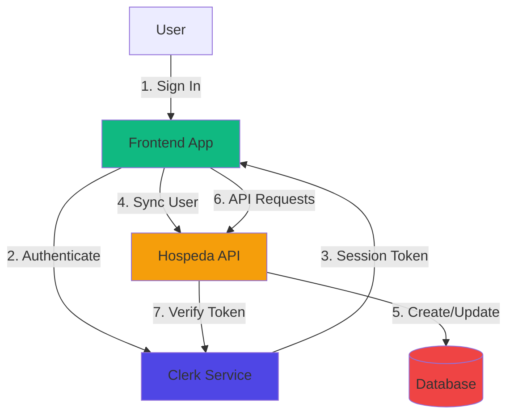
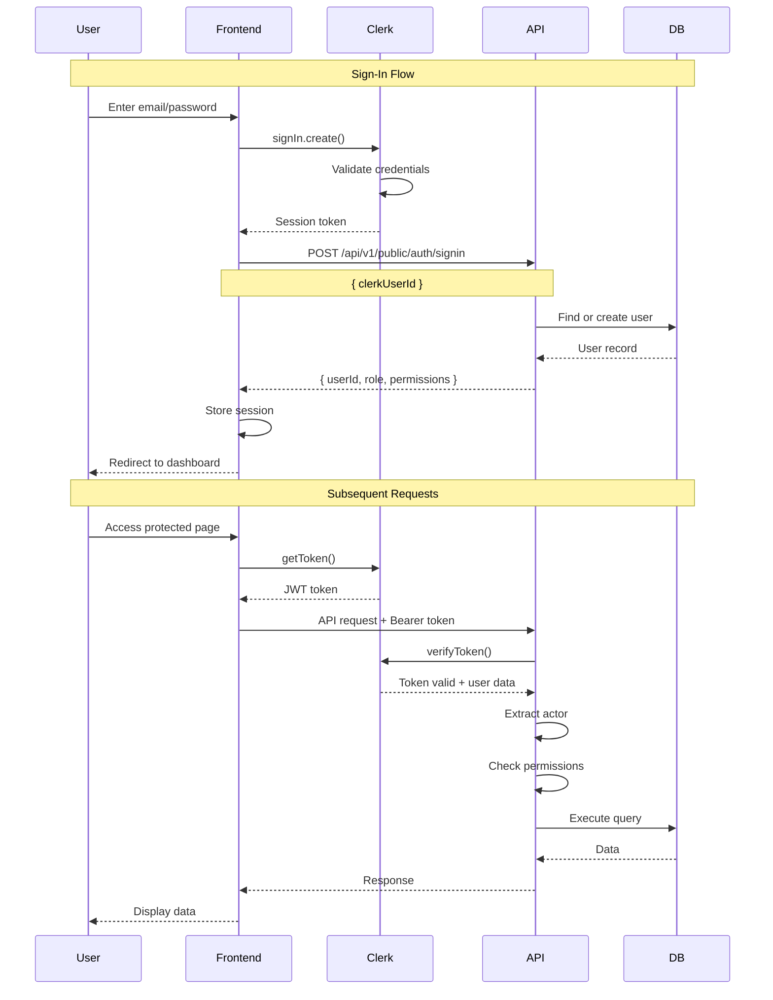
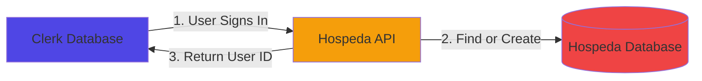

# Authentication Guide

Deep dive into Clerk authentication integration in the Hospeda platform.

## Table of Contents

- [Introduction](#introduction)
- [Authentication Architecture](#authentication-architecture)
- [Clerk Setup](#clerk-setup)
- [Authentication Flow](#authentication-flow)
- [Components Deep Dive](#components-deep-dive)
- [Database Synchronization](#database-synchronization)
- [Protected Routes](#protected-routes)
- [Actor Pattern](#actor-pattern)
- [Authorization](#authorization)
- [User Profile Management](#user-profile-management)
- [Session Management](#session-management)
- [Webhooks](#webhooks)
- [Testing Authentication](#testing-authentication)
- [Security Best Practices](#security-best-practices)
- [Multi-Tenancy](#multi-tenancy)
- [SSO Integration](#sso-integration)
- Common Issues
- Migration Guide
- Advanced Topics

## Introduction

Hospeda uses **Clerk** for authentication and user management. Clerk provides:

- Email/password authentication
- OAuth providers (Google, GitHub, etc.)
- Session management
- User profile management
- Multi-factor authentication (MFA)
- Webhook notifications

### Why Clerk?

- **Developer-friendly**: Simple, intuitive API
- **Secure by default**: Industry best practices
- **Customizable**: Flexible UI components
- **Scalable**: Handles millions of users
- **Feature-rich**: Everything you need out of the box

## Authentication Architecture

### High-Level Overview



### Authentication Layers

**1. Frontend Layer** (React Components)

- Sign-in/sign-up forms
- User menu
- Protected route guards
- Session checks

**2. Clerk Layer** (Auth Provider)

- User authentication
- Session management
- Token generation/validation
- OAuth integration

**3. API Layer** (Hono Backend)

- Token verification
- Actor extraction
- Permission checks
- Database sync

**4. Database Layer** (PostgreSQL)

- User records
- Role assignments
- Permission mappings
- Audit trails

## Clerk Setup

### Step 1: Create Clerk Account

1. Go to [clerk.com](https://clerk.com)
2. Sign up for free account
3. Create new application
4. Choose authentication methods (email, OAuth providers)

### Step 2: Get API Keys

From Clerk Dashboard:

1. Navigate to **API Keys** section
2. Copy **Publishable Key** (starts with `pk_`)
3. Copy **Secret Key** (starts with `sk_`)

### Step 3: Configure Environment Variables

```bash
# .env.local (Frontend)
PUBLIC_CLERK_PUBLISHABLE_KEY=pk_test_...

# .env (Backend)
CLERK_SECRET_KEY=sk_test_...
CLERK_PUBLISHABLE_KEY=pk_test_...
```

**Important:**

- Use `PUBLIC_` prefix for frontend environment variables in Astro
- Never commit secret keys to version control
- Use different keys for development/staging/production

### Step 4: Install Clerk SDK

Already installed in Hospeda:

```json
{
  "dependencies": {
    "@clerk/clerk-react": "^5.40.0",
    "@clerk/backend": "^1.0.0"
  }
}
```

### Step 5: Wrap App with ClerkProvider

**Web App (Astro):**

```tsx
// apps/web/src/layouts/BaseLayout.astro
---
import { ClerkProvider } from '@clerk/clerk-react';

const publishableKey = import.meta.env.PUBLIC_CLERK_PUBLISHABLE_KEY;
---

<ClerkProvider publishableKey={publishableKey}>
  <slot />
</ClerkProvider>
```

**Admin App (TanStack Start):**

```tsx
// apps/admin/app/router.tsx
import { ClerkProvider } from '@clerk/clerk-react';

export const Route = createRootRoute({
  component: () => (
    <ClerkProvider publishableKey={import.meta.env.VITE_CLERK_PUBLISHABLE_KEY}>
      <Outlet />
    </ClerkProvider>
  )
});
```

## Authentication Flow

### Complete Authentication Flow



### Sign-In Flow Details

**1. User Enters Credentials**

```tsx
// Frontend component
import { useSignIn } from '@clerk/clerk-react';

const { signIn, isLoaded } = useSignIn();

const handleSignIn = async (email: string, password: string) => {
  await signIn.create({
    identifier: email,
    password
  });
};
```

**2. Clerk Validates Credentials**

Clerk handles:

- Password verification
- Rate limiting
- Account status checks
- MFA if enabled

**3. Session Token Generated**

Clerk returns:

- Session token (JWT)
- User metadata
- Session ID

**4. Database Sync**

Frontend calls sync endpoint:

```typescript
// Sync user to Hospeda database
const response = await fetch('/api/v1/public/auth/signin', {
  method: 'POST',
  headers: { 'Content-Type': 'application/json' },
  body: JSON.stringify({ clerkUserId: user.id })
});

const { userId, role, permissions } = await response.json();
```

**5. User Redirected**

```tsx
if (signIn.status === 'complete') {
  await syncUser(user.id);
  router.push('/dashboard');
}
```

### Sign-Up Flow Details

**1. User Submits Registration**

```tsx
const { signUp } = useSignUp();

await signUp.create({
  emailAddress: 'user@example.com',
  password: 'secure-password',
  firstName: 'Juan',
  lastName: 'Pérez'
});
```

**2. Clerk Creates Account**

Clerk:

- Creates user account
- Sends verification email (if enabled)
- Generates session token

**3. Email Verification (Optional)**

```tsx
// User enters verification code
await signUp.attemptEmailAddressVerification({
  code: '123456'
});
```

**4. Database User Creation**

```typescript
// API endpoint creates database record
const response = await fetch('/api/v1/public/auth/signup', {
  method: 'POST',
  body: JSON.stringify({
    clerkUserId: user.id,
    email: user.emailAddress,
    firstName: user.firstName,
    lastName: user.lastName
  })
});
```

**5. Onboarding**

```tsx
if (signUp.status === 'complete') {
  await createDatabaseUser(user);
  router.push('/onboarding');
}
```

## Components Deep Dive

### SignInForm

Complete email/password sign-in form with OAuth options.

#### SignInForm Basic Usage

```tsx
import { SignInForm } from '@repo/auth-ui';

export function LoginPage() {
  return (
    <div className="max-w-md mx-auto p-6">
      <SignInForm
        onSynced={(dbUserId) => {
          console.log('User synced:', dbUserId);
        }}
        redirectTo="/dashboard"
      />
    </div>
  );
}
```

#### SignInForm Props

```typescript
type SignInFormProps = {
  /** Callback when user is synced to database */
  onSynced?: (dbUserId: string) => void;

  /** API base URL for sync endpoint */
  apiBaseUrl?: string;

  /** Path to redirect after successful sign-in */
  redirectTo?: string;

  /** Function to refresh auth context */
  refreshAuthContext?: () => Promise<void>;

  /** Custom CSS classes */
  className?: string;
};
```

#### SignInForm Features

- Email and password fields
- Form validation
- Loading states
- Error handling
- OAuth provider buttons
- "Forgot password" link
- Database sync on success
- Automatic redirect

#### SignInForm Implementation Example

```tsx
import { SignInForm } from '@repo/auth-ui';
import { useRouter } from 'next/router';

export function LoginPage() {
  const router = useRouter();

  return (
    <div className="min-h-screen flex items-center justify-center">
      <div className="max-w-md w-full p-8 bg-white rounded-lg shadow">
        <h1 className="text-2xl font-bold mb-6">Welcome Back</h1>

        <SignInForm
          onSynced={async (dbUserId) => {
            // User successfully synced to database
            console.log('Database user ID:', dbUserId);

            // Fetch additional user data if needed
            const userData = await fetchUserData(dbUserId);

            // Update local context
            setUser(userData);
          }}
          apiBaseUrl={import.meta.env.PUBLIC_API_URL}
          redirectTo="/dashboard"
          refreshAuthContext={async () => {
            // Refresh user data in your app's context
            await refetchUser();
          }}
        />

        <p className="mt-4 text-center text-sm">
          Don't have an account?{' '}
          <a href="/signup" className="text-blue-600 hover:underline">
            Sign up
          </a>
        </p>
      </div>
    </div>
  );
}
```

### SignUpForm

User registration form with validation.

#### SignUpForm Basic Usage

```tsx
import { SignUpForm } from '@repo/auth-ui';

export function RegisterPage() {
  return (
    <div className="max-w-md mx-auto p-6">
      <SignUpForm
        onSynced={(dbUserId) => {
          console.log('New user created:', dbUserId);
        }}
        redirectTo="/onboarding"
      />
    </div>
  );
}
```

#### SignUpForm Props

```typescript
type SignUpFormProps = {
  /** Callback when user is created in database */
  onSynced?: (dbUserId: string) => void;

  /** API base URL for signup endpoint */
  apiBaseUrl?: string;

  /** Path to redirect after successful sign-up */
  redirectTo?: string;

  /** Custom CSS classes */
  className?: string;
};
```

#### SignUpForm Features

- Email, password, name fields
- Password strength indicator
- Real-time validation
- OAuth provider options
- Email verification flow
- Database user creation
- Welcome email (optional)

#### SignUpForm Implementation Example

```tsx
import { SignUpForm } from '@repo/auth-ui';

export function RegisterPage() {
  return (
    <div className="min-h-screen flex items-center justify-center">
      <div className="max-w-md w-full p-8 bg-white rounded-lg shadow">
        <h1 className="text-2xl font-bold mb-6">Create Account</h1>

        <SignUpForm
          onSynced={async (dbUserId) => {
            // Send welcome email
            await sendWelcomeEmail(dbUserId);

            // Track analytics
            analytics.track('user_signed_up', { userId: dbUserId });

            // Set up default preferences
            await createDefaultPreferences(dbUserId);
          }}
          apiBaseUrl={import.meta.env.PUBLIC_API_URL}
          redirectTo="/onboarding"
        />

        <p className="mt-4 text-center text-sm">
          Already have an account?{' '}
          <a href="/signin" className="text-blue-600 hover:underline">
            Sign in
          </a>
        </p>
      </div>
    </div>
  );
}
```

### UserMenu

Full dropdown menu with user options.

#### UserMenu Basic Usage

```tsx
import { UserMenu } from '@repo/auth-ui';

export function AppHeader() {
  return (
    <header className="border-b">
      <div className="flex items-center justify-between p-4">
        <Logo />
        <UserMenu apiBaseUrl={import.meta.env.PUBLIC_API_URL} />
      </div>
    </header>
  );
}
```

#### UserMenu Features

- User avatar (from Clerk)
- User name display
- Dropdown menu with:
  - Profile link
  - Settings link
  - Sign-out action
- Smooth animations
- Keyboard accessible

#### UserMenu Implementation Example

```tsx
import { UserMenu } from '@repo/auth-ui';

export function DashboardLayout({ children }: { children: React.ReactNode }) {
  return (
    <div className="min-h-screen">
      <header className="bg-white border-b">
        <div className="max-w-7xl mx-auto px-4 sm:px-6 lg:px-8">
          <div className="flex items-center justify-between h-16">
            <div className="flex items-center">
              <Logo />
              <Navigation />
            </div>

            <div className="flex items-center space-x-4">
              <NotificationBell />
              <UserMenu apiBaseUrl="http://localhost:3000" />
            </div>
          </div>
        </div>
      </header>

      <main>{children}</main>
    </div>
  );
}
```

### SimpleUserMenu

Minimal user menu (name and avatar only).

#### SimpleUserMenu Basic Usage

```tsx
import { SimpleUserMenu } from '@repo/auth-ui';

export function Navbar() {
  return (
    <nav className="flex items-center justify-between p-4">
      <Logo />
      <SimpleUserMenu />
    </nav>
  );
}
```

### SignOutButton

Customizable sign-out button.

#### SignOutButton Basic Usage

```tsx
import { SignOutButton } from '@repo/auth-ui';

export function Header() {
  return (
    <nav>
      <SignOutButton
        onSignOut={() => {
          console.log('User signed out');
        }}
        redirectTo="/"
      >
        Sign Out
      </SignOutButton>
    </nav>
  );
}
```

## Database Synchronization

Clerk manages authentication, but Hospeda needs user data in its own database.

### Why Sync?

- **Store additional data**: Preferences, settings, etc.
- **Relationships**: Link users to accommodations, bookings, etc.
- **Queries**: Efficient database queries
- **Offline access**: Data available without Clerk API calls
- **Audit trails**: Track user actions

### Sync Architecture



### Sign-In Sync Endpoint

**POST /api/v1/public/auth/signin**

Syncs existing Clerk user to database on sign-in.

#### Sign-In Sync Request

```typescript
type SignInSyncRequest = {
  clerkUserId: string;
};
```

```json
{
  "clerkUserId": "user_abc123"
}
```

#### Sign-In Sync Response

```typescript
type SignInSyncResponse = {
  success: true;
  data: {
    id: string;
    clerkUserId: string;
    email: string;
    role: RoleEnum;
    permissions: PermissionEnum[];
  };
};
```

```json
{
  "success": true,
  "data": {
    "id": "usr_xyz789",
    "clerkUserId": "user_abc123",
    "email": "user@example.com",
    "role": "USER",
    "permissions": ["ACCOMMODATION_VIEW"]
  }
}
```

#### Sign-In Sync Implementation

```typescript
// apps/api/src/routes/auth.ts
import { Hono } from 'hono';
import { UserService } from '@repo/service-core';

const app = new Hono();

app.post('/api/v1/public/auth/signin', async (c) => {
  const { clerkUserId } = await c.req.json();

  const service = new UserService(c);

  // Find or create user
  let result = await service.findByClerkId({ clerkUserId });

  if (result.error && result.error.code === ServiceErrorCode.NOT_FOUND) {
    // User doesn't exist, create it
    // This handles cases where webhook failed or user was created before webhook setup
    result = await service.createFromClerk({ clerkUserId });
  }

  if (result.error) {
    return c.json({ error: result.error.message }, 500);
  }

  return c.json({
    success: true,
    data: {
      id: result.data.id,
      clerkUserId: result.data.clerkUserId,
      email: result.data.email,
      role: result.data.role,
      permissions: result.data.permissions
    }
  });
});

export default app;
```

### Sign-Up Sync Endpoint

**POST /api/v1/public/auth/signup**

Creates database user record on sign-up.

#### Sign-Up Sync Request

```typescript
type SignUpSyncRequest = {
  clerkUserId: string;
  email: string;
  firstName?: string;
  lastName?: string;
};
```

```json
{
  "clerkUserId": "user_abc123",
  "email": "user@example.com",
  "firstName": "Juan",
  "lastName": "Pérez"
}
```

#### Sign-Up Sync Response

```json
{
  "success": true,
  "data": {
    "id": "usr_xyz789",
    "clerkUserId": "user_abc123",
    "email": "user@example.com",
    "role": "USER",
    "permissions": ["ACCOMMODATION_VIEW"]
  }
}
```

#### Sign-Up Sync Implementation

```typescript
app.post('/api/v1/public/auth/signup', async (c) => {
  const { clerkUserId, email, firstName, lastName } = await c.req.json();

  const service = new UserService(c);

  const result = await service.create({
    actor: { id: 'system', role: RoleEnum.SYSTEM, permissions: [] },
    data: {
      clerkUserId,
      email,
      firstName,
      lastName,
      role: RoleEnum.USER
    }
  });

  if (result.error) {
    return c.json({ error: result.error.message }, 400);
  }

  return c.json({
    success: true,
    data: {
      id: result.data.id,
      clerkUserId: result.data.clerkUserId,
      email: result.data.email,
      role: result.data.role,
      permissions: result.data.permissions
    }
  });
});
```

### Sign-Out Sync Endpoint

**POST /api/v1/public/auth/signout**

Cleans up server-side session data.

#### Sign-Out Sync Implementation

```typescript
app.post('/api/v1/public/auth/signout', async (c) => {
  // Clean up any server-side session data
  // Most cleanup happens on client side with Clerk

  return c.json({ success: true });
});
```

## Protected Routes

Protect routes that require authentication.

### Frontend Protection (React)

#### Using Clerk's Built-in Components

```tsx
import { SignedIn, SignedOut, RedirectToSignIn } from '@clerk/clerk-react';

export function DashboardPage() {
  return (
    <>
      <SignedIn>
        {/* Shown only when user is signed in */}
        <Dashboard />
      </SignedIn>

      <SignedOut>
        {/* Redirect to sign-in if not authenticated */}
        <RedirectToSignIn />
      </SignedOut>
    </>
  );
}
```

#### Custom Protected Route Component

```tsx
import { useAuth } from '@clerk/clerk-react';
import { Navigate } from 'react-router-dom';

export function ProtectedRoute({ children }: { children: React.ReactNode }) {
  const { isSignedIn, isLoaded } = useAuth();

  // Wait for Clerk to load
  if (!isLoaded) {
    return <LoadingSpinner />;
  }

  // Redirect to sign-in if not authenticated
  if (!isSignedIn) {
    return <Navigate to="/signin" replace />;
  }

  // User is authenticated, render protected content
  return <>{children}</>;
}

// Usage
<Route path="/dashboard" element={
  <ProtectedRoute>
    <Dashboard />
  </ProtectedRoute>
} />
```

#### Role-Based Protection

```tsx
import { useUser } from '@clerk/clerk-react';

export function AdminRoute({ children }: { children: React.ReactNode }) {
  const { user, isLoaded } = useUser();

  if (!isLoaded) {
    return <LoadingSpinner />;
  }

  if (!user) {
    return <Navigate to="/signin" />;
  }

  const userRole = user.publicMetadata.role;

  if (userRole !== 'ADMIN') {
    return <Navigate to="/unauthorized" />;
  }

  return <>{children}</>;
}
```

### Backend Protection (Hono)

#### Auth Middleware

```typescript
import { clerkMiddleware } from '@hono/clerk-auth';

const app = new Hono();

// Apply Clerk middleware to all routes
app.use('*', clerkMiddleware());

// Protected route
app.get('/api/v1/accommodations', async (c) => {
  const auth = c.get('clerk');

  if (!auth?.userId) {
    return c.json({ error: 'Unauthorized' }, 401);
  }

  // User is authenticated, proceed
  const accommodations = await service.findAll({ actor });
  return c.json({ data: accommodations });
});
```

#### Actor Extraction

```typescript
import { clerkMiddleware, getAuth } from '@hono/clerk-auth';

export function extractActor(c: Context): Actor {
  const auth = getAuth(c);

  if (!auth?.userId) {
    throw new Error('Unauthorized');
  }

  // Get user from database
  const user = await userService.findByClerkId({ clerkUserId: auth.userId });

  if (user.error) {
    throw new Error('User not found');
  }

  return {
    id: user.data.id,
    role: user.data.role,
    permissions: user.data.permissions
  };
}

// Usage in route
app.get('/api/v1/accommodations/:id', async (c) => {
  const actor = extractActor(c);
  const { id } = c.req.param();

  const result = await service.findById({ actor, id });

  if (result.error) {
    return c.json({ error: result.error.message }, 404);
  }

  return c.json({ data: result.data });
});
```

## Actor Pattern

The Actor pattern represents the current user performing an action.

### Actor Type

```typescript
export type Actor = {
  /** Unique identifier of the actor */
  id: string;

  /** Role of the actor in the system */
  role: RoleEnum;

  /** Permissions assigned to the actor */
  permissions: PermissionEnum[];
};
```

### Creating Actors

```typescript
// From authenticated request
const actor: Actor = {
  id: user.id,
  role: user.role,
  permissions: user.permissions
};

// System actor (for automated tasks)
const systemActor: Actor = {
  id: 'system',
  role: RoleEnum.SYSTEM,
  permissions: Object.values(PermissionEnum)
};

// Anonymous actor (for public endpoints)
const anonymousActor: Actor = {
  id: 'anonymous',
  role: RoleEnum.GUEST,
  permissions: [PermissionEnum.ACCOMMODATION_VIEW]
};
```

### Using Actors in Services

```typescript
// All service methods require an actor
const result = await accommodationService.create({
  actor: {
    id: user.id,
    role: user.role,
    permissions: user.permissions
  },
  data: {
    name: 'Hotel Paradise',
    // ...
  }
});
```

### Actor-Based Authorization

```typescript
export class AccommodationService extends BaseCrudService {
  async update(input: ServiceInput<{ id: string; data: UpdateAccommodation }>) {
    return this.runWithLoggingAndValidation(async () => {
      const accommodation = await this.model.findById(input.id);

      if (!accommodation) {
        throw new ServiceError(ServiceErrorCode.NOT_FOUND, 'Not found');
      }

      // Check if actor can update this accommodation
      const canUpdate = await this.canUpdate(input.actor, accommodation);

      if (!canUpdate.canUpdate) {
        throw new ServiceError(
          ServiceErrorCode.FORBIDDEN,
          'You do not have permission to update this accommodation'
        );
      }

      // Proceed with update
      const updated = await this.model.update({ id: input.id }, input.data);
      return updated;
    });
  }
}
```

## Authorization

Authorization determines what actions a user can perform.

### Role-Based Access Control (RBAC)

#### Role Hierarchy

```typescript
export enum RoleEnum {
  GUEST = 'GUEST',           // Not authenticated
  USER = 'USER',             // Authenticated user
  MODERATOR = 'MODERATOR',   // Content moderator
  ADMIN = 'ADMIN',           // Administrator
  SUPER_ADMIN = 'SUPER_ADMIN', // Super administrator
  SYSTEM = 'SYSTEM'          // System processes
}
```

#### Role Permissions

```typescript
const ROLE_PERMISSIONS: Record<RoleEnum, PermissionEnum[]> = {
  [RoleEnum.GUEST]: [
    PermissionEnum.ACCOMMODATION_VIEW,
    PermissionEnum.DESTINATION_VIEW
  ],

  [RoleEnum.USER]: [
    PermissionEnum.ACCOMMODATION_VIEW,
    PermissionEnum.ACCOMMODATION_CREATE,
    PermissionEnum.BOOKING_CREATE,
    PermissionEnum.BOOKING_VIEW,
    PermissionEnum.REVIEW_CREATE
  ],

  [RoleEnum.MODERATOR]: [
    // All USER permissions plus:
    PermissionEnum.ACCOMMODATION_UPDATE,
    PermissionEnum.ACCOMMODATION_MODERATE,
    PermissionEnum.REVIEW_MODERATE
  ],

  [RoleEnum.ADMIN]: [
    // All MODERATOR permissions plus:
    PermissionEnum.ACCOMMODATION_DELETE,
    PermissionEnum.USER_MANAGE,
    PermissionEnum.SETTINGS_MANAGE
  ],

  [RoleEnum.SUPER_ADMIN]: Object.values(PermissionEnum),

  [RoleEnum.SYSTEM]: Object.values(PermissionEnum)
};
```

### Permission Checking in Services

```typescript
export abstract class BaseCrudService<T, TModel, TCreate, TUpdate, TSearch> {
  /**
   * Check if actor can view entity
   */
  async canView(actor: Actor, entity: T): Promise<CanViewResult> {
    // Check permission
    if (!actor.permissions.includes(PermissionEnum.ACCOMMODATION_VIEW)) {
      return {
        canView: false,
        reason: EntityPermissionReasonEnum.MISSING_PERMISSION
      };
    }

    // Check ownership (if entity has ownerId)
    if ('ownerId' in entity && entity.ownerId !== actor.id) {
      // Check if published (public)
      if ('status' in entity && entity.status !== 'published') {
        return {
          canView: false,
          reason: EntityPermissionReasonEnum.NOT_OWNER
        };
      }
    }

    return {
      canView: true,
      reason: EntityPermissionReasonEnum.OWNER
    };
  }

  /**
   * Check if actor can update entity
   */
  async canUpdate(actor: Actor, entity: T): Promise<CanUpdateResult> {
    // Admins can update anything
    if (actor.role === RoleEnum.ADMIN || actor.role === RoleEnum.SUPER_ADMIN) {
      return {
        canUpdate: true,
        reason: EntityPermissionReasonEnum.ADMIN
      };
    }

    // Check permission
    if (!actor.permissions.includes(PermissionEnum.ACCOMMODATION_UPDATE)) {
      return {
        canUpdate: false,
        reason: EntityPermissionReasonEnum.MISSING_PERMISSION
      };
    }

    // Check ownership
    if ('ownerId' in entity && entity.ownerId === actor.id) {
      return {
        canUpdate: true,
        reason: EntityPermissionReasonEnum.OWNER
      };
    }

    return {
      canUpdate: false,
      reason: EntityPermissionReasonEnum.NOT_OWNER
    };
  }
}
```

### Frontend Permission Guards

```tsx
import { useUser } from '@clerk/clerk-react';

export function AccommodationActions({ accommodation }: Props) {
  const { user } = useUser();

  const userRole = user?.publicMetadata.role as RoleEnum;
  const userPermissions = user?.publicMetadata.permissions as PermissionEnum[];

  const canEdit =
    userRole === RoleEnum.ADMIN ||
    userPermissions.includes(PermissionEnum.ACCOMMODATION_UPDATE);

  const canDelete =
    userRole === RoleEnum.ADMIN ||
    userPermissions.includes(PermissionEnum.ACCOMMODATION_DELETE);

  return (
    <div>
      {canEdit && (
        <button onClick={handleEdit}>Edit</button>
      )}

      {canDelete && (
        <button onClick={handleDelete}>Delete</button>
      )}
    </div>
  );
}
```

## User Profile Management

### Accessing User Data

```tsx
import { useUser } from '@clerk/clerk-react';

export function ProfilePage() {
  const { user, isLoaded } = useUser();

  if (!isLoaded) {
    return <LoadingSpinner />;
  }

  if (!user) {
    return <Navigate to="/signin" />;
  }

  return (
    <div>
      <h1>Profile</h1>

      <div>
        
        <p>{user.fullName}</p>
        <p>{user.primaryEmailAddress?.emailAddress}</p>
      </div>

      <div>
        <p>Role: {user.publicMetadata.role}</p>
        <p>Joined: {user.createdAt}</p>
      </div>
    </div>
  );
}
```

### Updating Profile

```tsx
import { useUser } from '@clerk/clerk-react';

export function EditProfileForm() {
  const { user } = useUser();
  const [firstName, setFirstName] = useState(user?.firstName || '');
  const [lastName, setLastName] = useState(user?.lastName || '');

  const handleSubmit = async (e: React.FormEvent) => {
    e.preventDefault();

    await user?.update({
      firstName,
      lastName
    });

    // Show success message
    toast.success('Profile updated');
  };

  return (
    <form onSubmit={handleSubmit}>
      <input
        value={firstName}
        onChange={(e) => setFirstName(e.target.value)}
        placeholder="First Name"
      />

      <input
        value={lastName}
        onChange={(e) => setLastName(e.target.value)}
        placeholder="Last Name"
      />

      <button type="submit">Save</button>
    </form>
  );
}
```

### Avatar Management

```tsx
import { useUser } from '@clerk/clerk-react';

export function AvatarUpload() {
  const { user } = useUser();

  const handleAvatarChange = async (file: File) => {
    await user?.setProfileImage({ file });

    // Show success message
    toast.success('Avatar updated');
  };

  return (
    <div>
      

      <input
        type="file"
        accept="image/*"
        onChange={(e) => {
          const file = e.target.files?.[0];
          if (file) {
            handleAvatarChange(file);
          }
        }}
      />
    </div>
  );
}
```

## Session Management

### Session Tokens

Clerk uses JWT tokens for session management.

#### Getting Token

```tsx
import { useAuth } from '@clerk/clerk-react';

export function useApiRequest() {
  const { getToken } = useAuth();

  const makeRequest = async (url: string, options: RequestInit = {}) => {
    const token = await getToken();

    return fetch(url, {
      ...options,
      headers: {
        ...options.headers,
        Authorization: `Bearer ${token}`
      }
    });
  };

  return { makeRequest };
}

// Usage
const { makeRequest } = useApiRequest();

const response = await makeRequest('/api/v1/accommodations', {
  method: 'POST',
  body: JSON.stringify(data)
});
```

#### Verifying Token (Backend)

```typescript
import { verifyToken } from '@clerk/backend';

const token = c.req.header('Authorization')?.replace('Bearer ', '');

if (!token) {
  return c.json({ error: 'Unauthorized' }, 401);
}

try {
  const session = await verifyToken(token, {
    secretKey: process.env.CLERK_SECRET_KEY
  });

  // Token is valid
  const userId = session.sub;

} catch (error) {
  return c.json({ error: 'Invalid token' }, 401);
}
```

### Refresh Tokens

Clerk automatically handles token refresh.

```tsx
import { useAuth } from '@clerk/clerk-react';

export function Component() {
  const { getToken } = useAuth();

  useEffect(() => {
    const fetchData = async () => {
      // getToken() automatically refreshes if expired
      const token = await getToken();

      const response = await fetch('/api/data', {
        headers: { Authorization: `Bearer ${token}` }
      });
    };

    fetchData();
  }, [getToken]);
}
```

### Session Expiration

Configure session lifetime in Clerk Dashboard:

1. Go to **Sessions** settings
2. Set **Session lifetime** (default: 7 days)
3. Set **Inactive session lifetime** (default: 24 hours)

## Webhooks

Clerk sends webhook notifications for user events.

### Setting Up Webhooks

**1. Create Endpoint**

```typescript
// apps/api/src/routes/webhooks/clerk.ts
import { Hono } from 'hono';
import { Webhook } from 'svix';
import type { WebhookEvent } from '@clerk/backend';

const app = new Hono();

app.post('/api/webhooks/clerk', async (c) => {
  const payload = await c.req.text();
  const headers = c.req.raw.headers;

  const webhook = new Webhook(process.env.CLERK_WEBHOOK_SECRET!);

  let event: WebhookEvent;

  try {
    event = webhook.verify(payload, {
      'svix-id': headers.get('svix-id')!,
      'svix-timestamp': headers.get('svix-timestamp')!,
      'svix-signature': headers.get('svix-signature')!
    }) as WebhookEvent;
  } catch (error) {
    return c.json({ error: 'Invalid signature' }, 400);
  }

  // Handle event
  switch (event.type) {
    case 'user.created':
      await handleUserCreated(event.data);
      break;

    case 'user.updated':
      await handleUserUpdated(event.data);
      break;

    case 'user.deleted':
      await handleUserDeleted(event.data);
      break;
  }

  return c.json({ success: true });
});

export default app;
```

**2. Configure in Clerk Dashboard**

1. Go to **Webhooks** section
2. Click **Add Endpoint**
3. Enter your webhook URL: `https://your-api.com/api/webhooks/clerk`
4. Select events to subscribe to
5. Copy **Signing Secret** to environment variables

**3. Add Webhook Secret**

```bash
# .env
CLERK_WEBHOOK_SECRET=whsec_...
```

### Handling User Created Event

```typescript
async function handleUserCreated(data: UserWebhookEvent['data']) {
  const service = new UserService(ctx);

  await service.create({
    actor: systemActor,
    data: {
      clerkUserId: data.id,
      email: data.email_addresses[0].email_address,
      firstName: data.first_name,
      lastName: data.last_name,
      role: RoleEnum.USER
    }
  });

  console.log('User created from webhook:', data.id);
}
```

### Handling User Updated Event

```typescript
async function handleUserUpdated(data: UserWebhookEvent['data']) {
  const service = new UserService(ctx);

  const user = await service.findByClerkId({ clerkUserId: data.id });

  if (user.error) {
    console.error('User not found:', data.id);
    return;
  }

  await service.update({
    actor: systemActor,
    id: user.data.id,
    data: {
      email: data.email_addresses[0].email_address,
      firstName: data.first_name,
      lastName: data.last_name
    }
  });

  console.log('User updated from webhook:', data.id);
}
```

### Handling User Deleted Event

```typescript
async function handleUserDeleted(data: UserWebhookEvent['data']) {
  const service = new UserService(ctx);

  const user = await service.findByClerkId({ clerkUserId: data.id });

  if (user.error) {
    console.error('User not found:', data.id);
    return;
  }

  await service.softDelete({
    actor: systemActor,
    id: user.data.id
  });

  console.log('User deleted from webhook:', data.id);
}
```

## Testing Authentication

### Mocking Clerk in Tests

```typescript
import { vi } from 'vitest';

vi.mock('@clerk/clerk-react', () => ({
  useAuth: () => ({
    isSignedIn: true,
    isLoaded: true,
    userId: 'test-user-id',
    getToken: vi.fn().mockResolvedValue('test-token')
  }),

  useUser: () => ({
    user: {
      id: 'test-user-id',
      firstName: 'Test',
      lastName: 'User',
      emailAddress: 'test@example.com',
      imageUrl: 'https://example.com/avatar.jpg',
      publicMetadata: {
        role: 'USER',
        permissions: ['ACCOMMODATION_VIEW']
      }
    },
    isLoaded: true
  }),

  SignedIn: ({ children }: { children: React.ReactNode }) => <>{children}</>,
  SignedOut: () => null,
  ClerkProvider: ({ children }: { children: React.ReactNode }) => <>{children}</>
}));
```

### Testing Protected Routes

```typescript
import { render, screen } from '@testing-library/react';
import { ProtectedRoute } from './ProtectedRoute';

describe('ProtectedRoute', () => {
  it('should render content when user is signed in', () => {
    render(
      <ProtectedRoute>
        <div>Protected Content</div>
      </ProtectedRoute>
    );

    expect(screen.getByText('Protected Content')).toBeInTheDocument();
  });

  it('should redirect when user is not signed in', () => {
    vi.mocked(useAuth).mockReturnValue({
      isSignedIn: false,
      isLoaded: true
    });

    render(
      <ProtectedRoute>
        <div>Protected Content</div>
      </ProtectedRoute>
    );

    expect(screen.queryByText('Protected Content')).not.toBeInTheDocument();
  });
});
```

### Testing Actor Permissions

```typescript
describe('AccommodationService', () => {
  it('should reject update without permission', async () => {
    const actor: Actor = {
      id: 'user-123',
      role: RoleEnum.USER,
      permissions: [PermissionEnum.ACCOMMODATION_VIEW] // Missing UPDATE permission
    };

    const accommodation = await createTestAccommodation();

    const result = await service.update({
      actor,
      id: accommodation.id,
      data: { name: 'New Name' }
    });

    expect(result.error?.code).toBe(ServiceErrorCode.FORBIDDEN);
  });
});
```

## Security Best Practices

### 1. Never Expose Secret Keys

```bash
# ❌ BAD: Secret in frontend
PUBLIC_CLERK_SECRET_KEY=sk_test_... # Never do this!

# ✅ GOOD: Secret only in backend
# Frontend (.env.local)
PUBLIC_CLERK_PUBLISHABLE_KEY=pk_test_...

# Backend (.env)
CLERK_SECRET_KEY=sk_test_...
```

### 2. Validate Tokens on Backend

```typescript
// ❌ BAD: Trusting client-provided user ID
app.get('/api/user/:id', async (c) => {
  const { id } = c.req.param();
  // Anyone can pass any ID!
  const user = await service.findById({ id });
  return c.json({ data: user });
});

// ✅ GOOD: Verify token and extract user ID
app.get('/api/user/me', async (c) => {
  const actor = extractActor(c); // Verified from token
  const user = await service.findById({ id: actor.id });
  return c.json({ data: user });
});
```

### 3. Use HTTPS in Production

```typescript
// Enforce HTTPS
app.use('*', async (c, next) => {
  if (process.env.NODE_ENV === 'production') {
    if (c.req.header('x-forwarded-proto') !== 'https') {
      return c.redirect(`https://${c.req.header('host')}${c.req.path}`);
    }
  }
  await next();
});
```

### 4. Implement Rate Limiting

```typescript
import { rateLimiter } from 'hono-rate-limiter';

app.use(
  '/api/v1/public/auth/*',
  rateLimiter({
    windowMs: 15 * 60 * 1000, // 15 minutes
    limit: 5, // 5 requests per window
    message: 'Too many authentication attempts'
  })
);
```

### 5. Sanitize User Input

```typescript
import { createAccommodationSchema } from '@repo/schemas';

app.post('/api/v1/accommodations', async (c) => {
  const data = await c.req.json();

  // Validate and sanitize with Zod
  const result = createAccommodationSchema.safeParse(data);

  if (!result.success) {
    return c.json({ error: 'Invalid data' }, 400);
  }

  // Use validated data
  const accommodation = await service.create({ actor, data: result.data });
});
```

## Multi-Tenancy

Hospeda supports multi-tenancy through client isolation.

### Client-Based Isolation

```typescript
// User belongs to client
type User = {
  id: string;
  clientId: string; // Client they belong to
  clerkUserId: string;
  email: string;
};

// Accommodation belongs to client
type Accommodation = {
  id: string;
  clientId: string; // Client that owns this accommodation
  name: string;
};
```

### Filtering by Client

```typescript
export class AccommodationService extends BaseCrudService {
  async findAll(input: ServiceInput<{ filters?: SearchFilters }>) {
    return this.runWithLoggingAndValidation(async () => {
      // Get user's client
      const user = await this.userModel.findById(input.actor.id);

      // Filter accommodations by client
      const accommodations = await this.model.findAll({
        ...input.filters,
        clientId: user.clientId
      });

      return accommodations;
    });
  }
}
```

## SSO Integration

Configure Single Sign-On (SSO) in Clerk Dashboard.

### Supported SSO Providers

- Google Workspace
- Microsoft Azure AD
- Okta
- Auth0
- Custom SAML

### Enabling SSO

1. Go to Clerk Dashboard → **SSO**
2. Click **Add Connection**
3. Select provider
4. Follow configuration steps
5. Test connection

---

**Last Updated:** 2024-11-06

**Maintained By:** Engineering Team

**Related Documentation:**

- [@repo/auth-ui Package](../../packages/auth-ui/README.md)
- [Clerk Documentation](https://clerk.com/docs)
- [Actor Pattern](../architecture/patterns.md#actor-pattern)
- [Authorization](../architecture/authorization.md)
