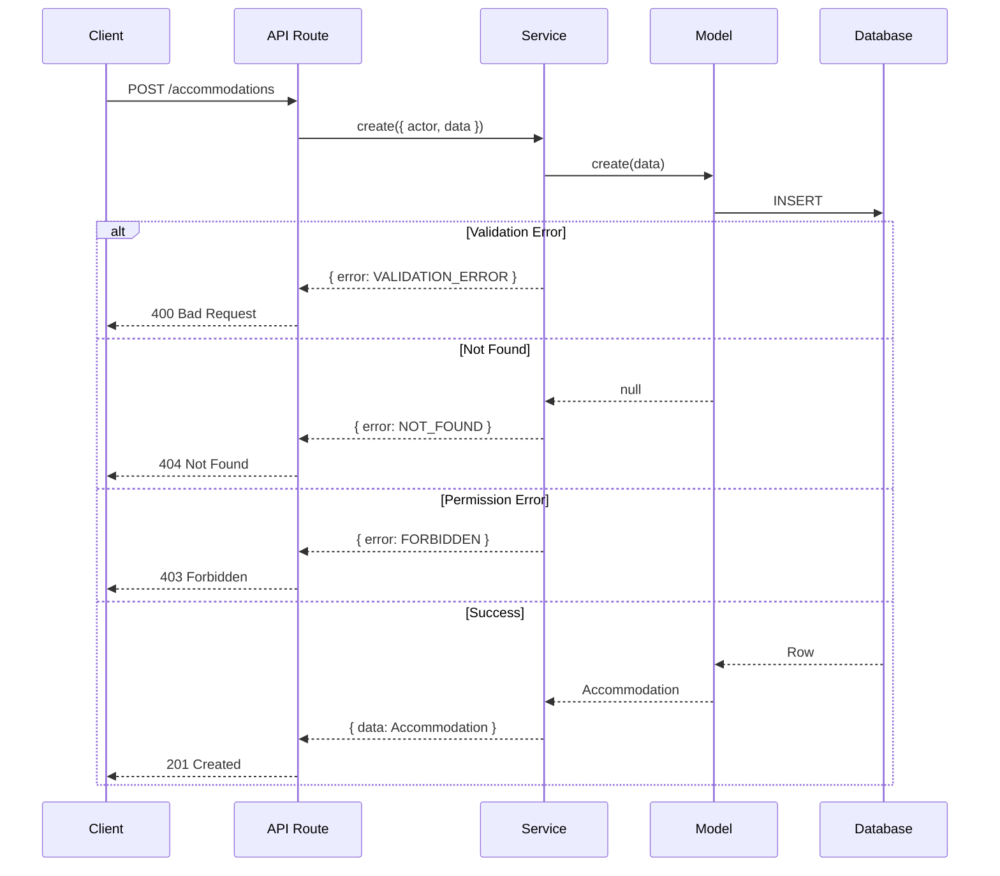

# Error Handling Guide

Complete guide to error handling patterns and best practices in the Hospeda platform.

## Table of Contents

- [Introduction](#introduction)
- [Error Handling Philosophy](#error-handling-philosophy)
- [ServiceOutput Pattern](#serviceoutput-pattern)
- [Error Codes](#error-codes)
- [Creating Errors](#creating-errors)
- [Handling Errors in Services](#handling-errors-in-services)
- [Handling Errors in API Routes](#handling-errors-in-api-routes)
- [Validation Errors](#validation-errors)
- [Error Propagation](#error-propagation)
- [Logging Errors](#logging-errors)
- [Error Messages](#error-messages)
- [Testing Error Cases](#testing-error-cases)
- [Best Practices](#best-practices)
- [Common Patterns](#common-patterns)
- [Anti-Patterns](#anti-patterns)
- [Troubleshooting](#troubleshooting)

## Introduction

Error handling is a critical aspect of any application. In Hospeda, we use a consistent, type-safe approach to error handling that makes errors predictable, easy to handle, and developer-friendly.

### Key Principles

1. **Type-Safe Errors**: Errors are part of the type system
2. **Explicit Error Handling**: No silent failures
3. **Consistent Structure**: Same pattern everywhere
4. **Informative Messages**: Clear, actionable error messages
5. **Proper Logging**: All errors are logged appropriately

## Error Handling Philosophy

### Why Not Throw Exceptions?

In Hospeda, services **return errors** instead of throwing exceptions.

**Traditional approach (throwing):**

```typescript
// ❌ Not used in Hospeda
try {
  const accommodation = await service.create(data);
  return accommodation;
} catch (error) {
  // Handle error
  console.error(error);
  return null; // Or throw again
}
```

**Hospeda approach (returning):**

```typescript
// ✅ Used in Hospeda
const result = await service.create({ actor, data });

if (result.error) {
  // Handle error
  return c.json({ error: result.error.message }, 400);
}

return c.json({ data: result.data });
```

### Benefits of Returning Errors

1. **Type Safety**: Compiler forces you to handle errors
2. **Explicit**: Clear which operations can fail
3. **Predictable**: No unexpected exceptions
4. **Composable**: Easy to chain operations
5. **Testable**: Easy to test error paths

## ServiceOutput Pattern

The foundation of error handling in Hospeda is the `ServiceOutput<T>` type.

### Definition

```typescript
export type ServiceOutput<T> =
  | {
      /** The success data */
      data: T;
      /** Error is never present in success case */
      error?: never;
    }
  | {
      /** Data is never present in error case */
      data?: never;
      /** The error information */
      error: {
        /** Error code */
        code: ServiceErrorCode;
        /** Error message */
        message: string;
        /** Optional additional details for debugging or context */
        details?: unknown;
      };
    };
```

### How It Works

`ServiceOutput<T>` is a **discriminated union** that can be either:

- **Success**: `{ data: T, error?: never }`
- **Error**: `{ data?: never, error: { code, message, details? } }`

TypeScript's type system ensures you can't access both `data` and `error` at the same time.

### Using ServiceOutput

```typescript
async function example() {
  const result: ServiceOutput<Accommodation> = await service.create({
    actor,
    data
  });

  // TypeScript knows result has either data OR error
  if (result.error) {
    // In this branch, TypeScript knows error exists
    console.error(result.error.message);
    // result.data is undefined (TypeScript enforces this)
    return;
  }

  // In this branch, TypeScript knows data exists
  console.log(result.data.name);
  // result.error is undefined (TypeScript enforces this)
}
```

### Type Narrowing

TypeScript automatically narrows the type based on checks:

```typescript
const result = await service.create({ actor, data });

// Check for error
if (result.error) {
  // TypeScript knows: result.error exists
  // TypeScript knows: result.data is never
  const errorCode = result.error.code;
  const errorMessage = result.error.message;
  return;
}

// After error check, TypeScript knows: result.data exists
const accommodation = result.data;
const name = result.data.name;
```

## Error Codes

Hospeda uses a standardized set of error codes defined in `ServiceErrorCode` enum.

### Available Error Codes

```typescript
export enum ServiceErrorCode {
  /** Input validation failed */
  VALIDATION_ERROR = 'VALIDATION_ERROR',

  /** Entity not found */
  NOT_FOUND = 'NOT_FOUND',

  /** User is not authenticated */
  UNAUTHORIZED = 'UNAUTHORIZED',

  /** User is not authorized to perform the action */
  FORBIDDEN = 'FORBIDDEN',

  /** Unexpected internal error */
  INTERNAL_ERROR = 'INTERNAL_ERROR',

  /** Entity or assignment already exists */
  ALREADY_EXISTS = 'ALREADY_EXISTS',

  /** Invalid pagination parameters provided */
  INVALID_PAGINATION_PARAMS = 'INVALID_PAGINATION_PARAMS',

  /** Method is not implemented */
  NOT_IMPLEMENTED = 'NOT_IMPLEMENTED'
}
```

### When to Use Each Code

#### VALIDATION_ERROR

**When:** Input data doesn't meet validation requirements

**Examples:**

- Empty required fields
- Invalid email format
- Negative price
- String too long/short
- Invalid enum value

**Usage:**

```typescript
if (!input.data.name) {
  return {
    error: {
      code: ServiceErrorCode.VALIDATION_ERROR,
      message: 'Name is required',
      details: { field: 'name' }
    }
  };
}
```

#### NOT_FOUND

**When:** Requested entity doesn't exist in database

**Examples:**

- Accommodation ID doesn't exist
- User not found
- Destination not found

**Usage:**

```typescript
const accommodation = await this.model.findById(id);

if (!accommodation) {
  return {
    error: {
      code: ServiceErrorCode.NOT_FOUND,
      message: 'Accommodation not found',
      details: { id }
    }
  };
}
```

#### UNAUTHORIZED

**When:** User is not authenticated (no valid session/token)

**Examples:**

- Missing authentication token
- Expired session
- Invalid credentials

**Usage:**

```typescript
if (!actor.id) {
  return {
    error: {
      code: ServiceErrorCode.UNAUTHORIZED,
      message: 'Authentication required'
    }
  };
}
```

#### FORBIDDEN

**When:** User is authenticated but lacks permission

**Examples:**

- Regular user trying to delete accommodation
- User trying to edit someone else's content
- Insufficient role/permissions

**Usage:**

```typescript
const canUpdate = await this.canUpdate(actor, accommodation);

if (!canUpdate.canUpdate) {
  return {
    error: {
      code: ServiceErrorCode.FORBIDDEN,
      message: 'You do not have permission to update this accommodation',
      details: { reason: canUpdate.reason }
    }
  };
}
```

#### INTERNAL_ERROR

**When:** Unexpected error that shouldn't happen

**Examples:**

- Database connection failure
- Unexpected exception
- System error

**Usage:**

```typescript
try {
  const result = await this.model.create(data);
  return { data: result };
} catch (error) {
  return {
    error: {
      code: ServiceErrorCode.INTERNAL_ERROR,
      message: 'An unexpected error occurred',
      details: { originalError: error.message }
    }
  };
}
```

#### ALREADY_EXISTS

**When:** Attempting to create duplicate entity

**Examples:**

- Duplicate slug
- Email already registered
- Unique constraint violation

**Usage:**

```typescript
const existing = await this.model.findOne({ slug: data.slug });

if (existing) {
  return {
    error: {
      code: ServiceErrorCode.ALREADY_EXISTS,
      message: 'Accommodation with this slug already exists',
      details: { slug: data.slug }
    }
  };
}
```

#### INVALID_PAGINATION_PARAMS

**When:** Pagination parameters are invalid

**Examples:**

- Negative page number
- Page size exceeds maximum
- Invalid sort field

**Usage:**

```typescript
if (page < 1 || pageSize < 1 || pageSize > 100) {
  return {
    error: {
      code: ServiceErrorCode.INVALID_PAGINATION_PARAMS,
      message: 'Invalid pagination parameters',
      details: { page, pageSize }
    }
  };
}
```

#### NOT_IMPLEMENTED

**When:** Feature is not yet implemented

**Examples:**

- Stub methods
- Planned features
- Temporary placeholders

**Usage:**

```typescript
async advancedSearch(input: ServiceInput<SearchParams>): Promise<ServiceOutput<Results>> {
  return {
    error: {
      code: ServiceErrorCode.NOT_IMPLEMENTED,
      message: 'Advanced search is not yet implemented'
    }
  };
}
```

### HTTP Status Code Mapping

Error codes map to HTTP status codes:

```typescript
export function getHttpStatusCode(code: ServiceErrorCode): number {
  switch (code) {
    case ServiceErrorCode.VALIDATION_ERROR:
      return 400; // Bad Request

    case ServiceErrorCode.NOT_FOUND:
      return 404; // Not Found

    case ServiceErrorCode.UNAUTHORIZED:
      return 401; // Unauthorized

    case ServiceErrorCode.FORBIDDEN:
      return 403; // Forbidden

    case ServiceErrorCode.ALREADY_EXISTS:
      return 409; // Conflict

    case ServiceErrorCode.INVALID_PAGINATION_PARAMS:
      return 400; // Bad Request

    case ServiceErrorCode.NOT_IMPLEMENTED:
      return 501; // Not Implemented

    case ServiceErrorCode.INTERNAL_ERROR:
    default:
      return 500; // Internal Server Error
  }
}
```

## Creating Errors

### ServiceError Class

For errors within services, use the `ServiceError` class:

```typescript
export class ServiceError extends Error {
  constructor(
    public code: ServiceErrorCode,
    message: string,
    public details?: unknown
  ) {
    super(message);
    this.name = 'ServiceError';
  }
}
```

### Throwing ServiceError

```typescript
throw new ServiceError(
  ServiceErrorCode.NOT_FOUND,
  'Accommodation not found',
  { id: accommodationId }
);
```

### Creating Error Objects

Alternatively, create error objects directly:

```typescript
return {
  error: {
    code: ServiceErrorCode.VALIDATION_ERROR,
    message: 'Name is required',
    details: { field: 'name' }
  }
};
```

## Handling Errors in Services

Services use the `runWithLoggingAndValidation` wrapper for consistent error handling.

### Basic Pattern

```typescript
async create(input: ServiceInput<{ data: CreateAccommodation }>): Promise<ServiceOutput<Accommodation>> {
  return this.runWithLoggingAndValidation(async () => {
    // Business logic here
    const accommodation = await this.model.create(input.data);
    return accommodation;
  });
}
```

### What runWithLoggingAndValidation Does

1. **Catches ServiceError**: Converts to ServiceOutput
2. **Logs errors**: Automatically logs with context
3. **Validates input**: Checks actor and permissions
4. **Handles exceptions**: Catches unexpected errors

### Throwing ServiceError in Services

```typescript
async publish(input: ServiceInput<{ id: string }>): Promise<ServiceOutput<Accommodation>> {
  return this.runWithLoggingAndValidation(async () => {
    const accommodation = await this.model.findById(input.id);

    if (!accommodation) {
      throw new ServiceError(
        ServiceErrorCode.NOT_FOUND,
        'Accommodation not found'
      );
    }

    if (accommodation.status !== 'draft') {
      throw new ServiceError(
        ServiceErrorCode.VALIDATION_ERROR,
        'Only draft accommodations can be published'
      );
    }

    const updated = await this.model.update(
      { id: input.id },
      { status: 'published', publishedAt: new Date() }
    );

    return updated;
  });
}
```

### Multiple Error Checks

```typescript
async update(input: ServiceInput<{ id: string; data: UpdateAccommodation }>): Promise<ServiceOutput<Accommodation>> {
  return this.runWithLoggingAndValidation(async () => {
    // Check 1: Entity exists
    const accommodation = await this.model.findById(input.id);
    if (!accommodation) {
      throw new ServiceError(
        ServiceErrorCode.NOT_FOUND,
        'Accommodation not found'
      );
    }

    // Check 2: Permissions
    const canUpdate = await this.canUpdate(input.actor, accommodation);
    if (!canUpdate.canUpdate) {
      throw new ServiceError(
        ServiceErrorCode.FORBIDDEN,
        'You do not have permission to update this accommodation'
      );
    }

    // Check 3: Business rule
    if (input.data.status === 'published' && accommodation.status === 'archived') {
      throw new ServiceError(
        ServiceErrorCode.VALIDATION_ERROR,
        'Cannot publish archived accommodation'
      );
    }

    // All checks passed, update
    const updated = await this.model.update({ id: input.id }, input.data);
    return updated;
  });
}
```

## Handling Errors in API Routes

API routes convert `ServiceOutput` to HTTP responses.

### Basic Pattern

```typescript
app.get('/api/v1/accommodations/:id', async (c) => {
  const { id } = c.req.param();
  const actor = extractActor(c);

  const result = await accommodationService.findById({ actor, id });

  if (result.error) {
    return c.json(
      { error: result.error.message },
      getHttpStatusCode(result.error.code)
    );
  }

  return c.json({ data: result.data });
});
```

### With Error Details

```typescript
app.post('/api/v1/accommodations', async (c) => {
  const actor = extractActor(c);
  const data = await c.req.json();

  const result = await accommodationService.create({ actor, data });

  if (result.error) {
    return c.json(
      {
        success: false,
        error: {
          code: result.error.code,
          message: result.error.message,
          details: result.error.details
        }
      },
      getHttpStatusCode(result.error.code)
    );
  }

  return c.json({
    success: true,
    data: result.data
  }, 201);
});
```

### Reusable Error Handler

```typescript
function handleServiceOutput<T>(
  c: Context,
  result: ServiceOutput<T>,
  successStatus = 200
) {
  if (result.error) {
    return c.json(
      {
        success: false,
        error: {
          code: result.error.code,
          message: result.error.message,
          details: result.error.details
        }
      },
      getHttpStatusCode(result.error.code)
    );
  }

  return c.json({ success: true, data: result.data }, successStatus);
}

// Usage
app.get('/api/v1/accommodations/:id', async (c) => {
  const { id } = c.req.param();
  const actor = extractActor(c);

  const result = await accommodationService.findById({ actor, id });

  return handleServiceOutput(c, result);
});
```

### Global Error Handler

```typescript
app.onError((err, c) => {
  console.error('Unhandled error:', err);

  if (err instanceof ServiceError) {
    return c.json(
      {
        success: false,
        error: {
          code: err.code,
          message: err.message,
          details: err.details
        }
      },
      getHttpStatusCode(err.code)
    );
  }

  return c.json(
    {
      success: false,
      error: {
        code: ServiceErrorCode.INTERNAL_ERROR,
        message: 'An unexpected error occurred'
      }
    },
    500
  );
});
```

## Validation Errors

Validation errors use Zod schemas and map to `VALIDATION_ERROR` code.

### Zod Validation in Services

```typescript
import { createAccommodationSchema } from '@repo/schemas';

async create(input: ServiceInput<{ data: CreateAccommodation }>): Promise<ServiceOutput<Accommodation>> {
  return this.runWithLoggingAndValidation(async () => {
    // Zod validation
    const parseResult = createAccommodationSchema.safeParse(input.data);

    if (!parseResult.success) {
      throw new ServiceError(
        ServiceErrorCode.VALIDATION_ERROR,
        'Invalid accommodation data',
        { errors: parseResult.error.errors }
      );
    }

    const validated = parseResult.data;
    const accommodation = await this.model.create(validated);

    return accommodation;
  });
}
```

### Zod Validation in API Routes

```typescript
import { zValidator } from '@hono/zod-validator';
import { createAccommodationSchema } from '@repo/schemas';

app.post(
  '/api/v1/accommodations',
  zValidator('json', createAccommodationSchema),
  async (c) => {
    const actor = extractActor(c);
    const data = c.req.valid('json'); // Already validated by Zod

    const result = await accommodationService.create({ actor, data });

    return handleServiceOutput(c, result, 201);
  }
);
```

### Custom Validation Errors

```typescript
async create(input: ServiceInput<{ data: CreateAccommodation }>): Promise<ServiceOutput<Accommodation>> {
  return this.runWithLoggingAndValidation(async () => {
    // Custom business validation
    if (input.data.pricePerNight < 0) {
      throw new ServiceError(
        ServiceErrorCode.VALIDATION_ERROR,
        'Price per night must be positive',
        { field: 'pricePerNight', value: input.data.pricePerNight }
      );
    }

    if (input.data.maxGuests < 1) {
      throw new ServiceError(
        ServiceErrorCode.VALIDATION_ERROR,
        'Maximum guests must be at least 1',
        { field: 'maxGuests', value: input.data.maxGuests }
      );
    }

    const accommodation = await this.model.create(input.data);
    return accommodation;
  });
}
```

## Error Propagation

Errors propagate through the application layers automatically.

### Error Flow Diagram



### Database → Model

Model returns `null` or throws:

```typescript
async findById(id: string): Promise<Accommodation | null> {
  const result = await db
    .select()
    .from(accommodationTable)
    .where(eq(accommodationTable.id, id))
    .limit(1);

  return result[0] ?? null;
}
```

### Model → Service

Service checks and returns `ServiceOutput`:

```typescript
async findById(input: ServiceInput<{ id: string }>): Promise<ServiceOutput<Accommodation>> {
  return this.runWithLoggingAndValidation(async () => {
    const accommodation = await this.model.findById(input.id);

    if (!accommodation) {
      throw new ServiceError(
        ServiceErrorCode.NOT_FOUND,
        'Accommodation not found'
      );
    }

    return accommodation;
  });
}
```

### Service → API Route

API route converts to HTTP response:

```typescript
app.get('/api/v1/accommodations/:id', async (c) => {
  const { id } = c.req.param();
  const actor = extractActor(c);

  const result = await service.findById({ actor, id });

  if (result.error) {
    return c.json({ error: result.error.message }, 404);
  }

  return c.json({ data: result.data });
});
```

### API Route → Client

Client receives standardized error:

```json
{
  "success": false,
  "error": {
    "code": "NOT_FOUND",
    "message": "Accommodation not found",
    "details": { "id": "123" }
  }
}
```

## Logging Errors

All errors are logged automatically through the `runWithLoggingAndValidation` wrapper.

### Automatic Logging

```typescript
async create(input: ServiceInput<{ data: CreateAccommodation }>): Promise<ServiceOutput<Accommodation>> {
  return this.runWithLoggingAndValidation(async () => {
    // Errors here are automatically logged
    throw new ServiceError(
      ServiceErrorCode.VALIDATION_ERROR,
      'Name is required'
    );
  });
}
```

**Logged output:**

```text
[ERROR] AccommodationService.create: Name is required
  code: VALIDATION_ERROR
  actor: { id: 'user-123', role: 'user' }
  input: { data: { ... } }
```

### Manual Logging

For additional context:

```typescript
async create(input: ServiceInput<{ data: CreateAccommodation }>): Promise<ServiceOutput<Accommodation>> {
  return this.runWithLoggingAndValidation(async () => {
    this.logger.info('Creating accommodation', { name: input.data.name });

    try {
      const accommodation = await this.model.create(input.data);
      this.logger.info('Accommodation created', { id: accommodation.id });
      return accommodation;
    } catch (error) {
      this.logger.error('Failed to create accommodation', error);
      throw new ServiceError(
        ServiceErrorCode.INTERNAL_ERROR,
        'Failed to create accommodation',
        { originalError: error }
      );
    }
  });
}
```

### Log Levels

```typescript
this.logger.debug('Debug information');   // Development only
this.logger.info('Informational message'); // Normal operations
this.logger.warn('Warning message');       // Potential issues
this.logger.error('Error message', error); // Actual errors
```

## Error Messages

### Writing Good Error Messages

**DO:**

- Be specific and actionable
- Include relevant context
- Use user-friendly language
- Suggest solutions when possible

**DON'T:**

- Expose internal details
- Use technical jargon
- Blame the user
- Be vague

### Good Error Messages

```typescript
// ✅ GOOD: Specific and helpful
'Email address is already registered. Please use a different email or sign in.'

// ✅ GOOD: Clear what's wrong
'Accommodation name must be between 3 and 100 characters. Current length: 2.'

// ✅ GOOD: Actionable
'You do not have permission to delete this accommodation. Please contact an administrator.'
```

### Bad Error Messages

```typescript
// ❌ BAD: Vague
'Invalid input'

// ❌ BAD: Technical
'Foreign key constraint violation on table accommodations_users'

// ❌ BAD: Blaming user
'You entered the wrong data'

// ❌ BAD: Not helpful
'Error occurred'
```

### User-Friendly vs Debug Messages

```typescript
// User-facing message
const userMessage = 'Unable to create accommodation. Please try again.';

// Debug details (logged, not shown to user)
const debugDetails = {
  error: 'Unique constraint violation',
  field: 'slug',
  value: 'hotel-paradise',
  table: 'accommodations'
};

throw new ServiceError(
  ServiceErrorCode.ALREADY_EXISTS,
  userMessage,
  debugDetails
);
```

## Testing Error Cases

Always test error scenarios in your test suite.

### Testing Validation Errors

```typescript
it('should reject empty name', async () => {
  const actor = createAdminActor();
  const invalidData = { name: '', /* other fields */ };

  const result = await service.create({ actor, data: invalidData });

  expect(result.error).toBeDefined();
  expect(result.error?.code).toBe(ServiceErrorCode.VALIDATION_ERROR);
  expect(result.error?.message).toContain('name');
});
```

### Testing Not Found Errors

```typescript
it('should return NOT_FOUND for non-existent accommodation', async () => {
  const actor = createAdminActor();
  const nonExistentId = 'non-existent-id';

  const result = await service.findById({ actor, id: nonExistentId });

  expect(result.error).toBeDefined();
  expect(result.error?.code).toBe(ServiceErrorCode.NOT_FOUND);
});
```

### Testing Permission Errors

```typescript
it('should reject update without permission', async () => {
  const actor = createUserActor(); // Regular user
  const accommodation = await createTestAccommodation({
    ownerId: 'different-user-id'
  });

  const result = await service.update({
    actor,
    id: accommodation.id,
    data: { name: 'New Name' }
  });

  expect(result.error?.code).toBe(ServiceErrorCode.FORBIDDEN);
});
```

### Testing Error Details

```typescript
it('should include error details', async () => {
  const result = await service.create({
    actor,
    data: invalidData
  });

  expect(result.error?.details).toBeDefined();
  expect(result.error?.details).toHaveProperty('field');
});
```

## Best Practices

### 1. Always Return ServiceOutput

```typescript
// ✅ GOOD
async create(input: ServiceInput<{ data: T }>): Promise<ServiceOutput<T>> {
  return this.runWithLoggingAndValidation(async () => {
    // Implementation
  });
}

// ❌ BAD
async create(input: ServiceInput<{ data: T }>): Promise<T> {
  // Can't return errors!
}
```

### 2. Use Specific Error Codes

```typescript
// ✅ GOOD
throw new ServiceError(
  ServiceErrorCode.VALIDATION_ERROR,
  'Email format is invalid'
);

// ❌ BAD
throw new ServiceError(
  ServiceErrorCode.INTERNAL_ERROR,
  'Email format is invalid'
);
```

### 3. Provide Helpful Messages

```typescript
// ✅ GOOD
throw new ServiceError(
  ServiceErrorCode.VALIDATION_ERROR,
  'Description must be at least 100 characters. Current length: 45.'
);

// ❌ BAD
throw new ServiceError(
  ServiceErrorCode.VALIDATION_ERROR,
  'Invalid description'
);
```

### 4. Include Error Details

```typescript
// ✅ GOOD
throw new ServiceError(
  ServiceErrorCode.NOT_FOUND,
  'Accommodation not found',
  { id: accommodationId, requestedBy: actor.id }
);

// ❌ BAD
throw new ServiceError(
  ServiceErrorCode.NOT_FOUND,
  'Accommodation not found'
);
```

### 5. Handle Errors at Every Layer

```typescript
// ✅ GOOD: API layer handles service errors
const result = await service.create({ actor, data });
if (result.error) {
  return c.json({ error: result.error.message }, 400);
}

// ❌ BAD: Not checking for errors
const result = await service.create({ actor, data });
return c.json({ data: result.data }); // What if error exists?
```

## Common Patterns

### Pattern 1: Check Entity Exists

```typescript
const accommodation = await this.model.findById(id);

if (!accommodation) {
  throw new ServiceError(
    ServiceErrorCode.NOT_FOUND,
    'Accommodation not found',
    { id }
  );
}

// Continue with accommodation
```

### Pattern 2: Check Permissions

```typescript
const canUpdate = await this.canUpdate(actor, accommodation);

if (!canUpdate.canUpdate) {
  throw new ServiceError(
    ServiceErrorCode.FORBIDDEN,
    'You do not have permission to update this accommodation',
    { reason: canUpdate.reason }
  );
}
```

### Pattern 3: Validate Business Rules

```typescript
if (accommodation.status !== 'draft') {
  throw new ServiceError(
    ServiceErrorCode.VALIDATION_ERROR,
    'Only draft accommodations can be published'
  );
}
```

### Pattern 4: Handle Duplicate Checks

```typescript
const existing = await this.model.findOne({ slug: data.slug });

if (existing) {
  throw new ServiceError(
    ServiceErrorCode.ALREADY_EXISTS,
    'Accommodation with this slug already exists',
    { slug: data.slug }
  );
}
```

## Anti-Patterns

### Anti-Pattern 1: Swallowing Errors

```typescript
// ❌ BAD: Silent failure
try {
  await service.create({ actor, data });
} catch (error) {
  // Error is ignored!
}

// ✅ GOOD: Handle or propagate
const result = await service.create({ actor, data });
if (result.error) {
  // Handle error appropriately
  console.error(result.error);
  return;
}
```

### Anti-Pattern 2: Generic Error Messages

```typescript
// ❌ BAD: Not helpful
throw new ServiceError(
  ServiceErrorCode.VALIDATION_ERROR,
  'Invalid input'
);

// ✅ GOOD: Specific
throw new ServiceError(
  ServiceErrorCode.VALIDATION_ERROR,
  'Name must be at least 3 characters'
);
```

### Anti-Pattern 3: Wrong Error Code

```typescript
// ❌ BAD: Using INTERNAL_ERROR for validation
if (!data.name) {
  throw new ServiceError(
    ServiceErrorCode.INTERNAL_ERROR,
    'Name is required'
  );
}

// ✅ GOOD: Use correct code
if (!data.name) {
  throw new ServiceError(
    ServiceErrorCode.VALIDATION_ERROR,
    'Name is required'
  );
}
```

### Anti-Pattern 4: Not Checking Errors in API

```typescript
// ❌ BAD: Not checking for errors
app.get('/accommodations/:id', async (c) => {
  const result = await service.findById({ actor, id });
  return c.json({ data: result.data }); // What if error?
});

// ✅ GOOD: Always check
app.get('/accommodations/:id', async (c) => {
  const result = await service.findById({ actor, id });

  if (result.error) {
    return c.json({ error: result.error.message }, 404);
  }

  return c.json({ data: result.data });
});
```

## Troubleshooting

### Problem: TypeScript Error "Property 'data' does not exist"

**Symptom:**

```typescript
const result = await service.create({ actor, data });
console.log(result.data.name); // Error: Property 'data' does not exist
```

**Cause:** Not checking for errors first.

**Solution:**

```typescript
const result = await service.create({ actor, data });

if (result.error) {
  // Handle error
  return;
}

// Now TypeScript knows data exists
console.log(result.data.name);
```

### Problem: Error Not Being Logged

**Symptom:** Error occurs but doesn't appear in logs.

**Cause:** Not using `runWithLoggingAndValidation` or not throwing `ServiceError`.

**Solution:**

```typescript
// ✅ Use wrapper
async create(input: ServiceInput<{ data: T }>): Promise<ServiceOutput<T>> {
  return this.runWithLoggingAndValidation(async () => {
    // Throw ServiceError (automatically logged)
    throw new ServiceError(
      ServiceErrorCode.VALIDATION_ERROR,
      'Name is required'
    );
  });
}
```

### Problem: Wrong HTTP Status Code

**Symptom:** Getting 500 for validation error.

**Cause:** Not mapping error code to HTTP status.

**Solution:**

```typescript
import { getHttpStatusCode } from '@repo/service-core/utils';

if (result.error) {
  return c.json(
    { error: result.error.message },
    getHttpStatusCode(result.error.code) // Use mapping function
  );
}
```

---

**Last Updated:** 2024-11-06

**Maintained By:** Engineering Team

**Related Documentation:**

- [ServiceOutput API](../api/ServiceOutput.md)
- [Testing Strategy](../testing/strategy.md)
- [Code Standards](../development/code-standards.md)
