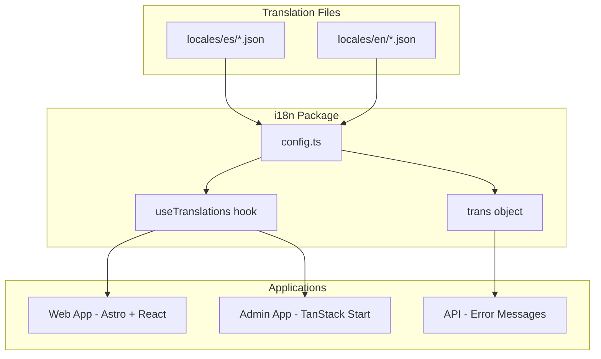

# Internationalization (i18n) Guide

## Overview

This guide covers adding and managing translations for the Hospeda platform. The i18n package (`@repo/i18n`) provides type-safe translations with React hooks and supports multiple languages across web, admin, and API applications.

**Current Languages**:

- **Spanish (es)** - Default locale
- **English (en)** - Planned for future

**What You'll Learn**:

- Adding new translations
- Using translations in React components
- Using translations in Astro pages
- Organizing translation files
- Adding a new language
- Translation best practices

## Quick Start

### Adding a New Translation

**Scenario**: Add a translation for the homepage hero section.

**Step 1: Identify Namespace**

Choose appropriate namespace based on content:

- `common` - Shared UI elements (buttons, labels)
- `nav` - Navigation items
- `home` - Homepage specific
- `accommodations` - Accommodation-related
- `auth-ui` - Authentication UI

**For homepage content, use `home` namespace**

**Step 2: Add to Translation File**

Edit `packages/i18n/src/locales/es/home.json`:

```json
{
  "hero": {
    "title": "Descubre Alojamientos Únicos",
    "subtitle": "En Concepción del Uruguay y el Litoral",
    "cta": "Explorar Alojamientos"
  }
}
```

**Step 3: Use in Component**

```tsx
// apps/web/src/components/Hero.tsx
import { useTranslations } from '@repo/i18n';

export function Hero() {
  const { t } = useTranslations();

  return (
    <section>
      <h1>{t('home.hero.title')}</h1>
      <p>{t('home.hero.subtitle')}</p>
      <button>{t('home.hero.cta')}</button>
    </section>
  );
}
```

**Done!** Your component now uses translations.

## System Overview

### Architecture



### Translation Files Structure

```text
packages/i18n/src/locales/
├── es/                          # Spanish (default)
│   ├── common.json              # Common UI elements
│   ├── nav.json                 # Navigation
│   ├── footer.json              # Footer content
│   ├── home.json                # Homepage
│   ├── accommodations.json      # Accommodations feature
│   ├── auth-ui.json             # Authentication UI
│   ├── error.json               # Error messages
│   ├── fields.json              # Form field labels
│   ├── admin-common.json        # Admin shared
│   ├── admin-dashboard.json     # Admin dashboard
│   └── ...                      # Other namespaces
└── en/                          # English (future)
    └── (same structure)
```

### Default Locale

**Spanish (es)** is the default locale:

```typescript
// packages/i18n/src/config.ts
export const defaultLocale = 'es' as const;
export const locales = ['es'] as const;
```

## Adding Translations

### Step-by-Step Process

**1. Identify the Right Namespace**

| Content Type | Namespace | Example Keys |
|-------------|-----------|--------------|
| Buttons, labels, common UI | `common` | `common.buttons.save` |
| Navigation items | `nav` | `nav.home`, `nav.about` |
| Footer links | `footer` | `footer.links.privacy` |
| Homepage content | `home` | `home.hero.title` |
| Accommodations | `accommodations` | `accommodations.details.amenities` |
| Authentication | `auth-ui` | `auth-ui.login.title` |
| Error messages | `error` | `error.notFound` |
| Form fields | `fields` | `fields.email`, `fields.password` |
| Admin dashboard | `admin-dashboard` | `admin-dashboard.stats.total` |

**2. Edit Translation File**

```bash
# Open appropriate namespace file
vim packages/i18n/src/locales/es/common.json
```

**3. Add Translation Keys**

Use nested structure with dot notation:

```json
{
  "buttons": {
    "save": "Guardar",
    "cancel": "Cancelar",
    "delete": "Eliminar",
    "edit": "Editar",
    "create": "Crear",
    "back": "Volver"
  },
  "messages": {
    "success": "Operación exitosa",
    "error": "Ocurrió un error",
    "loading": "Cargando...",
    "noResults": "No se encontraron resultados"
  },
  "actions": {
    "confirm": "Confirmar",
    "reject": "Rechazar",
    "approve": "Aprobar"
  }
}
```

**4. Restart Dev Server**

```bash
# Translation changes require server restart
pnpm dev
```

### Translation File Format

**Basic Structure**:

```json
{
  "section": {
    "subsection": {
      "key": "Translation text"
    }
  }
}
```

**Example**: `locales/es/accommodations.json`

```json
{
  "details": {
    "title": "Detalles del Alojamiento",
    "description": "Descripción",
    "amenities": "Comodidades",
    "location": "Ubicación",
    "pricing": {
      "perNight": "por noche",
      "total": "Total",
      "taxes": "Impuestos incluidos"
    }
  },
  "search": {
    "placeholder": "Buscar alojamientos...",
    "filters": {
      "city": "Ciudad",
      "priceRange": "Rango de precio",
      "guests": "Huéspedes"
    }
  },
  "booking": {
    "checkIn": "Fecha de entrada",
    "checkOut": "Fecha de salida",
    "guests": "Número de huéspedes",
    "book": "Reservar ahora"
  }
}
```

### Using Variables/Interpolation

**Translation with variables**:

```json
{
  "welcome": "Bienvenido, {name}!",
  "searchResults": "Encontramos {count} alojamientos en {city}",
  "bookingConfirmation": "Tu reserva para {accommodation} desde {checkIn} hasta {checkOut} ha sido confirmada"
}
```

**Usage in code**:

```tsx
import { useTranslations } from '@repo/i18n';

export function Welcome({ userName }: { userName: string }) {
  const { t } = useTranslations();

  return (
    <h1>{t('common.welcome', { name: userName })}</h1>
  );
}
// Output: "Bienvenido, María!"
```

**Multiple variables**:

```tsx
export function SearchResults({ count, city }: Props) {
  const { t } = useTranslations();

  return (
    <p>{t('accommodations.searchResults', { count, city })}</p>
  );
}
// Output: "Encontramos 15 alojamientos en Concepción del Uruguay"
```

### Pluralization

**Translation with pluralization**:

```json
{
  "items": {
    "zero": "No hay items",
    "one": "{count} item",
    "other": "{count} items"
  },
  "reviews": {
    "zero": "Sin reseñas",
    "one": "{count} reseña",
    "other": "{count} reseñas"
  }
}
```

**Usage**:

```tsx
function getReviewText(count: number): string {
  const { t } = useTranslations();

  if (count === 0) return t('accommodations.reviews.zero');
  if (count === 1) return t('accommodations.reviews.one', { count });
  return t('accommodations.reviews.other', { count });
}

getReviewText(0);  // "Sin reseñas"
getReviewText(1);  // "1 reseña"
getReviewText(5);  // "5 reseñas"
```

## Using Translations

### In React Components

**Using the Hook**:

```tsx
import { useTranslations } from '@repo/i18n';

export function MyComponent() {
  const { t, locale } = useTranslations();

  return (
    <div>
      <h1>{t('home.hero.title')}</h1>
      <p>Current locale: {locale}</p>
    </div>
  );
}
```

**Hook Returns**:

- `t(key, params?)` - Translation function
- `locale` - Current locale string ('es', 'en', etc.)

### In Astro Pages

**Server-side rendering**:

```astro
---
// apps/web/src/pages/index.astro
import { trans, defaultLocale } from '@repo/i18n';

const t = (key: string) => trans[defaultLocale][key];

const title = t('home.hero.title');
const subtitle = t('home.hero.subtitle');
---

<html>
  <head>
    <title>{title}</title>
  </head>
  <body>
    <h1>{title}</h1>
    <p>{subtitle}</p>
  </body>
</html>
```

**With variables**:

```astro
---
import { trans, defaultLocale } from '@repo/i18n';

function t(key: string, params?: Record<string, unknown>): string {
  const raw = trans[defaultLocale][key];

  if (!params) return raw;

  return Object.keys(params).reduce((acc, k) => {
    return acc.replace(new RegExp(`\\{${k}\\}`, 'g'), String(params[k]));
  }, raw);
}

const userName = 'María';
const welcome = t('common.welcome', { name: userName });
---

<h1>{welcome}</h1>
```

### In API Error Messages

**Use translation for consistent error messages**:

```typescript
// apps/api/src/routes/accommodations.ts
import { trans, defaultLocale } from '@repo/i18n';

app.get('/api/accommodations/:id', async (c) => {
  const { id } = c.req.param();

  const accommodation = await accommodationModel.findById(id);

  if (!accommodation) {
    return c.json({
      success: false,
      error: {
        code: 'NOT_FOUND',
        message: trans[defaultLocale]['error.accommodationNotFound'],
      },
    }, 404);
  }

  return c.json({ success: true, data: accommodation });
});
```

### In Form Validation

**Translated validation messages**:

```typescript
import { trans, defaultLocale } from '@repo/i18n';
import { z } from 'zod';

const t = (key: string) => trans[defaultLocale][key];

export const accommodationSchema = z.object({
  name: z.string().min(1, t('validation.nameRequired')),
  description: z.string().min(10, t('validation.descriptionTooShort')),
  email: z.string().email(t('validation.invalidEmail')),
  price: z.number().positive(t('validation.pricePositive')),
});
```

**Translation file** (`locales/es/validation.json`):

```json
{
  "nameRequired": "El nombre es obligatorio",
  "descriptionTooShort": "La descripción debe tener al menos 10 caracteres",
  "invalidEmail": "El correo electrónico no es válido",
  "pricePositive": "El precio debe ser mayor a 0"
}
```

## Translation Features

### Nested Keys

**Access nested translations**:

```json
{
  "nav": {
    "main": {
      "home": "Inicio",
      "about": "Acerca de",
      "contact": "Contacto"
    },
    "footer": {
      "privacy": "Política de Privacidad",
      "terms": "Términos y Condiciones"
    }
  }
}
```

**Usage**:

```tsx
t('nav.main.home');     // "Inicio"
t('nav.footer.privacy'); // "Política de Privacidad"
```

### Variable Interpolation

**Single variable**:

```json
{
  "greeting": "Hola, {name}!"
}
```

```tsx
t('greeting', { name: 'Juan' }); // "Hola, Juan!"
```

**Multiple variables**:

```json
{
  "bookingSummary": "Reserva para {guests} huéspedes desde {checkIn} hasta {checkOut}"
}
```

```tsx
t('bookingSummary', {
  guests: 2,
  checkIn: '15 Nov',
  checkOut: '20 Nov'
});
// "Reserva para 2 huéspedes desde 15 Nov hasta 20 Nov"
```

### Formatting (Dates, Numbers, Currency)

**Date Formatting**:

```tsx
import { useTranslations } from '@repo/i18n';

export function FormattedDate({ date }: { date: Date }) {
  const { locale } = useTranslations();

  const formatted = new Intl.DateTimeFormat(locale, {
    year: 'numeric',
    month: 'long',
    day: 'numeric',
  }).format(date);

  return <span>{formatted}</span>;
}

// Spanish: "15 de noviembre de 2024"
// English: "November 15, 2024"
```

**Number Formatting**:

```tsx
export function FormattedNumber({ value }: { value: number }) {
  const { locale } = useTranslations();

  const formatted = new Intl.NumberFormat(locale).format(value);

  return <span>{formatted}</span>;
}

// Spanish: "1.234,56"
// English: "1,234.56"
```

**Currency Formatting**:

```tsx
export function FormattedPrice({ amount }: { amount: number }) {
  const { locale } = useTranslations();

  const formatted = new Intl.NumberFormat(locale, {
    style: 'currency',
    currency: 'ARS', // Argentine Peso
  }).format(amount);

  return <span>{formatted}</span>;
}

// Spanish: "$ 1.234,50"
// English: "$1,234.50" (if using USD)
```

## Adding a New Language

### Complete Process

**Scenario**: Add Portuguese (pt) support

**Step 1: Add Locale to Configuration**

Edit `packages/i18n/src/config.ts`:

```typescript
// Before
export const locales = ['es'] as const;

// After
export const locales = ['es', 'pt'] as const;
```

**Step 2: Create Locale Directory**

```bash
mkdir -p packages/i18n/src/locales/pt
```

**Step 3: Copy and Translate Files**

```bash
# Copy all Spanish files as templates
cd packages/i18n/src/locales
cp -r es/* pt/
```

**Step 4: Translate Each File**

Edit each file in `locales/pt/`:

```json
// locales/pt/common.json
{
  "welcome": "Bem-vindo",
  "greeting": "Olá, {name}!",
  "buttons": {
    "save": "Salvar",
    "cancel": "Cancelar",
    "delete": "Excluir",
    "edit": "Editar"
  }
}
```

**Step 5: Import Translations**

Edit `packages/i18n/src/config.ts`:

```typescript
// Portuguese translations
import aboutPt from './locales/pt/about.json';
import commonPt from './locales/pt/common.json';
import accommodationsPt from './locales/pt/accommodations.json';
// ... import all namespaces

const rawTranslations = {
  es: {
    about: aboutEs,
    common: commonEs,
    accommodations: accommodationsEs,
    // ... all Spanish namespaces
  },
  pt: {
    about: aboutPt,
    common: commonPt,
    accommodations: accommodationsPt,
    // ... all Portuguese namespaces
  }
};
```

**Step 6: Test New Locale**

```tsx
// Test component
import { useTranslations } from '@repo/i18n';

export function TestLocale() {
  const { t, locale } = useTranslations('pt'); // Force Portuguese

  return (
    <div>
      <p>Locale: {locale}</p>
      <p>{t('common.welcome')}</p>
    </div>
  );
}
```

**Step 7: Add Language Switcher**

```tsx
import { useTranslations } from '@repo/i18n';

export function LanguageSwitcher() {
  const { locale, setLocale } = useTranslations();

  return (
    <select
      value={locale}
      onChange={(e) => setLocale(e.target.value as 'es' | 'pt')}
    >
      <option value="es">Español</option>
      <option value="pt">Português</option>
    </select>
  );
}
```

**Step 8: Test in Both Apps**

```bash
# Web app
cd apps/web
pnpm dev

# Admin app
cd apps/admin
pnpm dev

# Test all features in both languages
```

### Translation Checklist

- [ ] All JSON files created in new locale folder
- [ ] All keys translated (no missing translations)
- [ ] Variables/placeholders preserved (`{name}`, `{count}`)
- [ ] Pluralization rules updated for target language
- [ ] Date/number formats tested
- [ ] UI tested in both applications
- [ ] No hardcoded text remaining
- [ ] Documentation updated

## Best Practices

### 1. Keep Keys Consistent Across Locales

**✅ Good** - All locales have same keys:

```json
// locales/es/common.json
{
  "buttons": {
    "save": "Guardar",
    "cancel": "Cancelar"
  }
}

// locales/en/common.json
{
  "buttons": {
    "save": "Save",
    "cancel": "Cancel"
  }
}
```

**❌ Bad** - Different keys:

```json
// locales/es/common.json
{
  "botones": {
    "guardar": "Guardar"
  }
}

// locales/en/common.json
{
  "buttons": {
    "save": "Save"
  }
}
```

### 2. Use Semantic Key Names

**✅ Good** - Descriptive and meaningful:

```json
{
  "hero": {
    "title": "...",
    "subtitle": "...",
    "callToAction": "..."
  }
}
```

**❌ Bad** - Generic and unclear:

```json
{
  "text1": "...",
  "text2": "...",
  "btn": "..."
}
```

### 3. Avoid Hardcoded Text

**✅ Good** - All text translated:

```tsx
export function Button() {
  const { t } = useTranslations();
  return <button>{t('common.buttons.save')}</button>;
}
```

**❌ Bad** - Hardcoded Spanish text:

```tsx
export function Button() {
  return <button>Guardar</button>;
}
```

### 4. Use Variables for Dynamic Content

**✅ Good** - Single translation with variables:

```json
{
  "welcome": "Bienvenido, {name}!"
}
```

**❌ Bad** - Separate translations for each case:

```json
{
  "welcomeJuan": "Bienvenido, Juan!",
  "welcomeMaria": "Bienvenido, María!",
  "welcomePedro": "Bienvenido, Pedro!"
}
```

### 5. Organize by Feature/Page

**Good structure**:

```text
locales/es/
├── common.json           # Shared across app
├── nav.json              # Navigation
├── home.json             # Homepage
├── accommodations.json   # Accommodations feature
├── bookings.json         # Bookings feature
└── admin-dashboard.json  # Admin dashboard
```

**Poor structure**:

```text
locales/es/
├── all-translations.json  # Everything in one file (hard to maintain)
```

### 6. Keep Translations in Sync

**Use checklist** when adding translations:

- [ ] Added key to Spanish (es)
- [ ] Added same key to English (en) - if English supported
- [ ] Added same key to all other locales
- [ ] Verified all keys match across locales

**Tool to check** (run periodically):

```typescript
// scripts/check-translations.ts
import esCommon from '../packages/i18n/src/locales/es/common.json';
import enCommon from '../packages/i18n/src/locales/en/common.json';

function getKeys(obj: Record<string, unknown>, prefix = ''): string[] {
  return Object.keys(obj).flatMap((key) => {
    const value = obj[key];
    const newKey = prefix ? `${prefix}.${key}` : key;

    if (typeof value === 'object' && value !== null) {
      return getKeys(value as Record<string, unknown>, newKey);
    }

    return [newKey];
  });
}

const esKeys = getKeys(esCommon);
const enKeys = getKeys(enCommon);

const missingInEn = esKeys.filter((k) => !enKeys.includes(k));
const missingInEs = enKeys.filter((k) => !esKeys.includes(k));

if (missingInEn.length > 0) {
  console.log('Missing in EN:', missingInEn);
}

if (missingInEs.length > 0) {
  console.log('Missing in ES:', missingInEs);
}
```

### 7. Test All Locales

**Manual testing checklist**:

- [ ] Switch to each locale
- [ ] Navigate through all pages
- [ ] Test all forms
- [ ] Verify error messages
- [ ] Check date/number formatting
- [ ] Verify no `[MISSING: key]` warnings

**Automated testing**:

```typescript
import { describe, it, expect } from 'vitest';
import { trans } from '@repo/i18n';

describe('Translations', () => {
  it('should have all common keys in all locales', () => {
    const esKeys = Object.keys(trans.es.common);
    const enKeys = Object.keys(trans.en.common);

    expect(esKeys.sort()).toEqual(enKeys.sort());
  });

  it('should not have empty translations', () => {
    Object.values(trans.es).forEach((namespace) => {
      Object.values(namespace).forEach((value) => {
        expect(value).not.toBe('');
      });
    });
  });
});
```

### 8. Respect Locale Formats

**Dates**:

```tsx
// Automatic locale formatting
const formatter = new Intl.DateTimeFormat(locale, {
  year: 'numeric',
  month: 'long',
  day: 'numeric',
});

formatter.format(new Date());
// es: "15 de noviembre de 2024"
// en: "November 15, 2024"
```

**Numbers**:

```tsx
new Intl.NumberFormat(locale).format(1234.56);
// es: "1.234,56"
// en: "1,234.56"
```

**Currency**:

```tsx
new Intl.NumberFormat(locale, {
  style: 'currency',
  currency: 'ARS',
}).format(1299.99);
// es: "$ 1.299,99"
// en: "$1,299.99" (if locale supports ARS)
```

## Troubleshooting

### Issue 1: Missing Translation Key

**Symptom**: `[MISSING: key]` displayed in UI

**Causes**:

1. Key doesn't exist in translation file
2. Typo in key name
3. Translation file not imported
4. Server not restarted after adding translation

**Solutions**:

**Solution 1: Check key exists**

```bash
# Search for key in translation files
grep -r "welcome" packages/i18n/src/locales/es/
```

**Solution 2: Verify spelling**

```tsx
// Wrong
t('common.buttons.saev'); // Typo

// Correct
t('common.buttons.save');
```

**Solution 3: Restart dev server**

```bash
# Kill server (Ctrl+C)
# Restart
pnpm dev
```

### Issue 2: Variables Not Rendering

**Symptom**: Text shows `{name}` literally instead of variable value

**Causes**:

1. Not passing parameters to `t()` function
2. Parameter name mismatch
3. Variable not defined

**Solutions**:

**Solution 1: Pass parameters**

```tsx
// Wrong
t('common.welcome'); // Shows "Bienvenido, {name}!"

// Correct
t('common.welcome', { name: 'María' }); // Shows "Bienvenido, María!"
```

**Solution 2: Match parameter names**

```json
{
  "greeting": "Hello, {userName}!"
}
```

```tsx
// Wrong - parameter name doesn't match
t('greeting', { name: 'John' });

// Correct
t('greeting', { userName: 'John' });
```

### Issue 3: Locale Not Changing

**Symptom**: Language switcher doesn't change displayed language

**Causes**:

1. `setLocale` not implemented
2. State not persisting
3. Component not re-rendering

**Solutions**:

**Solution 1: Implement locale switching**

```tsx
import { create } from 'zustand';
import { persist } from 'zustand/middleware';

type LocaleStore = {
  locale: 'es' | 'en';
  setLocale: (locale: 'es' | 'en') => void;
};

export const useLocaleStore = create<LocaleStore>()(
  persist(
    (set) => ({
      locale: 'es',
      setLocale: (locale) => set({ locale }),
    }),
    {
      name: 'locale-storage',
    }
  )
);
```

**Solution 2: Force re-render**

```tsx
import { useLocaleStore } from './store';
import { useTranslations } from '@repo/i18n';

export function Component() {
  const { locale } = useLocaleStore();
  const { t } = useTranslations(locale); // Pass current locale

  return <div>{t('common.welcome')}</div>;
}
```

### Issue 4: Type Errors

**Symptom**: TypeScript errors about translation keys

**Solutions**:

**Solution 1: Generate types** (if implemented)

```bash
cd packages/i18n
pnpm generate-types
```

**Solution 2: Use string type**

```typescript
// If strict typing not set up
const key: string = 'common.welcome';
t(key);
```

## Related Documentation

- [i18n Package README](../../packages/i18n/README.md) - Package documentation
- [i18n Package CLAUDE.md](../../packages/i18n/CLAUDE.md) - Development guide
- [React Internationalization](https://react.dev/learn/scaling-up-with-reducer-and-context#moving-all-wiring-into-a-single-file) - React patterns
- [Intl API](https://developer.mozilla.org/en-US/docs/Web/JavaScript/Reference/Global_Objects/Intl) - Internationalization APIs

## Quick Reference

### Common Translation Keys

```text
common.*          - Common UI elements (buttons, labels, messages)
nav.*             - Navigation items
footer.*          - Footer content
home.*            - Homepage content
accommodations.*  - Accommodation-related translations
auth-ui.*         - Authentication UI
error.*           - Error messages
validation.*      - Validation messages
fields.*          - Form field labels
admin-*           - Admin dashboard translations
```

### Hook Usage

```tsx
import { useTranslations } from '@repo/i18n';

// In component
const { t, locale } = useTranslations();

// Basic translation
t('common.welcome');

// With variables
t('common.greeting', { name: 'María' });

// Current locale
console.log(locale); // 'es'
```

### Direct Access (Non-React)

```typescript
import { trans, defaultLocale } from '@repo/i18n';

// Get translation directly
const message = trans[defaultLocale]['common.welcome'];

// In functions
function translate(key: string): string {
  return trans[defaultLocale][key];
}
```

### File Locations

```text
Translation files: packages/i18n/src/locales/{locale}/{namespace}.json
Configuration:     packages/i18n/src/config.ts
React hook:        packages/i18n/src/hooks/useTranslations.ts
Type definitions:  packages/i18n/src/types.ts
```

---

**Last Updated**: 2025-11-06
**Maintained By**: Tech Writer Agent
