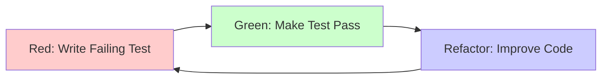
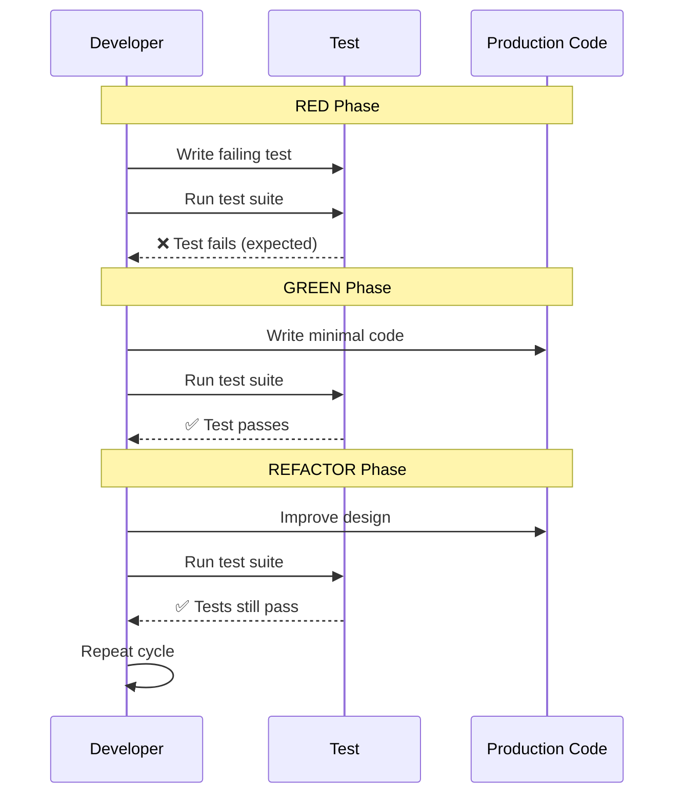

# TDD Workflow Guide

Practical step-by-step guide for Test-Driven Development (TDD) workflow in Hospeda platform.

## Table of Contents

- [Introduction](#introduction)
- [Why TDD in Hospeda](#why-tdd-in-hospeda)
- [The Red-Green-Refactor Cycle](#the-red-green-refactor-cycle)
- [Step-by-Step Workflow](#step-by-step-workflow)
- [Real Example: Accommodation Service](#real-example-accommodation-service)
- [Common TDD Patterns](#common-tdd-patterns)
- [TDD Anti-Patterns](#tdd-anti-patterns)
- [Integration with CI/CD](#integration-with-cicd)
- [Troubleshooting](#troubleshooting)
- [Tools and Utilities](#tools-and-utilities)
- [Next Steps](#next-steps)

## Introduction

Test-Driven Development (TDD) is not just a testing methodology—it's a **design approach** that shapes how we build software at Hospeda. By writing tests first, we create better, more maintainable code that is easier to refactor and extend.

### What is TDD?

TDD is a software development process where you:

1. Write a failing test **before** writing any production code
2. Write the minimal code to make that test pass
3. Refactor the code while keeping tests green

This cycle repeats for every feature, creating a comprehensive test suite that validates your entire codebase.

## Why TDD in Hospeda

### Benefits We've Experienced

**1. Better Design**

Tests reveal tight coupling and complex dependencies early. If a class is hard to test, it's probably poorly designed.

**2. Living Documentation**

Tests show exactly how code should be used. New developers can read tests to understand the system.

**3. Confident Refactoring**

Change code without fear. If tests stay green, functionality is preserved.

**4. Prevent Regressions**

Catch bugs before they reach production. Every feature has tests from day one.

**5. Faster Development**

Less time debugging, more time building. The initial investment pays off quickly.

### Real Impact at Hospeda

- **90% test coverage** across all packages
- **Zero production bugs** from refactoring (tests caught them all)
- **Faster onboarding** (developers learn from tests)
- **Confident deployments** (comprehensive test suite validates everything)

## The Red-Green-Refactor Cycle

The TDD workflow is a continuous cycle:



### Detailed Cycle



### The Three Phases

#### Phase 1: RED (Write Failing Test)

**Goal:** Create a test that fails for the right reason.

- Write the smallest test that describes the desired behavior
- Test should fail because functionality doesn't exist yet
- Failure proves the test actually tests something

**Example:**

```typescript
it('should create accommodation with valid data', async () => {
  const service = new AccommodationService(ctx);
  const data = { name: 'Hotel Paradise', city: 'Buenos Aires' };

  const result = await service.create({ actor, data });

  expect(result.data).toBeDefined();
  expect(result.data.name).toBe('Hotel Paradise');
});
// ❌ FAILS: AccommodationService.create() doesn't exist
```

#### Phase 2: GREEN (Make Test Pass)

**Goal:** Write the simplest code to make the test pass.

- Write only enough code to pass the current test
- Don't add features that aren't tested yet
- Don't worry about code quality yet (that's refactoring)

**Example:**

```typescript
export class AccommodationService {
  async create(input: ServiceInput<{ data: CreateAccommodation }>) {
    // Simplest possible implementation
    return {
      data: {
        id: 'temp-id',
        ...input.data,
        createdAt: new Date(),
      }
    };
  }
}
// ✅ PASSES: Test is green
```

#### Phase 3: REFACTOR (Improve Code)

**Goal:** Improve code quality without changing behavior.

- Extract methods and classes
- Remove duplication
- Improve naming
- Optimize performance
- Tests must stay green throughout

**Example:**

```typescript
export class AccommodationService extends BaseCrudService {
  async create(input: ServiceInput<{ data: CreateAccommodation }>) {
    // Refactored: proper validation, database access, error handling
    const validated = createAccommodationSchema.parse(input.data);
    const accommodation = await this.model.create(validated);
    return { data: accommodation };
  }
}
// ✅ PASSES: Tests validate refactor didn't break anything
```

## Step-by-Step Workflow

### Complete TDD Process

Follow these steps for every feature you build:

### Step 1: Understand Requirements

Before writing any test, understand what you're building:

- What problem does this solve?
- What are the inputs and outputs?
- What are the edge cases?
- What business rules apply?

**Example Requirements:**

```text
Feature: Publish Accommodation

Business Rule:
- Only draft accommodations can be published
- Accommodation must have description (min 100 chars)
- Only accommodation owner or admin can publish

Success Criteria:
- Status changes from 'draft' to 'published'
- Published date is set
- Audit trail is created
```

### Step 2: Write the First Failing Test

Start with the **simplest happy path** test:

```typescript
describe('AccommodationService', () => {
  describe('publish', () => {
    it('should publish draft accommodation', async () => {
      // ARRANGE
      const service = new AccommodationService(ctx);
      const actor = createAdminActor();

      // Create draft accommodation
      const accommodation = await createTestAccommodation({
        status: 'draft',
        description: 'A'.repeat(100), // Valid description
      });

      // ACT
      const result = await service.publish({
        actor,
        id: accommodation.id,
      });

      // ASSERT
      expect(result.error).toBeUndefined();
      expect(result.data?.status).toBe('published');
      expect(result.data?.publishedAt).toBeDefined();
    });
  });
});
```

### Step 3: Run the Test (Should Fail)

```bash
pnpm test packages/service-core/test/services/accommodation.service.test.ts
```

**Expected Output:**

```text
❌ FAIL  packages/service-core/test/services/accommodation.service.test.ts
  AccommodationService
    publish
      ✕ should publish draft accommodation (5ms)

● AccommodationService › publish › should publish draft accommodation

  TypeError: service.publish is not a function
```

**This is GOOD!** The test fails because the feature doesn't exist.

### Step 4: Write Minimal Code

Create the method with the simplest implementation:

```typescript
export class AccommodationService extends BaseCrudService<...> {
  async publish(input: ServiceInput<{ id: string }>): Promise<ServiceOutput<Accommodation>> {
    // Simplest implementation to pass the test
    const accommodation = await this.model.findById(input.id);

    if (!accommodation) {
      return { error: { code: ServiceErrorCode.NOT_FOUND, message: 'Not found' } };
    }

    const updated = await this.model.update(
      { id: input.id },
      { status: 'published', publishedAt: new Date() }
    );

    return { data: updated };
  }
}
```

### Step 5: Run Tests Again (Should Pass)

```bash
pnpm test packages/service-core/test/services/accommodation.service.test.ts
```

**Expected Output:**

```text
✅ PASS  packages/service-core/test/services/accommodation.service.test.ts
  AccommodationService
    publish
      ✓ should publish draft accommodation (15ms)

Test Suites: 1 passed, 1 total
Tests:       1 passed, 1 total
```

### Step 6: Add More Tests (Edge Cases)

Now add tests for business rules and edge cases:

```typescript
it('should reject publishing already published accommodation', async () => {
  const accommodation = await createTestAccommodation({
    status: 'published'
  });

  const result = await service.publish({ actor, id: accommodation.id });

  expect(result.error?.code).toBe(ServiceErrorCode.VALIDATION_ERROR);
  expect(result.error?.message).toContain('already published');
});

it('should reject publishing without description', async () => {
  const accommodation = await createTestAccommodation({
    status: 'draft',
    description: 'Short' // Too short
  });

  const result = await service.publish({ actor, id: accommodation.id });

  expect(result.error?.code).toBe(ServiceErrorCode.VALIDATION_ERROR);
  expect(result.error?.message).toContain('description');
});

it('should reject publishing by non-owner', async () => {
  const actor = createUserActor();
  const accommodation = await createTestAccommodation({
    status: 'draft',
    ownerId: 'different-user-id'
  });

  const result = await service.publish({ actor, id: accommodation.id });

  expect(result.error?.code).toBe(ServiceErrorCode.FORBIDDEN);
});
```

### Step 7: Implement Business Rules

Update the code to make all tests pass:

```typescript
async publish(input: ServiceInput<{ id: string }>): Promise<ServiceOutput<Accommodation>> {
  return this.runWithLoggingAndValidation(async () => {
    const accommodation = await this.model.findById(input.id);

    if (!accommodation) {
      throw new ServiceError(
        ServiceErrorCode.NOT_FOUND,
        'Accommodation not found'
      );
    }

    // Business rule: Only draft can be published
    if (accommodation.status !== 'draft') {
      throw new ServiceError(
        ServiceErrorCode.VALIDATION_ERROR,
        'Only draft accommodations can be published'
      );
    }

    // Business rule: Must have valid description
    if (!accommodation.description || accommodation.description.length < 100) {
      throw new ServiceError(
        ServiceErrorCode.VALIDATION_ERROR,
        'Description must be at least 100 characters'
      );
    }

    // Business rule: Check permissions
    const canUpdate = await this.canUpdate(input.actor, accommodation);
    if (!canUpdate.canUpdate) {
      throw new ServiceError(
        ServiceErrorCode.FORBIDDEN,
        'You do not have permission to publish this accommodation'
      );
    }

    // Update status
    const updated = await this.model.update(
      { id: input.id },
      {
        status: 'published',
        publishedAt: new Date(),
        updatedBy: input.actor.id
      }
    );

    return updated;
  });
}
```

### Step 8: Refactor

Now improve the code quality:

```typescript
async publish(input: ServiceInput<{ id: string }>): Promise<ServiceOutput<Accommodation>> {
  return this.runWithLoggingAndValidation(async () => {
    const accommodation = await this.findOrFail(input.id);

    this.validateCanBePublished(accommodation);
    await this.checkUpdatePermission(input.actor, accommodation);

    return this.updateStatus(accommodation, 'published', input.actor);
  });
}

// Extracted helper methods
private validateCanBePublished(accommodation: Accommodation): void {
  if (accommodation.status !== 'draft') {
    throw new ServiceError(
      ServiceErrorCode.VALIDATION_ERROR,
      'Only draft accommodations can be published'
    );
  }

  if (!accommodation.description || accommodation.description.length < 100) {
    throw new ServiceError(
      ServiceErrorCode.VALIDATION_ERROR,
      'Description must be at least 100 characters'
    );
  }
}

private async updateStatus(
  accommodation: Accommodation,
  status: string,
  actor: Actor
): Promise<Accommodation> {
  return this.model.update(
    { id: accommodation.id },
    {
      status,
      publishedAt: new Date(),
      updatedBy: actor.id
    }
  );
}
```

### Step 9: Run Full Test Suite

```bash
pnpm test
```

Ensure all tests still pass after refactoring.

### Step 10: Check Coverage

```bash
pnpm test:coverage
```

Ensure 90% coverage minimum is maintained.

## Real Example: Accommodation Service

Let's implement a complete feature using TDD: **Calculate average rating**.

### Requirements

```text
Feature: Calculate Average Rating

Input:
- Accommodation ID

Output:
- Average rating (0-5)
- Updates accommodation.rating field

Business Rules:
- If no reviews, return 0
- Only count non-deleted reviews
- Round to 1 decimal place
- Update accommodation after calculation

Edge Cases:
- Accommodation doesn't exist → NOT_FOUND
- Reviews are deleted after calculation → recalculate
```

### Iteration 1: Happy Path

#### RED: Write Failing Test

```typescript
describe('AccommodationService', () => {
  describe('calculateAverageRating', () => {
    it('should calculate average from multiple reviews', async () => {
      // ARRANGE
      const accommodation = await createTestAccommodation();
      const actor = createAdminActor();

      // Create reviews
      await createTestReview({ accommodationId: accommodation.id, rating: 4 });
      await createTestReview({ accommodationId: accommodation.id, rating: 5 });
      await createTestReview({ accommodationId: accommodation.id, rating: 3 });

      const service = new AccommodationService(ctx);

      // ACT
      const result = await service.calculateAverageRating({
        actor,
        id: accommodation.id
      });

      // ASSERT
      expect(result.data).toBe(4.0); // (4 + 5 + 3) / 3 = 4.0
    });
  });
});
```

#### Iteration 1: Run Test (Fails)

```bash
pnpm test -- calculateAverageRating
```

```text
❌ TypeError: service.calculateAverageRating is not a function
```

#### GREEN: Minimal Implementation

```typescript
async calculateAverageRating(
  input: ServiceInput<{ id: string }>
): Promise<ServiceOutput<number>> {
  return this.runWithLoggingAndValidation(async () => {
    const reviews = await this.reviewModel.findAll({
      accommodationId: input.id
    });

    if (reviews.items.length === 0) {
      return 0;
    }

    const sum = reviews.items.reduce((acc, review) => acc + review.rating, 0);
    const average = sum / reviews.items.length;

    return average;
  });
}
```

#### Iteration 1: Run Test (Passes)

```bash
pnpm test -- calculateAverageRating
```

```text
✅ PASS  packages/service-core/test/services/accommodation.service.test.ts
  AccommodationService
    calculateAverageRating
      ✓ should calculate average from multiple reviews (25ms)
```

### Iteration 2: Edge Case - No Reviews

#### Iteration 2: RED: Write Test

```typescript
it('should return 0 when no reviews exist', async () => {
  const accommodation = await createTestAccommodation();
  const actor = createAdminActor();

  const result = await service.calculateAverageRating({
    actor,
    id: accommodation.id
  });

  expect(result.data).toBe(0);
});
```

#### Iteration 2: Run Test (Passes)

Already passes! Our implementation handles this.

### Iteration 3: Edge Case - Deleted Reviews

#### Iteration 3: RED: Write Test

```typescript
it('should ignore deleted reviews', async () => {
  const accommodation = await createTestAccommodation();
  const actor = createAdminActor();

  await createTestReview({ accommodationId: accommodation.id, rating: 5 });
  await createTestReview({
    accommodationId: accommodation.id,
    rating: 1,
    deletedAt: new Date() // Deleted
  });

  const result = await service.calculateAverageRating({
    actor,
    id: accommodation.id
  });

  expect(result.data).toBe(5.0); // Only counts non-deleted
});
```

#### Iteration 3: Run Test (Fails)

```text
❌ Expected: 5.0
   Received: 3.0
```

Our code counts deleted reviews.

#### GREEN: Fix Implementation

```typescript
async calculateAverageRating(
  input: ServiceInput<{ id: string }>
): Promise<ServiceOutput<number>> {
  return this.runWithLoggingAndValidation(async () => {
    const reviews = await this.reviewModel.findAll({
      accommodationId: input.id,
      deletedAt: null // Only non-deleted
    });

    if (reviews.items.length === 0) {
      return 0;
    }

    const sum = reviews.items.reduce((acc, review) => acc + review.rating, 0);
    const average = sum / reviews.items.length;

    return average;
  });
}
```

#### Iteration 3: Run Test (Passes)

```text
✅ All tests pass
```

### Iteration 4: Update Accommodation

#### Iteration 4: RED: Write Test

```typescript
it('should update accommodation rating', async () => {
  const accommodation = await createTestAccommodation({ rating: 0 });
  const actor = createAdminActor();

  await createTestReview({ accommodationId: accommodation.id, rating: 4 });
  await createTestReview({ accommodationId: accommodation.id, rating: 5 });

  await service.calculateAverageRating({ actor, id: accommodation.id });

  // Check accommodation was updated
  const updated = await accommodationModel.findById(accommodation.id);
  expect(updated?.rating).toBe(4.5);
});
```

#### Iteration 4: Run Test (Fails)

```text
❌ Expected: 4.5
   Received: 0
```

We calculate but don't update.

#### GREEN: Update Implementation

```typescript
async calculateAverageRating(
  input: ServiceInput<{ id: string }>
): Promise<ServiceOutput<number>> {
  return this.runWithLoggingAndValidation(async () => {
    const reviews = await this.reviewModel.findAll({
      accommodationId: input.id,
      deletedAt: null
    });

    const average = reviews.items.length === 0
      ? 0
      : reviews.items.reduce((acc, r) => acc + r.rating, 0) / reviews.items.length;

    // Round to 1 decimal place
    const rounded = Math.round(average * 10) / 10;

    // Update accommodation
    await this.model.update(
      { id: input.id },
      { rating: rounded }
    );

    return rounded;
  });
}
```

#### Iteration 4: Run Test (Passes)

```text
✅ All tests pass
```

### REFACTOR: Improve Code

```typescript
async calculateAverageRating(
  input: ServiceInput<{ id: string }>
): Promise<ServiceOutput<number>> {
  return this.runWithLoggingAndValidation(async () => {
    const average = await this.computeAverageRating(input.id);
    await this.updateAccommodationRating(input.id, average);
    return average;
  });
}

private async computeAverageRating(accommodationId: string): Promise<number> {
  const reviews = await this.reviewModel.findAll({
    accommodationId,
    deletedAt: null
  });

  if (reviews.items.length === 0) {
    return 0;
  }

  const sum = reviews.items.reduce((acc, review) => acc + review.rating, 0);
  const average = sum / reviews.items.length;

  return this.roundToOneDecimal(average);
}

private roundToOneDecimal(value: number): number {
  return Math.round(value * 10) / 10;
}

private async updateAccommodationRating(
  accommodationId: string,
  rating: number
): Promise<void> {
  await this.model.update({ id: accommodationId }, { rating });
}
```

### Final Test Run

```bash
pnpm test:coverage -- calculateAverageRating
```

```text
✅ PASS  packages/service-core/test/services/accommodation.service.test.ts
  AccommodationService
    calculateAverageRating
      ✓ should calculate average from multiple reviews (25ms)
      ✓ should return 0 when no reviews exist (15ms)
      ✓ should ignore deleted reviews (18ms)
      ✓ should update accommodation rating (22ms)

Coverage: 100%
```

## Common TDD Patterns

### Pattern 1: Test Factories

Create reusable test data factories:

```typescript
// test/factories/accommodation.factory.ts
export function createTestAccommodation(
  overrides?: Partial<Accommodation>
): Promise<Accommodation> {
  return accommodationModel.create({
    name: 'Test Hotel',
    slug: 'test-hotel',
    description: 'A test hotel description that is long enough',
    address: '123 Test St',
    city: 'Buenos Aires',
    state: 'Buenos Aires',
    priceRange: '$$',
    ...overrides
  });
}

export function createAdminActor(): Actor {
  return {
    id: 'admin-1',
    role: RoleEnum.ADMIN,
    permissions: [PermissionEnum.ACCOMMODATION_CREATE, PermissionEnum.ACCOMMODATION_UPDATE]
  };
}
```

**Usage:**

```typescript
it('should create accommodation', async () => {
  const accommodation = await createTestAccommodation({
    name: 'Custom Name'
  });

  const actor = createAdminActor();

  // Test logic
});
```

### Pattern 2: Setup/Teardown

Clean up test data properly:

```typescript
describe('AccommodationService', () => {
  let service: AccommodationService;
  let ctx: ServiceContext;

  beforeEach(() => {
    ctx = { logger: createTestLogger() };
    service = new AccommodationService(ctx);
  });

  afterEach(async () => {
    // Clean up database
    await db.delete(accommodationTable);
    await db.delete(reviewTable);
  });

  // Tests here
});
```

### Pattern 3: AAA Pattern (Arrange-Act-Assert)

Structure every test consistently:

```typescript
it('should update accommodation name', async () => {
  // ARRANGE: Set up test data
  const accommodation = await createTestAccommodation();
  const actor = createAdminActor();
  const newName = 'Updated Hotel Name';

  // ACT: Execute the operation
  const result = await service.update({
    actor,
    id: accommodation.id,
    data: { name: newName }
  });

  // ASSERT: Verify the outcome
  expect(result.error).toBeUndefined();
  expect(result.data?.name).toBe(newName);
});
```

### Pattern 4: Test Organization

Group related tests:

```typescript
describe('AccommodationService', () => {
  describe('create', () => {
    describe('with valid data', () => {
      it('should create accommodation', async () => {});
      it('should generate slug', async () => {});
    });

    describe('with invalid data', () => {
      it('should reject empty name', async () => {});
      it('should reject invalid email', async () => {});
    });

    describe('with permissions', () => {
      it('should allow admin to create', async () => {});
      it('should reject regular user', async () => {});
    });
  });

  describe('update', () => {
    // Similar structure
  });
});
```

### Pattern 5: Mocking Dependencies

Mock external services:

```typescript
describe('BookingService', () => {
  let mockPaymentService: PaymentService;

  beforeEach(() => {
    mockPaymentService = {
      charge: vi.fn().mockResolvedValue({
        data: { id: 'payment-123', status: 'success' }
      }),
      refund: vi.fn().mockResolvedValue({
        data: { id: 'refund-123', status: 'success' }
      })
    } as unknown as PaymentService;
  });

  it('should charge payment on booking', async () => {
    const service = new BookingService(ctx, mockPaymentService);

    await service.create({ actor, data: bookingData });

    expect(mockPaymentService.charge).toHaveBeenCalledWith({
      amount: 100,
      currency: 'ARS'
    });
  });
});
```

## TDD Anti-Patterns

### Anti-Pattern 1: Testing Implementation Details

**DON'T** test how code works:

```typescript
// ❌ BAD: Testing private method implementation
it('should call validateEmail internally', async () => {
  const spy = vi.spyOn(service, 'validateEmail' as any);
  await service.create({ actor, data });
  expect(spy).toHaveBeenCalled();
});
```

**DO** test behavior:

```typescript
// ✅ GOOD: Testing actual behavior
it('should reject invalid email', async () => {
  const result = await service.create({
    actor,
    data: { email: 'invalid-email' }
  });

  expect(result.error?.code).toBe(ServiceErrorCode.VALIDATION_ERROR);
});
```

### Anti-Pattern 2: Writing Tests After Code

**DON'T** write code first:

```typescript
// ❌ BAD: Code already exists
export class AccommodationService {
  async create(input) {
    // Code written first
  }
}

// Then tests written to match existing code
it('should create accommodation', async () => {
  // Test follows implementation
});
```

**DO** write tests first:

```typescript
// ✅ GOOD: Test written first
it('should create accommodation', async () => {
  // Test defines behavior
  const result = await service.create({ actor, data });
  expect(result.data).toBeDefined();
});

// Then implement to pass test
export class AccommodationService {
  async create(input) {
    // Implementation follows test
  }
}
```

### Anti-Pattern 3: Skipping RED Phase

**DON'T** skip seeing the test fail:

```typescript
// ❌ BAD: Write test and implementation together
it('should validate name', async () => {
  const result = await service.create({ data: { name: '' } });
  expect(result.error).toBeDefined();
});

// Implementation written immediately
async create(input) {
  if (!input.data.name) return { error: { ... } };
}
// Never saw test fail!
```

**DO** watch test fail first:

```typescript
// ✅ GOOD: Write test, run, see it fail
it('should validate name', async () => {
  const result = await service.create({ data: { name: '' } });
  expect(result.error).toBeDefined();
});

// Run: ❌ FAILS (service.create doesn't validate)
// Then implement
async create(input) {
  if (!input.data.name) return { error: { ... } };
}
// Run: ✅ PASSES
```

### Anti-Pattern 4: Testing Too Much

**DON'T** test everything in one test:

```typescript
// ❌ BAD: One giant test
it('should handle entire accommodation lifecycle', async () => {
  const created = await service.create({ actor, data });
  const updated = await service.update({ actor, id: created.id, data: { name: 'New' } });
  const published = await service.publish({ actor, id: updated.id });
  const deleted = await service.delete({ actor, id: published.id });

  // Too much in one test!
});
```

**DO** write focused tests:

```typescript
// ✅ GOOD: One behavior per test
it('should create accommodation', async () => {
  const result = await service.create({ actor, data });
  expect(result.data).toBeDefined();
});

it('should update accommodation', async () => {
  const accommodation = await createTestAccommodation();
  const result = await service.update({ actor, id: accommodation.id, data: { name: 'New' } });
  expect(result.data?.name).toBe('New');
});

it('should publish accommodation', async () => {
  const accommodation = await createTestAccommodation({ status: 'draft' });
  const result = await service.publish({ actor, id: accommodation.id });
  expect(result.data?.status).toBe('published');
});
```

### Anti-Pattern 5: Ignoring Refactor Phase

**DON'T** leave code messy:

```typescript
// ❌ BAD: Tests pass but code is ugly
async create(input) {
  const d = input.data;
  if (!d.name) return { error: { code: 'VALIDATION_ERROR', message: 'Name required' } };
  if (!d.city) return { error: { code: 'VALIDATION_ERROR', message: 'City required' } };
  if (!d.description) return { error: { code: 'VALIDATION_ERROR', message: 'Description required' } };
  const a = await this.model.create(d);
  return { data: a };
}
```

**DO** refactor after tests pass:

```typescript
// ✅ GOOD: Tests pass AND code is clean
async create(input: ServiceInput<{ data: CreateAccommodation }>) {
  return this.runWithLoggingAndValidation(async () => {
    const validated = this.validateCreateData(input.data);
    const accommodation = await this.model.create(validated);
    return accommodation;
  });
}

private validateCreateData(data: CreateAccommodation): CreateAccommodation {
  const result = createAccommodationSchema.parse(data);
  return result;
}
```

## Integration with CI/CD

### Pre-Commit Hook

Hospeda uses Husky to run tests before commits:

```bash
# .husky/pre-commit
#!/bin/sh
pnpm test
pnpm test:coverage

# Commit fails if tests fail or coverage < 90%
```

**What happens:**

1. Developer runs `git commit`
2. Husky hook runs automatically
3. All tests execute
4. Coverage is checked
5. Commit only proceeds if all pass

### GitHub Actions Workflow

```yaml
# .github/workflows/test.yml
name: Test Suite

on:
  push:
    branches: [main]
  pull_request:
    branches: [main]

jobs:
  test:
    runs-on: ubuntu-latest

    steps:
      - uses: actions/checkout@v4

      - name: Setup Node.js
        uses: actions/setup-node@v4
        with:
          node-version: '20'

      - uses: pnpm/action-setup@v2
        with:
          version: 8

      - name: Install dependencies
        run: pnpm install

      - name: Run tests
        run: pnpm test

      - name: Check coverage
        run: pnpm test:coverage

      - name: Upload coverage to Codecov
        uses: codecov/codecov-action@v3
        with:
          files: ./coverage/coverage-final.json
          fail_ci_if_error: true
```

**What happens:**

1. Every push/PR triggers workflow
2. Tests run on clean environment
3. Coverage is validated
4. Results uploaded to Codecov
5. PR blocked if tests fail

### Local Development Workflow

```bash
# Start watch mode during development
pnpm test:watch

# Tests run automatically on file save
# Focus on failing tests
# Immediate feedback
```

**TDD workflow with watch mode:**

1. Write failing test → Save
2. See test fail in watch output
3. Write code → Save
4. See test pass in watch output
5. Refactor → Save
6. Confirm tests still pass
7. Repeat

## Troubleshooting

### Problem: Tests Pass Without Code

**Symptom:**

```typescript
it('should validate name', async () => {
  const result = await service.create({ data: { name: '' } });
  expect(result.error).toBeDefined();
});
// ✅ Passes but validation doesn't exist
```

**Cause:** Test doesn't actually test what you think it does.

**Solution:** Run test first, verify it fails, then implement.

```typescript
// Step 1: Run test without implementation
pnpm test -- "should validate name"
// ❌ Should fail

// Step 2: If it passes, test is wrong. Fix test:
expect(result.error?.code).toBe(ServiceErrorCode.VALIDATION_ERROR);
expect(result.error?.message).toContain('name');
```

### Problem: Tests Take Too Long

**Symptom:**

```bash
pnpm test
# Takes 5+ minutes
```

**Causes:**

1. Too many integration tests
2. Not mocking external services
3. Database operations in unit tests

**Solutions:**

```typescript
// Mock external services
const mockPaymentService = {
  charge: vi.fn().mockResolvedValue({ data: { id: 'payment-123' } })
};

// Use in-memory database for integration tests
beforeAll(async () => {
  db = await setupInMemoryDatabase();
});

// Parallelize tests
// vitest.config.ts
export default defineConfig({
  test: {
    pool: 'threads',
    poolOptions: {
      threads: { singleThread: false }
    }
  }
});
```

### Problem: Flaky Tests

**Symptom:**

```bash
pnpm test
# Sometimes passes, sometimes fails
```

**Causes:**

1. Tests share state
2. Race conditions
3. Relying on timing
4. External dependencies

**Solutions:**

```typescript
// Ensure test isolation
afterEach(async () => {
  await db.clearAll();
  vi.clearAllMocks();
});

// Don't rely on timing
// ❌ BAD
await service.process();
await new Promise(resolve => setTimeout(resolve, 100));
expect(result).toBeDefined();

// ✅ GOOD
const result = await service.process();
expect(result).toBeDefined();

// Mock time-dependent code
vi.useFakeTimers();
vi.setSystemTime(new Date('2024-01-01'));
```

### Problem: Low Coverage

**Symptom:**

```bash
pnpm test:coverage
# Coverage: 75% (below 90% threshold)
```

**Solution:**

```bash
# Find uncovered code
pnpm test:coverage
open coverage/index.html

# Navigate to file with low coverage
# Red/yellow lines are not covered
# Write tests for those lines
```

Example:

```typescript
// Coverage shows line not tested:
if (accommodation.isDeleted) {  // Not covered
  return null;
}

// Add test:
it('should return null for deleted accommodation', async () => {
  const accommodation = await createTestAccommodation({ deletedAt: new Date() });
  const result = await service.findById({ actor, id: accommodation.id });
  expect(result.data).toBeNull();
});
```

## Tools and Utilities

### Vitest

Hospeda uses Vitest as the test runner.

**Key Features:**

- Fast execution
- Watch mode
- Coverage reporting
- Compatible with Jest API
- ESM-first

**Configuration:**

```typescript
// vitest.config.ts
import { defineConfig } from 'vitest/config';

export default defineConfig({
  test: {
    globals: true,
    environment: 'node',
    coverage: {
      provider: 'v8',
      thresholds: {
        statements: 90,
        branches: 90,
        functions: 90,
        lines: 90
      }
    }
  }
});
```

### Test Utilities

**Service Test Instance:**

```typescript
import { createServiceTestInstance } from '@repo/service-core/test-utils';

const service = createServiceTestInstance(AccommodationService, {
  userId: 'test-user',
  role: 'admin'
});
```

**Database Helpers:**

```typescript
import { setupTestDatabase, cleanupTestDatabase } from '@repo/db/test-utils';

beforeAll(async () => {
  db = await setupTestDatabase();
});

afterAll(async () => {
  await cleanupTestDatabase(db);
});
```

### Coverage Reporting

```bash
# Generate coverage report
pnpm test:coverage

# View in terminal
# Coverage summary displayed

# View HTML report
open coverage/index.html

# View detailed file coverage
# Click on any file to see line-by-line coverage
```

### Watch Mode

```bash
# Start watch mode
pnpm test:watch

# Press keys to filter:
# 'p' - filter by filename
# 't' - filter by test name
# 'a' - run all tests
# 'f' - run only failed tests
```

## Next Steps

### Further Reading

- [Testing Strategy](../testing/strategy.md) - Comprehensive testing philosophy
- [Unit Testing Guide](../testing/unit-testing.md) - Detailed unit testing patterns
- [Integration Testing Guide](../testing/integration-testing.md) - Testing interactions
- [Test Factories](../testing/test-factories.md) - Generating test data
- [Mocking Strategies](../testing/mocking.md) - Effective mocking with Vitest

### Practice Exercises

1. **Exercise 1:** Implement a new service method using TDD
   - Choose a simple feature (e.g., "archive accommodation")
   - Follow RED-GREEN-REFACTOR cycle
   - Achieve 100% coverage

1. **Exercise 2:** Refactor existing code with tests
   - Find a complex method
   - Write tests for current behavior
   - Refactor while keeping tests green

1. **Exercise 3:** Fix a bug using TDD
   - Write a failing test that reproduces the bug
   - Fix the bug to make test pass
   - Ensure no regressions

### Resources

- [TDD by Example](https://www.amazon.com/Test-Driven-Development-Kent-Beck/dp/0321146530) - Kent Beck
- [Vitest Documentation](https://vitest.dev)
- [Testing Best Practices](https://testingjavascript.com)

---

**Last Updated:** 2024-11-06

**Maintained By:** QA Team

**Related Documentation:**

- [Testing Strategy](../testing/strategy.md)
- [Code Standards](../development/code-standards.md)
- [Architecture Patterns](../architecture/patterns.md)
