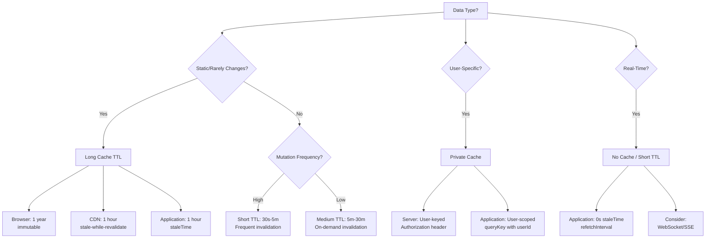

# Caching Strategies

## Overview

Hospeda implements a **5-layer caching strategy** for optimal performance:

1. **Browser Cache** - Static assets (Web app)
2. **CDN Cache** - Edge caching (Vercel)
3. **Server Cache** - API responses (Hono)
4. **Database Cache** - Query results (PostgreSQL)
5. **Application Cache** - Client state (TanStack Query)

**Cache Strategy Benefits**:

- **Reduced latency**: Serve content from nearest cache
- **Lower server load**: Fewer origin requests
- **Better user experience**: Faster page loads
- **Cost savings**: Reduced database queries and bandwidth

**Cache Hierarchy**:

```text
┌─────────────────────────────────────────────────────────┐
│ 1. Browser Cache (client-side)                         │
│    - Static assets: 1 year                             │
│    - HTML: no-cache (always revalidate)                │
└─────────────────────────────────────────────────────────┘
                         ↓
┌─────────────────────────────────────────────────────────┐
│ 2. CDN Cache (Vercel Edge)                             │
│    - ISR pages: 5 minutes                              │
│    - API responses: 5 minutes (stale-while-revalidate) │
└─────────────────────────────────────────────────────────┘
                         ↓
┌─────────────────────────────────────────────────────────┐
│ 3. Server Cache (Hono middleware)                      │
│    - Public endpoints: 5 minutes                       │
│    - Private endpoints: user-specific                  │
└─────────────────────────────────────────────────────────┘
                         ↓
┌─────────────────────────────────────────────────────────┐
│ 4. Database Cache (PostgreSQL)                         │
│    - Shared buffers: automatic                         │
│    - Query plans: prepared statements                  │
│    - Materialized views: hourly refresh                │
└─────────────────────────────────────────────────────────┘
                         ↓
┌─────────────────────────────────────────────────────────┐
│ 5. Application Cache (TanStack Query)                  │
│    - Static data: 1 hour staleTime                     │
│    - Dynamic data: 30 seconds staleTime                │
│    - Real-time data: 0 seconds (always refetch)        │
└─────────────────────────────────────────────────────────┘
```

## 1. Browser Cache

### Static Assets Caching

**Vercel Configuration** (`vercel.json`):

```json
{
  "headers": [
    {
      "source": "/assets/(.*)",
      "headers": [
        {
          "key": "Cache-Control",
          "value": "public, max-age=31536000, immutable"
        }
      ]
    },
    {
      "source": "/(.*)\\.css",
      "headers": [
        {
          "key": "Cache-Control",
          "value": "public, max-age=31536000, immutable"
        }
      ]
    },
    {
      "source": "/(.*)\\.js",
      "headers": [
        {
          "key": "Cache-Control",
          "value": "public, max-age=31536000, immutable"
        }
      ]
    },
    {
      "source": "/fonts/(.*)",
      "headers": [
        {
          "key": "Cache-Control",
          "value": "public, max-age=31536000, immutable"
        }
      ]
    },
    {
      "source": "/images/(.*)",
      "headers": [
        {
          "key": "Cache-Control",
          "value": "public, max-age=2592000"
        }
      ]
    }
  ]
}
```

**Astro Configuration** (`astro.config.mjs`):

```javascript
import { defineConfig } from 'astro/config';
import react from '@astrojs/react';
import vercel from '@astrojs/vercel/serverless';

export default defineConfig({
  output: 'hybrid',
  adapter: vercel(),
  integrations: [react()],
  vite: {
    build: {
      rollupOptions: {
        output: {
          // Content-hashed filenames for long-term caching
          entryFileNames: 'assets/[name].[hash].js',
          chunkFileNames: 'assets/[name].[hash].js',
          assetFileNames: 'assets/[name].[hash][extname]'
        }
      }
    }
  }
});
```

### Cache-Control Headers

| Resource Type | Cache-Control | Duration | Rationale |
|---------------|---------------|----------|-----------|
| HTML | `no-cache` | 0s (always revalidate) | Dynamic content, always fresh |
| JS/CSS (hashed) | `public, max-age=31536000, immutable` | 1 year | Content-hashed, never changes |
| Images | `public, max-age=2592000` | 30 days | Rarely change, but not immutable |
| Fonts | `public, max-age=31536000, immutable` | 1 year | Never change once deployed |
| API responses | `public, max-age=300, s-maxage=300` | 5 minutes | Balance freshness and performance |

**Cache-Control Directives**:

- `public`: Can be cached by any cache (browser, CDN, proxy)
- `private`: Only browser can cache (not CDN)
- `max-age=N`: Cache for N seconds in browser
- `s-maxage=N`: Cache for N seconds in shared caches (CDN)
- `immutable`: Resource never changes (skip revalidation)
- `no-cache`: Revalidate before use (not "don't cache")
- `no-store`: Never cache (sensitive data)
- `stale-while-revalidate=N`: Serve stale for N seconds while revalidating
- `stale-if-error=N`: Serve stale if origin error for N seconds

### Service Worker (Optional)

For offline support and advanced caching:

```typescript
// public/sw.js
const CACHE_NAME = 'hospeda-v1';
const STATIC_ASSETS = [
  '/',
  '/offline.html',
  '/styles/critical.css',
  '/images/logo.svg'
];

// Install event - cache static assets
self.addEventListener('install', (event) => {
  event.waitUntil(
    caches.open(CACHE_NAME).then((cache) => {
      console.log('Caching static assets');
      return cache.addAll(STATIC_ASSETS);
    })
  );

  // Force activation
  self.skipWaiting();
});

// Activate event - cleanup old caches
self.addEventListener('activate', (event) => {
  event.waitUntil(
    caches.keys().then((cacheNames) => {
      return Promise.all(
        cacheNames
          .filter((name) => name !== CACHE_NAME)
          .map((name) => caches.delete(name))
      );
    })
  );

  // Take control immediately
  self.clients.claim();
});

// Fetch event - serve from cache, fallback to network
self.addEventListener('fetch', (event) => {
  const { request } = event;

  // Skip non-GET requests
  if (request.method !== 'GET') return;

  // Network first for HTML
  if (request.headers.get('accept')?.includes('text/html')) {
    event.respondWith(
      fetch(request)
        .then((response) => {
          // Cache the response
          const responseClone = response.clone();
          caches.open(CACHE_NAME).then((cache) => {
            cache.put(request, responseClone);
          });
          return response;
        })
        .catch(() => {
          // Fallback to cache, then offline page
          return caches.match(request).then((cached) => {
            return cached || caches.match('/offline.html');
          });
        })
    );
    return;
  }

  // Cache first for static assets
  event.respondWith(
    caches.match(request).then((cached) => {
      if (cached) return cached;

      return fetch(request).then((response) => {
        // Cache the response
        if (response.status === 200) {
          const responseClone = response.clone();
          caches.open(CACHE_NAME).then((cache) => {
            cache.put(request, responseClone);
          });
        }
        return response;
      });
    })
  );
});
```

**Register Service Worker**:

```typescript
// src/utils/register-sw.ts
export async function registerServiceWorker() {
  if (!('serviceWorker' in navigator)) {
    console.log('Service workers not supported');
    return;
  }

  try {
    const registration = await navigator.serviceWorker.register('/sw.js');
    console.log('Service worker registered:', registration.scope);

    // Update on new version
    registration.addEventListener('updatefound', () => {
      const newWorker = registration.installing;
      newWorker?.addEventListener('statechange', () => {
        if (newWorker.state === 'installed' && navigator.serviceWorker.controller) {
          console.log('New version available, refresh to update');
          // Show update notification to user
        }
      });
    });
  } catch (error) {
    console.error('Service worker registration failed:', error);
  }
}
```

**Inject in Layout**:

```astro
---
// src/layouts/Layout.astro
---
<html>
  <body>
    <slot />

    <script>
      import { registerServiceWorker } from '@/utils/register-sw';

      // Register service worker in production only
      if (import.meta.env.PROD) {
        registerServiceWorker();
      }
    </script>
  </body>
</html>
```

## 2. CDN Cache (Vercel Edge)

### ISR (Incremental Static Regeneration)

**Astro Pages** with ISR:

```astro
---
// src/pages/accommodations/[id].astro
import { getAccommodations, getAccommodation } from '@/services/accommodations';
import Layout from '@/layouts/Layout.astro';

export const prerender = true;

export async function getStaticPaths() {
  const accommodations = await getAccommodations();

  return accommodations.map((acc) => ({
    params: { id: acc.id },
    props: { accommodation: acc },
  }));
}

const { accommodation } = Astro.props;
---

<Layout title={accommodation.name}>
  <article>
    <h1>{accommodation.name}</h1>
    <p>{accommodation.description}</p>
    
  </article>
</Layout>
```

**Vercel Configuration** for ISR:

```json
{
  "builds": [
    {
      "src": "package.json",
      "use": "@vercel/static-build",
      "config": {
        "distDir": "dist"
      }
    }
  ],
  "routes": [
    {
      "src": "/accommodations/(.*)",
      "headers": {
        "Cache-Control": "s-maxage=300, stale-while-revalidate=600"
      }
    },
    {
      "src": "/api/(.*)",
      "headers": {
        "Cache-Control": "s-maxage=60, stale-while-revalidate=120"
      }
    }
  ]
}
```

**On-Demand Revalidation**:

```typescript
// apps/api/src/routes/accommodations.ts
import { revalidate } from '@vercel/edge';

export const updateAccommodationRoute = createOpenApiRoute({
  method: 'put',
  path: '/accommodations/:id',
  handler: async (c, params, body) => {
    const { id } = params;

    // Update database
    await db.update(accommodationTable)
      .set(body)
      .where(eq(accommodationTable.id, id));

    // Revalidate ISR page
    if (process.env.VERCEL_REVALIDATE_TOKEN) {
      await fetch(
        `https://hospeda.com/api/revalidate?path=/accommodations/${id}`,
        {
          headers: {
            'x-revalidate-token': process.env.VERCEL_REVALIDATE_TOKEN
          }
        }
      );
    }

    return { success: true };
  }
});
```

### Edge Functions

Cache API responses at the edge:

```typescript
// api/accommodations/[id].ts
import type { VercelRequest, VercelResponse } from '@vercel/node';

export const config = {
  runtime: 'edge',
};

export default async function handler(req: VercelRequest, res: VercelResponse) {
  const { id } = req.query;

  try {
    const accommodation = await fetchAccommodation(id as string);

    // Cache for 5 minutes, serve stale for 10 minutes
    res.setHeader(
      'Cache-Control',
      's-maxage=300, stale-while-revalidate=600'
    );

    res.json(accommodation);
  } catch (error) {
    res.status(500).json({ error: 'Failed to fetch accommodation' });
  }
}
```

### Cache Purging

**Manual Purge** via Vercel API:

```bash
# Purge all cache
curl -X DELETE "https://api.vercel.com/v1/purge" \
  -H "Authorization: Bearer <VERCEL_TOKEN>" \
  -H "Content-Type: application/json" \
  -d '{"all": true}'

# Purge specific URL
curl -X DELETE "https://api.vercel.com/v1/purge" \
  -H "Authorization: Bearer <VERCEL_TOKEN>" \
  -H "Content-Type: application/json" \
  -d '{"urls": ["https://hospeda.com/accommodations/123"]}'
```

**Programmatic Purge** (on data update):

```typescript
// packages/utils/src/cache/vercel.ts
export async function purgeVercelCache(urls: string[]) {
  const token = process.env.VERCEL_PURGE_TOKEN;

  if (!token) {
    console.warn('VERCEL_PURGE_TOKEN not set, skipping cache purge');
    return;
  }

  try {
    const response = await fetch('https://api.vercel.com/v1/purge', {
      method: 'DELETE',
      headers: {
        'Authorization': `Bearer ${token}`,
        'Content-Type': 'application/json'
      },
      body: JSON.stringify({ urls })
    });

    if (!response.ok) {
      throw new Error(`Vercel cache purge failed: ${response.statusText}`);
    }

    console.log(`Purged ${urls.length} URLs from Vercel cache`);
  } catch (error) {
    console.error('Failed to purge Vercel cache:', error);
  }
}
```

**Use in mutation**:

```typescript
async function updateAccommodation(id: string, data: UpdateData) {
  // Update database
  await db.update(accommodationTable)
    .set(data)
    .where(eq(accommodationTable.id, id));

  // Purge CDN cache
  await purgeVercelCache([
    `https://hospeda.com/accommodations/${id}`,
    'https://hospeda.com/accommodations'
  ]);
}
```

## 3. Server Cache (Hono API)

### Cache Middleware

**Implementation** (`apps/api/src/middlewares/cache.ts`):

```typescript
import { cache } from 'hono/cache';
import { getCacheConfig } from '../utils/env';
import type { Context, Next } from 'hono';

export const createCacheMiddleware = () => {
  const cacheConfig = getCacheConfig();

  if (!cacheConfig.enabled) {
    console.log('Cache middleware disabled');
    return async (_c: Context, next: Next) => {
      await next();
    };
  }

  console.log('Cache middleware enabled', {
    maxAge: cacheConfig.maxAge,
    staleWhileRevalidate: cacheConfig.staleWhileRevalidate
  });

  return cache({
    cacheName: 'hospeda-api',
    cacheControl: `public, max-age=${cacheConfig.maxAge}, stale-while-revalidate=${cacheConfig.staleWhileRevalidate}`,
    vary: ['Accept-Encoding', 'Accept-Language'],
    keyGenerator: (c) => {
      const path = c.req.path;

      // Check endpoint type
      const isPublic = cacheConfig.publicEndpoints.some(e => path.startsWith(e));
      const isPrivate = cacheConfig.privateEndpoints.some(e => path.startsWith(e));
      const isNoCache = cacheConfig.noCacheEndpoints.some(e => path.startsWith(e));

      // No cache for specified endpoints
      if (isNoCache) {
        return `${path}-${Date.now()}`;
      }

      // Public cache (same for all users)
      if (isPublic) {
        const queryString = c.req.url.split('?')[1] || '';
        return `public-${path}-${queryString}`;
      }

      // Private cache (user-specific)
      if (isPrivate) {
        const userId = c.req.header('Authorization') || 'anonymous';
        return `private-${path}-${userId}`;
      }

      // Default: no cache
      return `${path}-${Date.now()}`;
    },
    cacheableStatusCodes: [200, 404]
  });
};
```

### Cache Configuration

**Environment Variables**:

```env
# Cache Configuration
CACHE_ENABLED=true
CACHE_MAX_AGE=300
CACHE_STALE_WHILE_REVALIDATE=600
CACHE_STALE_IF_ERROR=86400

# Public endpoints (cacheable for all users)
CACHE_PUBLIC_ENDPOINTS=/api/v1/accommodations,/api/v1/destinations,/api/v1/events,/api/v1/amenities

# Private endpoints (user-specific cache)
CACHE_PRIVATE_ENDPOINTS=/api/v1/user/bookings,/api/v1/user/favorites,/api/v1/user/profile

# No cache endpoints (always fresh)
CACHE_NO_CACHE_ENDPOINTS=/api/v1/auth,/api/v1/webhooks,/api/v1/payments
```

**Configuration Parser** (`apps/api/src/utils/env.ts`):

```typescript
export interface CacheConfig {
  enabled: boolean;
  maxAge: number;
  staleWhileRevalidate: number;
  staleIfError: number;
  publicEndpoints: string[];
  privateEndpoints: string[];
  noCacheEndpoints: string[];
}

export function getCacheConfig(): CacheConfig {
  return {
    enabled: process.env.CACHE_ENABLED === 'true',
    maxAge: parseInt(process.env.CACHE_MAX_AGE || '300', 10),
    staleWhileRevalidate: parseInt(
      process.env.CACHE_STALE_WHILE_REVALIDATE || '600',
      10
    ),
    staleIfError: parseInt(
      process.env.CACHE_STALE_IF_ERROR || '86400',
      10
    ),
    publicEndpoints: (process.env.CACHE_PUBLIC_ENDPOINTS || '')
      .split(',')
      .filter(Boolean),
    privateEndpoints: (process.env.CACHE_PRIVATE_ENDPOINTS || '')
      .split(',')
      .filter(Boolean),
    noCacheEndpoints: (process.env.CACHE_NO_CACHE_ENDPOINTS || '')
      .split(',')
      .filter(Boolean)
  };
}
```

### Route-Level Cache Control

**Override cache per route**:

```typescript
import { createOpenApiRoute } from '../../utils/route-factory';
import { z } from 'zod';

export const listAccommodationsRoute = createOpenApiRoute({
  method: 'get',
  path: '/accommodations',
  summary: 'List accommodations',
  tags: ['Accommodations'],
  responseSchema: z.array(accommodationSchema),
  handler: async (c) => {
    const accommodations = await db.select().from(accommodationTable);

    // Set custom cache header (override middleware)
    c.header('Cache-Control', 'public, max-age=600, s-maxage=1200');

    return accommodations;
  },
  options: {
    skipAuth: true,
    cacheTTL: 600 // 10 minutes
  }
});
```

**Dynamic Cache TTL**:

```typescript
export const getAccommodationRoute = createOpenApiRoute({
  method: 'get',
  path: '/accommodations/:id',
  handler: async (c, params) => {
    const { id } = params;
    const accommodation = await fetchAccommodation(id);

    // Featured accommodations: longer cache
    if (accommodation.featured) {
      c.header('Cache-Control', 'public, max-age=3600'); // 1 hour
    } else {
      c.header('Cache-Control', 'public, max-age=300'); // 5 minutes
    }

    return accommodation;
  }
});
```

### Cache Invalidation

**On Data Mutation**:

```typescript
import { invalidateCache } from '../utils/cache';

export const updateAccommodationRoute = createOpenApiRoute({
  method: 'put',
  path: '/accommodations/:id',
  handler: async (c, params, body) => {
    const { id } = params;

    // Update database
    const [updated] = await db.update(accommodationTable)
      .set(body)
      .where(eq(accommodationTable.id, id))
      .returning();

    // Invalidate cache
    await invalidateCache([
      `/api/v1/accommodations/${id}`,
      '/api/v1/accommodations'
    ]);

    return { success: true, data: updated };
  }
});
```

**Cache Invalidation Utility** (`apps/api/src/utils/cache.ts`):

```typescript
import { purgeVercelCache } from '@repo/utils/cache/vercel';

const cacheInvalidationLog = new Map<string, number>();

export async function invalidateCache(paths: string[]) {
  const timestamp = Date.now();

  // Log invalidations
  for (const path of paths) {
    cacheInvalidationLog.set(path, timestamp);
  }

  // Purge Vercel CDN cache
  await purgeVercelCache(
    paths.map(p => `https://hospeda.com${p}`)
  );

  console.log(`Invalidated ${paths.length} cache entries`);
}

export function getCacheInvalidationLog() {
  return Array.from(cacheInvalidationLog.entries()).map(([path, timestamp]) => ({
    path,
    timestamp,
    age: Date.now() - timestamp
  }));
}
```

## 4. Database Cache (PostgreSQL)

### Query Result Cache

**PostgreSQL Shared Buffers**:

```sql
-- Check current shared_buffers setting
SHOW shared_buffers;

-- Set shared_buffers (requires restart)
ALTER SYSTEM SET shared_buffers = '256MB';

-- Reload configuration
SELECT pg_reload_conf();
```

**Neon Configuration** (managed):

- Shared buffers: Auto-scaled based on plan
- Query cache: Enabled by default
- Connection pooling: PgBouncer built-in

### Prepared Statements

**Query Plan Cache**:

```sql
-- Prepared statements are cached automatically
PREPARE get_accommodation (text) AS
SELECT * FROM accommodations WHERE id = $1;

-- Execute multiple times (uses cached plan after 5th execution)
EXECUTE get_accommodation('acc-123');
EXECUTE get_accommodation('acc-456');
EXECUTE get_accommodation('acc-789');
```

**Drizzle Prepared Statements**:

```typescript
// packages/db/src/models/accommodation.model.ts
import { db } from '../client';
import { accommodationTable } from '../schemas/accommodation.schema';
import { eq } from 'drizzle-orm';

export class AccommodationModel extends BaseModel<Accommodation> {
  // Prepared statement for frequent queries
  private getByIdPrepared = db
    .select()
    .from(accommodationTable)
    .where(eq(accommodationTable.id, sql.placeholder('id')))
    .prepare('get_accommodation_by_id');

  async findById(id: string): Promise<Accommodation | null> {
    const [result] = await this.getByIdPrepared.execute({ id });
    return result || null;
  }
}
```

### pg_stat_statements

Enable query statistics caching:

```sql
-- Enable extension
CREATE EXTENSION IF NOT EXISTS pg_stat_statements;

-- View cached query stats
SELECT
  query,
  calls,
  mean_exec_time,
  max_exec_time,
  stddev_exec_time,
  rows
FROM pg_stat_statements
WHERE query NOT LIKE '%pg_stat_statements%'
ORDER BY calls DESC
LIMIT 10;

-- Reset statistics
SELECT pg_stat_statements_reset();
```

**Monitor Cache Hit Rate**:

```sql
SELECT
  sum(blks_hit) as cache_hits,
  sum(blks_read) as disk_reads,
  sum(blks_hit) / nullif(sum(blks_hit) + sum(blks_read), 0) as hit_rate
FROM pg_stat_database
WHERE datname = current_database();
```

Target: **> 99% cache hit rate**

### Materialized Views

Cache complex aggregations:

```sql
-- Create materialized view
CREATE MATERIALIZED VIEW accommodation_stats AS
SELECT
  d.id as destination_id,
  d.name as destination_name,
  COUNT(a.id) as total_accommodations,
  AVG(a.rating) as avg_rating,
  MIN(a.price_per_night) as min_price,
  MAX(a.price_per_night) as max_price
FROM destinations d
LEFT JOIN accommodations a ON a.destination_id = d.id
WHERE a.status = 'active'
GROUP BY d.id, d.name;

-- Create index on materialized view
CREATE INDEX idx_accommodation_stats_destination
ON accommodation_stats(destination_id);

-- Refresh materialized view (concurrently, doesn't lock reads)
REFRESH MATERIALIZED VIEW CONCURRENTLY accommodation_stats;
```

**Query the cached view**:

```typescript
// Fast aggregated query (no joins or aggregations at runtime)
const stats = await db.execute(sql`
  SELECT * FROM accommodation_stats
  WHERE destination_id = ${destinationId}
`);
```

**Automated Refresh** (cron job):

```bash
#!/bin/bash
# scripts/refresh-materialized-views.sh

# Refresh every hour
psql $DATABASE_URL -c "REFRESH MATERIALIZED VIEW CONCURRENTLY accommodation_stats;"

echo "Materialized views refreshed at $(date)"
```

**Cron Schedule**:

```cron
# Refresh every hour
0 * * * * /app/scripts/refresh-materialized-views.sh
```

### Connection Pooling Cache

**PgBouncer** caches connections:

```ini
# pgbouncer.ini
[databases]
hospeda = host=neon.tech port=5432 dbname=hospeda

[pgbouncer]
# Pool mode: transaction-level pooling (best for serverless)
pool_mode = transaction

# Connection limits
max_client_conn = 100
default_pool_size = 20
reserve_pool_size = 5

# Timeouts
server_idle_timeout = 600
server_lifetime = 3600
```

**Drizzle with Connection Pooling**:

```typescript
// packages/db/src/client.ts
import { drizzle } from 'drizzle-orm/neon-http';
import { neon } from '@neondatabase/serverless';

// Neon serverless driver (uses connection pooling automatically)
const sql = neon(process.env.DATABASE_URL!, {
  fetchOptions: {
    cache: 'no-store', // Disable HTTP cache for dynamic queries
  },
});

export const db = drizzle(sql);
```

## 5. Application Cache (TanStack Query)

### Query Cache Configuration

**Global Setup** (`apps/admin/src/lib/query.ts`):

```typescript
import { QueryClient } from '@tanstack/react-query';

export const queryClient = new QueryClient({
  defaultOptions: {
    queries: {
      // How long data is considered fresh
      staleTime: 5 * 60 * 1000, // 5 minutes

      // How long inactive data stays in cache
      gcTime: 10 * 60 * 1000,   // 10 minutes (formerly cacheTime)

      // Retry failed requests
      retry: 1,

      // Refetch behavior
      refetchOnWindowFocus: false,
      refetchOnReconnect: true,
      refetchOnMount: true,
    },
    mutations: {
      // Retry failed mutations
      retry: 1,
    },
  },
});
```

**Setup in App**:

```tsx
// apps/admin/src/app.tsx
import { QueryClientProvider } from '@tanstack/react-query';
import { ReactQueryDevtools } from '@tanstack/react-query-devtools';
import { queryClient } from '@/lib/query';

export function App() {
  return (
    <QueryClientProvider client={queryClient}>
      <RouterProvider router={router} />

      {/* DevTools in development */}
      {import.meta.env.DEV && (
        <ReactQueryDevtools initialIsOpen={false} />
      )}
    </QueryClientProvider>
  );
}
```

### Per-Query Cache Strategy

**Static Data** (rarely changes):

```typescript
import { useQuery } from '@tanstack/react-query';

// Destinations (rarely change)
const { data: destinations } = useQuery({
  queryKey: ['destinations'],
  queryFn: fetchDestinations,
  staleTime: 60 * 60 * 1000, // 1 hour
  gcTime: 24 * 60 * 60 * 1000, // 24 hours
});

// Amenities (rarely change)
const { data: amenities } = useQuery({
  queryKey: ['amenities'],
  queryFn: fetchAmenities,
  staleTime: 60 * 60 * 1000, // 1 hour
  gcTime: 24 * 60 * 60 * 1000, // 24 hours
});
```

**Dynamic Data** (changes often):

```typescript
// Bookings (change frequently)
const { data: bookings } = useQuery({
  queryKey: ['bookings', userId],
  queryFn: () => fetchBookings(userId),
  staleTime: 30 * 1000, // 30 seconds
  gcTime: 5 * 60 * 1000, // 5 minutes
});

// Accommodation availability (changes often)
const { data: availability } = useQuery({
  queryKey: ['availability', accommodationId, dateRange],
  queryFn: () => fetchAvailability(accommodationId, dateRange),
  staleTime: 60 * 1000, // 1 minute
  gcTime: 5 * 60 * 1000, // 5 minutes
});
```

**Real-Time Data** (always fresh):

```typescript
// Notifications (real-time)
const { data: notifications } = useQuery({
  queryKey: ['notifications'],
  queryFn: fetchNotifications,
  staleTime: 0, // Always stale (always refetch)
  refetchInterval: 10 * 1000, // Refetch every 10 seconds
});

// Live pricing (real-time)
const { data: pricing } = useQuery({
  queryKey: ['pricing', accommodationId, dates],
  queryFn: () => fetchLivePricing(accommodationId, dates),
  staleTime: 0,
  refetchInterval: 30 * 1000, // Refetch every 30 seconds
});
```

### Cache Warming (Prefetching)

**Implementation** (`apps/admin/src/lib/cache/strategies/cacheWarming.ts`):

```typescript
import type { QueryClient } from '@tanstack/react-query';

export interface WarmingQuery {
  queryKey: () => unknown[];
  queryFn: () => Promise<unknown>;
  staleTime?: number;
  critical?: boolean;
}

export interface WarmingStrategy {
  id: string;
  name: string;
  queries: WarmingQuery[];
  triggers: WarmingTrigger[];
  priority: number;
}

export interface WarmingTrigger {
  type: 'route-change' | 'user-action' | 'time-based';
  condition: (context: WarmingContext) => boolean;
}

export interface WarmingContext {
  route?: string;
  action?: string;
  timestamp: number;
}

export interface WarmingResult {
  strategyId: string;
  success: boolean;
  executionTime: number;
  queriesWarmed: number;
  error?: Error;
}

export class CacheWarmingManager {
  private readonly queryClient: QueryClient;
  private readonly strategies = new Map<string, WarmingStrategy>();
  private readonly analytics = {
    totalWarmings: 0,
    totalExecutionTime: 0,
    successCount: 0,
    failureCount: 0,
  };

  constructor(queryClient: QueryClient) {
    this.queryClient = queryClient;
    this.registerDefaultStrategies();
  }

  registerStrategy(strategy: WarmingStrategy): void {
    this.strategies.set(strategy.id, strategy);
  }

  async warmCache(context: WarmingContext): Promise<WarmingResult[]> {
    const results: WarmingResult[] = [];
    const applicableStrategies = this.getApplicableStrategies(context);

    // Sort by priority (higher first)
    applicableStrategies.sort((a, b) => b.priority - a.priority);

    for (const strategy of applicableStrategies) {
      const result = await this.executeStrategy(strategy, context);
      results.push(result);
    }

    return results;
  }

  private getApplicableStrategies(context: WarmingContext): WarmingStrategy[] {
    return Array.from(this.strategies.values()).filter((strategy) => {
      return strategy.triggers.some((trigger) => trigger.condition(context));
    });
  }

  private async executeStrategy(
    strategy: WarmingStrategy,
    context: WarmingContext
  ): Promise<WarmingResult> {
    const startTime = Date.now();

    try {
      // Prefetch all queries in parallel
      await Promise.all(
        strategy.queries.map((query) => {
          return this.queryClient.prefetchQuery({
            queryKey: query.queryKey(),
            queryFn: query.queryFn,
            staleTime: query.staleTime,
          });
        })
      );

      const executionTime = Date.now() - startTime;

      // Update analytics
      this.analytics.totalWarmings++;
      this.analytics.totalExecutionTime += executionTime;
      this.analytics.successCount++;

      return {
        strategyId: strategy.id,
        success: true,
        executionTime,
        queriesWarmed: strategy.queries.length,
      };
    } catch (error) {
      const executionTime = Date.now() - startTime;

      // Update analytics
      this.analytics.totalWarmings++;
      this.analytics.failureCount++;

      return {
        strategyId: strategy.id,
        success: false,
        executionTime,
        queriesWarmed: 0,
        error: error as Error,
      };
    }
  }

  private registerDefaultStrategies(): void {
    // Dashboard warming
    this.registerStrategy({
      id: 'dashboard-warming',
      name: 'Dashboard Data Warming',
      queries: [
        {
          queryKey: () => ['dashboard', 'stats'],
          queryFn: async () => {
            const response = await fetch('/api/v1/dashboard/stats');
            return response.json();
          },
          staleTime: 5 * 60 * 1000,
          critical: true,
        },
        {
          queryKey: () => ['dashboard', 'recent-activity'],
          queryFn: async () => {
            const response = await fetch('/api/v1/dashboard/activity');
            return response.json();
          },
          staleTime: 60 * 1000,
        },
      ],
      triggers: [
        {
          type: 'route-change',
          condition: (ctx) => ctx.route === '/dashboard',
        },
      ],
      priority: 10,
    });

    // Accommodations list warming
    this.registerStrategy({
      id: 'accommodations-warming',
      name: 'Accommodations List Warming',
      queries: [
        {
          queryKey: () => ['accommodations'],
          queryFn: async () => {
            const response = await fetch('/api/v1/accommodations');
            return response.json();
          },
          staleTime: 5 * 60 * 1000,
        },
        {
          queryKey: () => ['destinations'],
          queryFn: async () => {
            const response = await fetch('/api/v1/destinations');
            return response.json();
          },
          staleTime: 60 * 60 * 1000,
        },
      ],
      triggers: [
        {
          type: 'route-change',
          condition: (ctx) => ctx.route === '/accommodations',
        },
      ],
      priority: 8,
    });
  }

  getAnalytics() {
    return {
      ...this.analytics,
      averageExecutionTime:
        this.analytics.totalWarmings > 0
          ? this.analytics.totalExecutionTime / this.analytics.totalWarmings
          : 0,
      successRate:
        this.analytics.totalWarmings > 0
          ? (this.analytics.successCount / this.analytics.totalWarmings) * 100
          : 0,
    };
  }
}
```

**Route-Based Warming**:

```tsx
// apps/admin/src/app.tsx
import { useRouter } from '@tanstack/react-router';
import { useEffect } from 'react';
import { CacheWarmingManager } from '@/lib/cache/strategies/cacheWarming';
import { queryClient } from '@/lib/query';

const warmingManager = new CacheWarmingManager(queryClient);

export function App() {
  const router = useRouter();

  useEffect(() => {
    // Warm cache on route change
    const unsubscribe = router.subscribe('onResolved', ({ toLocation }) => {
      warmingManager.warmCache({
        route: toLocation.pathname,
        timestamp: Date.now(),
      });
    });

    return unsubscribe;
  }, [router]);

  return <RouterProvider router={router} />;
}
```

**Prefetch on Hover**:

```tsx
import { useQueryClient } from '@tanstack/react-query';
import { Link } from '@tanstack/react-router';

export function AccommodationCard({ id, name }: Props) {
  const queryClient = useQueryClient();

  const prefetchDetails = () => {
    queryClient.prefetchQuery({
      queryKey: ['accommodation', id],
      queryFn: () => fetchAccommodation(id),
      staleTime: 5 * 60 * 1000,
    });
  };

  return (
    <Link
      to="/accommodations/$id"
      params={{ id }}
      onMouseEnter={prefetchDetails}
      className="card"
    >
      <h3>{name}</h3>
      <span>View Details →</span>
    </Link>
  );
}
```

### Cache Invalidation

**On Mutation**:

```typescript
import { useMutation, useQueryClient } from '@tanstack/react-query';

export function useUpdateAccommodation() {
  const queryClient = useQueryClient();

  return useMutation({
    mutationFn: updateAccommodation,
    onSuccess: (data, variables) => {
      // Invalidate specific query
      queryClient.invalidateQueries({
        queryKey: ['accommodation', variables.id],
      });

      // Invalidate list query
      queryClient.invalidateQueries({
        queryKey: ['accommodations'],
      });

      // Invalidate related queries
      queryClient.invalidateQueries({
        queryKey: ['destination', data.destinationId],
      });
    },
  });
}
```

**Optimistic Updates**:

```typescript
export function useUpdateAccommodation() {
  const queryClient = useQueryClient();

  return useMutation({
    mutationFn: updateAccommodation,

    // Before mutation
    onMutate: async (newData) => {
      // Cancel outgoing refetches (so they don't overwrite optimistic update)
      await queryClient.cancelQueries({
        queryKey: ['accommodation', newData.id],
      });

      // Snapshot previous value
      const previousData = queryClient.getQueryData([
        'accommodation',
        newData.id,
      ]);

      // Optimistically update
      queryClient.setQueryData(['accommodation', newData.id], newData);

      // Return context with snapshot
      return { previousData };
    },

    // On error, rollback
    onError: (err, newData, context) => {
      queryClient.setQueryData(
        ['accommodation', newData.id],
        context?.previousData
      );
    },

    // Always refetch after mutation (success or error)
    onSettled: (data, error, variables) => {
      queryClient.invalidateQueries({
        queryKey: ['accommodation', variables.id],
      });
    },
  });
}
```

**Partial Invalidation**:

```typescript
// Invalidate only queries matching a pattern
queryClient.invalidateQueries({
  predicate: (query) => {
    const [resource, id] = query.queryKey as [string, string];
    return resource === 'accommodation' && id.startsWith('acc-');
  },
});
```

## Cache Strategy Decision Tree



**Decision Guide**:

| Data Type | Example | Browser | CDN | Server | DB | Application |
|-----------|---------|---------|-----|--------|----|-----------  |
| Static assets | CSS, JS, images | 1 year | N/A | N/A | N/A | N/A |
| Static data | Destinations, amenities | N/A | 1 hour | 30 min | Materialized view | 1 hour |
| Semi-static | Accommodations list | N/A | 5 min | 5 min | Prepared stmt | 5 min |
| Dynamic | Bookings, favorites | N/A | 1 min | 1 min | Live query | 30 sec |
| Real-time | Notifications, live pricing | N/A | No cache | No cache | Live query | 0 sec + poll |
| User-specific | User profile, settings | N/A | Private | Private | Live query | 5 min |

## Cache Metrics & Monitoring

### Cache Hit Rate

**Server Cache Metrics**:

```typescript
// apps/api/src/middlewares/cache.ts
let cacheHits = 0;
let cacheMisses = 0;

export const cacheMiddleware = () => {
  return async (c: Context, next: Next) => {
    const cacheKey = generateCacheKey(c.req.url);
    const cached = await getFromCache(cacheKey);

    if (cached) {
      cacheHits++;
      c.header('X-Cache', 'HIT');
      return c.json(cached);
    }

    cacheMisses++;
    c.header('X-Cache', 'MISS');

    await next();

    // Cache the response
    await setInCache(cacheKey, c.res);
  };
};

// Metrics endpoint
app.get('/metrics/cache', (c) => {
  const total = cacheHits + cacheMisses;
  const hitRate = total > 0 ? (cacheHits / total) * 100 : 0;

  return c.json({
    hits: cacheHits,
    misses: cacheMisses,
    total,
    hitRate: hitRate.toFixed(2) + '%',
  });
});
```

**TanStack Query DevTools**:

```tsx
import { ReactQueryDevtools } from '@tanstack/react-query-devtools';

export function App() {
  return (
    <QueryClientProvider client={queryClient}>
      <RouterProvider router={router} />

      {/* DevTools shows cache state, queries, mutations */}
      <ReactQueryDevtools initialIsOpen={false} />
    </QueryClientProvider>
  );
}
```

### Cache Warming Analytics

```typescript
// Get warming analytics
const analytics = warmingManager.getAnalytics();

console.log({
  totalWarmings: analytics.totalWarmings,
  averageExecutionTime: analytics.averageExecutionTime,
  successRate: analytics.successRate,
  successCount: analytics.successCount,
  failureCount: analytics.failureCount,
});
```

## Best Practices

### DO ✅

- **Cache static assets for 1 year** with `immutable` flag
- **Use stale-while-revalidate** for dynamic content
- **Implement cache warming** for critical paths
- **Monitor cache hit rates** (target > 80%)
- **Set appropriate TTLs** based on data volatility
- **Use query keys for granular invalidation**
- **Test cache invalidation** in staging
- **Use prepared statements** for frequent queries
- **Invalidate related queries** after mutations
- **Use optimistic updates** for instant UI feedback

### DON'T ❌

- **Cache authenticated endpoints publicly**
- **Set infinite cache TTLs**
- **Cache error responses**
- **Forget to invalidate on mutations**
- **Cache POST/PUT/DELETE responses**
- **Use cache for user-specific data globally**
- **Skip cache warming for heavy queries**
- **Ignore cache metrics**
- **Over-invalidate** (invalidate too broadly)
- **Under-invalidate** (stale data shown to users)

## Troubleshooting

### Low Cache Hit Rate

**Symptoms**: < 50% hit rate on server/CDN

**Diagnosis**:

```bash
# Check cache metrics
curl https://api.hospeda.com/metrics/cache

# Check CDN cache headers
curl -I https://hospeda.com/accommodations
```

**Solutions**:

1. Increase staleTime/TTL for stable data
2. Implement cache warming for popular content
3. Review cache key generation (ensure consistent keys)
4. Check invalidation frequency (too aggressive?)

### Stale Data Shown

**Symptoms**: Users see outdated content after updates

**Diagnosis**:

```typescript
// Check query staleness
const queryState = queryClient.getQueryState(['accommodation', id]);
console.log({
  dataUpdatedAt: queryState?.dataUpdatedAt,
  isStale: queryState?.isStale,
});
```

**Solutions**:

1. Reduce TTL for frequently changing data
2. Implement proper cache invalidation after mutations
3. Use background refetching with `refetchInterval`
4. Add manual refresh option for users

### High Memory Usage

**Symptoms**: Increasing memory consumption over time

**Diagnosis**:

```typescript
// Check cache size
const cache = queryClient.getQueryCache();
console.log({
  queries: cache.getAll().length,
  memoryUsage: process.memoryUsage(),
});
```

**Solutions**:

1. Reduce `gcTime` (TanStack Query)
2. Limit cache size with custom eviction
3. Implement LRU eviction strategy
4. Monitor and alert on memory usage

### Cache Thrashing

**Symptoms**: Frequent cache invalidations, poor performance

**Diagnosis**:

```typescript
// Monitor invalidation frequency
const invalidationLog = getCacheInvalidationLog();
console.log({
  totalInvalidations: invalidationLog.length,
  recentInvalidations: invalidationLog.filter(
    (log) => log.age < 60000 // Last minute
  ).length,
});
```

**Solutions**:

1. Batch invalidations (debounce)
2. Use more specific invalidation (avoid wildcards)
3. Increase staleTime to reduce refetch frequency
4. Review mutation patterns (too many updates?)

## Next Steps

- [Frontend Optimization](./frontend-optimization.md) - Bundle size, lazy loading, code splitting
- [Performance Monitoring](./monitoring.md) - Metrics, alerts, dashboards
- [Database Optimization](./database-optimization.md) - Indexes, queries, connection pooling
