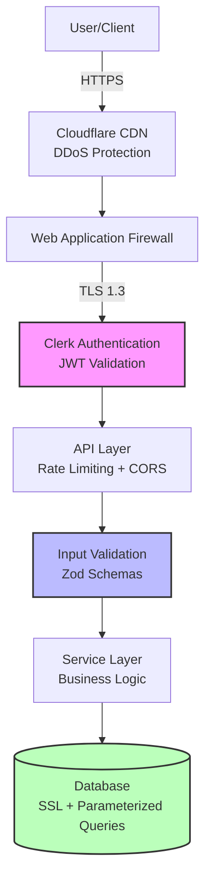

# Security Documentation

## Overview

### Security Philosophy

Hospeda follows a **defense-in-depth** security strategy with multiple layers of protection to safeguard user data, payment information, and system integrity. Our approach is built on three core principles:

1. **Secure by Default**: All systems are configured with security-first settings out of the box
2. **Principle of Least Privilege**: Users and systems have only the minimum access required
3. **Zero Trust Architecture**: Never trust, always verify - all requests are authenticated and authorized

### Security Objectives

Our security program aims to:

- **Protect User Data**: Ensure confidentiality, integrity, and availability of personal information
- **Prevent Unauthorized Access**: Implement robust authentication and authorization controls
- **Secure Payment Processing**: Safeguard financial transactions through Mercado Pago integration
- **Maintain System Integrity**: Prevent tampering, injection attacks, and unauthorized modifications
- **Enable Security Monitoring**: Detect and respond to security incidents promptly
- **Ensure Compliance**: Meet GDPR, data protection, and privacy requirements

### Threat Model

Hospeda's threat model addresses:

**Assets to Protect:**

- User personal information (names, emails, phone numbers)
- Authentication credentials and session tokens
- Booking and reservation data
- Payment information (handled by Mercado Pago)
- Accommodation owner data
- System configurations and secrets

**Threat Actors:**

- External attackers (unauthorized access attempts)
- Automated bots (scraping, abuse)
- Malicious users (fraudulent bookings)
- Insider threats (compromised accounts)

**Attack Vectors:**

- Injection attacks (SQL, XSS, SSRF)
- Broken authentication/authorization
- Sensitive data exposure
- Security misconfigurations
- Vulnerable dependencies
- CSRF attacks

**Risk Level:**

- **Critical**: Payment fraud, data breaches, unauthorized access
- **High**: Account takeover, privilege escalation
- **Medium**: Information disclosure, denial of service
- **Low**: Minor information leakage

### Security Layers

---

## Quick Links

### Core Security Documents

- **[Security Overview](./overview.md)** - Comprehensive security posture and architecture
- **[OWASP Top 10 Prevention](./owasp-top-10.md)** - Protection against common vulnerabilities
- **[Authentication Guide](./authentication.md)** - Clerk integration and session management
- **[API Security](./api-security.md)** - Rate limiting, CORS, and endpoint protection
- **[Data Protection](./data-protection.md)** - Encryption, PII handling, and retention
- **[Deployment Security](./deployment.md)** - Vercel and Fly.io security configurations
- **[Incident Response](./incident-response.md)** - Security incident handling procedures

### Implementation Guides

- **[Security Headers Configuration](./headers.md)** - CSP, HSTS, and other security headers
- **[Input Validation](./validation.md)** - Zod schema validation patterns
- **[Database Security](./database-security.md)** - Drizzle ORM and query security
- **[Dependency Management](./dependencies.md)** - Vulnerability scanning and updates
- **[Logging and Monitoring](./logging-monitoring.md)** - Security event tracking

### Testing and Compliance

- **[Security Testing Guide](./security-testing.md)** - Penetration testing and vulnerability scans
- **[Code Review Checklist](./code-review-checklist.md)** - Security-focused review guidelines
- **[GDPR Compliance](./gdpr-compliance.md)** - Data protection regulations
- **[Privacy Policy](../legal/privacy-policy.md)** - User privacy commitments

### External Resources

**OWASP Resources:**

- [OWASP Top 10 2021](https://owasp.org/Top10/)
- [OWASP Cheat Sheet Series](https://cheatsheetseries.owasp.org/)
- [OWASP API Security Top 10](https://owasp.org/www-project-api-security/)

**Security Standards:**

- [NIST Cybersecurity Framework](https://www.nist.gov/cyberframework)
- [CWE Top 25](https://cwe.mitre.org/top25/)
- [SANS Security Checklist](https://www.sans.org/security-resources/)

**Tools Documentation:**

- [Clerk Security Best Practices](https://clerk.com/docs/security)
- [Vercel Security](https://vercel.com/docs/security)
- [Hono Security Middleware](https://hono.dev/middleware/built-in/secure-headers)

**Compliance Resources:**

- [GDPR Official Text](https://gdpr-info.eu/)
- [Argentina Data Protection Law](https://www.argentina.gob.ar/aaip)

---

## Security Checklist

### Pre-Deployment Checklist

#### Code Security

- [ ] All user inputs validated with Zod schemas
- [ ] No hardcoded secrets or credentials in code
- [ ] All database queries use parameterized statements (Drizzle ORM)
- [ ] XSS prevention: proper output encoding
- [ ] CSRF protection enabled for state-changing operations
- [ ] SQL injection prevention verified
- [ ] No sensitive data in logs
- [ ] Error messages don't leak sensitive information
- [ ] File upload validation and sanitization
- [ ] Rate limiting configured for all API endpoints

#### Authentication & Authorization

- [ ] Clerk authentication properly integrated
- [ ] JWT token validation on all protected routes
- [ ] Session management secure (httpOnly cookies, secure flag)
- [ ] Role-based access control (RBAC) implemented
- [ ] Permission checks at service layer
- [ ] No authorization bypass vulnerabilities
- [ ] Webhook signature verification (Clerk, Mercado Pago)
- [ ] Token expiration properly handled
- [ ] Logout functionality clears all sessions
- [ ] Multi-factor authentication available (Clerk)

#### API Security

- [ ] HTTPS enforced on all endpoints
- [ ] CORS properly configured (whitelist origins)
- [ ] Security headers implemented (CSP, HSTS, X-Frame-Options)
- [ ] Rate limiting per endpoint and per user
- [ ] Request size limits configured
- [ ] API versioning strategy in place
- [ ] Sensitive endpoints require authentication
- [ ] API documentation doesn't expose internal details
- [ ] GraphQL/REST endpoints secured
- [ ] OpenAPI/Swagger spec reviewed for sensitive data

#### Data Protection

- [ ] HTTPS/TLS 1.3 for data in transit
- [ ] Database connections use SSL
- [ ] Sensitive data encrypted at rest (if applicable)
- [ ] PII identified and protected
- [ ] Data retention policies implemented
- [ ] Secure password handling (delegated to Clerk)
- [ ] Payment data never stored (PCI DSS compliance)
- [ ] User data export/deletion functionality (GDPR)
- [ ] Backup encryption enabled
- [ ] Data anonymization for logs and analytics

#### Infrastructure

- [ ] Environment variables properly configured
- [ ] Secrets management (GitHub Secrets, Vercel, Fly.io)
- [ ] Database credentials rotated
- [ ] Firewall rules configured
- [ ] DDoS protection enabled (Cloudflare)
- [ ] WAF configured if applicable
- [ ] CDN security settings verified
- [ ] Container/serverless security best practices
- [ ] Monitoring and alerting configured
- [ ] Automated backups enabled

#### Dependencies

- [ ] All dependencies up to date
- [ ] No known vulnerabilities (run `pnpm audit`)
- [ ] Dependabot alerts addressed
- [ ] Lock files committed (`pnpm-lock.yaml`)
- [ ] Security patches applied
- [ ] Deprecated packages removed
- [ ] License compliance verified
- [ ] Supply chain security reviewed
- [ ] Third-party libraries from trusted sources
- [ ] Regular dependency update schedule

#### Testing

- [ ] Security tests passing
- [ ] Penetration testing completed
- [ ] Vulnerability scanning performed
- [ ] Authentication tests passing
- [ ] Authorization tests passing
- [ ] Input validation tests passing
- [ ] XSS prevention tests passing
- [ ] CSRF protection tests passing
- [ ] SQL injection tests passing
- [ ] Security code review completed

### Post-Deployment Verification

#### Immediate Checks (Within 24 Hours)

- [ ] HTTPS certificate valid and auto-renewal configured
- [ ] Security headers present in responses
- [ ] Authentication flows working correctly
- [ ] Rate limiting active and effective
- [ ] Logging and monitoring capturing events
- [ ] Error handling not exposing sensitive data
- [ ] API endpoints responding correctly
- [ ] Database connections secure and pooled
- [ ] CDN/WAF rules active
- [ ] Backup systems functioning

#### First Week Checks

- [ ] Monitor authentication failures
- [ ] Review rate limiting effectiveness
- [ ] Check for unusual traffic patterns
- [ ] Verify logging completeness
- [ ] Review error rates and types
- [ ] Confirm monitoring alerts working
- [ ] Check database query performance
- [ ] Verify webhook integrations (Clerk, Mercado Pago)
- [ ] Review user feedback for security issues
- [ ] Conduct internal security review

#### First Month Checks

- [ ] Run full vulnerability scan
- [ ] Review security logs for anomalies
- [ ] Analyze authentication metrics
- [ ] Review and update security documentation
- [ ] Conduct security training for team
- [ ] Review and test incident response plan
- [ ] Verify compliance with security policies
- [ ] Update threat model if needed
- [ ] Review third-party security (Clerk, Mercado Pago)
- [ ] Plan next security assessment

### Periodic Security Reviews

#### Weekly

- [ ] Review Dependabot security alerts
- [ ] Monitor authentication failures and blocked IPs
- [ ] Check rate limiting effectiveness
- [ ] Review error logs for security issues
- [ ] Verify backup completeness
- [ ] Check for unusual database queries
- [ ] Monitor API usage patterns
- [ ] Review new code for security issues

#### Monthly

- [ ] Run `pnpm audit` and address vulnerabilities
- [ ] Review and rotate API keys/tokens
- [ ] Update security documentation
- [ ] Review access control lists
- [ ] Analyze security metrics and trends
- [ ] Test incident response procedures
- [ ] Review third-party integrations
- [ ] Conduct security awareness training
- [ ] Update security checklist if needed
- [ ] Review and update threat model

#### Quarterly

- [ ] Full security audit
- [ ] Penetration testing
- [ ] Vulnerability scanning (automated + manual)
- [ ] Review and update security policies
- [ ] Disaster recovery testing
- [ ] Compliance review (GDPR, etc.)
- [ ] Third-party security assessment
- [ ] Security training for all team members
- [ ] Review and update incident response plan
- [ ] Update security roadmap

#### Annually

- [ ] Comprehensive security assessment
- [ ] External penetration testing
- [ ] Full compliance audit
- [ ] Review and update all security documentation
- [ ] Security architecture review
- [ ] Threat modeling workshop
- [ ] Disaster recovery full test
- [ ] Review security budget and resources
- [ ] Update security strategy
- [ ] Consider security certifications (ISO 27001, SOC 2)

### Incident Response Checklist

#### Detection

- [ ] Security incident identified
- [ ] Initial assessment completed
- [ ] Severity level determined
- [ ] Incident response team notified
- [ ] Communication channels established

#### Containment

- [ ] Affected systems isolated
- [ ] Further damage prevented
- [ ] Attack vector identified and blocked
- [ ] Evidence preserved
- [ ] Stakeholders notified

#### Eradication

- [ ] Root cause identified
- [ ] Vulnerabilities patched
- [ ] Malicious code/access removed
- [ ] Systems hardened
- [ ] Verification testing completed

#### Recovery

- [ ] Systems restored from clean backups
- [ ] Services returned to normal operation
- [ ] Monitoring enhanced
- [ ] Additional security controls implemented
- [ ] Users notified if required

#### Post-Incident

- [ ] Incident documented
- [ ] Root cause analysis completed
- [ ] Lessons learned identified
- [ ] Security improvements implemented
- [ ] Incident response plan updated
- [ ] Team debriefing conducted
- [ ] Compliance reporting (if required)

---

## Reporting Security Issues

### Responsible Disclosure Policy

Hospeda takes security seriously. If you discover a security vulnerability, please help us protect our users by disclosing it responsibly.

**We appreciate:**

- Private disclosure before public announcement
- Detailed vulnerability reports
- Proof-of-concept (non-destructive)
- Suggestions for remediation

**We commit to:**

- Acknowledge receipt within 48 hours
- Provide regular updates on remediation progress
- Credit security researchers (if desired)
- No legal action against good-faith security research

### How to Report

**Email**: <security@hospeda.com> (PGP key available)

**What to Include:**

1. **Vulnerability Description**
   - Type of vulnerability (injection, XSS, etc.)
   - Affected component/endpoint
   - Potential impact

1. **Steps to Reproduce**
   - Detailed reproduction steps
   - Required preconditions
   - Expected vs. actual behavior

1. **Proof of Concept**
   - Non-destructive demonstration
   - Screenshots/videos if applicable
   - Sample payloads (sanitized)

1. **Impact Assessment**
   - Confidentiality impact
   - Integrity impact
   - Availability impact
   - Affected users/data

1. **Suggested Fix** (optional)
   - Remediation recommendations
   - Code patches if available

### Response Timeline

- **Initial Response**: Within 48 hours
- **Assessment Complete**: Within 5 business days
- **Fix Implementation**: Varies by severity
  - **Critical**: 24-48 hours
  - **High**: 1 week
  - **Medium**: 2 weeks
  - **Low**: Next release cycle
- **Public Disclosure**: After fix deployed (coordinated)

### Severity Levels

#### Critical (CVSS 9.0-10.0)

- Remote code execution
- SQL injection with data access
- Authentication bypass
- Payment system vulnerabilities

#### High (CVSS 7.0-8.9)

- Privilege escalation
- Sensitive data exposure
- Cross-site scripting (XSS)
- Significant authorization flaws

#### Medium (CVSS 4.0-6.9)

- Information disclosure
- CSRF vulnerabilities
- Limited privilege escalation
- Denial of service

#### Low (CVSS 0.1-3.9)

- Minor information leakage
- Best practice violations
- Low-impact misconfigurations

### Bug Bounty Program

**Status**: Under consideration for future implementation

We're evaluating a bug bounty program to reward security researchers. Check back for updates.

### Out of Scope

Please **do not** report:

- Denial of service attacks
- Social engineering attacks
- Physical security issues
- Issues requiring physical access
- Already known/reported vulnerabilities
- Issues in third-party services (report to vendor)

### Contact Information

- **Security Email**: <security@hospeda.com>
- **General Contact**: <support@hospeda.com>
- **Emergency**: Use security email with "[URGENT]" prefix

---

## Compliance

### GDPR Compliance

Hospeda is committed to compliance with the General Data Protection Regulation (GDPR) and Argentina's Personal Data Protection Law (PDPL).

#### Data Protection Principles

1. **Lawfulness, Fairness, Transparency**
   - Clear privacy policies
   - User consent mechanisms
   - Transparent data practices

1. **Purpose Limitation**
   - Data collected for specific purposes
   - No secondary use without consent
   - Clear retention policies

1. **Data Minimization**
   - Only necessary data collected
   - Regular data cleanup
   - Anonymization where possible

1. **Accuracy**
   - User profile updates
   - Data correction mechanisms
   - Regular data validation

1. **Storage Limitation**
   - Defined retention periods
   - Automated data deletion
   - Backup retention policies

1. **Integrity and Confidentiality**
   - Encryption in transit and at rest
   - Access controls
   - Security monitoring

1. **Accountability**
   - Data processing records
   - Security documentation
   - Regular audits

#### User Rights

Hospeda supports the following GDPR rights:

- **Right to Access**: Users can request their data
- **Right to Rectification**: Users can update their information
- **Right to Erasure**: Users can request account deletion
- **Right to Restrict Processing**: Users can limit data use
- **Right to Data Portability**: Users can export their data
- **Right to Object**: Users can opt-out of certain processing
- **Rights Related to Automated Decision Making**: Transparent algorithms

#### Data Processing

- **Data Controller**: Hospeda
- **Data Processors**: Clerk (authentication), Mercado Pago (payments), Neon (database hosting)
- **Data Protection Officer**: <dpo@hospeda.com>
- **Data Processing Agreements**: In place with all processors

### Privacy Policy

**Location**: [Privacy Policy](../legal/privacy-policy.md)

**Key Points:**

- What data we collect
- How we use data
- Who we share data with
- How we protect data
- User rights and controls
- Contact information

**Last Updated**: Check privacy policy document

### Terms of Service

**Location**: [Terms of Service](../legal/terms-of-service.md)

**Key Points:**

- User responsibilities
- Acceptable use policy
- Prohibited activities
- Account termination
- Limitation of liability
- Dispute resolution

### Cookie Policy

**Location**: [Cookie Policy](../legal/cookie-policy.md)

**Key Points:**

- Types of cookies used
- Purpose of each cookie
- How to manage cookies
- Third-party cookies
- Cookie consent mechanism

### Data Protection Impact Assessment (DPIA)

**Status**: Completed for core functionality

**High-Risk Processing Activities:**

- Payment processing (Mercado Pago)
- User profiling (booking preferences)
- Geolocation data (accommodation search)

**Mitigations:**

- Third-party payment processor (PCI DSS compliant)
- Limited profiling scope
- User consent for location access
- Data minimization
- Strong access controls

### Compliance Resources

**Internal Documents:**

- [Data Protection Policy](./data-protection-policy.md)
- [Data Retention Schedule](./data-retention.md)
- [Data Breach Response Plan](./data-breach-response.md)
- [User Data Request Procedures](./user-data-requests.md)

**External Regulations:**

- [GDPR Official Text](https://gdpr-info.eu/)
- [Argentina PDPL](https://www.argentina.gob.ar/aaip/datospersonales/ley)
- [PCI DSS (Mercado Pago)](https://www.mercadopago.com.ar/developers/es/docs/security/pci)

### Compliance Contact

- **Data Protection Officer**: <dpo@hospeda.com>
- **Legal Team**: <legal@hospeda.com>
- **Privacy Inquiries**: <privacy@hospeda.com>

---

## Getting Help

### Internal Resources

- **Security Team**: <security@hospeda.com>
- **Development Team**: <dev@hospeda.com>
- **DevOps Team**: <devops@hospeda.com>

### Training and Onboarding

New team members should:

1. Read this security documentation
2. Complete security awareness training
3. Review code security guidelines
4. Understand incident response procedures
5. Set up security tools (linters, scanners)

### Questions or Concerns

If you have questions about:

- **Security practices**: <security@hospeda.com>
- **Compliance**: <legal@hospeda.com>
- **Technical implementation**: <dev@hospeda.com>
- **Infrastructure**: <devops@hospeda.com>

---

**Last Updated**: 2024-01-15
**Next Review**: 2024-04-15
**Version**: 1.0.0
