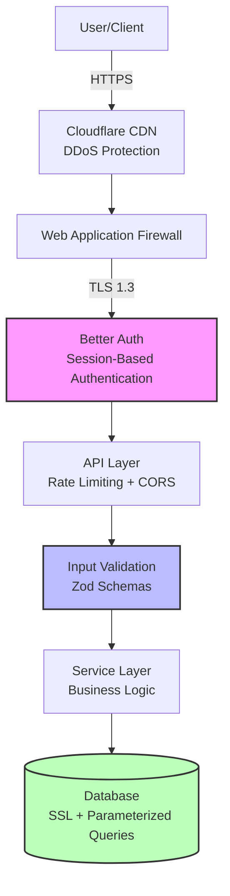

# Security Documentation

## Security Philosophy

Hospeda follows a **defense-in-depth** security strategy with multiple layers of protection to safeguard user data, payment information, and system integrity. The approach is built on three core principles:

1. **Secure by Default**: All systems are configured with security-first settings out of the box
2. **Principle of Least Privilege**: Users and systems have only the minimum access required
3. **Zero Trust Architecture**: Never trust, always verify.. all requests are authenticated and authorized

## Threat Model

### Assets to Protect

- User personal information (names, emails, phone numbers)
- Authentication credentials and session tokens
- Booking and reservation data
- Payment information (handled by Mercado Pago)
- Accommodation owner data
- System configurations and secrets

### Threat Actors

- External attackers (unauthorized access attempts)
- Automated bots (scraping, abuse)
- Malicious users (fraudulent bookings)
- Insider threats (compromised accounts)

### Attack Vectors

- Injection attacks (SQL, XSS, SSRF)
- Broken authentication/authorization
- Sensitive data exposure
- Security misconfigurations
- Vulnerable dependencies
- CSRF attacks

### Risk Levels

- **Critical**: Payment fraud, data breaches, unauthorized access
- **High**: Account takeover, privilege escalation
- **Medium**: Information disclosure, denial of service
- **Low**: Minor information leakage

## Security Architecture

### Defense in Depth Layers

#### Layer 1: Network Security

- Cloudflare CDN with DDoS protection
- Web Application Firewall (WAF)
- HTTPS/TLS 1.3 encryption
- Rate limiting at edge

#### Layer 2: Application Security

- Authentication (Better Auth session validation)
- Authorization (RBAC + permissions)
- Input validation (Zod schemas)
- Output encoding (XSS prevention)

#### Layer 3: Data Security

- Database SSL connections
- Parameterized queries (Drizzle ORM)
- Data encryption at rest
- Secure secret management

#### Layer 4: Infrastructure Security

- Serverless security (Vercel)
- Environment isolation
- Automated security updates
- Backup and disaster recovery

### User Access Levels

- **Anonymous**: Read-only public data (accommodation listings)
- **Guest**: Create bookings, manage own data
- **Host**: Manage own accommodations, view own bookings
- **Admin**: Full system access (limited to authorized personnel)

---

## Security Documents

### Core Security

- **[OWASP Top 10 Prevention](./owasp-top-10.md)** .. Protection against common vulnerabilities
- **[Authentication Guide](./authentication.md)** .. Better Auth integration and session management
- **[API Protection](./api-protection.md)** .. Rate limiting, CORS, and endpoint protection
- **[Input Sanitization](./input-sanitization.md)** .. Zod schema validation patterns

### Audits and Reviews

- **[Billing Audit (2026-02)](./billing-audit-2026-02.md)** .. Billing system security review

### External Resources

**OWASP Resources:**

- [OWASP Top 10 2021](https://owasp.org/Top10/)
- [OWASP Cheat Sheet Series](https://cheatsheetseries.owasp.org/)
- [OWASP API Security Top 10](https://owasp.org/www-project-api-security/)

**Security Standards:**

- [NIST Cybersecurity Framework](https://www.nist.gov/cyberframework)
- [CWE Top 25](https://cwe.mitre.org/top25/)

**Tools Documentation:**

- [Better Auth Documentation](https://www.better-auth.com/docs)
- [Vercel Security](https://vercel.com/docs/security)
- [Hono Security Middleware](https://hono.dev/middleware/built-in/secure-headers)

---

## Security Checklist

### Pre-Deployment

#### Code Security

- [ ] All user inputs validated with Zod schemas
- [ ] No hardcoded secrets or credentials in code
- [ ] All database queries use parameterized statements (Drizzle ORM)
- [ ] XSS prevention: proper output encoding
- [ ] CSRF protection enabled for state-changing operations
- [ ] SQL injection prevention verified
- [ ] No sensitive data in logs
- [ ] Error messages do not leak sensitive information
- [ ] File upload validation and sanitization
- [ ] Rate limiting configured for all API endpoints

#### Authentication and Authorization

- [ ] Better Auth authentication properly integrated
- [ ] Session management secure (httpOnly cookies, secure flag)
- [ ] Role-based access control (RBAC) implemented
- [ ] Permission checks at service layer
- [ ] No authorization bypass vulnerabilities
- [ ] Webhook signature verification (Mercado Pago)
- [ ] Token expiration properly handled
- [ ] Logout functionality clears all sessions

#### API Security

- [ ] HTTPS enforced on all endpoints
- [ ] CORS properly configured (whitelist origins)
- [ ] Security headers implemented (CSP, HSTS, X-Frame-Options)
- [ ] Rate limiting per endpoint and per user
- [ ] Request size limits configured
- [ ] Sensitive endpoints require authentication

#### Data Protection

- [ ] HTTPS/TLS 1.3 for data in transit
- [ ] Database connections use SSL
- [ ] PII identified and protected
- [ ] Payment data never stored (PCI DSS compliance via Mercado Pago)
- [ ] User data export/deletion functionality (GDPR)

#### Infrastructure

- [ ] Environment variables properly configured
- [ ] Secrets management (GitHub Secrets, Vercel)
- [ ] Database credentials rotated
- [ ] DDoS protection enabled (Cloudflare)
- [ ] Monitoring and alerting configured

#### Dependencies

- [ ] All dependencies up to date
- [ ] No known vulnerabilities (run `pnpm audit`)
- [ ] Lock file committed (`pnpm-lock.yaml`)
- [ ] Deprecated packages removed

### Post-Deployment Verification

- [ ] HTTPS certificate valid and auto-renewal configured
- [ ] Security headers present in responses
- [ ] Authentication flows working correctly
- [ ] Rate limiting active and effective
- [ ] Logging and monitoring capturing events
- [ ] Error handling not exposing sensitive data

### Periodic Reviews

**Weekly:**

- [ ] Review Dependabot security alerts
- [ ] Monitor authentication failures
- [ ] Check rate limiting effectiveness
- [ ] Review error logs for security issues

**Monthly:**

- [ ] Run `pnpm audit` and address vulnerabilities
- [ ] Review and rotate API keys/tokens
- [ ] Review access control lists
- [ ] Test incident response procedures

**Quarterly:**

- [ ] Full security audit
- [ ] Penetration testing
- [ ] Review and update security policies
- [ ] Disaster recovery testing

---

## Incident Response

### Detection

- [ ] Security incident identified
- [ ] Initial assessment completed
- [ ] Severity level determined
- [ ] Incident response team notified

### Containment

- [ ] Affected systems isolated
- [ ] Attack vector identified and blocked
- [ ] Evidence preserved
- [ ] Stakeholders notified

### Eradication

- [ ] Root cause identified
- [ ] Vulnerabilities patched
- [ ] Malicious code/access removed
- [ ] Verification testing completed

### Recovery

- [ ] Systems restored from clean backups
- [ ] Services returned to normal operation
- [ ] Monitoring enhanced
- [ ] Users notified if required

### Post-Incident

- [ ] Incident documented
- [ ] Root cause analysis completed
- [ ] Lessons learned identified
- [ ] Security improvements implemented
- [ ] Incident response plan updated

---

## Reporting Security Issues

If you discover a security vulnerability, please help us protect our users by disclosing it responsibly.

**Email**: <security@hospeda.com>

**What to Include:**

1. Vulnerability type and affected component/endpoint
2. Detailed reproduction steps
3. Non-destructive proof of concept
4. Impact assessment
5. Suggested fix (optional)

**Response Timeline:**

- **Initial Response**: Within 48 hours
- **Assessment Complete**: Within 5 business days
- **Fix Implementation**: Critical 24-48h, High 1 week, Medium 2 weeks, Low next release

### Severity Levels

| Severity | CVSS | Examples |
|----------|------|---------|
| Critical | 9.0-10.0 | Remote code execution, SQL injection with data access, auth bypass |
| High | 7.0-8.9 | Privilege escalation, sensitive data exposure, XSS |
| Medium | 4.0-6.9 | Information disclosure, CSRF, limited privilege escalation |
| Low | 0.1-3.9 | Minor information leakage, best practice violations |

---

## Compliance

### GDPR and Data Protection

Hospeda is committed to compliance with GDPR and Argentina's Personal Data Protection Law (PDPL).

**Data Protection Principles:**

1. **Lawfulness, Fairness, Transparency** .. Clear privacy policies and user consent
2. **Purpose Limitation** .. Data collected for specific purposes only
3. **Data Minimization** .. Only necessary data collected
4. **Accuracy** .. User profile updates and data correction mechanisms
5. **Storage Limitation** .. Defined retention periods and automated cleanup
6. **Integrity and Confidentiality** .. Encryption, access controls, monitoring
7. **Accountability** .. Data processing records, documentation, audits

**User Rights Supported:**

- Right to Access, Rectification, Erasure
- Right to Restrict Processing and Data Portability
- Right to Object

**Data Processing:**

- Data Controller: Hospeda
- Data Processors: Better Auth (self-hosted), Mercado Pago (payments), Neon (database hosting)
- Data Protection Officer: <dpo@hospeda.com>

### Compliance Resources

- [GDPR Official Text](https://gdpr-info.eu/)
- [Argentina PDPL](https://www.argentina.gob.ar/aaip/datospersonales/ley)
- [PCI DSS (Mercado Pago)](https://www.mercadopago.com.ar/developers/es/docs/security/pci)

---

## Contact

- **Security Team**: <security@hospeda.com>
- **Data Protection Officer**: <dpo@hospeda.com>
- **Emergency**: Use security email with "[URGENT]" prefix
