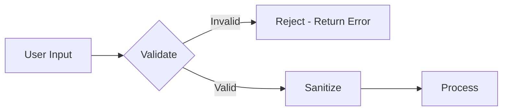

# Input Sanitization

Complete guide to input validation and sanitization patterns in Hospeda.

## Table of Contents

- [Input Sanitization](#input-sanitization)
  - [Table of Contents](#table-of-contents)
  - [Overview](#overview)
    - [Why Sanitization Matters](#why-sanitization-matters)
    - [Validation vs Sanitization](#validation-vs-sanitization)
    - [Defense in Depth Approach](#defense-in-depth-approach)
    - [Attack Prevention Matrix](#attack-prevention-matrix)
  - [Schema Validation with Zod](#schema-validation-with-zod)
    - [Zod Schema Patterns](#zod-schema-patterns)
      - [Basic Types](#basic-types)
      - [String Validation](#string-validation)
      - [Number Validation](#number-validation)
      - [Date Validation](#date-validation)
      - [Array Validation](#array-validation)
      - [Object Validation](#object-validation)
    - [Custom Validators](#custom-validators)
      - [Email Validator](#email-validator)
      - [URL Validator](#url-validator)
      - [UUID Validator](#uuid-validator)
      - [Phone Number Validator](#phone-number-validator)
    - [Type Coercion](#type-coercion)
      - [String to Number](#string-to-number)
      - [String to Boolean](#string-to-boolean)
      - [String to Date](#string-to-date)
    - [Error Handling](#error-handling)
      - [Zod Error Structure](#zod-error-structure)
      - [Custom Error Messages](#custom-error-messages)
      - [Error Transformation](#error-transformation)
    - [Common Schemas](#common-schemas)
      - [Email Schema](#email-schema)
      - [Phone Schema](#phone-schema)
      - [URL Schema](#url-schema)
      - [Pagination Schema](#pagination-schema)
  - [SQL Injection Prevention](#sql-injection-prevention)
    - [Drizzle ORM Safety](#drizzle-orm-safety)
      - [Type-Safe Queries](#type-safe-queries)
      - [Query Builder](#query-builder)
    - [Parameterized Queries](#parameterized-queries)
      - [Safe Queries](#safe-queries)
      - [Dynamic Filters](#dynamic-filters)
    - [Never Concatenate SQL](#never-concatenate-sql)
      - [Unsafe Examples](#unsafe-examples)
      - [Safe Alternatives](#safe-alternatives)
    - [Query Examples](#query-examples)
      - [Simple SELECT](#simple-select)
      - [WHERE with Parameters](#where-with-parameters)
      - [Multiple Conditions](#multiple-conditions)
      - [LIKE Queries](#like-queries)
      - [IN Queries](#in-queries)
    - [Testing for SQL Injection](#testing-for-sql-injection)
      - [Test Cases](#test-cases)
  - [XSS Prevention](#xss-prevention)
    - [React Auto-Escaping](#react-auto-escaping)
      - [Safe by Default](#safe-by-default)
      - [Dangerous Patterns](#dangerous-patterns)
    - [Astro Security](#astro-security)
      - [Template Escaping](#template-escaping)
      - [Safe HTML Rendering](#safe-html-rendering)
    - [Dangerous HTML Patterns](#dangerous-html-patterns)
      - [What to Avoid](#what-to-avoid)
      - [Safe Alternatives](#safe-alternatives-1)
    - [CSP Implementation](#csp-implementation)
      - [Content Security Policy](#content-security-policy)
      - [CSP Configuration](#csp-configuration)
    - [Sanitizing User Content](#sanitizing-user-content)
      - [HTML Sanitization](#html-sanitization)
      - [Markdown Sanitization](#markdown-sanitization)
    - [Code Examples](#code-examples)
      - [Safe Component](#safe-component)
      - [Unsafe Component (for reference)](#unsafe-component-for-reference)
  - [File Upload Security](#file-upload-security)
    - [File Type Validation](#file-type-validation)
      - [MIME Type Checking](#mime-type-checking)
      - [File Extension Validation](#file-extension-validation)
    - [MIME Type Checking](#mime-type-checking-1)
      - [Magic Number Validation](#magic-number-validation)
    - [File Size Limits](#file-size-limits)
      - [Implementation](#implementation)
      - [Environment Configuration](#environment-configuration)
    - [Malware Scanning](#malware-scanning)
      - [ClamAV Integration](#clamav-integration)
      - [Virus Scan Implementation](#virus-scan-implementation)
    - [Storage Security](#storage-security)
      - [Secure File Storage](#secure-file-storage)
      - [Access Control](#access-control)
    - [Cloudinary Integration](#cloudinary-integration)
      - [Upload Configuration](#upload-configuration)
      - [Transformation Security](#transformation-security)
  - [URL Validation](#url-validation)
    - [Whitelist Approach](#whitelist-approach)
      - [Allowed Domains](#allowed-domains)
      - [URL Validation Function](#url-validation-function)
    - [URL Parsing](#url-parsing)
      - [Safe URL Parsing](#safe-url-parsing)
    - [Protocol Validation](#protocol-validation)
      - [Allowed Protocols](#allowed-protocols)
    - [SSRF Prevention](#ssrf-prevention)
      - [What is SSRF?](#what-is-ssrf)
      - [Prevention Strategies](#prevention-strategies)
      - [Safe HTTP Client](#safe-http-client)
    - [Redirect Validation](#redirect-validation)
      - [Safe Redirect](#safe-redirect)
      - [Open Redirect Prevention](#open-redirect-prevention)
    - [Code Examples](#code-examples-1)
      - [URL Validation Schema](#url-validation-schema)
      - [External Link Component](#external-link-component)
  - [String Sanitization](#string-sanitization)
    - [HTML Tag Removal](#html-tag-removal)
      - [Remove All HTML](#remove-all-html)
      - [Remove Script Tags](#remove-script-tags)
    - [JavaScript Protocol Removal](#javascript-protocol-removal)
      - [Remove Dangerous Protocols](#remove-dangerous-protocols)
    - [Whitespace Normalization](#whitespace-normalization)
      - [Normalize Spaces](#normalize-spaces)
    - [Length Limiting](#length-limiting)
      - [Truncate Strings](#truncate-strings)
    - [Special Character Handling](#special-character-handling)
      - [Escape Special Characters](#escape-special-characters)
  - [Search Query Sanitization](#search-query-sanitization)
    - [Full-Text Search Safety](#full-text-search-safety)
      - [PostgreSQL Full-Text Search](#postgresql-full-text-search)
    - [Wildcard Escaping](#wildcard-escaping)
      - [Escape LIKE Wildcards](#escape-like-wildcards)
    - [Query Length Limits](#query-length-limits)
      - [Limit Search Query Length](#limit-search-query-length)
    - [Special Character Removal](#special-character-removal)
      - [Remove Special Characters](#remove-special-characters)
  - [Email Validation](#email-validation)
    - [Email Format Validation](#email-format-validation)
      - [Zod Email Validation](#zod-email-validation)
      - [Custom Email Validation](#custom-email-validation)
    - [Email Normalization](#email-normalization)
      - [Lowercase and Trim](#lowercase-and-trim)
    - [Disposable Email Detection](#disposable-email-detection)
      - [Block Disposable Emails](#block-disposable-emails)
    - [Email Security](#email-security)
      - [Email Injection Prevention](#email-injection-prevention)
  - [Testing](#testing)
    - [Validation Testing](#validation-testing)
      - [Test Valid Inputs](#test-valid-inputs)
      - [Test Invalid Inputs](#test-invalid-inputs)
    - [Sanitization Testing](#sanitization-testing)
      - [Test HTML Removal](#test-html-removal)
      - [Test XSS Prevention](#test-xss-prevention)
    - [SQL Injection Testing](#sql-injection-testing)
      - [Test SQL Injection Attempts](#test-sql-injection-attempts)
    - [File Upload Testing](#file-upload-testing)
      - [Test File Type Validation](#test-file-type-validation)
  - [Best Practices](#best-practices)
    - [Validate Early](#validate-early)
    - [Sanitize Late](#sanitize-late)
    - [Never Trust User Input](#never-trust-user-input)
    - [Use Type-Safe Libraries](#use-type-safe-libraries)
    - [Log Sanitization Events](#log-sanitization-events)
  - [Common Mistakes](#common-mistakes)
    - [Mistake 1: Client-Side Only Validation](#mistake-1-client-side-only-validation)
    - [Mistake 2: Blacklist Approach](#mistake-2-blacklist-approach)
    - [Mistake 3: Trusting Content-Type](#mistake-3-trusting-content-type)
    - [Mistake 4: Insufficient Escaping](#mistake-4-insufficient-escaping)
  - [Troubleshooting](#troubleshooting)
    - [Common Issues](#common-issues)
      - [1. Validation Errors on Valid Input](#1-validation-errors-on-valid-input)
      - [2. Special Characters Getting Removed](#2-special-characters-getting-removed)
      - [3. File Upload Fails](#3-file-upload-fails)
      - [4. Search Not Working](#4-search-not-working)
  - [References](#references)

## Overview

### Why Sanitization Matters

**Input sanitization prevents:**

- **SQL Injection**: Malicious SQL queries
- **XSS (Cross-Site Scripting)**: Malicious scripts in pages
- **Code Injection**: Arbitrary code execution
- **Path Traversal**: Unauthorized file access
- **Command Injection**: OS command execution
- **LDAP Injection**: Directory service attacks

**Example Attack:**

```typescript
// User input (malicious)
const userInput = "'; DROP TABLE users; --";

// ❌ UNSAFE - SQL injection
const query = `SELECT * FROM users WHERE name = '${userInput}'`;
// Result: SELECT * FROM users WHERE name = ''; DROP TABLE users; --'

// ✅ SAFE - Parameterized query
const query = db.select().from(users).where(eq(users.name, userInput));
```

### Validation vs Sanitization

**Validation:**

- Checks if input meets requirements
- Rejects invalid input
- Returns error messages
- Happens BEFORE processing

**Sanitization:**

- Cleans/modifies input
- Removes dangerous content
- Transforms to safe format
- Happens AFTER validation

**Flow:**



### Defense in Depth Approach

**Multiple Layers:**

1. **Schema Validation** - Zod schemas reject malformed input
2. **Input Sanitization** - Remove dangerous content
3. **ORM Protection** - Drizzle prevents SQL injection
4. **Output Encoding** - React/Astro auto-escape
5. **CSP Headers** - Block inline scripts

**Example:**

```typescript
// Layer 1: Validation
const schema = z.object({
  name: z.string().min(3).max(100)
});

// Layer 2: Sanitization
const sanitized = sanitizeString(input.name);

// Layer 3: ORM
const result = await db
  .select()
  .from(users)
  .where(eq(users.name, sanitized)); // Parameterized

// Layer 4: Output (React auto-escapes)
return <div>{result.name}</div>;
```

### Attack Prevention Matrix

| Attack Type | Prevention Method | Implementation |
|-------------|-------------------|----------------|
| **SQL Injection** | Parameterized queries | Drizzle ORM |
| **XSS** | Output escaping + CSP | React + CSP headers |
| **CSRF** | SameSite cookies | Clerk |
| **Command Injection** | Input validation | Zod schemas |
| **Path Traversal** | Path normalization | File validation |
| **File Upload** | Type + size validation | MIME checking |
| **Open Redirect** | URL whitelist | URL validation |
| **SSRF** | Domain whitelist | HTTP client config |

## Schema Validation with Zod

### Zod Schema Patterns

#### Basic Types

```typescript
import { z } from 'zod';

// String
const stringSchema = z.string();

// Number
const numberSchema = z.number();

// Boolean
const booleanSchema = z.boolean();

// Date
const dateSchema = z.date();

// Null
const nullSchema = z.null();

// Undefined
const undefinedSchema = z.undefined();

// Any (avoid!)
const anySchema = z.any();

// Unknown (prefer over any)
const unknownSchema = z.unknown();
```

#### String Validation

```typescript
const stringSchema = z.string()
  .min(3, 'Must be at least 3 characters')
  .max(100, 'Must not exceed 100 characters')
  .trim() // Remove whitespace
  .toLowerCase() // Convert to lowercase
  .regex(/^[a-zA-Z0-9]+$/, 'Alphanumeric only');

// Email
const emailSchema = z.string().email('Invalid email');

// URL
const urlSchema = z.string().url('Invalid URL');

// UUID
const uuidSchema = z.string().uuid('Invalid UUID');

// Custom pattern
const usernameSchema = z.string()
  .min(3)
  .max(20)
  .regex(/^[a-zA-Z0-9_]+$/, 'Username can only contain letters, numbers, and underscores');
```

#### Number Validation

```typescript
const numberSchema = z.number()
  .int('Must be an integer')
  .positive('Must be positive')
  .min(0, 'Must be at least 0')
  .max(100, 'Must not exceed 100');

// Price
const priceSchema = z.number()
  .positive('Price must be positive')
  .max(999999, 'Price too high')
  .multipleOf(0.01, 'Maximum 2 decimal places');

// Percentage
const percentageSchema = z.number()
  .min(0)
  .max(100)
  .int();

// Latitude/Longitude
const latitudeSchema = z.number().min(-90).max(90);
const longitudeSchema = z.number().min(-180).max(180);
```

#### Date Validation

```typescript
const dateSchema = z.date();

// Date in the past
const pastDateSchema = z.date()
  .max(new Date(), 'Date must be in the past');

// Date in the future
const futureDateSchema = z.date()
  .min(new Date(), 'Date must be in the future');

// Date range
const dateRangeSchema = z.object({
  startDate: z.date(),
  endDate: z.date()
}).refine(
  data => data.endDate > data.startDate,
  { message: 'End date must be after start date' }
);

// ISO date string
const isoDateSchema = z.string().datetime();
```

#### Array Validation

```typescript
const arraySchema = z.array(z.string())
  .min(1, 'At least one item required')
  .max(10, 'Maximum 10 items allowed');

// Array of objects
const arrayOfObjectsSchema = z.array(
  z.object({
    id: z.string().uuid(),
    name: z.string()
  })
);

// Non-empty array
const nonEmptyArraySchema = z.array(z.string()).nonempty();

// Unique items
const uniqueArraySchema = z.array(z.string())
  .refine(
    items => new Set(items).size === items.length,
    { message: 'Items must be unique' }
  );
```

#### Object Validation

```typescript
const objectSchema = z.object({
  id: z.string().uuid(),
  name: z.string().min(3),
  email: z.string().email(),
  age: z.number().int().positive().optional(),
  tags: z.array(z.string()).optional()
});

// Partial (all fields optional)
const partialSchema = objectSchema.partial();

// Pick specific fields
const pickedSchema = objectSchema.pick({ id: true, name: true });

// Omit specific fields
const omittedSchema = objectSchema.omit({ age: true });

// Strict (no extra fields)
const strictSchema = objectSchema.strict();
```

### Custom Validators

#### Email Validator

```typescript
const emailValidator = z.string()
  .email('Invalid email format')
  .toLowerCase()
  .trim()
  .refine(
    email => !email.endsWith('@tempmail.com'),
    { message: 'Disposable emails not allowed' }
  );
```

#### URL Validator

```typescript
const urlValidator = z.string()
  .url('Invalid URL')
  .refine(
    url => {
      try {
        const parsed = new URL(url);
        return ['http:', 'https:'].includes(parsed.protocol);
      } catch {
        return false;
      }
    },
    { message: 'Only HTTP/HTTPS URLs allowed' }
  );
```

#### UUID Validator

```typescript
const uuidValidator = z.string()
  .uuid('Invalid UUID format')
  .toLowerCase();
```

#### Phone Number Validator

```typescript
const phoneValidator = z.string()
  .regex(/^\+?[1-9]\d{1,14}$/, 'Invalid phone number')
  .transform(phone => phone.replace(/\s+/g, '')); // Remove spaces
```

### Type Coercion

#### String to Number

```typescript
// Query params come as strings
const querySchema = z.object({
  page: z.coerce.number().int().positive().default(1),
  pageSize: z.coerce.number().int().positive().max(100).default(20)
});

// Usage
const query = querySchema.parse({ page: '2', pageSize: '50' });
// Result: { page: 2, pageSize: 50 }
```

#### String to Boolean

```typescript
const booleanSchema = z.coerce.boolean();

// Parses:
// 'true', '1', 'yes' → true
// 'false', '0', 'no' → false
```

#### String to Date

```typescript
const dateSchema = z.coerce.date();

// Parses ISO date strings
const date = dateSchema.parse('2024-01-15');
// Result: Date object
```

### Error Handling

#### Zod Error Structure

```typescript
try {
  const schema = z.object({
    name: z.string().min(3)
  });

  schema.parse({ name: 'AB' });
} catch (error) {
  if (error instanceof z.ZodError) {
    console.log(error.errors);
    // [
    //   {
    //     path: ['name'],
    //     message: 'String must contain at least 3 character(s)',
    //     code: 'too_small',
    //     minimum: 3,
    //     type: 'string',
    //     inclusive: true
    //   }
    // ]
  }
}
```

#### Custom Error Messages

```typescript
const schema = z.object({
  email: z.string()
    .min(1, 'Email is required')
    .email('Please provide a valid email address'),

  password: z.string()
    .min(8, 'Password must be at least 8 characters')
    .max(100, 'Password is too long')
    .regex(/[A-Z]/, 'Password must contain at least one uppercase letter')
    .regex(/[0-9]/, 'Password must contain at least one number')
});
```

#### Error Transformation

```typescript
// Transform Zod errors to API error format

import { z } from 'zod';

function transformZodError(error: z.ZodError) {
  return {
    success: false,
    error: {
      code: 'VALIDATION_ERROR',
      message: 'Invalid request data',
      details: error.errors.map(err => ({
        field: err.path.join('.'),
        message: err.message,
        code: err.code
      }))
    }
  };
}
```

### Common Schemas

#### Email Schema

```typescript
export const emailSchema = z.string()
  .email('Invalid email address')
  .toLowerCase()
  .trim()
  .max(255, 'Email too long');
```

#### Phone Schema

```typescript
export const phoneSchema = z.string()
  .regex(/^\+?[1-9]\d{1,14}$/, 'Invalid phone number format')
  .transform(phone => phone.replace(/\s+/g, ''));
```

#### URL Schema

```typescript
export const urlSchema = z.string()
  .url('Invalid URL')
  .refine(
    url => {
      const parsed = new URL(url);
      return ['http:', 'https:'].includes(parsed.protocol);
    },
    { message: 'Only HTTP/HTTPS URLs allowed' }
  );
```

#### Pagination Schema

```typescript
export const paginationSchema = z.object({
  page: z.coerce.number().int().positive().default(1),
  pageSize: z.coerce.number().int().positive().max(100).default(20)
});
```

## SQL Injection Prevention

### Drizzle ORM Safety

#### Type-Safe Queries

```typescript
// packages/db/src/models/accommodation.model.ts

import { db } from '../client';
import { accommodations } from '../schemas';
import { eq } from 'drizzle-orm';

// ✅ SAFE - Drizzle uses parameterized queries
const accommodation = await db
  .select()
  .from(accommodations)
  .where(eq(accommodations.id, userId)); // Automatically parameterized
```

#### Query Builder

```typescript
import { and, eq, like, gte, lte } from 'drizzle-orm';

// Complex query - still safe
const results = await db
  .select()
  .from(accommodations)
  .where(
    and(
      eq(accommodations.city, city),
      gte(accommodations.pricePerNight, minPrice),
      lte(accommodations.pricePerNight, maxPrice),
      like(accommodations.title, `%${searchTerm}%`) // Parameterized
    )
  );
```

### Parameterized Queries

#### Safe Queries

```typescript
// ✅ SAFE - Parameters are escaped

// Single condition
const user = await db
  .select()
  .from(users)
  .where(eq(users.email, userEmail));

// Multiple conditions
const accommodations = await db
  .select()
  .from(accommodations)
  .where(
    and(
      eq(accommodations.city, city),
      eq(accommodations.isActive, true)
    )
  );

// IN clause
const accommodations = await db
  .select()
  .from(accommodations)
  .where(inArray(accommodations.id, ids)); // Safe array parameter
```

#### Dynamic Filters

```typescript
// Build dynamic WHERE clause safely

function buildFilters(searchParams: SearchParams) {
  const conditions = [];

  if (searchParams.city) {
    conditions.push(eq(accommodations.city, searchParams.city));
  }

  if (searchParams.minPrice) {
    conditions.push(gte(accommodations.pricePerNight, searchParams.minPrice));
  }

  if (searchParams.maxPrice) {
    conditions.push(lte(accommodations.pricePerNight, searchParams.maxPrice));
  }

  return conditions.length > 0 ? and(...conditions) : undefined;
}

// Usage
const filters = buildFilters(searchParams);
const results = await db
  .select()
  .from(accommodations)
  .where(filters); // All parameters are safe
```

### Never Concatenate SQL

#### Unsafe Examples

```typescript
// ❌ NEVER DO THIS - SQL injection vulnerability

const userInput = "'; DROP TABLE users; --";

// String concatenation
const query = `SELECT * FROM users WHERE name = '${userInput}'`;
// Result: SELECT * FROM users WHERE name = ''; DROP TABLE users; --'

// Template literals
const query = `DELETE FROM users WHERE id = ${userId}`;

// Raw SQL with user input
await db.execute(sql`SELECT * FROM users WHERE name = '${userInput}'`);
```

#### Safe Alternatives

```typescript
// ✅ SAFE - Use Drizzle query builder

const results = await db
  .select()
  .from(users)
  .where(eq(users.name, userInput)); // Automatically escaped

// ✅ SAFE - Use sql template with placeholders
const results = await db.execute(
  sql`SELECT * FROM users WHERE name = ${userInput}`
  // Drizzle handles parameterization
);
```

### Query Examples

#### Simple SELECT

```typescript
// Get accommodation by ID
const accommodation = await db
  .select()
  .from(accommodations)
  .where(eq(accommodations.id, accommodationId))
  .limit(1);
```

#### WHERE with Parameters

```typescript
// Get accommodations in a city
const results = await db
  .select()
  .from(accommodations)
  .where(
    and(
      eq(accommodations.city, city),
      eq(accommodations.isActive, true)
    )
  );
```

#### Multiple Conditions

```typescript
// Search with multiple filters
const results = await db
  .select()
  .from(accommodations)
  .where(
    and(
      eq(accommodations.city, city),
      gte(accommodations.pricePerNight, minPrice),
      lte(accommodations.pricePerNight, maxPrice),
      gte(accommodations.maxGuests, guests)
    )
  );
```

#### LIKE Queries

```typescript
// Search by title (safe - parameterized)
const searchTerm = req.query.q;

const results = await db
  .select()
  .from(accommodations)
  .where(
    like(accommodations.title, `%${searchTerm}%`) // Safe
  );
```

#### IN Queries

```typescript
// Get multiple accommodations by IDs
const ids = ['id1', 'id2', 'id3'];

const results = await db
  .select()
  .from(accommodations)
  .where(
    inArray(accommodations.id, ids) // Safe array parameter
  );
```

### Testing for SQL Injection

#### Test Cases

```typescript
// apps/api/test/security/sql-injection.test.ts

import { describe, it, expect } from 'vitest';
import { AccommodationModel } from '@repo/db';

describe('SQL Injection Prevention', () => {
  it('should handle SQL injection attempts in search', async () => {
    const model = new AccommodationModel();

    // Malicious input
    const maliciousInput = "'; DROP TABLE accommodations; --";

    // Should not throw error and should not execute DROP
    const result = await model.search({ q: maliciousInput });

    expect(result).toBeDefined();
    expect(result.length).toBe(0); // No matches, but no error

    // Verify table still exists
    const allAccommodations = await model.findAll();
    expect(allAccommodations).toBeDefined();
  });

  it('should handle SQL injection in ID parameter', async () => {
    const model = new AccommodationModel();

    const maliciousId = "1' OR '1'='1";

    // Should not return all records
    const result = await model.findById({ id: maliciousId });

    expect(result).toBeNull(); // Invalid UUID format
  });

  it('should handle SQL injection in LIKE queries', async () => {
    const model = new AccommodationModel();

    const maliciousSearch = "%'; DROP TABLE accommodations; --";

    const result = await model.search({ q: maliciousSearch });

    expect(result).toBeDefined();
    // Table should still exist
    const allAccommodations = await model.findAll();
    expect(allAccommodations).toBeDefined();
  });
});
```

## XSS Prevention

### React Auto-Escaping

#### Safe by Default

```tsx
// React automatically escapes content

function AccommodationCard({ accommodation }) {
  // ✅ SAFE - React escapes HTML
  return (
    <div>
      <h2>{accommodation.title}</h2>
      <p>{accommodation.description}</p>
    </div>
  );
}

// Even if title contains:
// <script>alert('XSS')</script>

// React renders as:
// &lt;script&gt;alert('XSS')&lt;/script&gt;
```

#### Dangerous Patterns

```tsx
// ❌ DANGEROUS - dangerouslySetInnerHTML bypasses escaping

function UnsafeComponent({ content }) {
  return (
    <div dangerouslySetInnerHTML={{ __html: content }} />
  );
}

// If content = "<script>alert('XSS')</script>"
// Script will execute!

// ✅ SAFE - Sanitize first

import DOMPurify from 'dompurify';

function SafeComponent({ content }) {
  const sanitized = DOMPurify.sanitize(content);

  return (
    <div dangerouslySetInnerHTML={{ __html: sanitized }} />
  );
}
```

### Astro Security

#### Template Escaping

```astro
---
// Astro component
const { accommodation } = Astro.props;
---

<!-- ✅ SAFE - Astro escapes by default -->
<div>
  <h2>{accommodation.title}</h2>
  <p>{accommodation.description}</p>
</div>

<!-- ❌ UNSAFE - set:html bypasses escaping -->
<div set:html={accommodation.description} />

<!-- ✅ SAFE - Sanitize first -->
<div set:html={sanitizeHtml(accommodation.description)} />
```

#### Safe HTML Rendering

```astro
---
import { sanitizeHtml } from '../utils/sanitize';

const { content } = Astro.props;
const safeContent = sanitizeHtml(content);
---

<div set:html={safeContent} />
```

### Dangerous HTML Patterns

#### What to Avoid

```typescript
// ❌ NEVER trust user input in these contexts:

// 1. innerHTML
element.innerHTML = userInput;

// 2. outerHTML
element.outerHTML = userInput;

// 3. document.write
document.write(userInput);

// 4. eval
eval(userInput);

// 5. setTimeout/setInterval with string
setTimeout(userInput, 1000);

// 6. Function constructor
new Function(userInput)();

// 7. Event handlers in HTML
<div onclick={userInput}>
```

#### Safe Alternatives

```typescript
// ✅ SAFE alternatives:

// 1. textContent instead of innerHTML
element.textContent = userInput; // Automatically escaped

// 2. createElement + appendChild
const div = document.createElement('div');
div.textContent = userInput;
parent.appendChild(div);

// 3. React/Astro templating
<div>{userInput}</div> // Auto-escaped

// 4. addEventListener instead of inline handlers
element.addEventListener('click', handleClick);

// 5. Template literals with escaping
const escaped = escapeHtml(userInput);
element.innerHTML = `<div>${escaped}</div>`;
```

### CSP Implementation

#### Content Security Policy

```typescript
// apps/api/src/middlewares/security.ts

import { secureHeaders } from 'hono/secure-headers';

export const securityHeadersMiddleware = secureHeaders({
  contentSecurityPolicy: {
    defaultSrc: ["'self'"],
    scriptSrc: [
      "'self'",
      // Only allow scripts from these sources
      "https://cdn.hospeda.com"
    ],
    styleSrc: [
      "'self'",
      "'unsafe-inline'" // Required for some CSS-in-JS
    ],
    imgSrc: [
      "'self'",
      "data:",
      "https:", // Allow HTTPS images
      "https://res.cloudinary.com" // Cloudinary
    ],
    connectSrc: [
      "'self'",
      "https://api.hospeda.com"
    ],
    fontSrc: [
      "'self'",
      "data:",
      "https://fonts.gstatic.com"
    ],
    objectSrc: ["'none'"], // Block <object>, <embed>
    mediaSrc: ["'self'"],
    frameSrc: ["'self'"],
    baseUri: ["'self'"],
    formAction: ["'self'"]
  }
});
```

#### CSP Configuration

```http
Content-Security-Policy:
  default-src 'self';
  script-src 'self' https://cdn.hospeda.com;
  style-src 'self' 'unsafe-inline';
  img-src 'self' data: https: https://res.cloudinary.com;
  connect-src 'self' https://api.hospeda.com;
  font-src 'self' data: https://fonts.gstatic.com;
  object-src 'none';
  media-src 'self';
  frame-src 'self';
  base-uri 'self';
  form-action 'self';
```

### Sanitizing User Content

#### HTML Sanitization

```typescript
// apps/api/src/middlewares/sanitization.ts

/**
 * Sanitize string - remove HTML tags and dangerous content
 */
export function sanitizeString(input: string): string {
  if (!input || typeof input !== 'string') {
    return '';
  }

  let sanitized = input;

  // Remove <script> tags and content
  sanitized = sanitized.replace(/<script[^>]*>[\s\S]*?<\/script>/gi, '');

  // Remove tags with dangerous protocols
  sanitized = sanitized.replace(/<[^>]+(?:javascript:|vbscript:|data:)[^>]*>/gi, '');

  // Remove all HTML tags
  sanitized = sanitized.replace(/<\/?[a-z][^>]*>/gi, '');

  // Remove dangerous protocols in plain text
  sanitized = sanitized.replace(/\b(?:javascript|vbscript|data):/gi, '');

  // Remove remaining angle brackets
  sanitized = sanitized.replace(/[<>]/g, '');

  // Normalize whitespace
  sanitized = sanitized.replace(/\s+/g, ' ').trim();

  // Limit length
  return sanitized.slice(0, 1000);
}
```

#### Markdown Sanitization

```typescript
// For rich text content, use a library

import DOMPurify from 'isomorphic-dompurify';
import { marked } from 'marked';

/**
 * Sanitize markdown content
 */
export function sanitizeMarkdown(markdown: string): string {
  // Convert markdown to HTML
  const html = marked(markdown);

  // Sanitize HTML
  const clean = DOMPurify.sanitize(html, {
    ALLOWED_TAGS: [
      'p', 'br', 'strong', 'em', 'u', 's',
      'h1', 'h2', 'h3', 'h4', 'h5', 'h6',
      'ul', 'ol', 'li',
      'a', 'img',
      'blockquote', 'code', 'pre'
    ],
    ALLOWED_ATTR: [
      'href', 'src', 'alt', 'title'
    ],
    ALLOWED_URI_REGEXP: /^(?:https?:)/
  });

  return clean;
}
```

### Code Examples

#### Safe Component

```tsx
// apps/web/src/components/AccommodationDescription.tsx

interface Props {
  description: string;
}

export function AccommodationDescription({ description }: Props) {
  // ✅ SAFE - React auto-escapes
  return (
    <div className="description">
      {description}
    </div>
  );
}
```

#### Unsafe Component (for reference)

```tsx
// ❌ NEVER DO THIS

import DOMPurify from 'dompurify';

interface Props {
  description: string;
}

export function UnsafeDescription({ description }: Props) {
  // ✅ MUST sanitize before using dangerouslySetInnerHTML
  const sanitized = DOMPurify.sanitize(description);

  return (
    <div
      className="description"
      dangerouslySetInnerHTML={{ __html: sanitized }}
    />
  );
}
```

## File Upload Security

### File Type Validation

#### MIME Type Checking

```typescript
// apps/api/src/utils/file-validation.ts

const ALLOWED_IMAGE_TYPES = [
  'image/jpeg',
  'image/png',
  'image/webp',
  'image/gif'
];

/**
 * Validate file MIME type
 */
export function validateFileType(file: File): boolean {
  return ALLOWED_IMAGE_TYPES.includes(file.type);
}

/**
 * Get file extension
 */
export function getFileExtension(filename: string): string {
  return filename.split('.').pop()?.toLowerCase() || '';
}

/**
 * Validate file extension
 */
export function validateFileExtension(filename: string): boolean {
  const allowedExtensions = ['jpg', 'jpeg', 'png', 'webp', 'gif'];
  const extension = getFileExtension(filename);

  return allowedExtensions.includes(extension);
}
```

#### File Extension Validation

```typescript
// Validate both MIME type AND extension

export function validateFile(file: File): ValidationResult {
  // Check MIME type
  if (!validateFileType(file)) {
    return {
      valid: false,
      error: 'Invalid file type. Allowed: JPEG, PNG, WebP, GIF'
    };
  }

  // Check extension
  if (!validateFileExtension(file.name)) {
    return {
      valid: false,
      error: 'Invalid file extension'
    };
  }

  return { valid: true };
}
```

### MIME Type Checking

#### Magic Number Validation

```typescript
/**
 * Validate file by reading magic numbers (file signature)
 */
export async function validateFileMagicNumber(file: File): Promise<boolean> {
  const buffer = await file.arrayBuffer();
  const bytes = new Uint8Array(buffer.slice(0, 4));

  // JPEG: FF D8 FF
  if (bytes[0] === 0xFF && bytes[1] === 0xD8 && bytes[2] === 0xFF) {
    return true;
  }

  // PNG: 89 50 4E 47
  if (
    bytes[0] === 0x89 &&
    bytes[1] === 0x50 &&
    bytes[2] === 0x4E &&
    bytes[3] === 0x47
  ) {
    return true;
  }

  // WebP: 52 49 46 46 (RIFF)
  if (
    bytes[0] === 0x52 &&
    bytes[1] === 0x49 &&
    bytes[2] === 0x46 &&
    bytes[3] === 0x46
  ) {
    return true;
  }

  // GIF: 47 49 46 38
  if (
    bytes[0] === 0x47 &&
    bytes[1] === 0x49 &&
    bytes[2] === 0x46 &&
    bytes[3] === 0x38
  ) {
    return true;
  }

  return false;
}
```

### File Size Limits

#### Implementation

```typescript
// Maximum file size: 5MB
const MAX_FILE_SIZE = 5 * 1024 * 1024;

/**
 * Validate file size
 */
export function validateFileSize(file: File): boolean {
  return file.size <= MAX_FILE_SIZE;
}

/**
 * Complete file validation
 */
export async function validateUpload(file: File): Promise<ValidationResult> {
  // Check size
  if (!validateFileSize(file)) {
    return {
      valid: false,
      error: 'File too large. Maximum size: 5MB'
    };
  }

  // Check MIME type
  if (!validateFileType(file)) {
    return {
      valid: false,
      error: 'Invalid file type'
    };
  }

  // Check extension
  if (!validateFileExtension(file.name)) {
    return {
      valid: false,
      error: 'Invalid file extension'
    };
  }

  // Check magic number
  const validMagic = await validateFileMagicNumber(file);
  if (!validMagic) {
    return {
      valid: false,
      error: 'File content does not match declared type'
    };
  }

  return { valid: true };
}
```

#### Environment Configuration

```env
# .env

# File upload limits
MAX_FILE_SIZE=5242880  # 5MB in bytes
MAX_FILES_PER_UPLOAD=10
ALLOWED_FILE_TYPES=image/jpeg,image/png,image/webp,image/gif
```

### Malware Scanning

#### ClamAV Integration

```typescript
// apps/api/src/utils/malware-scanner.ts

import { exec } from 'child_process';
import { promisify } from 'util';
import fs from 'fs/promises';

const execAsync = promisify(exec);

/**
 * Scan file for malware using ClamAV
 */
export async function scanFileForMalware(filePath: string): Promise<ScanResult> {
  try {
    // Run ClamAV scan
    await execAsync(`clamscan ${filePath}`);

    return {
      clean: true,
      message: 'File is clean'
    };
  } catch (error) {
    // ClamAV returns non-zero exit code if virus found
    return {
      clean: false,
      message: 'Malware detected',
      details: error instanceof Error ? error.message : 'Unknown error'
    };
  }
}
```

#### Virus Scan Implementation

```typescript
// apps/api/src/routes/accommodation/uploadImage.ts

import { createOpenApiRoute } from '../../utils/route-factory';
import { validateUpload, scanFileForMalware } from '../../utils/file-validation';

export const uploadImageRoute = createOpenApiRoute({
  method: 'post',
  path: '/accommodations/:id/images',
  summary: 'Upload accommodation image',
  handler: async (c, params, body) => {
    const file = body.file;

    // 1. Validate file
    const validation = await validateUpload(file);
    if (!validation.valid) {
      return c.json({ error: validation.error }, 400);
    }

    // 2. Save to temp location
    const tempPath = `/tmp/${Date.now()}-${file.name}`;
    await fs.writeFile(tempPath, Buffer.from(await file.arrayBuffer()));

    // 3. Scan for malware
    const scanResult = await scanFileForMalware(tempPath);
    if (!scanResult.clean) {
      await fs.unlink(tempPath); // Delete infected file
      return c.json({ error: 'File failed malware scan' }, 400);
    }

    // 4. Upload to Cloudinary
    const url = await uploadToCloudinary(tempPath);

    // 5. Delete temp file
    await fs.unlink(tempPath);

    return { url };
  }
});
```

### Storage Security

#### Secure File Storage

```typescript
// Store files outside web root

// ❌ WRONG - Files in public directory
const uploadPath = '/public/uploads/';

// ✅ CORRECT - Files outside web root
const uploadPath = '/var/uploads/';

// Access via API endpoint
GET /api/v1/files/:id
```

#### Access Control

```typescript
// apps/api/src/routes/files/download.ts

import { createOpenApiRoute } from '../../utils/route-factory';

export const downloadFileRoute = createOpenApiRoute({
  method: 'get',
  path: '/files/:id',
  summary: 'Download file',
  handler: async (c, params) => {
    const actor = getActorFromContext(c);
    const file = await fileModel.findById({ id: params.id });

    if (!file) {
      return c.json({ error: 'File not found' }, 404);
    }

    // Check access permissions
    if (file.ownerId !== actor.userId && actor.role !== 'admin') {
      return c.json({ error: 'Forbidden' }, 403);
    }

    // Return file
    const fileBuffer = await fs.readFile(file.path);
    return new Response(fileBuffer, {
      headers: {
        'Content-Type': file.mimeType,
        'Content-Disposition': `attachment; filename="${file.name}"`
      }
    });
  }
});
```

### Cloudinary Integration

#### Upload Configuration

```typescript
// apps/api/src/utils/cloudinary.ts

import { v2 as cloudinary } from 'cloudinary';

cloudinary.config({
  cloud_name: process.env.CLOUDINARY_CLOUD_NAME,
  api_key: process.env.CLOUDINARY_API_KEY,
  api_secret: process.env.CLOUDINARY_API_SECRET
});

/**
 * Upload file to Cloudinary
 */
export async function uploadToCloudinary(
  filePath: string,
  options?: UploadOptions
): Promise<string> {
  const result = await cloudinary.uploader.upload(filePath, {
    folder: 'accommodations',
    allowed_formats: ['jpg', 'png', 'webp', 'gif'],
    max_file_size: 5 * 1024 * 1024, // 5MB
    resource_type: 'image',
    ...options
  });

  return result.secure_url;
}
```

#### Transformation Security

```typescript
// Cloudinary transformations for security

const imageUrl = cloudinary.url('image.jpg', {
  // Force format to prevent malicious files
  fetch_format: 'auto',
  quality: 'auto',

  // Sanitize metadata
  flags: 'sanitize',

  // Limit dimensions
  width: 1920,
  height: 1080,
  crop: 'limit',

  // Secure delivery
  secure: true
});
```

## URL Validation

### Whitelist Approach

#### Allowed Domains

```typescript
// apps/api/src/utils/url-validation.ts

const ALLOWED_DOMAINS = [
  'hospeda.com',
  'api.hospeda.com',
  'admin.hospeda.com',
  'res.cloudinary.com',
  'fonts.googleapis.com',
  'fonts.gstatic.com'
];

/**
 * Check if domain is allowed
 */
export function isAllowedDomain(url: string): boolean {
  try {
    const parsed = new URL(url);
    const hostname = parsed.hostname;

    // Check exact match or subdomain
    return ALLOWED_DOMAINS.some(domain =>
      hostname === domain || hostname.endsWith(`.${domain}`)
    );
  } catch {
    return false;
  }
}
```

#### URL Validation Function

```typescript
/**
 * Validate URL is safe
 */
export function validateUrl(url: string): ValidationResult {
  try {
    const parsed = new URL(url);

    // Check protocol
    if (!['http:', 'https:'].includes(parsed.protocol)) {
      return {
        valid: false,
        error: 'Only HTTP/HTTPS URLs allowed'
      };
    }

    // Check domain whitelist
    if (!isAllowedDomain(url)) {
      return {
        valid: false,
        error: 'Domain not allowed'
      };
    }

    return { valid: true };
  } catch {
    return {
      valid: false,
      error: 'Invalid URL format'
    };
  }
}
```

### URL Parsing

#### Safe URL Parsing

```typescript
/**
 * Safely parse URL
 */
export function parseUrl(urlString: string): URL | null {
  try {
    return new URL(urlString);
  } catch {
    return null;
  }
}

/**
 * Get URL components
 */
export function getUrlComponents(urlString: string) {
  const url = parseUrl(urlString);

  if (!url) {
    return null;
  }

  return {
    protocol: url.protocol,
    hostname: url.hostname,
    port: url.port,
    pathname: url.pathname,
    search: url.search,
    hash: url.hash
  };
}
```

### Protocol Validation

#### Allowed Protocols

```typescript
const ALLOWED_PROTOCOLS = ['http:', 'https:'];

/**
 * Validate URL protocol
 */
export function validateProtocol(url: string): boolean {
  try {
    const parsed = new URL(url);
    return ALLOWED_PROTOCOLS.includes(parsed.protocol);
  } catch {
    return false;
  }
}

/**
 * Block dangerous protocols
 */
export function blockDangerousProtocol(url: string): boolean {
  const dangerous = ['javascript:', 'data:', 'vbscript:', 'file:'];

  return !dangerous.some(protocol =>
    url.toLowerCase().startsWith(protocol)
  );
}
```

### SSRF Prevention

#### What is SSRF?

Server-Side Request Forgery (SSRF) allows attackers to make the server send requests to internal resources.

**Example Attack:**

```typescript
// User provides URL to fetch
const userUrl = 'http://169.254.169.254/latest/meta-data/';
// AWS metadata endpoint - contains secrets!

// ❌ VULNERABLE
const response = await fetch(userUrl);
// Server fetches internal AWS metadata
```

#### Prevention Strategies

```typescript
// 1. Whitelist allowed domains
const ALLOWED_FETCH_DOMAINS = [
  'api.example.com',
  'cdn.example.com'
];

// 2. Block internal IPs
const BLOCKED_IP_RANGES = [
  /^127\./, // Localhost
  /^10\./, // Private network
  /^172\.(1[6-9]|2[0-9]|3[01])\./, // Private network
  /^192\.168\./, // Private network
  /^169\.254\./, // Link-local
  /^::1$/, // IPv6 localhost
  /^fc00:/ // IPv6 private
];

function isInternalIP(hostname: string): boolean {
  return BLOCKED_IP_RANGES.some(range => range.test(hostname));
}

// 3. Validate before fetching
async function safeFetch(url: string) {
  const parsed = new URL(url);

  // Check domain whitelist
  if (!ALLOWED_FETCH_DOMAINS.includes(parsed.hostname)) {
    throw new Error('Domain not allowed');
  }

  // Check for internal IPs
  if (isInternalIP(parsed.hostname)) {
    throw new Error('Internal IPs not allowed');
  }

  // Safe to fetch
  return fetch(url);
}
```

#### Safe HTTP Client

```typescript
// apps/api/src/utils/http-client.ts

import fetch from 'node-fetch';

/**
 * Safe HTTP client with SSRF protection
 */
export class SafeHttpClient {
  private allowedDomains: string[];

  constructor(allowedDomains: string[]) {
    this.allowedDomains = allowedDomains;
  }

  /**
   * Validate URL before fetching
   */
  private validateUrl(url: string): void {
    const parsed = new URL(url);

    // Check protocol
    if (!['http:', 'https:'].includes(parsed.protocol)) {
      throw new Error('Only HTTP/HTTPS allowed');
    }

    // Check domain
    if (!this.allowedDomains.includes(parsed.hostname)) {
      throw new Error('Domain not allowed');
    }

    // Check for internal IPs
    if (isInternalIP(parsed.hostname)) {
      throw new Error('Internal IPs not allowed');
    }
  }

  /**
   * Safe fetch
   */
  async fetch(url: string, options?: RequestInit): Promise<Response> {
    this.validateUrl(url);

    return fetch(url, {
      ...options,
      timeout: 5000, // 5 second timeout
      redirect: 'manual' // Don't follow redirects
    });
  }
}

// Usage
const httpClient = new SafeHttpClient([
  'api.example.com',
  'cdn.example.com'
]);

const response = await httpClient.fetch(userProvidedUrl);
```

### Redirect Validation

#### Safe Redirect

```typescript
// apps/api/src/utils/redirect.ts

/**
 * Validate redirect URL
 */
export function validateRedirectUrl(url: string): boolean {
  try {
    const parsed = new URL(url);

    // Only allow same-origin redirects
    const currentOrigin = process.env.HOSPEDA_API_URL || '';
    const redirectOrigin = `${parsed.protocol}//${parsed.host}`;

    return redirectOrigin === currentOrigin;
  } catch {
    return false;
  }
}

/**
 * Safe redirect
 */
export function safeRedirect(c: Context, url: string) {
  if (!validateRedirectUrl(url)) {
    // Redirect to home if URL is invalid
    return c.redirect('/');
  }

  return c.redirect(url);
}
```

#### Open Redirect Prevention

```typescript
// ❌ VULNERABLE to open redirect

app.get('/redirect', (c) => {
  const url = c.req.query('url');
  return c.redirect(url); // Attacker can redirect anywhere
});

// ✅ SAFE - Validate redirect URL

app.get('/redirect', (c) => {
  const url = c.req.query('url');

  if (!validateRedirectUrl(url)) {
    return c.json({ error: 'Invalid redirect URL' }, 400);
  }

  return c.redirect(url);
});
```

### Code Examples

#### URL Validation Schema

```typescript
// packages/schemas/src/common/url.schema.ts

import { z } from 'zod';

export const urlSchema = z.string()
  .url('Invalid URL format')
  .refine(
    url => {
      try {
        const parsed = new URL(url);
        return ['http:', 'https:'].includes(parsed.protocol);
      } catch {
        return false;
      }
    },
    { message: 'Only HTTP/HTTPS URLs allowed' }
  )
  .refine(
    url => {
      const allowedDomains = [
        'hospeda.com',
        'res.cloudinary.com'
      ];

      try {
        const parsed = new URL(url);
        return allowedDomains.some(domain =>
          parsed.hostname === domain ||
          parsed.hostname.endsWith(`.${domain}`)
        );
      } catch {
        return false;
      }
    },
    { message: 'Domain not allowed' }
  );
```

#### External Link Component

```tsx
// apps/web/src/components/ExternalLink.tsx

interface Props {
  href: string;
  children: React.ReactNode;
}

export function ExternalLink({ href, children }: Props) {
  // Validate URL
  const isValid = validateUrl(href);

  if (!isValid) {
    // Don't render invalid links
    return <span>{children}</span>;
  }

  return (
    <a
      href={href}
      target="_blank"
      rel="noopener noreferrer" // Security: prevent window.opener access
    >
      {children}
    </a>
  );
}
```

## String Sanitization

### HTML Tag Removal

#### Remove All HTML

```typescript
// apps/api/src/middlewares/sanitization.ts

/**
 * Remove all HTML tags from string
 */
export function removeHtmlTags(input: string): string {
  return input.replace(/<\/?[a-z][^>]*>/gi, '');
}

// Example
const input = '<p>Hello <strong>World</strong></p>';
const output = removeHtmlTags(input);
// Result: "Hello World"
```

#### Remove Script Tags

```typescript
/**
 * Remove script tags and their content
 */
export function removeScriptTags(input: string): string {
  return input.replace(/<script[^>]*>[\s\S]*?<\/script>/gi, '');
}

// Example
const input = 'Hello <script>alert("XSS")</script> World';
const output = removeScriptTags(input);
// Result: "Hello  World"
```

### JavaScript Protocol Removal

#### Remove Dangerous Protocols

```typescript
/**
 * Remove javascript:, vbscript:, data: protocols
 */
export function removeDangerousProtocols(input: string): string {
  return input.replace(/\b(?:javascript|vbscript|data):/gi, '');
}

// Example
const input = '<a href="javascript:alert(1)">Click</a>';
const output = removeDangerousProtocols(input);
// Result: '<a href="alert(1)">Click</a>'
```

### Whitespace Normalization

#### Normalize Spaces

```typescript
/**
 * Normalize whitespace (multiple spaces → single space)
 */
export function normalizeWhitespace(input: string): string {
  return input.replace(/\s+/g, ' ').trim();
}

// Example
const input = 'Hello    World\n\nTest';
const output = normalizeWhitespace(input);
// Result: "Hello World Test"
```

### Length Limiting

#### Truncate Strings

```typescript
/**
 * Truncate string to max length
 */
export function truncateString(input: string, maxLength: number): string {
  if (input.length <= maxLength) {
    return input;
  }

  return input.slice(0, maxLength);
}

// With ellipsis
export function truncateWithEllipsis(input: string, maxLength: number): string {
  if (input.length <= maxLength) {
    return input;
  }

  return input.slice(0, maxLength - 3) + '...';
}
```

### Special Character Handling

#### Escape Special Characters

```typescript
/**
 * Escape HTML special characters
 */
export function escapeHtml(input: string): string {
  const htmlEscapes: Record<string, string> = {
    '&': '&amp;',
    '<': '&lt;',
    '>': '&gt;',
    '"': '&quot;',
    "'": '&#39;'
  };

  return input.replace(/[&<>"']/g, char => htmlEscapes[char] || char);
}

// Example
const input = '<script>alert("XSS")</script>';
const output = escapeHtml(input);
// Result: "&lt;script&gt;alert(&quot;XSS&quot;)&lt;/script&gt;"
```

## Search Query Sanitization

### Full-Text Search Safety

#### PostgreSQL Full-Text Search

```typescript
// packages/db/src/models/accommodation.model.ts

import { sql } from 'drizzle-orm';

/**
 * Full-text search (safe from SQL injection)
 */
async search(query: string): Promise<Accommodation[]> {
  // Sanitize search query
  const sanitizedQuery = sanitizeSearchQuery(query);

  if (!sanitizedQuery) {
    return [];
  }

  // Use PostgreSQL full-text search
  return await this.db
    .select()
    .from(accommodations)
    .where(
      sql`to_tsvector('english', ${accommodations.title} || ' ' || ${accommodations.description})
          @@ plainto_tsquery('english', ${sanitizedQuery})`
    );
}
```

### Wildcard Escaping

#### Escape LIKE Wildcards

```typescript
/**
 * Escape LIKE wildcards in search query
 */
export function escapeLikeWildcards(query: string): string {
  return query
    .replace(/\\/g, '\\\\') // Escape backslash
    .replace(/%/g, '\\%')    // Escape %
    .replace(/_/g, '\\_');   // Escape _
}

// Usage
const userQuery = 'test%';
const escaped = escapeLikeWildcards(userQuery);

const results = await db
  .select()
  .from(accommodations)
  .where(
    like(accommodations.title, `%${escaped}%`)
  );
```

### Query Length Limits

#### Limit Search Query Length

```typescript
/**
 * Sanitize search query
 */
export function sanitizeSearchQuery(query: string): string {
  if (!query || typeof query !== 'string') {
    return '';
  }

  return query
    .trim()
    .toLowerCase()
    .replace(/[^a-zA-Z0-9\s-]/g, ' ') // Remove special chars
    .replace(/\s+/g, ' ')              // Normalize spaces
    .trim()
    .slice(0, 100);                    // Limit to 100 chars
}
```

### Special Character Removal

#### Remove Special Characters

```typescript
/**
 * Remove special characters from search query
 */
export function removeSpecialCharacters(query: string): string {
  // Keep only alphanumeric, spaces, and hyphens
  return query.replace(/[^a-zA-Z0-9\s-]/g, ' ');
}

// Example
const input = 'hello@world#test';
const output = removeSpecialCharacters(input);
// Result: "hello world test"
```

## Email Validation

### Email Format Validation

#### Zod Email Validation

```typescript
import { z } from 'zod';

const emailSchema = z.string()
  .email('Invalid email address')
  .toLowerCase()
  .trim();
```

#### Custom Email Validation

```typescript
/**
 * Validate email format (RFC 5322 compliant)
 */
export function validateEmail(email: string): boolean {
  const emailRegex = /^[^\s@]+@[^\s@]+\.[^\s@]+$/;
  return emailRegex.test(email);
}
```

### Email Normalization

#### Lowercase and Trim

```typescript
/**
 * Normalize email address
 */
export function normalizeEmail(email: string): string {
  return email.toLowerCase().trim();
}
```

### Disposable Email Detection

#### Block Disposable Emails

```typescript
/**
 * List of disposable email domains
 */
const DISPOSABLE_EMAIL_DOMAINS = [
  'tempmail.com',
  '10minutemail.com',
  'guerrillamail.com',
  'mailinator.com',
  'throwaway.email'
];

/**
 * Check if email is disposable
 */
export function isDisposableEmail(email: string): boolean {
  const domain = email.split('@')[1]?.toLowerCase();

  return DISPOSABLE_EMAIL_DOMAINS.includes(domain || '');
}

/**
 * Email schema with disposable check
 */
const emailSchema = z.string()
  .email('Invalid email')
  .toLowerCase()
  .trim()
  .refine(
    email => !isDisposableEmail(email),
    { message: 'Disposable emails not allowed' }
  );
```

### Email Security

#### Email Injection Prevention

```typescript
/**
 * Sanitize email to prevent injection attacks
 */
export function sanitizeEmail(email: string): string {
  // Remove newlines and carriage returns (email header injection)
  return email
    .replace(/[\r\n]/g, '')
    .toLowerCase()
    .trim();
}
```

## Testing

### Validation Testing

#### Test Valid Inputs

```typescript
// packages/schemas/test/accommodation.test.ts

import { describe, it, expect } from 'vitest';
import { createAccommodationSchema } from '../src/entities/accommodation';

describe('Accommodation Schema Validation', () => {
  it('should accept valid input', () => {
    const validInput = {
      title: 'Beach House',
      description: 'Beautiful beach house with ocean view',
      pricePerNight: 150,
      maxGuests: 6,
      address: '123 Beach Road',
      city: 'Concepción del Uruguay',
      images: ['https://example.com/image.jpg']
    };

    const result = createAccommodationSchema.safeParse(validInput);

    expect(result.success).toBe(true);
  });
});
```

#### Test Invalid Inputs

```typescript
describe('Accommodation Schema Validation - Invalid', () => {
  it('should reject title too short', () => {
    const input = {
      title: 'AB', // Too short
      description: 'Valid description',
      pricePerNight: 150,
      maxGuests: 6
    };

    const result = createAccommodationSchema.safeParse(input);

    expect(result.success).toBe(false);
    if (!result.success) {
      expect(result.error.errors[0]?.message).toContain('at least 3');
    }
  });

  it('should reject negative price', () => {
    const input = {
      title: 'Beach House',
      description: 'Valid description',
      pricePerNight: -100, // Negative
      maxGuests: 6
    };

    const result = createAccommodationSchema.safeParse(input);

    expect(result.success).toBe(false);
  });
});
```

### Sanitization Testing

#### Test HTML Removal

```typescript
// apps/api/test/middlewares/sanitization.test.ts

import { describe, it, expect } from 'vitest';
import { sanitizeString } from '../../src/middlewares/sanitization';

describe('HTML Sanitization', () => {
  it('should remove HTML tags', () => {
    const input = '<p>Hello <strong>World</strong></p>';
    const output = sanitizeString(input);

    expect(output).toBe('Hello World');
  });

  it('should remove script tags', () => {
    const input = 'Hello <script>alert("XSS")</script> World';
    const output = sanitizeString(input);

    expect(output).toBe('Hello  World');
    expect(output).not.toContain('<script>');
  });

  it('should remove dangerous protocols', () => {
    const input = 'javascript:alert(1)';
    const output = sanitizeString(input);

    expect(output).not.toContain('javascript:');
  });
});
```

#### Test XSS Prevention

```typescript
describe('XSS Prevention', () => {
  it('should prevent XSS via script tag', () => {
    const malicious = '<script>alert("XSS")</script>';
    const sanitized = sanitizeString(malicious);

    expect(sanitized).not.toContain('<script>');
    expect(sanitized).not.toContain('alert');
  });

  it('should prevent XSS via event handler', () => {
    const malicious = '';
    const sanitized = sanitizeString(malicious);

    expect(sanitized).not.toContain('onerror');
  });

  it('should prevent XSS via javascript protocol', () => {
    const malicious = '<a href="javascript:alert(1)">Click</a>';
    const sanitized = sanitizeString(malicious);

    expect(sanitized).not.toContain('javascript:');
  });
});
```

### SQL Injection Testing

#### Test SQL Injection Attempts

```typescript
// apps/api/test/security/sql-injection.test.ts

describe('SQL Injection Prevention', () => {
  it('should handle SQL injection in search query', async () => {
    const malicious = "'; DROP TABLE accommodations; --";

    const response = await app.request(
      `/api/v1/accommodations?q=${encodeURIComponent(malicious)}`
    );

    expect(response.status).toBe(200);

    // Verify table still exists
    const allAccommodations = await db.select().from(accommodations);
    expect(allAccommodations).toBeDefined();
  });

  it('should handle SQL injection in ID parameter', async () => {
    const malicious = "1' OR '1'='1";

    const response = await app.request(
      `/api/v1/accommodations/${malicious}`
    );

    expect(response.status).toBe(400); // Invalid UUID
  });
});
```

### File Upload Testing

#### Test File Type Validation

```typescript
// apps/api/test/utils/file-validation.test.ts

import { describe, it, expect } from 'vitest';
import { validateFileType, validateFileExtension } from '../../src/utils/file-validation';

describe('File Upload Validation', () => {
  it('should accept valid image types', () => {
    const file = new File([''], 'test.jpg', { type: 'image/jpeg' });
    expect(validateFileType(file)).toBe(true);
  });

  it('should reject invalid file types', () => {
    const file = new File([''], 'test.exe', { type: 'application/exe' });
    expect(validateFileType(file)).toBe(false);
  });

  it('should validate file extension', () => {
    expect(validateFileExtension('test.jpg')).toBe(true);
    expect(validateFileExtension('test.png')).toBe(true);
    expect(validateFileExtension('test.exe')).toBe(false);
  });
});
```

## Best Practices

### Validate Early

```typescript
// ✅ GOOD - Validate at API boundary

app.post('/accommodations', async (c) => {
  // Validate immediately
  const body = await c.req.json();
  const validated = createAccommodationSchema.parse(body);

  // Now safe to use
  const result = await service.create(validated);
});

// ❌ BAD - Validate late

app.post('/accommodations', async (c) => {
  const body = await c.req.json();

  // Pass unvalidated data to service
  const result = await service.create(body); // Unsafe!
});
```

### Sanitize Late

```typescript
// ✅ GOOD - Sanitize just before use

async function createAccommodation(data: ValidatedData) {
  // Sanitize before database insertion
  const sanitized = {
    ...data,
    title: sanitizeString(data.title),
    description: sanitizeString(data.description)
  };

  return await db.insert(accommodations).values(sanitized);
}
```

### Never Trust User Input

```typescript
// ❌ NEVER trust ANY user input

// Query parameters
const page = req.query.page; // Validate!

// Request body
const data = req.body; // Validate!

// Headers
const userAgent = req.headers['user-agent']; // Sanitize!

// Cookies
const sessionId = req.cookies.sessionId; // Validate!

// File uploads
const file = req.files.image; // Validate!
```

### Use Type-Safe Libraries

```typescript
// ✅ GOOD - Use Drizzle ORM

const results = await db
  .select()
  .from(users)
  .where(eq(users.id, userId)); // Type-safe, parameterized

// ❌ BAD - Raw SQL with string concatenation

const results = await db.execute(
  `SELECT * FROM users WHERE id = '${userId}'`
); // SQL injection risk!
```

### Log Sanitization Events

```typescript
// Log suspicious input

export function sanitizeString(input: string): string {
  const original = input;
  let sanitized = input;

  // Sanitization logic...

  // Log if significant changes
  if (original !== sanitized) {
    apiLogger.warn({
      message: 'Suspicious input sanitized',
      original: original.slice(0, 100),
      sanitized: sanitized.slice(0, 100),
      removed: original.length - sanitized.length
    });
  }

  return sanitized;
}
```

## Common Mistakes

### Mistake 1: Client-Side Only Validation

```typescript
// ❌ WRONG - Only frontend validation

// Frontend (React)
function SubmitForm() {
  const handleSubmit = (data) => {
    // Validate on client
    if (data.email.includes('@')) {
      api.post('/users', data);
    }
  };
}

// ✅ CORRECT - Validate on both sides

// Frontend
function SubmitForm() {
  const handleSubmit = (data) => {
    // Client-side for UX
    if (!data.email.includes('@')) {
      setError('Invalid email');
      return;
    }

    api.post('/users', data);
  };
}

// Backend (ALWAYS validate)
app.post('/users', async (c) => {
  const body = await c.req.json();
  const validated = userSchema.parse(body); // Server-side validation
  // ...
});
```

### Mistake 2: Blacklist Approach

```typescript
// ❌ BAD - Blacklist (can be bypassed)

const blocked = ['<script>', 'javascript:', 'onerror'];
const isSafe = !blocked.some(pattern => input.includes(pattern));

// ✅ GOOD - Whitelist (default deny)

const allowed = /^[a-zA-Z0-9\s]+$/;
const isSafe = allowed.test(input);
```

### Mistake 3: Trusting Content-Type

```typescript
// ❌ WRONG - Trust Content-Type header

if (file.type === 'image/jpeg') {
  uploadFile(file); // Can be faked!
}

// ✅ CORRECT - Validate magic numbers

const isValidImage = await validateFileMagicNumber(file);
if (isValidImage) {
  uploadFile(file);
}
```

### Mistake 4: Insufficient Escaping

```typescript
// ❌ WRONG - Only escape some characters

function escape(str) {
  return str.replace(/</g, '&lt;').replace(/>/g, '&gt;');
  // Missing: &, ", '
}

// ✅ CORRECT - Escape all HTML special chars

function escapeHtml(str) {
  return str
    .replace(/&/g, '&amp;')
    .replace(/</g, '&lt;')
    .replace(/>/g, '&gt;')
    .replace(/"/g, '&quot;')
    .replace(/'/g, '&#39;');
}
```

## Troubleshooting

### Common Issues

#### 1. Validation Errors on Valid Input

**Symptom:**

```text
Valid input being rejected by schema
```

**Solution:**

```typescript
// Check schema definition

// ❌ WRONG - Too strict
const schema = z.object({
  email: z.string().email().length(20) // Fixed length?
});

// ✅ CORRECT - Appropriate constraints
const schema = z.object({
  email: z.string().email().max(255)
});
```

#### 2. Special Characters Getting Removed

**Symptom:**

```text
Legitimate special characters being sanitized
```

**Solution:**

```typescript
// ❌ Too aggressive sanitization
const sanitized = input.replace(/[^a-zA-Z0-9]/g, '');

// ✅ Allow necessary characters
const sanitized = input.replace(/[^a-zA-Z0-9\s.,!?-]/g, '');
```

#### 3. File Upload Fails

**Symptom:**

```text
File upload rejected despite valid file
```

**Solution:**

```typescript
// Check multiple validation layers

// 1. File size
console.log('File size:', file.size, 'Max:', MAX_FILE_SIZE);

// 2. MIME type
console.log('MIME type:', file.type);

// 3. Extension
console.log('Extension:', getFileExtension(file.name));

// 4. Magic number
const isValid = await validateFileMagicNumber(file);
console.log('Magic number valid:', isValid);
```

#### 4. Search Not Working

**Symptom:**

```text
Search queries not returning results
```

**Solution:**

```typescript
// Check sanitization isn't too aggressive

// ❌ Removes all search terms
const sanitized = query.replace(/[^a-z]/gi, '');
// Input: "San José" → Output: "SanJos"

// ✅ Keep necessary characters
const sanitized = query
  .trim()
  .toLowerCase()
  .replace(/[^a-zA-Z0-9\s-]/g, ' ')
  .replace(/\s+/g, ' ');
// Input: "San José" → Output: "san jos"
```

## References

**Official Documentation:**

- [Zod Documentation](https://zod.dev)
- [Drizzle ORM](https://orm.drizzle.team)
- [DOMPurify](https://github.com/cure53/DOMPurify)
- [React Security](https://react.dev/learn/escape-hatches#dangerously-setting-inner-html)

**Security Resources:**

- [OWASP Input Validation](https://cheatsheetseries.owasp.org/cheatsheets/Input_Validation_Cheat_Sheet.html)
- [OWASP SQL Injection](https://owasp.org/www-community/attacks/SQL_Injection)
- [OWASP XSS Prevention](https://cheatsheetseries.owasp.org/cheatsheets/Cross_Site_Scripting_Prevention_Cheat_Sheet.html)
- [OWASP File Upload](https://cheatsheetseries.owasp.org/cheatsheets/File_Upload_Cheat_Sheet.html)

**Related Hospeda Documentation:**

- [Security Overview](./overview.md)
- [Authentication](./authentication.md)
- [API Protection](./api-protection.md)
- [OWASP Top 10](./owasp-top-10.md)
