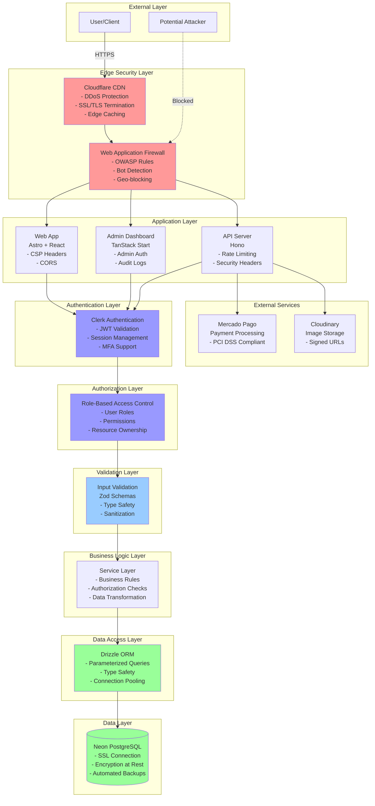
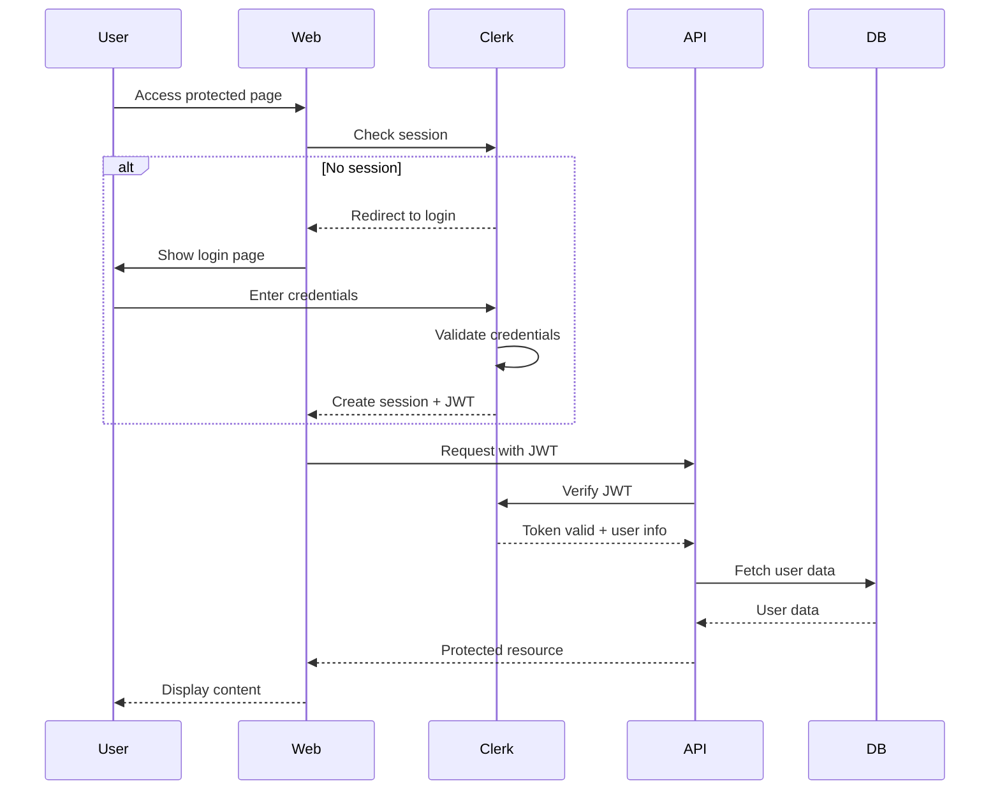

# Security Overview

## Table of Contents

- [Security Philosophy](#security-philosophy)
- [Threat Model](#threat-model)
- [Security Architecture](#security-architecture)
- [Security Controls](#security-controls)
- Authentication & Authorization
- [Data Protection](#data-protection)
- [Security Monitoring](#security-monitoring)

---

## Security Philosophy

### Defense in Depth

Hospeda implements a **multi-layered security approach** where each layer provides independent protection. If one layer is compromised, others continue to provide security:

**Layer 1: Network Security**

- Cloudflare CDN with DDoS protection
- Web Application Firewall (WAF)
- HTTPS/TLS 1.3 encryption
- Rate limiting at edge

**Layer 2: Application Security**

- Authentication (Clerk JWT validation)
- Authorization (RBAC + permissions)
- Input validation (Zod schemas)
- Output encoding (XSS prevention)

**Layer 3: Data Security**

- Database SSL connections
- Parameterized queries (Drizzle ORM)
- Data encryption at rest
- Secure secret management

**Layer 4: Infrastructure Security**

- Serverless security (Vercel, Fly.io)
- Environment isolation
- Automated security updates
- Backup and disaster recovery

### Principle of Least Privilege

Every user, service, and system component has **only the minimum permissions required** to perform its function:

**User Access:**

- Anonymous: Read-only public data (accommodation listings)
- Guest: Create bookings, manage own data
- Host: Manage own accommodations, view own bookings
- Admin: Full system access (limited to authorized personnel)

**Service Access:**

- API services: Limited database permissions
- Database connections: Read/write only to assigned schemas
- Third-party integrations: Scoped API keys
- CI/CD pipelines: Deployment-only permissions

**Example Implementation:**

```typescript
// Service layer enforces permissions
export class AccommodationService extends BaseCrudService {
  async update(input: UpdateAccommodationInput): Promise<Result<Accommodation>> {
    // Only accommodation owner or admin can update
    if (!this.canUpdate(this.ctx.actor, input.id)) {
      return Result.fail('Insufficient permissions');
    }

    return this.model.update(input);
  }

  private canUpdate(actor: Actor, accommodationId: string): boolean {
    // Admin can update any accommodation
    if (actor.hasRole('admin')) {
      return true;
    }

    // Host can only update own accommodations
    if (actor.hasRole('host')) {
      return this.isOwner(actor.id, accommodationId);
    }

    return false;
  }
}
```

### Secure by Default

All systems are configured with **security-first settings** out of the box:

**HTTP Security Headers:**

```typescript
// Automatically applied to all responses
app.use('*', secureHeaders({
  contentSecurityPolicy: {
    defaultSrc: ["'self'"],
    scriptSrc: ["'self'", 'https://clerk.com'],
    styleSrc: ["'self'", "'unsafe-inline'"],
    imgSrc: ["'self'", 'https://res.cloudinary.com', 'data:'],
    connectSrc: ["'self'", 'https://api.clerk.com'],
    fontSrc: ["'self'"],
    objectSrc: ["'none'"],
    mediaSrc: ["'self'"],
    frameSrc: ['https://clerk.com'],
  },
  strictTransportSecurity: 'max-age=31536000; includeSubDomains',
  xFrameOptions: 'DENY',
  xContentTypeOptions: 'nosniff',
  referrerPolicy: 'strict-origin-when-cross-origin',
  permissionsPolicy: {
    camera: [],
    microphone: [],
    geolocation: ["'self'"],
  },
}));
```

**CORS Configuration:**

```typescript
// Whitelist only authorized origins
app.use('*', cors({
  origin: (origin) => {
    const allowedOrigins = [
      'https://hospeda.com',
      'https://www.hospeda.com',
      'https://admin.hospeda.com',
      process.env.NODE_ENV === 'development' ? 'http://localhost:4321' : null,
    ].filter(Boolean);

    return allowedOrigins.includes(origin) ? origin : allowedOrigins[0];
  },
  credentials: true,
  allowMethods: ['GET', 'POST', 'PUT', 'PATCH', 'DELETE'],
  allowHeaders: ['Content-Type', 'Authorization'],
  maxAge: 86400, // 24 hours
}));
```

**Rate Limiting:**

```typescript
// Different limits for different endpoint types
import { rateLimiter } from 'hono-rate-limiter';

// Public endpoints: 60 requests/minute
app.use('/api/public/*', rateLimiter({
  windowMs: 60 * 1000, // 1 minute
  limit: 60,
  standardHeaders: 'draft-7',
  keyGenerator: (c) => c.req.header('x-forwarded-for') || 'unknown',
}));

// Authenticated endpoints: 300 requests/minute
app.use('/api/*', rateLimiter({
  windowMs: 60 * 1000,
  limit: 300,
  keyGenerator: (c) => c.get('userId') || c.req.header('x-forwarded-for') || 'unknown',
}));

// Authentication endpoints: 5 attempts/minute (brute force protection)
app.use('/api/auth/*', rateLimiter({
  windowMs: 60 * 1000,
  limit: 5,
  keyGenerator: (c) => c.req.header('x-forwarded-for') || 'unknown',
}));
```

### Zero Trust Architecture

Hospeda follows a **"never trust, always verify"** approach:

**Every Request is Authenticated:**

```typescript
// Authentication middleware verifies JWT on every protected route
export const requireAuth = createMiddleware(async (c, next) => {
  const token = c.req.header('Authorization')?.replace('Bearer ', '');

  if (!token) {
    return c.json({ error: 'Authentication required' }, 401);
  }

  try {
    // Verify JWT with Clerk
    const payload = await verifyToken(token, {
      secretKey: process.env.CLERK_SECRET_KEY!,
    });

    // Set authenticated user context
    c.set('userId', payload.sub);
    c.set('sessionId', payload.sid);

    await next();
  } catch (error) {
    return c.json({ error: 'Invalid or expired token' }, 401);
  }
});
```

**Every Action is Authorized:**

```typescript
// Permission checks at multiple layers
export const requirePermission = (permission: Permission) => {
  return createMiddleware(async (c, next) => {
    const userId = c.get('userId');

    // Get user's roles and permissions from Clerk
    const user = await clerkClient.users.getUser(userId);
    const userPermissions = getUserPermissions(user);

    if (!userPermissions.includes(permission)) {
      return c.json({ error: 'Insufficient permissions' }, 403);
    }

    await next();
  });
};

// Usage
app.delete(
  '/api/accommodations/:id',
  requireAuth,
  requirePermission('accommodation:delete'),
  async (c) => {
    // Handler code
  }
);
```

**All Data is Validated:**

```typescript
// Input validation on every endpoint
import { zValidator } from '@hono/zod-validator';
import { createAccommodationSchema } from '@repo/schemas';

app.post(
  '/api/accommodations',
  requireAuth,
  zValidator('json', createAccommodationSchema),
  async (c) => {
    // data is guaranteed to be valid
    const data = c.req.valid('json');
    // ...
  }
);
```

---

## Threat Model

### Assets to Protect

**Primary Assets:**

1. **User Personal Information (PII)**
   - Names, emails, phone numbers
   - Addresses (billing, accommodation locations)
   - Profile photos
   - Authentication credentials (managed by Clerk)
   - Session tokens and refresh tokens

1. **Financial Data**
   - Payment information (tokenized via Mercado Pago)
   - Transaction history
   - Booking prices and fees
   - Payout information (for hosts)

1. **Business Data**
   - Accommodation listings and details
   - Booking records and reservations
   - Reviews and ratings
   - Availability calendars
   - Pricing strategies

1. **System Assets**
   - API keys and secrets
   - Database credentials
   - OAuth tokens
   - SSL certificates
   - Source code (private repository)

### Threat Actors

**External Attackers:**

- **Motivation**: Financial gain, data theft, reputation damage
- **Capabilities**: Automated scanning, exploit tools, social engineering
- **Targets**: Payment processing, user accounts, business data

**Automated Bots:**

- **Motivation**: Scraping data, resource abuse, spam
- **Capabilities**: High-volume requests, credential stuffing, inventory hoarding
- **Targets**: Public listings, search endpoints, booking system

**Malicious Users:**

- **Motivation**: Fraud, service abuse, competitive intelligence
- **Capabilities**: Account access, API knowledge, business logic exploitation
- **Targets**: Booking system, payment flows, review manipulation

**Insider Threats:**

- **Motivation**: Varies (financial, revenge, curiosity)
- **Capabilities**: System access, internal knowledge, privilege abuse
- **Targets**: User data, financial records, system configurations

**Supply Chain Attackers:**

- **Motivation**: Widespread compromise, data exfiltration
- **Capabilities**: Package poisoning, dependency exploitation
- **Targets**: npm packages, third-party services, build pipeline

### Attack Vectors

**Injection Attacks:**

1. **SQL Injection**
   - **Vector**: Malicious SQL in user inputs
   - **Target**: Database queries
   - **Impact**: Data breach, data manipulation, authentication bypass
   - **Mitigation**: Parameterized queries (Drizzle ORM), input validation

1. **Cross-Site Scripting (XSS)**
   - **Vector**: Malicious JavaScript in user content
   - **Target**: Web pages viewed by other users
   - **Impact**: Session hijacking, credential theft, malware distribution
   - **Mitigation**: Output encoding, CSP headers, React auto-escaping

1. **Server-Side Request Forgery (SSRF)**
   - **Vector**: Attacker-controlled URLs
   - **Target**: Internal services, cloud metadata endpoints
   - **Impact**: Internal network access, credential theft
   - **Mitigation**: URL validation, allowlist, network segmentation

**Authentication/Authorization Attacks:**

1. **Credential Stuffing**
   - **Vector**: Leaked credentials from other breaches
   - **Target**: Login endpoints
   - **Impact**: Account takeover
   - **Mitigation**: Rate limiting, MFA (Clerk), breach detection

1. **Session Hijacking**
   - **Vector**: Stolen session tokens
   - **Target**: Authenticated sessions
   - **Impact**: Unauthorized access
   - **Mitigation**: Secure cookies, short expiration, token rotation

1. **Privilege Escalation**
   - **Vector**: Authorization logic flaws
   - **Target**: Role/permission checks
   - **Impact**: Unauthorized actions
   - **Mitigation**: RBAC, permission validation at service layer

**Data Exposure:**

1. **Sensitive Data in Responses**
   - **Vector**: Over-fetching, verbose errors
   - **Target**: API responses
   - **Impact**: Information disclosure
   - **Mitigation**: Response filtering, generic error messages

1. **Insecure Direct Object References (IDOR)**
   - **Vector**: Predictable IDs, missing authorization
   - **Target**: Resource endpoints
   - **Impact**: Unauthorized data access
   - **Mitigation**: UUIDs, ownership validation

1. **Information Leakage**
   - **Vector**: Logs, error messages, debug info
   - **Target**: Application logs, stack traces
   - **Impact**: System reconnaissance
   - **Mitigation**: Log sanitization, error handling

**Denial of Service:**

1. **Resource Exhaustion**
   - **Vector**: High-volume requests
   - **Target**: API endpoints, database
   - **Impact**: Service unavailability
   - **Mitigation**: Rate limiting, request size limits, caching

1. **Application-Level DoS**
   - **Vector**: Expensive operations
   - **Target**: Complex queries, file processing
   - **Impact**: Performance degradation
   - **Mitigation**: Timeout limits, async processing, monitoring

### Risk Assessment

| Threat | Likelihood | Impact | Risk Level | Priority |
|--------|-----------|--------|------------|----------|
| SQL Injection | Low | Critical | Medium | P1 |
| XSS | Medium | High | High | P1 |
| Authentication Bypass | Low | Critical | Medium | P1 |
| IDOR | Medium | High | High | P1 |
| Credential Stuffing | Medium | High | High | P2 |
| SSRF | Low | Medium | Low | P3 |
| Rate Limit Bypass | High | Medium | High | P2 |
| Information Disclosure | Medium | Medium | Medium | P2 |
| CSRF | Low | Medium | Low | P3 |
| Dependency Vulnerability | High | Varies | High | P1 |

**Priority Levels:**

- **P1 (Critical)**: Immediate action required
- **P2 (High)**: Address within current sprint
- **P3 (Medium)**: Address within quarter

---

## Security Architecture

### High-Level Security Architecture



### Network Security

**TLS/HTTPS Configuration:**

```typescript
// Enforced via Vercel/Fly.io platform
// Automatic HTTPS redirect
// TLS 1.3 minimum
// HSTS header: max-age=31536000; includeSubDomains; preload
```

**DNS Security:**

- DNSSEC enabled
- Cloudflare DNS with DDoS protection
- CAA records restrict certificate issuance

**CDN Security:**

- Cloudflare Pro plan
- WAF with OWASP Core Rule Set
- DDoS protection (Layer 3/4/7)
- Bot detection and mitigation
- Geographic restrictions (if needed)

### Application Security

**Security Headers:**

```typescript
// Implemented in API middleware
export const securityHeaders = {
  // Content Security Policy
  'Content-Security-Policy': [
    "default-src 'self'",
    "script-src 'self' https://clerk.com",
    "style-src 'self' 'unsafe-inline'", // Required for Tailwind
    "img-src 'self' https://res.cloudinary.com data:",
    "connect-src 'self' https://api.clerk.com https://api.mercadopago.com",
    "font-src 'self'",
    "object-src 'none'",
    "base-uri 'self'",
    "form-action 'self'",
    "frame-ancestors 'none'",
    "upgrade-insecure-requests",
  ].join('; '),

  // HSTS
  'Strict-Transport-Security': 'max-age=31536000; includeSubDomains; preload',

  // Prevent clickjacking
  'X-Frame-Options': 'DENY',

  // Prevent MIME sniffing
  'X-Content-Type-Options': 'nosniff',

  // XSS protection (legacy browsers)
  'X-XSS-Protection': '1; mode=block',

  // Referrer policy
  'Referrer-Policy': 'strict-origin-when-cross-origin',

  // Permissions policy
  'Permissions-Policy': 'camera=(), microphone=(), geolocation=(self)',
};
```

**CORS Configuration:**

```typescript
// Strict origin validation
const ALLOWED_ORIGINS = [
  'https://hospeda.com',
  'https://www.hospeda.com',
  'https://admin.hospeda.com',
  ...(process.env.NODE_ENV === 'development'
    ? ['http://localhost:4321', 'http://localhost:4322']
    : []
  ),
];

export const corsConfig = {
  origin: (origin: string) => {
    if (!origin) return ALLOWED_ORIGINS[0]; // Same-origin requests
    if (ALLOWED_ORIGINS.includes(origin)) return origin;
    throw new Error('CORS policy violation');
  },
  credentials: true,
  allowMethods: ['GET', 'POST', 'PUT', 'PATCH', 'DELETE', 'OPTIONS'],
  allowHeaders: ['Content-Type', 'Authorization'],
  exposeHeaders: ['X-Request-Id', 'X-RateLimit-Remaining'],
  maxAge: 86400, // 24 hours
};
```

**Rate Limiting:**

```typescript
// Tiered rate limiting strategy
import { RateLimiterMemory } from 'rate-limiter-flexible';

// Public endpoints: 60 req/min per IP
const publicLimiter = new RateLimiterMemory({
  points: 60,
  duration: 60,
  blockDuration: 300, // Block for 5 minutes if exceeded
});

// Authenticated endpoints: 300 req/min per user
const authLimiter = new RateLimiterMemory({
  points: 300,
  duration: 60,
  blockDuration: 60,
});

// Write operations: 30 req/min per user
const writeLimiter = new RateLimiterMemory({
  points: 30,
  duration: 60,
  blockDuration: 120,
});

// Login attempts: 5 req/min per IP
const loginLimiter = new RateLimiterMemory({
  points: 5,
  duration: 60,
  blockDuration: 900, // Block for 15 minutes
});
```

### Database Security

**Connection Security:**

```typescript
// SSL/TLS required for all connections
import { neon, neonConfig } from '@neondatabase/serverless';

neonConfig.fetchConnectionCache = true;

export const db = drizzle(neon(process.env.DATABASE_URL!, {
  ssl: true, // Enforce SSL
  connectionTimeoutMillis: 5000,
  // Connection pooling handled by Neon
}));
```

**Query Security:**

```typescript
// Drizzle ORM prevents SQL injection via parameterized queries
// Example: Safe query
const user = await db
  .select()
  .from(users)
  .where(eq(users.email, userInput)); // ✅ Parameterized

// NEVER do this:
// const user = await db.execute(`SELECT * FROM users WHERE email = '${userInput}'`); // ❌ SQL Injection!
```

**Access Control:**

- Database user has minimal permissions (no DDL in production)
- Read-only replicas for analytics queries
- Connection pooling limits concurrent connections
- Automated backups with point-in-time recovery

### Infrastructure Security

**Vercel Security (Web + Admin):**

- Automatic HTTPS with TLS 1.3
- DDoS protection
- Serverless functions (isolated execution)
- Environment variable encryption
- Edge network (>100 global locations)
- WAF integration

**Fly.io Security (API):**

- Private networking (WireGuard)
- Isolated VMs per deployment
- Automatic SSL certificates
- Secrets management (encrypted)
- Health checks and auto-scaling
- Firewall rules

**Secrets Management:**

```bash
# GitHub Secrets (CI/CD)
CLERK_SECRET_KEY
DATABASE_URL
MERCADO_PAGO_ACCESS_TOKEN

# Vercel Environment Variables (encrypted)
NEXT_PUBLIC_CLERK_PUBLISHABLE_KEY
CLERK_SECRET_KEY
DATABASE_URL

# Fly.io Secrets (encrypted at rest)
fly secrets set DATABASE_URL="postgresql://..."
fly secrets set CLERK_SECRET_KEY="sk_..."
```

---

## Security Controls

Security controls are categorized into **preventive**, **detective**, and **corrective** measures.

### Preventive Controls

Controls that **prevent** security incidents from occurring:

#### Authentication Controls

**JWT Token Validation:**

```typescript
import { verifyToken } from '@clerk/backend';

export const authenticateRequest = async (token: string) => {
  try {
    const payload = await verifyToken(token, {
      secretKey: process.env.CLERK_SECRET_KEY!,
      // Verify token hasn't expired
      // Verify token signature
      // Verify issuer
    });

    return { success: true, userId: payload.sub };
  } catch (error) {
    return { success: false, error: 'Invalid token' };
  }
};
```

**Session Security:**

- HttpOnly cookies (prevent XSS access)
- Secure flag (HTTPS only)
- SameSite=Strict (CSRF protection)
- Short expiration (1 hour)
- Refresh token rotation

#### Authorization Controls

**Role-Based Access Control (RBAC):**

```typescript
// User roles
export enum UserRole {
  GUEST = 'guest',
  HOST = 'host',
  ADMIN = 'admin',
}

// Permission checks
export const hasPermission = (
  user: User,
  action: Action,
  resource: Resource
): boolean => {
  // Admin has all permissions
  if (user.role === UserRole.ADMIN) {
    return true;
  }

  // Host can manage own accommodations
  if (user.role === UserRole.HOST && action === 'update' && resource.type === 'accommodation') {
    return resource.ownerId === user.id;
  }

  // Guest can create bookings
  if (user.role === UserRole.GUEST && action === 'create' && resource.type === 'booking') {
    return true;
  }

  return false;
};
```

**Resource Ownership Validation:**

```typescript
export class AccommodationService {
  async update(input: UpdateAccommodationInput): Promise<Result<Accommodation>> {
    // Fetch existing accommodation
    const existing = await this.model.findById(input.id);
    if (!existing) {
      return Result.fail('Accommodation not found');
    }

    // Verify ownership (unless admin)
    if (!this.ctx.actor.isAdmin() && existing.ownerId !== this.ctx.actor.id) {
      return Result.fail('Unauthorized: Not accommodation owner');
    }

    // Proceed with update
    return this.model.update(input);
  }
}
```

#### Input Validation Controls

**Zod Schema Validation:**

```typescript
import { z } from 'zod';

export const createAccommodationSchema = z.object({
  title: z.string()
    .min(10, 'Title must be at least 10 characters')
    .max(100, 'Title must be at most 100 characters')
    .regex(/^[a-zA-Z0-9\s\-,.']+$/, 'Title contains invalid characters'),

  description: z.string()
    .min(50, 'Description must be at least 50 characters')
    .max(2000, 'Description too long'),

  pricePerNight: z.number()
    .positive('Price must be positive')
    .max(100000, 'Price exceeds maximum')
    .multipleOf(0.01, 'Invalid price format'),

  maxGuests: z.number()
    .int('Must be an integer')
    .min(1, 'Must accommodate at least 1 guest')
    .max(20, 'Cannot exceed 20 guests'),

  location: z.object({
    address: z.string().min(10).max(200),
    city: z.string().min(2).max(100),
    state: z.string().length(2, 'Use 2-letter state code'),
    zipCode: z.string().regex(/^\d{4}$/, 'Invalid ZIP code'),
    latitude: z.number().min(-90).max(90),
    longitude: z.number().min(-180).max(180),
  }),

  amenities: z.array(z.string()).max(20, 'Too many amenities'),

  images: z.array(z.string().url('Invalid image URL')).min(1).max(10),
});
```

**Sanitization:**

```typescript
import DOMPurify from 'isomorphic-dompurify';

export const sanitizeHTML = (input: string): string => {
  return DOMPurify.sanitize(input, {
    ALLOWED_TAGS: ['b', 'i', 'em', 'strong', 'a', 'p', 'br'],
    ALLOWED_ATTR: ['href'],
  });
};
```

#### Output Encoding Controls

**XSS Prevention:**

```typescript
// React automatically escapes output
const AccommodationTitle = ({ title }: { title: string }) => {
  // Safe: React escapes special characters
  return <h1>{title}</h1>;

  // NEVER do this:
  // return <h1 dangerouslySetInnerHTML={{ __html: title }} />;
};

// API responses are JSON (auto-encoded)
app.get('/api/accommodations/:id', async (c) => {
  const accommodation = await getAccommodation(c.req.param('id'));

  // Safe: Hono JSON encoding
  return c.json(accommodation);
});
```

### Detective Controls

Controls that **detect** security incidents when they occur:

#### Logging

**Structured Security Logging:**

```typescript
import { logger } from '@repo/logger';

// Authentication failures
logger.warn('Authentication failed', {
  event: 'auth.failed',
  ip: req.headers['x-forwarded-for'],
  userAgent: req.headers['user-agent'],
  timestamp: new Date().toISOString(),
});

// Authorization failures
logger.warn('Authorization denied', {
  event: 'authz.denied',
  userId: user.id,
  resource: 'accommodation',
  action: 'delete',
  resourceId: accommodationId,
});

// Suspicious activity
logger.error('Rate limit exceeded', {
  event: 'security.rate_limit',
  ip: clientIp,
  endpoint: req.path,
  attempts: rateLimitInfo.attempts,
});

// Data access
logger.info('PII accessed', {
  event: 'data.pii_access',
  userId: actor.id,
  targetUserId: targetUser.id,
  reason: 'User profile view',
});
```

**What NOT to Log:**

- Passwords or authentication credentials
- Session tokens or API keys
- Credit card numbers or payment details
- Full PII (use hashed IDs)
- Sensitive business data

#### Monitoring & Alerting

**Key Security Metrics:**

```typescript
// Track authentication failures
const authFailureRate = new Metric('auth.failure_rate');

// Alert if > 10 failures/minute from same IP
if (authFailureRate.get(ip) > 10) {
  alert('Potential brute force attack', { ip });
}

// Track authorization denials
const authzDenialRate = new Metric('authz.denial_rate');

// Alert if user repeatedly attempts unauthorized access
if (authzDenialRate.get(userId) > 5) {
  alert('Potential privilege escalation attempt', { userId });
}

// Track rate limit hits
const rateLimitHits = new Metric('rate_limit.hits');

// Alert if widespread rate limiting (potential DDoS)
if (rateLimitHits.total() > 1000) {
  alert('High rate limit hits - potential DDoS', {});
}
```

**Anomaly Detection:**

- Unusual login locations
- Off-hours admin access
- Bulk data exports
- Repeated failed authorization checks
- Sudden spike in API errors

### Corrective Controls

Controls that **correct** or recover from security incidents:

#### Incident Response

**Automated Response:**

```typescript
// Auto-block IPs with excessive failed logins
if (authFailures.get(ip) > 10) {
  await firewallService.blockIP(ip, { duration: '1h', reason: 'Brute force' });
  logger.warn('IP auto-blocked', { ip, reason: 'Brute force' });
}

// Auto-revoke suspicious sessions
if (detectSuspiciousActivity(session)) {
  await clerkClient.sessions.revokeSession(session.id);
  await notifyUser(session.userId, 'Session revoked due to suspicious activity');
}

// Auto-rate limit on spike
if (requestRate.get(userId) > threshold) {
  await applyStrictRateLimit(userId, { duration: '10m' });
}
```

#### Backup & Recovery

**Database Backups:**

- Automated daily backups (Neon)
- Point-in-time recovery (7 days)
- Encrypted backup storage
- Regular restore testing

**Disaster Recovery:**

```typescript
// Infrastructure as Code (IaC)
// Quick redeployment from Git

// Secrets recovery
// All secrets in secure vaults (GitHub, Vercel, Fly.io)

// Data recovery
// Restore from Neon backup
// Replay transaction logs if needed
```

#### Patch Management

**Dependency Updates:**

```bash
# Automated security updates (Dependabot)
# Weekly dependency audit
pnpm audit

# Critical patches: immediate deployment
# High severity: within 7 days
# Medium/low: next release cycle
```

---

## Authentication & Authorization

### Clerk Integration

Hospeda uses **Clerk** for authentication, providing:

- OAuth providers (Google, GitHub, etc.)
- Email/password authentication
- Magic link authentication
- Multi-factor authentication (MFA)
- Session management
- User management API
- Webhooks for user events

#### Authentication Flow



#### JWT Token Structure

```json
{
  "header": {
    "alg": "RS256",
    "typ": "JWT",
    "kid": "clerk_key_id"
  },
  "payload": {
    "sub": "user_2AbCdEfGh123456",
    "sid": "sess_2XyZaBcDeF789012",
    "iat": 1705334400,
    "exp": 1705338000,
    "iss": "https://clerk.hospeda.com",
    "aud": "https://api.hospeda.com"
  },
  "signature": "..."
}
```

#### Clerk Configuration

```typescript
// apps/api/src/middleware/auth.ts
import { ClerkClient } from '@clerk/backend';

const clerkClient = new ClerkClient({
  secretKey: process.env.CLERK_SECRET_KEY!,
  publishableKey: process.env.CLERK_PUBLISHABLE_KEY!,
});

export const requireAuth = createMiddleware(async (c, next) => {
  const token = c.req.header('Authorization')?.replace('Bearer ', '');

  if (!token) {
    return c.json({ error: 'Authentication required' }, 401);
  }

  try {
    const payload = await verifyToken(token, {
      secretKey: process.env.CLERK_SECRET_KEY!,
    });

    // Fetch full user data
    const user = await clerkClient.users.getUser(payload.sub);

    // Set context
    c.set('userId', user.id);
    c.set('user', user);
    c.set('sessionId', payload.sid);

    await next();
  } catch (error) {
    logger.warn('Token verification failed', { error });
    return c.json({ error: 'Invalid or expired token' }, 401);
  }
});
```

### Role-Based Access Control (RBAC)

#### User Roles

```typescript
export enum UserRole {
  GUEST = 'guest',       // Can book accommodations
  HOST = 'host',         // Can manage accommodations
  ADMIN = 'admin',       // Full system access
}

// Stored in Clerk user metadata
interface ClerkUser {
  id: string;
  publicMetadata: {
    role: UserRole;
  };
}
```

#### Permission System

```typescript
// Permission format: resource:action
export type Permission =
  | 'accommodation:create'
  | 'accommodation:read'
  | 'accommodation:update'
  | 'accommodation:delete'
  | 'booking:create'
  | 'booking:read'
  | 'booking:update'
  | 'booking:cancel'
  | 'user:read'
  | 'user:update'
  | 'admin:*';

// Role permissions mapping
const ROLE_PERMISSIONS: Record<UserRole, Permission[]> = {
  [UserRole.GUEST]: [
    'accommodation:read',
    'booking:create',
    'booking:read',
    'booking:cancel',
    'user:read',
    'user:update',
  ],
  [UserRole.HOST]: [
    'accommodation:create',
    'accommodation:read',
    'accommodation:update',
    'accommodation:delete',
    'booking:read',
    'user:read',
    'user:update',
  ],
  [UserRole.ADMIN]: ['admin:*'],
};

export const hasPermission = (
  user: ClerkUser,
  permission: Permission
): boolean => {
  const role = user.publicMetadata.role;

  // Admin has all permissions
  if (role === UserRole.ADMIN) {
    return true;
  }

  const permissions = ROLE_PERMISSIONS[role];
  return permissions.includes(permission);
};
```

#### Authorization Middleware

```typescript
export const requirePermission = (permission: Permission) => {
  return createMiddleware(async (c, next) => {
    const user = c.get('user');

    if (!hasPermission(user, permission)) {
      logger.warn('Permission denied', {
        userId: user.id,
        permission,
        userRole: user.publicMetadata.role,
      });

      return c.json({ error: 'Insufficient permissions' }, 403);
    }

    await next();
  });
};

// Usage
app.delete(
  '/api/accommodations/:id',
  requireAuth,
  requirePermission('accommodation:delete'),
  async (c) => {
    // Only users with accommodation:delete permission reach here
  }
);
```

#### Resource Ownership

```typescript
// Additional check: verify resource ownership
export const requireOwnership = (resourceType: string) => {
  return createMiddleware(async (c, next) => {
    const userId = c.get('userId');
    const resourceId = c.req.param('id');

    // Fetch resource
    const resource = await db
      .select()
      .from(getTable(resourceType))
      .where(eq(getTable(resourceType).id, resourceId))
      .get();

    if (!resource) {
      return c.json({ error: 'Resource not found' }, 404);
    }

    // Check ownership (admins bypass)
    const user = c.get('user');
    if (user.publicMetadata.role !== UserRole.ADMIN && resource.ownerId !== userId) {
      logger.warn('Ownership check failed', {
        userId,
        resourceType,
        resourceId,
        ownerId: resource.ownerId,
      });

      return c.json({ error: 'Not authorized to access this resource' }, 403);
    }

    c.set('resource', resource);
    await next();
  });
};

// Usage
app.put(
  '/api/accommodations/:id',
  requireAuth,
  requirePermission('accommodation:update'),
  requireOwnership('accommodation'),
  async (c) => {
    // User is authenticated, has permission, and owns the resource
    const accommodation = c.get('resource');
    // ...
  }
);
```

### Session Management

**Session Security:**

- Sessions stored in Clerk (server-side)
- Short-lived JWT tokens (1 hour)
- Refresh tokens for seamless renewal
- httpOnly cookies prevent XSS access
- Secure flag ensures HTTPS only
- SameSite=Strict prevents CSRF

**Session Lifecycle:**

```typescript
// Login creates session
const session = await clerkClient.sessions.createSession({
  userId: user.id,
  expiresAt: Date.now() + 3600000, // 1 hour
});

// Session refresh (automatic via Clerk)
// Old token expires, new token issued

// Logout revokes session
await clerkClient.sessions.revokeSession(sessionId);

// Suspicious activity revokes all sessions
await clerkClient.users.revokeAllSessions(userId);
```

---

## Data Protection

### Data Classification

**Public Data:**

- Accommodation titles and descriptions
- Public reviews and ratings
- Accommodation locations (city level)

**Internal Data:**

- User roles and permissions
- Booking statistics
- System configurations

**Confidential Data:**

- User PII (names, emails, phone numbers)
- Precise accommodation addresses
- Booking details
- Review author identity (if anonymous)

**Restricted Data:**

- Authentication credentials (managed by Clerk)
- Payment information (tokenized via Mercado Pago)
- API keys and secrets
- Audit logs

### Encryption

**Data in Transit:**

- TLS 1.3 for all connections
- HTTPS enforced (automatic redirect)
- Certificate pinning (where applicable)
- Secure WebSocket (wss://)

**Data at Rest:**

- Database encryption (Neon platform)
- Encrypted backups
- Encrypted environment variables (Vercel, Fly.io)
- Encrypted secret storage (GitHub Secrets)

**Application-Level Encryption:**

```typescript
// Sensitive data encryption (if needed)
import { createCipheriv, createDecipheriv, randomBytes } from 'crypto';

const ALGORITHM = 'aes-256-gcm';
const KEY = Buffer.from(process.env.ENCRYPTION_KEY!, 'hex');

export const encrypt = (text: string): string => {
  const iv = randomBytes(16);
  const cipher = createCipheriv(ALGORITHM, KEY, iv);

  let encrypted = cipher.update(text, 'utf8', 'hex');
  encrypted += cipher.final('hex');

  const authTag = cipher.getAuthTag();

  // Return: iv + authTag + encrypted
  return iv.toString('hex') + authTag.toString('hex') + encrypted;
};

export const decrypt = (encrypted: string): string => {
  const iv = Buffer.from(encrypted.slice(0, 32), 'hex');
  const authTag = Buffer.from(encrypted.slice(32, 64), 'hex');
  const data = encrypted.slice(64);

  const decipher = createDecipheriv(ALGORITHM, KEY, iv);
  decipher.setAuthTag(authTag);

  let decrypted = decipher.update(data, 'hex', 'utf8');
  decrypted += decipher.final('utf8');

  return decrypted;
};
```

### PII Handling

**Minimization:**

- Collect only necessary PII
- Use Clerk for authentication (they manage credentials)
- Avoid storing payment details (use Mercado Pago tokens)

**Access Controls:**

- PII access logged
- Limited to authorized personnel
- Admin audit logs

**Anonymization:**

```typescript
// Anonymize for analytics
export const anonymizeUser = (user: User) => ({
  id: hashUserId(user.id), // One-way hash
  role: user.role,
  createdAt: user.createdAt,
  // No name, email, phone, etc.
});

// Anonymize logs
logger.info('Booking created', {
  userId: hash(user.id), // ✅ Hashed
  bookingId: booking.id,
  // No PII
});
```

### Data Retention

**Retention Policies:**

- Active users: Retained indefinitely
- Deleted accounts: PII removed after 30 days
- Booking records: Retained for 7 years (tax compliance)
- Audit logs: Retained for 1 year
- Error logs: Retained for 90 days

**Automated Deletion:**

```typescript
// Scheduled job: delete old data
export const cleanupOldData = async () => {
  // Delete accounts marked for deletion > 30 days ago
  await db
    .delete(users)
    .where(and(
      eq(users.deletedAt, notNull()),
      lt(users.deletedAt, thirtyDaysAgo())
    ));

  // Delete old error logs
  await db
    .delete(errorLogs)
    .where(lt(errorLogs.createdAt, ninetyDaysAgo()));

  logger.info('Data cleanup completed');
};
```

---

## Security Monitoring

### Logging Strategy

**What to Log:**

- Authentication events (login, logout, failures)
- Authorization events (access grants, denials)
- Data access (especially PII)
- Administrative actions
- Security events (rate limits, blocks)
- Errors and exceptions
- Performance metrics

**Structured Logging:**

```typescript
import { logger } from '@repo/logger';

// Good: structured, searchable
logger.info('User logged in', {
  event: 'auth.login',
  userId: user.id,
  method: 'oauth',
  provider: 'google',
  ip: clientIp,
  userAgent: req.headers['user-agent'],
  timestamp: new Date().toISOString(),
});

// Bad: unstructured
logger.info(`User ${user.id} logged in via Google from ${clientIp}`);
```

### Security Metrics

**Key Metrics:**

- Failed authentication attempts (per IP, per user)
- Authorization denials (per user, per resource)
- Rate limit hits (per endpoint, per user)
- API error rates (4xx, 5xx)
- Response times (detect DoS)
- Database query times (detect SQL injection attempts)

### Alerting

**Alert Thresholds:**

```typescript
// High-priority alerts
- >10 failed logins from same IP in 1 minute
- >5 authorization denials for same user in 5 minutes
- >100 rate limit hits in 1 minute (potential DDoS)
- Any database connection errors
- Any authentication service downtime

// Medium-priority alerts
- >50 failed logins globally in 1 hour
- Error rate >5% for any endpoint
- Response time >2s for >10% of requests

// Low-priority alerts
- Dependency vulnerabilities detected (Dependabot)
- SSL certificate expiring in <30 days (should auto-renew)
```

---

**Last Updated**: 2024-01-15
**Next Review**: 2024-04-15
**Version**: 1.0.0
