# @repo/service-core

**The robust, type-safe, and extensible service layer for all business logic in the monorepo.**

---

## 🗺️ Service & Dependency Roadmap

**Legend:**

- ✅ Implemented
- ⏳ Pending

> Update this roadmap by marking each service as ✅ when it is implemented and tested. Keep the diagram and the list in sync.

```mermaid
flowchart TD
  %% Root
  A["UserService ⏳"]
  B["DestinationService ⏳"]
  C["AccommodationService ✅"]
  D["EventService ⏳"]
  E["PostService ⏳"]
  F["TagService ⏳"]

  %% Sub-entities and pivots
  B --> B1["AttractionService ⏳"]
  B --> B2["DestinationReviewService ⏳"]
  B --> B3["DestinationAttractionService (pivot) ⏳"]
  C --> C1["AccommodationReviewService ⏳"]
  C --> C2["AccommodationFaqService ⏳"]
  C --> C3["AccommodationIaDataService ⏳"]
  C --> C4["AmenityService ⏳"]
  C --> C5["FeatureService ⏳"]
  C --> C6["AccommodationAmenityService (pivot) ⏳"]
  C --> C7["AccommodationFeatureService (pivot) ⏳"]
  D --> D1["EventLocationService ⏳"]
  D --> D2["EventOrganizerService ⏳"]
  E --> E1["PostSponsorService ⏳"]
  E --> E2["PostSponsorshipService (pivot) ⏳"]
  F --> F1["EntityTagService (pivot, polymorphic) ⏳"]
  A --> A1["UserBookmarkService ⏳"]
  A --> A2["UserPermissionService (pivot) ⏳"]
  A --> A3["RolePermissionService (pivot) ⏳"]

  %% Cross-domain relationships
  B -- "has many" --> C
  C -- "taggable" --> F1
  B -- "taggable" --> F1
  D -- "taggable" --> F1
  E -- "taggable" --> F1
  C -- "reviewed by" --> C1
  B -- "reviewed by" --> B2
  A -- "bookmarks" --> A1
  A -- "permissions" --> A2
  A -- "roles" --> A3
  E -- "sponsored by" --> E1
  E -- "sponsorships" --> E2
  B -- "attractions" --> B1
  B -- "attraction links" --> B3
  C -- "amenities" --> C4
  C -- "features" --> C5
  C -- "amenity links" --> C6
  C -- "feature links" --> C7
  D -- "locations" --> D1
  D -- "organizers" --> D2
```



---

## How to update the roadmap?

- When you implement and test a service, change its status to ✅ in the diagram and the list.
- Keep homogeneity and follow the recommended order to facilitate dependencies and cross-testing.
- If you add new domains or relationships, update the diagram and the legend accordingly.

---

## 🚀 What is `@repo/service-core`?

This package provides a standardized, type-safe, and extensible foundation for implementing all domain services (e.g., `AccommodationService`, `DestinationService`) in the monorepo. It enforces best practices for:

- **TypeScript strictness** (no `any`, always strong types)
- **Zod-based validation** (schemas and types always in sync)
- **Homogeneous error handling** (all errors are structured and predictable)
- **Extensible, DRY, and testable code**
- **Permission and lifecycle hooks**
- **Centralized, reusable test helpers and factories**

---

## 🏛️ Architectural Principles

- **BaseService Pattern:** All services extend a generic, abstract `BaseService` that provides a robust pipeline for validation, permissions, normalization, hooks, and error handling.
- **Zod + TypeScript:** All input/output types are derived from Zod schemas, ensuring runtime and compile-time safety.
- **Homogeneity:** All services, factories, and tests follow the same patterns and naming conventions.
- **Testability:** Unified builders, mocks, and helpers for DRY, robust, and type-safe tests.
- **RO-RO Pattern:** All public methods receive and return objects (never primitives or tuples).
- **SOLID Principles:** Services are single-responsibility, open for extension, closed for modification, and favor composition over inheritance.

---

## 📦 Quick Start

### 1. Install

```bash
pnpm add @repo/service-core
```

### 2. Create a Service (Minimal Example)

```ts
import { BaseService } from '@repo/service-core';
import { MyEntityModel } from '@repo/db';
import { MyEntityType, NewMyEntityInputType, UpdateMyEntityInputType } from '@repo/types';
import { MyEntityInputSchema } from './my-entity.schemas';

export class MyEntityService extends BaseService<
  MyEntityType,
  NewMyEntityInputType,
  UpdateMyEntityInputType,
  unknown,
  MyEntityType[]
> {
  protected model = new MyEntityModel();
  protected inputSchema = MyEntityInputSchema;

  // Permissions: use base helpers unless you need custom logic
  protected async canViewEntity(actor, entity) {
    return this.defaultCanView(actor, entity);
  }
  // ...other permission hooks

  // Public methods: use runWithLoggingAndValidation for all
  public async getById(input) {
    return this.runWithLoggingAndValidation('getById', input, async (_actor, input) => {
      return (await this.getByField('id', input.id, input)).data!;
    });
  }
}
```

### 3. Write Robust Tests

See [`test/README.testing.md`](./test/README.testing.md) for full patterns, helpers, and coverage checklist.

---

## 📚 Documentation & Guides

- [Service Implementation Guide](./src/services/README.service.md)
- [Testing Guide](./test/README.testing.md)
- [BaseService API Reference](./src/base/base.service.ts)

---

## 🧩 Key Features

- **BaseService**: Generic, extensible, and DRY foundation for all services
- **Permission Management**: Standard and customizable permission hooks
- **Input Validation**: Zod-based, always in sync with TypeScript types
- **Centralized Logging**: Consistent, structured logs for all service actions
- **Error Handling**: All errors are structured, typed, and predictable
- **Unified Test Factories**: Builders for all entities, actors, and mocks
- **Extensible Patterns**: Easily add new services, methods, or helpers
- **Input Normalization (DestinationService):**
  - All input data for create, update, list, and view operations is normalized using dedicated functions (`normalizeCreateInput`, `normalizeUpdateInput`, etc.).
  - Ensures defaults (e.g., `visibility: 'PRIVATE'` if not provided) and future extensibility for data cleaning or transformation.
  - Example:

    ```ts
    import { normalizeCreateInput } from './src/services/destination/destination.normalizers';
    const normalized = normalizeCreateInput(input, actor);
    ```

- **Automatic Slug Generation:**
  - When creating a new destination, a unique slug is generated from the name using `generateDestinationSlug` in the `_beforeCreate` lifecycle hook.
  - Guarantees uniqueness by checking existing slugs in the database and appending a suffix if needed.
  - Example:

    ```ts
    // In DestinationService
    protected async _beforeCreate(data, actor) {
      const slug = await generateDestinationSlug(data.name);
      return { slug };
    }
    ```

  - See tests in `test/services/destination/normalizers.test.ts` for full coverage and edge cases.

---

## 🛠️ Usage Patterns

### Creating a Service

- Extend `BaseService` with correct type parameters
- Implement/override permission hooks as needed
- Use Zod schemas for all input validation
- Use `runWithLoggingAndValidation` for all public methods

### Using Validation

```ts
import { validateInput } from '@repo/service-core';
const result = validateInput(mySchema, input, 'context');
```

### Using Logging

```ts
import { logMethodStart, logMethodEnd } from '@repo/service-core';
logMethodStart('methodName', input, actor);
// ...
logMethodEnd('methodName', output);
```

### Service Method Implementation Convention

All public service methods **must** be implemented using `runWithLoggingAndValidation`. This ensures:

- Centralized logging for every method call
- Consistent error handling and result structure
- Automatic input validation and permission checks
- Extensibility for future cross-cutting concerns (e.g., tracing, auditing)

**Example:**

```ts
import type { ServiceInput, ServiceOutput } from '@repo/service-core';
import type { GetSummaryInput, DestinationSummary } from './destination.schemas';

public async getSummary(
  input: ServiceInput<GetSummaryInput>
): Promise<ServiceOutput<{ summary: DestinationSummary }>> {
  return this.runWithLoggingAndValidation('getSummary', input, async ({ actor, ...rest }) => {
    // ...main logic here
    return { summary: /* ... */ };
  });
}
```

**Never** implement public methods with direct try/catch, raw returns, or without logging/validation. Always use this pattern for homogeneity and maintainability.

### Service Method Signature Convention

All public service methods **must** adhere to the following signature:

- **Input:** A single parameter of type `ServiceInput<T>`
- **Output:** A `Promise<ServiceOutput<T>>`

This convention ensures:

- Homogeneous error handling and result structure
- Centralized and consistent logging
- Strong type safety and predictability
- Easy integration with permission and validation pipelines
- Seamless extensibility for future features (e.g., tracing, auditing)

**Example:**

```ts
import type { ServiceInput, ServiceOutput } from '@repo/service-core';
import type { GetSummaryInput, DestinationSummary } from './destination.schemas';

public async getSummary(
  input: ServiceInput<GetSummaryInput>
): Promise<ServiceOutput<{ summary: DestinationSummary }>> {
  // ...implementation
}
```

**Never** accept primitives or tuples as input, and never return raw values or throw errors. Always use the RO-RO (Receive Object / Return Object) pattern with these types.

---

## 🧪 Testing Philosophy

- **All model mocks MUST be created using `createTypedModelMock`** (see `test/utils/modelMockFactory.ts`). This ensures all model methods are Vitest mocks (`vi.fn()`) and can be used with `.mockResolvedValue`, `.mockRejectedValue`, etc.
- To access Vitest methods on a model method, use the helper:

```ts
const asMock = <T>(fn: T) => fn as unknown as import('vitest').Mock;
asMock(modelMock.findById).mockResolvedValue(...);
```

- All test data and mocks MUST be created using the provided factories and builders (e.g., `AccommodationFactoryBuilder`, `DestinationFactoryBuilder`).
- If a factory or builder does not exist or lacks a needed feature, it must be created or extended. No hand-rolled or ad-hoc mocks are allowed.
- See [`README.ia.md`](./README.ia.md) and [`test/README.testing.md`](./test/README.testing.md) for full patterns, troubleshooting, and coverage checklist.

**Example:**

```ts
import { createTypedModelMock } from '../utils/modelMockFactory';
import { AccommodationModel } from '@repo/db';
const modelMock = createTypedModelMock(AccommodationModel, ['findOne']);
asMock(modelMock.findOne).mockResolvedValue(...);
```

---

## 📝 Conventions & Best Practices

- **Naming:**
  - PascalCase para clases/componentes
  - camelCase para variables/funciones
  - kebab-case para nombres de archivo
- **Typing:**
  - Nunca use `any`
  - Siempre infiera tipos de esquemas Zod
  - Todos los métodos públicos y tipos son documentados con JSDoc
- **Error Handling:**
  - Use `ServiceError` y códigos para todos los errores
  - Nunca lance errores sin procesar
- **Testing:**
  - Use AAA (Arrange, Act, Assert)
  - Un archivo por método
  - Use solo ayudantes/fábricas proporcionadas
- **Extensibility:**
  - Favorezca la composición y funciones de utilidad
  - Sobrescriba métodos base solo cuando sea necesario

---

## 🧠 FAQ

**Q: How do I add a new service?**
A: Ver [`src/services/README.service.md`](./src/services/README.service.md) para una guía paso a paso.

**Q: How do I write tests for a new method?**
A: Ver [`test/README.testing.md`](./test/README.testing.md) para patrones, ayudantes y checklist de cobertura.

**Q: How do I ensure my service is robust and type-safe?**
A: Use esquemas Zod, infiera todos los tipos, use los ayudantes de permiso y validación proporcionados, y siga la checklist en las guías.

**Q: What if I need a custom permission or lifecycle hook?**
A: Sobrescriba el método relevante en su servicio, y documente por qué.

**Q: How do I handle errors?**
A: Siempre lance `ServiceError` con el código correcto. Nunca lance errores sin procesar.

**Q: How do I keep Zod schemas and TypeScript types in sync?**
A: Siempre infiera tipos de esquemas Zod (`z.infer<typeof MySchema>`).

---

## 🛡️ Troubleshooting

- **Type errors:** Ensure all types are inferred from Zod schemas and no `any` is used.
- **Test failures:** Check that all mocks and factories are up to date and used consistently.
- **Permission issues:** Use the base permission helpers, and override only if needed.
- **Validation errors:** Ensure input matches the Zod schema exactly.
- **Error handling:** All errors must be structured (`ServiceError`).

---

## 🏁 Quality Checklist

- [ ] All Zod schemas and types are defined and in sync
- [ ] All required hooks and properties are implemented
- [ ] All errors use `ServiceError` and codes
- [ ] No `any` or implicit types
- [ ] All public methods are documented with JSDoc
- [ ] Tests are written and pass (see [Testing Guide](./test/README.testing.md))
- [ ] All code follows naming and architectural conventions
- [ ] All logic is robust, DRY, and type-safe

---

## 📖 Glossary

- **Service:** A class that encapsulates business logic for a domain entity (e.g., Accommodation, Destination)
- **BaseService:** The abstract class all services extend, providing common logic
- **Factory/Builder:** Utility for generating test data or mocks in a DRY, type-safe way
- **Zod:** Runtime validation library used for all schemas
- **RO-RO Pattern:** Receive Object / Return Object—public methods always take and return objects
- **SOLID:** Set of design principles for maintainable, extensible code

---

## 💬 Questions or Improvements?

If you have questions or want to propose improvements, open an issue or contact the maintainers.

---

## 🛑 Error Handling

- Always throw errors using `ServiceError` and a `ServiceErrorCode` (never `throw new Error`).
- Example:

```ts
import { ServiceError } from '@repo/service-core';
import { ServiceErrorCode } from '@repo/types';

if (!actor) throw new ServiceError(ServiceErrorCode.FORBIDDEN, 'Forbidden: no actor');
```

- All errors must be structured, typed, and predictable.
- See permission helpers and service methods for usage patterns.

## 🛡️ Permission Helpers for Services

- Each service **must** have a dedicated permission helpers file (e.g., `accommodation.permissions.ts`, `destination.permission.ts`).
- All permission helpers **must** throw a `ServiceError` with `ServiceErrorCode.FORBIDDEN` if the actor does not have permission.
- Always use the entity-specific `PermissionEnum` values (e.g., `PermissionEnum.DESTINATION_CREATE`).
- Follow the homogeneous pattern established in `accommodation.permissions.ts` for all permission checks.
- All permission helpers **must** be fully tested.

**Example:**

```ts
export function checkCanCreateDestination(actor: Actor, _data: unknown): void {
  if (!actor) throw new ServiceError(ServiceErrorCode.FORBIDDEN, 'Forbidden: no actor');
  if (!hasPermission(actor, PermissionEnum.DESTINATION_CREATE)) {
    throw new ServiceError(ServiceErrorCode.FORBIDDEN, 'Permission denied to create destination');
  }
}
```
