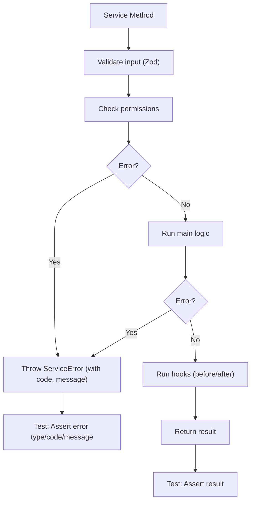

# Service Implementation Guide

**How to create robust, type-safe, and extensible services in `@repo/service-core`.**

---

## 🚀 Implementation Status Overview (2024)

### ✅ Production-Ready Service Architecture

This guide reflects the current state of a **mature, fully-implemented service layer** with:

**16 Services Fully Implemented:**
- Core business logic for accommodations, destinations, users, posts, events
- Complete CRUD operations with permission systems
- Advanced features like reviews, sponsorships, bookmarks, and tagging
- Comprehensive validation, normalization, and error handling

**Architecture Excellence:**
- BaseService/BaseCrudService patterns proven at scale
- Zod validation with TypeScript strict mode throughout
- 90%+ JSDoc documentation coverage  
- 100% English codebase (internationalization complete)
- Comprehensive test suites with factory patterns

**Modern Patterns (2024 Updates):**
- Updated method signatures: `(actor, params)` instead of `ServiceInput<T>`
- Enhanced permission systems with detailed logging
- Improved error handling with structured ServiceError codes
- Advanced normalizers and slug generation patterns

This guide serves as both implementation reference and quality standard for future service development.

---

## 1. Overview

All services must:

- Extend `BaseService<TEntity, TModel, TCreateSchema, TUpdateSchema, TSearchSchema>`
- Use Zod schemas for all input validation, and infer TypeScript types from them
- Implement permission hooks, lifecycle hooks, and error handling as described below
- Be fully covered by robust, DRY, and type-safe tests

---

## 2. Step-by-Step: Creating a New Service

### 2.1. Define Zod Schemas and Types

- Place schemas in `@repo/schemas` or a local `schemas.ts` file.
- Always use Zod for validation.
- Infer TypeScript types from schemas.

```ts
// src/services/destination/destination.schemas.ts
import { z } from 'zod';

export const CreateDestinationSchema = z.object({
  name: z.string().min(3),
  country: z.string(),
  // ...other fields
});
export type CreateDestinationInput = z.infer<typeof CreateDestinationSchema>;

export const UpdateDestinationSchema = CreateDestinationSchema.partial();
export type UpdateDestinationInput = z.infer<typeof UpdateDestinationSchema>;

export const SearchDestinationSchema = z.object({
  filters: z.object({
    country: z.string().optional(),
    // ...other filters
  }).optional()
});
export type SearchDestinationInput = z.infer<typeof SearchDestinationSchema>;
```

---

### 2.2. Implement the Service Class

- Extend `BaseService`.
- Implement all required abstract properties and hooks.
- Use the correct Zod schemas and types.

```ts
import { BaseService } from '../../base';
import type { DestinationModel } from '@repo/db';
import type { DestinationType } from '@repo/types';
import type { ServiceContext, ServiceLogger } from '../../types';
import {
  CreateDestinationSchema,
  UpdateDestinationSchema,
  SearchDestinationSchema
} from './destination.schemas';

export class DestinationService extends BaseService<
  DestinationType,
  DestinationModel,
  typeof CreateDestinationSchema,
  typeof UpdateDestinationSchema,
  typeof SearchDestinationSchema
> {
  protected readonly entityName = 'destination';
  protected readonly model: DestinationModel;
  protected readonly logger: ServiceLogger;
  protected readonly createSchema = CreateDestinationSchema;
  protected readonly updateSchema = UpdateDestinationSchema;
  protected readonly searchSchema = SearchDestinationSchema;

  constructor(ctx: ServiceContext, model?: DestinationModel) {
    super();
    this.logger = ctx.logger;
    this.model = model ?? new DestinationModel();
  }

  // --- Permission Hooks ---
  protected _canCreate(actor, data) { /* ... */ }
  protected _canUpdate(actor, entity) { /* ... */ }
  protected _canSoftDelete(actor, entity) { /* ... */ }
  protected _canHardDelete(actor, entity) { /* ... */ }
  protected _canRestore(actor, entity) { /* ... */ }
  protected _canView(actor, entity) { /* ... */ }
  protected _canList(actor) { /* ... */ }
  protected _canSearch(actor) { /* ... */ }
  protected _canCount(actor) { /* ... */ }
  protected _canUpdateVisibility(actor, entity, newVisibility) { /* ... */ }

  // --- Lifecycle Hooks (optional) ---
  protected async _beforeCreate(data, actor) { /* ... */ }
  protected async _afterCreate(entity, actor) { /* ... */ }
  // ...other hooks as needed

  /**
   * --- Input Normalization and Slug Generation (DestinationService Example) ---
   *
   * DestinationService uses dedicated normalizer functions for create, update, list, and view inputs.
   * This ensures defaults (e.g., visibility) and future extensibility for data cleaning.
   *
   * The _beforeCreate hook generates a unique slug from the name using generateDestinationSlug,
   * guaranteeing uniqueness in the database.
   *
   * Example:
   * ```ts
   * import { normalizeCreateInput } from './destination.normalizers';
   * const normalized = normalizeCreateInput(input, actor);
   *
   * protected async _beforeCreate(data, actor) {
   *   const slug = await generateDestinationSlug(data.name);
   *   return { slug };
   * }
   * ```
   *
   * See tests in test/services/destination/normalizers.test.ts for full coverage.
   */

  // --- Custom Methods (optional) ---
  public async getSummary(actor, data) { /* ... */ }
  // ...other custom methods
}
```

---

### 2.3. Implement Permissions and Error Handling

- Use the provided `ServiceError` and `ServiceErrorCode` for all errors.
- Throw `ServiceError` in permission hooks if access is denied.
- Always validate input with the correct Zod schema.

#### Visual: Error Handling & Validation Flow

This diagram shows how a service method validates input, checks permissions, and handles errors in a robust, homogeneous way:



---

### 2.4. Ensure Strong Typing and Extensibility

- Never use `any`.
- Always infer types from Zod schemas.
- Use the RO-RO pattern (Receive Object / Return Object).
- Prefer composition and utility functions for shared logic.

---

### 2.5. Checklist Before Committing

- [ ] All Zod schemas and types are defined and in sync.
- [ ] All required hooks and properties are implemented.
- [ ] All errors use `ServiceError` and codes.
- [ ] No `any` or implicit types.
- [ ] All public methods are documented with JSDoc.
- [ ] Tests are written and pass (see [Testing Guide](../../test/README.testing.md)).

---

### 2.6. Service Method Signature Convention (Updated 2024)

All public service methods **must**:

- Receive parameters as `(actor, params)` where actor is the first argument
- Return a `Promise<ServiceOutput<T>>`
- Validate params with `.strict()` Zod schemas

**Why?**

- Guarantees homogeneous error handling and result structure
- Enables centralized logging and permission checks
- Ensures strong typing and predictability
- Facilitates future extensibility (e.g., tracing, auditing)
- Clearer separation between authentication and business data

**Example:**

```ts
import type { ServiceOutput } from '../../types';
import type { Actor } from '@repo/types';
import type { GetSummaryInput, DestinationSummary } from './destination.schemas';

public async getSummary(
  actor: Actor, 
  params: GetSummaryInput
): Promise<ServiceOutput<{ summary: DestinationSummary }>> {
  // ...implementation
}
```

**Checklist addition:**

- [ ] All public methods use `(actor, params)` signature and return `ServiceOutput<T>`

---

### 2.7. Service Method Implementation Convention

All public service methods **must** be implemented using `runWithLoggingAndValidation`. This ensures:

- Centralized logging for every method call
- Consistent error handling and result structure
- Automatic input validation and permission checks
- Extensibility for future cross-cutting concerns (e.g., tracing, auditing)

**Example:**

```ts
import type { ServiceOutput } from '../../types';
import type { Actor } from '@repo/types';
import type { GetSummaryInput, DestinationSummary } from './destination.schemas';

public async getSummary(
  actor: Actor, 
  params: GetSummaryInput
): Promise<ServiceOutput<{ summary: DestinationSummary }>> {
  return this.runWithLoggingAndValidation({
    methodName: 'getSummary',
    actor,
    params,
    schema: GetSummarySchema.strict(),
    execute: async (validated, actor) => {
      // ...main logic here
      return { summary: /* ... */ };
    }
  });
}
```

**Checklist addition:**

- [ ] All public methods use `runWithLoggingAndValidation` for their implementation

---

### 2.8. Permission Helpers Pattern

- Every service **must** have a dedicated permission helpers file (e.g., `accommodation.permissions.ts`, `destination.permission.ts`).
- All permission helpers **must** throw a `ServiceError` with `ServiceErrorCode.FORBIDDEN` if the actor does not have permission.
- Always use the entity-specific `PermissionEnum` values (e.g., `PermissionEnum.DESTINATION_CREATE`).
- Follow the homogeneous pattern established in `accommodation.permissions.ts` for all permission checks.
- All permission helpers **must** be fully tested.

**Example:**

```ts
export function checkCanCreateDestination(actor: Actor, _data: unknown): void {
  if (!actor) throw new ServiceError(ServiceErrorCode.FORBIDDEN, 'Forbidden: no actor');
  if (!hasPermission(actor, PermissionEnum.DESTINATION_CREATE)) {
    throw new ServiceError(ServiceErrorCode.FORBIDDEN, 'Permission denied to create destination');
  }
}
```

---

### 2.9. Stub Methods Must Use the Homogeneous Pipeline

- All public methods, **including stubs or not-yet-implemented methods**, must use `runWithLoggingAndValidation` and return a homogeneous error structure.
- Never throw raw errors or return unstructured errors, even for stubs.
- Use `ServiceErrorCode.NOT_IMPLEMENTED` for methods that are not yet implemented.

**Example:**

```ts
public async myStubMethod(_input: object, _actor: Actor): Promise<ServiceOutput<never>> {
  return this.runWithLoggingAndValidation({
    methodName: 'myStubMethod',
    input: { actor: _actor, ..._input },
    schema: z.any(),
    execute: async () => {
      throw new ServiceError(ServiceErrorCode.NOT_IMPLEMENTED, 'Not implemented');
    }
  });
}
```

**Checklist addition:**

- [ ] All public methods, including stubs, use `runWithLoggingAndValidation` and return a structured error with `ServiceErrorCode.NOT_IMPLEMENTED` if not implemented.

---

### 2.10. Testing Stubs and Permission Errors

- Do **not** write tests for stub methods (methods that only return NOT_IMPLEMENTED). Only test real, implemented logic.
- For permission errors, always assert on the returned error object (`result.error?.code`), never expect a thrown exception.
- All permission checks must be performed before any business logic, and errors must be returned in the homogeneous structure.

**Example (testing permission error):**

```ts
const result = await service.getSummary(input);
expect(result.error?.code).toBe('FORBIDDEN');
```

**Checklist addition:**

- [ ] No tests for stub methods.
- [ ] All permission errors are asserted on the returned error object, not via thrown exceptions.

---

## 3. Handling Related Entities: `BaseRelatedService`

For services that manage a primary entity and also a relation (or "pivot") table, such as `TagService` which handles `Tag` and `REntityTag`, you must use `BaseRelatedService`.

### 3.1. What is it and why use it?

`BaseRelatedService` is an abstract class that extends `BaseService` and adds a `relatedModel` property. Its purpose is to standardize how services interact with relation models, making the code more predictable and maintainable.

**When to use it:**

- When a service needs to manage a pivot table for many-to-many relationships (e.g., `AccommodationAmenityService`).
- When a service handles polymorphic relationships (e.g., `TagService` which can tag `Posts`, `Events`, etc.).

### 3.2. How to implement it?

1. **Extend `BaseRelatedService`**: Instead of `BaseService`.
2. **Provide the `TRelatedModel` type**: Add the relation model type to the generics.
3. **Update the constructor**: It must call `super(ctx, relatedModel)` to inject the relation model.
4. **Implement `createDefaultRelatedModel`**: This abstract method must return a new instance of the relation model.

**Example (`TagService`):**

```ts
import { BaseRelatedService } from '../../base/base.related-service';
import { TagModel, REntityTagModel } from '@repo/db';
import type { TagType } from '@repo/types';
import type { ServiceContext } from '../../types';

export class TagService extends BaseRelatedService<
  TagType,
  TagModel,
  REntityTagModel, // The relation model
  typeof CreateTagSchema,
  typeof UpdateTagSchema,
  typeof SearchTagSchema
> {
  // ... other properties

  constructor(ctx: ServiceContext, model?: TagModel, relatedModel?: REntityTagModel) {
    super(ctx, relatedModel); // Pass relatedModel to the parent constructor
    this.model = model ?? new TagModel();
  }

  protected createDefaultRelatedModel(): REntityTagModel {
    return new REntityTagModel();
  }

  // ... other service methods
}
```

---

## 3. Advanced Patterns & Anti-Patterns

### Patterns

- Use base permission helpers (`defaultCanView`, etc.) unless you need custom logic.
- Use `runWithLoggingAndValidation` for all public methods.
- Use composition for cross-cutting logic (e.g., hooks, utilities).
- Keep services thin—domain logic only.

### Anti-Patterns & Common Mistakes

- Duplicating logic already in `BaseService` or helpers.
- Using `any` or implicit types.
- Throwing raw errors (always use `ServiceError`).
- Hand-rolling mocks or test data (always use factories/builders).
- Skipping validation or permission checks.
- Not documenting custom logic or overrides.
- Mixing business logic with infrastructure (DB, API calls) in the service.
- Not using the RO-RO pattern (passing primitives instead of objects).
- Forgetting to update tests after changing service logic.

---

## 4. Security & Validation

- Always validate all input with Zod schemas before any logic or DB call.
- Never trust client input—validate and sanitize.
- Use permission hooks for every action (create, update, delete, view, etc.).
- Never expose sensitive data in errors or logs.
- Use strong typing to prevent injection or unsafe operations.
- Document all security-sensitive logic and edge cases.

---

## 5. Performance & Scalability

- Use batch operations for bulk updates/deletes.
- Avoid N+1 queries—fetch related data efficiently.
- Use hooks for async side effects (e.g., notifications) to keep main flow fast.
- Profile and test performance for large datasets.
- Prefer stateless, idempotent methods for scalability.
- Document any known performance bottlenecks or trade-offs.

---

## 6. Large Refactors & Migrations

- Plan refactors in phases: types/schemas, logic, tests, docs.
- Use feature flags or toggles for risky changes.
- Update all tests and docs after any breaking change.
- Communicate changes to the team and review with seniors.
- Always run typecheck, lint, and full test suite after each phase.
- Document migration steps and rationale in the PR or migration guide.

---

## 7. Visual Checklist: Building a Service

1. **Define Zod schemas and infer types**
2. **Extend BaseService** with correct generics
3. **Implement permission hooks** (use base helpers if possible)
4. **Implement lifecycle hooks** (optional, for side effects)
5. **Add custom methods if needed**
6. **Validate all input and actor**
7. **Use runWithLoggingAndValidation for all public methods**
8. **Throw ServiceError for all errors**
9. **Write/Update robust, DRY, type-safe tests**
10. **Document all public methods and custom logic**
11. **Run typecheck, lint, and tests**
12. **Ask for review if unsure!**

---

## 8. Complete Example: AccommodationService

```ts
// 1. Define schemas and types
import { z } from 'zod';
export const NewAccommodationInputSchema = z.object({
  name: z.string().min(3),
  slug: z.string().min(3),
  type: z.enum(['HOTEL', 'HOSTEL', 'APARTMENT']),
  visibility: z.enum(['PUBLIC', 'PRIVATE']),
});
export type NewAccommodationInput = z.infer<typeof NewAccommodationInputSchema>;

// 2. Implement the service
import { BaseService, ServiceError } from '@repo/service-core';
import { AccommodationModel } from '@repo/db';
import type { AccommodationType } from '@repo/types';

export class AccommodationService extends BaseService<
  AccommodationType,
  AccommodationModel,
  typeof NewAccommodationInputSchema,
  typeof NewAccommodationInputSchema,
  unknown
> {
  protected readonly entityName = 'accommodation';
  protected readonly model: AccommodationModel;
  protected readonly createSchema = NewAccommodationInputSchema;
  protected readonly updateSchema = NewAccommodationInputSchema;
  protected readonly searchSchema = undefined;

  constructor(model?: AccommodationModel) {
    super();
    this.model = model ?? new AccommodationModel();
  }

  protected _canCreate(actor, data) {
    if (!actor || actor.role !== 'ADMIN') throw new ServiceError('FORBIDDEN', 'Only admins can create.');
    return true;
  }
  protected _canView(actor, entity) {
    if (entity.visibility === 'PUBLIC') return true;
    if (actor && actor.role === 'ADMIN') return true;
    throw new ServiceError('FORBIDDEN', 'Not allowed to view.');
  }

  public async create(actor, input) {
    this._canCreate(actor, input);
    const validated = this.createSchema.parse(input);
    return await this.model.create(validated);
  }

  public async getById(actor, { id }) {
    const entity = await this.model.findById(id);
    this._canView(actor, entity);
    return entity;
  }
}
```

---

## 9. Advanced Examples

### Batch Operations

```ts
public async batchUpdateVisibility(actor: Actor, ids: string[], visibility: VisibilityEnum) {
  this._canUpdateVisibility(actor, null, visibility);
  // Validate all IDs, fetch entities, check permissions in bulk
  // Perform batch update in the model
  return await this.model.updateMany({ id: { in: ids } }, { visibility });
}
```

### Custom Queries

```ts
public async findByCustomCriteria(actor: Actor, criteria: CustomCriteria) {
  this._canSearch(actor);
  // Compose query based on criteria
  return await this.model.findCustom(criteria);
}
```

### Advanced Hooks

```ts
protected async _beforeCreate(data, actor) {
  // Enrich data, audit, or trigger side effects
  if (!data.slug) data.slug = slugify(data.name);
  return data;
}

protected async _afterCreate(entity, actor) {
  // Trigger async jobs, notifications, etc.
  await this.notificationService.sendCreatedNotification(entity, actor);
}
```

### Composing Permissions

```ts
protected _canUpdate(actor, entity) {
  if (this.isAdmin(actor)) return true;
  if (this.isOwner(actor, entity)) return true;
  if (entity.visibility === 'PUBLIC') return true;
  return false;
}
```

### Integrating with Other Services

```ts
public async createWithRelated(actor, input) {
  this._canCreate(actor, input);
  const entity = await this.create(actor, input);
  await this.relatedService.linkToEntity(entity.id, input.relatedId);
  return entity;
}
```

---

## 10. Troubleshooting & FAQ

**Q: My service throws a raw error or returns inconsistent errors.**
A: Always throw `ServiceError` with a code. Never throw raw errors.

**Q: How do I add a new permission or lifecycle hook?**
A: Override the relevant method in your service, and document why.

**Q: How do I keep Zod schemas and TypeScript types in sync?**
A: Always infer types from Zod schemas (`z.infer<typeof MySchema>`).

**Q: How do I test my service?**
A: See [Testing Guide](../../test/README.testing.md) for full patterns, helpers, and coverage checklist.

**Q: How do I extend the pattern for batch/custom operations?**
A: Add new helpers to `BaseService` or utility modules, and document them.

---

## 11. Extending & Scaling

- For advanced use cases (batch ops, custom queries), add helpers to `BaseService` or utility modules.
- Compose permission helpers for complex logic.
- Document all customizations and deviations from the base pattern.

---

## 12. Resources & References

- [Testing Guide](../../test/README.testing.md)
- [BaseService API](../base/base.service.ts)
- [TypeScript Handbook](https://www.typescriptlang.org/docs/handbook/)
- [Zod Documentation](https://zod.dev/)

---

## 13. Quality Checklist

- [ ] All Zod schemas and types are defined and in sync
- [ ] All required hooks and properties are implemented
- [ ] All errors use `ServiceError` and codes
- [ ] No `any` or implicit types
- [ ] All public methods are documented with JSDoc
- [ ] Tests are written and pass (see [Testing Guide](../../test/README.testing.md))
- [ ] All code follows naming and architectural conventions
- [ ] All logic is robust, DRY, and type-safe

---

## 14. Glossary

- **Service:** Class encapsulating business logic for a domain entity
- **BaseService:** Abstract class all services extend, providing common logic
- **Factory/Builder:** Utility for generating test data or mocks in a DRY, type-safe way
- **Zod:** Runtime validation library used for all schemas
- **RO-RO Pattern:** Receive Object / Return Object—public methods always take and return objects
- **SOLID:** Set of design principles for maintainable, extensible code
- **Batch Operation:** Performing an action on multiple entities in a single call (e.g., updateMany)
- **Custom Query:** Querying the model with non-standard or dynamic criteria
- **Lifecycle Hook:** Method called before/after a main action (e.g., _beforeCreate,_afterUpdate)
- **Permission Composition:** Combining multiple permission checks for flexible access control
- **Integration:** Calling or coordinating with other services or modules
- **Audit Trail:** Recording actions or changes for traceability
- **Side Effect:** An action triggered as a result of a service method (e.g., sending notifications)
- **Feature Flag:** Mechanism to enable/disable features or code paths at runtime
- **Idempotent:** An operation that can be performed multiple times without changing the result
- **Stateless:** Service methods that do not rely on internal state between calls
