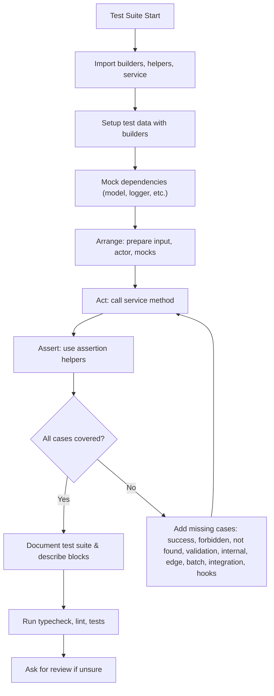
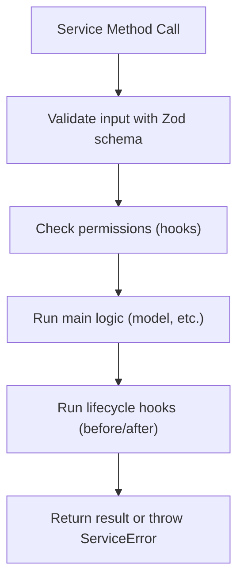
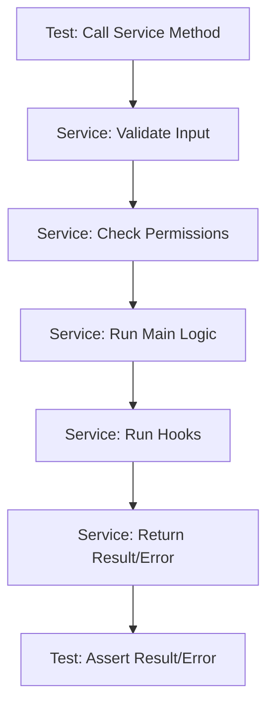

# Testing Guide for Services

**How to write robust, DRY, and type-safe tests for all services in `@repo/service-core`.**

---

## 1. Overview

All service tests must:

- Use the unified builders and helpers for mocks and test data
- Cover all cases: success, forbidden, not found, validation, internal error, edge cases
- Be fully type-safe (no `any`)
- Be DRY, readable, and maintainable

---

## 2. Test Structure & Organization

- Place all service tests in `test/services/<service>/`
- Use **one file per method** (e.g., `create.test.ts`, `getById.test.ts`, `addFaq.test.ts`)
- For each public method (including inherited CRUD and custom methods), create a dedicated test file named after the method (e.g., `getByAuthor.test.ts`, `getUpcoming.test.ts`).
- Use AAA (Arrange, Act, Assert) pattern in all tests
- Use the provided builders and helpers for all test data
- All test files and helpers must be documented with JSDoc
- Tests for normalizers, permissions, and helpers must go in their own files: `entityName.normalizers.test.ts`, `entityName.permissions.test.ts`, `entityName.helpers.test.ts`, etc.
- **Do not create a single `<entity>.service.test.ts` file for all methods.**

---

## 2.1. Visual: Test Flowchart

Below is a visual flowchart of the recommended test writing process:



---

## 2.2. Test File Organization Convention

**All service tests must follow this file structure for homogeneity and maintainability:**

- `create.test.ts`, `update.test.ts`, `delete.test.ts`, `restore.test.ts`, `getById.test.ts`, `list.test.ts`, `search.test.ts`, `count.test.ts` (one per CRUD method, even if inherited)
- `entityName.permissions.test.ts` → Permission helpers (e.g., canView, canUpdate, checkCanCreate...)
- `entityName.helpers.test.ts` → Service helpers (e.g., slug generation, utility functions)
- `entityName.normalizers.test.ts` → Input/output normalizers
- `getByAuthor.test.ts`, `getUpcoming.test.ts`, etc. → One file per public/special method

**Rules:**

- No test file should contain unrelated logic (e.g., helpers in permissions, CRUD in helpers, etc.)
- All imports must be clean and only import what is needed for that file's focus
- If a file is not needed (no helpers/normalizers/permissions), it can be omitted
- All test files must be fully type-safe and pass lint/typecheck

**Example for `UserService` and `EventService`:**

- `create.test.ts`, `update.test.ts`, ... (CRUD)
- `user.permissions.test.ts` (permission helpers)
- `user.helpers.test.ts` (helpers)
- `user.normalizers.test.ts` (normalizers)
- `getByAuthor.test.ts`, `getUpcoming.test.ts` (public/special methods)

**This convention must be followed for all services: User, Accommodation, Destination, Event, etc.**

---

## 3. Builders, Helpers & Mocks

### Builders (Factories)

- Use `AccommodationFactoryBuilder`, `ActorFactoryBuilder`, etc., for test data
- All builders extend `BaseFactoryBuilder<T>` and support `.with()` and `.withOverrides()`
- Never hand-roll test data—always use builders

### Mocks

- **All model mocks MUST be created using `createTypedModelMock`** (see `../utils/modelMockFactory.ts`). This ensures all model methods are Vitest mocks (`vi.fn()`) and can be used with `.mockResolvedValue`, `.mockRejectedValue`, etc.
- To access Vitest methods on a model method, use the helper:

```ts
const asMock = <T>(fn: T) => fn as unknown as import('vitest').Mock;
asMock(modelMock.findById).mockResolvedValue(...);
```

- All test data and mocks MUST be created using the provided factories and builders (e.g., `AccommodationFactoryBuilder`, `DestinationFactoryBuilder`).
- If a factory or builder does not exist or lacks a needed feature, it must be created or extended. No hand-rolled or ad-hoc mocks are allowed.

**Example:**

```ts
import { createTypedModelMock } from '../utils/modelMockFactory';
import { AccommodationModel } from '@repo/db';
const modelMock = createTypedModelMock(AccommodationModel, ['findOne']);
asMock(modelMock.findOne).mockResolvedValue(...);
```

- See [`README.md`](../README.md) and [`README.ia.md`](../README.ia.md) for full patterns, troubleshooting, and coverage checklist.

#### Troubleshooting

- If you get `asMock(...).mockResolvedValue is not a function`, ensure you are using `createTypedModelMock` and not a manual mock or the old `createModelMock`.
- All model methods must be replaced by `vi.fn()`; the factory guarantees this.

### Assertion Helpers

- **Always use the helpers from `test/helpers/assertions.ts`** (e.g., `expectSuccess`, `expectForbiddenError`, `expectNotFoundError`, `expectInternalError`, `expectValidationError`, etc.) to assert the results of service methods.
- Do **not** assert error codes or result shapes directly; use the provided helpers for consistency and maintainability.

### 3.1. Testing Input Normalizers and Slug Generation

- For services that use input normalizers (e.g., DestinationService), create a dedicated test file (e.g., `destination.normalizers.test.ts`).
- Test all normalizer functions for correct defaults, pass-through, and edge cases.
- For slug generation logic, mock the model to simulate slug collisions and ensure uniqueness logic is robust.
- See `test/services/destination/destination.normalizers.test.ts` for a full example covering normalizers and slug edge cases.

---

## 4. Example: CRUD Test Template

```ts
import { createServiceTestInstance } from '../helpers/serviceTestFactory';
import { testCrudMethod } from '../templates/crudTestTemplate';
import { AccommodationService } from '../../src/services/accommodation/accommodation.service';
import { AccommodationFactoryBuilder } from '../factories/accommodationFactory';
import { ActorFactoryBuilder } from '../factories/actorFactory';

const getService = () => createServiceTestInstance(AccommodationService);
const getInput = () => new AccommodationFactoryBuilder().public().build();
const getActor = () => new ActorFactoryBuilder().host().build();

testCrudMethod({
  method: 'create',
  getService,
  getInput,
  getActor,
  setupSuccess: () => { /* mock DB/model/permissions for success */ },
  setupForbidden: () => { /* mock permissions to throw */ },
  setupValidation: () => { /* no-op, input inválido */ },
  setupInternal: () => { /* mock DB/model to throw */ },
  setupAfterHook: () => { /* spy on afterCreate */ }
});
```

---

## 5. Anti-Patterns & Common Mistakes

- Hand-rolling test data or mocks (always use builders/helpers)
- Using `any` or implicit types in tests
- Skipping edge/error/forbidden/validation/internal cases
- Duplicating test logic (extract helpers/templates)
- Not using AAA (Arrange, Act, Assert) structure
- Not updating tests after changing service logic
- Testing implementation details instead of public API/behavior
- Not using assertion helpers (expectSuccess, expectForbiddenError, etc.)
- Not documenting test suites or describe blocks
- Not running typecheck/lint/tests before pushing

---

## 6. Security & Validation in Tests

- Always use valid and invalid data to test validation logic
- Never leak sensitive data in test logs or error messages
- Test permission/authorization boundaries (forbidden, allowed)
- Use type inference from Zod schemas for all test inputs
- Test for injection or unsafe input if relevant
- Document any security-sensitive test scenarios

---

## 7. Performance & Scalability of Tests

- Use batch tests for bulk operations
- Avoid unnecessary setup/teardown in each test (use beforeEach wisely)
- Keep tests fast and focused (avoid slow DB/network calls)
- Use mocks for all external dependencies
- Profile test suite if it grows large (Vitest has profiling tools)
- Prefer stateless, idempotent test logic

---

## 8. Migrating & Refactoring Tests

- Refactor in phases: helpers/builders, test logic, docs
- Update all tests after any breaking service change
- Use test templates to DRY up repeated logic
- Communicate big test refactors to the team
- Always run typecheck, lint, and full test suite after each phase
- Document migration steps and rationale in the PR or migration guide

---

## 9. Visual: Service Validation & Permission Flow

This diagram shows the flow inside a service method, from input validation to error handling:



---

## 10. Visual: Test-Service-Assert Cycle

This diagram shows the full cycle from test to service and back to assertion:



---

## 11. Complete Example: AccommodationService.create

```ts
import { AccommodationService } from '../../src/services/accommodation/accommodation.service';
import { createServiceTestInstance } from '../helpers/serviceTestFactory';
import { AccommodationFactoryBuilder } from '../factories/accommodationFactory';
import { ActorFactoryBuilder } from '../factories/actorFactory';
import { expectSuccess, expectForbiddenError, expectValidationError } from '../helpers/assertions';

describe('AccommodationService.create', () => {
  let service: AccommodationService;
  let actor: any;
  let input: any;

  beforeEach(() => {
    service = createServiceTestInstance(AccommodationService);
    actor = new ActorFactoryBuilder().admin().build();
    input = new AccommodationFactoryBuilder().public().build();
  });

  it('should create accommodation (success)', async () => {
    service.model.create.mockResolvedValue({ ...input, id: 'acc-1' });
    const result = await service.create(actor, input);
    expectSuccess(result);
  });

  it('should return forbidden if actor is not admin', async () => {
    const user = new ActorFactoryBuilder().guest().build();
    const result = await service.create(user, input);
    expectForbiddenError(result);
  });

  it('should return validation error for invalid input', async () => {
    // @ts-expect-error: purposely invalid
    const result = await service.create(actor, {});
    expectValidationError(result);
  });

  it('should handle internal error', async () => {
    service.model.create.mockRejectedValue(new Error('DB error'));
    const result = await service.create(actor, input);
    expect(result.error?.code).toBe('INTERNAL_ERROR');
  });

  it('should handle edge case: duplicate slug', async () => {
    service.model.create.mockRejectedValue(new Error('Duplicate slug'));
    const result = await service.create(actor, { ...input, slug: 'existing-slug' });
    expect(result.error?.code).toBe('INTERNAL_ERROR');
  });
});
```

---

## 12. Advanced Test Examples

### Batch Operation Test

```ts
describe('batchUpdateVisibility', () => {
  it('should update visibility for multiple entities', async () => {
    const service = createServiceTestInstance(MyService);
    const actor = new ActorFactoryBuilder().admin().build();
    const ids = ['id1', 'id2'];
    service.model.updateMany.mockResolvedValue(/* ... */);
    const result = await service.batchUpdateVisibility(actor, ids, 'PUBLIC');
    expectSuccess(result);
  });
});
```

### Hook Test

```ts
describe('_beforeCreate', () => {
  it('should enrich data with slug', async () => {
    const service = createServiceTestInstance(MyService);
    const data = { name: 'Test' };
    const enriched = await service._beforeCreate(data, {});
    expect(enriched.slug).toBeDefined();
  });
});
```

### Integration Test (with another service)

```ts
describe('createWithRelated', () => {
  it('should create entity and link related', async () => {
    const service = createServiceTestInstance(MyService);
    service.relatedService = { linkToEntity: vi.fn() };
    const actor = new ActorFactoryBuilder().admin().build();
    const input = { ... };
    await service.createWithRelated(actor, input);
    expect(service.relatedService.linkToEntity).toHaveBeenCalled();
  });
});
```

### Edge Case Test

```ts
describe('create', () => {
  it('should return validation error for empty input', async () => {
    const service = createServiceTestInstance(MyService);
    const actor = new ActorFactoryBuilder().admin().build();
    // @ts-expect-error: purposely invalid
    const result = await service.create(actor, {});
    expectValidationError(result);
  });
});
```

---

## 13. Coverage Checklist

- [ ] Success (happy path)
- [ ] Forbidden (permission denied)
- [ ] Not found (entity does not exist)
- [ ] Validation error (invalid input)
- [ ] Internal error (DB or logic error)
- [ ] Edge cases (empty input, already deleted, etc.)
- [ ] Batch operations
- [ ] Hooks and side effects
- [ ] Integration with other services

---

## 14. Best Practices

- Use only the provided builders and helpers—never hand-roll mocks or test data
- Always use type inference from Zod schemas for test inputs
- Keep tests short, focused, and readable
- Use JSDoc for all test suites and describe blocks
- Prefer one assertion per test (unless testing error + data)
- Use descriptive test names ("should return forbidden if actor is not admin")
- Use `beforeEach` for setup, not for assertions
- Mock only what is needed for the test
- Avoid testing base service logic (logging, validation) unless you extend/override it

---

## 15. Troubleshooting & FAQ

**Q: My test fails with a type error.**
A: Ensure all test data is built with factories and types are inferred from Zod schemas.

**Q: My test fails due to a missing mock method.**
A: Add the method to the model mock using `createModelMock(['methodName'])`.

**Q: How do I test a custom method or hook?**
A: Use the same AAA pattern, and mock/spyon the hook as needed.

**Q: How do I ensure coverage for edge cases?**
A: Use the checklist above and add tests for all possible branches.

**Q: How do I DRY up repeated test logic?**
A: Extract setup into `beforeEach` or use test templates/helpers.

---

## 16. Quality Checklist

- [ ] All test data is built with factories/builders
- [ ] All mocks use centralized helpers
- [ ] All assertion helpers are used for error/success cases
- [ ] All public methods have full coverage (see checklist)
- [ ] No `any` or implicit types
- [ ] All test files and helpers are documented with JSDoc
- [ ] Tests are robust, DRY, and type-safe

---

## 17. Resources & References

- [Service Implementation Guide](../../src/services/README.service.md)
- [BaseService API](../../src/base/base.service.ts)
- [Vitest Docs](https://vitest.dev/)
- [Zod Docs](https://zod.dev/)

---

## 18. Glossary

- **Builder/Factory:** Utility for generating test data or mocks in a DRY, type-safe way
- **AAA:** Arrange, Act, Assert—testing pattern
- **Mock:** Fake implementation of a dependency (e.g., model, logger)
- **Edge Case:** Unusual or extreme input/scenario
- **Assertion Helper:** Utility for checking expected results or errors
- **Batch Test:** Test that covers operations on multiple entities at once
- **Hook Test:** Test that covers before/after hooks or side effects
- **Integration Test:** Test that covers interaction between two or more services
- **Coverage:** The degree to which your tests exercise all code paths and scenarios
- **Spy:** A function that records how it was called, used to assert side effects
- **Idempotent Test:** A test that can be run multiple times with the same result
- **Stateless Test:** A test that does not depend on or modify global state
- **Migration:** The process of updating or refactoring tests to match new service logic
- **Type Inference:** Automatically deriving types from schemas or data

---

## 🛑 Error Handling in Tests

- Always expect errors to be thrown using `ServiceError` and a `ServiceErrorCode` (never `throw new Error`).
- This applies to all service methods, helpers, and especially permission helpers.
- Example:

```ts
import { ServiceError } from '@repo/service-core';
import { ServiceErrorCode } from '@repo/types';

if (!actor) throw new ServiceError(ServiceErrorCode.FORBIDDEN, 'Forbidden: no actor');
```

- In tests, always assert for `ServiceError` and the correct code (e.g., `FORBIDDEN`).
- See permission helpers and service methods for usage patterns.
